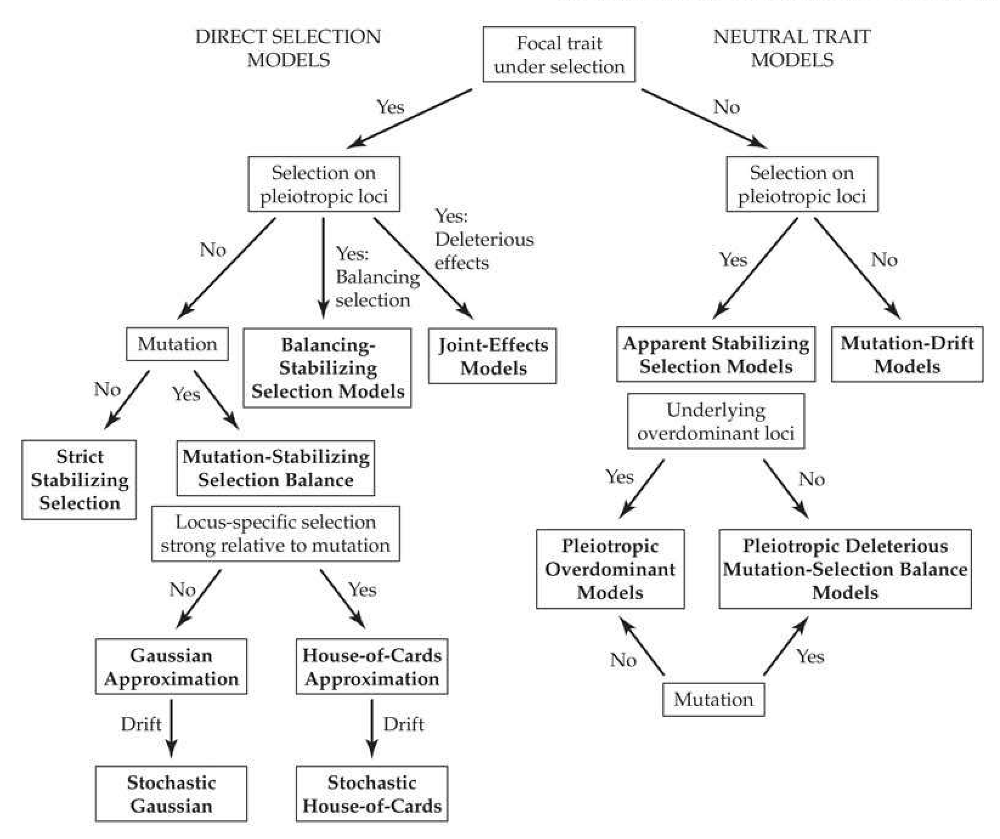
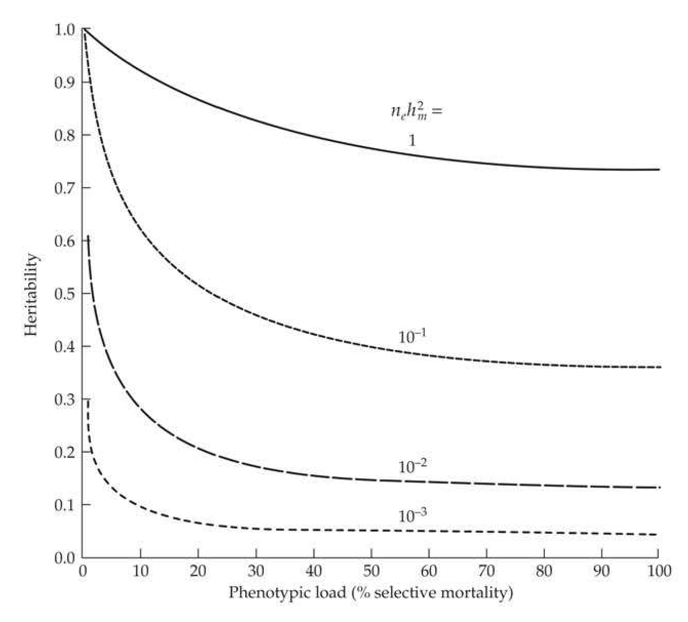
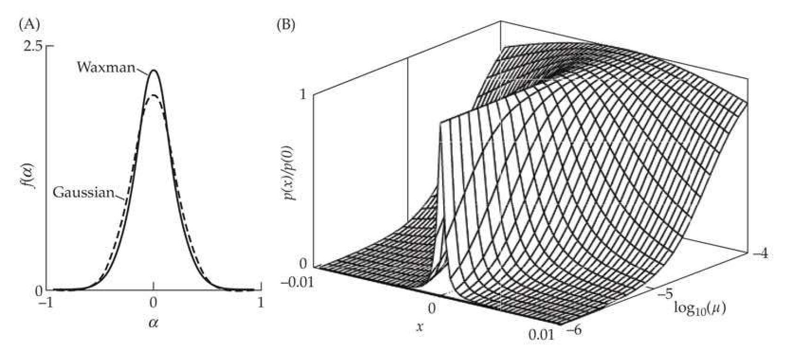
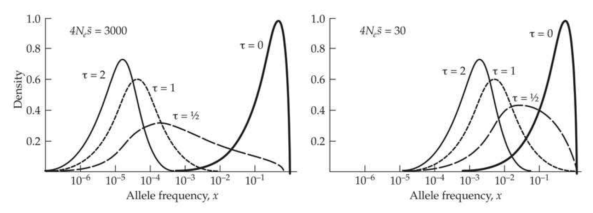
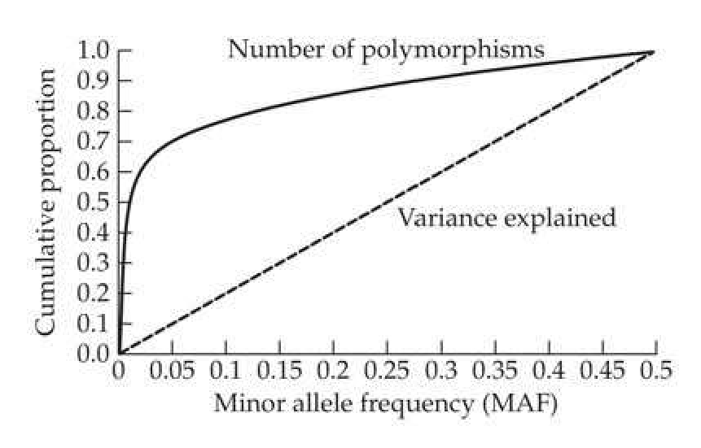
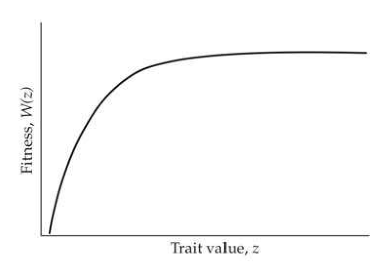
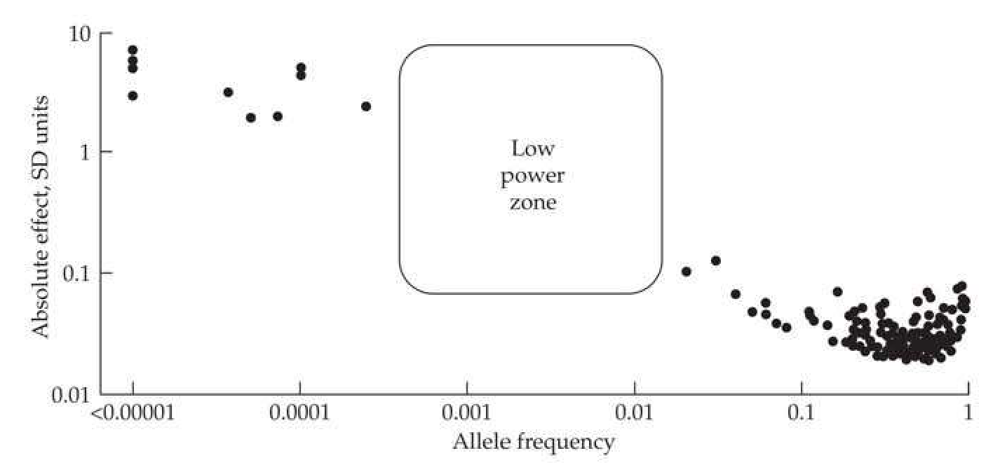

# Chapter 28 · Maintenance of Quantitative Genetic Variation

## chapter28_001 · Maintenance of Quantitative Genetic Variation: Introduction

Empirical studies of quantitative genetic variation have revealed robust patterns that are observed both across traits and across species. However, these patterns have no compelling explanation, and some of the observations even appear to be mutually incompatible. Johnson and Barton (2005)

How wonderful that we have met with a paradox. Now we have some hope of making progress. Niels Bohr

Genetic variation is a ubiquitous feature of natural populations. The nature of the forces responsible for the maintenance of this variation, be it the distribution of allele frequencies, the level of heterozygosity, the amount of additive variation in a trait, or the joint distribution of allele frequencies and their effects, have long been of concern to both population and quantitative geneticists. The basic explanation is some balance of evolutionary forces: mutation/migration introducing new variation, which is removed by drift and/or selection against deleterious alleles. In some cases, selection by itself can maintain variation, such as when heterozygotes are advantageous. These various explanations are not mutually exclusive, and theorists have spent a great deal of effort in building models to examine the plausibility of each scenario. If the required parameter space to maintain variation is very narrow, a particular mechanism may account for the maintenance of variation in specific cases but is unlikely to be a general explanation.

Despite a wealth of possible explanations for the maintenance of variation, this is an area of some frustration among quantitative geneticists. At present, there are difficulties in reconciling most (some would say all) of the proposed explanations with estimates of observable parameters (such as the strength of the apparent stabilizing selection on a trait, its heritability, and the mutational variance). As this is a subject with a substantial body of complex theory, we present many of the derivational details in examples, which allows us to focus on the key results while still presenting the logic and assumptions behind the models. Reviews of the struggle to explain quantitative-genetic variation can be found in Nagylaki (1984), Turelli (1984, 1986, 1988), Barton and Turelli (1989), Bulmer (1989), Bürger (1998, 2000), Barton and Keightley (2002), Johnson and Barton (2005), Zhang and Hill (2005b, 2010), and Mitchell-Olds et al. (2007). Bürger (2000) is the standard reference for much of the theory developed here, and should be consulted by the more mathematically inclined reader.

---

## chapter28_002 · Maintenance of Quantitative Genetic Variation: Introduction / OVERVIEW: THE MAINTENANCE OF VARIATION

Earlier chapters explored the roles of the major evolutionary forces (drift, mutation, and selection) and important modifiers (recombination and migration) in the maintenance of polymorphisms at individual loci. The effects of drift (removing variation) and mutation (generating variation) are straightforward (Chapter 2), while the effects of selection are more complicated, as it either retains or removes variation, depending on its nature (Chapter 5). With constant selection coefficients, overdominance (heterozygote advantage) retains variation in large populations, while all other constant-fitness schemes remove it (Figure 5.1). Selection can retain variation under a variety of circumstances when fitnesses vary, which we loosely lump together under the umbrella term of balancing selection. These conditions include frequency-dependent selection when rare alleles are favored, tradeoffs among different fitness components, sex-specific differences, and fitness changes over time and/or space (G × E). The conditions necessary to maintain variation can be rather delicate. for many of these strictly selective explanations.

The result of interactions between evolutionary forces can be straightforward—such as the mutation-drift equilibrium (Equation 2.24) or mutation-selection balance for deleterious alleles (Equation 7.6)—or they can be subtle and counterintuitive, such as the joint impact of selection, mutation, drift and recombination on the levels of variation under selective sweeps (Chapter 8). The goal in this chapter is build on these results in an attempt to explain the nature of the evolutionary forces maintaining quantitative-trait variation.

---

## chapter28_003 · OVERVIEW: THE MAINTENANCE OF VARIATION / Maintaining Genetic Variation for Quantitative Traits

Most of our previous results on the maintenance of genetic variation were for population-genetic models, wherein the focus was solely on allele frequencies, and usually quantified by summary statistics such as the heterozygosity or the number of segregating alleles (Chapter 2). In this setting, the most complete equilibrium solution is given by the distribution of allele frequencies, such as Wright's result for a diallelic locus under mutation-selection-drift (Equation 7.31a) or the Watterson distribution for the site-frequency spectrum for mutation-drift balance under an infinite-sites model (Equation 2.34a). For quantitative traits, the allele-frequency distribution, by itself, is not sufficient to describe the equilibrium variation. Instead, one needs the full joint distribution of allele frequencies and their effect sizes, although we typically work with the additive-genetic variance as an appropriate summary statistic. Given the number of scenarios outlined above, it should not be surprising that a plethora of models have been proposed for the maintenance of genetic variation in quantitative traits. Figure 28.1 attempts to bring a little structure to this vast menagerie.

The simplest models are fully neutral: the trait, and its underlying loci, have no effects on fitness, leading to mutation-drift models (Chapters 11 and 12). Their problem is that they generate too much variation if the population size is modest to large. The most obvious correction is that there is some selection on the trait and/or on the underlying loci (independent of their effect on the focal trait). Models incorporating selection can be broken into two categories: those with at least some direct selection on the focal trait, and pleiotropy models that assume a neutral focal trait whose underlying loci have pleiotropic effects on fitness.

A central issue concerning direct-selection models is that stabilizing selection on a trait usually generates underdominance in fitness at its underlying loci, thus removing variation (Example 5.6). Hence, strict stabilizing selection, by itself, cannot account for quantitative-trait variance. This removal of variation could be countered by either mutation (mutation-stabilizing selection balance) or by selectively favored pleiotropic fitness effects. Under the latter scenario, loci underlying the trait under stabilizing selection are also under balancing selection for some other independent component of fitness (balancing-stabilizing selection). The central issue concerning mutation-selection balance is that the estimated strengths of stabilizing selection and polygenic mutation appear to be inconsistent with observed levels of heritability.

A critical question in the maintenance of genetic variation is just how much of observed stabilizing selection is actually real. Pleiotropic models can easily generate apparent (or spurious) stabilizing selection by returning a signature of stabilizing selection in a quadratic regression of fitness on the phenotypic value of a neutral trait (Chapters 29 and 30). Hence, it is possible that some (or perhaps much) of the observed stabilizing selection in nature is not real, but rather is instead due to pleiotropic fitness effects. Under pleiotropic models, the variation at the loci underlying a neutral trait is assumed to be maintained by either overdominant effects on fitness (pleiotropic overdominance) or because the underlying loci are slightly deleterious, but in mutation-selection equilibrium (pleiotropic deleterious mutation-selection balance). The problem with pleiotropy models is that the strength of selection on the underlying loci required to recover the observed strength of apparent stabilizing selection seen in nature is usually inconsistent with some other observable feature of the model. Various combinations of elements of these basic models have been proposed, as have refinements adding additional forces (such as drift), but most give inconsistent results when trying to simultaneously account for observed amounts of selection and variation.

**[Figure]**

> **Figure 28.1** · page 3 · source: `chapter28`
>
> 
>
> Figure 28.1 Flow chart of the various classes of models for the maintenance of quantitative-genetic variance. Roughly speaking, there are direct-effect models that assume that selection is acting on the phenotype of the focal trait (whose variation we are trying to explain) and models that assume that this trait is neutral. Pleiotropic models assume that loci underlying a trait have fitness effects independent of their impact on the focal trait (which is often assumed to be strictly neutral). As detailed below, models also vary in the importance assigned to mutation in countering the removal of genetic variation by selection and drift.

Finally, differences in the assumed granularity of the underlying genetic architecture of a trait can significantly impact the results. If a few loci, each with only a few alleles, underlie a trait, the resulting genotypic values have a fairly granular distribution. The dynamics under stabilizing selection are different when one of these genotypic values matches the optimal stabilizing selection value compared to those of the situation when none do. Likewise, with just a few alleles at a few loci, the opportunity for independent selection on many traits is constrained. Conversely, under continuum-of-alleles (COA) models (Chapter 24), with their large number of alleles at each locus, there is a distribution of allelic effects and the potential for significantly more fine-turning. A key point of this chapter is that the relative strengths of the underlying evolutionary forces dictates which genetic architecture is more appropriate. If drift is strong relative to the other forces, then at most, only a few alleles at a locus are likely (beyond a constellation of very rare new mutations). The same is true when selection is strong relative to mutation. Conversely, when the strength of mutation is greater than the strength of selection or drift at a locus, we expect it to harbor a number of alleles in a large population. As we will see, differences in the strength of mutation relative to selection at a locus lead to qualitatively different results.

The (often fairly technical) analysis of the large number of models given in Figure 28.1 comprises the bulk of the chapter. There are several possible schemes by which to organize and discuss all of these alternative models. Our presentation is centered around increasing the complexity of evolutionary forces and their interactions. We start with drift interacting with neutral mutation, which serves as a useful baseline. We then consider models invoking only selection, either stabilizing selection on the focal trait or balancing selection on loci with pleiotropic effects on a strictly neutral focal trait.

These selection-only considerations provide the background for the major classes of models, those involving both selection and mutation. Much of the discussion on these models focuses on stabilizing selection countered by mutation, including the incorporation of drift. Most of the work on stabilizing selection has assumed either a Gaussian (Equation 28.3b) or quadratic (Equation 28.3a) fitness function. How these results translate to more general fitness functions with a stabilizing component remains a rather open question.

We conclude by discussing models in which a large fraction of the trait variance is assumed to result from pleiotropic effects of deleterious alleles, which are maintained by mutation-selection balance. Our analysis of this last class of models starts with a neutral focal trait, followed by joint-effect models allowing for both stabilizing selection on a focal trait and pleiotropic contributions from deleterious alleles.

To aid the more casual reader, Table 28.3 (near the end of the chapter) summarizes the major inconsistencies for each model, followed by an examination of the current data. This allows the reader to bypass the more technical discussions below, while still obtaining a general overview of the problem. The conclusion from this extensive analysis is that all of the models have significant inconsistencies with current estimates of strength of selection, mutational inputs, and amounts of standing genetic variation. The typical pattern seen is that for a model to accommodate one known feature (e.g., the observed strength of stabilizing selection), the required parameter values result in another known aspect (say, amount of standing variation) being inconsistent with observed values.

---

## chapter28_004 · Maintenance of Quantitative Genetic Variation: Introduction / MUTATION-DRIFT EQUILIBRIUM

The most basic model for the maintenance of variation considers two universal (and counterbalancing) forces, drift and mutation. Chapter 2 examined the distribution of neutral allele frequencies and reviewed various resulting summary statistics under mutation-drift balance. At equilibrium, neutral allele frequencies are given by the Watterson distribution (Equation 2.34a), and the expected heterozygosity (for an infinite-alleles model) is $ \widetilde{H} = \theta/(1 + \theta) $, where $ \theta = 4N_e\mu $ is the product of the effective population size and the mutation rate (Equation 2.24b). The problem with this expression, as noted by Lewontin (1974), is that heterozygosity should quickly approach one in large populations ($ \theta \gg 1 $), yet this is not seen. One possible explanation is that the mutation rate inversely scales with population size, so that $ \theta $ is always $ \ll 1 $ (Chapter 4). Another, not necessarily exclusive, explanation is that selection at linked sites depresses variation by decreasing $ N_e $ (Chapters 3, 8, and 10). The impact on $ N_e $ from a pattern of recurrent sweeps is greatest in very large asexual populations, which otherwise would be predicted to have very high values of $ \widetilde{H} $.

---

## chapter28_005 · MUTATION-DRIFT EQUILIBRIUM / Mutational Models and Quantitative Variation

Chapters 11 and 12 developed the quantitative-genetic analog of $H$ by considering the expected additive variance, $\sigma_A^2$, that is maintained by neutral alleles in mutation-drift equilibrium. Two extensions, both concerning mutation, are required when moving from allelic frequencies to quantitative-trait variation. The first is that the *mutational variance* (the total amount of genetic variation arising in each generation), $\sigma_m^2$, replaces the mutation rate, $\mu$ (Chapter 11). The *mutational variance* contributed by (diploid) locus $i$ is $2\mu_i\sigma_{\alpha_i}^2$, the product of its mutation rate and $\sigma_{\alpha_i}^2$, the variance of *mutational effects* (or *mutational-effects* variance). We use $\sigma_m^2$ to denote an unspecified locus and $\sigma_{\alpha_i}^2$ to denote a specified one. With $n$ equivalent loci, $\sigma_m^2 = 2n\mu\sigma_{\alpha_i}^2$, while $\sigma_m^2 = 2\sum_i\mu_i\sigma_{\alpha_i}^2$ when mutational effects vary over loci.

**[Table]**

> **Table 28.1** · `28.1` · page 5 · source: `chapter28_005`
> Table 28.1 Models for the effect of a new mutation on a quantitative trait. All make the infinite-alleles assumption that each new mutation creates a new allele. The effect,  $ x' $, of this new allele is a function of its current value, x, and a random variable,  $ \alpha \sim (0, \sigma_{\alpha}^2) $. The incremental and house-of-cards (HOC) models are special cases of the Zeng-Cockerham regression model, corresponding to  $ \tau = 1 $ and  $ \tau = 0 $, respectively. Derivations can be found in Chapter 11, and in Zeng and Cockerham (1993).
>
> Model | New Effect | $ \widetilde{\sigma}_{A}^{2} $ | $ \widetilde{\sigma}_{A}^{2} $ as $ N_{e} \rightarrow \infty $
> --- | --- | --- | ---
> Incremental, Random-walk, Brownian-motion | $ x' = x + \alpha $ | $ 4N_{e}\mu n\sigma_{\alpha}^{2} = 2N_{e}\sigma_{m}^{2} $ | Unbounded
> House-of-cards | $ x' = \alpha $ | $ \frac{8N_{e}\mu n\sigma_{\alpha}^{2}}{1 + 4N_{e}\mu} = \frac{4N_{e}\sigma_{m}^{2}}{1 + 4N_{e}\mu} $ | $ 2n\sigma_{\alpha}^{2} = \frac{\sigma_{m}^{2}}{\mu} $
> Regression | $ x' = \tau x + \alpha $ | $ \frac{8N_{e}\mu n\sigma_{\alpha}^{2}}{(1 + \tau)[1 + 4N_{e}\mu(1 - \tau)]} = \frac{4N_{e}\sigma_{m}^{2}/(1 + \tau)}{1 + 4N_{e}\mu(1 - \tau)} $ | $ \frac{2n\sigma_{\alpha}^{2}}{1 - \tau^{2}} = \frac{\sigma_{m}^{2}}{\mu(1 - \tau^{2})} $

As reviewed in LW Chapter 12, the mutational variance can be estimated from the accumulation of additive variance in inbred lines. Such estimates are usually scaled by the environmental variance to yield the mutational heritability, $ h_m^2 = \sigma_m^2 / \sigma_E^2 $, and a typical value is $ h_m^2 = 10^{-3} $ (LW Table 12.1). Estimates of the component features of the mutational variance—the number of loci, $ n $; the per-locus mutation rate, $ \mu $; and the variance of mutational effects, $ \sigma_\alpha^2 $—are far more difficult to obtain. This is unfortunate, as many of the following models require the values of these components ($ n $, $ \mu $, and $ \sigma_\alpha^2 $), rather than their composite measure, $ \sigma_m^2 $. Some crude estimates follow from the widespread observation that $ h_m^2 $ is typically on the order of $ 10^{-3} $. If we assume that $ \sigma_\alpha^2 / \sigma_E^2 = 1 $, then the total trait mutation rate, $ 2n\mu $, will be on the order of $ 10^{-3} $. For $ n = 100 $ loci, this implies a per-locus mutation rate (to new trait alleles) of $ \mu = 5 \cdot 10^{-6} $. If the scaled variance of mutational effects is lower, then either the number of loci and/or the per-locus mutation rate must be correspondingly higher. Lyman et al. (1996) estimated a value of $ \sigma_\alpha^2 / \sigma_E^2 \simeq 0.1 $ for Drosophila bristle number mutations generated by P-element insertions. For $ h_m^2 = 10^{-3} $, this implies $ 2n\mu = 0.01 $ (assuming that $ \sigma_\alpha^2 $ and $ \mu $ for P-element insertions are representative of the wider mutational spectrum, which is unlikely).

**[推导 Derivation]**

The second required extension is some assumption relating the current effect of an allele, $ x $, with its effect, $ x' $, after mutation (Table 28.1). (While we typically use a to denote allelic effects, given the close similarity to our use of $ \alpha $ for the mutational effect, for clarity we will often use $ x $ in this chapter to denote an allelic effect.) The most widely used construct is the incremental model (also referred to as the Brownian-motion or random-walk model). Initially introduced by Clayton and Robertson (1955), and more formally by Crow and Kimura (1964) and Kimura (1965a), this model assumes that $ x' = x + \alpha $, the pre-mutation value plus a random increment, where $ \alpha \sim (0, \sigma_{\alpha}^2) $. When all mutations are additive, Equation 11.20c gives the (diploid population) mutation-drift equilibrium variance under this model as $ \tilde{\sigma}_A^2 = 2N_e \sigma_m^2 $. Equation 11.22a shows the expression for the additive variance when dominance is present. From Equation 11.21a, the expected equilibrium heritability becomes

> **Formula (28.1)** · `28.1` · source: `chapter28_block_019` · Mutational Models and Quantitative Variation
>
> $$ \widetilde{h}^{2}=\frac{2N_{e}h_{m}^{2}}{1+2N_{e}h_{m}^{2}}=1-\frac{1}{1+2N_{e}h_{m}^{2}} $$

Note the connection with the expression for neutral allelic heterozygosity, $ \widetilde{H} $, as both are of the form $ 2N_e y/(1 + 2N_e y) $, with $ y = h_m^2 $ for heritability and $ y = 2\mu $ for heterozygosity. As with $ \widetilde{H} $, even modest values of $ N_e (\sim 1000) $ return $ \widetilde{h}^2 $ values over 0.5, while larger values return heritabilities of close to one. For example, when $ h_m^2 = 0.001 $, $ N_e $ is constrained to be in the range of 50–1200 in order to recover typical heritability values (0.1 to 0.6). As noted in Chapter 11, the incremental mutational model represents one extreme, wherein the value of the new mutation is closely tied to the evolutionary history (x) of its parental allele. The other extreme is the house-of-cards (HOC) model, which was formally developed by Kingman (1977, 1978; although also assumed by Wright 1948b, 1969). Under $ HOC $, $ x' = \alpha $, independent of an allele's starting value $ x $, where again $ \alpha \sim (0, \sigma_{\alpha}^2) $, so that past evolutionary history is completely irrelevant.

**[推导 Derivation]**

The incremental and HOC models present two extremes, one strongly influenced by evolutionary history and the other completely indifferent to it. Zeng and Cockerham (1993) proposed a more general regression model, $ x' = \tau x + \alpha $, where $ 0 \leq \tau \leq 1 $ and $ \alpha \sim (0, \sigma_{\alpha}^2) $ (Table 28.1). The regression coefficient, $ \tau $, indicates the importance of past evolutionary history, recovering the incremental ($ \tau = 1 $) and HOC ($ \tau = 0 $) as special cases. This regression model is an Ornstein-Uhlenbeck process (Equation A1.33), as $ E[\Delta x] = E[x' - x] = -(1 - \tau)x $. The parameter $ \tau $ counters the diffusive effects of Brownian motion (the incremental random $ \alpha $) by exerting a restoring force toward the origin, and thus producing a bounded equilibrium distribution for $ \tilde{\sigma}_A^2 $ (for $ \tau < 1 $). Under the regression model (provided $ \tau \neq 1 $), the equilibrium additive variance in a large population is bounded by $ \sigma_m^2 / [\mu(1 - \tau^2)] $, with a resulting heritability of

> **Formula (28.2a)** · `28.2a` · source: `chapter28_block_021` · Mutational Models and Quantitative Variation
>
> $$ \begin{align*}\widetilde h^2=\frac{\sigma_m^2/[\mu(1-\tau^2)]}{\sigma_m^2/[\mu(1-\tau^2)]+\sigma_E^2}=1-\frac{1}{K+1}\end{align*} $$

where

> **Formula (28.2b)** · `28.2b` · source: `chapter28_block_021` · Mutational Models and Quantitative Variation
>
> $$ K=\frac{h_{m}^{2}}{\mu(1-\tau^{2})}=\frac{2\mu n\sigma_{\alpha}^{2}/\sigma_{E}^{2}}{\mu(1-\tau^{2})}=\frac{2n\sigma_{\alpha}^{2}/\sigma_{E}^{2}}{1-\tau^{2}} $$

**[Figure]**

> **Figure 28.2** · page 6 · source: `chapter28`
>
> 
>
> Figure 28.2 The expected heritability,  $ h^2 $, for large  $ N_e $, at mutation-drift equilibrium under the mutational regression model of Zeng and Cockerham (Equation 28.2a). This model includes the incremental ( $ \tau = 1 $) and HOC ( $ \tau = 0 $) models as special cases. Curves denote different values of  $ h_m^2/(2\mu) = n\sigma_a^2/\sigma_E^2 $, the ratio of the mutational heritability to the per-locus mutation rate.

Figure 28.2 plots $ \tilde{h}^2 $ as a function of $ \tau $ and $ h_m^2/(2\mu) = n\sigma_\alpha^2/\sigma_E $ (the scaled variance of mutational effects over all loci). The expected heritability increases as the role of past evolutionary history of an allele becomes increasingly important in predicting its mutated value (i.e., $ \tilde{h}^2 $ increases with $ \tau $). Likewise, $ \tilde{h}^2 $ increases with the total variance of mutational effects, $ n\sigma_\alpha^2 $. Assuming a typical value of $ h_m^2 = 0.001 $, an underlying per-locus mutation rate of $ \mu = 10^{-3} $

(implying $ 2n\sigma_\alpha^2 = \sigma_E^2 $) and a value of $ \tau = 0.5 $ gives $ K = 2 $ and $ \hbar^2 = 0.67 $. This decreases to 0.5 as we approach the HOC model ($ \tau = 0 $), and increases to one as we approach the incremental model ($ \tau = 1 $). Assuming that $ h_m^2 = 0.001 $ is a standard value for many traits, for large $ N_e $ this model requires a very high per-locus mutation rate ($ \mu > h_m^2 \sim 0.001 $; implying $ K < 1 $), otherwise the predicted heritabilities are too large. As with the incremental model, Equation 28.2a ignores the impact of deleterious mutations, and thus gives an upper limit on the equilibrium heritability.

---

## chapter28_006 · Maintenance of Quantitative Genetic Variation: Introduction / MAINTENANCE OF VARIATION BY DIRECT SELECTION

As shown in Figure 28.1, a number of models for the maintenance of variation assume stabilizing selection on the focal trait. We start by examining stabilizing selection per se on both one, and n, traits. The conclusion is that only very limited amounts of genetic variation can be maintained in such settings, especially if a large number of genes, each of modest to small effect, underlie the trait. One potential countering selective force will arise if trait loci have overdominant pleiotropic effects on fitness, and this is discussed next. Such overdominance can arise when homozygotes have a higher environmental variance than heterozygotes for a trait under strict stabilizing selection. Fitness overdominance can also be generated when the underlying loci show $ G \times E $ in the trait under selection, and we will examine both of these situations. Finally, the impacts of a changing optimum phenotypic value and frequency-dependent selection will be examined to see if these can help retain variation. As we detail, all of these models fall short in their attempt to account for observed levels of variation.

---

## chapter28_007 · MAINTENANCE OF VARIATION BY DIRECT SELECTION / Fitness Models of Stabilizing Selection

**[推导 Derivation]**

Two standard fitness models of phenotypic stabilizing selection with trait value z appear in the literature: Wright's (1935a, 1935b) quadratic optimal model

> **Formula (28.3a)** · `28.3a` · source: `chapter28_block_025` · Fitness Models of Stabilizing Selection
>
> $$ W(z)=1-s(z-\theta)^{2} $$

and the Gaussian (or nor-optimal) model of Haldane (1954; also Weldon 1895)

> **Formula (28.3b)** · `28.3b` · source: `chapter28_block_025` · Fitness Models of Stabilizing Selection
>
> $$ W(z)=\exp\left[\frac{-(z-\theta)^{2}}{2\omega^{2}}\right] $$

**[推导 Derivation]**

Recalling that $ e^{-x} \simeq 1 - x $ for $ |x| \ll 1 $, the Gaussian reduces to the quadratic model under weak selection $ (\omega^2 \gg 1) $, as

> **Formula (28.3c)** · `28.3c` · source: `chapter28_block_026` · Fitness Models of Stabilizing Selection
>
> $$ W(z)\simeq1-\frac{(z-\theta)^{2}}{2\omega^{2}} $$

As a result, these two models are used somewhat interchangeably, with $ s \simeq 1/(2\omega^2) $. This is quite reasonable under the assumption of weak selection ($ \omega^2 \gg 2\sigma_z^2 $), but inappropriate under strong selection ($ \omega^2 < 2\sigma_z^2 $). While the Gaussian fitness function imposes no restrictions on the strength of stabilizing selection, the quadratic model does (to ensure that fitnesses are not negative at extreme values of $ z $), which results in the two models showing very different behavior for loci under strong selection (Gimelfarb 1996b; see Example 5.11).

**[推导 Derivation]**

Discussions on the maintenance of variation often involve the mean fitness generated by a particular strength of selection. Under the quadratic model, this is a function of the mean and variance of $ z $. If $ z \sim (\overline{z}, \sigma_{z}^{2}) $, then

> **Formula (28.3d)** · `28.3d` · source: `chapter28_block_027` · Fitness Models of Stabilizing Selection
>
> $$ \overline{W}(z)=E[w(z)]=1-s\left(E[z^{2}]-2\theta E[z]+\theta^{2}\right)=1-s\left[(\overline{z}-\theta)^{2}+\sigma_{z}^{2}\right] $$

where the last simplification follows from $ E[z^2] = \bar{z}^2 + \sigma_z^2 $. For Gaussian selection, if we assume that $ z $ is normal with $ z \sim N(\bar{z}, \sigma_z^2) $, then

> **Formula (28.3e)** · `28.3e` · source: `chapter28_block_027` · Fitness Models of Stabilizing Selection
>
> $$ \begin{aligned}\overline{W}&=\frac{1}{\sqrt{2\pi\sigma_{z}^{2}}}\int\exp\left[\frac{-\left(z-\overline{z}\right)^{2}}{2\sigma_{z}^{2}}\right]\exp\left[\frac{-\left(z-\theta\right)^{2}}{2\omega^{2}}\right]dz\\&=\sqrt{\frac{\omega^{2}}{\omega^{2}+\sigma_{z}^{2}}}\exp\left[\frac{-\left(\overline{z}-\theta\right)^{2}}{2\left(\omega^{2}+\sigma_{z}^{2}\right)}\right]\end{aligned} $$

**[推导 Derivation]**

(Kimura and Crow 1978). Equations 28.3d and 28.3e are special cases of our previous Equations 17.7b and 17.8a. An important application of Equation 28.3e is the expected fitness associated with a genotypic value of $ G $. Assuming environmental effects are normally distributed around $ G $, then $ z|G \sim N(G, \sigma_E^2) $, and the resulting strength of stabilizing selection on $ G $ becomes

> **Formula (28.3f)** · `28.3f` · source: `chapter28_block_028` · Fitness Models of Stabilizing Selection
>
> $$ V_{s}=\omega^{2}+\sigma_{E}^{2} $$

Larger values of $ V_s $ correspond to weaker selection, so (as expected) variation in the phenotype around a genotypic value weakens the strength of selection ($ V_s > \omega^2 $). $ V_s $ is a central parameter in the maintenance-of-variation literature, and it is usually scaled in units of $ \sigma_E^2 $, with $ V_s = \omega^2 / \sigma_E^2 + 1 \simeq \omega^2 / \sigma_E^2 $ under weak selection ($ \omega^2 \gg \sigma_E^2 $).

**[推导 Derivation]**

Assuming that the fitness function is given by Equation 28.3b, Equation 16.18a yields the phenotypic variance following selection as

> **Formula (28.3g)** · `28.3g` · source: `chapter28_block_030` · Fitness Models of Stabilizing Selection
>
> $$ \sigma_{z^{*}}^{2}=\sigma_{z}^{2}-\frac{\sigma_{z}^{4}}{\sigma_{z}^{2}+\omega^{2}} $$

**[推导 Derivation]**

When $ \omega^2 \gg \sigma_z^2 $ (weak selection), then for low heritability, $ \sigma_z^2 + \omega^2 \simeq \sigma_E^2 + \omega^2 = V_s $, which rearranges to give an estimate of the strength of stabilizing selection as

> **Formula (28.3h)** · `28.3h` · source: `chapter28_block_031` · Fitness Models of Stabilizing Selection
>
> $$ \widehat{V}_{s}\simeq\frac{\sigma_{z}^{4}}{\sigma_{z}^{2}-\sigma_{z^{*}}^{2}} $$

**[推导 Derivation]**

This is a biased estimate in the presence of directional selection, which also reduces the phenotypic variance following selection (Equation 29.16a). Less biased estimates can be obtained from the quadratic term in the Pearson-Lande-Arnold fitness regression (Equation 29.29a),

> **Formula (28.3i)** · `28.3i` · source: `chapter28_block_032` · Fitness Models of Stabilizing Selection
>
> $$ w(z)=1+\beta(z-\mu_{z})+\frac{\gamma}{2}\Biggl[(z-\mu_{z})^{2}-\sigma_{z}^{2}\Biggr]+e $$

which adjusts for the reduction in variance from directional selection. Matching terms with Equation 28.3c, we find that $ \gamma = -1/\omega^2 $ (Keightley and Hill 1990). Under weak selection, $ V_s = \omega^2 + \sigma_E^2 \simeq \omega^2 $, returning an estimate of $ V_s $ as $ \simeq -1/\gamma $.

Turelli (1984) suggested a typical value of $ V_s / \sigma_E^2 \simeq 20 $, which corresponds to $ V_s / \sigma_A^2 \simeq 20 $ when $ h^2 = 0.5 $. Under this strength of stabilizing selection (which implies that $ V_s \simeq 10 \sigma_z^2 $), a phenotype two standard deviations from the mean has around 80% of the fitness at the phenotypic optimum. While Turelli's values are widely used in the maintenance-of-variation literature, more recent estimates (Kingsolver et al. 2001; summarized in Figure 30.5) are less clear. On the one hand, the average value of $ V_s $ among traits experiencing stabilizing selection (those with estimated negative $ \gamma $ values) is stronger than Turelli's assumed value, with a mean $ V_s $ of $ \simeq 5 \sigma_z^2 $ ($ \simeq 10 \sigma_E^2 $ when $ h^2 \simeq 0.5 $). Under this strength of selection, a phenotype two standard deviations from the mean has around 70% of the optimal fitness. On the other hand, Figure 30.5 shows that the distribution of estimated $ \gamma $ values from natural populations is largely symmetric around zero, implying that disruptive selection is as common as stabilizing selection. Although these results are colored by a lack of information on the statistical significance of many of the $ \gamma $ values plotted in Figure 30.5, they still raise the possibility that a typical trait may be under much weaker, or even nonexistent, stabilizing selection. Conversely, the long-term stasis of many traits over evolutionary time suggests that stabilizing selection is indeed a major force shaping evolution (Charlesworth et al. 1982; Maynard Smith 1983; Estes and Arnold 2007; Hunt 2007). Haller and Hendry (2013) discuss a variety of factors that might make stabilizing selection difficult to detect (Chapter 30).

An even larger issue, which frames much of the discussion on the maintenance of variance, is whether an observed amount of stabilizing selection on a trait is real or apparent. As we saw in Chapter 20 (and discuss extensively in Chapter 30), selection acting on a hidden feature correlated with the trait of interest will impart a signature of selection on that trait. Direct selection models assume that there is real selection on the focal trait. As we will see, their problem is that reasonable assumptions about the components of $ \sigma_{m}^{2} $ predict heritabilities that are too small, given the observed values of $ V_{s} $. Conversely, pleiotropic models that can account for the observed levels of heritability predict much larger apparent values of $ V_{s} $ (weaker selection) than are typically seen.

---

## chapter28_008 · MAINTENANCE OF VARIATION BY DIRECT SELECTION / Stabilizing Selection on a Single Trait

In Chapter 5 we examined constant-fitness population-genetic models for alleles under strict selection (no mutation or drift) and showed that while heterozygote advantage can stably maintain both alleles at a diallelic locus, most forms of selection tend to remove variation. At first glance, an additive QTL for a trait under stabilizing selection seems to be an example of such a heterozygote advantage, as the heterozygote is intermediate in phenotype and an intermediate phenotype is preferred by selection. However, it is critical to recall that this is not the case. Example 5.6 showed that a QTL underlying a trait under stabilizing selection generally experiences selective underdominance, and hence the removal, rather than the maintenance, of variation by selection.

**[推导 Derivation]**

While Fisher (1930) was the first to suggest that stabilizing selection will remove, rather than retain, variation, the initial formal demonstration of this was due to Wright (1935a, 1935b) and Robertson (1956), and a vast literature has since followed. Assuming Gaussian stabilizing selection, and if the genotypes $ q_i q_i $, $ Q_i q_i $, and $ Q_i Q_i $ at locus i have effects of $ -a_i $, 0, and $ a_i $, respectively, then the dynamics for frequency $ p_i $ of allele $ Q_i $ are calculated by

> **Formula (28.4a)** · `28.4a` · source: `chapter28_block_036` · Stabilizing Selection on a Single Trait
>
> $$ \Delta p_{i}\simeq\frac{a_{i}}{V_{s}}\left[\frac{p_{i}(1-p_{i})}{2}\right]\left[a_{i}(2p_{i}-1)+2(\theta-\overline{z})\right] $$

**[推导 Derivation]**

(derived in Example 5.6). A useful way to understand these dynamics is to express them in the form of a weakly selected allele with additive effects (Equation 5.2), $ \Delta p \simeq s_i p_i(1 - p_i) $, where the selection coefficient becomes

> **Formula (28.4b)** · `28.4b` · source: `chapter28_block_037` · Stabilizing Selection on a Single Trait
>
> $$ s_{i}=\frac{a_{i}}{2V_{s}}\bigg[a_{i}(2p_{i}-1)+2(\theta-\overline{z})\bigg] $$

**[推导 Derivation]**

The first term in the square brackets, $ a_i(2p_i - 1) $, represents stabilizing selection to reduce the variance generated by this locus, while the second term, $ 2(\theta - \overline{z}) $, is the impact from directional selection. When $ |\theta - \overline{z}| > a_i/2 $, directional selection determines the dynamics. When this second term is negligible, selective underdominance occurs, as $ \Delta p_i < 0 $ for $ p_i < 1/2 $ and $ \Delta p_i > 0 $ for $ p_i > 1/2 $ (with $ p = 1/2 $ being an unstable equilibrium point). When $ \overline{z} \simeq \theta $, the initial selection coefficient on a new allele ($ p_i \simeq 0 $) is

> **Formula (28.4c)** · `28.4c` · source: `chapter28_block_038` · Stabilizing Selection on a Single Trait
>
> $$ s_{i}\simeq-\frac{a_{i}^{2}}{2V_{s}} $$

as found by Latter (1970), Kimura (1981), Bürger et al. (1989), and Houle (1989).

This is the crux of the problem with stabilizing selection per se—it drives allele frequencies towards fixation, removing, rather than retaining, variation at underlying loci (Robertson 1956). Additional analysis of single-locus models (ignoring linkage disequilibrium) showed that partial dominance (Kojima 1959; Lewontin 1964; Jain and Allard 1965; Singh and Lewontin 1966; Bulmer 1971a) or the presence of loci with unequal additive effects (Gale and Kearsey 1968; Kearsey and Gale 1968) can result in the maintenance of several polymorphic loci at equilibrium, although the parameter space for this to happen is extremely narrow for unlinked loci.

Analyses of two- and multiple-locus models (where LD is fully considered) again lead to the conclusion that selection removes variation for additive loci of equal effect. However, when selection is strong relative to recombination, multiple-locus polymorphisms can be maintained by stabilizing selection on a single trait when loci have unequal effects, or when dominance or epistasis is present in the trait under selection (Gimelfarb 1989, 1996b; Nagylaki 1989a; Zhivotovsky and Gavrilets 1992; Gavrilets and Hastings 1993, 1994a, 1994b).

Example 5.11 detailed Bürger and Gimelfarb's (1999) analysis of the general two-locus model under quadratic selection, and Willensdorfer and Bürger (2003) presented a similar analysis for Gaussian selection. The conditions under which stabilizing selection on a single trait can maintain polymorphisms at multiple loci are fairly stringent and generally result in high negative levels of disequilibrium, and hence small additive variances (Gimelfarb 1989; Zhivotovsky and Gavrilets 1992). Further, the genetic variance that can be maintained under such models generally decreases very rapidly with the number of loci, reflecting diminished selection coefficients on the individual loci (Bürger and Gimelfarb 1999). One subtle issue is the granularity of these models, in that if no genotype exists whose value exactly equals the optimal value under stabilizing selection, then small amounts of directional selection ($ | \theta - \overline{z}| > 0 $) can be present at equilibrium, and multilocus polymorphism (often with alleles at extreme values, and hence contributing little variation) can be maintained (Barton 1986).

Given that most traits seem to be controlled by a moderate to large number of loci of moderate to small effect (Chapter 24), strong selection on individual loci (distinct from strong selection on the trait) is generally unlikely. Thus, the weak selection results suggest that, at best, only very modest amounts of additive variation are maintained by single-trait stabilizing selection in the absence of other forces.

---

## chapter28_009 · MAINTENANCE OF VARIATION BY DIRECT SELECTION / Stabilizing Selection on Multiple Traits

**[命题 Proposition]**

The assumption that a gene only influences a single trait is biologically rather unrealistic, as it ignores the likely situation that the amount of standing variation at a given locus reflects the action of selection acting on multiple traits. One model of such pleiotropic fitness effects assumes that a locus influences n independent traits, each under stabilizing selection. Hastings and Hom (1989) showed that when selection on individual loci is weak relative to recombination, at most k loci are polymorphic when k independent traits are under selection. Hence, under weak selection, the addition of pleiotropic stabilizing selection on a nonfocal trait does little to increase the amount of standing variation at a focal trait.

In effect of strong selection was examined by Gimefarb (1986a, 1992, 1996a) and Hastings and Hom (1990). Gimelfarb (1986a) constructed a model with independent selection on two phenotypically uncorrelated traits (1 and 2, with phenotypic values of $ z_1 $ and $ z_2 $), which were determined by two additive loci with alleles A/a and B/b, whose joint allelic effects on the traits are $ A: (z_1 = z_2 = 0) $, $ a: (z_1 = z_2 = 1) $, $ B: (z_1 = 0, z_2 = 1) $, and $ b: (z_1 = 1, z_2 = 0) $, respectively. Fitness is assumed to be a function of the phenotypic values of each trait, and $ W(z_1, z_2) = [1 - s_1(z_1 - \theta_1)][1 - s_2(z_2 - \theta_2)] $. Under this model there is pleiotropy (as the A locus influences both traits), and although Gimelfarb showed that, at equilibrium, both loci are polymorphic, the traits are phenotypically and genetically uncorrelated, and selection occurs independently on each. The result, in the words of Gimelfarb, is that “even if the investigator will be lucky enough to come across character 2, he is almost certain to discard it as having no biological connection with the character 1.” The worrisome implications of this model foreshadow additional complications from pleiotropy, which are discussed below. While multiple-trait stabilizing selection can maintain variation at a number of loci, with selection strong relative to recombination, there is significant negative disequilibrium and often little additive variance in each trait (Gimelfarb 1992).

Barton (1990) raised several additional points on the limitations of multiple-trait stabilizing selection. First, simple genetic load arguments (the decrease in mean population fitness relative to the fittest possible genotype) place upper limits on the number of independently selected traits. Assume $k$ traits, each under Gaussian selection with a common value of $V_s = \omega^2 + \sigma_E^2$. For populations at equilibrium ($\mu = \theta$), Equations 28.3e and 28.3f imply that genetic variation reduces the mean population fitness by $\sqrt{V_s/(V_s + \sigma_A^2)}$ for each trait. For $V_s \gg \sigma_A^2$ (weak selection), a Taylor-series argument shows that $$ \sqrt{\frac{V_{s}}{V_{s}+\sigma_{A}^{2}}}=\sqrt{\frac{1}{1+\sigma_{A}^{2}/V_{s}}}\simeq1-\sigma_{A}^{2}/(2V_{s})\simeq\exp\left[-\frac{\sigma_{A}^{2}}{2V_{s}}\right] $$

Assuming multiplicative fitnesses across the $k$ independently selected traits, this yields a load of $\simeq \exp(-k \sigma_A^2 / [2V_s])$. For $V_s = 20\sigma_A^2$, the mean fitness is around 8% of the highest fitness with $k = 100$ traits. For weaker selection, $V_s = 100\sigma_A^2$, this same load occurs for $k = 500$, while for stronger selection ($V_s = 5\sigma_A^2$) it occurs for $k = 25$. Thus, one quickly approaches an upper limit on the number of traits before the fitness load becomes unbearable. As discussed in Chapter 7, such load arguments can be delicate because departures from the assumed multiplicative fitness model can either lessen the load (synergistic epistasis) or enhance it (diminishing-returns epistasis). However, the point remains that selection itself places a limit on the number of independent traits with segregating variance. There are also limits on the number of alleles at a given locus, again constraining the ability to evolve in an unlimited number of directions in phenotypic space (at least k alleles are required for a locus to evolve in independent directions at k traits).

Barton (1990) suggests there may be a modest number of phenotypic dimensions experiencing significant real stabilizing selection, which results in apparent stabilizing selection on any trait phenotypically correlated to one, or more, of these dimensions (Example 28.1). Further, we have shown that stabilizing selection per se, be it on a single or multiple traits, is unlikely to account for significant additive variance. Coupling these points suggests that stabilizing selection, by itself, is unlikely to explain more than a trivial amount of the genetic variance for a trait that appears to be under stabilizing selection, and that additional factors (such as mutation and pleiotropy) are critical. As succinctly stated by Barton “heritable variation in any one trait is maintained as a side effect of polymorphisms which have nothing to do with selection on that trait,” an idea more fully explored throughout this chapter.

**[示例 Example]**

> **Example 28.1** · ref: `28.1` · source: `chapter28_009.json` · blocks 5–9
>
> Example 28.1. As illustrated in Chapter 20, traits may show signs of directional selection (a covariance between trait value and fitness) without being the actual target of selection. The same is true for stabilizing selection, which appears as a negative covariance between the squared trait value and fitness (Chapters 29 and 30). Wagner (1996a) emphasized this point by considering two genetically uncorrelated traits, 1 and 2, that are phenotypically correlated through some shared environmental effect. Trait 1 is neutral (its trait value, $ z_1 $, has no effect on fitness), while trait 2 is under Gaussian stabilizing selection with a strength parameter of $ \omega_2^2 $. Wagner showed that if $ \rho_z $ is the phenotypic correlation between the two traits, the expected fitness of phenotype $ z_1 $ is $$ W(z_{1})=\exp\left(-\frac{z_{1}^{2}\rho_{z}\sigma_{z_{2}}^{2}}{2\sigma_{z_{1}}^{2}[\omega_{2}^{2}+\sigma_{z_{2}}^{2}(1-\rho_{z}^{2})]}\right) $$ (28.5a) Matching terms with Equation 28.3b shows that trait 1 experiences apparent stabilizing (Gaussian) selection around an apparent optimum of 0 and with a strength of $$ \omega_{1}^{2}=\frac{\sigma_{z_{1}}^{2}[\omega_{2}^{2}+\sigma_{z_{2}}^{2}(1-\rho_{z}^{2})]}{\rho_{z}\sigma_{z_{2}}^{2}} $$ (28.5b) Note that $ \omega_1^2 \to \infty $ (no selection) as $ |\rho_z| \to 0 $. Scaling both traits to have an environmental variance of one, then $ \sigma_{z_i}^2 = \sigma_{G_i}^2 + 1 $, where $ \sigma_{G_i}^2 $ is the (environmentally scaled) genetic variance of trait i. Using this scaling, Wagner rearranged Equation 28.5d to find a lower bound of $$ \omega_{1}^{2}\geq2\omega_{2}^{2}(\sigma_{G_{1}}^{2}+1)^{2} $$ (28.5c) This sets an upper limit on the strength of apparent stabilizing selection (as smaller $ \omega_1^2 $ values imply stronger selection), with $ \omega_1^2 $ increasing (selection becoming weaker) as the fraction of genetic variance in trait 1 increases. This is not surprising, as the apparent selection arises through the environmental component, which is decreased by increasing the genetic contribution. What is surprising, however, is that the joint fitness for the genotypic values for both traits, $ (A_{1}, A_{2}) $, is $$ W(A_{1},A_{2})=\exp\left(-\frac{A_{2}^{2}}{2[\omega_{2}^{2}+\sigma_{E_{2}}^{2}]}\right) $$ (28.6) showing that there is no selection on the genotypic values of trait 1, which therefore evolves neutrally. Hence, the equilibrium heritability in trait 1 is entirely independent of the strength of the apparent selection on trait 1 (i.e., $ \omega_1^2 $ does not appear in this expression).

---

## chapter28_010 · MAINTENANCE OF VARIATION BY DIRECT SELECTION / Stabilizing Selection Countered by Pleiotropic Overdominance

Extensions of direct-selection models to include pleiotropy assume that the loci underlying a trait under stabilizing selection also have independent effects on other fitness components. For example, an allele might influence the value of a trait under stabilizing selection (such as height), but might also influence fecundity, independent of any impact of height on fecundity. The motivation for this idea traces back to Lerner (1954), who suggested that “inheritance of metric traits may be considered, at least operationally, to be based on additively acting polygenic systems, while the totality of traits determining reproductive capacity and expressed as a single value (fitness) exhibits overdominance.” While the support for overdominance has diminished over time (Lewontin 1974; Hedrick 2012; but see Manna et al. 2011; Sellis et al. 2011; and Charlesworth 2015), a number of the initial pleiotropy models assumed overdominance (Robertson 1956; Lewontin 1964; Bulmer 1973; Gillespie 1984a). As we will see, such models can still be meaningful even in the absence of classical overdominance.

**[推导 Derivation]**

The basic structure of the pleiotropic-overdominance-stabilizing-selection model is as follows. For locus i, the genotypes $ q_i q_i: Q_i q_i: Q_i Q_i $ have effects of $ -a_i: 0: a_i $ on a trait under stabilizing selection, and fitness effects of $ 1: 1 + t_i: 1 $ on an independent (and multiplicative) fitness component, with total fitness calculated as the product of $ W(z) $ from stabilizing selection (e.g., Equation 28.3b) and the pleiotropic fitness of the genotype. Under this model, the change in allele frequency from weak overdominance alone is

> **Formula (28.7)** · `28.7` · source: `chapter28_block_054` · Stabilizing Selection Countered by Pleiotropic Overdominance
>
> $$ \Delta p_{i}\simeq-t_{i}p_{i}(1-p_{i})(2p_{i}-1) $$

**[推导 Derivation]**

This form of selection maintains variation, as $ \Delta p_i > 0 $ when $ p_i < 1/2 $, while $ \Delta p_i < 0 $ when $ p_i > 1/2 $. Under the assumption of weak selection on the focal trait, we can add the change from stabilizing selection to obtain the approximate total allele-frequency change. Assuming Gaussian stabilizing selection, Equation 28.4a yields

> **Formula (28.8)** · `28.8` · source: `chapter28_block_055` · Stabilizing Selection Countered by Pleiotropic Overdominance
>
> $$ \begin{align*}\Delta p_{i}&\simeq-t_{i}p_{i}(1-p_{i})[2p_{i}-1]+\frac{a_{i}}{V_{s}}\left(\frac{p_{i}(1-p_{i})}{2}\right)\left[a_{i}\left(2p_{i}-1\right)+2(\theta-\overline{z})\right]\\&=p_{i}(1-p_{i})\left([2p_{i}-1]\left[-t_{i}+a_{i}^{2}/(2V_{s})\right]+[a_{i}(\theta-\overline{z})/V_{s}]\right)\end{align*} $$

which has a stable polymorphic equilibrium if $ t_i > a_i^2/(2V_s) $, provided the population mean is close to the optimal trait value, $ \theta $ (stability analyses are given by Gillespie 1984a; and Turelli and Barton 2004). Recalling Equation 28.4c, this condition can be restated as a stronger selection coefficient from overdominant selection than from stabilizing selection alone, namely, $ t_i > a_i^2/(2V_s) = s_i $. If the phenotypic mean is sufficiently far away from the optimum value, then directional selection dominates (fixing $ Q_i $ if $ \bar{z} $ is sufficiently below $ \theta $, and fixing $ q_i $ if $ \bar{z} $ is sufficiently above $ \theta $). When $ \bar{z} \simeq \theta $, balancing selection occurs, in which the net balance of the two selective forces maintains variation, resulting in intermediate allele frequencies at equilibrium.

While the preceding arguments are mathematically correct, the biological relevance of this model is less clear, especially given the difficulty of finding examples of loci that display classic fitness overdominance. However, there are several realistic settings involving stabilizing selection per se that also result in fitnesses that mimic heterozygote advantage. Zhivotovsky and Feldman (1992) noted that pleiotropic overdominance naturally arises when the environmental variance associated with a genotype decreases along with the number of heterozygous loci (Whitlock and Fowler 1999; Chapter 17). To see this, consider quadratic selection. The fitness associated with genotype $g$, where $z|g \sim (G, \sigma_{E(g)}^{2})$ is given from Equation 28.3d as $$ W(G)=1-s(G-\theta)^{2}-s\sigma_{E(g)}^{2} $$ As the environmental variance, $ \sigma_{E(g)}^{2} $, decreases, the fitness increases. This creates pleiotropic overdominance, as heterozygous individuals have a higher fitness than do more homozygous individuals with the same genotypic value (G) due to their smaller values of $ \sigma_{E(g)}^{2} $ (also see Curnow 1964).

Gillespie and Turelli (1989, 1990) found that certain patterns of $ G \times E $ (allelic effects change over environments, while the optimum phenotypic value, $ \theta $, remains unchanged) can also result in heterozygotes having higher fitnesses than homozygotes, which again recovers pleiotropic overdominance. However, Gimelfarb (1990) noted that the association between fitness and heterozygosity critically depends on strong $ G \times E $ symmetry assumptions. A more general analysis of both spatial and temporal $ G \times E $ models was provided by Turelli and Barton (2004), who found that a necessary condition for balancing selection to maintain polymorphisms in the face of stabilizing selection is that the coefficient of variation of allelic effects over environments exceeds one. If the standard deviation of allelic effects over environments is less than their mean value, the loci are fixed. An interesting consequence of this condition is that sex-specific differences in allelic effects are not sufficient to maintain significant variation (i.e., more than one polymorphic locus) in polygenic models of stabilizing selection. While we showed, in Chapter 5, that antagonistic selection between the sexes can maintain variation in a single-locus model, moving to a polygenic model maintains no additional polymorphic loci.

---

## chapter28_011 · MAINTENANCE OF VARIATION BY DIRECT SELECTION / Fluctuating and Frequency-dependent Stabilizing Selection

Balancing polymorphisms can potentially be maintained by fluctuating selection. The G × E models that we just considered assumed constant selection (θ fixed), with allelic effects changing over environments. In contrast, fluctuating stabilizing selection models assume constant allelic effects with the optimum value, θ, varying over time. Variation in θ can be random or include some periodicity. Starting with Dempster (1955a) and Haldane and Jayakar (1963), a large body of theoretical literature (reviewed by Felsenstein 1976; Hedrick 1986; Frank and Slatkin 1990a; Gillespie 1994; Lenormand 2002) showed that the conditions for temporal variation to retain a polymorphism at a single locus are delicate. Are the conditions any less restrictive with a polygenic trait under fluctuating stabilizing selection? Not substantially.

The simplest model involves random (uncorrelated) fluctuations in $ \theta $, and was considered by Ellner and Hairston (1994) and Ellner (1996). They showed that polymorphisms are maintained provided that $ \gamma\sigma^2(\theta)/V_s > 1 $, where $ \sigma^2(\theta) $ is the temporal variance in $ \theta $ and $ \gamma $ is a measure of the amount of population carryover when overlapping generations are present. Hence, rather large fluctuations are required. Are the conditions less restrictive when the change in $ \theta $ is periodic? Bürger and Gimelfarb (2002) examined the impact of a fluctuating optimum under a model with built-in periodicity (the expected value of $ \theta $ varied according to a sine function) plus additional stochasticity (the realization of $ \theta $ at a particular time is its expected value plus a random increment). An autocorrelated moving optimum had little impact (relative to constant stabilizing selection) on maintaining genetic variation or increasing polymorphism. Further, the longer the periodicity of oscillation, the less was the impact on polymorphisms or on the level of genetic variation. As we will see later, when mutation is also allowed, fluctuating selection can significantly increase the amount of standing variation over models that assume a constant value of $ \theta $.

Spatial variation in $ \theta $ can also maintain at least some variation. A simple example was given by Felsenstein (1977), who assumed a continuum-of-alleles model, with a Gaussian distribution of allelic effects at each locus (Chapter 24). Under Felsenstein’s model, the optimal phenotypic value at position $ x $ along some linear line (such as a river bank) is $ \theta(x) = \beta x $. Individuals disperse along this line with a mean distance of zero and a variance of $ \sigma_d^2 $. When selection is strong relative to migration ($ V_s \ll \sigma_d^2 $), the equilibrium additive variance is approximately $ \beta^2 \sigma_d^2 $. When selection is weak relative to migration, the equilibrium variance is roughly $ \beta (\sigma_d^2 V_s)^{1/2} $. More detailed analyses of this problem were presented by Tufo (2000) and Spichtig and Kawecki (2004).

Frequency-dependent selection is another possible mechanism for generating balancing selection. As discussed in Chapter 5, frequency dependence can maintain variation under selection alone (i.e., no other evolutionary forces need be invoked), and aspects of this process have been modeled by a number of researchers (Roughgarden 1972; Bulmer 1974b, 1980; Felsenstein 1977; Slatkin 1979; Clarke et al. 1988; Mani et al. 1990; Kopp and Hermisson 2006). The most comprehensive analysis (in terms of maintenance of variation when stabilizing selection is occurring) is that of Bürger and Gimelfarb (2004). These authors assumed constant stabilizing selection on a trait that was also involved in intraspecific competition (as did Bulmer 1980). Individuals with increased differences in trait values from each other experienced reduced competition, and hence higher fitness, thus generating disruptive selection on the trait. Stabilizing selection on the focal trait was modeled by a quadratic fitness function with a selection effect of s (Equation 28.3a), whereas the amount of competition between phenotypes g and h also follows a quadratic, $ 1 - s_c(g - h)^2 $. Assuming that these two components of fitness are multiplicative, Bürger and Gimelfarb found that the key parameter is $ f = s_c / s $, the ratio of selection from competition to stabilizing selection. If f is below a critical value, the model essentially behaves like a standard model of stabilizing selection in removing variation. If f exceeds this critical value, however, there will be no stable monomorphic equilibria, and the genetic variance and amount of polymorphism will rapidly increase with f (since disruptive selection dominates).

---

## chapter28_012 · MAINTENANCE OF VARIATION BY DIRECT SELECTION / Summary of Direct-selection Models

When the focal trait is under direct stabilizing selection, very little variation is maintained in the absence of other forces (such as mutation or countering selection). Likewise, stabilizing selection on multiple traits has little impact on increasing the amount of genetic variance that is at a focal trait, especially under weak selection (i.e., when selection on any given underlying locus is small relative to recombination). When the loci underlying a trait under stabilizing selection are also overdominant for an independent fitness component, sufficiently strong balancing selection can maintain significant variation. However, given the apparent scarcity of widespread fitness overdominance, this is an unlikely candidate to provide a general explanation for the maintenance of variation. Certain strictly stabilizing selection scenarios can mimic pleiotropic overdominance, such as environmental variances that decrease as a function of the total heterozygosity, or G × E when the genotypic values (but not the fitness optimum) change over time or space. A fluctuating optimum (a varying θ) is unlikely to retain significant variation by itself, but there are conditions under which density-dependent selection can maintain significant variation. As with any explanation presented here, demonstrating a potential to account for a pattern, even over a very wide parameter space, is not sufficient, as one also needs to have some idea about how common a particular mechanism actually is in nature.

---

## chapter28_013 · Maintenance of Quantitative Genetic Variation: Introduction / NEUTRAL TRAITS WITH PLEIOTROPIC OVERDOMINANCE

In the preceding overdominance models, the removal of genetic variation for a trait under stabilizing selection is countered by advantageous pleiotropic fitness effects at the underlying loci. A natural extension of this idea is to imagine that there is no selection on a focal trait, but rather that trait variation is maintained entirely as a result of pleiotropic fitness effects at the underlying loci (e.g., Robertson 1956, 1967). These underlying polymorphisms could be maintained by advantageous fitness effects, such as overdominance or balancing selection, where the nature of selection is independent of the value of the focal trait. Another, more intriguing, possibility is that the underlying pleiotropic loci may have deleterious fitness effects, with variation now being maintained by mutation-selection balance. Given that strictly neutral models (i.e., in which none of the underlying loci are under any selection) maintain too much variation, perhaps making them slightly deleterious (for reasons other than their associated trait values) might allow them to generate the observed amounts of trait variation. Alas, however, as we will show later in the chapter, this is not the case.

An obvious concern that the careful reader might have with neutral-trait models is the widespread observation of apparent stabilizing selection on many traits. However, pleiotropic selection models can generate associations between the values at a neutral focal trait and fitness, thus generating false signals of stabilizing selection on that trait. In the case of underlying overdominant loci, more homozygous individuals have both lower fitness and more extreme trait values (Example 5.8). Likewise, under the pleiotropic deleterious mutation-selection balance model, individuals carrying more deleterious mutations also have more extreme trait values. In both settings, the neutral trait will show apparent stabilizing selection (Robertson 1956, 1967; Barton 1990; Kondrashov and Turelli 1992). Gavrilets and de Jong (1993) found that the conditions required for underlying pleiotropic loci to generate apparent stabilizing selection on a neutral trait are rather minimal. This has led to the suggestion that a significant fraction of apparent stabilizing selection on traits in natural populations is the result of selection on features other than the scored traits (e.g., Example 28.1; Gimelfarb 1996a). The limitation of pleiotropic-fitness models is that they cannot simultaneously account for the observed levels of variation ($ h^{2} $) and the observed strengths of stabilizing selection ($ V_{s} $). When one value matches the observations (say $ h^{2} $), the corresponding value that the model generates for the other parameter ($ V_{s} $) will be at odds with our current understanding of the data.

**[推导 Derivation]**

To see this last point, we turn to an analysis of Robertson’s (1956, 1967) pleiotropic overdominance model, wherein loci under overdominant selection also have pleiotropic effects on a neutral focal trait (Example 5.8). This is in contrast to the previous pleiotropic overdominance model, in which the focal trait was under stabilizing selection, as opposed to being neutral. Consider the ith such pleiotropic locus, and assume that there are two alleles (the conditions for maintaining more than two alleles by overdominance at a locus are very delicate, so this is not an unreasonable assumption; Lewontin et al. 1978). Let the genotypes $ Q_i Q_i: Q_i q_i: q_i q_i $ have fitnesses of $ 1 - s_i: 1: 1 - t_i $, yielding (Example 5.4) an equilibrium frequency for $ Q_i $ of $ \widetilde{p}_i = t_i / (s_i + t_i) $. Under an additive model in which the pleiotropic effects of this locus on the focal trait are $ a_i: 0: -a_i $, the equilibrium additive variance for the focal trait from this locus is $ 2a_i^2 \widetilde{p}_i (1 - \widetilde{p}_i) $. When summed over $ n $ overdominant loci, the expected equilibrium additive variance is

> **Formula (28.9)** · `28.9` · source: `chapter28_block_065` · NEUTRAL TRAITS WITH PLEIOTROPIC OVERDOMINANCE
>
> $$ \widetilde{\sigma}_{A}^{2}=2n E[a_{i}^{2}\widetilde{p}_{i}\left(1-\widetilde{p}_{i}\right)] $$

The expectation is taken over all segregating overdominant loci influencing the trait. If homozygotes have rather similar fitnesses $ (s_i \simeq t_i) $, the equilibrium allele frequencies are intermediate $ (\tilde{p} \simeq 1/2) $, resulting in $ \tilde{\sigma}_A^2 \simeq (n/2)E[a_i^2] $. If alternative homozygotes have very different fitnesses, the equilibrium frequencies will be close to zero or one, which results in drift quickly fixing one of the alleles (Figure 7.4). Consequently, under balancing selection models, segregating alleles are expected to be maintained at moderate frequencies.

**[示例 Example]**

> **Example 28.2** · ref: `28.2` · source: `chapter28_013.json` · blocks 4–8
>
> Example 28.2. While pleiotropic overdominance models can maintain significant amounts of variation (Equation 28.9), they have limitations as a general explanation for quantitative-trait variation. The first problem is the scarcity of examples of actual overdominant selection in the wild (Lewontin 1974). However, one could argue that overdominance is widespread but overlooked, as very weak selection against both homozygotes still results in overdominance but would be difficult to detect in natural populations. Barton (1990) noted a second limitation: the genetic load under a multilocus overdominance model constrains the expected response to artificial selection. We sketch this argument here. Our starting point is Barton’s (and Robertson’s 1956) demonstration that the overdominance model with fitnesses of $ 1 - t_i : 1 : 1 - s_i $ (and phenotypic effects of $ -a : 0 : a $) generates a strength of apparent stabilizing selection on the neutral focal trait of $$ V_{s}\simeq\sigma_{A}^{2}/\overline{{\ell}} $$ (28.10a) where $ \sigma_A^2 $ is the focal-trait additive variance, $ \bar{\ell} $ is the average of the locus-specific segregation loads (the reduction in fitness from the optimal value) where $$ \ell_{i}=\frac{s_{i}t_{i}}{s_{i}+t_{i}}\simeq\frac{s_{i}}{2}\quad when\quad s_{i}\simeq t_{i} $$ (28.10b) and $1-\ell_i$ is the equilibrium mean fitness at locus $i$. Equation 28.10a implies that $\ell=0.05$ for a trait to have a typically assumed value of $V_s=20\sigma_A^2$. Assuming $n$ independent overdominant loci and multiplicative fitnesses, the expected mean population fitness becomes $$ \prod_{i=1}^{n}(1-\ell_{i})\simeq\exp(-\overline{\ell}n) $$ For $ \ell = 0.05 $, around 20 such loci will result in the mean population fitness being about a third of its maximum possible value, so the number of such loci has to be modest for the load to remain reasonable. If loci have weaker effects $ (\ell < 0.05) $, more polymorphisms can be maintained, but Equation 28.10a shows that the associated strength of apparent stabilizing selection on the neutral trait will be correspondingly weaker ( $ V_s $ is larger). Now consider the selection response (in the mean) when the focal trait is subjected to artificial directional selection that is strong enough to overpower any natural selection from overdominance. Assuming that the starting equilibrium allele frequencies (from overdominance) are $ \widetilde{p}_i \simeq 1/2 $ (i.e., $ s_i \simeq t_i $), Equation 25.2a predicts that the fixation of all favorable alleles will result in an increase in the mean (measured in terms of standard deviations of the initial additive variance) of $ \sqrt{2n} $ (this corrects the value given by Barton 1990). Hence, an observed response of $ R $ standard deviations requires $ R^2 / 2 $ such overdominant loci. Coupling this with the above load calculations suggests that for a population to show $ 5\sigma_A $ of response in a short-term selection experiment (a fairly typically result; Chapter 18), a lower bound of $ 5^2 / 2 = 13 $ overdominant loci is required. Given a typical value of observed strength of (in this case, apparent) stabilizing selection of $ \simeq 20\sigma_A^2 $, $ n = 13 $ implies that the mean population fitness needs to be $ (1 - 0.05)^{13} $, or roughly 50%, of the optimal fitness, to support such a response. For 10 standard deviations of response, the required reduction in fitness in the base population to support the required 50 overdominant loci is over 90% of the fitness of the optimal genotype. Several factors can modify these results. First, as mentioned in Chapter 7, load can be diminished (and more loci can be maintained) under synergistic epistasis (as opposed to multiplicative fitnesses). Second, Equation 25.2a gives a lower bound on the required number of loci. The actual number of loci is much larger when their frequencies depart from 1/2 (homozygotes have unequal fitnesses), increasing the load. Finally, when homozygote fitnesses are rather unequal, the two alleles are maintained at more extreme frequencies (i.e., closer to 0 or 1), and thus potentially lost to drift in the small populations that characterize selection experiments (Chapter 26), resulting in an undercount of the number of overdominant loci.

---

## chapter28_014 · Maintenance of Quantitative Genetic Variation: Introduction / MUTATION-STABILIZING SELECTION BALANCE: BASIC MODELS

Recurrent mutation can maintain at least some genetic variation even the face of strong selection (Chapter 7). For example, if $ \mu $ is the mutation rate to a deleterious allele whose fitnesses are given by $ 1:1 - h_s:1 - s $, the infinite-population equilibrium frequency of the deleterious allele is $ \widetilde{p} \simeq \mu / (h_s) $ for $ h \gg \sqrt{\mu / s} $ (Equation 7.6d) and $ \widetilde{p} = \sqrt{\mu / s} $ for a recessive

$ (h = 0; \text{Equation 7.6d}) $. While it is obvious that at least some variation can be maintained by the balance between stabilizing selection and mutation, the critical question is just how much. This apparently simple query has generated a huge amount of rather technical theory, with some surprising results.

We start our treatment by first considering the very different conclusions reached by Latter (1960) and Bulmer (1972) for diallelic models versus those by Kimura (1965a), Lande (1975, 1977a, 1980a, 1984a), and Fleming (1979) for continuum-of-alleles models. We show how these apparently disparate results are connected, with the different outcomes due, not to the number of assumed alleles per locus (two versus many), but rather to the relative strengths of mutation and selection (Turelli 1984). Given the rather complex nature of some of the theory, we have placed most of derivations, and many of the more technical details, in Examples 28.4–28.8 at the end of this section.

---

## chapter28_015 · MUTATION-STABILIZING SELECTION BALANCE: BASIC MODELS / Latter-Bulmer Diallelic Models

**[推导 Derivation]**

While diallelic models of mutation and stabilizing selection trace back to Wright (1935a, 1935b), it was Latter (1960) and Bulmer (1972, 1980) who first considered the predicted equilibrium additive-genetic variance. To obtain their results, we start by slightly rewriting Equation 28.4a for the change in allele frequency due to Gaussian stabilizing selection as

> **Formula (28.11a)** · `28.11a` · source: `chapter28_block_075` · Latter-Bulmer Diallelic Models
>
> $$ \Delta p_{i}(\mathrm{sel})\simeq p_{i}(1-p_{i})\frac{a_{i}^{2}(p_{i}-1/2)-a_{i}(\overline{z}-\theta)}{V_{s}} $$

where $ a_{i} $ is the allelic-effect for locus i (assuming additive loci) and $ \theta $ is the optimum phenotypic value. Assuming a simple diallelic model with equal mutation rates between alleles, the change from mutation becomes

> **Formula (28.11b)** · `28.11b` · source: `chapter28_block_075` · Latter-Bulmer Diallelic Models
>
> $$ \Delta p_{i}(\mathbf{m u t})=-2\mu_{i}(p_{i}-1/2) $$

**[推导 Derivation]**

Assuming that $ \bar{z} = \theta $ at equilibrium (a subtle assumption that requires sufficient granularity in the allelic effects at the underlying loci; Barton 1986) and setting $ \Delta p_i(\text{sel}) + \Delta p_i(\text{mut}) = 0 $ gives one equilibrium solution as

> **Formula (28.11c)** · `28.11c` · source: `chapter28_block_076` · Latter-Bulmer Diallelic Models
>
> $$ \widetilde{p}_{i}(1-\widetilde{p}_{i})a_{i}^{2}=2\mu_{i}V_{s} $$

**[推导 Derivation]**

The solutions to this quadratic equation are

> **Formula (28.11d)** · `28.11d` · source: `chapter28_block_077` · Latter-Bulmer Diallelic Models
>
> $$ \widetilde{p}_{i}=\frac{1}{2}\left(1\pm\sqrt{1-\frac{8\mu_{i}V_{s}}{a_{i}^{2}}}\right) $$

**[推导 Derivation]**

An admissible solution $ (0 < \widetilde{p} < 1) $ requires that the strength of selection $ (s_i = a_i^2/[2V_s]) $; Equation 28.4c) on a locus be strong relative to mutation $ \mu_i $ (Bulmer 1980; Slaktin 1987), namely, that

> **Formula (28.11e)** · `28.11e` · source: `chapter28_block_078` · Latter-Bulmer Diallelic Models
>
> $$ a_{i}^{2}>8\mu_{i}V_{s},\quad\mathrm{i m p l y i n g}\quad s_{i}>4\mu_{i} $$

**[推导 Derivation]**

Notice that the left-hand term in Equation 28.11c is just one half the additive variance contributed by the ith locus. Ignoring the contribution from linkage disequilibrium (which will be slightly negative; Chapter 16), summing over n loci yields an additive variance of

> **Formula (28.12a)** · `28.12a` · source: `chapter28_block_079` · Latter-Bulmer Diallelic Models
>
> $$ \widetilde{\sigma}_{A}^{2}\simeq4n\overline{{\mu}}V_{s} $$

where $ \overline{\mu} = n^{-1} \sum \mu_i $ is the average allelic mutation rate. Equation 28.12a is due to Latter (1960), who obtained it by a different approach. The surprising result is that the size of allelic effects $ (a_i) $ does not appear in $ \widetilde{\sigma}_A^2 $. This follows from Equation 28.11d, as increasing $ a_i $ results in a more extreme value of $ \widetilde{p} $, and hence a smaller value for $ \widetilde{p}(1 - \widetilde{p}) $; the two effects (larger effect size versus more extreme equilibrium frequencies) cancel, as is seen in Equation 28.11c.

**[推导 Derivation]**

If we consider the contribution from a single locus and then recall Equation 28.4c for the strength of selection against a new mutation $ (2V_s = a_i^2/s_i) $, Equation 28.11c yields the contribution from locus i to the additive variance as

> **Formula (28.12b)** · `28.12b` · source: `chapter28_block_080` · Latter-Bulmer Diallelic Models
>
> $$ \widetilde{\sigma}_{A(i)}^{2}=2a_{i}^{2}\widetilde{p}_{i}[1-\widetilde{p}_{i}]=(2\mu_{i})(2V_{s})=\frac{2\mu_{i}a_{i}^{2}}{s_{i}}=\frac{\sigma_{m_{i}}^{2}}{s_{i}} $$

showing that the contribution from the ith locus is the ratio of its mutational variance, $ \sigma_{m_i}^2 $, and the strength of selection against new mutations, $ s_i $; namely, the ratio of the rate of input of new variation to the rate of its removal (the analog of Equation 7.6b).

**[推导 Derivation]**

One interesting consequence of Equation 28.12a is that the mean fitness at equilibrium is independent of the strength of phenotypic selection, $ V_{s} $. Substitution of Equation 28.12a into Equation 28.3e yields

> **Formula (28.12c)** · `28.12c` · source: `chapter28_block_081` · Latter-Bulmer Diallelic Models
>
> $$ \begin{aligned}\overline{W}&=\sqrt{\frac{V_{s}}{V_{s}+\widetilde{\sigma}_{A}^{2}}}=\sqrt{\frac{V_{s}}{V_{s}+4n\overline{\mu}V_{s}}}\\&=1/\sqrt{1+4n\overline{\mu}}\simeq1-2n\overline{\mu}\quad for\quad4n\overline{\mu}\ll1\end{aligned} $$

This is another example of Haldane’s principal (Chapter 7), namely, that the selective load is simply a function of the mutation rate, independent of the strength of selection.

**[推导 Derivation]**

Equation 28.12a ignores linkage disequilibrium, as it is simply the sum of the single-locus results. A more careful analysis by Bulmer (1980) accounting for gametic-phase disequilibrium (among unlinked loci) found that

> **Formula (28.12d)** · `28.12d` · source: `chapter28_block_083` · Latter-Bulmer Diallelic Models
>
> $$ \widetilde{\sigma}_{A}^{2}\simeq\frac{4n\overline{\mu}V_{s}}{1-8n\mu} $$

which closely approximates Equation 28.12a unless the total mutation rate is large. More generally, Turelli (1984) found that the impact of linkage is typically small, unless it is very tight. With $ \widetilde{\sigma}_{A}^{2}=4n\overline{\mu}V_{s} $, the equilibrium heritability becomes

> **Formula (28.12e)** · `28.12e` · source: `chapter28_block_083` · Latter-Bulmer Diallelic Models
>
> $$ \widetilde{h}^{2}=\frac{\widetilde{\sigma}_{A}^{2}}{\widetilde{\sigma}_{A}^{2}+\sigma_{E}^{2}}=\frac{\widetilde{\sigma}_{A}^{2}/\sigma_{E}^{2}}{\widetilde{\sigma}_{A}^{2}/\sigma_{E}^{2}+1}=\frac{4n\overline{\mu}\left(V_{s}/\sigma_{E}^{2}\right)}{4n\overline{\mu}\left(V_{s}/\sigma_{E}^{2}\right)+1} $$

Using Turelli's (1984) value of $ V_s/\sigma_E^2 \simeq 20 $ (moderate selection), $ n = 100 $, and $ \overline{\mu} = 10^{-5} $ returns an equilibrium heritability of 0.07. Increasing the per-locus mutation rate to $ 10^{-4} $ gives a value of 0.44. A total haploid mutation rate of $ n\ \overline{\mu} = 0.0125 $ is required to account for a heritability of 0.50 under $ V_s/\sigma_E^2 = 20 $. Hence, unless stabilizing selection is weaker than it appears ($ V_s/\sigma_E^2 \gg 20 $), the per-locus mutation rates are higher than expected ($ \mu \gg 10^{-5} $), or the number, $ n $, of loci is very large, the Latter-Bulmer model cannot account for the typically observed levels of heritability, a point made by Latter (1960).

A cautionary note on the Latter-Bulmer model was offered by Barton (1986). Due to the symmetry of the model (all loci have the same effect and heterozygote values equal the optimum value) and its diallelic nature, the above analysis assumes that the mean equals the optimum (set at $ \theta = 0 $) at equilibrium, such that there are an equal number of loci with equilibrium values of $ \widetilde{p} $ and $ 1 - \widetilde{p} $, (contributing $ 2a(2\widetilde{p} - 1) $ and $ 2a(1 - 2\widetilde{p}) $, respectively, to the overall mean). Barton showed that when the number of loci is large, equilibria exist at the underlying loci where the population mean does not equal the optimum, and in such settings the amount of additive variance exceeds the value predicted by Equation 28.12a, in some cases by a considerable amount. However, while such equilibria can indeed exist, they tend not to be reached, especially in the face of drift (Barton 1989; Hastings 1988, 1990d).

**[推导 Derivation]**

Turelli (1984) generalized the Latter-Bulmer result to a trialellelic model, assuming additive effects and no epistasis, with Gaussian stabilizing selection occurring on n loci assumed to be in linkage equilibrium. At locus i, the alleles $ A_{-1}^{(i)}:A_{0}^{(i)}:A_{1}^{(i)} $ have values of $ -a_{i}:0:a_{i} $, with the following mutational structure

> **Formula (28.13a)** · `28.13a` · source: `chapter28_block_086` · Latter-Bulmer Diallelic Models
>
> $$ A_{-1}^{(i)}\quad\xrightarrow[\mu_{i}/2]{\mu_{i}}\quad A_{0}^{(i)}\quad\xleftarrow[\mu_{i}/2]{\mu_{i}}\quad A_{1}^{(i)} $$

**[推导 Derivation]**

This model also has a symmetry assumption, namely, that allele $ A_0 $ corresponds to the optimal value ($ \theta = 0 $). Provided that $ \mu_i \ll a_i^2/V_s \ll 1 $, the equilibrium allele frequencies are

> **Formula (28.13b)** · `28.13b` · source: `chapter28_block_087` · Latter-Bulmer Diallelic Models
>
> $$ \widetilde{p}_{1}^{(i)}=\widetilde{p}_{-1}^{(i)}\simeq\mu_{i}V_{s}/a_{i}^{2} $$

with $ \widetilde{p}_{0}^{(i)} = 1 - 2\widetilde{p}_{1}^{(i)} $ (see Turelli 1984 for details). The resulting additive variance for locus i is

> **Formula (28.13c)** · `28.13c` · source: `chapter28_block_087` · Latter-Bulmer Diallelic Models
>
> $$ \widetilde{\sigma}_{A(i)}^{2}=2\Biggl[\left(-a_{i}\right)^{2}\widetilde{p}_{-1}^{(i)}+0^{2}\widetilde{p}_{0}^{(i)}+a_{i}^{2}\widetilde{p}_{1}^{(i)}\Biggr]=4a_{i}^{2}\left(\mu_{i}V_{s}/a_{i}^{2}\right)=4\mu_{i}V_{s} $$

**[命题 Proposition]**

Under the assumption of linkage equilibrium, summing over loci recovers Equation 28.12a.

---

## chapter28_016 · MUTATION-STABILIZING SELECTION BALANCE: BASIC MODELS / Kimura-Lande-Fleming Continuum-of-alleles Models

**[推导 Derivation]**

In contrast to the Latter-Bulmer two-allele model, starting with Kimura (1965a), a number of continuum-of-alleles models (Chapter 24) have been proposed that allow for a large number of alleles at a locus (Lande 1975, 1977a, 1980a, 1984a; Fleming 1979). Kimura's original analysis followed the distribution, $ p_i(x) $, of allelic effects (x) at a given locus, i, assuming the incremental model of mutation (Table 28.1). As detailed in Example 28.4, by assuming small mutational effects, Kimura was able to use a Taylor-series approximation (Equation 28.22a) to show that the distribution of effects at an individual locus are normally distributed, with mean zero and variance $ \sqrt{\mu_i \sigma_{\alpha_i}^2 \, V_s} $. Kimura's result is for a haploid model, where $ \sigma^2(a_i) = \sqrt{\mu_i \sigma_{\alpha_i}^2 \, V_s} $ denotes the variance in allelic effects from locus i in a haploid gamete. Because of their similar notation, we remind the reader that $ \sigma^2(a_i) $ denotes the equilibrium variance in allelic effects, while $ \sigma_{\alpha_i}^2 $ denotes the variance in mutational effects. Assuming additivity, the additive variance from locus i becomes $ \sigma_A(i) = 2\sigma^2(a_i) $. Assuming no LD, Example 28.4 shows that summing over loci gives Kimura's expression for the additive variance with n equivalent underlying diploid loci as

> **Formula (28.14a)** · `28.14a` · source: `chapter28_block_089` · Kimura-Lande-Fleming Continuum-of-alleles Models
>
> $$ \widetilde{\sigma}_{A}^{2}=\sqrt{2n V_{s}\sigma_{m}^{2}} $$

> **Formula (28.14b)** · `28.14b` · source: `chapter28_block_089` · Kimura-Lande-Fleming Continuum-of-alleles Models
>
> $$ n_{e}=2\left(\sum_{i=1}^{n}\sqrt{\mu_{i}\sigma_{\alpha_{i}}^{2}}\right)^{2}\bigg/\sigma_{m}^{2} $$

When effects vary over loci, the above expression holds, with the effective number of loci replacing n.

**[Figure]**

> **Figure 28.3** · page 20 · source: `chapter28`
>
> 
>
> Figure 28.3 The equilibrium heritabilities expected under the Lande model (Equation 28.14c).

**[推导 Derivation]**

Lande (1975) extended Kimura’s model to a full multilocus analysis to allow for linkage disequilibrium (Example 28.7). He did so by assuming that the vector of allelic effects for the n loci in a gamete is multivariate normal, and he obtained a slightly different expression for n equivalent underlying loci,

> **Formula (28.14c)** · `28.14c` · source: `chapter28_block_091` · Kimura-Lande-Fleming Continuum-of-alleles Models
>
> $$ \widetilde{\sigma}_{A}^{2}=\sqrt{2n\sigma_{m}^{2}(V_{s}+n\sigma_{m}^{2}/2)}+n\sigma_{m}^{2} $$

which essentially reduces to Kimura's result (Equation 28.14a) when $ n\sigma_{m}^{2} \ll 1 $. As with Equation 28.14a, when loci differ, $ n_{e} $ (Equation 28.14b) replaces n. Unlike Latter (1960), Lande concluded that mutation-selection balance could indeed account for high levels of additive variation (Figure 28.3). Nagylaki (1984) and Turelli (1984) noted that with weak selection, Equation 28.14c slightly overestimates the genetic variance and is slightly less accurate than Equation 28.14a.

**[推导 Derivation]**

One can also recover Equation 28.14a using results from Chapter 24 on the Gaussian continuum-of-alleles model (which, as in Lande 1975, assumes the distribution of allelic effects at a locus to be normal). Equation 24.2a gave the dynamics for the change in genic variance, $ \Delta \sigma_a^2(t) $, under the Gaussian COA model, which had an equilibrium value of $ \widetilde{\sigma}_a^2 = 0 $. However, adding a term, $ \sigma_a^2 $, for new mutation to Equation 24.2a, ignoring the effects of linkage disequilibrium (i.e., assuming $ d = 0 $, and hence the genic variance, $ \sigma_a^2 $, equals the additive-genetic variance $ \sigma_A^2 $), and setting $ N_e = \infty $, yields

> **Formula (28.14d)** · `28.14d` · source: `chapter28_block_092` · Kimura-Lande-Fleming Continuum-of-alleles Models
>
> $$ \begin{align*}\Delta\widetilde{\sigma}^2_a=0=-{\kappa\widetilde h^2\widetilde\sigma^2_A\over2n}+\sigma^2_m,\quad \textrm{implying}\quad 2n\sigma^2_m=\kappa\widetilde h^2\widetilde\sigma^2_A\end{align*} $$

**[推导 Derivation]**

Recall that $\kappa$ is a measure of the strength of stabilizing selection, namely, the fraction by which the phenotypic variance is reduced following selection (Equation 16.10a). Because $\widetilde{h}^2 = \widetilde{\sigma}_A^2 / \widetilde{\sigma}_z^2$, Equation 28.14d can be expressed as

> **Formula (28.14e)** · `28.14e` · source: `chapter28_block_093` · Kimura-Lande-Fleming Continuum-of-alleles Models
>
> $$ \begin{align*}\widetilde\sigma^4_A=2n\sigma^2_m(\widetilde\sigma^2_z/\kappa),\quad\textrm{yielding}\quad\widetilde\sigma^2_A=\sqrt{2n\sigma^2_m(\widetilde\sigma^2_z/\kappa)}\end{align*} $$

Because $ \kappa \simeq \widetilde{\sigma}_z^2 / V_s $ (Equation 16.18a), then $ \widetilde{\sigma}_z^2 / \kappa = V_s $, which recovers Equation 28.14a.

**[推导 Derivation]**

Fleming (1979) presented an improved (but still approximate) analysis of Kimura's model. He did so by scaling both the strengths of selection and mutation by a small parameter, $ \epsilon $, and then expressing the strength of selection as $ (2V_s)^{-1} = \gamma \epsilon $ and the mutational-effects variance as $ \sigma_{\alpha}^2 = \delta \epsilon $. This scaling (which Turelli notes implies a per-locus mutation rate $ \mu \gg \sigma_{\alpha}^2 / V_s $) assumes both selection and mutation are weak. By letting $ \epsilon \to 0 $, Fleming was able to express the equilibrium distribution of allelic effects in terms of zero and first-order expressions of $ \epsilon $, namely, $ \phi(x) = \phi_0(x) + \epsilon \phi_1(x) + O(\epsilon^2) $. His zero-order term (i.e., the function $ \phi_0[x] $) is a normal with a variance given by Equation 28.14a, and it is independent of the linkage map. The first-order expression ($ \phi_1 $) has significant kurtosis, which shows that the distribution of segregating allelic effects departs from a Gaussian. When the mutational increment, $ \alpha $, is drawn from a normal distribution, Fleming's approximation yields

> **Formula (28.15)** · `28.15` · source: `chapter28_block_094` · Kimura-Lande-Fleming Continuum-of-alleles Models
>
> $$ \widetilde{\sigma}_{A}^{2}\simeq\sqrt{2n V_{s}\sigma_{m}^{2}}\left[1+\left(1-\frac{3}{16n\mu}\right)\sqrt{\frac{n\sigma_{m}^{2}}{2V_{s}}}\right] $$

Fleming (1979) and Bürger (1998a) present more general expressions, which allow for non-Gaussian kurtosis in the distribution of mutational effects. Simulation studies by Turelli (1984) found that Equation 28.15 is accurate over a much wider range of parameter values $ (1 < \sigma_{\alpha_i} / (V_s \mu_i) < 10) $ than might be expected given the nature of the approximation. Applied mathematics aficionados are referred to Fleming's paper, and less technical discussions were provided by Nagylaki (1984) and Turelli (1984). By using methods from applied physics, Bürger (1986, 1988a, 1988c) obtained a number of conclusions regarding the solution to the general Kimura model, but as we now detail, most results are based on one of two different approximations of the equilibrium solution.

---

## chapter28_017 · MUTATION-STABILIZING SELECTION BALANCE: BASIC MODELS / Gaussian Versus House-of-Cards Approximations for Continuum-of-alleles Models

Equations 28.12a and 28.14a offer very different predictions for the expected genetic variance under mutation-selection balance. Under Kimura's result (and Lande's extension), the effect of the number of loci and strength of phenotypic selection on the trait scale as $ \sqrt{n} $ and $ \sqrt{V_s} $, respectively, while under Latter's model, these scale as $ n $ and $ V_s $. The Latter-Bulmer model (Equation 28.12a) simply requires the total mutation rate, $ n\bar{\mu} $ (independent of the variance, $ \sigma_\alpha^2 $, of mutational effects), while the Kimura-Lande-Fleming results (Equations 28.14a, 28.14c, and 28.15) are more pleasingly stated in terms of the mutational variance, $ \sigma_m^2 $, which is a more easily measured parameter than its components ($ \mu $, $ n $, and $ \sigma_\alpha^2 $). Further, the Latter-Bulmer model does not appear to maintain sufficient variation to account for observed $ h^2 $ values, while the Kimura-Lande-Fleming model does. Why is there this vast disparity, and which approach, if either, is correct?

**[推导 Derivation]**

Turelli (1984) showed that these rather different outcomes arise from different approximations of the complex integro-differential equation for the distribution of allelic effects for the general Kimura model (Equation 28.21c in Example 28.4). Kimura and Fleming obtained their approximate solutions by assuming that the variance of mutational effects at a locus (the allelic effects given that a mutation has occurred) to be much less than the current variance of allelic effects at that locus, $ \sigma_{\alpha_i}^2 \ll \sigma_A(i) $, a point first stressed by Lande (1975). From Equation 28.14a, this condition implies that

> **Formula (28.16a)** · `28.16a` · source: `chapter28_block_097` · Gaussian Versus House-of-Cards Approximations for Continuum-of-alleles Models
>
> $$ \sigma_{\alpha_{i}}^{2}\ll\sqrt{\mu_{i}\sigma_{\alpha_{i}}^{2}V_{s}} $$

which can be rearranged as

> **Formula (28.16b)** · `28.16b` · source: `chapter28_block_097` · Gaussian Versus House-of-Cards Approximations for Continuum-of-alleles Models
>
> $$ \mu_{i}\gg\frac{\sigma_{\alpha_{i}}^{2}}{V_{s}} $$

**[命题 Proposition]**

If we recall Equation 28.4c, this condition is equivalent to $ \mu_i \gg E[s_i] $, which shows that mutation is much stronger than selection at a given locus. Turelli (1984) referred to this as the Gaussian approximation, as the resulting equilibrium solution approaches a normal distribution of allelic effects at a locus (Example 28.5). Note that Lande (1975) assumed a Gaussian distribution of allelic effects in his multiple-locus treatment that accounted for linkage, whereas Kimura and Fleming obtained it following their assumption that $ \sigma_{\alpha_i}^2 \ll V_s \mu_i $. Kimura obtained exact normality with his solution, while normality was the zero-order term in Fleming's more careful analysis.

Turelli (1984) argued that the inequality given by Equation 28.16b is typically reversed, namely, $ \mu_i \ll \sigma_{\alpha_i}^2 / V_s $ (implying $ \sigma_{\alpha_i}^2 \gg \sigma_A(i) $), so that the Gaussian approximation is often inappropriate. His logic follows from the standard value of $ \

**[推导 Derivation]**

Based on these concerns, Turelli considered Kimura’s model when the inequality in Equation 28.16b is reversed

> **Formula (28.17)** · `28.17` · source: `chapter28_block_100` · Gaussian Versus House-of-Cards Approximations for Continuum-of-alleles Models
>
> $$ \mu_{i}\ll\frac{\sigma_{\alpha_{i}}^{2}}{V_{s}} $$

where now mutation is weak relative to selection ($ \mu_i \ll E[s_i] $). Turelli's house-of-cards approximation (HCA) uses this assumption to obtain an equilibrium solution of the general Kimura equation (Example 28.5). The basis for Turelli's approximation follows from the HOC (house-of-cards) mutation model (Table 28.1), which assumes, at each locus, that the new mutational variance is likely to swamp any existing variance. (As a notational aside, we use HOC to refer to the mutational model, and HCA to refer to Turelli's approximation motivated by this model, to stress that these are different.) Under HOC mutation, the new allelic value, $ x' $, following mutation is independent of its current value, $ x $ (i.e., $ x' = \alpha $; as opposed to the situation with the incremental model, where $ x' = x + \alpha $). As shown in Example 28.5, the HCA gives

> **Formula (28.18a)** · `28.18a` · source: `chapter28_block_100` · Gaussian Versus House-of-Cards Approximations for Continuum-of-alleles Models
>
> $$ \widetilde{\sigma}_{A}^{2}\simeq4V_{s}n\mu $$

which is simply the Latter-Bulmer result (Equation 28.12a). The connection between the HCA and the Latter-Bulmer model follows because the latter requires $ a_i^2 > 8\mu_i V_s $ (Equation 28.11e) in order to obtain Equation 28.12a, while the HCA requires that $ \sigma_{\alpha_i}^2 \gg \mu_i V_s $. The $ a_i^2 $ (mutational effects in a two-allele model) essentially equate to the mutational-effects variance $ \sigma_{\alpha_i}^2 $ under a continuum-of-alleles model. Under HCA conditions, selection is strong and the dominant (close to fixation) allele at a locus is expected to have a value close to the optimum. New mutations are thus deleterious, and tend to disappear quickly, resulting in most of the genetic variation being due to rare alleles with relatively large effects. As with many of the results in this section, Equation 28.18a is simply the sum of single-locus results. Turelli and Barton (1990) examined the impact of linkage, finding that with n identical loci

> **Formula (28.18b)** · `28.18b` · source: `chapter28_block_100` · Gaussian Versus House-of-Cards Approximations for Continuum-of-alleles Models
>
> $$ \widetilde{\sigma}_{A}^{2}\simeq4V_{s}n\mu\left[1+\frac{2(n-1)\mu}{c_{H}}\right] $$

where $ c_{H} $ is the harmonic mean of all pairwise recombination frequencies between all combinations of the underlying loci, or roughly 1/2 for loose linkage. As with the Gaussian approximation, the impact from linkage is small unless it is very tight. As was discussed in Chapter 24, the kurtosis (given by $ E[x^4] $ when $ \mu_x = 0 $; LW Chapter 2) provides one measure of departure from normality. The kurtosis for a normal equals $ 3\sigma_x^4 $, suggesting two scaled measures of departure from normality. In Chapter 24, we used $ \kappa_4 = (E[x^4] - 3\sigma_x^4)/\sigma_x^4 $, which has a value of zero for a normal. Alternatively, we here use $ k_4 = E[x^4]/(3\sigma_x^4) $, which equals one for a normal. Under the HCA, the resulting kurtosis for the distribution of allelic effects at locus $ i $, where $ E[\alpha_i] = 0 $, is

> **Formula (28.18c)** · `28.18c` · source: `chapter28_block_100` · Gaussian Versus House-of-Cards Approximations for Continuum-of-alleles Models
>
> $$ k_{4,i}=\frac{E[\alpha_{i}^{4}]}{3E[\alpha_{i}^{2}]^{2}}\simeq\frac{2V_{s}\mu_{i}\sigma_{\alpha_{i}}^{2}}{3(2V_{s}\mu_{i})^{2}}=\frac{\sigma_{\alpha_{i}}^{2}}{6V_{s}\mu_{i}} $$

which is $ \gg $ 1 (highly leptokurtic, i.e., a heavier tail, and hence more outliers, than a Gaussian distribution) under the HCA (which follows from Equation 28.17, as $ \sigma_{\alpha_i}^2 \gg \mu_i V_s $). The resulting distribution of allelic effects thus departs significantly from a normal, with its leptokurtosis indicating the presence of rare alleles of large effect. Further, note that the (unscaled) kurtosis in the distribution of genotypic values (twice the haploid value) can be expressed as

> **Formula (28.18d)** · `28.18d` · source: `chapter28_block_100` · Gaussian Versus House-of-Cards Approximations for Continuum-of-alleles Models
>
> $$ 2E[\alpha_{i}^{4}]=4V_{s}\mu_{i}\sigma_{\alpha_{i}}^{2}=\widetilde{\sigma}_{A(i)}^{2}\sigma_{\alpha_{i}}^{2} $$

with the last step following from Equation 28.11c. Recall from Example 24.11 that this expression for kurtosis has the same form as seen in the rare-alleles model (a constant times the second moment; Equation 24.32a), which is reasonable, as under HCA, most alleles are rare.

Kurtosis also influences the accuracy of Equation 28.18a, which is an upper bound. When the distribution of mutational effects is normal, the accuracy is quite good. As the distribution of mutational effects becomes increasing leptokurtic, the true variance (even under HCA conditions) can be significantly less than suggested by Equation 28.18a (Bürger and Hofbauer 1994; Bürger and Lande 1994).

**[推导 Derivation]**

Thus, we have Kimura-Lande-Fleming when $ \mu_i \gg \sigma_{\alpha_i}^2 / V_s $ (which fulfills the Gaussian assumption of that mutation is stronger than selection) and Latter-Bulmer when $ \mu_i \ll \sigma_{\alpha_i}^2 / V_s $ (the HCA assumption that selection is stronger than mutation). Extensive simulations by Turelli (1984) refined these domains. The Gaussian approximation overestimates the additive variance by less than 10% when $ \mu_i \geq 5\sigma_{\alpha_i}^2 / V_s $, while the HCA model gives a good fit when $ \mu_i \leq 0.05\sigma_{\alpha_i}^2 / V_s $. Bürger (1988a, 1988b) was able to obtain an upper bound for the equilibrium additive variance under a fairly general Kimura model (assuming symmetric mutations and quadratic fitnesses near the optimum). He found that the first-order bound is simply the HCA value, $ \widetilde{\sigma}_A^2 \leq 4\mu V_s $ (we remind the reader that $ \sigma_A^2 $ is the variance of mutational effects, while $ \sigma_A^2 $ refers to the additive variance). When Kimura's single-locus expression, $ \sqrt{2}V_s\sigma_m^2 $, exceeds this value, the Gaussian approximation has clearly failed, giving the restriction

> **Formula (28.18e)** · `28.18e` · source: `chapter28_block_102` · Gaussian Versus House-of-Cards Approximations for Continuum-of-alleles Models
>
> $$ \sqrt{2V_{s}\sigma_{m}^{2}}=\sqrt{2V_{s}\left(2\mu_{i}\sigma_{\alpha_{i}}^{2}\right)}=\sqrt{\left(4\mu_{i}V_{s}\right)\sigma_{\alpha_{i}}^{2}}\leq4\mu_{i}V_{s},\quad or\quad\sigma_{\alpha_{i}}^{2}\leq4\mu_{i}V_{s} $$

with the Gaussian approximation always failing when $ \sigma_{\alpha_i}^2 > 4\mu_i V_s $.

While the reader may perceive this difference between the Gaussian and HCA approximations as being a function of the assumed mutation model, it is rather a function of the relative strengths of selection to mutation at a locus. When mutation is strong, one expects a number of alleles at a locus, while when mutation is weak relative to selection, one expects very few segregating alleles (the rare-alleles model from Example 24.11). While both the Gaussian and HCA approximations follow from a continuum-of-alleles model, the transition from Gaussian to HCA behavior can be seen in models with a modest to small number of assumed alleles per locus. Equation 28.13c shows how the HCA variance follows from a triallelic model when Equation 28.17 holds.

---

## chapter28_018 · Maintenance of Quantitative Genetic Variation: Introduction / Gaussian Versus House-of-Cards Approximations for Continuum-of-alleles Models

An extension of Turelli's triallelic model provides further insight. Slatkin (1987a) assumed an unlimited number of alleles with a stepwise mutation model, with an allele mutating to a new effect with increment of $ \alpha $ or $ -\alpha $ (relative to its current value), with a mutation rate of $ \mu/2 $ for each step (a scheme also used by Narain and Chakraborty 1987), namely, $$ \cdots\quad-2\alpha\quad\xrightarrow[\mu/2]{\mu/2}\quad-\alpha\quad\xrightarrow[\mu/2]{\mu/2}\quad0\quad\xleftarrow[\mu/2]{\mu/2}\quad\alpha\quad\xleftarrow[\mu/2]{\mu/2}\quad2\alpha\quad\cdots $$ As shown in Example 28.6, if selection is weak relative to mutation (such that many allelic states are present), this model reduces to Kimura's Gaussian result, while if selection is strong relative to mutation (meaning that a single major allele, whose value equals the phenotypic optimum, and two very minor alleles, each one step away, are present), this reduces to the HCA result (Turelli's triallelic model). Analyses of models assuming five alleles per locus further make this point (Turelli 1984; Slatkin 1987a). Example 28.8 presents Waxman's (2004) exact solution for the continuum-of-alleles model under a specific distribution of mutational effects, which recovers the HCA results for low mutation rates and the Gaussian for high rates, and shows the structure of the transition between these two domains.

**[示例 Example]**

> **Example 28.3** · ref: `28.3` · source: `chapter28_018.json` · blocks 1–1
>
> Example 28.3. An interesting biological application of the house-of-cards versus Gaussian models is the work of Hodgins-Davis et al. (2015). These authors examined variation in gene expression in roughly 3500 yeast (S. cerevisiae) genes, 930 C. elegans genes, and 563 genes from D. melanogaster. As discussed in Chapter 11, gene expression is thought to be under weak stabilizing selection. Hodgins-Davis et al. obtained estimates of $ \sigma_m^2 $ for expression data ( $ \simeq 10^{-5} $ to $ 10^{-4} $] $ \sigma_E^2 $, which tend to be much smaller than estimates for other traits), along with estimates of the number of genes (using both eQTL studies and extrapolation from single-gene knock-out experiments). Coupling these values with estimates of $ \mu $, they estimated the variance of mutational effects, $ \sigma_\alpha^2 = \sigma_m^2 / (2n\mu) $. Next, given an estimate of $ \sigma_A^2 $, they estimated the potential strength of stabilizing selection from the standing variation in expression at each gene as either $$ \begin{align*}V_s^G=\frac{\sigma_A^4}{2n\sigma_m^2}\quad{\rm or}\quad V_s^{HC}=\frac{\sigma_A^2}{4n\mu}\end{align*} $$ which are obtained by rearranging either the Gaussian (Equation 28.14a) or HCA (Equation 28.18a) expressions. With estimates of $ \sigma_{\alpha}^2 $ and $ V_s $ (the latter is based on the Bayesian model-averaged values of $ V_s^G $ and $ V_s^{HC} $) for each expression trait in hand, Hodgins-Davis et al. examined what fraction of traits fell within the HCA versus Gaussian domains. Recalling that $ \sigma_{\alpha}^2 > 20\mu V_s $ is Turelli's bound for the HCA to hold, the authors plotted $ 20\mu V_s $ versus $ \sigma_{\alpha}^2 $ for each expression trait. As shown in the following figure (after Hodgins-Davis et al. 2015), their finding was that the house-of-cards domain is satisfied by nearly all of the genes examined, with only a very few exhibiting any likelihood of being in the Gaussian domain. For example, the above figure plots values for expression levels for D. melanogaster (filled circles) and C. elegans (open circles) genes. Expression levels for most of the 563 measured melanogaster genes appear to evolve under the HCA framework (falling below the line $ \sigma_{\alpha}^2 = 20\mu V_s $), as do expression levels at essentially all of the 930 measured C. elegans genes.

---

## chapter28_019 · MUTATION-STABILIZING SELECTION BALANCE: BASIC MODELS / Epistasis

Epistasis in models of stabilizing selection can act on several levels. Fitness epistasis naturally arises even for a completely additive trait under stabilizing selection, because the mapping from trait value to fitness is nonlinear (Examples 5.10 and 6.6). Likewise, the values for trait under stabilizing selection could themselves show epistasis (trait epistasis). Hermisson et al. (2003) showed that trait epistasis reduces the amount of trait additive variation at equilibrium relative to purely additive models. While Gavrilets and de Jong (1993) found that certain models of fitness epistasis can both maintain a high amount of trait additive variation and show strong apparent stabilizing selection for that trait, this outcome results from assuming a neutral trait influenced by pleiotropic loci under balancing selection, a rather different setting from an epistatic trait itself being under stabilizing selection (see Lawson et al. 2011 for a potential example).

Tachida and Cockerham (1988) examined the expected amount of additive versus additive-by-additive variance in fitness for a trait under stabilizing selection. They found that additive-by-additive variance in fitness is larger than additive variance under conditions for the Gaussian approximation, but that the converse is true (additive variance is larger than nonadditive variance) under HCA conditions. In part, this likely arises because the rare-allele conditions under HCA implies that most of any genetic variation loads onto the additive component; see Example 24.11). Important caveats for this HCA result are that the number of loci per trait not be too large and that the number of traits that are influenced per locus (their amount of pleiotropy) be small. A review of the Drosophila fitness-components literature suggested more additive than additive-by-additive variance in fitness components, which led Tachida and Cockerham to suggest that the HCA domain might be more applicable in these cases. However, they also noted that this distinction between the two classes of approximation breaks down when the trait means depart from their optimal values.

---

## chapter28_020 · MUTATION-STABILIZING SELECTION BALANCE: BASIC MODELS / Effects of Linkage and Mating Systems

The more diligent reader may recall situations in two-locus models wherein the effects of linkage disequilibrium were quite considerable (Chapter 5). This occurs in cases where selection is much stronger than recombination. In contrast, the analysis of polygenic models typically assumes that recombination is much stronger than selection at a given locus, resulting in linkage effects being much smaller, often to the point (depending on the problem) that they can be ignored as a good first approximation.

Most of the above analysis, under either the HCA or Gaussian approximations, extrapolates the additive variance by summing single-locus variances. Recalling Equation 16.2, the additive variance, $ \sigma_A^2 $, is the sum of the genic variance, $ \sigma_a^2 $ (the additive variance in the absence of linkage disequilibrium), plus the disequilibrium contribution, $ d $, with $ \sigma_A^2 = \sigma_a^2 + d $. $ \sigma_A^2 $ is often called the expressed variation, and $ \sigma_a^2 - \sigma_A^2 = -d $ the hidden variation (the amount recovered upon decay of LD). Simply summing single-locus results (as we have done multiple times above) recovers the genic variance, $ \sigma_a^2 $, not the additive variance, $ \sigma_A^2 $, and we expect the genic variance to overestimate the additive variance (as $ d < 0 $ under stabilizing selection; Chapter 16). While the actual value of $ d $ can be considerable, simulations (Turelli 1984; Hastings 1989) and analytic results (Lande 1975; Fleming 1979; Nagylaki 1984; Bürger 1989) show that the relative error by ignoring $ d $ is generally small, negative, and increases (slowly) with $ n $. Fleming found that the zero-order approximation of the distribution of allelic effects was independent of the recombination map, which entered as first-order terms. Assuming $ n $ equivalent loci ($ \mu_i = \mu $, $ \sigma_a^2 = \sigma_a^2 $), Turelli (1984) used the Lande and Fleming results to find that the relative error in using the linkage equilibrium

**[推导 Derivation]**

(LE) value in place of the true additive variance under the Gaussian approximation was

> **Formula (28.19)** · `28.19` · source: `chapter28_block_110` · Effects of Linkage and Mating Systems
>
> $$ \frac{\widetilde{\sigma}_{A}^{2}(LE)-\widetilde{\sigma}_{A}^{2}}{\widetilde{\sigma}_{A}^{2}}\simeq\left(1-\frac{1}{n}\right)\sqrt{\frac{n\sigma_{m}^{2}}{2V_{s}}} $$

A simulation study by Hastings (1989), essentially using the HCA approximation, found that the impact of LD is again small and scales with $ n_{\mu} $, the total (haploid) mutation rate. If $ n_{\mu} < 0.025 $, the contribution from LD was small, less than 10% of the total variance. However, for $ n_{\mu} > 0.05 $, the contribution can be considerable. Turelli and Barton (1990) also found that the impact of linkage under HCA scales with $ n_{\mu} $, see Equation 28.18b.

**[命题 Proposition]**

In an exact analysis of a two-locus model, Bürger (1989) found that the impact of linkage depends on the relative strengths of mutation and selection, namely, the HCA versus Gaussian assumptions. Under the Gaussian assumption, the genic variance, $ \sigma_{a}^{2} $, remains constant, while the additive variation decreases as linkage becomes tighter (d becomes more negative). Under the HCA assumption, the genetic variance remains constant under linkage (as long as it is not too tight), while the genic variance increases with decreasing recombination (as seen in Equation 28.18b). If recombination is below a critical value, then the behavior is as for the Gaussian approximation.

A second issue of potential concern is the mating system. Thus far, we have been assuming random mating. However, previous chapters showed that inbreeding (Chapter 11) and assortative mating (Chapter 16) can both impact the additive-genetic variance. Given these observations, Lande (1977a) obtained the counterintuitive result that these departures from random mating have essentially no impact on the equilibrium additive variance for a Gaussian model with only additive effects. Inbreeding and assortative mating change the rate of approach to the equilibrium, but not its final value. Conversely, Turelli (1986) and Frank and Slatkin (1990b) found that inbreeding does change the equilibrium additive variance under HCA assumptions. Turelli suggested that the robustness of the Gaussian model to the mating system may be an artifact of the high mutation rate per locus required for this model to be accurate.

---

## chapter28_021 · MUTATION-STABILIZING SELECTION BALANCE: BASIC MODELS / Spatial and Temporal Variation in the Optimum

As shown previously in this chapter, spatial and temporal variation in the optimum can maintain some variance under stabilizing selection in the absence of mutation, but the conditions necessary for a large effect are fairly restrictive. Does incorporating a variable optimum, $ \theta $, increase the additive variance when mutation is present? It does, and the increase can be substantial.

A number of authors have examined the impact of temporal variation in $ \theta $ (Kirzhner et al. 1996a, 1996b; Kondrashov and Yampolsky 1996a, 1996b; Korol et al. 1996; Bürger 1999; Zhang 2012), with the most detailed treatment by Bürger and Gimelfarb (2002). When there is a periodic change in $ \theta $ with a sufficiently long cycle time (>10 generations) and a sufficient amplitude ($ >\sqrt{V_s} $), the amount of additive-genetic variation significantly will exceed the constant- $ \theta $ value, often by at least an order of magnitude. When there are persistent directional shifts in the optimum, alleles that were initially rare and deleterious can become favorable and will be under directional selection to track the new optimum (Chapter 27). If the directional change persists for a sufficiently long period of time and the change in the trait mean while tracking $ \theta $ is sufficiently large, significant allele-frequency change will occur, increasing the additive variance. The change in the optimum, however, must be ongoing, in that if $ \theta $ stops at a new value, we return to a constant- $ \theta $ model. The open question is not whether the optimum changes, as most ecologists would suspect that it does, but rather whether these changes are periodic and persistent enough to dramatically impact the additive variance. Changes in $ \theta $ that are entirely random (i.e., with no short-term directional trend or positive autocorrelation) have little impact on the additive variance.

**[Table]**

> **Table 28.2** · `28.2` · page 27 · source: `chapter28_021`
> Table 28.2 Comparison of the Gaussian and house-of-cards (HCA) approximations for a trait under stabilizing selection. Here,  $ V_s $ is the strength of selection on a genotypic value (Equation 28.3f),  $ \sigma_{A(i)}^2 $ is the additive variation at locus  $ i $,  $ n $ is the number of loci,  $ \sigma_{a_i}^2 $ and  $ \mu_i $ (respectively) are the variance of the effects of new mutations and the mutation rate at locus  $ i $, and  $ \sigma_m^2 = \sum 2\mu_i \sigma_{a_i}^2 $ denotes the mutational variance. When mutational effects are constant over loci, we use  $ \sigma_a^2 $ and  $ \mu $ rather than retain the subscript  $ i $, with  $ \sigma_m^2 = 2n\mu\sigma_a^2 $. See text for further details.
>
> <table><tr><td></td><td>Gaussian</td><td>HCA</td></tr><tr><td rowspan="2">Mutational input vs. standing variation</td><td>$ \sigma_{\alpha_{i}}^{2}\ll\sigma_{A(i)}^{2} $</td><td>$ \sigma_{\alpha_{i}}^{2}\gg\sigma_{A(i)}^{2} $</td></tr><tr><td>Smaller</td><td>Larger</td></tr><tr><td rowspan="2">Strength of mutation relative to selection</td><td>$ \mu_{i}\gg\sigma_{\alpha_{i}}^{2}/V_{s} $</td><td>$ \mu_{i}\ll\sigma_{\alpha_{i}}^{2}/V_{s} $</td></tr><tr><td>Stronger</td><td>Weaker</td></tr><tr><td>Domain of applicability (single trait,  $ N_{e}=\infty $)</td><td>$ \sigma_{\alpha_{i}}^{2}\leq\mu_{i}V_{s}/5 $</td><td>$ \sigma_{\alpha_{i}}^{2}\geq20\mu_{i}V_{s} $</td></tr><tr><td>Impact of drift on domain of applicability</td><td>Decreases domain</td><td>Little to no effect</td></tr><tr><td>Impact of pleiotropy on domain of applicability</td><td>Decreases domain</td><td>Increases domain</td></tr><tr><td>Equilibrium additive variance,  $ \widetilde{\sigma}_{A}^{2} $</td><td>$ \sqrt{2nV_{s}\sigma_{m}^{2}} $</td><td>$ 4V_{s}n\mu $</td></tr><tr><td>Finite population  $ \widetilde{\sigma}_{A}^{2} $</td><td>$ \sqrt{\left(\frac{nV_{s}}{2N_{e}}\right)^{2}+2n\sigma_{m}^{2}V_{s}}-\frac{nV_{s}}{2N_{e}} $</td><td>$ \frac{4n\mu V_{s}}{1+V_{s}/(N_{e}\sigma_{\alpha}^{2})} $</td></tr><tr><td>Sensitivity to linkage map</td><td>Little unless  $ c_{ij}\simeq0 $</td><td>Little unless  $ c_{ij}\simeq0 $</td></tr><tr><td>Impact of mating system on  $ \widetilde{\sigma}_{A}^{2} $</td><td>Insensitive</td><td>Sensitive</td></tr><tr><td>Number of alleles/locus</td><td>Many</td><td>One major, few rare</td></tr><tr><td>Distribution of allelic effects</td><td>Normal. Many alleles at intermediate frequencies.</td><td>Leptokurtic. Rare alleles of large effect.</td></tr><tr><td>Impact of multiple-trait selection</td><td>None for uncorrelated traits.</td><td>Sensitive to uncorrelated traits.</td></tr></table>

**[推导 Derivation]**

The impact of spatial variation in the optimum under stabilizing selection has been examined by Felsenstein (1977), Slaktin (1978), and Barton (1999). We previously discussed Felsenstein's model, which assumed a linear gradient in the optimum, such that at location x on some linear line (such as a river bank), $ \theta(x) = \beta x $, with individuals randomly dispersing over some distance $ d \sim N(0, \sigma_d^2) $. Felsenstein showed that this model can maintain at least some variation in the face of stabilizing selection without mutation, as migration effectively fills the role of generating variation. Slaktin (1978) and Barton (1999) extend Felsenstein's model to allow for mutation. Felsenstein and Slaktin both assumed a Gaussian distribution of mutational effects at a locus, which Barton showed was a good approximation even under HCA conditions. Slaktin found that the equilibrium additive variance becomes

> **Formula (28.20a)** · `28.20a` · source: `chapter28_block_117` · Spatial and Temporal Variation in the Optimum
>
> $$ \widetilde{\sigma}_{A}^{2}=2Z\sqrt{V_{s}+Z^{2}}+2Z^{2} $$

where

> **Formula (28.20b)** · `28.20b` · source: `chapter28_block_117` · Spatial and Temporal Variation in the Optimum
>
> $$ Z^{2}=\sum_{i=1}^{n}\sqrt{\mu_{i}\sigma_{\alpha_{i}}^{2}+\beta^{2}\sigma_{d}^{2}} $$

This is simply Lande’s (1975) result (Equation 28.28f), with $ \beta^{2}\sigma_{d}^{2} $ (a measure of how quickly selection changes relative to migration) augmenting the mutational variance. If this change is sufficiently large, namely, $ \beta^{2}\sigma_{d}^{2} > \mu_{i}\sigma_{\alpha_{i}}^{2} = \sigma_{m}^{2}/(2n_{e}) $, then spatial differences in fitness (given by the variation in $ \theta $) dominate mutation, and $ Z^{2} \simeq n\beta\sigma_{d} $.

---

## chapter28_022 · MUTATION-STABILIZING SELECTION BALANCE: BASIC MODELS / Summary: Implications of Gaussian Versus HCA Approximations

Table 28.2 summarizes the major features of the Gaussian and House-of-cards approximations and their differences in behavior (some of which are developed in later sections). While the reader might infer that the conditions for the Gaussian approximation to hold are unusual, Charlesworth (1993) and Bürger (2000) made the important point that this approximation might be highly relevant in asexual species or species with a large fraction of the genome in regions of low recombination or for species that undergo cyclical parthenogenesis (Lynch and Gabriel 1983). In these cases, the mutational size of what corresponds to a locus is much larger (equivalent to the entire genome), resulting in a higher mutation rate. We conclude this section with the derivations of many of the results given above, which can be skipped by the casual reader. A number of these results were also obtained by Zhang and Hill (2010), using the framework of the Price equation (Chapter 6), which offers the reader an independent set of derivations.

**[示例 Example]**

> **Example 28.4** · ref: `28.4` · source: `chapter28_022.json` · blocks 1–9
>
> Example 28.4. Before proceeding with the derivation of Kimura’s (1965a) result, recall the important distinction between an allele effect, $a$, and a mutational effect, $\alpha$. Under the incremental model, the allelic effect following a new mutation is $a' = a + \alpha$. Our interest is in the variance of allelic effects, $\sigma^2(a)$, as this is half of the additive variance contributed by a locus (for a diploid and assuming additivity). As we will see, in many models, $\sigma^2(a)$ is a function of the variance in the mutational effects, $\sigma_\alpha^2$. In what follows, because $a$ and $\alpha$ are very similar in appearance, we use $x$ for the allelic effect in much of the deviation, before returning to express $\sigma^2(x)$ as $\sigma^2(a)$ in the discussion. Finally, while our focus is for a particular locus, we suppress the subscript throughout much of the derivation to keep the notation simpler.

---

## chapter28_023 · Maintenance of Quantitative Genetic Variation: Introduction / Summary: Implications of Gaussian Versus HCA Approximations

**[推导 Derivation]**

In particular, the variance in allelic effects at locus i is given by

> **Formula (28.22e)** · `28.22e` · source: `chapter28_block_129` · Summary: Implications of Gaussian Versus HCA Approximations
>
> $$ \sigma^{2}(a_{i})=\sqrt{\mu_{i}\sigma_{\alpha_{i}}^{2}V_{s}} $$

with the additive-genetic variance contributed by locus i being σ2(A i) = 2σ2(a i).

**[命题 Proposition]**

This result of allelic effects at individual loci being normally distributed motivated the continuum-of-alleles models introduced in Chapter 24. Equation 28.22a is referred to as the Gaussian approximation because this weak selection assumption leads to a Gaussian distribution of effects at equilibrium (Equation 28.22d).

**[推导 Derivation]**

Ignoring LD, the additive variance is just twice (for the two alleles in a diploid) the sum of the locus-specific allelic variances

> **Formula (28.22f)** · `28.22f` · source: `chapter28_block_131` · Summary: Implications of Gaussian Versus HCA Approximations
>
> $$ \widetilde{\sigma}_{A}^{2}=2\sum_{i=1}^{n}\sigma^{2}(a_{i})=2\sqrt{V_{s}}\sum_{i=1}^{n}\sqrt{\mu_{i}\sigma_{\alpha_{i}}^{2}} $$

With loci of equal effects, $ \sigma_m^2 = 2n\mu\sigma_\alpha^2 $, implying $ \mu\sigma_\alpha^2 = \sigma_m^2/(2n) $. Substituting into Equation 28.22f recovers Equation 28.14a, as

> **Formula (28.22g)** · `28.22g` · source: `chapter28_block_131` · Summary: Implications of Gaussian Versus HCA Approximations
>
> $$ \widetilde{\sigma}_{A}^{2}=2\sqrt{V_{s}}n\sqrt{\sigma_{m}^{2}/(2n)}=\sqrt{2nV_{s}\sigma_{m}^{2}} $$

**[示例 Example]**

> **Example 28.5** · ref: `28.5` · source: `chapter28_023.json` · blocks 3–6
>
> Example 28.5. We now turn to the expected equilibrium additive variance under the house-of-cards model. As in Example 28.5, we use $x$ (instead of $a$) to denote a random allelic effect to avoid confusion with $\alpha$, the effect of a new mutation, and $p(x)$ and $f(\alpha)$, respectively, denote the probability density functions for allelic effects $(x)$ and mutational increments $(\alpha)$. Under the house-of-cards mutational model, the allelic effect of a new mutation is independent of its current value, $x$ (unlike the incremental model), and is drawn from a common distribution, so that the new allelic effect following a mutation is $x' = \alpha$. Under this model, the mutational input term in Equation 28.21c, $\mu \int p(x - \alpha) f(\alpha) d\alpha$, is replaced by $\mu f(x)$, yielding a much simpler equation for the equilibrium value of $p(x)$, $$ \frac{-p(x)[x^{2}-\sigma^{2}(x)]}{2V_{s}}-\mu p(x)+\mu f(x)=0 $$ (28.23a) which has an immediate solution of $$ p(x)=\frac{2V_{s}\mu f(x)}{x^{2}-\sigma^{2}(x)+2V_{s}\mu} $$ (28.23b) As noted by Bulmer (1989), the $ \sigma^{2}(x) $ term—the variance in allelic effects, $ \sigma^{2}(a) $—is a constant that can be found by noting that $ \int p(x)dx = 1 $, as $ p(x) $ is a probability density function. Hence, for a given choice of $ f(x) $, one integrates Equation 27.23b, and then solves for the value of $ \sigma^{2}(x) $ that returns an integral of one. If $ x^2 \gg \sigma^2(x) + 2V_s\mu $, then $$ p(x)\simeq\frac{2V_{s}\mu f(x)}{x^{2}} $$ (28.23c) Under this approximation, the expected value of $ x^{k} $ $$ \begin{align*}E[x^k]=\int x^kp(x)dx=\int x^k{2V_s\mu f(x)\over x^2}dx=2V_s\mu E[\alpha^{k-2}]\end{align*} $$ (28.23d) namely, a function of the expected $ k - 2 $ power of the mutational effects ( $ \alpha $). Hence, setting $ k $ equal to 2 and 4, respectively, yields the equilibrium variance and kurtosis of allelic effects for locus $ i $ as $$ \sigma^{2}(a_{i})\simeq2V_{s}\mu_{i}E[\alpha_{i}^{0}]=2V_{s}\mu_{i}\cdot1\quad\mathrm{a n d}\quad E[x_{i}^{4}]\simeq2V_{s}\mu_{i}E[\alpha_{i}^{2}]=2V_{s}\mu_{i}\sigma_{\alpha_{i}}^{2} $$ Upon recalling that $ \sigma_{A(i)}^2 = 2\sigma^2(a_i) $, this first expression recovers Equation 28.18a, while the second expression yields Equation 28.18c.

**[示例 Example]**

> **Example 28.6** · ref: `28.6` · source: `chapter28_023.json` · blocks 7–9
>
> Example 28.6. An intermediate model between Kimura's Gaussian and Turelli's HCA approximations was offered by Slatkin (1987), and our derivation here is based on his work, as well as that of Bulmer (1989). As with many of the above analyses, we start with a single-locus haploid model, which is extended to a diploid multilocus result by assuming additivity and no significant linkage effects. While our initial focus is on a single locus, the model now has multiple alleles, which we index by the subscript j. Further, our focus shifts from the distribution of allelic effects, $ p(x) $ (from the previous example), to the frequency, $ p_j $, of allele j. Again, the trait is scaled so that the optimum $ \theta = 0 $, and we assume that the current phenotypic mean resides at the optimum. Slatkin assumed a stepwise (as opposed to a continuum) series of alleles, where $ A_j $ mutates to either $ A_{j-1} $ or $ A_{j+1} $, each with rate $ \mu/2 $ (independent of allelic state, j). Further, let us assume that allele $ A_j $ has effect $ a \cdot j $. In that case Slatkin showed that the expected allele-frequency change from selection becomes $$ \frac{\partial p_{j}}{\partial t}(\mathrm{sel})=-\frac{p_{j}[a^{2}j^{2}-\sigma^{2}(x)]}{2V_{s}} $$ (28.24a) where $ \sigma^{2}(x) $ is the variance of allelic effects (which changes through time as the value of $ p_{j} $ change). The change from mutation is $$ \frac{\partial p_{j}}{\partial t}(\mathbf{m u t})=-\mu p_{j}+\frac{\mu}{2}\left(p_{j-1}+p_{j+1}\right) $$ (28.24b) Hence, at equilibrium, $$ -\frac{p_{j}[a^{2}j^{2}-\sigma^{2}(x)]}{2V_{s}}+\frac{\mu}{2}\bigg(p_{j-1}-2p_{j}+p_{j+1}\bigg)=0 $$ (28.24c) The mutation term in Equation 28.24c is a second-degree difference equation, which, in the limit, approaches a second derivative, as $$ \begin{aligned}&\lim_{\delta\rightarrow0}\left(\frac{f(x-\delta)-2f(x)+f(x+\delta)}{\delta}\right)\\=&\lim_{\delta\rightarrow0}\left(\frac{[f(x-\delta)-f(x)]-[f(x)-f(x+\delta)]}{\delta}\right)\rightarrow\frac{d^{2}f(x)}{dx^{2}}\end{aligned} $$ Thus, if many alleles are segregating, the differences between the frequencies of adjacent allele are small, we can approximate the rightmost term in Equation 28.24c by the second derivation of $p_j$ with respect to $t$, and Equation 28.24c becomes Kimura's Gaussian approximation (28.22c). Conversely, if selection is strong relative to mutation, there are typically only three alleles (one that is favored and the two single-step mutations), where $p_0$ is large and $p_{-1} = p_1$ are small. This is Turelli's triallelic model (Equation 28.13a), yielding $p_{-1} = p_1 = V_s\mu/a^2$ (Equation 28.13b), for a variance of $\sigma^2(x) = 2V_s\mu$, thus recovering the HCA results.

---

## chapter28_024 · Maintenance of Quantitative Genetic Variation: Introduction / Summary: Implications of Gaussian Versus HCA Approximations

Thus, if many alleles are segregating, the differences between the frequencies of adjacent allele are small, we can approximate the rightmost term in Equation 28.24c by the second derivation of $p_j$ with respect to $t$, and Equation 28.24c becomes Kimura's Gaussian approximation (28.22c). Conversely, if selection is strong relative to mutation, there are typically only three alleles (one that is favored and the two single-step mutations), where $p_0$ is large and $p_{-1} = p_1$ are small. This is Turelli's triallelic model (Equation 28.13a), yielding $p_{-1} = p_1 = V_s\mu/a^2$ (Equation 28.13b), for a variance of $\sigma^2(x) = 2V_s\mu$, thus recovering the HCA results.

**[示例 Example]**

> **Example 28.7** · ref: `28.7` · source: `chapter28_024.json` · blocks 1–9
>
> Example 28.7. A potential deficiency in Kimura’s (1965a) mutation-selection balance model is that it is a one-locus haploid analysis extrapolated to n diploid loci by assuming no linkage effects. Lande (1975) attempted to remedy this by considering a model for a single trait with n underlying, potentially linked, loci under Gaussian stabilizing selection. (This paper is often cited as Lande 1976, as although his paper appeared in late 1975, the listed journal publication date was 1976.) In order to fully account for linkage effects, Lande followed the change over time in the covariances between the allelic effects at loci i and j in the maternal gamete and between those at $ i' $ and $ j' $ in the paternal gamete. We use the notation from Equation 16.1b, with $ C_{ij} = \sigma \left( x^{(i)}, x^{(j)} \right) $ denoting the covariance between the effects of alleles at loci i and j. Random mating ensures that in each generation zygotes start with zero covariances between alleles residing on different gametes (i.e., $ C_{ij'} = C_{i'j} = 0 $). However, because of linkage disequilibrium, the corresponding covariances $ C_{ij} $ and $ C_{i'j'} $ for loci on the same gamete are nonzero. Further, we expect selection to generate covariances between loci from different gametes, so $$ B_{i j}(t)=C_{i j^{\prime}}(t)_{s}=C_{i^{\prime}j}(t)_{s}\neq0 $$ (28.25a) where $ C_{s} $ denotes a covariance following selection. Assuming the incremental model, the change from mutation is $$ \Delta_{m}C_{i j}=\delta_{i j}\mu_{i}\sigma_{\alpha_{i}}^{2},\quad\mathrm{w h e r e}\quad\delta_{i j}=\left\{\begin{aligned}1\quad&i=j\\ 0\quad&i\neq j\end{aligned}\right. $$ (28.25b) meaning that mutation changes the variances but not the covariances. Finally, let $ r_{ij} $ denote the recombination fraction between loci. Combining the joint actions of selection, recombination, and mutation (operating in that order) yields $$ C_{i j}(t+1)=(1-r_{i j})C_{i j}(t)_{s}+r_{i j}B_{i j}(t)+\delta_{i j}\mu_{i}\sigma_{\alpha_{i}}^{2} $$ (28.25c) The last term accounts for mutation, while the first two account for recombination as follows. With probability $ 1 - r_{ij} $, loci i and j do not recombine, passing their covariance after selection, $ C_{ij}(t)_s $, to their gametes, while with probability $ r_{ij} $ recombination does occur, with the covariance between $i$ and $j$ in a gamete equaling the between-gamete covariance following selection, $B_{ij}(t)$. (A notational aside is that, as in Chapter 24, we depart from using $c_{ij}$ and instead use $r_{ij}$ for recombination rates to avoid confusion with the $C_{ij}$ terms.) Because the Cij(t) determine the additive variance at generation t, let $$ 2C_{i}(t)=2\sum_{j=1}^{n}C_{ij}(t) $$ (28.25d) denote the genetic variation that is due to locus i (the factor of two arises because $ C_{ij} $ is a covariance of single allelic effects, with both alleles contributing to the genetic variance; see Equation 16.1a). Recalling Equation 16.1a, the total additive variance at time t is $$ \sigma_{A}^{2}(t)=2\sum_{i=1}^{n}\sum_{j=1}^{n}C_{ij}(t)=2\sum_{i=1}^{n}C_{i}(t) $$ (28.25e) In order to proceed, we need to compute the covariance, $ C_s $, among alleles on the same gamete, and the covariance, $ B $, among alleles on different gametes, after selection. Following Lande, we do so by considering the $ n \times n $ matrices $ \mathbf{C}_s(t) $, $ \mathbf{B}(t) $, and $ \mathbf{C}(t) $ for the $ C_{ij}(t)_s $, $ B_{ij}(t) $ and $ C_{ij}(t) $ elements. Lande's key assumption is that the joint distribution of allelic affects for the $ n $ loci in a gamete is multivariate normal (MVN) before selection. Under Gaussian stabilizing selection, it remains normal after selection. However, Equation 28.25c shows that the distribution of allelic effects following recombination is the weighted sum of two normals (with differing variances), which is not normal (Felsenstein 1977; Fleming 1979; Nagylaki 1984; Turelli 1984; Bürger 1986). Hence, the assumption of multivariate normality is an approximation, a point that Lande himself stressed. The same issue holds with mutation, where even if the mutational increments are Gaussian, Equation 28.25c again becomes a weighted sum of Gaussians, and hence is not strictly normal. Under a MVN, the joint distribution of the vectors x and $ x' $ of maternal and paternal allelic effects in a newly formed zygote are also MVN, with covariance matrix $$ \mathbf{V}(t)=\begin{pmatrix}\mathbf{C}(t)&\mathbf{0}\\ \mathbf{0}&\mathbf{C}(t)\end{pmatrix} $$ (28.26a) The matrix 0 of zeros on the off-diagonals corresponds to independent union of gametes (random mating), with the nonzero diagonal matrices, $ \mathbf{C}(t) $, corresponding to the variances and LD structure (covariances) within each gamete. After Gaussian stabilizing selection, this covariance matrix becomes $$ \mathbf{K}(t)=\begin{pmatrix}\mathbf{C}_{s}(t)&\mathbf{B}(t)\\ \mathbf{B}(t)&\mathbf{C}_{s}(t)\end{pmatrix} $$ (28.26b) and the task is to compute the elements of $ \mathbf{K}(t) $. Under Gaussian stabilizing selection (with an optimal value of zero), the fitness of individuals with genotypic value $ g = \sum(x_i + x_i') $ is $$ W(g)=\exp\left(-\left[\sum_{i=1}^{n}(x_{i}+x_{i}^{\prime})\right]^{2}\bigg/(2V_{s})\right)=\exp\left(-\frac{\mathbf{x}\mathbf{1}\mathbf{x}^{T}+2\mathbf{x}^{\prime}\mathbf{1}\mathbf{x}^{T}+\mathbf{x}^{\prime}\mathbf{1}(\mathbf{x}^{\prime})^{T}}{2V_{s}}\right) $$ (28.26c) where 1 is an $ n \times n $ matrix of ones (i.e., $ 1_{ij} = 1 $). The distribution of allelic effects after selection is proportional to the product of the maternal and paternal allelic-effect density functions (the independence of these follows because we assumed random mating) times their resulting fitness, yielding $$ p(\mathbf{x})p(\mathbf{x}^{\prime})W\left[\sum(x_{i}+x_{i}^{\prime})\right] $$ (28.26d) Because all three terms contain exponentials of quadratic products, the resulting exponential term is the sum of the quadratic products. The quadratic product in W is given by Equation 28.26c, while the two quadratic products associated with the MVN density functions are of the form $ [\mathbf{x} - \boldsymbol{\mu}] \mathbf{C}^{-1} [\mathbf{x} - \boldsymbol{\mu}]^T $ (LW Equation 8.24). Because the remaining terms are constants with respect to $ \mathbf{x} $ and $ \mathbf{x}' $, the product given by Equation 28.26d is proportional to $ \exp(-F/2) $, where $ F $ equals the sum of the quadratic products $$ [\mathbf{x}-\boldsymbol{\mu}(t)]\mathbf{C}^{-1}(t)[\mathbf{x}-\boldsymbol{\mu}(t)]^{T}+[\mathbf{x}^{\prime}-\boldsymbol{\mu}(t)]\mathbf{C}^{-1}(t)[\mathbf{x}^{\prime}-\boldsymbol{\mu}(t)]^{T}+\frac{\mathbf{x}\mathbf{1}\mathbf{x}^{T}+2\mathbf{x}^{\prime}\mathbf{1}\mathbf{x}^{T}+\mathbf{x}^{\prime}\mathbf{1}(\mathbf{x}^{\prime})^{T}}{V_{s}} $$ (28.26e) Because the resulting distribution of allelic effects after selection is also MVN with co-variance matrix K, it has an associated quadratic product of $$ \begin{pmatrix}\mathbf{x}-\boldsymbol{\mu}(t)\\\mathbf{x}^{\prime}-\boldsymbol{\mu}(t)\end{pmatrix}\mathbf{K}^{-1}\begin{pmatrix}\mathbf{x}-\boldsymbol{\mu}(t)\\\mathbf{x}^{\prime}-\boldsymbol{\mu}(t)\end{pmatrix}^{T} $$ (28.26f) Our task is to find the value of K such that Equation 28.26f recovers Equation 27.26e. Matching terms yields $$ \mathbf{K}^{-1}(t)=\begin{pmatrix}\mathbf{C}^{-1}(t)+\mathbf{1}/V_{s}&\mathbf{1}/V_{s}\\\mathbf{1}/V_{s}&\mathbf{C}^{-1}(t)+\mathbf{1}/V_{s}\end{pmatrix} $$ (28.26g) Lande noted that because $ KK^{-1} = I $, Equations 28.26b and 28.26e imply $$ \left(\begin{array}{c c}{\mathbf{C}_{s}(t)}&{\mathbf{B}(t)}\\ {\mathbf{B}(t)}&{\mathbf{C}_{s}(t)}\end{array}\right)\left(\begin{array}{c c}{\mathbf{C}^{-1}(t)+\mathbf{1}/V_{s}}&{\mathbf{1}/V_{s}}\\ {\mathbf{1}/V_{s}}&{\mathbf{C}^{-1}(t)+\mathbf{1}/V_{s}}\end{array}\right)=\left(\begin{array}{c c}{\mathbf{I}}&{\mathbf{0}}\\ {\mathbf{0}}&{\mathbf{I}}\end{array}\right) $$ (28.26h) Solving this system of equations gives $$ \mathbf{C}_{s}(t)=\frac{1}{2}\Big(\mathbf{C}^{-1}(t)+2\cdot\mathbf{1}/V_{s}\Big)^{-1}+\frac{1}{2}\mathbf{C}(t) $$ (28.27a) $$ \mathbf{B}(t)=\mathbf{C}_{s}(t)-\mathbf{C}(t) $$ (28.27b) Taking the inverse in 28.27a yields $$ \mathbf{C}_{s}(t)=\mathbf{C}(t)-\frac{\mathbf{C}(t)\mathbf{1}\mathbf{C}(t)}{V_{s}+\sigma_{A}^{2}(t)} $$ (28.27c) The $ ij $th term in the matrix product $ \mathbf{C}(t) $ $ \mathbf{1} $ $ \mathbf{C}(t) $ is $ C_i(t) \cdot C_j(t) $, and Equation 28.27c becomes $$ C_{ij}(t)_{s}=C_{ij}(t)-\frac{C_{i}(t)C_{j}(t)}{V_{s}+\sigma_{A}^{2}(t)} $$ (28.27d) Recalling Equation 28.27b, this implies $$ B_{ij}(t)=C_{ij}(t)_{s}-C_{ij}(t)=-\frac{C_{i}(t)C_{j}(t)}{V_{s}+\sigma_{A}^{2}(t)} $$ (28.27e) Substituting Equations 28.27d and 28.27e into Equation 28.25c yields the following set of recurrence equations $$ \Delta C_{ij}(t+1)=-\frac{C_{i}(t)C_{j}(t)}{V_{s}+\sigma_{A}^{2}(t)}-r_{ij}C_{ij}(t)+\delta_{ij}\mu_{i}\sigma_{\alpha_{i}}^{2} $$ (28.28a) where $ \delta_{ij} $ is given by Equation 28.25b. At equilibrium, $ \Delta C_{ij}(t) = 0 $ or $$ \frac{\widetilde{C}_{i}\widetilde{C}_{j}}{V_{s}+\widetilde{\sigma}_{A}^{2}}+r_{ij}\widetilde{C}_{ij}=\delta_{ij}\mu_{i}\sigma_{\alpha_{i}}^{2} $$ (28.28b) For i = j, $ r_{ij} = 0 $ and Equation 28.28b reduces to $$ \begin{array}{r l}{\widetilde{C}_{i}^{2}=\mu_{i}\sigma_{\alpha_{i}}^{2}(V_{s}+\widetilde{\sigma}_{A}^{2}),}&{{}\mathrm{h e n c e}\quad\widetilde{C}_{i}=\sqrt{\mu_{i}\sigma_{\alpha_{i}}^{2}(V_{s}+\widetilde{\sigma}_{A}^{2})}}\end{array} $$ (28.28c) Likewise, the off-diagonal elements can be shown to have the solution $$ \widetilde{C}_{ij}=-\frac{\sqrt{\mu_{i}\sigma_{\alpha_{i}}^{2}\mu_{j}\sigma_{m_{j}}^{2}}}{r_{ij}}\quad for\quad i\neq j $$ (28.28d) showing the presence of negative LD at equilibrium, as expected from Chapter 16. Note, however, that the $ \tilde{C}_{ij} $ values are independent of the strength of selection, $ V_s $. Recalling Equation 28.25d, $ \tilde{C}_{ii} = \tilde{C}_i - \sum_{j \neq i} \tilde{C}_{ij} $, which yields $$ \widetilde{C}_{ii}=\sqrt{\mu_{i}\sigma_{\alpha_{i}}^{2}(V_{s}+\widetilde{\sigma}_{A}^{2})}+\sqrt{\mu_{i}\sigma_{\alpha_{i}}^{2}}\sum_{j\neq i}^{n}\frac{\sqrt{\mu_{j}\sigma_{m_{j}}^{2}}}{r_{ij}} $$ (28.28e) Finally, because the equilibrium additive variance can be expressed in terms of the $ \widetilde{C}_i $, as $ \widetilde{\sigma}_A^2 = 2 \sum \widetilde{C}_i $, a little algebra yields $$ \widetilde{\sigma}_{A}^{2}=2Z\sqrt{V_{s}+Z^{2}}+2Z^{2},\quad\mathrm{w h e r e}\quad Z=\sum_{i=1}^{n}\sqrt{\mu_{i}\sigma_{\alpha_{i}}^{2}} $$ (28.28f) For $n$ equivalent loci, $\sigma_m^2 = 2n\mu\sigma_\alpha^2$, reducing $Z$ to $n\sqrt{\mu\sigma_\alpha^2}$, so $2Z^2 = 2n^2\mu\sigma_\alpha^2 = n\sigma_m^2$, and we recover Equation 28.14c.

---

## chapter28_025 · Maintenance of Quantitative Genetic Variation: Introduction / Summary: Implications of Gaussian Versus HCA Approximations

**[推导 Derivation]**

Taking the inverse in 28.27a yields

> **Formula (28.27c)** · `28.27c` · source: `chapter28_block_149` · Summary: Implications of Gaussian Versus HCA Approximations
>
> $$ \mathbf{C}_{s}(t)=\mathbf{C}(t)-\frac{\mathbf{C}(t)\mathbf{1}\mathbf{C}(t)}{V_{s}+\sigma_{A}^{2}(t)} $$

**[推导 Derivation]**

The $ ij $th term in the matrix product $ \mathbf{C}(t) $ $ \mathbf{1} $ $ \mathbf{C}(t) $ is $ C_i(t) \cdot C_j(t) $, and Equation 28.27c becomes

> **Formula (28.27d)** · `28.27d` · source: `chapter28_block_150` · Summary: Implications of Gaussian Versus HCA Approximations
>
> $$ C_{ij}(t)_{s}=C_{ij}(t)-\frac{C_{i}(t)C_{j}(t)}{V_{s}+\sigma_{A}^{2}(t)} $$

**[推导 Derivation]**

Recalling Equation 28.27b, this implies

> **Formula (28.27e)** · `28.27e` · source: `chapter28_block_151` · Summary: Implications of Gaussian Versus HCA Approximations
>
> $$ B_{ij}(t)=C_{ij}(t)_{s}-C_{ij}(t)=-\frac{C_{i}(t)C_{j}(t)}{V_{s}+\sigma_{A}^{2}(t)} $$

**[推导 Derivation]**

Substituting Equations 28.27d and 28.27e into Equation 28.25c yields the following set of recurrence equations

> **Formula (28.28a)** · `28.28a` · source: `chapter28_block_152` · Summary: Implications of Gaussian Versus HCA Approximations
>
> $$ \Delta C_{ij}(t+1)=-\frac{C_{i}(t)C_{j}(t)}{V_{s}+\sigma_{A}^{2}(t)}-r_{ij}C_{ij}(t)+\delta_{ij}\mu_{i}\sigma_{\alpha_{i}}^{2} $$

where $ \delta_{ij} $ is given by Equation 28.25b. At equilibrium, $ \Delta C_{ij}(t) = 0 $ or

> **Formula (28.28b)** · `28.28b` · source: `chapter28_block_152` · Summary: Implications of Gaussian Versus HCA Approximations
>
> $$ \frac{\widetilde{C}_{i}\widetilde{C}_{j}}{V_{s}+\widetilde{\sigma}_{A}^{2}}+r_{ij}\widetilde{C}_{ij}=\delta_{ij}\mu_{i}\sigma_{\alpha_{i}}^{2} $$

**[推导 Derivation]**

For i = j, $ r_{ij} = 0 $ and Equation 28.28b reduces to

> **Formula (28.28c)** · `28.28c` · source: `chapter28_block_153` · Summary: Implications of Gaussian Versus HCA Approximations
>
> $$ \begin{array}{r l}{\widetilde{C}_{i}^{2}=\mu_{i}\sigma_{\alpha_{i}}^{2}(V_{s}+\widetilde{\sigma}_{A}^{2}),}&{{}\mathrm{h e n c e}\quad\widetilde{C}_{i}=\sqrt{\mu_{i}\sigma_{\alpha_{i}}^{2}(V_{s}+\widetilde{\sigma}_{A}^{2})}}\end{array} $$

**[推导 Derivation]**

Likewise, the off-diagonal elements can be shown to have the solution

> **Formula (28.28d)** · `28.28d` · source: `chapter28_block_154` · Summary: Implications of Gaussian Versus HCA Approximations
>
> $$ \widetilde{C}_{ij}=-\frac{\sqrt{\mu_{i}\sigma_{\alpha_{i}}^{2}\mu_{j}\sigma_{m_{j}}^{2}}}{r_{ij}}\quad for\quad i\neq j $$

showing the presence of negative LD at equilibrium, as expected from Chapter 16. Note, however, that the $ \tilde{C}_{ij} $ values are independent of the strength of selection, $ V_s $. Recalling Equation 28.25d, $ \tilde{C}_{ii} = \tilde{C}_i - \sum_{j \neq i} \tilde{C}_{ij} $, which yields

> **Formula (28.28e)** · `28.28e` · source: `chapter28_block_154` · Summary: Implications of Gaussian Versus HCA Approximations
>
> $$ \widetilde{C}_{ii}=\sqrt{\mu_{i}\sigma_{\alpha_{i}}^{2}(V_{s}+\widetilde{\sigma}_{A}^{2})}+\sqrt{\mu_{i}\sigma_{\alpha_{i}}^{2}}\sum_{j\neq i}^{n}\frac{\sqrt{\mu_{j}\sigma_{m_{j}}^{2}}}{r_{ij}} $$

Finally, because the equilibrium additive variance can be expressed in terms of the $ \widetilde{C}_i $, as $ \widetilde{\sigma}_A^2 = 2 \sum \widetilde{C}_i $, a little algebra yields

> **Formula (28.28f)** · `28.28f` · source: `chapter28_block_154` · Summary: Implications of Gaussian Versus HCA Approximations
>
> $$ \widetilde{\sigma}_{A}^{2}=2Z\sqrt{V_{s}+Z^{2}}+2Z^{2},\quad\mathrm{w h e r e}\quad Z=\sum_{i=1}^{n}\sqrt{\mu_{i}\sigma_{\alpha_{i}}^{2}} $$

For $n$ equivalent loci, $\sigma_m^2 = 2n\mu\sigma_\alpha^2$, reducing $Z$ to $n\sqrt{\mu\sigma_\alpha^2}$, so $2Z^2 = 2n^2\mu\sigma_\alpha^2 = n\sigma_m^2$, and we recover Equation 28.14c.

**[示例 Example]**

> **Example 28.8** · ref: `28.8` · source: `chapter28_025.json` · blocks 7–10
>
> Example 28.8. Additional insight into the HCA versus Gaussian approximations was provided by the work of Waxman (2003) and Hermisson and Wagner (2004), who provided a solution (the former) and an approximation (the latter) ranging from the HCA result for low mutation rates to the Gaussian approximation for high mutation rates. As in Examples 28.4–28.6 we (mostly) denote allelic effects by x (instead of a) to avoid confusion with the mutational increment (a). We again remind the reader that two different distributions appear in the fundamental equation of the continuum-of-alleles model (Equation 28.21c): the equilibrium distribution of allelic effects, $ p(x) $, that we are trying to obtain, and the distribution of the assumed effects of new mutations, $ f(\alpha) $, where the solution to $ p(x) $ depends on the choice of $ f(\alpha) $. Waxman (2003) made the clever observation that a closed-form solution of $ p(x) $ can be obtained with a judicious choice of $ f(\alpha) $. In particular, he assumed that the distribution of mutational effects is given by $$ f(\alpha)=\frac{\alpha}{\sigma_{\alpha}^{2}\sinh\left(\frac{\pi\alpha}{\sigma_{\alpha}\sqrt{2}}\right)} $$ (28.29a) where $ \sinh(y) = (1 - e^{-2y})/(2e^{-y}) $ denotes the hyperbolic sine function, and $ \sigma_\alpha^2 $ is the mutational-effects variance. As Figure 28.4A shows, this distribution (solid curve) is a symmetric, unimodal function around its mean of zero and very close in appearance to a Gaussian (dashed curve). More important, when substituted into Equation 28.21c, it provides an exact solution to the equilibrium distribution of allelic effects, $ p(x) $, with $$ p(x)=\frac{2^{\beta-3/2}}{\pi\sigma_{\alpha}}\cdot\frac{\left|\Gamma\left(\frac{\beta}{2}+i\frac{x}{\sigma_{\alpha}\sqrt{2}}\right)\right|^{2}}{\Gamma(\beta)} $$ (28.29b) where $\Gamma$ denotes the gamma function (Equation A2.26a) extended into the complex plane (with $i = \sqrt{-1}$). The parameter $\beta = 2\tilde{\sigma}^2(a)/\sigma_\alpha^2$ is the ratio of the equilibrium variance in allelic effects, $\tilde{\sigma}^2(a)$, to the variance of mutational increments, $\sigma_\alpha^2$. Waxman found that $$ \widetilde{\sigma}^{2}(a)=\frac{\sigma_{\alpha}^{2}}{4}\left(\sqrt{1+\frac{16\mu V_{s}}{\sigma_{\alpha}^{2}}}-1\right) $$ (28.29c) (A) Figure 28.4 A: Comparison of Waxman's assumed distribution of the mutational effects, $ \alpha $ (Equation 28.29a), and a Gaussian distribution. B: Use of the Waxman distribution for mutational effects leads to an exact solution of Equation 28.21c, showing the impact of varying mutation rates on the equilibrium distribution, $ p(x) $, of allelic effects, x. The solution distribution is plotted as $ p(x)/p(0) $, namely, the value of $ p(x) $ scaled by its value at 0. In the front slice, the mutation rate is low and we recover the HCA result. As the mutation rate increases (moving toward the rear slices), the distribution becomes much more spread out, recovering the Gaussian approximation for the distribution of allelic effects. (After Waxman 2003.) is the selection-mutation equilibrium variance in allele effects at a haploid locus (half the additive variance from that locus in a diploid, assuming additive effects). Equation 28.29a defines the Waxman model of mutational effects, with Equation 28.29b denoted as the Waxman distribution distribution of allelic effects at equilibrium, plotted in Figure 28.4B as a function of the mutation rate, $ \mu $. For low mutation rates, Equation 28.29c recovers the HCA variance, while the Gaussian variance is recovered when mutation rates are high. To see this, let $ y = 16\mu V_s / \sigma_\alpha^2 $. For $ y \ll 1 $ (low mutation rates), $ \sqrt{1 + y} - 1 \simeq (1 + y/2) - 1 = y/2 $, yielding $ \tilde{\sigma}^2(a) = \sigma_\alpha^2 y/8 = 2\mu V_s $, recovering the (haploid) HCA variance (Equation 28.12a). For sufficiently high mutation rates ( $ y \gg 1 $), $ \sqrt{1 + y} - 1 \simeq \sqrt{y} $, giving $ \tilde{\sigma}^2(a) = \sigma_\alpha^2 \sqrt{y}/4 = \sqrt{u} \sigma_\alpha^2 V_s $, the single-locus haploid version of Kimura's Gaussian result (Equation 28.14a). Figure 28.4B shows more fully the impact of tuning the mutation rate in the Waxman solution. Under weak mutation (front slices of the graph), a sharply peaked distribution of allelic effects around zero occurs, while for stronger mutation (back slices of the graph) a much broader distribution occurs. A complementary extension of Waxman’s result is provided by the House-of-Gauss (HG) model of Hermisson and Wagner (2004). They assumed weak stabilizing selection around an optimum of $ \theta = 0 $, so that we can write the fitness as $ W(z) = 1 - z^2/(2V_s) $. Under these assumptions, the equilibrium additive-genetic variance can be expressed in terms of cumulants (Chapter 24) of the distribution of allelic effects, with $$ \frac{2\widetilde{\sigma}^{4}(a)+\widetilde{K}_{4}}{2V_{s}}=\mu\sigma_{\alpha}^{2} $$ (28.29d) at equilibrium, representing the balance between the removal of variation by selection (left-hand side) and its introduction by new mutations (right-hand side). The Gaussian assumption is that the equilibrium fourth-order cumulant $ \widetilde{K}_4 = \widetilde{\mu}_4(a) - 3\widetilde{\sigma}^4(a) $ (Equation 24.20) is small relative to $ \widetilde{\sigma}^4(a) $, in which case solving Equation 28.29d recovers Kimura's haploid variance (Equation 28.14a). Under the HCA, Equation 28.18d shows that $ \widetilde{K}_4 $ is replaced by $ \sigma_a^2\widetilde{\sigma}^2(a) $ and the $ \widetilde{\sigma}^4(a) $ term is ignored (the rare-alleles approximation discussed in Example 24.11), in which case Equation 28.29d recovers the haploid HCA variance (Equation 28.12a). The House-of-Gauss approximation (HGA) retains $ \widetilde{\sigma}^4(a) $ in Equation 28.29d (the Gaussian approximation) while replacing $ \widetilde{K}_4 $ by its HCA, $ \sigma_a^2\sigma^2(a) $, which changes Equation 28.29d to $$ \begin{align*}2\widetilde{\sigma}^4(a)+\sigma^2_\alpha\widetilde{\sigma}^2(a)=2V_s\mu\sigma^2_\alpha\end{align*} $$ (28.29e) where $ \widetilde{\sigma}^{2}(a) $ denotes the equilibrium variance of allelic effects and $ \sigma_{\alpha}^{2} $ denotes the variance of mutational effects. It is remarkable that the solution using this approximation recovers Equation 28.29c, the equilibrium variance for the Waxman distribution.

---

## chapter28_026 · MUTATION-STABILIZING SELECTION BALANCE: DRIFT / Impact on Equilibrium Variances

Because mutation-drift models yield too large a genetic variance, and mutation-selection models yield too small a variance, perhaps a mutation-selection model with drift might be just right. Alas, this is not the case. The incorporation of drift into mutation-selection balance models starts with Latter (1970) and Bulmer (1972). As might be expected, if the strength of selection is sufficiently weak ($ V_{s} $ is sufficiently large), the equilibrium variance approaches the pure-drift result (Equation 11.20c), while if the effects of drift are small ($ N_{e} $ sufficiently large), it approaches its deterministic value (e.g., Equation 28.18a under HCA).

**[推导 Derivation]**

Ignoring linkage disequilibrium (as above, by simply summing the single-locus results) and assuming Gaussian selection and the incremental mutational model with $ \alpha \sim N(0, \sigma_{\alpha}^{2}) $, Bürger et al. (1989) obtained their stochastic house-of-cards (SHC) approximation

> **Formula (28.30a)** · `28.30a` · source: `chapter28_block_161` · Impact on Equilibrium Variances
>
> $$ \tilde{\sigma}_{A}^{2}(SHC)\simeq\frac{4n\mu V_{s}}{1+V_{s}/(N_{e}\sigma_{\alpha}^{2})} $$

**[推导 Derivation]**

Bürger (1988a), Keightley and Hill (1988), Barton (1989), and Houle (1989) all obtained similar expressions using different approaches. As with the deterministic HCA model, linkage has little effect on this result, leading to only a slight overestimate (Bürger 1988a; Bürger et al. 1989; Bürger and Lande 1994). Equation 28.30a interpolates between the pure-selection HCA result (Equation 28.18a), denoted $ \widetilde{\sigma}_{A}^{2}(HC) $, and the pure-drift (neutral) result (Equation 11.20), denoted $ \widetilde{\sigma}_{A}^{2}(N) $. Following Bürger et al. (1989), a little algebra shows that

> **Formula (28.30b)** · `28.30b` · source: `chapter28_block_162` · Impact on Equilibrium Variances
>
> $$ \widetilde{\sigma}_{A}^{2}(S H C)=\frac{\widetilde{\sigma}_{A}^{2}(H C)\cdot\widetilde{\sigma}_{A}^{2}(N)}{\widetilde{\sigma}_{A}^{2}(H C)+\widetilde{\sigma}_{A}^{2}(N)} $$

which is simply half the harmonic mean of the pure selection and pure drift results. Analysis of Equation 28.30a gives the selection- and drift-dominated domains as

> **Formula (28.30c)** · `28.30c` · source: `chapter28_block_162` · Impact on Equilibrium Variances
>
> $$ \widetilde{\sigma}_{A}^{2}(SHC)\simeq\left\{\begin{array}{ll}\widetilde{\sigma}_{A}^{2}(N)&\text{when}\quad N_{e}\sigma_{\alpha}^{2}\ll V_{s}\\ \\ \widetilde{\sigma}_{A}^{2}(HC)&\text{when}\quad N_{e}\sigma_{\alpha}^{2}\gg V_{s}\end{array}\right. $$

**[推导 Derivation]**

An alternative way to recover these domains is to recall that selection overpowers drift at a single locus when $ |4N_e s| \gg 1 $, while drift dominates when $ |4N_e s| \ll 1 $ (Chapter 7). Using Equation 28.4c, the expected selection coefficient for a new mutation (effect $ \alpha_i $ under HOC) is

> **Formula (28.30d)** · `28.30d` · source: `chapter28_block_163` · Impact on Equilibrium Variances
>
> $$ E(s_{i})=\frac{E(\alpha_{i}^{2})}{2V_{s}}=\frac{\sigma_{\alpha_{i}}^{2}}{2V_{s}} $$

Hence, $ |4N_e s| \gg 1 $ implies $ 2N_e \sigma_{\alpha_i}^2 \gg V_s $, while $ |4N_e s| \ll 1 $ implies $ 2N_e \sigma_{\alpha_i}^2 \ll V_s $, thus recovering the selection- and drift-dominated domains given in Equation 28.30c.

**[推导 Derivation]**

An important caveat is that finite-population expressions for $ \widetilde{\sigma}_{A}^{2} $ are expected values. Simulations show considerable spread around this expected value (Keightley and Hill 1988; Bürger 1989; Bürger et al. 1989; Bürger and Lande 1994). Barton (1989) found that the variation in the realizations is approximately

> **Formula (28.31)** · `28.31` · source: `chapter28_block_165` · Impact on Equilibrium Variances
>
> $$ \sigma^{2}\left[\widetilde{\sigma}_{A}^{2}(SHC)\right]\simeq\left(\frac{\sigma_{\alpha}^{2}}{1+\sigma_{\alpha}^{2}N_{e}/V_{s}}\right)\widetilde{\sigma}_{A}^{2}(SHC) $$

This reduces (to leading order) to Equation 11.25 as $ V_s \to \infty $ (i.e., as the strength of selection approaches zero).

**[Figure]**

> **Figure 28.4** · page 35 · source: `chapter28`
>
> 
>
> Figure 28.4 A: Comparison of Waxman's assumed distribution of the mutational effects,  $ \alpha $ (Equation 28.29a), and a Gaussian distribution. B: Use of the Waxman distribution for mutational effects leads to an exact solution of Equation 28.21c, showing the impact of varying mutation rates on the equilibrium distribution,  $ p(x) $, of allelic effects, x. The solution distribution is plotted as  $ p(x)/p(0) $, namely, the value of  $ p(x) $ scaled by its value at 0. In the front slice, the mutation rate is low and we recover the HCA result. As the mutation rate increases (moving toward the rear slices), the distribution becomes much more spread out, recovering the Gaussian approximation for the distribution of allelic effects. (After Waxman 2003.)

**[推导 Derivation]**

The Gaussian counterpart to the stochastic HCA can be obtained using the same logic leading to Equations 28.14d and 28.14e. Again, we start with Equation 24.2a, which assumes a Gaussian distribution of allelic effects. Adding a term $ \sigma_m^2 $ for new mutation and ignoring disequilibrium ($ d = 0 $, $ \sigma_a^2 = \sigma_A^2 $), then at equilibrium

> **Formula (28.32a)** · `28.32a` · source: `chapter28_block_167` · Impact on Equilibrium Variances
>
> $$ \sigma_{m}^{2}=\frac{\widetilde{\sigma}_{A}^{2}}{2N_{e}}+\left(1-\frac{1}{N_{e}}\right)\frac{\widetilde{\sigma}_{A}^{4}}{2n V_{s}}\simeq\frac{\widetilde{\sigma}_{A}^{2}}{2N_{e}}+\frac{\widetilde{\sigma}_{A}^{4}}{2n V_{s}} $$

where again we used the result that $ \kappa h^2 = \sigma_A^2 / V_s $ (note that our use of $ \kappa $ here and in Equations 28.14d and 28.14e follows from its use in Equation 16.10a to measure the reduction in variance following selection, and is distinct from $ \kappa_4 $, which is used above to denote a scaled measure of kurtosis; Equation 28.18c). This yields the quadratic equation

> **Formula (28.32b)** · `28.32b` · source: `chapter28_block_167` · Impact on Equilibrium Variances
>
> $$ \widetilde{\sigma}_{A}^{4}+\left(\frac{n V_{s}}{N_{e}}\right)\widetilde{\sigma}_{A}^{2}-2n\sigma_{m}^{2}V_{s}=0 $$

whose solution is the stochastic Gaussian result

> **Formula (28.32c)** · `28.32c` · source: `chapter28_block_167` · Impact on Equilibrium Variances
>
> $$ \widetilde{\sigma}_{A}^{2}\simeq\sqrt{\left(\frac{n V_{s}}{2N_{e}}\right)^{2}+2n\sigma_{m}^{2}V_{s}}-\left(\frac{n V_{s}}{2N_{e}}\right) $$

Latter (1970), Keightley and Hill (1988), Houle (1989), Lynch and Lande (1993), and Santago (1998) all independently obtained slightly different versions of this expression. For sufficiently weak drift (large $ N_e $), Equation 28.32c approaches Kimura's Gaussian result (Equation 28.14a). For sufficiently weak selection (large $ V_s $), the $ \widetilde{\sigma}_A^4 $ term in Equation 28.32b can be ignored, which recovers the pure drift result (Equation 11.20c). Bürger (2000) found that the stochastic version of Fleming's Gaussian approximation (Equation 28.15) is also of the form of Equation 28.32c, with the $ 2n\sigma_m^2 V_s $ term (the square of Kimura's result; Equation 28.14a) replaced by the square of Fleming's result (Equation 28.15).

**[推导 Derivation]**

Using the stochastic version of the House-of-Gauss (HG) approximation (Example 28.8) of Hermisson and Wagner (2004) provides a unified treatment of the above results. Recall that the HG approximation recovers the HCA when the mutation rate is sufficiently low and the Gaussian when the mutation rate is sufficiently high. Adding a drift term, $ -\tilde{\sigma}^{2}(a)/N_{e} $, to the right-hand side of the deterministic version (Equation 28.29d) of the HG approximation yields

> **Formula (28.33a)** · `28.33a` · source: `chapter28_block_169` · Impact on Equilibrium Variances
>
> $$ \frac{2\widetilde{\sigma}^{4}(a)+\sigma_{\alpha}^{2}\widetilde{\sigma}^{2}(a)}{2V_{s}}=\mu\sigma_{\alpha}^{2}-\frac{\widetilde{\sigma}^{2}(a)}{N_{e}} $$

where $ \widetilde{\sigma}^{2}(a) $ is the haploid, single-locus variance. Under linkage equilibrium, for $ n $ equivalent loci, $ \widetilde{\sigma}^{2}(A) = 2n\widetilde{\sigma}^{2}(a) $. Using this result and solving Equation 28.33a, results in Hermisson and Wagner's stochastic House-of-Gauss expression

> **Formula (28.33b)** · `28.33b` · source: `chapter28_block_169` · Impact on Equilibrium Variances
>
> $$ \widetilde{\sigma}^{2}(a)=2n\sigma_{\alpha}^{2}\frac{\gamma N_{e}+1}{4\gamma N_{e}}\left(\sqrt{1+2\frac{\gamma N_{e}\cdot4\mu N_{e}}{(\gamma N_{e}+1)^{2}}}-1\right),\quad\mathrm{w h e r e}\quad\gamma=\frac{\sigma_{\alpha}^{2}}{2V_{s}} $$

Finally, a more subtle effect of drift is that it can impact the domain of applicability of the Gaussian approximation. Houle (1989) noted that higher mutation rates than those necessary for the deterministic Gaussian approximation are required to compensate for the loss of alleles from drift, further restricting its domain of applicability.

---

## chapter28_027 · MUTATION-STABILIZING SELECTION BALANCE: DRIFT / Near Neutrality at the Underlying Loci?

Lande (1975) noted that with n loci, selection to move the mean to the optimum uses only a single degree of freedom (the sum of the allelic effects over all loci). He argued that the remaining $ n-1 $ degrees of freedom leaves ample opportunity for drift at the underlying loci, and an important role for historical events, as well as considerable genetic differentiation between populations, while still preserving the same mean and variance. The possibility of extensive neutral evolution at such loci was first examined by Kimura (1981), and later by Foley (1987, 1992), Hastings (1987b), Barton (1989) and Bürger et al. (1989). As we will see, Lande's initial suggestion of extensive neutrality is only partly correct.

**[推导 Derivation]**

A point in favor of Lande's suggestion is that the loci underlying a trait under stabilizing selection experience underdominant selection (heterozygote disadvantage; see Example 5.6), and such underdominant mutations are far more likely to become fixed than an unconditionally deleterious mutation with the same (initial) selection coefficient (Kimura 1981). Equation 28.4b shows that $ s_i $ varies with allele frequency, moving from negative values for $ p < 1/2 $ to positive values for $ p > 1/2 $. From Equation 28.4c, the initial selection against a new mutation (assuming that $ \overline{z} \simeq \theta $) is $ s_i = a_i^2 / (2V_s) $, which decreases to zero (neutrality) as $ p_i $ approaches 1/2 (Equation 28.4b). Once the frequency drifts above 1/2, the allele is now favored, and increasingly so, as $ p_i $ approaches one. Kimura (1981) found that as a result of these frequency-dependent changes in $ s_i $, extensive neutral evolution at the underlying loci is possible when $ N_c s_i \ll 2 $, a larger region than for a deleterious mutation with constant selection coefficient of the same value. Foley (1987) refined Kimura's result, showing that the expected substitution rate, $ \lambda $, at loci underlying a trait under stabilizing selection is

> **Formula (28.34b)** · `28.34b` · source: `chapter28_block_172` · Near Neutrality at the Underlying Loci?
>
> $$ \begin{aligned}\lambda&\simeq\frac{\mu}{\sqrt{1+\sigma_{m}^{2}N_{e}/V_{s}}}\\&\simeq\begin{cases}\mu&when\sigma_{m}^{2}N_{e}\ll V_{s}\quad(effective neutrality)\\\mu\sqrt{\frac{V_{s}}{\sigma_{m}^{2}N_{e}}}&when\sigma_{m}^{2}N_{e}\gg V_{s}\quad(strong constraint)\end{cases}\end{aligned} $$

Kimura also suggested that underdominance results in a more U-shaped allele-frequency distribution (which has a larger probability mass near both zero and one) relative to a neutral diallelic locus with the same mutation rates. Foley (1992) obtained weak-selection approximations for the number of alleles and the frequency spectrum under the infinite-alleles model. These results showed that the Lande-Kimura notion of nearly neutral behavior at the loci of a trait undergoing stabilizing selection does not hold. Rather, their behavior is more akin to loci subjected to weak purifying selection (e.g., background selection; Chapters 3 and 8), and Barton (1989) noted that it was not possible to use the allele-frequency distribution to distinguish between stabilizing and weak purifying selection.

**[推导 Derivation]**

Finally, Bürger et al. (1989) examined the heterozygosity at the underlying loci through simulation studies. Generally, there was a reasonable fit between the fully neutral expectation of $ \widetilde{H}_n = \theta/(1 + \theta) $, where $ \theta = 4N_e\mu $, and the observed value, $ \widetilde{H}_o $, except under strong selection or a high variance of mutational effects. Foley (1992) found that a slightly better fit was obtained by replacing $ \theta $ by

> **Formula (28.34c)** · `28.34c` · source: `chapter28_block_174` · Near Neutrality at the Underlying Loci?
>
> $$ \theta_{s}=\frac{\theta}{\sqrt{1+\sigma_{m}^{2}N_{e}/(2V_{s})}} $$

**[命题 Proposition]**

Both Foley and Bürger et al. noticed that heterozygosity is not necessarily highly correlated with the additive variance. In particular, Bürger et al. noted that the relationship often used for a diallelic locus to relate the equilibrium additive variance to the observed heterozygosity, namely $ \widetilde{\sigma}_A^2 = n\sigma_\alpha^2 \widetilde{H}_o $ (e.g., Bulmer 1972), generally does not hold under the infinite-alleles assumption.

---

## chapter28_028 · Maintenance of Quantitative Genetic Variation: Introduction / MUTATION-STABILIZING SELECTION BALANCE: PLEIOTROPY

Finally, we conclude our discussion of models assuming direct stabilizing selection on a focal trait balanced by mutation by considering the impact when mutations have pleiotropic effects (namely, influencing additional traits, beyond the focal one, that are under selection). The presence of pleiotropy introduces considerable complications. Many of the previous models depend on difficult-to-estimate quantities $ (n, \mu, \text{and } \sigma_{\alpha}^{2}) $. Pleiotropy adds additional, usually hidden, players that are even more difficult to detect and whose effects are essentially impossible to estimate with any precision. This is especially problematic, as seemingly very small differences in pleiotropy models can lead to qualitatively different outcomes. Johnson and Barton (2005) stressed that the lack of understanding of both the nature of pleiotropy, and how to robustly model it, are the main impediments to a deeper understanding of the maintenance of variation. This section considers the impact of adding pleiotropic effects to direct-selection models (wherein the trait itself is under selection), while pure pleiotropy models (wherein the focal trait is neutral) are examined in the final selection.

---

## chapter28_029 · MUTATION-STABILIZING SELECTION BALANCE: PLEIOTROPY / Gaussian Results

To model multiple-trait selection with pleiotropic mutations, we follow the standard approach of working with a single-locus haploid model, whose results are then extended to a diploid multilocus model by summing over loci (i.e., assuming additivity and ignoring linkage disequilibrium). In order to proceed, several conceptual extensions are required to move from a single- to a k-trait model. While our discussion is for a particular locus, i, we will often suppress the subscript for ease of presentation.

**[推导 Derivation]**

First, the single effect, $ a $, of an allele on the focal trait is replaced by the vector of k allelic effects, a, whose jth element is the allelic effect for trait j. As a result, the variance of allelic effects at a given locus is replaced by a variance-covariance matrix, $ V_a $, of effects on all pairs of traits influenced by pleiotropic mutations (that involve the focal trait), where

> **Formula (28.35a)** · `28.35a` · source: `chapter28_block_178` · Gaussian Results
>
> $$ \left(\mathbf{V}_{a}\right)_{j,\ell}=\sigma\left(a_{j},a_{\ell}\right)\qquad1\leq j,\ell\leq k $$

namely, the covariance between the effects of an allele at the focal locus on traits i and j.

**[推导 Derivation]**

Second, under the incremental model, the vector of allelic effects following mutation becomes $ \mathbf{a}' = \mathbf{a} + \alpha $, whose $ j $th element is $ a_j' = a_j + \alpha_j $. As a result, the single-trait mutational effects variance, $ \sigma_\alpha^2 $, is replaced by a pleiotropic mutation matrix, $ \mathbf{V}_m $, whose elements are given by

> **Formula (28.35b)** · `28.35b` · source: `chapter28_block_179` · Gaussian Results
>
> $$ \left(\mathbf{V}_{m}\right)_{j,\ell}=\sigma\left(\alpha_{j},\alpha_{\ell}\right)\qquad1\leq j,\ell\leq k $$

where $ \alpha_j $ is the mutational increment to trait $ j $. A critical point is that extensive pleiotropy can occur without any mutational covariance between traits, namely, with $ \sigma(\alpha_j, \alpha_k) = 0 $ for all values of $ j $ and $ \ell $, a condition referred to as hidden pleiotropy. For example, consider a locus that influences two traits, with all mutations having pleiotropic effects, but comprising a random collection of $ ++ $, $ \text{--} $, $ \text{+-} $ and $ \text{--} $ effects on the two traits. The between-trait covariance for the mutational effects is zero, even though there is complete pleiotropy (all mutations impact both traits). Short of actually measuring the joint effects of individual mutations, the presence of hidden pleiotropy would be difficult, if not impossible, to detect, yet has dramatic consequences for mutation-selection balance, and for multivariate evolution in general (the latter discussed in detail in Volume 3).

**[推导 Derivation]**

Finally, modeling selection requires a multivariate extension of Equation 28.3b. If z is the vector of k trait values, and $ \theta $ a vector of optimum values, then

> **Formula (28.36a)** · `28.36a` · source: `chapter28_block_180` · Gaussian Results
>
> $$ W(\mathbf{z})=\exp\left(-\frac{(\mathbf{z}-\boldsymbol{\theta})\mathbf{V}_{\omega}^{-1}(\mathbf{z}-\boldsymbol{\theta})^{T}}{2}\right) $$

where $ V_{\omega} $ is a symmetric, positive-definite matrix (a matrix with all positive eigenvalues; see Chapter 30 and Appendix 5 for further details). For weak selection, expanding the quadratic product in the exponential gives

> **Formula (28.36b)** · `28.36b` · source: `chapter28_block_180` · Gaussian Results
>
> $$ W(\mathbf{z})\simeq1-\frac{1}{2}\sum_{j=1}^{k}\sum_{\ell=1}^{k}(z_{j}-\theta_{j})(z_{\ell}-\theta_{\ell})V_{j\ell} $$

where $ V_{j\ell} $ is the $ j\ell $th element of $ \mathbf{V}_{\omega}^{-1} $. From the assumed positive-definiteness of $ \mathbf{V}_{\omega} $, outside of $ \mathbf{z} = \theta $, this double summation is always positive (Equation A5.17a), resulting in fitness being maximized at $ \mathbf{z} = \theta $ and declining quadratically in any direction around $ \theta $ (Chapter 30). Assuming environmental effects are multivariate normal, $ \mathbf{z}|\mathbf{a} \sim \text{MVN}(\mathbf{a}, \mathbf{V}_E) $, the multivariate version of Equation 28.3e gives the fitness associated with a as $ w(\mathbf{a}) \propto \exp[-(\mathbf{a} - \theta)\mathbf{V}_s^{-1}(\mathbf{a} - \theta)^T/2] $, where

> **Formula (28.36c)** · `28.36c` · source: `chapter28_block_180` · Gaussian Results
>
> $$ \mathbf{V}_{s}=\mathbf{V}_{\omega}+\mathbf{V}_{E} $$

is the multivariate extension of Equation 28.3f. Below, we will use the weak-selection approximation that $ \mathbf{V}_\omega + \mathbf{V}_z \simeq \mathbf{V}_s $ and $ \mathbf{V}_\omega + \mathbf{V}_a \simeq \mathbf{V}_s $.

**[推导 Derivation]**

Assuming that the vector of phenotypes is multivariate normal, $ \mathbf{z} \sim \text{MVN}(0, \mathbf{V}_z) $, the multivariate analog for the change by selection in the (univariate) phenotypic variance (Equation 28.3g) is given by the change in the phenotypic covariance matrix, $ \mathbf{V}_z $, where

> **Formula (28.36d)** · `28.36d` · source: `chapter28_block_181` · Gaussian Results
>
> $$ \Delta\mathbf{V}_{z}=-\mathbf{V}_{z}(\mathbf{V}_{\omega}+\mathbf{V}_{z})^{-1}\mathbf{V}_{z}\simeq-\mathbf{V}_{z}\mathbf{V}_{s}^{-1}\mathbf{V}_{z} $$

**[推导 Derivation]**

Similarly, when a is multivariate normal, the change in the covariances for the vector of allelic effects following selection becomes

> **Formula (28.36e)** · `28.36e` · source: `chapter28_block_182` · Gaussian Results
>
> $$ \left(\Delta\mathbf{V}_{a}\right)_{s}=-\mathbf{V}_{a}\left(\mathbf{V}_{s}+\mathbf{V}_{a}\right)^{-1}\mathbf{V}_{a}\simeq-\mathbf{V}_{a}\mathbf{V}_{s}^{-1}\mathbf{V}_{a} $$

**[推导 Derivation]**

Following Lande (1980), the change in $ V_{a} $ from the joint action of selection and mutation is

> **Formula (28.37a)** · `28.37a` · source: `chapter28_block_183` · Gaussian Results
>
> $$ \Delta\mathbf{V}_{a}=\left(\Delta\mathbf{V}_{a}\right)_{s}+\mu_{i}\mathbf{V}_{m} $$

which is zero at equilibrium. Note that $ \mathbf{V}_{m} $ is the multivariate extension of $ \sigma_{\alpha}^{2} $, and hence is multiplied by the mutation rate at the ith locus, $ \mu_{i} $.

**[推导 Derivation]**

Recalling Equation 28.36e, the removal of genetic variances and covariances by selection balances the input from new mutation when

> **Formula (28.37b)** · `28.37b` · source: `chapter28_block_184` · Gaussian Results
>
> $$ \tilde{\mathbf{V}}_{a}\mathbf{V}_{s}^{-1}\tilde{\mathbf{V}}_{a}=\mu_{i}\mathbf{V}_{m} $$

which has the solution

> **Formula (28.37c)** · `28.37c` · source: `chapter28_block_184` · Gaussian Results
>
> $$ \tilde{\mathbf{V}}_{a}\simeq\mathbf{V}_{s}^{1/2}\left(\mu_{i}\mathbf{V}_{s}^{-1/2}\mathbf{V}_{m}\mathbf{V}_{s}^{-1/2}\right)^{1/2}\mathbf{V}_{s}^{1/2} $$

where $ \mathbf{V}^{1/2} $ denotes the square root of $ \mathbf{V} $ (where $ \mathbf{V}^{1/2}\mathbf{V}^{1/2} = \mathbf{V} $; see Equation A5.11b). If $ \mathbf{V}_s $ and $ \mathbf{V}_m $ are diagonal matrices (corresponding to no correlations in the fitness function and no pleiotropic covariance between mutational effects, respectively), Equation 28.37c gives the equilibrium variance for trait $ j $ at locus $ i $ as

> **Formula (28.38a)** · `28.38a` · source: `chapter28_block_184` · Gaussian Results
>
> $$ \widetilde{\sigma}^{2}(a_{j,i})\simeq\sqrt{\mu_{i}\sigma_{\alpha_{j,i}}^{2}V_{s,j}} $$

where $ \sigma_{\alpha,j,i}^{2} $ is the variance in the effects on trait j from new mutations at locus i. This is simply Kimura's result for a single trait (Equation 28.22d), and Lande's key finding: under the Gaussian assumption, the equilibrium additive variance of a trait is unaffected by selection on uncorrelated (both selectively and mutationally) traits. As noted by Turelli (1985), the condition for the multivariate Gaussian approximation to be reasonable is that

> **Formula (28.38b)** · `28.38b` · source: `chapter28_block_184` · Gaussian Results
>
> $$ \mu_{i}\gg\frac{\sigma_{\alpha_{k,i}}^{2}}{V_{s,k}} $$

for all loci and all traits. The presence of any locus-trait combination that violates this condition invalidates the Gaussian approximation. A second restriction on the plausibility of the Gaussian approximation is the realistic number of functionally distinct alleles that can be maintained at a locus. Turelli (1984) found that a locus with roughly 20 alleles can fairly closely match the continuum-of-alleles model for a single trait. However, with two traits, allowing over 100 alleles still did not provide sufficient granularity to capture the bivariate continuum-of-alleles structure. This problem becomes increasingly more acute as the number of traits that a pleiotropic mutant impacts grows.

**[示例 Example]**

> **Example 28.9** · ref: `28.9` · source: `chapter28_029.json` · blocks 8–10
>
> Example 28.9. To be a bit more formal on the conditions required for selection to be uncorrelated over a set of traits, consider the two-trait versions of the matrices $ V_\omega $, $ V_E $, and $ V_s $. When the off-diagonal element of this last matrix is zero, the two traits are selectively uncorrelated. Because $ V_\omega $ is a symmetric, positive definite matrix, it is also a covariance matrix (Appendix 5), and hence we can write it as $$ \mathbf{V}_{\omega}=\begin{pmatrix}\omega_{1}^{2}&\rho_{\omega}\omega_{1}\omega_{2}\\ \rho_{\omega}\omega_{1}\omega_{2}&\omega_{2}^{2}\end{pmatrix} $$
> 
> A nonzero value of $ \rho_{\omega} $ implies selection favoring a covariance between $ z_{1} $ and $ z_{2} $ (Chapter 30). Similarly expressing the covariance matrix of environmental effects as $$ \mathbf{V}_{E}=\begin{pmatrix}\sigma_{E_{1}}^{2}&\rho_{e}\sigma_{E_{1}}\sigma_{E_{2}}\\\rho_{e}\sigma_{E_{1}}\sigma_{E_{2}}&\sigma_{E_{2}}^{2}\end{pmatrix}\quad yields\quad\mathbf{V}_{s}=\mathbf{V}_{\omega}+\mathbf{V}_{E}=\begin{pmatrix}V_{s,1}&C_{s}\\C_{s}&V_{s,2}\end{pmatrix} $$ where
> 
> > **Formula (28.39a)** · `28.39a` · source: `chapter28_block_186` · Gaussian Results
> >
> > $$ V_{s,i}=\omega_{i}^{2}+\sigma_{E_{i}}^{2}\quad\mathrm{a n d}\quad C_{s}=\rho_{e}\sigma_{E_{1}}\sigma_{E_{2}}+\rho_{\omega}\omega_{1}\omega_{2} $$
> 
> 
> The two traits are selectively uncorrelated when $ C_s = 0 $, which requires that the phenotypic selection ($ \rho_\omega $) and environmental ($ \rho_e $) correlations are zero, or the unlikely event that $ \rho_e = -\rho_\omega \omega_1 \omega_2 / (\sigma_{E_1} \sigma_{E_2}) $. We can also write $ \mathbf{V}_s $ as $$ \mathbf{V}_{s}=\begin{pmatrix}V_{s,1}&\rho_{s}\sqrt{V_{s,1}V_{s,2}}\\ \rho_{s}\sqrt{V_{s,1}V_{s,2}}&V_{s,2}\end{pmatrix} $$ where
> 
> > **Formula (28.39b)** · `28.39b` · source: `chapter28_block_187` · Gaussian Results
> >
> > $$ \rho_{s}=\frac{C_{s}}{\sqrt{V_{s,1}V_{s,2}}}=\frac{\rho_{e}\sigma_{E_{1}}\sigma_{E_{2}}+\rho_{\omega}\omega_{1}\omega_{2}}{\sqrt{V_{s,1}V_{s,2}}} $$
> 

---

## chapter28_030 · MUTATION-STABILIZING SELECTION BALANCE: PLEIOTROPY / HCA Results

An encouraging feature of the single-trait house-of-cards analysis was its relative robustness to the underlying genetic model. Provided that Equation 28.17 (or its diallelic counterpart; Equation 28.11e) hold, the equilibrium additive-genetic variance (Equation 28.18a) is independent of many of the underlying genetic details, such as the number of alleles per locus. Unfortunately, this robustness vanishes when pleiotropy is introduced (Turelli 1985, 1986). Even more troubling, and unlike the Gaussian result just obtained (Equation 28.38a), selection acting on pleiotropically connected but uncorrelated traits influences the additive variance of a focal trait under the HCA (Turelli 1985, 1986, 1988; Wagner 1989; Slaktin and Frank 1990).

**[推导 Derivation]**

Turelli (1985) examined the simplest case of the HCA for a pleiotropic continuum-of-alleles model: two traits that are mutationally and selectively uncorrelated, $ (V_{m})_{12}=0 $ and $ \rho_{s}=0 $ (defined by Equation 28.39b). He found that the bivariate condition for the HCA approximation to be reasonable was more lenient than in the univariate condition. For two (uncorrelated) traits, the condition for locus i becomes

> **Formula (28.40)** · `28.40` · source: `chapter28_block_189` · HCA Results
>
> $$ \mu_{i}\ll\sqrt{\frac{\sigma_{\alpha_{1,i}}^{2}\sigma_{\alpha_{2,i}}^{2}}{V_{s,1}V_{s,2}}} $$

which (unlike the Gaussian approximation) can be satisfied even when one of the loci does not itself satisfy the univariate HCA condition (Equation 28.17). Under the bivariate HCA, the equilibrium additive variance in trait 1 becomes

> **Formula (28.41a)** · `28.41a` · source: `chapter28_block_189` · HCA Results
>
> $$ \widetilde{\sigma}_{A(i)}^{2}\simeq\frac{4\mu_{i}V_{s,1}}{1+\beta_{i}},\quad\mathrm{w h e r e}\quad\beta_{i}=\sqrt{\frac{\sigma_{\alpha_{2,i}}^{2}V_{s,1}}{\sigma_{\alpha_{1,i}}^{2}V_{s,2}}} $$

**[推导 Derivation]**

Even if trait 1 is mutationally and selectively uncorrelated to trait 2, it is still impacted by selection on the latter when $ \sigma_{\alpha_{2,i}}^{2} > 0 $, namely, locus i experiences pleiotropic mutations influencing trait 2. Recalling Equation 28.30d, we see that $ \beta_{i}^{2} $ is the ratio of the average selection coefficients for the two traits associated with a mutation at locus i (Turelli 1985), as

> **Formula (28.41b)** · `28.41b` · source: `chapter28_block_190` · HCA Results
>
> $$ \beta_{i}^{2}=\frac{\sigma_{\alpha_{2,i}}^{2}/(2V_{s,2})}{\sigma_{\alpha_{1,i}}^{2}/(2V_{s,1})}=\frac{E[s_{2,i}]}{E[s_{1,i}]} $$

Under the HCA setting (wherein selection dominates mutation), both traits are near their optimum ($ \overline{z} \simeq \theta $), meaning that a change in any direction is likely deleterious. Thus, any new mutations influencing trait 1 will also change trait 2, further lowering fitness. The stronger selection is on trait 2, the greater the additional reduction in fitness for a mutation that also affects trait 1. When most of the selection on new mutations at locus i is on trait 1 ($ \beta_i \ll 1 $), Equation 28.41a is close to the single-trait HCA value (Equation 28.18a). Conversely, when there is much stronger selection on trait 2 ($ \beta_i \gg 1 $), the amount of variation maintained for trait 1 is considerably below its single-trait HCA prediction. If a large number of traits are under multivariate Gaussian selection, one can easily construct a single synthetic trait (a linear combination of the remaining traits) to reduce this to a two-trait (focal plus synthetic) model (Example 28.10). Hence, for most traits we expect selection on the “other” trait to be larger, and likely considerably so, resulting in an overprediction of trait 1’s genetic variance using the univariate HCA result (Equation 28.18a).

Finally, because the HCA assumes that selection at a locus is much stronger than mutation, a consequence of this additional selection on the nonfocal trait is to make the HCA approximation more plausible. Thus, pleiotropy expands the domain of applicability of the HCA while shrinking that of the Gaussian approximation (Equation 28.38b).

**[推导 Derivation]**

In addition to generating a dependency on hidden traits, pleiotropy has another, equally insidious, feature. Under single-trait HCA conditions, the equilibrium variance does not depend on the genetic details beyond the total mutation rate (with diallelic, trialellelic, and continuum-of-alleles models all giving the same results). However, Turelli (1985) found that a five-allele model (the bivariate extension of his univariate trialellelic model, now following five alleles, $ A_{0,0} $ and $ A_{i,j} $ for $ i,j=\pm1 $, where allele $ A_{ij} $ has effects of $ i\cdot a_{1} $ and $ j\cdot a_{2} $ on traits 1 and 2, respectively) yielded

> **Formula (28.42)** · `28.42` · source: `chapter28_block_193` · HCA Results
>
> $$ \widetilde{\sigma}_{A(i)}^{2}\simeq\frac{4\mu_{i}V_{s,1}}{1+\beta_{i}^{2}} $$

which is a different result from the continuum-of-alleles model (Equation 28.41a). Thus, additional genetic details (such as the number of alleles) seem to matter under pleiotropy.

In the univariate case, the qualitative difference in the additive variance under continuum-of-alleles (Kimura-Lande-Fleming) versus diallelic (Latter-Bulmer) models was due to the relative strengths of mutation and selection, not the number of alleles. Wagner (1989) suggested that something similar is behind the difference between Equations 28.41a and 28.42, with the amount of pleiotropic constraints among the effects of new mutations, rather than the number of alleles, accounting for the difference in equilibrium values. Turelli's five-allele model is highly constrained due to the limited number of alleles, while this is not the case for the continuum-of-alleles result. Wagner considered a model of constraints wherein the effect on trait $j$ from a mutation of effect $\alpha_{i}$ at an underlying generator locus $i$ is $b_{ij} \alpha_{i}$ (where the $b_{ij}$ are constants). This structure implies that all of the mutational effects from a given locus are completely correlated, with the two-trait version recovering Turelli's five-allele result. Wagner suggested that differences in the amount of constraint on the pleiotropic nature of new mutations accounts for the difference between Equations 28.41a (little constraint) and 28.42 (significant constraint). Zhang and Hill (2003) showed this to be the case, recovering the Turelli five-allele result from a two-trait, continuum-of-alleles model when the correlation between the pleiotropic effects of new mutations is high.

Finally, as in the univariate case, the radical differences in behavior between the Gaussian and HCA approximations in the presence of pleiotropy are the result of differences in the strength of selection relative to mutation, not the underlying mutational model. Slatkin and Frank (1990) verified this by considering a nine-allele model, whose mutational structure is given by the following lattice of trait values. The center allele (0,0) is at the bivariate optimum, and this allele is allowed to have a nonpleiotropic mutation for either trait, e.g., $ (-a,0) $, $ (a,0) $, $ (0,-a) $, or $ (0,a) $; or to jointly mutate for both traits in four possible directions, $ (-a,-a) $, $ (-a,a) $, $ (a,-a) $, $ (a,a) $. This model offers a bit more granularity than Turelli's five-allele model. Slatkin and Frank found that, depending on the relative strengths of selection and mutation, this model can generate either the Gaussian behavior (weak to no impact from selection on uncorrelated traits) or the HCA behavior (strong impact from uncorrelated selection).

**[示例 Example]**

> **Example 28.10** · ref: `28.10` · source: `chapter28_030.json` · blocks 8–10
>
> Example 28.10. Under the fitness function given by Equation 28.36a, Turelli (1985) and Zhang and Hill (2003) showed that if the population is at (or very close to) its optimal value $ (\theta = 0) $, then the initial selection coefficient against a new mutation at locus i with effects vector $ \alpha^T = (\alpha_{1,i}, \alpha_{2,i}, \cdots, \alpha_{k,i}) $ is approximately given by the quadratic product $$ s_{i}\simeq\frac{\alpha^{T}\mathbf{V}_{s}^{-1}\alpha}{2} $$ (28.43a) This is the multivariate equivalent of Equation 28.4c. When $ V_{s} $ is diagonal (uncorrelated selection; Example 28.9), this reduces to $$ s_{i}\simeq\sum_{j=1}^{k}\frac{\alpha_{j,i}^{2}}{2V_{s,j}},\quad\mathrm{i m p l y i n g}\quad E[s_{i}]\simeq\sum_{j=1}^{k}\frac{\sigma_{\alpha_{j,i}}^{2}}{2V_{s,j}}=\sum_{j=1}^{k}E[s_{j,i}] $$ (28.43b) namely, the sum of the average selection coefficients of a new mutation associated with each of the k traits. More generally, expanding the quadratic product given by Equation 28.43a yields $$ s_{i}\simeq\sum_{j=1}^{k}\sum_{\ell=1}^{k}\alpha_{j,i}\cdot V_{j,\ell}\cdot\alpha_{\ell,i} $$ where $ V_{j,\ell} $ is the $ j\ell $th element of $ V_{s}^{-1} $. Taking expectations yields $$ E[s_{i}]\simeq\sum_{j=1}^{k}\sum_{\ell=1}^{k}\left[V_{j,\ell}\cdot\sigma(\alpha_{k,i},\alpha_{\ell i})\right] $$ (28.43c) covariance, $ \sigma(c_{k,i}, \alpha_{\ell\ell}) $, in addition to the pattern and strength of stabilizing selection, $ V_s $. Zhang and Hill (2003) noted that if all $ n $ traits impact locus $ i $ with roughly similar selection coefficients ( $ E[s_{j,i}] \simeq s_i $), then from the central limit theorem, the distribution of the $ s_i $ approaches a normal. Further, the coefficient of variation of this distribution goes to zero at an approximate rate of $ \sqrt{(3\kappa_{4,s} - 1)/n} $, where $ \kappa_{4,s} = E[(s_i - \bar{s}_i)^4] / \{3(\sigma^2(s_i))^2\} $ is the scaled kurotsis of $ s_i $. Thus, for a sufficiently large number of independent traits under selection, $ s_i $ is approximately a constant plus a small amount of normally distributed error.

---

## chapter28_031 · Maintenance of Quantitative Genetic Variation: Introduction / MAINTENANCE OF VARIATION BY PLEIOTROPIC DELETERIOUS ALLELES

**[命题 Proposition]**

We conclude our discussion of theory with deleterious-pleiotropy models, in which the loci underlying a trait have pleiotropic effects on fitness, independent of their trait effects. This is the extension of the previous models, wherein the pleiotropic effects were on traits that were themselves under stabilizing selection. We start this section by assuming that the focal trait is neutral—its phenotypic value has no direct fitness consequences—but that its underlying loci are under selection (i.e., they have pleiotropic effects on both the trait and fitness), relaxing this neutral trait assumption later. We previously considered Robertson's model, wherein the underlying loci display fitness overdominance, which had a number of problems as a general explanation for the maintenance of trait variation (Example 28.2). We now turn to models in which the underlying loci are deleterious, and variation is maintained through selection-mutation balance. The logic behind such models is twofold. First, many new mutations are expected to be deleterious. Second, while purely neutral models (wherein all underlying loci have no fitness consequences) maintain too much variation in even modestly sized populations, perhaps introducing slightly deleterious underlying alleles allows the population to achieve the observed levels of variation.

This is the idea behind the Hill-Keightley (1988) (HK) model of pleiotropic side-effects, wherein the amount of additive-genetic variation for the neutral trait is determined by pleiotropic effects from deleterious alleles in mutation-selection balance. One observation motivating this model is that mutations that have major effects on a trait also tend to be deleterious (Chapters 25 and 26). Coupling this with the belief (and some observations; Chapter 27) that single mutations often influence multiple traits, and that many mutations are at least slightly deleterious, suggests that at least some of the variation for any trait is due to such deleterious alleles. As with much of the above analysis, the issue is whether such a model, by itself, can generate both sufficient variation and sufficiently strong apparent stabilizing selection to account for the observed values of these two features.

---

## chapter28_032 · MAINTENANCE OF VARIATION BY PLEIOTROPIC DELETERIOUS ALLELES / The Hill-Keightley Pleiotropic Side-effects Model

Organisms, and their underlying genetic systems, are expected to be highly integrated, with single genes and single traits unlikely to be isolated from others. Hence, pleiotropy and correlated selection are expected to be the norm, not the exception. We have previously considered one special case of this, namely a locus influencing a number of traits that are all under stabilizing selection. Is there a more general way to model this complex situation?

**[推导 Derivation]**

Hill and Keightley (1988) and Keightley and Hill (1990) suggested that one approach is to sweep all pleiotropic selective effects into a single fitness term, s, generally expected to be deleterious (e.g., Example 28.10). Their model assumes that each new mutation has two effects: (i) α, on the focal trait; and (ii) s, on fitness (measured as the fitness reduction in heterozygotes, as homozygotes are expected to be rare and hence make little contribution). From Chapter 7, the (infinite-population) equilibrium frequency of such an allele arising under recurrent mutation is $ \tilde{p} = \mu / s \ll 1 $. Assuming additive trait effects, the contribution to the additive-genetic variance of the trait from this locus is

> **Formula (28.44a)** · `28.44a` · source: `chapter28_block_202` · The Hill-Keightley Pleiotropic Side-effects Model
>
> $$ 2\alpha^{2}\widetilde{p}(1-\widetilde{p})\simeq2\alpha^{2}\widetilde{p}\simeq\frac{2\alpha^{2}\mu}{s} $$

Because new mutations show a distribution of both $\alpha$ and $s$ values, the expected contribution from this locus becomes $2\mu E[\alpha^2/s]$. Some insight into this expectation is offered by using a Taylor-series approximation for the expected value of a ratio (LW Equation A1.19a). Recalling that $E[\alpha^2] = \sigma_\alpha^2$ (as we assumed that $E[\alpha] = 0$) and denoting $E[s]$ by $\bar{s}$, LW Equation A1.19a yields

> **Formula (28.44b)** · `28.44b` · source: `chapter28_block_202` · The Hill-Keightley Pleiotropic Side-effects Model
>
> $$ E\left[\frac{\alpha^{2}}{s}\right]\simeq\frac{\sigma_{\alpha}^{2}}{\overline{s}}\left(1+\frac{\sigma^{2}(\alpha^{2})}{\sigma^{2}(s)}-\frac{\sigma(\alpha^{2},s)}{\sigma_{\alpha}^{2}\cdot\overline{s}}\right) $$

Hence, in addition to $ \sigma_{\alpha}^{2} $ and $ \overline{s} $, the equilibrium additive variance also depends on at least three other quantities. The first is the kurtosis of mutational trait effects, which enters through the $ \sigma^2(\alpha^2) = E[\alpha^4] - \sigma^4(\alpha) $ term in Equation 28.44b. The second is $ \sigma(\alpha^2, s) $, the covariance between the selective effect, s, of a new mutation and the squared effect, $ \alpha^2 $, of that mutation on the focal trait. The third is $ \sigma^2(s) $, the variance in pleiotropic selection coefficients. All three of these quantities influence the expected equilibrium variance. It is important to stress that knowledge of these quantities may not be sufficient, however, as the approximation given by Equation 28.44b can easily break down, making $ E[\alpha^2/s] $ dependent on additional moments of the bivariate mutational distribution of $ (\alpha^2, s) $.

**[命题 Proposition]**

Barton (1990) and Kondrashov and Turelli (1992) examined a simplified version of this model with $n$ identical loci, in which all mutations have the same deleterious effect, $s$ (Example 28.10 provides some justification for this assumption), while $\alpha$ can vary. This base model sidesteps delicate issues on the bivariate $(\alpha, s)$ distribution, such as the nature of the covariance $\sigma(\alpha^{2}, s)$, and the behavior of the distribution for values of $s$ near zero. While these constant-s models offer some important insights, as we detail below they can also be misleading.

**[推导 Derivation]**

Barton (1990) assumed multiplicative fitnesses, with an individual heterozygous at $k$ deleterious loci having a fitness of $(1-s)^{k} \simeq \exp(-sk)$, while Kondrashov and Turelli (1992) allowed for much more general fitness functions (including synergistic epistasis, and hence less of a selective load; Chapter 7). Both approaches yielded essentially the same conclusions. Let $\overline{k} = 2n\mu/s = 2n\bar{p}$ denote the average number of deleterious alleles per diploid individual (an average of $2\bar{p}$ deleterious alleles per locus). Assuming no linkage disequilibrium, summing Equation 28.44a over the contributions from the $n$ loci yields

> **Formula (28.45a)** · `28.45a` · source: `chapter28_block_205` · The Hill-Keightley Pleiotropic Side-effects Model
>
> $$ \widetilde{\sigma}_{A}^{2}\simeq2n E[\alpha^{2}]\widetilde{p}=\frac{2n\mu\sigma_{\alpha}^{2}}{s}=\overline{k}\sigma_{\alpha}^{2} $$

Because $ \sigma_m^2 = 2n\mu\sigma_\alpha^2 $, Equation 28.45a can also be expressed as the ratio of the amount of variation introduced by mutation each generation to the rate of its removal by selection

> **Formula (28.45b)** · `28.45b` · source: `chapter28_block_205` · The Hill-Keightley Pleiotropic Side-effects Model
>
> $$ \widetilde{\sigma}_{A}^{2}=\frac{\sigma_{m}^{2}}{s} $$

Recall that this is an alternative expression for the equilibrium additive variance under the Latter-Bulmer (and hence HCA) model (Equation 28.12b), showing that these very different models (pure pleiotropy versus stabilizing selection) have some similar features. This should not be surprising, as under the HCA, wild-type alleles are near the optimum and thus nearly all new mutations are deleterious (Chapter 27). The conceptual distinction between these two models is that the reason that a mutation is deleterious is specified under the HCA (it impacts a trait under stabilizing selection), but unspecified under the deleterious-pleiotropy model.

**[推导 Derivation]**

Using the standard value of $ \sigma_m^2 \simeq 10^{-3} \sigma_E^2 $ (LW Table 12.1) with $ s \simeq 0.001 $, Equation 28.45b yields $ \widetilde{\sigma}_A^2 \simeq \sigma_E^2 $, and hence $ \widetilde{h}^2 \simeq 0.5 $. This result looks promising in that weakly deleterious alleles can maintain levels of additive variance similar to those seen in natural populations. This is perhaps not surprising, in that a strictly neutral model maintains extensive variation in a large population, so that a model where the underlying loci are somewhat close to neutral should also accommodate significant variation. Because there is no assumed selection on the focal trait, can this model also generate sufficiently strong apparent stabilizing selection? Individuals carrying more deleterious alleles also tend to have more extreme (positive and negative) trait values, generating a quadratic relationship between trait value and fitness, and thus a spurious signature of stabilizing selection. For example, an individual with $k$ deleterious alleles has an approximate fitness of $1 - sk$ (under Barton's model) and a squared trait value of $z^2 = \sum_i^k \alpha_i^2$, where $E[z^2 \mid k] = k\sigma_\alpha^2$ (as $E[\alpha_i] = 0$ and $E[\alpha_i^2] = \sigma_\alpha^2$). The apparent strength of stabilizing selection, $\widehat{V}_s$, follows from the quadratic term in Equation 28.3i, $\gamma_{w,z^2}$, the regression of relative fitness on the squared deviation from the mean (set here to zero for convenience),

> **Formula (28.46a)** · `28.46a` · source: `chapter28_block_207` · The Hill-Keightley Pleiotropic Side-effects Model
>
> $$ \widehat{V}_{s}\simeq-\frac{1}{\gamma_{w,z^{2}}}=\frac{\sigma^{2}(z^{2})}{2\sigma(w,z^{2})} $$

as obtained by Barton (1990), Kondrashov and Turelli (1992), Gavrilets and de Jong (1993), Bürger (2000), and Zhang et al (2002). By evaluating the variance and covariance term in Equation 28.46a, Barton (1990) showed that the resulting apparent strength of stabilizing selection becomes

> **Formula (28.46b)** · `28.46b` · source: `chapter28_block_207` · The Hill-Keightley Pleiotropic Side-effects Model
>
> $$ \widehat{V}_{s}=\frac{\sigma_{\alpha}^{2}(3\kappa_{4}+2\overline{k})}{2s}=3\frac{\sigma_{\alpha}^{2}\kappa_{4}}{2s}+2\frac{\sigma_{\alpha}^{2}n\mu}{s^{2}}=3\frac{\sigma_{\alpha}^{2}\kappa_{4}}{2s}+\frac{\sigma_{m}^{2}}{s^{2}} $$

with the middle step following from $ \overline{k} = 2n\mu/s $. Here $ \kappa_4 = E[\alpha^4]/(3\sigma_\alpha^4) $, the scaled kurtosis of trait mutational effects (Equation 28.18c), is greater than 1/3 if there is any variation in the values of trait mutations (as $ E[\alpha^4] \geq \sigma_\alpha^4 $). For $ \overline{k} \gg \kappa_4 $, Equation 28.46b implies that

> **Formula (28.46c)** · `28.46c` · source: `chapter28_block_207` · The Hill-Keightley Pleiotropic Side-effects Model
>
> $$ \widehat{V}_{s}\simeq\frac{\sigma_{\alpha}^{2}\overline{k}}{s}=\frac{\sigma_{m}^{2}}{s^{2}}=\frac{\widetilde{\sigma}_{A}^{2}}{s} $$

**[推导 Derivation]**

For arbitrary values of $ \overline{k} $, combining Equations 28.45b and 28.46b yields the relationship

> **Formula (28.46d)** · `28.46d` · source: `chapter28_block_208` · The Hill-Keightley Pleiotropic Side-effects Model
>
> $$ \frac{\widetilde{\sigma}_{A}^{2}}{\widehat{V}_{s}}=\left(\frac{2n\mu\sigma_{\alpha}^{2}}{s}\right)\left(\frac{2s}{\sigma_{\alpha}^{2}[3\kappa_{4}+2\overline{k}]}\right)=\frac{4n\mu}{3\kappa_{4}+2\overline{k}}=\frac{4n\mu}{3\kappa_{4}+4n\mu/s} $$

which can be rearranged to

> **Formula (28.46e)** · `28.46e` · source: `chapter28_block_208` · The Hill-Keightley Pleiotropic Side-effects Model
>
> $$ \widetilde{\sigma}_{A}^{2}=\frac{4\widehat{V}_{s}n\mu}{3\kappa_{4}+2\overline{k}}<4\widehat{V}_{s}n\mu $$

where the last step follows because $ 3\kappa_4 \geq 1 $. Hence, for the same apparent strength of stabilizing selection, less additive variation is maintained under the constant-s pleiotropy model than with the same amount of real stabilizing selection under HCA conditions ($ 4V_s n\mu $; Equation 28.18a).

**[推导 Derivation]**

In contrast to the emergence of $ \widetilde{\sigma}_A^2 = \sigma_m^2 / s $ for both the HCA and pleiotropy models (Equations 28.12b and 28.45b), the ratio of the equilibrium additive-genetic variance to the apparent strength of stabilizing selection is rather different between models, as

> **Formula (28.47a)** · `28.47a` · source: `chapter28_block_209` · The Hill-Keightley Pleiotropic Side-effects Model
>
> $$ \widetilde{\sigma}_{A}^{2}/\widehat{V}_{s}=\begin{cases}4n\mu&HCA\\4n\mu/(3\kappa_{4})&Deleterious pleiotropy(with\overline{k}\ll1)\\s&Deleterious pleiotropy(with\overline{k}\gg1)\end{cases} $$

Under direct selection, $ V_s $ determines $ s $ (Equation 28.12c), while under pleiotropy, $ s $ determines $ \widehat{V}_s $ (Equation 28.46b).

---

## chapter28_033 · Maintenance of Quantitative Genetic Variation: Introduction / The Hill-Keightley Pleiotropic Side-effects Model

Can the constant-s model account for both the observed levels of variation and the strengths of stabilizing selection? It can not. With $ s = 0.001 $ and $ \sigma_m^2 = \sigma_E^2 / 10^3 $, Equation 28.45b yields $ \tilde{\sigma}_A^2 = \sigma_E^2 $. From Equation 28.47a, the induced apparent strength of stabilizing selection is $ 1000 \sigma_E^2 $ ($ \tilde{V}_s = \tilde{\sigma}_A^2 / s = \sigma_E^2 / 0.001 $), far too weak relative to estimates from natural populations of $ \sim 20 \sigma_E^2 $. Conversely, taking observed values of $ V_s $ to be around $ 20 \sigma_E^2 $ and using a value of $ \sigma_m^2 = \sigma_E^2 / 10^3 $ in Equation 28.46c yields $ s = \tilde{\sigma}_A^2 / \tilde{V}_s = \sigma_E^2 / (20 \sigma_E^2) = 0.05 $. With this value of $ s $, Equation 28.45a yields $ \tilde{\sigma}_A^2 = 10^{-3} \sigma_E^2 / 0.05 = 0.02 \sigma_E^2 $, for an equilibrium heritability of $ \tilde{h}^2 = 0.02 / (1 + 0.02) \simeq 0.02 $. Hence, using the typical estimate of the strength of stabilizing selection to estimate s yields too small a heritability.

**[推导 Derivation]**

The problem with the constant-s model is that it either does not produce enough additive variance (s is too large) or it gives apparent stabilizing selection that is too weak (s is too small, and the corresponding $ \hat{V}_s $ is too big). This failure follows because s influences both $ \widetilde{\sigma}_A^2 $ and $ \widehat{V}_s $, imposing a constraint on their relationship (Barton 1990; Kondrashov and Turelli 1992; Gavrilet and de Jong 1993; Zhang et al 2002). From Equation 28.46d

> **Formula (28.47b)** · `28.47b` · source: `chapter28_block_212` · The Hill-Keightley Pleiotropic Side-effects Model
>
> $$ \frac{\widehat{V}_{s}}{\widetilde{\sigma}_{A}^{2}}=\frac{3\kappa_{4}+4n\mu/s}{4n\mu}=\frac{3\kappa_{4}}{4n\mu}+\frac{1}{s}\geq\frac{1}{s}=\frac{\widetilde{\sigma}_{A}^{2}}{\sigma_{m}^{2}} $$

**[推导 Derivation]**

Noting that $ \sigma_A^2 = [h^2 / (1 - h^2)] \sigma_E^2 $, Equation 28.47b can be expressed as

> **Formula (28.47c)** · `28.47c` · source: `chapter28_block_213` · The Hill-Keightley Pleiotropic Side-effects Model
>
> $$ \frac{\widehat{V}_{s}}{\sigma_{E}^{2}}\geq\left[\frac{\widetilde{h}^{2}}{1-\widetilde{h}^{2}}\right]^{2}\frac{\sigma_{E}^{2}}{\sigma_{m}^{2}} $$

Using this expression, typical values for selection ($ \tilde{V}_s/\sigma_E^2 = 20 $) and mutational variance ($ \sigma_E^2/\sigma_m^2 = 10^3 $) imply an equilibrium heritability of less than 0.17. Thus, as with previous models, no constant value of $ s $ in the pure-pleiotropy model can produce both sufficiently strong apparent stabilizing selection and a moderate heritability.

While the constant-s model is mathematically tractable, it is also biologically unrealistic, as we expect s to vary and to be at least somewhat correlated with $ \alpha $, because mutations with large absolute effects are expected to be more deleterious. Does incorporation of these features resolve the inconsistencies between the equilibrium additive variance and strength of apparent stabilizing selection? The short answer is no, while the longer answer is that variation in s introduces additional complications.

When $ s $ (and $ \alpha $) vary over mutations, Equation 28.44a shows that the expected additive variation from a locus is $ 2\mu E[\alpha^2/s] $, and Equation 28.44b shows that in order to approximate $ E[\alpha^2/s] $, one must (at least) specify both the correlation, $ \rho $, between $ s $ and $ \alpha^2 $, as well as the kurtosis of the distribution of trait mutational effects, $ \sigma^2(\alpha^2) $. Further, different families of bivariate distributions that otherwise have the same values for $ \rho $ and $ \sigma^2(\alpha^2) $ can give very different results, making the outcome extremely model-dependent (Hill and Keightley 1988; Caballero and Keightley 1990; Keightley and Hill 1990; Johnson and Barton 2005), see Example 28.12.

One immediate problem arises from $\rho$. If $\rho = 1$, the HK model simply recovers mutation-stabilizing selection balance with its inherent limitations (because mutational effects are completely correlated, the value of $\alpha^2$ determines the value of $s$). Conversely, for variable $s$ when $\rho < 1$, the additive variance can continue to increase without limit with $N_e$. This occurs because some small fraction of new mutations are effectively neutral, with the additive variance approaching the neutral result (Equation 11.20c), but with a lower mutation rate. Because the effectively neutral mutation rate decreases as $N_e$ increases (for any value of $s$, a sufficiently large value of $N_e$ satisfies $4N_e|s| \gg 1$), the result is a less than linear increase in additive variation with $N_e$, but the resulting variance is still unbounded under many joint distributions of $s$ and $\alpha$. As Johnson and Barton (2005) note, the conditional distribution of $\alpha$ for those values of $s$ very near zero (near neutrality) determines whether the additive variance is unbounded in $N_e$, and very slight differences in the assumed joint distribution of $\alpha$ and $s$ can result in dramatic differences in behavior.

Despite this impact of $ \rho $ on the model behavior for large values of $ N_{e} $, a few general features of the HK model emerge from extensive simulations by Caballero and Keightley (1990) and Keightley and Hill (1990), as well as from analytic results assuming a general bivariate gamma distribution for $ \alpha $ and s (Zhang et al. 2002): 1. Allowing $s$ to vary increases both $\widetilde{\sigma}_{A}^{2}$ and $V_{s}$ relative to a constant-$s$ model (using $E[s]$ as the constant value), so that the strength of apparent stabilizing selection is generally too weak relative to observed values in nature, although abundant variation can potentially be maintained.

2. Dominance in trait mutations has little effect on the amount of trait variance maintained (this is not the case for fitness mutations, as we discuss shortly).

3. Increasing the correlation, $ \rho $, between $ \alpha^2 $ and $ s $, decreases $ \widetilde{\sigma}_A^2 $, as does increasing the average strength of deleterious selection, $ E[s] $.

---

## chapter28_034 · Maintenance of Quantitative Genetic Variation: Introduction / The Hill-Keightley Pleiotropic Side-effects Model

4. The volume of mutations in the effectively neutral region $ (0 \leq N_e | s| \leq 1) $ significantly impacts the resulting genetic architecture.

5. Increasing the kurtosis (generating a thicker tail, and therefore more outliers relative to a normal) has opposite effects for trait and fitness mutations. The equilibrium additive variance for the focal trait increases with the kurtosis of the fitness effects, s, (and can be much larger than that for a constant-s model), but decreases with the kurtosis of trait mutational effects, $ \alpha $. Increased kurtosis in the distribution of fitness effects of mutations implies more nearly neutral mutations (and hence higher equilibrium frequencies), while increased trait kurtosis implies a larger fraction of small trait-effect mutations (with a smaller variance contribution per mutation). Recall that Example 28.10 showed that if the pleiotropic effects are the result of stabilizing selection on a number of independent traits, the distribution of s values approaches a normal, so that the resulting fitness distribution is not leptokurtic and does not generate extra variation.

**[示例 Example]**

> **Example 28.11** · ref: `28.11` · source: `chapter28_034.json` · blocks 2–3
>
> Example 28.11. While the correlation between the fitness and trait effects of new mutations is extremely difficult to directly measure, McGuigan and Blows (2012) used a clever mutation-accumulation (MA) design (LW Chapter 12) in Drosophila serrata to examine the genetic covariances between fitness and two traits (wing size and shape) due to new mutations. Their experiment consisted of 100 completely inbred MA lines, where a female was allowed to choose among five brothers, allowing for sexual selection based on mate choice (S lines) versus another MA experiment in which random brothers were used for mating (N lines). Both mating designs have the same effective population size (females were allowed to only mate once), so that any significant changes in trait values (relative to the control, which accounts for the effects of drift on both traits) are the consequences of selection for mate choice. Previous work demonstrated that these wing features were not involved in mate choice, so that any significant change in these traits is due to pleiotropic effects from loci under selection for mate choice.
> 
> In addition to contrasting the evolution of these wing features in S versus N lines, McGuigan and Blows also scored fitness from the extinction rate of the MA lines and from the productivity (the number of offspring) of the extant lines. In the N lines, both wing traits decreased in extant lines, with lines with larger trait values also showing greater productivity. However, these associations were not seen in the sexually selected S lines. Both observations suggest deleterious mutations (for either total fitness or sexual selection) also had pleiotropic effects on the wing traits scored.

**[示例 Example]**

> **Example 28.12** · ref: `28.12` · source: `chapter28_034.json` · blocks 4–7
>
> Example 28.12. As mentioned, the HK model for the maintenance of variation critically depends on the fine details of the joint distribution of fitness and trait effects in new mutations. While parameters of the joint distribution of $ \alpha $ and s for spontaneous mutations are extremely difficult to obtain, Mackay et al. (1992) were able to estimate these for bristle number using a set of spontaneous P-factor insertion-induced mutations in Drosophila melanogaster. The mean effect of an insertion on bristle number was around 0.4 phenotypic standard deviations ( $ \sigma_{z} $), the mean s effect was 0.2, and the haploid genome mutation rate was about 0.1. The distributions of both s and $ \alpha $ were leptokurtic, with many mutations having little to no effect, and a few mutations having major effects. The correlation, $ \rho $, between the selection coefficient and absolute mutational effect was around 0.4.

**[示例 Example]**

> **Example 28.13** · ref: `28.13` · source: `chapter28_034.json` · blocks 8–9
>
> Example 28.13. Much of the analytic results for the pleiotropic side-effects model follow from the results of Wright (1938b), and especially Kimura (1969), on the expected time, $ \phi(x) $, that a selected (additive) mutation under irreversible mutation spends at frequency x. From Equation 7.13b, this is given by $$ \phi(x|N,N_{e},s)=\frac{2N_{e}(1-\exp[-4N_{e}s(1-x)])}{Nx(1-x)[1-\exp(-4N_{e}s)]}\quad for\quad\frac{1}{2N}\leq x\leq1-\frac{1}{2N} $$ Given that the additive variance contributed by an additive allele with effect $ \alpha $ at frequency $ x $ is $ 2\alpha^2x(1 - x) $, the variance contributed by the flux of new alleles ( $ 2N\mu $ per generation) becomes $$ \begin{aligned}&2N\mu\int_{1/(2N)}^{1-1/(2N)}\int_{s,\alpha}2\alpha^{2}x(1-x)\cdot\phi(x|N,N_{e},s)\cdot\varphi(s,\alpha)ds d\alpha dx\\ &=4N_{e}\mu\int_{1/(2N)}^{1-1/(2N)}\int_{s,\alpha}\frac{\alpha^{2}(1-\exp[-4N_{e}s(1-x)])}{1-\exp(-4N_{e}s)}\varphi(s,\alpha)ds d\alpha dx\\ \end{aligned} $$ where $ \varphi(s, \alpha) $ is the joint distribution of s and $ \alpha $ in new mutations (Keightley and Hill 1990; Zhang and Hill 2002; Eyre-Walker 2010). Caballero and Keightley (1994) and Zhang et al. (2004) present a more general version allowing for dominance in both the trait and fitness. An interesting analysis using this approach was provided by Eyre-Walker (2010). For analytic tractability, he assumed that the trait effect, $ \alpha $, of a mutation was related to its (deleterious) selection coefficient, s, by $$ \alpha=\delta(4N_{e}s)^{\tau}(1+\epsilon) $$ where $\delta$ and $\epsilon$ are random variables, with $\delta$ either +1 or -1 with equal probability and $\epsilon \sim N(0, \sigma_{\epsilon}^2)$. Note that as $\sigma_{\epsilon} \to 0$, $|\alpha|$ and $s$ are perfectly associated, while they become uncorrelated as $\sigma_{\epsilon} \to \infty$. The parameter $\tau$ measures how $|\alpha|$ increases with the strength of selection, for example, linearly when $\tau = 1$. By assuming that the distribution of $s$ was $\gamma$, Eyre-Walker was able to obtain an analytic expression for the additive variance (in terms of the Hurwitz Zeta function, see his paper for details). Of particular interest was the fraction of the equilibrium additive-genetic variance contributed by alleles at frequency $x$, which turned out to be independent of $\sigma_e^2$. Figure 28.5 plots this fraction for various assumed values of $\tau$ for strong $(4N_e\bar{s}=3000)$ and weak $(4N_e\bar{s}=30)$ average selection against new mutations. When $\tau=0$, trait alleles are neutral, and the majority of the genetic variance is due to intermediate to high frequency (derived) alleles. Conversely, as $\tau$ increases, the majority of variation is due to alleles of large effect at very low frequency. For example, for $4N_e\bar{s}=3000$ and $\tau=1$, 96% of the variance is contributed by alleles with frequency $<0.1\%$. As selection becomes weaker $(4N_e\bar{s})$ becomes smaller, the vast majority of the variation is due to alleles that are at low, rather than very low, frequencies. The variance to allele-frequency relationship for purely neutral alleles is in sharp contrast to this observation that rare alleles account for most of the variation under the pleiotropic selection model. Because alleles are assumed neutral, there is no correlation between the effect of a new mutation, $ \alpha $, on a trait and its allele frequency. When expressed in terms of the minor-allele frequency (MAF), x, the folded Watterson distribution (Equation 2.34b) for neutral alleles at equilibrium is $$ \phi(x)=\frac{\theta}{x(1-x)}\quad for\quad\frac{1}{2N}\leq x\leq\frac{1}{2}\quad where\quad\theta=4N_{e}\mu $$ Because the additive variance is given by $ \sigma_A^2(x) = 2\alpha^2x(1 - x) $, we have $ \phi(x) \cdot \sigma_A^2(x) = 2\alpha^2/\theta $ for all values of $ x $. As shown in Figure 28.6, this implies a uniform distribution, over $ [0,1/2] $, for the fraction of equilibrium variation contributed by a given allele-frequency class, with a fraction $ 2x $ of the total additive variance due to alleles with $ \text{MAF} \leq x $ (Visscher et al. 2012b; Robinson et al. 2014). For example, in this neutral setting, 80% of all variation is due to alleles with a minor-allele frequency between 0.1 and 0.5.

---

## chapter28_035 · Maintenance of Quantitative Genetic Variation: Introduction / The Hill-Keightley Pleiotropic Side-effects Model

An interesting analysis using this approach was provided by Eyre-Walker (2010). For analytic tractability, he assumed that the trait effect, $ \alpha $, of a mutation was related to its (deleterious) selection coefficient, s, by $$ \alpha=\delta(4N_{e}s)^{\tau}(1+\epsilon) $$ where $\delta$ and $\epsilon$ are random variables, with $\delta$ either +1 or -1 with equal probability and $\epsilon \sim N(0, \sigma_{\epsilon}^2)$. Note that as $\sigma_{\epsilon} \to 0$, $|\alpha|$ and $s$ are perfectly associated, while they become uncorrelated as $\sigma_{\epsilon} \to \infty$. The parameter $\tau$ measures how $|\alpha|$ increases with the strength of selection, for example, linearly when $\tau = 1$.

By assuming that the distribution of $s$ was $\gamma$, Eyre-Walker was able to obtain an analytic expression for the additive variance (in terms of the Hurwitz Zeta function, see his paper for details). Of particular interest was the fraction of the equilibrium additive-genetic variance contributed by alleles at frequency $x$, which turned out to be independent of $\sigma_e^2$. Figure 28.5 plots this fraction for various assumed values of $\tau$ for strong $(4N_e\bar{s}=3000)$ and weak $(4N_e\bar{s}=30)$ average selection against new mutations. When $\tau=0$, trait alleles are neutral, and the majority of the genetic variance is due to intermediate to high frequency (derived) alleles. Conversely, as $\tau$ increases, the majority of variation is due to alleles of large effect at very low frequency. For example, for $4N_e\bar{s}=3000$ and $\tau=1$, 96% of the variance is contributed by alleles with frequency $<0.1%$. As selection becomes weaker $(4N_e\bar{s})$ becomes smaller, the vast majority of the variation is due to alleles that are at low, rather than very low, frequencies.

The variance to allele-frequency relationship for purely neutral alleles is in sharp contrast to this observation that rare alleles account for most of the variation under the pleiotropic selection model. Because alleles are assumed neutral, there is no correlation between the effect of a new mutation, $ \alpha $, on a trait and its allele frequency. When expressed in terms of the minor-allele frequency (MAF), x, the folded Watterson distribution (Equation 2.34b) for neutral alleles at equilibrium is $$ \phi(x)=\frac{\theta}{x(1-x)}\quad for\quad\frac{1}{2N}\leq x\leq\frac{1}{2}\quad where\quad\theta=4N_{e}\mu $$ Because the additive variance is given by $ \sigma_A^2(x) = 2\alpha^2x(1 - x) $, we have $ \phi(x) \cdot \sigma_A^2(x) = 2\alpha^2/\theta $ for all values of $ x $. As shown in Figure 28.6, this implies a uniform distribution, over $ [0,1/2] $, for the fraction of equilibrium variation contributed by a given allele-frequency class, with a fraction $ 2x $ of the total additive variance due to alleles with $ \text{MAF} \leq x $ (Visscher et al. 2012b; Robinson et al. 2014). For example, in this neutral setting, 80% of all variation is due to alleles with a minor-allele frequency between 0.1 and 0.5.

**[示例 Example]**

> **Example 28.14** · ref: `28.14` · source: `chapter28_035.json` · blocks 3–5
>
> Example 28.14. An interesting example of apparent stabilizing selection was given by McGuigan and Blows (2009). Recall from Chapter 13 (e.g., Equation 13.26a) that the genetic variance-covariance matrix, G, associated with a vector, z, of trait values is critical to understanding multivariate evolution (discussed in great detail in Volume 3). The first principal component (the leading eigenvector) of this matrix, $ g_1 $, represents the linear combination that accounts for the most genetic variation in this set of traits. In particular, the index $ g_1^T z = \sum g_{1,i} z_i $ (where $ g_{1,i} $ is the ith element of the leading eigenvector) has the largest genetic variance of any index of z (Appendix 5). McGuigan and Blows classified male Drosophila burnanda into those that were successful in a mate-choice experiment (high fitness) and those that were not (low fitness). Previous work from the Blows lab demonstrated that females favor males with a particular combination of cuticular hydrocarbons (CHC), which we can write as an index score, $ I = \mathbf{b}^T \mathbf{z} $, where $ \mathbf{b} $ is the vector of weights and $ \mathbf{z} $ is the vector of CHC scores. This score has been under strong directional selection, and hence it is not surprising that there is very little genetic variation in this index (i.e., little variation along the direction of the CHC multivariate-trait space given by the vector $ \mathbf{b} $ of weights). McGuigan and Blows compared the mating success of individuals based on a different CHC index, $ H = \mathbf{g}_1^T \mathbf{z} $, namely, the index with the maximum genetic variance for CHC traits. Low-fitness males (poor mating success) tended to have extreme (high or low) $ H $ scores, while high-fitness males tended to have intermediate $ H $ values. Hence, a plot of mating success versus $ H $ shows an intermediate optimum, namely apparent stabilizing selection on $ H $. However, there is no direct selection on $ H $ (indeed, it is almost orthogonal to the index, $ I $ under selection by female choice), so the appearance of stabilizing selection likely arises from pleiotropic stabilizing selection on other fitness components that also influence CHC scores. Figure 28.5 Results of the Eyre-Walker (2010) model for the maintenance of genetic variation for a neutral trait by deleterious mutations having pleiotropic effects. Here, $ \bar{s} $ is the average strength of selection against a new allele, and $ \tau $ is a measure connecting the trait effect, $ \alpha $, to $ s $, with $ \tau = 0 $ indicating neutrality (see Example 28.13 for details). The figure plots the probability density of the amount of equilibrium additive-genetic variance accounted for by alleles at a specific allele frequency, $ x $, for two different values of $ 4N_e\bar{s} $. Hence, the amount of variation attributable to alleles in a certain frequency range is simply the area under the curve for that range. Figure 28.6 Expected number of polymorphisms, and the fraction of the trait variance explained, as a function of the minor allele frequency (MAF) under an equilibrium neutral model (i.e., the Watterson distribution). See Example 28.13 for details. Sztepanacz and Rundle (2012) also observed this pattern in mate-choice experiments in the sister species D. serrata. Because $ g_{1} $ represents the direction of the most genetic variation, McGuigan et al. (2011) stated that it “is expected to capture a greater portion of the accumulated pleiotropic mutation in a set of traits, including mutations with pleiotropic effects on fitness. Consequently, strong stabilizing selection should be generated on $ g_{1} $, providing the opportunity to investigate the genetic basis of fitness using this simple summary statistic.”

---

## chapter28_036 · MAINTENANCE OF VARIATION BY PLEIOTROPIC DELETERIOUS ALLELES / Deleterious Pleiotropy-stabilizing Selection (Joint-effects) Models

**[Figure]**

> **Figure 28.5** · page 51 · source: `chapter28`
>
> 
>
> Figure 28.5 Results of the Eyre-Walker (2010) model for the maintenance of genetic variation for a neutral trait by deleterious mutations having pleiotropic effects. Here,  $ \bar{s} $ is the average strength of selection against a new allele, and  $ \tau $ is a measure connecting the trait effect,  $ \alpha $, to  $ s $, with  $ \tau = 0 $ indicating neutrality (see Example 28.13 for details). The figure plots the probability density of the amount of equilibrium additive-genetic variance accounted for by alleles at a specific allele frequency,  $ x $, for two different values of  $ 4N_e\bar{s} $. Hence, the amount of variation attributable to alleles in a certain frequency range is simply the area under the curve for that range.

**[Figure]**

> **Figure 28.6** · page 51 · source: `chapter28`
>
> 
>
> Figure 28.6 Expected number of polymorphisms, and the fraction of the trait variance explained, as a function of the minor allele frequency (MAF) under an equilibrium neutral model (i.e., the Watterson distribution). See Example 28.13 for details.

**[命题 Proposition]**

The final class of models relaxes the Hill-Keightley assumption that the focal trait is neutral, and instead allows it to be under stabilizing selection. This unified model is the most realistic, allowing for direct stabilizing selection, deleterious pleiotropic effects, and drift, but as such is also the most highly parameterized. It has all of the inherent complexity just seen for the HK model plus the additional complication of real stabilizing selection. While the most detailed analyses are by Zhang and Hill (Zhang and Hill 2002, 2003, 2005b; Zhang et al. 2004a), and indeed the term joint-effects model was coined by Zhang and Hill (2002), its roots trace back to brief comments by Kondrashov and Turelli (1992). These were expanded on by Tanaka (1996b, 1998), who considered a model with a constant pleiotropic selection coefficient and (what amounts to) a constant effect, $ \alpha $, on the trait from new mutations. First, we present these early results, the conclusions of which are substantially altered when either $ \alpha $ or s varies (Zhang and Hill 2002).

**[推导 Derivation]**

For weak selection, Kondrashov and Turelli noted that the total selection coefficient, $ s_{T} $, on a new mutation is approximately the sum of its (assumed constant) pleiotropic deleterious effect, $ s_{p} $, and the deleterious effect, $ s_{d} $, from direct stabilizing selection (Equation 28.4c), yielding

> **Formula (28.48a)** · `28.48a` · source: `chapter28_block_238` · Deleterious Pleiotropy-stabilizing Selection (Joint-effects) Models
>
> $$ s_{T}\simeq s_{p}+s_{d}=s_{p}+\frac{\alpha^{2}}{2V_{s}} $$

**[命题 Proposition]**

Kondrashov and Turelli suggested that even when fairly strong stabilizing selection occurs on a trait, most of the selection on its underlying loci is from pleiotropic effects. One way to see their point is to consider the average value of $ s_d $, which (from Equation 28.30d) is $ \sigma_\alpha^2/(2V_s) $. Note that this increases with the mutational effects variance, $ \sigma_\alpha^2 $, and decreases with $ V_s $ (i.e., increases with the strength of stabilizing selection). To illustrate Kondrashov and Turelli’s conjecture, we bias our assumptions in favor of larger values of $ s_d $ by assuming a high value, $ 0.1\sigma_E^2 $, for $ \sigma_\alpha^2 $. By taking the standard value of $ V_s \simeq 20\sigma_E^2 $, Equation 28.30d yields $ s_d \simeq 0.1/40 = 0.0025 $. Using the Crow and Simmons (1983; also see Charlesworth 2015) estimate of $ s_p = 0.02 $ for deleterious mutations in Drosophila gives an eight-fold higher selection coefficient from pleiotropy, even under our assumption that was biased towards higher $ s_d $ values. Assuming an even larger mutational-effects variance ($ \sigma_\alpha^2 = \sigma_E^2 $, and hence $ s_d = 0.025 $) still leaves almost half of the selection from pleiotropic effects.

**[推导 Derivation]**

Given the value of $ s_{T} $, Equation 28.45b suggests the equilibrium variance as

> **Formula (28.48b)** · `28.48b` · source: `chapter28_block_240` · Deleterious Pleiotropy-stabilizing Selection (Joint-effects) Models
>
> $$ \widetilde{\sigma}_{A}^{2}\simeq\frac{\sigma_{m}^{2}}{s_{T}}=\frac{\sigma_{m}^{2}}{s_{p}+\alpha^{2}/\left(2V_{s}\right)} $$

**[推导 Derivation]**

Further, as an approximation for $ \alpha^{2} $, we can replace $ s_{d} $ by its average value (Equation 28.30d) to yield

> **Formula (28.48c)** · `28.48c` · source: `chapter28_block_241` · Deleterious Pleiotropy-stabilizing Selection (Joint-effects) Models
>
> $$ \widetilde{\sigma}_{A}^{2}\simeq\frac{\sigma_{m}^{2}}{s_{p}+\sigma_{\alpha}^{2}/(2V_{s})}=\frac{2V_{s}\sigma_{m}^{2}}{2V_{s}s_{p}+\sigma_{\alpha}^{2}} $$

This expression recovers the pure pleiotropy value of $ \sigma_m^2/s_p $ (Equation 28.45b) for sufficiently large $ V_s $ (very weak stabilizing selection), and the HCA value of $ 2V_s\sigma_m^2/\sigma_\alpha^2 = 4V_s n\mu $ (Equation 28.18a) for sufficiently small $ s_p $ (very weak pleiotropic effects).

**[推导 Derivation]**

Comparison of Equations 28.48b and 28.45b shows that adding any amount of real stabilizing selection on the focal trait results in a reduction of the equilibrium variance relative to the pure pleiotropy model value of $ \sigma_{m}^2/s_p $, as

> **Formula (28.48d)** · `28.48d` · source: `chapter28_block_243` · Deleterious Pleiotropy-stabilizing Selection (Joint-effects) Models
>
> $$ \widetilde{\sigma}_{A}^{2}\simeq\frac{\sigma_{m}^{2}}{s_{p}+\alpha^{2}/(2V_{s})}<\frac{\sigma_{m}^{2}}{s_{p}} $$

This immediately resolves the delicate issue of additive variance increasing without limit as $ N_e $ increases under the HK model (when $ \rho < 1 $). Under the joint-effects model, as the effective population size increases, eventually $ N_e | s_d| \gg 1 $, and none of the trait mutations are effectively neutral, limiting the increase in additive variance as $ N_e $ increases.

**[推导 Derivation]**

Tanaka (1996b) and Zhang et al. (2004a) noted that the strength of apparent stabilizing selection, $ \widehat{V}_{s} $, under the joint action of real stabilizing selection, $ V_{s} $, and deleterious pleiotropic effects, $ s_{p} $, is

> **Formula (28.49)** · `28.49` · source: `chapter28_block_245` · Deleterious Pleiotropy-stabilizing Selection (Joint-effects) Models
>
> $$ \widehat{V}_{s}^{-1}=\widehat{V}_{s,p}^{-1}+V_{s}^{-1} $$

where $ \widehat{V}_{s,p} $ is the induced strength of stabilizing selection from the pleiotropic effects alone (Equation 28.46b). Equation 28.49 implies $ \widehat{V}_{s} \leq V_{s} $, giving the apparent strength as greater

(as $ \hat{V}_s $ is smaller) that the true amount of actual stabilizing selection, $ V_s $. As noted by Zhang and Hill (2002), incorporating real stabilizing selection partly breaks the constraint given by Equation 28.46d between $ \hat{V}_s $ and $ \tilde{\sigma}_A^2 $ that prevents a pure pleiotropy model from generating both significant variance and strong apparent stabilizing selection. However, even here there is a tradeoff. Relative to a pure pleiotropy model, adding direct stabilizing selection ($ s_d > 0 $) increases the apparent strength of selection (Equation 28.49), but does so at the expense of decreasing the equilibrium variance (Equation 28.48d).

---

## chapter28_037 · Maintenance of Quantitative Genetic Variation: Introduction / Deleterious Pleiotropy-stabilizing Selection (Joint-effects) Models

**[推导 Derivation]**

Zhang and Hill (2002) showed that the connection between the observed strength of apparent stabilizing selection, $ \widehat{V}_{s} $, and any real stabilizing selection on the trait, $ V_{s} $, is given by

> **Formula (28.50a)** · `28.50a` · source: `chapter28_block_247` · Deleterious Pleiotropy-stabilizing Selection (Joint-effects) Models
>
> $$ \widehat{V}_{s}=V_{s}\left(\frac{\widetilde{\sigma}_{A}^{4}/V_{s}+\sigma_{m}^{2}-\sigma_{p}(w,z^{2})}{\widetilde{\sigma}_{A}^{4}/V_{s}+\sigma_{m}^{2}}\right) $$

where $ \sigma_{p}(w,z^{2}) $ is the covariance between the relative fitness from pleiotropic effects and squared trait deviations from the mean (the latter is assumed to be at the optimum of zero). The bounds for this expression are

> **Formula (28.50b)** · `28.50b` · source: `chapter28_block_247` · Deleterious Pleiotropy-stabilizing Selection (Joint-effects) Models
>
> $$ \widehat{V}_{s}^{*}\leq\widehat{V}_{s}\leq V_{s} $$

**[推导 Derivation]**

The upper bound $ V_s $ (weakest apparent selection) occurs when the effects of pleiotropy are very small (Equation 28.50a converges to $ V_s $ as $ \sigma_p[w, z^2] \to 0 $). Conversely, the lower bound

> **Formula (28.50c)** · `28.50c` · source: `chapter28_block_248` · Deleterious Pleiotropy-stabilizing Selection (Joint-effects) Models
>
> $$ \widehat{V}_{s}^{*}=\frac{\widetilde{\sigma}_{A}^{4}}{\widetilde{\sigma}_{A}^{4}/V_{s}+\sigma_{m}^{2}} $$

corresponds to the strongest possible apparent selection under the joint-effects model. This lower bound is approached when the effects from pleiotropic selection dominate, so that $ \sigma_p(w, z^2) \to \sigma_m^2 $ (Zhang and Hill 2002; Zhang et al. 2002). When the lower bound holds, pleiotropy dominates, so $ s_T \simeq s_p $, with Equation 20.45b yielding $ \widetilde{\sigma}_A^2 \simeq \sigma_m^2 / s_p $, and Equation 28.50c rearranges to

> **Formula (28.50d)** · `28.50d` · source: `chapter28_block_248` · Deleterious Pleiotropy-stabilizing Selection (Joint-effects) Models
>
> $$ \widehat{V}_{s}^{*}=\frac{(\sigma_{m}^{2}/s_{p})^{2}/\sigma_{m}^{2}}{(\sigma_{m}^{2}/s_{p})^{2}/(V_{s}\sigma_{m}^{2})+1}=\frac{(\sigma_{m}^{2}/s_{p})/s_{p}}{(\sigma_{m}^{2}/s_{p})/(V_{s}s_{p})+1}=\frac{\widetilde{\sigma}_{A}^{2}/s_{p}}{\widetilde{\sigma}_{A}^{2}/(V_{s}s_{p})+1} $$

**[推导 Derivation]**

Recalling Equation 28.46c, $ \widetilde{\sigma}_{A}^{2}/s_{p} $ is the apparent stabilizing selection, $ \widehat{V}_{s,p} $, under pure pleiotropy, implying that the smallest (strongest) value for apparent stabilizing selection under the joint-effects model is

> **Formula (28.50e)** · `28.50e` · source: `chapter28_block_249` · Deleterious Pleiotropy-stabilizing Selection (Joint-effects) Models
>
> $$ \widehat{V}_{s}^{*}=\frac{\widehat{V}_{s,p}}{\widehat{V}_{s,p}/V_{s}+1} $$

Because $ \widehat{V}_{s,p} = \widetilde{\sigma}_{A}^{2}/s_{p} $ and $ \widetilde{\sigma}_{A}^{2} = \sigma_{m}^{2}/s_{p} $ under the pure pleiotropy model (Equations 28.45b and 28.46c), when

> **Formula (28.50f)** · `28.50f` · source: `chapter28_block_249` · Deleterious Pleiotropy-stabilizing Selection (Joint-effects) Models
>
> $$ \frac{\widehat{V}_{s,p}}{V_{s}}=\frac{\left(\widetilde{\sigma}_{A}^{2}/s_{p}\right)}{V_{s}}\simeq\frac{\sigma_{m}^{2}}{V_{s}s_{p}^{2}}>1 $$

then $ \widehat{V}_s^* $ is less than half its constrained value under the pure pleiotropy model, $ \widehat{V}_{s,p} $ (i.e., the apparent strength of stabilizing selection is twice as strong). Usually $ \widehat{V}_{s,p} $ is fairly large when Equation 28.50f is satisfied, so reducing its value by half still leaves $ \widehat{V}_s $ too large to account for typically assumed values of $ \sim20\sigma_E^2 $.

**[推导 Derivation]**

While joint-effects models with $\alpha$ and $s$ constant give some insight as to how pure pleiotropy and real stabilizing selection interact, they also miss important consequences when either (or both) vary. A simple example makes the point. Suppose there are two equally frequent classes of pleiotropic mutants. The first has $s_p = 0.001$, while the second has $s_p = 0.1$. Further suppose that in both cases $s_d = 0.001$, generating half the mutations with $s_T = 0.002$ and the other half with $s_T = 0.101$. Substituting their average, $\overline{s}_T = 0.0515$, into Equation 28.48b gives $ \widetilde{\sigma}_A^2 = \sigma_m^2 / 0.0515 \simeq 19\sigma_m^2 $. However, the correct value is the average of the variation generated by each class $$ \frac{\sigma_{m}^{2}/0.002+\sigma_{m}^{2}/0.101}{2}\simeq255\sigma_{m}^{2} $$ resulting in substantially more genetic variance. More generally, suppose there are k classes of mutations, the $ i^{th} $ of which has a total selection coefficient of $ s_{T,i} $, and contributes a fraction, $ \pi_{i} $, of the total mutational variance, then

> **Formula (28.51)** · `28.51` · source: `chapter28_block_250` · Deleterious Pleiotropy-stabilizing Selection (Joint-effects) Models
>
> $$ \widetilde{\sigma}_{A}^{2}=\sigma_{m}^{2}\sum_{i=1}^{k}\frac{\pi_{i}}{s_{T,i}}=\frac{\sigma_{m}^{2}}{\left(\overline{s_{T}}\right)_{H}}\quad where\quad\left(\overline{s_{T}}\right)_{H}=\left(\sum_{i=1}^{k}\frac{\pi_{i}}{s_{T,i}}\right)^{-1} $$

with $s_T$ in Equation 28.48b replaced by its harmonic mean $(\overline{s_T})_H$ (weighted by the fraction of $\sigma_m^2$ accounted for by a particular fitness class), rather than its arithmetic mean. This same argument applies to the pure pleiotropy model, and is the reason why variation in $s$ generates a higher equilibrium variance than a constant-$s$ model with the same mean selection value.

**[推导 Derivation]**

When $s_p$ is constant but $\alpha$ varies, then for $s_p \gg \overline{s}_d$, the strength of apparent stabilizing selection approaches the lower bound, $\widehat{V}_s^*$, given by Equation 28.50c. Zhang and Hill (2002) showed that the equilibrium additive variance is given by Equation 28.45b with

> **Formula (28.52a)** · `28.52a` · source: `chapter28_block_251` · Deleterious Pleiotropy-stabilizing Selection (Joint-effects) Models
>
> $$ s_{T}\simeq s_{p}+3\kappa_{4}\overline{{s}}_{d}=s_{p}+3\kappa_{4}\frac{\sigma_{\alpha}^{2}}{2V_{s}} $$

where $ \kappa_4 $ is the scaled kurtosis of trait mutational effects (Equation 28.18c). $ \kappa_4 $ is bounded below by $ 1/3 $, with $ \kappa_4 = 1 $ if mutational effects are drawn from a normal distribution and $ \kappa_4 > 1 $ for a leptokurotic distribution. Equation 28.52a shows (as mentioned previously) that increasing the kurtosis of the trait mutational-effect values lowers the equilibrium additive variance. Alternatively, when $ \bar{s}_d \gg s_p $, the apparent strength of stabilizing selection approaches $ V_{st} $, and the equilibrium variance is given by the HCA (Equation 28.18a).

**[推导 Derivation]**

Finally, Zhang and Hill (2002) showed that when both $ \alpha $ and s vary independently, these no longer need act in an additive fashion. By modeling $ \alpha $ as normal and s as gamma, they found that

> **Formula (28.52b)** · `28.52b` · source: `chapter28_block_252` · Deleterious Pleiotropy-stabilizing Selection (Joint-effects) Models
>
> $$ \overline{s}_{T}\simeq\overline{s}_{d}+\sqrt{\overline{s}_{d}\cdot\overline{s}_{p}} $$

resulting in the average strength of direct selection, $ \overline{s}_d $, being the primary driver for $ s_T $, in contrast to the suggestion by Kondrashov and Turelli (1992), obtained by assuming constant values. Both types of selection (direct and pleiotropic) reduce the equilibrium additive variance, but the impact of pleiotropic selection now depends in part on the magnitude of direct selection. As Zhang and Hill noted, this unequal influence arises because a large value of $ s_d $ is always associated with large $ \alpha^2 $ values, while the same is not true for $ s_p $ (as $ \alpha $, and hence $ s_d $, and $ s $ are assumed to be uncorrelated in Equation 28.52b). For $ \overline{s}_d \gg \overline{s}_p $, the equilibrium variance again reduces to the HCA result (Equation 28.18a), with $ \widehat{V}_s \simeq V_s $. When $ \overline{s}_d \ll \overline{s}_p $, $ \widehat{V}_s \simeq \widehat{V}_s^* $, and $ s_T \simeq \sqrt{\overline{s}_d \cdot \overline{s}_p} $, and substituting into Equation 28.45b yields

> **Formula (28.52c)** · `28.52c` · source: `chapter28_block_252` · Deleterious Pleiotropy-stabilizing Selection (Joint-effects) Models
>
> $$ \widetilde{\sigma}_{A}^{2}\simeq\frac{\sigma_{m}^{2}}{\sqrt{\overline{s}_{d}\cdot\overline{s}_{p}}}=\sqrt{\frac{\sigma_{m}^{2}}{\overline{s}_{p}}}\cdot\sqrt{\frac{\sigma_{m}^{2}}{\overline{s}_{d}}} $$

**[推导 Derivation]**

Recalling (Equation 28.30d) that $ \overline{s}_{d} = \sigma_{\alpha}^{2}/(2V_{s}) $ yields $$ \frac{\sigma_{m}^{2}}{\overline{s}_{d}}=\frac{2V_{s}\sigma_{m}^{2}}{\sigma_{\alpha}^{2}}=\frac{2V_{s}(2n\mu\sigma_{\alpha}^{2})}{\sigma_{\alpha}^{2}}=4n\mu V_{s} $$ resulting in

> **Formula (28.52d)** · `28.52d` · source: `chapter28_block_253` · Deleterious Pleiotropy-stabilizing Selection (Joint-effects) Models
>
> $$ \widetilde{\sigma}_{A}^{2}\simeq\sqrt{4n\mu V_{s}\cdot\sigma_{m}^{2}/\overline{{s}}_{p}} $$

as found by Zhang and Hill (2002), who noted that this is the geometric mean of the HCA and pure pleiotropy models. Note that $ \bar{s}_d \ll \bar{s}_p $ can occur under even strong direct stabilizing selection ($ V_s $ small) if the mutation rate is sufficiently high, as $ \bar{s}_d = \sigma_\alpha^2/(2V_s) $, and for fixed $ \sigma_m^2 $, increasing the total mutation rate, $ n\mu $, decreases $ \sigma_\alpha^2 = \sigma_m^2/(2n\mu) $, and hence decreases $ \bar{s}_d $.

**[命题 Proposition]**

The above analysis for the joint-effects model assumes that mutations are additive for both the trait and for any pleiotropic effect on fitness. Zhang et al. (2004) noted that this assumption is not supported by the data, which suggest significant dominance, especially in fitness. Further, fitness mutations of large effect tend to be more recessive (otherwise they would simply not be segregating in the population). Under the assumption that mutations are more likely to be recessive for fitness than for a trait, Zhang et al. showed that the joint-effects model generates considerably more variation than under the above additive assumptions. Most of the resulting additive variance comes from alleles with nearly neutral effects on fitness as heterozygotes, while alleles of large effect contribute the most to the apparent stabilizing selection. Thus, there appear to be regions of the parameter space under which the joint-effects model could account for both significant additive variation and sufficiently strong stabilizing selection. The unresolved issue is whether these regions are biologically realistic. There is also the secondary concern (from our previous load arguments) that strong direct stabilizing selection can act on only a limited number of traits, which suggests that weak true stabilizing selection is the norm, not the exception, significantly narrowing the size of these successful regions of the parameter space.

---

## chapter28_038 · MAINTENANCE OF VARIATION BY PLEIOTROPIC DELETERIOUS ALLELES

**[示例 Example]**

> **Example 28.15** · ref: `28.15` · source: `chapter28_038.json` · blocks 4–4
>
> Example 28.15. As an application of the joint-effects model, suppose that $$ V_{s}=100\sigma_{E}^{2},\quad\overline{s}_{p}=0.005,\quad\sigma_{m}^{2}=\sigma_{E}^{2}/10^{3},\quad and\quad2n\mu=0.01 $$ Thus, $ \sigma_a^2 = \sigma_m^2 / (2n\mu) = 0.1 $ and $ \overline{s}_d = \sigma_a^2 / (2V_s) = 0.1 / (200) = 5 \cdot 10^{-5} $ (Equation 28.30d), so that $ \overline{s}_d \ll \overline{s}_p $. Under HCA (Equation 28.18a), the equilibrium additive variance is $ 4n\mu V_s = 0.02 \cdot 100 \sigma_E^2 = 2 \sigma_E^2 $, while under pure pleiotropy (Equation 28.45b), it is $ \sigma_m^2 / \overline{s}_p = 10^{-3} \sigma_E^2 / 0.005 = 0.2 \sigma_E^2 $. Applying Equation 28.52d, the equilibrium variance under the joint-effects model becomes $ \sqrt{2 \cdot 0.2 \cdot \sigma_E^2} = 0.63 \sigma_E^2 $, for a heritability of $ 0.63 / (1 + 0.63) = 0.39 $. Because $ \overline{s}_d \ll \overline{s}_p $, the strength of apparent stabilizing selection is given by $ \widehat{V}_s^* $ (Equation 28.50d). $$ \widehat{V}_{s}^{*}/\sigma_{E}^{2}=\frac{0.63/0.005}{0.63/(100\cdot0.005)+1}=55.7 $$ Thus, a reasonable amount of genetic variation is maintained at a moderate apparent strength of stabilizing selection.

---

## chapter28_039 · Maintenance of Quantitative Genetic Variation: Introduction / HOW WELL DO THE MODELS FIT THE DATA?

To aid the reader who either skimmed or skipped the preceding rather technical theory sections, the major results from this analysis are summarized in Table 28.3. The central conclusion is that essentially all of the models have issues, generally being unable to simultaneously generate both a high value of $ \tilde{\sigma}_A^2 $ (heritability in the 0.2 to 0.6 range) and sufficiently strong apparent (or real) stabilizing selection ($ \widehat{V}_s \leq 20\sigma_E^2 $). This led Johnson and Barton (2005) to lament that “it is puzzling that levels of heritability are so pervasive, so

**[Table]**

> **Table 28.3** · `28.3` · page 56 · source: `chapter28_039`
> Table 28.3 Inconsistencies between model predictions and the observed amounts of genetic variation,  $ \widetilde{\sigma}_{A}^{2} $, and apparent strengths of natural selection,  $ \widehat{V}_{s} $. Figure 28.1 summarized the various models.
>
> <table><tr><td colspan="2">Neutral focal trait, no selection</td></tr><tr><td>Mutation-drift</td><td>Does not account for apparent stabilizing selection. Additive variance increases without limits as  $ N_{e} \rightarrow \infty $ under the incremental mutational model (Table 28.1).</td></tr><tr><td colspan="2">Neutral focal trait, selection on pleiotropic underlying loci</td></tr><tr><td>Fitness overdominance</td><td>Required strength of selection at overdominant loci generates a very large genetic load.</td></tr><tr><td>Mutation-selection balance</td><td>Prevents a small  $ \widehat{V}_{s} $ without a small  $ \widetilde{\sigma}_{A}^{2} $.</td></tr><tr><td colspan="2">Direct selection on focal trait</td></tr><tr><td>Strict stabilizing selection</td><td>Fitness underdominance generated at underlying loci. Very little additive variance at equilibrium.</td></tr><tr><td>Stabilizing selection-mutation balance</td><td>Too much additive variance for the observed strengths of stabilizing selection.</td></tr><tr><td>Pleiotropic overdominance</td><td>Load and selection-response arguments (see Example 28.2).</td></tr><tr><td>Pleiotropic deleterious alleles (joint-effects models)</td><td>Some parameter combinations allow for moderately strong apparent stabilizing selection with reasonable heritabilities.</td></tr></table>

high and roughly constant," and that "we are in the somewhat embarrassing position of observing some remarkably robust patterns... and yet seeing no compelling explanation for them." Before condemning the models, a more careful look at the data is in order.

---

## chapter28_040 · HOW WELL DO THE MODELS FIT THE DATA? / Strength of Selection: Direct Selection on a Trait

Most of the above models can easily accommodate sufficient genetic variation. Indeed, a strictly neutral model generates too much variation. The more problematic issue is accounting for the observed strength of real (or apparent) stabilizing selection in nature, warranting a more careful look at the assumed literature values. If the strength of real or apparent stabilizing selection is weaker than is typically assumed, many of the apparent contradictions disappear, and a number of models can potentially account for the observations.

While Turelli's (1984) benchmark of $ V_s \simeq 20\sigma_E^2 $ is typically assumed, the data today are both more extensive, and more problematic, than when he extracted this value from the literature. The classic paper by Lande and Arnold (1983), which launched an entire cottage industry on the estimation of these parameters, appeared at essentially the same time as Turelli's analysis. We examine fitness estimation in detail in Chapters 29 and 30, noting here the basic conclusion that there is considerable uncertainty on the strength of natural selection on a typical trait. The relative constancy of many morphological phenotypes over evolutionary time is consistent with some form of stabilizing selection, as are the divergence data for gene-expression levels (Chapter 12). However, the strength of such selection is far less clear. The meta-analysis by Kingsolver et al. (2001) on the quadratic term, $ \gamma $, of a Lande-Arnold fitness regression (Figure 30.5) shows that it is equally likely to be positive (disruptive selection) or negative (stabilizing selection). Conditioning on this value being negative, the mean strength is slightly stronger than Turelli's value ($ \sim 10\sigma_E^2 $). If correct, these higher estimates of $ V_s $ are more problematic for the previous models.

Besides the standard concerns of measurement error and power (especially with an inherently noisy trait like fitness), there are three issues that significantly obscure the actual strength of selection on a trait (Chapters 29 and 30). First, almost all fitness-trait regressions in the literature use a component of fitness (such as mating success, fecundity, or viability), not total fitness itself. Such component-based estimates can be very misleading. representing only a fraction of the total fitness (e.g., Johnston et al. 2013). Second, selection acting on phenotypically correlated characters obscures not just the actual strength of selection on a target trait, but more fundamentally can also disguise its true nature. For example, a neutral trait can show a strong signal of stabilizing selection if there is selection on phenotypically correlated traits (Example 28.1). The standard approach for dealing with this concern is a multivariate regression with a number of traits, in the hope that some of them are highly correlated with the actual targets of selection, so their inclusion acts as a covariate to reduce spurious associations. However, this approach is far from foolproof (Chapter 30). As Example 28.1 highlights, what matters for evolution is not the strength of selection on the phenotype, but rather the strength of selection on the breeding value. A highly heritable trait under strong apparent stabilizing selection can experience little to no selection on its breeding value if the target of selection is not the trait itself (Chapters 20, 29, and 30).

**[Figure]**

> **Figure 28.7** · page 57 · source: `chapter28`
>
> 
>
> Figure 28.7 If the true fitness function has an asymptotic optimum, approximating it with a quadratic can be very misleading.

A more subtle issue is that most estimates of the strength of stabilizing selection are based on the quadratic term in a fitness regression (Equation 28.3; Chapter 29). However, if Gaussian stabilizing selection or quadratic are poor models of the actual nature of nonadditive selection, these regression terms can be very misleading (see Figure 29.9). An alternative class of nonlinear candidate fitness functions are those that reach as asymptotic value (Figure 28.7). The quadratic approximations of such fitness functions are expected to be rather misleading, and (to our knowledge) little work has been done on the maintenance of quantitative-genetic variation under such a fitness function. The drift barrier (Chapter 7) arising from improved alleles eventually having too small a selective advantage to overpower drift could potentially result in considerable levels of variation at equilibrium.

Finally, there is also the issue of load discussed previously (e.g., Example 28.2), which suggests an upper bound on the number of independent traits under selection. Barton (1990) and Walsh and Blows (2009) suggested that strong selection is likely confined to a few dimensions in the multivariate trait space (i.e., a few indices of trait values), in which case selection impacts a very large number of traits, but each only weakly.

**[示例 Example]**

> **Example 28.16** · ref: `28.16` · source: `chapter28_040.json` · blocks 5–15
>
> Example 28.16. Selection acts on multivariate phenotypes. When we examine the nature of selection on a trait-by-trait basis, we are examining the projection of this true multivariate selection surface onto a single dimension, which can be quite misleading. An excellent example of how to examine correlations between strength of stabilizing selection and genetic variation in a multivariate setting is found in Hunt et al. (2007b), which examined selection on mate calls in the cricket Teleogryllus commodus. One advantage of this system is that the multivariate trait, call signal, can have any of its individual components artificially changed via computer software, and its impact on the measured fitness component (mate attraction) directly assessed through acoustic playback trials in natural populations (Brooks et al. 2005). Five call components were examined, whose heritabilities ranged from 17% to 72%. These components were also strongly genetically correlated, with values ranging from -0.65 to 0.40. Factor-analytic modeling (Hine and Blows 2006) gave strong support for three dimensions of the resulting genetic variance-covariance (G) matrix for these five traits, with the first three eigenvalues ( $ \lambda_1 $ to $ \lambda_3 $) accounting for 90% of the total additive-genetic variation. Here we denote their associated eigenvectors by $ g_1 $, $ g_2 $, and $ g_3 $. There was also close to significant support for the fourth eigenvalue, but no support for the final (fifth) dimension, as $ \lambda_5 $ was not significantly different from zero. Using the methods of Chapter 30, the $ 5 \times 5 $ matrix, $ \gamma $, of quadratic selection gradients of call components on mate attractiveness was estimated (Brooks et al. 2005). The diagonal elements $ (\gamma_{ii}) $ of $ \gamma $ correspond to the amount of quadratic selection on call component i, with a large negative value indicating strong stabilizing selection. This can be generalized to consider the amount of quadratic selection acting on some linear combination (i.e., an index) of trait values, $ I = \sum a_i z_i = a^T \mathbf{z} $, which is given by the quadratic product $ \mathbf{a}^T \gamma \mathbf{a} $ (Chapter 30 and Appendix 5). As expected, this generalization recovers the univariate result when the index $ I = z_i $, as $ \mathbf{a}^T \gamma \mathbf{a} = \gamma_{ii} $ when $ a_i = 1 $ and all other elements of $ \mathbf{a} $ are 0. Using these results, Hunt et al. examined the strength of stabilizing (negative values) or disruptive (positive values) selection on the index of trait values, $ \mathbf{g}_i^T \mathbf{z} $, whose weights are given by the $ i $th eigenvector. This corresponds to the nature of selection along the $ i $th-largest axis of genetic variation, where the resulting strength of selection is given by $ \mathbf{g}_i^T \gamma \mathbf{g}_i $.
> 
> > **Inline Table 2** · `inline_2` · page 58 · source: `chapter28_040`
> > Inline Table 2
> >
> >  | g_{1} | g_{2} | g_{3} | g_{4} | g_{5}
> > --- | --- | --- | --- | --- | ---
> > $ \lambda_{i} $, eigenvalue of G | 0.930 | 0.468 | 0.235 | 0.125 | 0.065
> > % Genetic Variance | 51.0 | 25.6 | 12.9 | 6.9 | 3.6
> > g_{i}^{T} \gamma g_{i} | 0.005 | -0.012 | -0.051 | -0.097 | -0.011
> 
> 
> As the above table shows, there was very weak disruptive selection along the first eigenvector $ (g_1^T \gamma g_1 = 0.005 $, which was not significantly different from zero), and increasingly strong stabilizing selection on eigenvectors 2 through 4. As the strength of stabilizing selection increased (-0.012, -0.051, -0.097), the amount of genetic variation in that direction decreased (25.6%, 12.9%, 6.9%). The eigenvector $ g_5 $ breaks this pattern, but $ \lambda_5 $ was not significantly different from zero, and hence this direction of G could simply be residual noise (Volume 3 examines the estimation of the true dimensionality of G matrices in some detail). As summarized in the table, axes (combinations of trait values) with stronger stabilizing selection showed less genetic variation. Another measure of the impact of selection is the expected within-generation change in G from selection, which is given by $ \Delta G = G \gamma G $ (in the absence of directional selection; Volume 3). The amount of change in the additive-genetic variance of a composite trait, $ a^T z $, is $$ \Delta\sigma_{A}^{2}(\mathbf{a}^{T}\mathbf{z})=\mathbf{a}^{T}\Delta\mathbf{G}\mathbf{a}=\mathbf{a}^{T}\mathbf{G}\gamma\mathbf{G}\mathbf{a} $$ so that the amount of change in the genetic variance along the direction given by eigenvector $i$ becomes $\Delta\sigma_A^2(\mathbf{g}_i) = \mathbf{g}_i^T \Delta\mathbf{G}\mathbf{g}_i = \mathbf{g}_i^T \mathbf{G} \gamma \mathbf{G}\mathbf{g}_i$. The resulting absolute and percentage change in the genetic variance along each of the eigenvalues were as follows:
> 
> > **Inline Table 3** · `inline_3` · page 58 · source: `chapter28_040`
> > Inline Table 3
> >
> >  | g_{1} | g_{2} | g_{3} | g_{4} | g_{5}
> > --- | --- | --- | --- | --- | ---
> > $ \Delta\sigma_{A}^{2}(g_{i}) $ | 0.00400 | -0.00283 | -0.00285 | -0.00212 | -0.00009
> > % change in $ \sigma_{A}^{2} $ | 6.6 | -7.8 | -11.0 | -13.0 | -3.8
> 
> 
> The expected change in the additive-genetic variance along the directions given by eigenvectors 2, 3, and 4 are $ -8\% $, $ -11\% $, and $ -13\% $, respectively. Axes (trait combinations) with the strongest amounts of stabilizing selection are expected to show the fastest erosion of additive variation, and this is the pattern seen in the above table. For the five call components considered here, when considered one trait at a time (but still correcting for the fitness correlation among traits), the heritabilities and strengths of selection on the individual traits were
> 
> > **Inline Table 4** · `inline_4` · page 58 · source: `chapter28_040`
> > Inline Table 4
> >
> > Trait | CPN | CIPD | TN | ICD | DF
> > --- | --- | --- | --- | --- | ---
> > $ h^{2} $ | 0.719 | 0.388 | 0.257 | 0.167 | 0.293
> > $ \gamma_{ii} $ | 0.006 | -0.006 | -0.040 | -0.070 | -0.047
> 
> 
> While the previous pattern of lower heritabilities for traits under stronger selection still holds, note that stabilizing selection along the direction given by the eigenvectors of G (i.e., on an index of trait values in this direction) is stronger than selection on any given trait (compare the magnitudes of $ \gamma_{ii} $ with those for $ \mathbf{g}_i^T \gamma \mathbf{g}_i $). If the strength of stabilizing selection was estimated in a truly univariate fashion (computing $ \gamma_{ii} $ ignoring the other four call components), estimates of the strength of quadratic selection would be even more untrustworthy given the strong correlations among these traits. The message here is that a full multivariate analysis gives a much more accurate picture than a series of univariate analyses focusing on single traits, which can be very misleading (Blows and Walsh 2009; Walsh and Blows 2009; Volume 3). Assessment of the success of a model for the maintenance of variation has typically been applied to one trait at a time, by attempting to reconcile the observed values of $ V_s $ ( $ \simeq -1/\gamma_{ii} $; Equation 28.3i) with their corresponding $ h_i^2 $ values. As this example shows, a more accurate comparison is to examine the additive-genetic variance for the composite traits, $ y_i = \mathbf{g}_i^T \mathbf{z} $, based on the eigenvalues of $ \mathbf{G} $, and their corresponding multivariate measure of stabilizing selection, $ \mathbf{g}_i^T \gamma \mathbf{g}_i $.

---

## chapter28_041 · HOW WELL DO THE MODELS FIT THE DATA? / Strength of Selection: Persistence Times of New Mutants

One measure of the strength of selection on the breeding value of a trait is offered by the ratio of the additive-genetic to mutational variances, $ \widetilde{\sigma}_{A}^{2}/\sigma_{m}^{2} $. As the equilibrium is reached when the variation introduced by mutation, $ \sigma_{m}^{2} $, is balanced by its removal, this ratio is a measure of the strength of selection against new mutations (whatever the cause, be it direct selection on the trait and/or pleiotropic fitness effects). This ratio also corresponds to the average number of individuals affected by a mutation before its removal (Li and Nei 1972), which Crow (1979, 1993) called the persistence time (as 1/s is the time scale for selective removal). The weaker selection, the slower the removal and the longer the persistence time of a new mutation.

**[推导 Derivation]**

More formally, we can use this ratio to assign approximate selection coefficients. Under the deleterious pleiotropy model, Equation 28.45b gives this ratio as $ \tilde{\sigma}_A^2/\sigma_m^2 = 1/s $ when mutations have a fixed selective value. When s varies, it is replaced by their harmonic mean (Equation 28.51). Conversely, if the trait is under direct stabilizing selection, we can use the stochastic house of cards value for $ \tilde{\sigma}_A^2 $ (Equation 28.30a) to rewrite the persistence time in terms of s as

> **Formula (28.53a)** · `28.53a` · source: `chapter28_block_274` · Strength of Selection: Persistence Times of New Mutants
>
> $$ \begin{aligned}\widetilde{\sigma}_{A}^{2}/\sigma_{m}^{2}&=\frac{1}{\sigma_{m}^{2}}\left[\frac{4n\mu V_{s}}{1+V_{s}/(N_{e}\sigma_{\alpha}^{2})}\right]=\frac{N_{e}\sigma_{\alpha}^{2}}{2n\mu\sigma_{\alpha}^{2}}\left[\frac{4n\mu V_{s}}{N_{e}\sigma_{\alpha}^{2}+V_{s}}\right]\\&=\frac{2N_{e}V_{s}}{V_{s}+N_{e}\sigma_{\alpha}^{2}}=\frac{2N_{e}}{1+N_{e}\sigma_{\alpha}^{2}/V_{s}}=\frac{2N_{e}}{1+2N_{e}s}\end{aligned} $$

with the last step, $ \sigma_{\alpha}^{2}/(2V_{s}) = s $, following from Equation 28.30d. Hence

> **Formula (28.53b)** · `28.53b` · source: `chapter28_block_274` · Strength of Selection: Persistence Times of New Mutants
>
> $$ \widetilde{\sigma}_{A}^{2}/\sigma_{m}^{2}=\frac{2N_{e}}{1+2N_{e}s}\simeq\begin{cases}2N_{e}&for N_{e}s\ll1\\s^{-1}&for N_{e}s\gg1\end{cases} $$

**[命题 Proposition]**

Thus, under both pleiotropy and direct selection, it is often the case that $ \widetilde{\sigma}_{A}^{2}/\sigma_{m}^{2} \simeq 1/s $. Akin to the use Robertson's secondary theorem of natural selection (Chapter 6 and 20) to examine the nature of selection acting directly on the breeding value of a trait, the persistence time measures the amount of selection (either directly or through pleiotropic effects) acting on the loci that underlie our focal trait.

Large values of this ratio (>1000) are more consistent with drift, smaller values with deleterious mutation-selection balance, be it pleiotropy or direct selection (Barton 1990). In a survey of 1 different organisms, Houle et al. (1996) found an average value of $ \widetilde{\sigma}_{A}^{2}/\sigma_{m}^{2}\simeq50 $ for life history traits and $ \simeq100 $ for morphological traits, supporting some version of deleterious mutation-selection balance, with stronger selection (shorter persistence times) on life-history than on morphological traits. Houle et al. noted that these estimates raise a dilemma, in that if most of the genetic variation is associated with deleterious pleiotropic effects, it may have little bearing on adaptive evolution, which may largely be due to rare mutations with only weak pleiotropic side effects.

---

## chapter28_042 · HOW WELL DO THE MODELS FIT THE DATA? / Number of Loci and Mutation Rates

One of the problematic issues with the maintenance of variation by stabilizing selection-mutation balance is that the haploid mutation rate, $ n\mu $, must be sufficiently large to account for observed levels of variation. From Equation 28.12e, to achieve a heritability of $ h^2 $ when $ V_s = K\sigma_E^2 $ (i.e., a specific multiple, $ K $) requires that $$ \frac{4V_{s}n\mu}{4V_{s}n\mu+\sigma_{E}^{2}}=\frac{4K\sigma_{E}^{2}n\mu}{4K\sigma_{E}^{2}n\mu+\sigma_{E}^{2}}=\frac{4Kn\mu}{4Kn\mu+1}=h^{2} $$ or that $ n\mu = h^2 / [4K(1 - h^2)] $. For Turelli's value $ (K = 20) $, $ h^2 = 1/3 $ requires $ n\mu = 0.0065 $, while $ h^2 = 1/2 $ requires $ n\mu = 0.0125 $. For a standard assumed per-locus (per-generation) mutation rate of $ 10^{-5} $, this value of $ n\mu $ requires over a thousand loci $ (n = 1250) $. This argument led Latter (1960) to conclude that stabilizing selection-mutation balance could not account for standing levels of variation, a point echoed by Turelli (1984), provided standard assumptions $ (n < 100, \mu < 10^{-5}) $ are correct. Have more recent data shifted this view? Gametic mutation rates for fitness components have been estimated to be in the 0.01 to 0.1 range (LW Chapter 12; Shaw et al. 2002; Halligan and Keightley 2009). The few estimates for nonfitness traits are also in this range, although none of these estimates are without problems (LW Chapter 12). What do we know about the components $ n $ and $ \mu $?

**[命题 Proposition]**

Consider the number of loci, n, first. Results from genome-wide association studies (GWASs) in humans typically find a large number of factors, each of very small effect (Chapter 24). The massive power loss in a typical GWAS due to conservative control over multiple comparisons ensures that the number of sites declared as significant is only a small fraction of the number of truly causative sites. This is one factor leading to the “problem” of “missing heritability” (Example 24.1). Thus, the notion that a typical trait may be influenced by hundreds of loci (n > 500) is less surprising that it once was. For example, Kemper et al. (2012) suggested that GWASs imply at least 1500 genes are involved in human height, while gene knock-out studies in mice suggested around 6000 loci for body size. At least several hundred loci are involved in maize plant height (Peiffer et al. 2014). Taken as a whole, the GWAS data have shifted the consensus to a much larger number of loci that can potentially influence a typical trait. Indeed, the method of genomic selection (Volume 3), which has rapidly been adopted by commercial breeders, rests on the assumption of a very large number of underlying loci, each of small effect (i.e., the infinitesimal genetics model; Chapter 24).

Turning to $ \mu $, as noted by Turelli (1984), the “typical” value of $ 10^{-6} $ to $ 10^{-5} $ for the mutation rate at a locus is based on alleles of large effect. One might easily imagine a higher mutation rate to alleles of smaller effect. Why is that the case? Under the view that much of quantitative-genetic variation is regulatory (as opposed to changes in amino-acid sequences), there is often a much larger, and far less granular, mutational target relative to a coding region, with many mutations likely resulting in very small regulatory changes. Other factors, such as the transposition of mobile elements (which often carry their own regulatory sequences) can potentially impact regulation at numerous sites far away from their point of insertion.

Assuming both a larger number of loci and a higher mutation rate per locus can account for the $ n\mu $ values required for stabilizing selection-mutation balance to maintain sufficient variation, even in the face of fairly strong selection ($ V_s = 20\sigma_F^2 $). However, while one can certainly make a case for plausibility, it is also true that we are very uncertain about the estimates of key parameters ($ V_s $, $ n\mu $, $ \sigma_a^2 $). As a result, one can just as reasonably take values towards the lower end of their uncertainty distributions, retaining the claim that stabilizing selection-mutation balance cannot account for existing levels of variation. Further, as we have noted above, load arguments imply that only a limited number of independent traits can be under stabilizing selection. Consequently, an observed $ V_{s} $ value for a focal trait is likely to be the projection (onto that trait) from some, likely very complicated, selection on a multivariate phenotype. Further, the strength of selection of interest is that on the breeding value of a trait, not that on its phenotype (Examples 28.1 and 28.16).

---

## chapter28_043 · Maintenance of Quantitative Genetic Variation: Introduction / WHAT DOES GENETIC ARCHITECTURE TELL US?

A potential window into deciding which forces are predominantly responsible for quantitative variation is that the different models predict somewhat different genetic architectures. As noted by Kelly (2008), ideally such predictions are both robust and exclusive. Robust predictions imply that slight departures from model assumptions do not dramatically change the prediction, while exclusivity (predictions that are unique to a given model) is much more elusive.

One fairly robust prediction is that alleles in mutation-selection balance (MSB) should generally be at low frequencies. While this prediction is exclusive to MSB models, it does not distinguish between direct selection versus pleiotropic deleterious effects. In the case of direct stabilizing selection, alleles with larger trait effects have reduced fitness, generating a strong negative correlation between effect size and frequency. For trait alleles maintained by MSB due to pleiotropic deleterious fitness effects, the expected relationship between frequency and effect size is less clear. If there is a strong positive correlation between trait effect size and fitness, the same negative correlation is expected. Conversely, if there is a weak correlation, any such pattern would be greatly diminished.

**[Figure]**

> **Figure 28.8** · page 61 · source: `chapter28`
>
> 
>
> Figure 28.8 Plot of estimated allelic-effect size for known sites influencing human height versus allele frequency. The gap in the middle of the figure reflects a lack of power for either GWAS or linkage studies to detect genes in these regions. (After Kemper et al. 2012.)

**[命题 Proposition]**

These observations lead to the prediction of rare alleles of large effect under MSB scenarios (especially for direct stabilizing selection), while allele frequencies are expected to be more intermediate if balancing selection is involved. If trait alleles are largely neutral, (i.e., under selection, but only weakly so), then the distribution of allele frequencies is expected to be more L-shaped (approaching the Watterson distribution in an equilibrium population; Equation 2.34a), and (at best) show only a weak coupling between effect size and frequency. What do the data suggest? As we detail, the results from several independent lines of evidence are mixed. As shown in Figure 28.8, the prediction under MSB of an inverse relationship between effect size and frequency clearly holds for human height. Alleles of large effect tend to be rare, although the poor resolution currently offered by mapping methods for genes of intermediate frequency and effect may temper this view somewhat. However, this observation leaves unresolved the issue of whether this pattern is due to direct stabilizing selection on height, pleiotropic fitness effects (especially for mutations of large effects), or both. It is worth mentioning in passing that the assumption of the basic form of genomic selection (GBLUP, RR-BLUP) of a roughly constant variance over sites implies an assumption that alleles of large effect are rare, so that their variances, $ \simeq 2\alpha^{2}p $, are roughly constant.

---

## chapter28_044 · WHAT DOES GENETIC ARCHITECTURE TELL US? / Accelerated Responses in Artificial Selection Experiments

If rare alleles of large effect are the norm, this would imply an increase in the additive variance when such alleles are favored by artificial selection (Barton and Turelli 1987; Maynard Smith 1989). While such accelerated selection responses are typically not seen (Chapter 25), their absence may not be very damning for the rare-alleles model (Keightley and Hill 1989; Zhang et al. 2004b; Zhang and Hill 2005a). Most experiments start with a small sample from a natural population is that bred at modest size in the laboratory for several generations before being subjected to selection, which is problematic for detecting alleles whose frequencies are on the order of $ \sim\mu/s \ll 0.001 $ in the base population. Under such conditions, with significant drift and founder effects, rare alleles will be lost (the majority of the time) or (rarely) increase to modest frequencies, in both cases diminishing the likelihood of generating an accelerated response (Zhang et al. 2004b). Keightley and Hill (1989) and Zhang and Hill (2005a) showed that the effects of such sampling, coupled with the effects of negative linkage disequilibrium generated by directional selection reducing the additive variance (Chapter 16), make the predicted short-term response under rare-alleles models very close to that from the classic infinitesimal model. Thus, the lack of accelerated response is not a fatal observation against rare-alleles models under many experimental designs.

However, as noted by Curtsinger and Ming (1997), using an appropriate design can significantly improve the chances of rare alleles being detected (also see simulations by Kelly 2008). Curtsinger and Ming constructed three replicate base populations with favorable alleles at low frequency. They did so by repeatedly backcrossing three different inbred lines to a line that was selected for high ethanol tolerance for over 50 generations. Specifically, the $ F_{1} $s formed by crossing one of the inbred lines to the selected line was then backcrossed to the same inbred line, and then the resulting progeny again backcrossed to the same inbred line, and so on for five generations. Under this scheme, the frequencies of alleles from the increased tolerance line should be around 3% (0.5⁵) in the base population for selection. They also constructed three control lines using the same general crossing scheme, but now backcrossing these same three inbred lines to an unselected population (the base population from which the tolerant line was selected). Thirty generations of selection for increased ethanol tolerance was performed using these six lines. All three lines constructed to contain favorable alleles (from the previously selected line) at low initial frequencies showed an acceleration in response around generation 15, while none of the control lines did. One key feature was large population size, with 1000 flies scored each generation and the top 20% used for the next generation.

Motivated by this “proof-of-concept” experiment, Kelly (2008) selected for both large and small flower size in Mimulus guttatus, using population sizes on the scale of the Curtsinger-Ming experiment. After accounting for potential scale effects (i.e., the variance increasing with the mean), Kelly found that the additive variance increased in the up-selected line, but decreased in the down-selected line. Such an asymmetric change in the variance is expected if rare alleles (presumably in MSB) disproportionately increase trait values. However, Kelly noted that such an asymmetric response could also occur with alleles at intermediate frequencies. He concluded that his results were, at best, only partly explained by the presence of rare alleles.

A related analysis by Nuzhdin et al. (1999) reached slightly different conclusions. They examined QTLs in high- and low-selected Drosophila lines for abdominal and sternopleural bristle number. While almost 30 QTLs were mapped, none was involved in the response in both the high- and low-selected lines. This suggests that none of the loci in the base population were segregating both positive and negative alleles at intermediate frequen- cies, indicating a pre-selection architecture closer to a rare-alleles model. This is somewhat surprising, as Long et al. (2000) found two intermediate-frequency polymorphisms in the achaete scute gene complex in natural Drosophila populations that generated significant variation for both types of bristle number. However, both polymorphisms resulted in a reduction in both abdominal and sternopleural bristles, suggesting that directional mutation bias at underlying loci (generating either largely positive or largely negative alleles) could have also generated the results observed by both Kelly and Nuzhdin et al.

A final selection-based test for the majority of standing variation being due to rare alleles is to compare the selection response using a bottlenecked versus a larger initial population (Robertson 1960a; James 1970; Frankham 1980). As reviewed in Chapter 26, these results are more consistent with intermediate-frequency alleles, but Zhang and Hill (2005a) cautioned that when linkage is considered, the tests may not have much discriminating power.

---

## chapter28_045 · WHAT DOES GENETIC ARCHITECTURE TELL US? / Kelly's Test for Rare Recessives

A related prediction from MSB is that deleterious alleles will not only be rare, but will also tend to be recessive (because additive alleles would be removed much more quickly). Further, there should be directional dominance (with heterozygotes being closer in fitness to wildtype, as opposed to mutant, homozygotes), leading to inbreeding depression (LW Chapter 10). Kelly (1999c) used this observation to construct a creative test for the presence of rare, recessive alleles. He noted that if genetic variation is due to such alleles, the ratio of the covariance of additive and dominance effects, $ \sigma(a, d) $, to the additive variance, $ \sigma_A^2 $, should be greater than or equal to one (see the figure in Example 11.1). Recall that $ \sigma(a, d) = \sigma_{ADJ}/2 $ (Table 11.1) appears in discussions of the covariance between inbred relatives (Chapter 11). Conversely, the ratio $ \sigma_{ADI}/\sigma_A^2 $ should be close to zero, or even negative, if most of standing variation is due to alleles at intermediate frequencies. Although Kelly assumed no epistasis, Charlesworth et al. (2007) discussed its impact on this test. Kelly (1999c, Kelly and Willis 2001) noted that while $ \sigma_{ADJ} $ can be (rather imprecisely) estimated from covariances of inbred relatives (Chapter 11), a much cleaner estimate follows from a selection experiment. This is accomplished by contrasting the change in the mean, $ \Delta\mu $, with the change in the coefficient, B, for inbreeding depression (Equation 23.1a). B (as well as $ \mu $) are measured over several generations of selection, and the ratio of their respective changes in computed (see Kelly 1999c for details). A value of $ \Delta B/\Delta\mu $, which tracks $ \sigma_{ADJ}/\sigma_A^2 $, that is greater than or equal to one is consistent with rare, recessive alleles. Negative values, consistent with intermediate alleles, were seen in three independent selection experiments on flower size in Mimulus guttatus (Kelly and Willis 2001), leading the authors to suggest that some form of balancing selection maintains flower size. Charlesworth et al. (2007) used Kelly's method to also find evidence of intermediate-frequency alleles underlying female fecundity in Drosophila melanogaster (also see Charlesworth 2015).

---

## chapter28_046 · Maintenance of Quantitative Genetic Variation: Introduction / SUMMARY: WHAT FORCES MAINTAIN QUANTITATIVE-GENETIC VARIATION?

Over thirty years after Turelli (1984) lamented that more data and theory are needed to resolve the maintenance of variation conundrum, we have a flood of estimates of the strength of selection, rich GWAS and other genomic data, and considerably more theoretical development. Despite this, Turelli's main point (echoed by Johnson and Barton 2005) remains: There is still no clear resolution on the evolutionary forces responsible for the maintenance of variation. Estimates of critical quantities, such as the strength of selection ($ \widehat{V}_{S} $) and mutational parameters ($ n, \mu, \sigma_{\alpha}^{2} $) are still sufficiently fuzzy to allow advocates of any particular model to proclaim that it largely fits the data, and opponents to insist that it does not. Further, despite a wealth of sophisticated analysis of new models, most fail to jointly account for high apparent levels of stabilizing selection while maintaining sufficient variation. Parameter values allowing for sufficient variation result in too little apparent stabilizing selection, and vice-versa. Adding to the confusion, genetic architecture data suggest an important role for mutation-selection balance (MSB), namely, the negative association between trait effect and frequency, but also suggest intermediate frequency alleles are important for selection response, which is counter to predictions from MSB (at least in large populations).

What is clear? Barton’s (1990) insight that much of the variation associated with a trait is likely maintained for reasons independent of that trait’s fitness continues to gain traction, both empirically and theoretically. Load arguments suggest that stabilizing selection can only act on a relatively small set of independent dimensions in character space. Pleiotropy is clearly the norm for many or even most genes, although the number of traits that a new mutation impacts remains unclear, as does the critical question of the pleiotropic connection between alleles influencing a given trait and general fitness. Chapter 27 examined some of the theory on the issues.

One factor that is likely clouding our view is that much of the discussion of the maintenance of variation has been set in a univariate framework: given the apparent strength of selection on a specific trait, how can we account for its heritability? As Example 28.16 illustrates, and as we stress at length in Volume 3, selection and evolution act on integrated and connected multivariate phenotypes, not a series of independent univariate traits. One can have considerable heritabilities over a series of traits, yet have one (or more) indices based on these traits with heritabilities very close to zero. Hence, one could have selection based on one or more indices of trait values, where selection drives the heritability of the index to rather small values, while still having moderate heritabilities in the component traits. As illustrated in this chapter, the theory for the maintenance of variation based on single traits gives a very poor fit to the data, but it might be in better accord with the underlying selection index if we were able to extract such information from a multivariate analysis.

---
