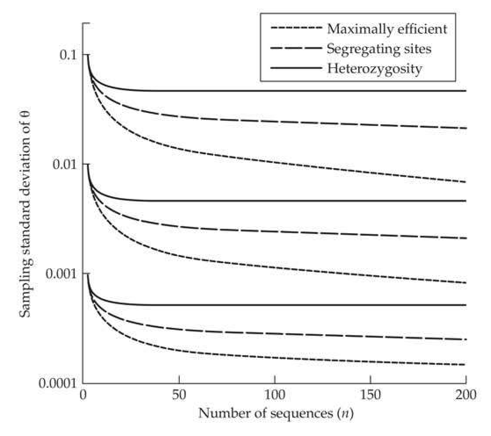
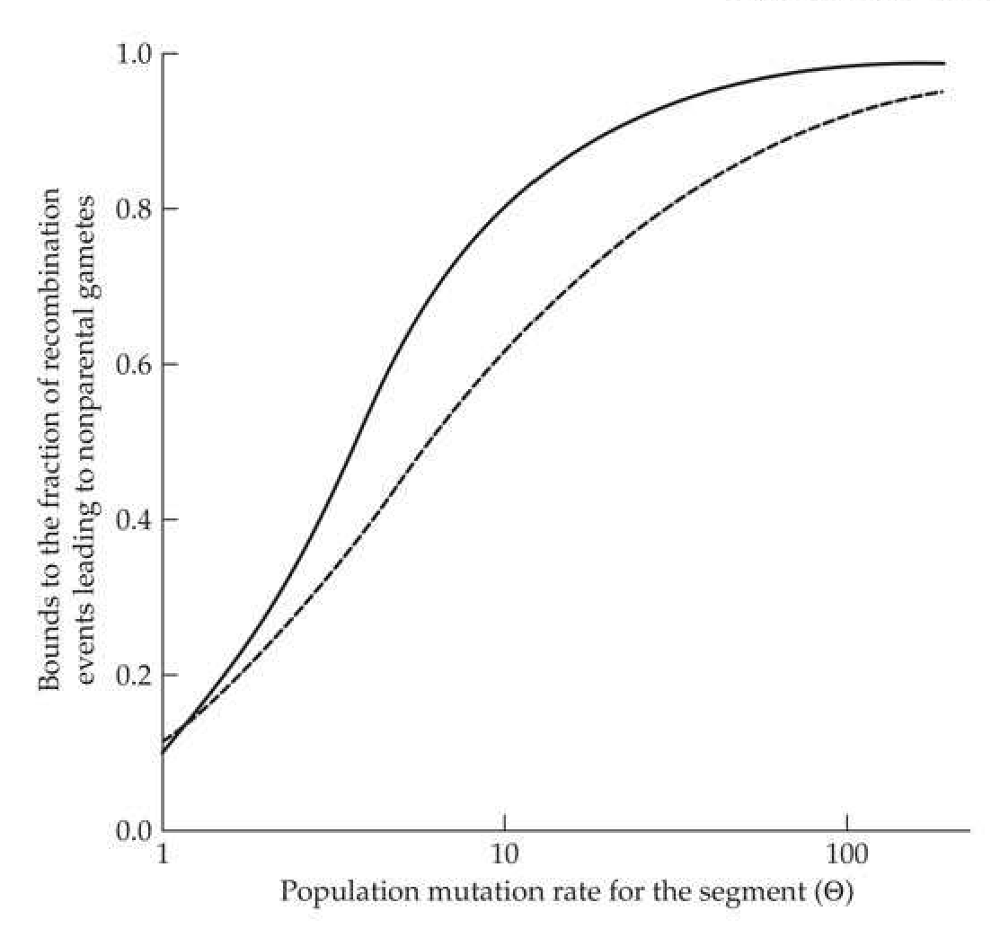
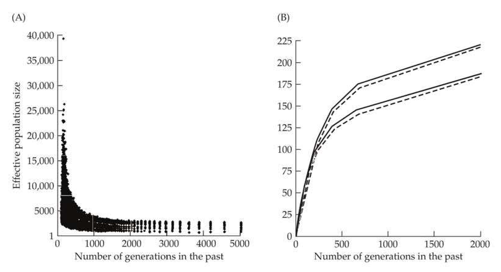
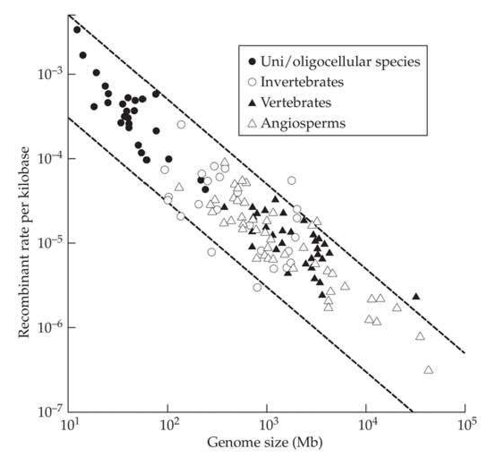

# Chapter 4 · The Nonadaptive Forces of Evolution

## chapter4_001 · The Nonadaptive Forces of Evolution: Introduction

I may be wrong but I doubt it. Charles Barkley

Although natural selection plays a major role in the evolution of many traits, three additional factors determine the patterns of genetic variation within and among populations. We refer to these factors—mutation, recombination, and random genetic drift—as the nonadaptive forces of evolution because their operation is generally independent of the specific selective factors operating on the extrinsic phenotypes of individuals. Migration (briefly touched upon in Chapters 2 and 3) might be added to this list, although we regard this added complexity as being independent of the internal genetic machinery of a population. As will become clear in the following chapters, the three nonadaptive forces together comprise the population-genetic environment, which defines the paths of evolutionary change that are open vs. closed to natural selection.

Knowledge of the magnitude of the nonadaptive forces of evolution should be sufficient to arrive at a full description of the dynamics of allele- and gamete-frequency change within populations in the absence of external forces of selection. Moreover, this logic works in reverse—under certain assumptions, observed patterns of variation in neutral genomic regions can be used to infer the magnitude of the evolutionary forces responsible for such patterning.

The goals of this chapter are, therefore, three-fold. First, we will consider how observations on putatively neutral molecular markers can be used to estimate rates of mutation, recombination, and random genetic drift. Second, we will summarize the existing data resulting from such analyses, providing information that will play a central role in subsequent chapters. As a consequence of the recent emergence of new technologies for high-throughput genomic sequencing, this is a rapidly developing area that will undoubtedly experience additional refinements in the near future. Finally, after showing that the intensities of the nonadaptive forces of evolution vary by orders of magnitude among species in fairly predictable manners, we will summarize existing theory that helps explain such patterns.

Although our ultimate desire is to obtain accurate estimates of the individual forces of mutation, recombination, and drift, as will be seen below, it is often much easier to obtain ratios of these features than to measure them individually. Fortunately, this is not always an undesirable situation, for as we saw in Chapter 2, in the absence of selection, the ratio of the power of mutation (u) and the power of drift (1/2N_e) defines the level of heterozygosity in a population, and the ratio of the recombination rate per nucleotide site (c_0) and the power of drift defines the magnitude of linkage disequilibrium. Therefore, before summarizing the approaches for estimating N_e, u, and c_0 separately, we will first consider methods for estimating the composite population parameters $ \theta = 4N_e u $ and $ \rho = 4N_e c_0 $. As will be seen below, accurate estimates of N_e are particularly difficult to achieve directly, especially for large populations. However, by using combined estimates of $ \theta $, $ \rho $, u, and/or c_0, obtaining approximate measures of long-term N_e is sometimes possible.

Throughout this chapter, we will assume that we are dealing with molecular markers known in advance to behave in an effectively neutral fashion. Numerous methods to test this hypothesis will be discussed in Chapters 9 and 10. We will largely focus on measures at the level of individual nucleotide sites, as it is now routine to obtain large quantities of DNA-sequence data, and per-nucleotide site measures are readily extrapolated to larger units of analysis such as genetic loci. Thus, u and $ c_{0} $ will, respectively, denote the mutation rate per nucleotide site and the recombination rate between adjacent sites.

---

## chapter4_002 · The Nonadaptive Forces of Evolution: Introduction / RELATIVE POWER OF MUTATION AND GENETIC DRIFT

In Chapter 2, it was demonstrated that if the forces of drift and mutation remain constant for a sufficiently long time, the level of heterozygosity at a neutral nucleotide site (with four possible allelic states) will stochastically wander around an expected equilibrium value of $ \sim12N_{e}u/(3+16N_{e}u) $, where $ u $ is the mutation rate per gamete per nucleotide site (assuming all nucleotides mutate at the same rate). As will be seen below, the average heterozygosity per neutral nucleotide site is far below 1.0 in all phylogenetic groups, so the preceding expression is generally closely approximated by $ 4N_{e}u $. This particular measure has great practical utility. Because $ 2u $ is the mutation rate per site per diploid genome, $ 4N_{e}u $ is equivalent to the ratio of the power of mutation to the power of random genetic drift, $ 1/(2N_{e}) $. For haploid species, the expected nucleotide diversity at a neutral site is $ 2N_{e}u $.

---

## chapter4_003 · RELATIVE POWER OF MUTATION AND GENETIC DRIFT / Nucleotide Diversity

**[推导 Derivation]**

Suppose a population sample of n random sequences has been obtained for a particular genomic region. In principle, such a stretch of DNA might consist of intronic or intergenic sequence or of the subset of silent (synonymous) sites in one or more coding regions. Letting $ k_{ij} $ be the number of site-specific differences between observed sequences i and j, and L be the number of sites per sequence, the average fraction of pairwise differences between the sampled sites,

> **Formula (4.1)** · `4.1` · source: `chapter4_block_008` · Nucleotide Diversity
>
> $$ \widehat{\theta}_{\pi}=\frac{2}{n(n-1)}\sum_{i=1}^{n}\sum_{j>i}^{n}k_{ij}/L $$

yields a heterozygosity-based estimate of $ \theta = 4N_{e}u $ (Tajima 1983). This formulation, frequently called the Tajima estimator, is often denoted by $ \pi $ in the literature.

If we are to confidently use $ \theta_\pi $ as an estimator of $ \theta $, aside from knowing whether the assumptions of neutrality and equilibrium are valid, it is critical to know the sampling variance of $ \widehat{\theta}_\pi $. Such variance results from two sources of uncertainty. First, heterozygosity is subject to evolutionary variance, which results from the natural fluctuations of nucleotide frequencies generated over time by the stochastic forces of mutation and drift (Chapter 2). Although this source of variation is not easily observed directly, assuming a population in drift-mutation equilibrium, the expected evolutionary variance of the true population value of $ \theta $ based on $ L $ independent (effectively unlinked) sites is $ \simeq (\theta/3)[(2\theta/3) + (1/L)] $ (Tajima 1983). This source of variance is intrinsic to the features of the population, independent of the sample taken. Second, sampling variance results from the use of a finite number of sampled sequences to estimate $ \theta_\pi $. For an equilibrium population, this variance is $ \simeq \{2\theta/[3(n-1)]\}\{[2n+3)\theta/3n] + (1/L)\} $, where $ n $ is the number of sequences sampled per site (Tajima 1983).

**[推导 Derivation]**

Summing over these two sources of variance, for sites in stochastic drift-mutation equilibrium, the expected total variance of heterozygosity-based estimates of $ \theta $ is

> **Formula (4.2)** · `4.2` · source: `chapter4_block_010` · Nucleotide Diversity
>
> $$ \sigma^{2}(\widehat{\theta}_{\pi})\simeq\frac{\theta}{3(n-1)}\left(\frac{2(n^{2}+n+3)\theta}{3n}+\frac{n+1}{L}\right) $$

(Pluzhnikov and Donnelly 1996). With increasing numbers of sampled alleles per site, i.e. as $n \to \infty$, the total variance of estimates of $\theta$ based on nucleotide diversity approaches a minimum equal to the evolutionary variance. Even in this case, and with an enormous amount of sequence per individual (large $L$), the sampling coefficient of variation of $\widehat{\theta}_{\pi}$ is $\simeq \sqrt{2/9} \simeq 0.47$. Adding more individuals or sites to a survey will not alter this minimum

It is worth reemphasizing that Equation 4.2 is an appropriate estimator of the variance of a nucleotide-diversity estimate only if the latter is based on neutral sites in drift-mutation equilibrium (the standard neutral model). Even for assuredly neutral sites, this expression will not apply for nonequilibrium situations, e.g., populations that have experienced relatively recent expansions or contractions. Under the latter conditions, the variance of heterozygosity must be evaluated more directly from the spectrum of allele frequencies across all sites and from their higher-order moments. A number of related technical issues are covered and general expressions derived in Nei and Roychoudhury (1974), Nei (1978), Nei and Tajima (1981a, 1983), Nei and Jin (1989), and Lynch and Crease (1990).

**[命题 Proposition]**

Finally, now that high-throughput sequencing has become routine for entire diploid genomes, it is possible to estimate the average nucleotide diversity over millions of putatively neutral sites, yielding per-individual measures with a high degree of precision. Because most pairs of sites are on different chromosomes, a full survey of even a single individual from a random-mating population should provide a very accurate description of the average per-site diversity across the entire population. Moreover, when a survey of two random individuals is possible, the covariance of heterozygosity within sites provides a direct estimate of the evolutionary variance of heterozygosity among sites, which, as noted above, should closely approximate $ (\theta/3)[(2\theta/3)+(1/L)] $ under the assumption of drift-mutation equilibrium (Lynch 2008a). These observations are now quite salient, as Pluzhnikov and Donnelly (1996) showed that for a fixed amount of resources for sequencing Ln total bases, the optimal strategy for obtaining minimal-variance estimates of $ \theta $ is generally to sample no more than two or three individuals, putting the effort instead into sampling more sites, i.e., maximizing L at the expense of n.

---

## chapter4_004 · RELATIVE POWER OF MUTATION AND GENETIC DRIFT / Number of Segregating Sites

**[推导 Derivation]**

Although nucleotide diversity is the most transparent means of estimating $ \theta $, it is by no means the only, or even the most efficient, approach. Watterson (1975) pointed out an alternative statistical measure of allelic diversity—the total number of segregating sites (S) in the region analyzed over the full set of n sequences. Because a segregating site is any nucleotide position that harbors two or more variants, S clearly increases with the length L of the sequence and the number of individuals assayed. Watterson (1975) showed that under the assumptions of neutrality and drift-mutation equilibrium, an unbiased estimator of the per-site parameter $ \theta = 4N_{e}u $ is

> **Formula (4.3a)** · `4.3a` · source: `chapter4_block_014` · Number of Segregating Sites
>
> $$ \widehat{\theta}_{S}=S/(L a_{n}) $$

where

> **Formula (4.3b)** · `4.3b` · source: `chapter4_block_014` · Number of Segregating Sites
>
> $$ a_{n}=\sum_{j=1}^{n-1}1/j $$

By rearranging, it can be seen that Equation 4.3a relates directly to the expected site-frequency spectrum for a sample under drift-mutation equilibrium with a known value of $ \theta $ (Equation 2.35a). A central point here is that when the nucleotide sites surveyed are neutral and in drift-mutation equilibrium, like the Tajima estimator (Equation 4.1), the Watterson estimator provides a separate estimate of $ \theta $. In Chapter 9, we will see that when the assumptions of neutrality and/or equilibrium are violated, the values of $ \widehat{\theta}_{\pi} $ and $ \widehat{\theta}_{S} $ deviate from each other in ways that yield insight into past population-genetic processes.

**[推导 Derivation]**

The sampling variance for the Watterson estimator, analogous to Equation 4.2 and again under the assumptions of neutrality and equilibrium, is

> **Formula (4.4a)** · `4.4a` · source: `chapter4_block_016` · Number of Segregating Sites
>
> $$ \sigma^{2}(\widehat{\theta}_{S})\simeq\frac{\theta}{a_{n}}\left(\frac{\theta b_{n}}{a_{n}}+\frac{1}{L}\right) $$

where

> **Formula (4.4b)** · `4.4b` · source: `chapter4_block_016` · Number of Segregating Sites
>
> $$ b_{n}=\sum_{j=1}^{n-1}1/j^{2} $$

**[Figure]**

> **Figure 4.1** · page 4 · source: `chapter4`
>
> 
>
> Figure 4.1 Expected sampling standard deviations for estimates of  $ \theta $ from sequences assumed to be neutral, in drift-mutation equilibrium, and experiencing no intragenic recombination. Results are derived from Equations 4.2 (Tajima estimator based on heterozygosity, solid line), 4.4 (Watterson estimator based on segregating sites, long-dashed line), and 4.5 (maximally efficient, short-dashed line), for  $ \theta = 0.1 $, 0.01, and 0.001 in descending order. The assumed number of sites is  $ L = 10,000 $ in all cases.

For sample sizes smaller than ten, the Tajima and Watterson estimators have similar expected sample standard deviations, but with larger n, the latter can be up to two-fold smaller than the former, although there is little to be gained with either approach once n exceeds 50 or so (Figure 4.1). It should, however, be emphasized that both Equation 4.2 and Equation 4.4a were derived under the assumptions of sequences experiencing negligible recombination. The necessary modifications to allow for intragenic recombination, derived in Pluzhnikov and Donnelly (1996; their Equations 6 and 7), play a role in some methods for estimating the population recombination rate, as described in the following section.

One significant issue that arises with the use of S to estimate $ \theta $ in the modern era of high-throughput sequencing involves the introduction of upward bias from sequencing errors. With large numbers of sites and individuals, errors will inevitably appear as singletons but nonetheless enter the estimate of S. Such effects can be quite deceptive in population-genetic analyses because rare alleles are expected to be common under the neutral hypothesis. Johnson and Slatkin (2008), Kang and Marjoram (2011), and Keightley and Halligan (2011) suggested methods for eliminating the bias from S when an accurate estimate of the sequencing-error rate is available. An alternative approach relaxes this constraint by estimating the error rate from the data themselves (Lynch 2009).

---

## chapter4_005 · RELATIVE POWER OF MUTATION AND GENETIC DRIFT / Alternative Approaches

Felsenstein (1992) pointed out that neither of these approaches is likely to provide the most efficient estimates of $ \theta $ (i.e., to yield estimates with minimum sampling variance), as they do not utilize all of the information in the sample of sequences. In particular, both approaches ignore the genealogical relationships of sequences (i.e., the coalescent structure of the sample), although under neutrality, the expected contribution to variation from each genealogical branch can be expressed in terms of $ \theta $ (Equation 2.33b).

**[推导 Derivation]**

To evaluate how much improvement might be achieved by exploiting such information, Fu and Li (1993a) derived a maximum-likelihood estimator of $ \theta $ for the extreme situation in which one knows with certainty the genealogical relationships of the sequences and the numbers of mutations and generations on each branch of the genealogy. The expected sampling variance of this estimator is

> **Formula (4.5)** · `4.5` · source: `chapter4_block_020` · Alternative Approaches
>
> $$ \sigma^{2}(\widehat{\theta}_{ML})=\frac{\theta}{a_{n}}\left(\frac{\theta a_{n}}{n-1}+\frac{1}{L}\right) $$

A comparison of this expression and Equations 4.2 and 4.4 illustrates that there is substantial room for improvement in the estimation of $ \theta $ over the traditional heterozygosity and segregating-sites methods, provided the number of sequences exceeds five or so, and assuming a reasonably accurate gene genealogy can be obtained (Figure 4.1).

Gene genealogies cannot be constructed without error. However, by using information on the expected coalescence times of samples of neutral sequences, Fu (1994a, 1994b) developed several generalized least-squares estimators that account for the sampling variances and covariances of mutations on different branch segments. Several of these estimators, which utilize the concepts of the site-frequency spectrum (Fu 1995; Li and Fu 1999; see Chapter 2), asymptotically perform in a near-optimal manner as the sample size increases, again provided the sites are neutral and the population is in drift-mutation equilibrium. As one or both of the latter two assumptions (neutrality and equilibrium) are likely to be violated to unknown degrees in many natural settings, having an estimator with minimum sensitivity to both problems would be highly useful. In fact, just such an approach can be extrapolated from Watterson's estimator (Equation 4.3). The basis for this strategy follows from the property for neutral alleles that in an equilibrium population, the number $ S_j $ of derived single-nucleotide variants found j times in a sample of size n has the expected value $ L\theta/j $ (Watterson 1975; Fu 1995). Because the total number of segregating sites, $ S $, has an expected value of $ L\theta a_n $, it follows that Watterson's estimator is equivalent to an average of estimates of $ \theta $, each weighted by the inverse of the number of observations.

**[推导 Derivation]**

The simplest estimate of $ \theta $, based only on singletons $ (j = 1) $, is then

> **Formula (4.6a)** · `4.6a` · source: `chapter4_block_023` · Alternative Approaches
>
> $$ \widehat{\theta_{1}}=S_{1}/L $$

which is also equivalent to the number of mutations (per site) on the external branches of a gene genealogy (Fu and Li 1993b). Such an estimator is attractive for two reasons. First, the singletons in a sample are a function of the very recent past, especially when the overall sample size is large, and hence are not expected to be influenced by distant periods of population-size change. Second, because the dynamics of rare alleles are primarily governed by the drift process, singleton frequencies are expected to most closely reflect the pattern expected under neutrality even when such mutations are nonneutral (Messer 2009). The sampling variance of the singleton-based estimator is

> **Formula (4.6b)** · `4.6b` · source: `chapter4_block_023` · Alternative Approaches
>
> $$ \sigma^{2}(\widehat{\theta_{1}})=\frac{\theta}{n}\left(\frac{n-1}{L}+\frac{\theta[2a_{n}(n-1)-1]}{n}\right) $$

Considering just the sampling variance of the estimators of $ \theta $ to this point, as $ n \to \infty $, those for $ \widehat{\theta}_W $ and $ \widehat{\theta}_{ML} $ are $ \theta/(15.4L) $, whereas that for $ \widehat{\theta}_\pi $ is $ \theta/(3L) $, and that for $ \widehat{\theta}_1 $ is $ \theta/L $. Thus, although the singleton-based estimator is likely to have the smallest amount of bias associated with selection, a focus on only a fraction of the segregating sites results in higher sampling variance.

---

## chapter4_006 · RELATIVE POWER OF MUTATION AND GENETIC DRIFT / Empirical Observations

Estimates of $ \theta $, mostly derived as silent-site heterozygosity from protein-coding genes using Equation 4.1, have been summarized for a wide range of species across the Tree of Life by Lynch (2007) and Leffler et al. (2012), and more specifically on metazoans and land plants. by Romiguier et al. (2014) and Corbett-Detig et al. (2015). Across a diverse assemblage of more than 100 eukaryotic and prokaryotic species, there is an inverse relationship between organism size and $ \theta_{\pi} $, with estimates for prokaryotes falling in the broad range of 0.007 to 0.388, with an average value of 0.104 (and a large standard deviation of 0.111). The average values for unicellular eukaryotes (mean = 0.057, SD = 0.078) and invertebrates (mean = 0.026, SD = 0.015) are 50% to 75% lower, and estimates for land plants (mean = 0.015, SD = 0.013) and vertebrates (mean = 0.004, SD = 0.003) are still smaller. Because the numbers of independent studies contributing to these estimates are in the range of 15 to 50, the cited means approach a level of reliability (with some caveats given below), but because of sampling error at the gene, individual, and population levels, the standard deviations likely overestimate the true evolutionary variance.

For both of the unicellular groups, silent-site heterozygosity measures are likely to be downwardly biased estimators of $ 4N_{e}u $ ($ 2N_{e}u $ for haploids), for at least two reasons. First, most recorded studies of microbial species are derived from surveys of pathogens, whose $ N_{e} $ may be abnormally low because of the restricted distributions of their multicellular host species, and second, silent-site variation will underestimate the neutral expectation if such sites experience some form of purifying selection. Such conditions can arise for a variety of reasons: (1) translation-associated selection when certain tRNAs have higher affinities for certain alternative codons (often referred to as codon bias); (2) selection on sites involved in splice-junction identification for species with introns; (3) secondary selection against codons that are one mutational step from termination codons; and (4) inhibition of double-strand break repair between highly divergent alleles. The molecular biological underpinnings of some of these factors, as well as their potential population-genetic consequences, are reviewed in Lynch (2007). Because all of these forms of selection are expected to be quite weak, they will be most effective in populations with very large $ N_{e} $. Thus, although $ \theta_{\pi} $ may underestimate $ 4N_{e}u $ ($ 2N_{e}u $ for haploids) in some microbial species by as much as ten-fold, the bias may be minor in multicellular eukaryotes. Many uncertainties remain, however, and we return to the topic in Chapter 8. With these caveats in mind, the existing data make a compelling statement with respect to the relative power of mutation and random genetic drift—in essentially no eukaryotic species is there evidence that the former exceeds the latter (as this would cause $ 4N_{e}u > 1 $), and in large multicellular land plants and vertebrates, the ratio is almost always on the order of 0.03 or much smaller. Thus, drift appears to be a more powerful force than mutation at the nucleotide level in all species, except perhaps the smallest microbes. As the absolute population sizes of many species (certainly microbes) can exceed $ 1/u $ by orders of magnitude (see below), these observations clearly support the idea introduced in Chapter 3 (and detailed in Chapter 8) that $ N_{e} $ is usually substantially smaller than the actual number of reproductive individuals in a population, and that this is largely a consequence of selection on linked sites, especially in large populations. Analyses of data on metazoans and land plants by Corbett-Detig et al. (2015) suggest that selection on linked sites typically reduces silent-site heterozygosity below the expected value $ 4N_{e}u $ by $ \sim10% $, although there are a few cases involving small, wide-ranging species where the downward bias is as great as 70%.

---

## chapter4_007 · The Nonadaptive Forces of Evolution: Introduction / RELATIVE POWER OF RECOMBINATION AND GENETIC DRIFT

As will be seen in subsequent chapters, recombination plays an important role in evolution because the physical scrambling of linked genes increases the ability of natural selection to promote or eliminate mutations on the basis of their individual effects. On the other hand, high rates of recombination can often inhibit the establishment of pairs of mutations with favorable epistatic effects.

Two general approaches provide insight into the level of recombination per physical distance along chromosomes. Genetic maps, generally derived from controlled crosses, are based on observations on the frequency of meiotic crossovers between informative markers.

(LW Chapter 14), whereas studies of linkage disequilibrium (LD) in natural populations use the theoretical concepts introduced in Chapter 2 to indirectly infer the relative magnitudes of the historical forces of random genetic drift and recombination. High-density genetic maps have the power to yield accurate estimates of average recombination rates over fairly long physical distances (usually with markers being separated by millions of nucleotide sites, which typically corresponds to >1% recombination per generation). However, because patterns of LD are generally outcomes of many thousands of generations, they have the potential to reveal much more refined (kilobase scale) views of the recombination landscape. For a mapping cross involving n gametes with a recombination frequency c between marker sites, the expected number of recombinants is $ nc $, so for sufficiently close sites, the typical outcome will be a complete absence of recombinants. On the other hand, if n random chromosomes are sampled from a natural population with a mean coalescence time between random alleles of $ \bar{t}=2N_e $ generations (Chapter 2), the expected number of recombination events is $ 2\ln c=4N_enc $. Thus, this chapter will focus on the use of LD, rather than directly observed meiotic crossover events, to derive inferences about recombination.

Before proceeding, we again remind the reader that we use $ c_L $ to denote the recombination rate between sites separated by a particular distance $ L $, with $ c_0 $ denoting the recombination rate between adjacent sites. When referring to population-scaled recombination rates, we will use separate notations of $ \rho_L = 4N_e c_L $ and $ \rho = 4N_e c_0 $. Although it is tempting to assume that $ c_L = c_0 L $ and $ \rho_L = \rho L $, as will be outlined below, such a linear transformation is not generally valid.

**[命题 Proposition]**

Recall from Chapter 2 that $ \rho_L = 4N_e c_L $ is the effective number of recombination events between sites (separated by $ L $ base pairs [bp]) per generation at the entire population level, which is also equivalent to the ratio of the power of recombination to the power of drift. Just as the amount of segregating variation at neutral sites provides insight into the population mutation rate $ \theta = 4N_e u $, the amount of standing LD is a function of the population recombination rate, $ \rho_L $. Although a wide variety of methods for estimating the latter parameter have been proposed, the challenges to obtaining accurate measures are substantial. The markers employed must not only have at least moderate frequencies (to ensure accurate estimates of gamete frequencies and reasonable likelihoods of observing recombination events), but must also behave neutrally (to ensure the validity of the application of drift-recombination theory). Moreover, most of the proposed estimators rely on the assumption of drift-mutation-recombination equilibrium, while also suffering from very high sampling variance, which demands substantial replication over independent pairs of sites.

---

## chapter4_008 · RELATIVE POWER OF RECOMBINATION AND GENETIC DRIFT / Number of Recombinational Events in a Sample of Alleles

The power of using population-level data in the detection of historical recombination rates is limited by the fact that recombination events only leave a trace if they involve pairs of doubly heterozygous chromosomes. Moreover, there is no way to directly determine whether multiple recombinants in a sample are a result of parallel recombination events or intact descendants of the same events. Thus, to obtain unbiased estimates of $ \rho_{L} $, we require a method for converting the observed number of recombinant events in a sample to the actual number that likely occurred (R). This is not unlike the challenge in genetic-map production of converting observed into actual numbers of recombination events between markers (LW Chapter 14). We start with a description of methods involving shorts spans of DNA, e.g., single genes with phased haplotypes (such as complete sequences for each of the two alleles within diploid individuals). Chromosomal regions of such small size will often have recombination rates between their boundaries $ \ll 0.01 $, and hence would have no chance of revealing recombinants in simple mapping crosses.

**[推导 Derivation]**

For a set of sequences with the most extreme distance between polymorphic sites being $ L $ nucleotides, assuming a population in drift-mutation-recombination equilibrium, the expected number of recombination events, $ R $, in a sample of $ n $ sequences is equal to $ \rho_L a_n $, where $ a_n $ is given by Equation 4.3b (Hudson and Kaplan 1985). Thus, a potential estimator for $ \rho_{L} $ is

> **Formula (4.7)** · `4.7` · source: `chapter4_block_033` · Number of Recombinational Events in a Sample of Alleles
>
> $$ \widehat{\rho}_{L}=\widehat{R}/a_{n} $$

where $ \widehat{R} $ is the estimated number of recombinational events that have occurred between the maximum span of polymorphic sites in the history of the sequences within the sample. Note the similarity of the form of this expression to that relating the number of segregating mutations to $ \theta $ (Equation 4.3a).

The primary impediment to applying this expression is the estimation of R. One approach, proposed by Hudson and Kaplan (1985), starts with the four-gamete test, which asserts that any pair of heterozygous sites exhibiting four gametic haplotypes must reflect the prior action of at least one recombination event, assuming an absence of parallel mutations. Under this view, starting with a fixed gamete of the form AB, a single mutation will create either an aB or Ab gamete, resulting in two gametic types in the population. This is a noninformative situation because recombination between the ancestral (AB) and derived (aB) haplotypes cannot generate a novel haplotype. If, however, prior to fixation of the first mutation, a mutation arises at the remaining homozygous site, there will be three haplotypes (e.g., AB, Ab, and aB), with the fourth type (ab) arising only by subsequent recombination between aB and Ab haplotypes. Judiciously applying this criterion to all pairs of segregating sites in a sample of sequences and ensuring that the same event is not counted more than once, it is possible to estimate $ R_{\min} $, the minimum number of crossover events in the history of the sample (Hudson and Kaplan 1985). More complex approaches attempt to derive information from the complete haplotype structure in a sample (Myers and Griffiths 2003; Liu and Fu 2008).

**[推导 Derivation]**

In principle, with knowledge of the expected fraction of detectable recombination events, $ d_{r} $, one could extrapolate the observed $ R_{\min} $ to an estimate of the actual value R. Assuming conditions of drift-mutation equilibrium, Stephens (1986) found approximate lower and upper bounds to $ d_{r} $ giving rise to observable, nonparental haplotypes,

> **Formula (4.8a)** · `4.8a` · source: `chapter4_block_035` · Number of Recombinational Events in a Sample of Alleles
>
> $$ d_{r,\min}=1-[2\ln(1+\Theta)]/\Theta+[1/(1+\Theta)] $$

> **Formula (4.8b)** · `4.8b` · source: `chapter4_block_035` · Number of Recombinational Events in a Sample of Alleles
>
> $$ d_{r,\mathrm{max}}=1-\left[2(1-e^{-\Theta})\right]/\Theta+e^{-\Theta} $$

where $ \Theta = 4N_{e}uL $ is the population mutation rate for the stretch of DNA being surveyed. These two limits are respectively approached as $ c \to 0.0 $ (complete linkage) and $ c \to 0.5 $ (free recombination). As $ \theta = \Theta/L $ is generally on the order of 0.001 to 0.01 for neutral sites, unless the segments being analyzed have lengths in excess of 1000 nucleotides, the majority of recombination events will simply reproduce parental gamete types, and hence not be scored as recombinants (Figure 4.2).

Given an estimate of $ \Theta $, Equations 4.8a and 4.8b can be used to approximate the total number of recombination events in the sample as $ R_{\min}/\bar{d}_r $, where $ \bar{d}_r $ is the average of $ d_{r,\min} $ and $ d_{r,\max} $. However, even this approach is not fully adequate because only a subset of the recombinant gametes that are nonparental with respect to markers are also novel with respect to the entire population, i.e., the fraction of uniquely detectable recombination events in the population is even lower than suggested by Equations 4.8a and 4.8b.

**[推导 Derivation]**

An empirical approach to this problem was suggested by Zietkiewicz et al. (2003; see also Lefebvre and Labuda 2008). Letting $ p_i $ denote the frequency of the $ i $th haplotype in a sample, an estimator for the fraction of detectable (but not necessarily unique) recombinant alleles is

> **Formula (4.9)** · `4.9` · source: `chapter4_block_037` · Number of Recombinational Events in a Sample of Alleles
>
> $$ \widehat{d}_{r}=\sum_{i=1}^{L}\sum_{j>i}^{L}2p_{i}p_{j}L_{\max,ij}/L $$

where $ L_{\max,ij} $ is the distance between the maximally separated heterozygous sites in the ijth comparison. Through simulations, one can establish the fraction of potentially informative recombination events that would indeed produce novel haplotypes in the sample, thereby converting $ \widehat{d}_r $ to $ \widehat{d}_r' $, the fraction of recombination events that lead to uniquely observable recombinants. Recalling Equation 4.7, a method-of-moments estimator for the population recombination rate is then

> **Formula (4.10)** · `4.10` · source: `chapter4_block_037` · Number of Recombinational Events in a Sample of Alleles
>
> $$ \widehat{\rho}_{L}=\widehat{R}_{\min}/(\widehat{d}_{r}^{\prime}a_{n}) $$

---

## chapter4_009 · RELATIVE POWER OF RECOMBINATION AND GENETIC DRIFT / Other Approaches for Narrow Genomic Intervals

**[Figure]**

> **Figure 4.2** · page 9 · source: `chapter4`
>
> 
>
> Figure 4.2 Approximate upper and lower bounds on the fraction of recombination events that produce nonparental gametes among two or more neutrally evolving sites (from Equations 4.8a and 4.8b).  $ \Theta = L\theta $ is the product of the population mutation rate per site ( $ \theta $) and the length of the segment (L in base pairs).

**[推导 Derivation]**

An alternative method-of-moments approach to estimating $ \rho_L $ was suggested by Hudson (1987), who noted that the variance of pairwise measures of neutral sequence divergence is expected to decline with increasing levels of recombination. (With strong linkage disequilibrium, some random pairs of haplotype blocks will be identical over all polymorphic sites, while others will differ at all such sites.) This approach requires an estimate of the average number of nucleotide differences between random sequences of length $ L $, $ \Theta_\pi = \theta_\pi L $, as well as the observed variance of pairwise divergence,

> **Formula (4.11)** · `4.11` · source: `chapter4_block_038` · Other Approaches for Narrow Genomic Intervals
>
> $$ \begin{align*}\widehat{\sigma}_k^2={2\over n(n-1)}\sum_{i=1}^n\sum_{j>i}^n(k_{ij}-\Theta_\pi)^2\end{align*} $$

where $ k_{ij} $ is the number of sites at which sequences i and j differ, and n is the number of chromosomes scored in the sample. Wakeley's (1997) Equation 15 allows one to estimate $ \rho_L $ as a function of $ \Theta_\pi $, $ \widehat{\sigma}_k^2 $, and n.

Fuller use of the information in sample data can be achieved by considering the probabilities of various sample counts of the four gametic types at two loci or nucleotide sites (i.e., AB, Ab, aB, and ab) assumed to be biallelic, neutral, and in drift-mutation-recombination equilibrium (Hudson 2001). For any hypothetical combination of the parameters $ \theta $, $ \rho_{L} $, and sample size n, one may compute the probability of the observed data for each pairwise combination of markers (Golding 1984; Ethier and Griffiths 1990), although obtaining exact probabilities of two-locus sampling configurations is mathematically challenging, and for large sample sizes, approximations must often be obtained by computer simulation (but see Jenkins and Song 2009). Further simplification can be achieved by obtaining probabilities of sampling configurations conditional on two alleles actually segregating at both sites, as this eliminates the dependence on $ \theta $ (Hudson 2001). One can then combine the likelihood estimates with respect to $ \rho_{L} $ over all nonoverlapping pairs of linked segregating sites to obtain a global estimate of $ \rho $ (Hudson 2001). (Usually, this is done by assuming that $ \rho = \rho_{L}/L $, although as noted below there are problems with this approach when the distances between sites are highly variable.) Because the data are not entirely independent, this composite likelihood approach is just an approximation to a full ML analysis, and the confidence limits for the resultant estimates can only be achieved by computer simulations. McVean et al. (2002) extended this approach to allow for parallel mutations, which in species with high mutation rates, can lead to the false appearance of recombination under the usual assumptions of the four-gamete test.

**[命题 Proposition]**

The efficiency of all of these methods can be questioned in the sense that they use summary statistics that do not necessarily make full use of all of the information in the sample. Most notably, they do not account for the genealogical relationships among the sampled haplotypes. To this end, several more elaborate ML approaches and their Bayesian extensions go well beyond the method of Hudson (2001) (e.g., Kuhner et al. 2000; Nielsen 2000; Fearnhead and Donnelly 2001). As the number of genealogies consistent with any given set of mutational and recombinational parameters is enormous, exact solutions are not possible with these computationally intensive approximations. Moreover, although one would expect estimates derived in an explicit likelihood framework to perform better than the ad hoc procedures outlined above, it remains unclear whether that is the case for the sample sizes (n and L) that have been typically applied to date, as all existing estimators appear to be biased, have very large sampling variances, and rely on the assumption of an equilibrium population (Wall 2000).

---

## chapter4_010 · RELATIVE POWER OF RECOMBINATION AND GENETIC DRIFT / Large-scale Analysis

The methods outlined in the preceding paragraphs were developed largely for analyzing sequences at the level of gene-sized fragments. However, with the sequencing of entire genomes of multiple individuals now becoming routine, genome-wide profiles of LD can be obtained. One limitation of genome-sequencing technologies is that sequence read lengths remain small (often on the order of 100–200 bp), so that unlike the situation when individual alleles are cloned and sequenced, the phases of haplotypes are not certain for double heterozygotes at distant pairs of sites. However, unambiguous haplotypes can still be inferred from information contained within singly heterozygous individuals, with the resultant frequency estimates enabling one to compute the full slate of LD statistics. Moreover, mean read lengths are rapidly expanding, so this will soon be a minor consideration.

**[推导 Derivation]**

One approach to estimating $ \rho $ from whole-genome sequencing relies on data from just a single individual (Lynch 2008a). This maximum-likelihood method estimates the correlation $ \Delta $ of “zygosity” (heterozygosity and homozygosity) of pairs of sites separated by specific distances (L) across the genome to obtain disequilibrium measures that are nearly unbiased with minimal sampling variance. Spatial patterns of heterozygosity arise because recombination causes variation in coalescence times among chromosomal regions. In effect, this leads to clustering of heterozygous sites in long stretches of DNA that by chance have experienced little recombination and have long coalescence times. For any distance L (in nucleotides) between sites, $ \Delta L $ is defined as the deviation of the frequency of pairs of nucleotide sites with mixed zygosities from the random expectation

> **Formula (4.12)** · `4.12` · source: `chapter4_block_042` · Large-scale Analysis
>
> $$ \Delta_{L}=1-\frac{H_{1d}}{2\pi(1-\pi)} $$

with $ H_{1d} $ denoting the fraction of pairs of sites at distance L containing one heterozygote and one homozygote, and $ 2\pi(1-\pi) $ being the expected fraction of such mixed pairs under a random distribution given an average level of heterozygosity $ \pi $.

**[推导 Derivation]**

For the situation in which the genome-wide patterns of variation are largely driven by mutation, recombination, and genetic drift, and the population is in equilibrium, by using expressions from Ohta and Kimura (1969b) for the two-allele model, it can be shown that

> **Formula (4.13a)** · `4.13a` · source: `chapter4_block_043` · Large-scale Analysis
>
> $$ E(\Delta_{L})\simeq\frac{\theta(1+2\theta)(18+\rho_{L})}{2(1+\theta)A} $$

where

> **Formula (4.13b)** · `4.13b` · source: `chapter4_block_043` · Large-scale Analysis
>
> $$ A=9+6.5\rho_{L}+0.5\rho_{L}^{2}+19\theta\rho_{L}+12\theta^{2}\rho_{L}+\theta\rho_{L}^{2}+54\theta+80\theta^{2}+32\theta^{3} $$

(Lynch et al. 2014), where $ \rho_L = 4N_e c_L $ is the scaled population recombination rate for sites separated by distance $ L $ (and having recombination rate $ c_L $). Note that as $ \rho_L \to 0 $, $ E(\Delta_L) \to \theta(1 + 2\theta)/(1 + 7\theta) $, which is closely approximated by $ \theta $ when $ \theta \ll 1 $ (which, as noted above, is generally the case). As $ \rho_L \to \infty $, $ E(\Delta_L) \to \theta(1 + \theta)/\rho_L \simeq \theta/\rho_L $. Thus, given an estimate of $ \theta $, with estimates of average $ \Delta_L $ for neutral sites separated by $ L = 1, 2, 3, \ldots $ sites, each based on thousands to millions of pairs of sites, the decline in $ \Delta_L $ with $ L $ can be used to infer the distance dependence of $ \rho_L $.

**[推导 Derivation]**

Another potentially powerful method for estimating $ \rho $ with population-genomic data takes advantage of the standardized linkage disequilibrium ($ r^2 $) introduced in Chapter 2. For neutral sites in drift-mutation equilibrium, Equation 2.29a gives a full expression for $ r_L^2 $ in terms of $ \theta $ and $ \rho_L $. However, provided $ \theta \ll 1 $ (which is always the case) and $ \rho_L \gg \theta $ (which, as shown below, is generally the case for physically distant sites), Equation 2.29a simplifies to

> **Formula (4.14)** · `4.14` · source: `chapter4_block_045` · Large-scale Analysis
>
> $$ r_{L}^{2}\simeq\frac{10+\rho_{L}}{(11+\rho_{L})(2+\rho_{L})}\simeq\frac{1}{2+\rho_{L}} $$

**[推导 Derivation]**

The simplification to the right of this equation (Hill 1975; McVean 2002), which causes no more than 10% bias in estimating $ \rho_L $, is often relied on in the literature (Hayes et al. 2003; Tenesa et al. 2007). We noted in Example 2.7 that another commonly used approximation, $ r_L^2 \simeq 1/(1 + \rho_L) $, has a more restricted meaning, which limits its use with molecular data. As the sampling variance for $ r_{L}^{2} $ for single pairs of polymorphic sites is generally very high, the usual strategy is to procure a large number of estimates for different pairs of informative markers separated by a certain window of physical distance, and then to pool these into a single estimate for that distance. Subtracting an expected contribution $ 1/n $ to $ r_{L}^{2} $ resulting from finite sample size (Weir and Hill 1980), and rearranging Equation 4.14, leads to the estimator for sites separated by distance L,

> **Formula (4.15)** · `4.15` · source: `chapter4_block_046` · Large-scale Analysis
>
> $$ \widehat{\rho}_{L}=\frac{1}{\widehat{r_{L}^{2}}-\left(1/n\right)}-2 $$

A significant problem, often unappreciated, is that estimates of $ r_{L}^{2} $ can be substantially biased if sample sizes are small or allele frequencies are extreme (Song and Song 2007).

Before proceeding, it is useful to review the specific mechanics of recombination between nucleotide sites, as we have not yet clarified how the recombination rate scales with distance L. Although it is often assumed that the recombination rate is simply equal to the crossover rate between sites, this is generally not true for closely spaced sites. Recombination events nearly always involve heteroduplex formations between homologous chromosomes, i.e., the temporary physical annealing of homologous regions of complementary strands (usually no more than a few hundred base pairs). When such heteroduplexes contain heterozygous sites, the nonmatching sites have to be resolved by gene conversion. Inclusion of these processes in the interpretation of the recombination rate is essential because although recombination events result in the potential for gene conversion, not all gene conversion events are accompanied by crossovers. Because gene-conversion tracts are relatively short, when sites are far apart, most recombination events result from crossing over, but when sites are close together, recombination mostly results from the conversion of single sites.

**[推导 Derivation]**

To understand this in a more quantitative way, let $ c_0 $ be the total rate of initiation of recombination events per nucleotide site (with or without crossing over), $ L $ be the number of sites separating the two focal positions (with $ L = 1 $ for adjacent sites), and $ x $ be the fraction of recombination events accompanied by crossing over. Using Haldane's (1919) mapping function (LW Equation 14.3), which assumes random and independent recombination at all sites, the crossover rate can be represented as $ 0.5(1 - e^{-2c_0 \times L}) $, which is $ \simeq c_0 \times L $ for $ c_0 \times L \ll 1 $, and asymptotically approaches 0.5 for large $ c_0 \times L $. In the following, we assume distances between sites that are small enough that the crossover rate $ \simeq c_0 \times L $. As noted by Andolfatto and Nordborg (1998), from the perspective of two sites, a gene conversion event has consequences equivalent to a crossover if the conversion tract encompasses just one of the sites. Under the assumption of an exponential distribution of tract lengths with mean length T (in bp), the total conversion rate per site is $ (1 - x)c_0T(1 - e^{-L/T}) $ (Langley et al. 2000; Frisse et al. 2001; Lynch et al. 2014). The total recombination rate between sites separated by distance L is then

> **Formula (4.16a)** · `4.16a` · source: `chapter4_block_049` · Large-scale Analysis
>
> $$ c_{L}\simeq c_{0}[x L+(1-x)T(1-e^{-L/T})] $$

**[推导 Derivation]**

For $ L \ll T $,

> **Formula (4.16b)** · `4.16b` · source: `chapter4_block_050` · Large-scale Analysis
>
> $$ c_{L}\simeq c_{0}L $$

whereas for $ L \gg T $,

> **Formula (4.16c)** · `4.16c` · source: `chapter4_block_050` · Large-scale Analysis
>
> $$ c_{L}\simeq c_{0}L x $$

These results show that the simple division of an estimate of $ \rho_L $ by $ L $ to obtain an estimate of the per-site parameter $ \rho = 4N_e c_0 $, a common practice, may yield rather different answers depending on the distance between sites; at large distances $ \rho $ specifically measures the population crossover rate between sites.

---

## chapter4_011 · The Nonadaptive Forces of Evolution: Introduction / Empirical Observations

**[命题 Proposition]**

Applying the preceding methods to population samples, many attempts have been made to measure the population recombination rate $ \rho = 4N_{e}c_{0} $, usually first estimating $ \rho_{L} $ at various distances between sites, and then dividing by $ L $ under the assumption that $ c_{L} = c_{0}L $, i.e., assuming a linear relationship between the recombination rate and physical distance between sites. As noted above, this is a reasonable approximation provided the distance between sites is less than the average length of a conversion tract but will lead to an underestimate of $ \rho $ (by a factor of $ 1/x $) when greater distances are relied upon. Using this procedure, all estimates of the per-site parameter $ 4N_{e}c_{0} $ are smaller than 0.1, with many falling below 0.01 (Table 4.1). Because the fraction of recombination events resulting in crossing over $ (x) $ is typically in the range of 0.05 to 0.25 (as reviewed below), these general observations provide strong support for the idea that random genetic drift is generally a much more powerful force than recombination at the level of individual nucleotide sites.

By dividing estimates of $ 4N_{e}c_{0} $ by parallel estimates of $ \theta = 4N_{e}u $, the effective population size cancels out, yielding an estimate of the ratio of recombination and mutation rates at the nucleotide level $ (c_{0}/u) $. All such estimates are smaller than 5.0, and nearly half are smaller than 1.0, implying that the power of recombination between adjacent sites is generally of the same order of magnitude or smaller than the power of mutation (Table 4.1). The average estimate of $ c_{0}/u $ for Drosophila is $ \sim $2.7, whereas that for humans is $ \sim $0.8. Average $ c_{0}/u $ for 14 land plants is 1.1 (SD = 1.2), although this may somewhat underestimate the average for purely outcrossing species because several of the taxa included in the survey (e.g., Arabidopsis and Oryza) are predominantly self-fertilizing, which reduces the effective amount of recombination (Hagenblad and Nordborg 2002).

It is notable that even though prokaryotes do not engage in meiosis, estimates of c/u for such species are generally of the same order of magnitude as those for eukaryotes (Lynch

**[Table]**

> **Table 4.1** · `4.1` · page 13 · source: `chapter4_011`
> Table 4.1 Estimates of the per-site population recombination rate ( $ \rho = 4N_e c_0 $) and the ratio of the per-site recombination and mutation rates ( $ c_0/u $, obtained by dividing estimates of  $ \rho $ by estimates of  $ \theta = 4N_e u $). All estimates are derived from population surveys of nucleotide variation at silent sites in protein-coding genes.
>
> <table><tr><td>Species</td><td>$ \rho $</td><td>$ c_{0}/u $</td><td>References</td></tr><tr><td colspan="4">Animals:</td></tr><tr><td rowspan="2">Drosophila melanogaster</td><td rowspan="2">0.05846</td><td rowspan="2">3.545</td><td>Hey and Wakeley 1997</td></tr><tr><td>Andolfatto and Przeworski 2000</td></tr><tr><td>Drosophila pseudoobscura</td><td>0.08655</td><td>1.360</td><td>Hey and Wakeley 1997</td></tr><tr><td>Drosophila simulans</td><td>0.09720</td><td>3.306</td><td>Andolfatto and Przeworski 2000</td></tr><tr><td rowspan="2">Homo sapiens</td><td rowspan="2">0.00060</td><td rowspan="2">0.770</td><td>Frisse et al. 2001; Ptak et al. 2004</td></tr><tr><td>Lefebvre and Labuda 2008</td></tr><tr><td colspan="4">Land plants:</td></tr><tr><td>Arabidopsis thaliana</td><td>0.00160</td><td>0.193</td><td>Kim et al. 2007</td></tr><tr><td>Brassica nigra</td><td>0.00602</td><td>0.330</td><td>Lagercrantz et al. 2002</td></tr><tr><td>Cryptomeria japonica</td><td>0.00046</td><td>0.118</td><td>Fujimoto et al. 2008</td></tr><tr><td>Helianthus annuus</td><td>0.05280</td><td>4.100</td><td>Liu and Burke 2006</td></tr><tr><td>Hordeum vulgare</td><td>0.00080</td><td>1.417</td><td>Morrell et al. 2006</td></tr><tr><td>Oryza rufipogon</td><td>0.00003</td><td>0.006</td><td>Mather et al. 2007</td></tr><tr><td>Oryza sativa</td><td>0.00004</td><td>0.021</td><td>Mather et al. 2007</td></tr><tr><td>Persea americana</td><td>0.00338</td><td>0.582</td><td>Chen et al. 2008</td></tr><tr><td>Pinus sylvestris</td><td>0.01452</td><td>2.855</td><td>Pyhäjärvi et al. 2007</td></tr><tr><td>Pinus taeda</td><td>0.00175</td><td>0.266</td><td>Brown et al. 2004</td></tr><tr><td>Solanum chilense</td><td>0.02380</td><td>1.122</td><td>Arunyawat et al. 2007</td></tr><tr><td>Solanum peruvianum</td><td>0.03480</td><td>1.392</td><td>Arunyawat et al. 2007</td></tr><tr><td>Sorghum bicolor</td><td>0.00041</td><td>0.130</td><td>Hamblin et al. 2005</td></tr><tr><td>Zea mays</td><td>0.02840</td><td>2.176</td><td>Tenaillon et al. 2004</td></tr></table>

2007). This suggests that, relative to the background rate of mutation, recombination at the nucleotide level is not exceptionally low in prokaryotes, although the downward bias in estimates of $ \theta $ for this group (noted above) may lead to inflated estimates of $ c_n/u $.

Applying the single-individual estimator (i.e., the correlation of zygosity) and fitting the generalized recombination function (Equation 4.16a) clarifies a number of features of recombination in mammalian species (Lynch et al. 2014). First, estimates of $ 4N_{e}c_{0} $ in mammals are generally in the range of 0.001 to 0.005, again implying a substantially higher power of genetic drift than of recombination at the single-site level.

**[命题 Proposition]**

Second, the fraction of recombination events resulting in crossovers is generally in the range of x = 0.05 to 0.25. This is consistent with empirical work suggesting $ x \simeq 0.30 $ in the budding yeast S. cerevisiae (Malkova et al. 2004; Mancera et al. 2008), and x = 0.15 in the fly D. melanogaster (Hilliker et al. 1994). Indirect LD-based analyses have also led to estimates of $ x \simeq 0.14 $ in humans (Frisse et al. 2001; Padhukasahasram and Rannala 2013), x = 0.08 in D. melanogaster (Langley et al. 2000; Yin et al. 2009), x = 0.05 in the plant A. thaliana (Yang et al. 2012), and x = 0.06 to 0.16 in wild barley (Morrell et al. 2006). Thus, observations in a variety of organisms consistently point to the fact that the vast majority of recombination events are simple local gene-conversion events unaccompanied by crossovers, raising questions about the frequently used assumption that $ c_L = c_0 L $.

**[命题 Proposition]**

Third, based on single-individual LD analysis, the inferred average lengths of conversion tracts in mammals are typically in the range of $ T = 10^{3} $ to $ 10^{4} $ bp, which is consistent with more direct observations made in other species: $ T \simeq 400 $ bp in bacteria (Santoyo and Romero 2005); $ T = 500 $ to 4000 bp in S. cerevisiae (Ahn and Livingston 1986; Judd and Petes 1988; McGill et al. 1990); $ T = 400 $ to 1400 bp in D. melanogaster (Hilliker et al. 1994; Preston and Engels 1996; Miller et al. 2012); and $ T = 200 $ to 3000 bp in mammals (Chen et al. 2007; Paigen et al. 2008; Rukść et al. 2008). Referring to Equations 4.16b and 4.16c, this suggests that the assumption of $ c_L = cL $ is generally approximately valid provided $ L < 500 $ bp, whereas for distances > 5000 bp, the recombination rate primarily reflects the crossover rate, i.e., $ c_L \simeq c_0Lx $.

**[命题 Proposition]**

Finally, the results in Lynch et al. (2014) suggest that the level of LD at closely spaced sites (< 200 bp) in vertebrates is generally much higher than can be accounted for by the standard neutral model outlined above, a conclusion that was reached in a number of other studies: Drosophila (Andolfatto and Przeworski 2000); humans (Przeworski and Wall 2001); sorghum (Hamblin et al. 2005); and Arabidopsis (Kim et al. 2007). There are at least three reasons why unusually high levels of LD may exist at closely spaced sites, all associated with the nonindependence of mutational and/or recombinational events. First, new mutations arise in a significantly clustered manner on spatial scales of ~100 bp, possibly as a consequence of an occasional defective polymerase engaging at origins of replication or of the localized deployment of error-prone polymerases in DNA repair (Schrider et al. 2011; Harris and Nielsen 2014). Second, recombination and double-strand-break repair are mutagenic, violating the usual assumption of the independence of these two processes (Hicks et al. 2010; Malkova and Haber 2012; Arbeithuber et al. 2015). Third, nonhomologous gene conversion can introduce excess LD at individual sites (Walsh 1988; Mansai and Innan 2010).

---

## chapter4_012 · The Nonadaptive Forces of Evolution: Introduction / EFFECTIVE POPULATION SIZE

**[Table]**

> **Table 4.2** · `4.2` · page 26 · source: `chapter4_012`
> Table 4.2 Base-substitution mutation rates (u, in units of  $ 10^{-9} $ per nucleotide site per generation) for a diversity of eukaryotic species derived from whole-genome sequencing of mutation-accumulation lines or parent-offspring trios.
>
> <table><tr><td>Species</td><td>u</td><td>References</td></tr><tr><td colspan="3">Unicellular eukaryotes:</td></tr><tr><td>Chlamydomonas reinhardtii</td><td>0.515</td><td>Sung et al. (2012); Morgan et al. (2014)</td></tr><tr><td>Paramecium tetraurelia</td><td>0.019</td><td>Sung et al. (2012)</td></tr><tr><td>Rhodosporidium toruloides</td><td>0.242</td><td>Long et al. (2016)</td></tr><tr><td>Saccharomyces cerevisiae</td><td>0.263</td><td>Lujan et al. (2014); Serero et al. (2014); Zhu et al. (2014)</td></tr><tr><td>Schizosaccharomyces pombe</td><td>0.200</td><td>Farlow et al. (2015)</td></tr><tr><td>Tetrahymena thermophila</td><td>0.008</td><td>Long et al. (2016)</td></tr><tr><td colspan="3">Land plants:</td></tr><tr><td>Arabidopsis thaliana</td><td>6.850</td><td>Ossowski et al. (2010); Yang et al. (2015)</td></tr><tr><td>Oryza sativa</td><td>2.150</td><td>Yang et al. (2015)</td></tr><tr><td colspan="3">Invertebrates:</td></tr><tr><td>Apis mellifera</td><td>6.800</td><td>Yang et al. (2015)</td></tr><tr><td>Caenorhabditis elegans</td><td>1.450</td><td>Denver et al. (2012)</td></tr><tr><td>Daphnia pulex</td><td>5.690</td><td>Keith et al. (2015)</td></tr><tr><td>Drosophila melanogaster</td><td>5.165</td><td>Schrider et al. (2013)</td></tr><tr><td>Heliconius melpomene</td><td>2.900</td><td>Keightley et al. (2014)</td></tr><tr><td>Pristionchus pacificus</td><td>2.000</td><td>Weller et al. (2014)</td></tr><tr><td colspan="3">Mammals:</td></tr><tr><td>Homo sapiens</td><td>13.513</td><td>Conrad et al. (2011); O’Roak et al. (2011, 2012); Campbell et al. (2012); Kong et al. (2012)</td></tr><tr><td>Pan troglodytes</td><td>12.000</td><td>Venn et al. (2014)</td></tr></table>

Although the theory outlined in Chapter 3 suggests numerous ways in which the effective size of a population might be estimated from demographic data, such information is often difficult to come by, except in carefully controlled breeding populations. Moreover, estimates of $ N_{e} $ based on demography alone generally do not incorporate the long-term effects of selection on linked chromosomal regions, and certainly not selective sweeps or background selection.

Nevertheless, there are several ways in which inferences about $ N_{e} $ can be made without direct demographic observation. From the standpoint of natural populations, two approaches harbor the most promise—monitoring temporal changes in putatively neutral allele frequencies, and ascertaining genome-wide patterns of LD, in both cases back-calculating the value of $ N_{e} $ that best explains the data (reviewed by Wang 2005).

---

## chapter4_013 · EFFECTIVE POPULATION SIZE / Temporal Change in Allele Frequencies

Consider a single nucleotide polymorphism (usually abbreviated as a SNP) sampled on two occasions separated by t generations, with initial frequency $ p_0 $, and recall from Chapter 2 that the expected variance in allele-frequency change after t generations is $ p_0(1 - p_0)(1 - e^{-t/(2N_e)}) \simeq p_0(1 - p_0)t/(2N_e) $ for small $ t/(2N_e) $. This represents only the true population variance (the evolutionary variance in the preceding parlance), to which the sampling variance associated with errors in observed allele-frequency estimates (owing to finite sample size) must be added. Summing these two sources of stochasticity yields an overall estimate of the expected variance of allele-frequency change of $ p_0(1 - p_0)[t/(2N_e) + 1/(2n_0) + 1/(2n_1)] $ between two time points, where $ n_0 $ and $ n_1 $ denote the number of individuals (assumed to be diploid) genotyped in the two generations. Letting $ \widehat{p}_0 $ and $ \widehat{p}_1 $ be the estimated allele frequencies in the two generations, an estimate of the observed variance in allele-frequency change across generations can be written as $ (\widehat{p}_1 - \widehat{p}_0)^2 $ because $ E(\widehat{p}_1 - \widehat{p}_0) = 0 $ under neutrality.

**[推导 Derivation]**

Krimbas and Tsakas (1971) suggested that by equating the observed and expected variance of allele-frequency change and rearranging, the effective population size can be estimated from observations over two consecutive generations (t = 1)

> **Formula (4.17a)** · `4.17a` · source: `chapter4_block_064` · Temporal Change in Allele Frequencies
>
> $$ \widehat{N}_{e}=\frac{1}{2\widehat{F}_{1}-\left(1/n_{0}\right)-\left(1/n_{1}\right)} $$

where

> **Formula (4.17b)** · `4.17b` · source: `chapter4_block_064` · Temporal Change in Allele Frequencies
>
> $$ \widehat{F_{1}}=\frac{(\widehat{p_{0}}-\widehat{p_{1}})^{2}}{\widehat{p_{0}}(1-\widehat{p_{0}})} $$

is a measure of the standardized variance of allele-frequency change. Provided $ t/(2N_e) \ll 1 $, the same expression applies when samples are made $ t $ generations apart, if $ t $ is substituted for one in the numerator of Equation 4.17a. (Note that the definition of $ F_1 $ is identical in form to the population-subdivision statistic $ F_{ST} $, presented as Equation 2.42, except that the latter is concerned with spatial rather than temporal variation.)

**[推导 Derivation]**

Despite their intuitive nature, Equations 4.17a and 4.17b yield biased estimates because the contributions of the sampling variance (and in some cases, covariance) of allele frequencies to $ F_1 $ are not fully accounted for (Pamilo and Varvio-Aho 1980; Nei and Tajima 1981b; Pollak 1983; Tajima and Nei 1984; Waples 1989a). Additional limitations are that $ \widehat{F}_1 $ is undefined if $ \widehat{p}_0 = 0 $, and that Equations 4.17a and 4.17b do not immediately allow for the incorporation of multiple alleles. An alternative estimator that deals with these problems is

> **Formula (4.18a)** · `4.18a` · source: `chapter4_block_065` · Temporal Change in Allele Frequencies
>
> $$ \widehat{N}_{e}=\frac{t-2}{2\widehat{F}-\left(1/n_{0}\right)-\left(1/n_{1}\right)} $$

where $ \widehat{F} $ is calculated by either

> **Formula (4.18b)** · `4.18b` · source: `chapter4_block_065` · Temporal Change in Allele Frequencies
>
> $$ \widehat{F}_{2}=\frac{1}{k}\sum_{i=1}^{k}\frac{(\widehat{p}_{0i}-\widehat{p}_{1i})^{2}}{\left[(\widehat{p}_{0i}+\widehat{p}_{1i})/2\right]-\widehat{p}_{0i}\widehat{p}_{1i}} $$

**[推导 Derivation]**

(Nei and Tajima 1981b), or

> **Formula (4.18c)** · `4.18c` · source: `chapter4_block_066` · Temporal Change in Allele Frequencies
>
> $$ \widehat{F}_{3}=\frac{1}{k}\sum_{i=1}^{k}\frac{\left(\widehat{p}_{0i}-\widehat{p}_{1i}\right)^{2}}{\left(\widehat{p}_{0i}+\widehat{p}_{1i}\right)/2} $$

(Pollak 1983), where $k$ is the number of alleles. The details leading up to these alternative expressions can be found in the primary references, but it is notable that because $(\widehat{p}_{0i} + \widehat{p}_{1i}) / 2$ is generally much larger than $\widehat{p}_{0i} \widehat{p}_{1i}$, both estimators usually lead to very similar results (Waples 1989a). One drawback of Equation 4.18a is that it requires an interval of at least three generations.

More refined measures of $ F $ can be obtained by averaging estimates of $ F_1 $, $ F_2 $, or $ F_3 $ over multiple loci, and Pollak (1983) derived a generalized estimator that allows for sampling across more than a single time interval. All of these approaches assume that the sampling of individuals at the beginning of an interval has no effect on the allele-frequency variance, which is reasonable when samples constitute a minor fraction of the population or are taken in a nondestructive manner or following reproduction. An additional concern is that the sampling scheme for allele frequencies, which is straightforward in a synchronized population with discrete generations but potentially problematical in species with overlapping generations. In the latter case, the contributions of sampled individuals to the overall allele-frequency estimates need to be weighted by the reproductive values of various age classes (Waples and Yokota 2007), a difficult enterprise with species with poorly understood life histories. Attention to these issues is provided in Nei and Tajima (1981b) and Waples (1989a).

**[推导 Derivation]**

Estimates of $ N_e $ derived by these method-of-moment estimators generally have substantial sampling variances, and negative estimates of $ N_e $ are even possible. Clearly, if $ t/(2N_e) \ll 1/(2n_0) + 1/(2n_1) $, observed fluctuations in allele frequencies will be largely a consequence of sampling error, so the utility of the overall approach becomes diminishingly small in populations with large effective sizes. Assuming equal sample sizes for each locus, the sampling variance of $ \widehat{N}_e $ is

> **Formula (4.19)** · `4.19` · source: `chapter4_block_069` · Temporal Change in Allele Frequencies
>
> $$ \mathrm{Var}(\widehat{N}_{e})\simeq\left(\frac{8N_{e}^{4}}{t^{2}M}\right)\left(\frac{1}{4N_{e}^{2}}+\frac{1}{N_{e}t\tilde{n}}+\frac{1}{t^{2}\tilde{n}^{2}}\right) $$

where M denotes the number of independent allelic comparisons and $ \tilde{n} $ is the harmonic mean of the per-locus sample sizes in the two generations (Pollak 1983). In general, M, t, and $ \tilde{n} $ will be under the control of the investigator, so Equation 4.19 provides a useful basis for designing an optimal sampling strategy. For example, a doubling of M will reduce the sampling variance by one half, whereas a doubling of the sampling interval (t), which may often be less costly, has a much greater effect.

**[命题 Proposition]**

The sampling distribution of the composite function $ M[\hat{F}/E(F)] $, where $ E(F) $ denotes the expected value, is expected to be approximately $ \chi^2 $ in form, with $ M $ degrees of freedom (Lewontin and Krakauer 1973; Nei and Tajima 1981b), and this fact can be used to construct confidence intervals for $ N_e $ by substituting the critical $ \chi^2 $ values for $ \widehat{F} $ into Equation 4.18a, e.g., using the values of $ F $ at the 2.5% and 97.5% cumulative probability levels to yield 95% confidence limits. However, using computer simulations, Goldringer and Bataillon (2004) found that the $ \chi^2 $ assumption can be significantly violated when there is a minor allele with frequency $ < 0.1 $, there is large number of alleles (as with microsatellites) or the number of generations between sampling times is large. In Chapter 9, the issue of temporal change in allele frequencies will be revisited from a different perspective—testing the hypothesis that an observed magnitude of change is inconsistent with random genetic drift for an assumed value of $ N_e $, or equivalently estimating the largest value of $ N_e $ that is consistent with the observed change being entirely due to drift. Because of their simple heuristic interpretations, method-of-moments estimators, like those just noted, are highly popular approaches for estimating population parameters. However, on a single summary statistic, such methods do not fully utilize the information in a set of samples. A more powerful approach to estimating $ N_{e} $ from sequential samples involves the use of ML procedures (and their Bayesian extensions) to yield estimates that best explain the entire distribution of observed allele frequencies conditional on sample sizes (Williamson and Slatkin 1999; Anderson et al. 2000; Berthier et al. 2002). These methods are highly demanding computationally, a demand that increases with $ N_{e} $, although Wang (2001), Beaumont (2003), Tallmon et al. (2004), Anderson (2005), and Bollback et al. (2008) have presented computationally efficient approximations.

---

## chapter4_014 · EFFECTIVE POPULATION SIZE / Single-sample Estimators

**[命题 Proposition]**

Because of the practical difficulties in obtaining temporal sequences of samples, especially in species such as vertebrates and land plants with long generation times, a number of methods have been developed for estimating $ N_e $ from the information contained in just a single sample. Only a brief overview of such methods will be provided here. One of the most commonly applied single-sample estimators is the LD method, already outlined above. Under the assumption of drift-mutation-recombination equilibrium,

**[示例 Example]**

> **Example 4.1** · ref: `4.1` · source: `chapter4_014.json` · blocks 0–2
>
> Example 4.1. Hill (1981) noted that estimates of $ N_e $ based on the amount of standing LD between tightly linked markers are more a function of the long-term population history while LD measures between more loosely linked markers are reflective of recent history. Hayes et al. (2003) seized upon this observation to suggest that by using estimates of $ \rho_L = 4N_e c_L $ for different values of $ c_L $ (i.e., known genetic-map distances between sites), one could, in effect, estimate the effective population sizes at different times in the past. In particular, for a model of linear population-size change (growth or decline), they suggested that LD between markers with recombination frequency $ c_L $ yields estimates of $ N_e $ at roughly $ 1/(2c_L) $ generations in the past. To apply this approach, Tenesa et al. (2007) scored $ \sim10^{6} $ SNPs to examine LD at various intrachromosomal distances for four different human populations, and Figure 4.3a shows the result for a Utah population of European ancestry. For given slices of time, the various points indicate the separate estimates based on each of the 22 autosomes. Note both the consistency of estimates over autosomes and the very recent expansion of population size. Similar studies in humans were performed by Sved et al. (2008) and McEvoy et al. (2011). In contrast, when Hayes et al. (2003) and Flury et al. (2010) applied this approach to modern dairy cattle, they concluded that $ N_{e} $ had dramatically declined from historical values, presumably reflecting the bottlenecking effects of selection for improved milk production (Figure 4.3b). (A) Figure 4.3 Estimates of historical values of $ N_e $ using linkage-disequilibrium between large numbers of pairs of markers with different genetic-map distances. The estimates were pooled into categories with different values of $ c $ (between markers), with the bin-specific values of $ 1/(2c) $ serving as estimates of the time in the past (in generations) for which the categories provide estimates of $ N_e $. The latter is calculated by using the simplified version of Equation 4.14 given the average estimate of $ r^2 $ and $ c $ for the bin. A: Estimates of historical changes in $ N_e $ for a Utah population of European extraction. For a given generation time slice, the points represent an estimate based on the markers from each of the 22 human autosomes. Note the rapid increase in $ N_e $ in the recent past. (After Tenesa et al. 2007.) B: Estimates for the Swiss Eringer breed of cattle. Here, the different curves represent different assumptions used to correct estimates of $ \rho $ for sampling effects and different estimates of the fine-scale recombination rates. Regardless of the assumptions involved, it is clear that in contrast to the results for the human population, $ N_e $ has dramatically declined over the past 500 years. (After Flury et al. 2010.)

A second approach, applicable only to randomly mating species, relies on observed amounts of excess heterozygosity relative to Hardy-Weinberg expectations. The basis of this procedure is the random deviation in allele frequency that develops among the two sexes as a consequence of stochastic sampling of gametes in the preceding generation. In effect, the two sexes are being viewed as two random samples of gametes here—and the smaller the value of $ N_{e} $, the larger the expected deviation between the sexes (Robertson 1965; Pudovkin et al. 1996; Luikart and Cornuet 1999). Such variation among the sexes causes excess heterozygosity in the progeny generation by elevating the likelihood that each sex will contribute an alternate allele to the offspring.

A third single-sample method attempts to estimate the fraction of pairs of randomly sampled offspring from a population that are either full or half-sibs (Wang 2009). This method relies on statistical procedures for deriving estimates of relatedness with molecular markers. As in the case of the heterozygosity-excess approach, information on a large number of informative markers is required, and a random sampling scheme is essential. These last two approaches are restricted to very small population sizes (on the order of 100 reproductive adults or fewer), which are required to generate detectable deviations from Hardy-Weinberg expectations and detectable numbers of sib pairs.

---

## chapter4_015 · The Nonadaptive Forces of Evolution: Introduction / Empirical Observations

In Chapter 3, we found that the numerous demographic factors influencing the effective size of a population almost always do so in a downward direction. Applications of the methods outlined above provide some indication as to the magnitude of this reduction relative to the actual size of a population (N). Because the temporal-fluctuation method requires a small enough $ N_{e} $ to yield meaningful results on a reasonable time scale, not surprisingly, almost all estimates using this technique derive from large-bodied (relatively small N) vertebrate species. In a survey of studies on mostly low-fecundity species, Frankham (1995) found an average $ N_{e}/N $ of ~0.11, whereas a subsequent study with a much larger sample obtained an average of 0.14 (Palstra and Ruzzante 2008).

It is likely that the ~90% reduction in $ N_e $ suggested by these studies is a considerable underestimate of the situation for many nonvertebrate species and even many vertebrates. For example, as noted in Chapter 3, high-fecundity fish in spatially variable environments appear to have $ N_e/N < 0.001 $ (Hedrick 2005). In addition, many unicellular species have conspicuous phases of asexual reproduction that can encourage the rapid proliferation of a small number of clones, generating $ N_e/N $ ratios much lower than 0.001 via genetic hitchhiking. Strongly inbreeding species (e.g., self-fertilizing plants) may also approach such extremes. Finally, one of the major shortcomings of the temporal-fluctuation approach to estimating $ N_e $ may be its tendency to overlook rare, but quantitatively significant, phases in which genomic regions are exposed to strong selective sweeps at linked loci (Chapter 8).

To apply this approach, Tenesa et al. (2007) scored $ \sim10^{6} $ SNPs to examine LD at various intrachromosomal distances for four different human populations, and Figure 4.3 shows the result for a Utah population of European ancestry. For given slices of time, the various points indicate the separate estimates based on each of the 22 autosomes. Note both the consistency of estimates over autosomes and the very recent expansion of population size. Similar studies in humans were performed by Sved et al. (2008) and McEvoy et al. (2011). In contrast, when Hayes et al. (2003) and Flury et al. (2010) applied this approach to modern dairy cattle, they concluded that $ N_{e} $ had dramatically declined from historical values, presumably reflecting the bottlenecking effects of selection for improved milk production (Figure 4.3).

**[Figure]**

> **Figure 4.3** · page 18 · source: `chapter4`
>
> 
>
> Figure 4.3 Estimates of historical values of  $ N_e $ using linkage-disequilibrium between large numbers of pairs of markers with different genetic-map distances. The estimates were pooled into categories with different values of  $ c $ (between markers), with the bin-specific values of  $ 1/(2c) $ serving as estimates of the time in the past (in generations) for which the categories provide estimates of  $ N_e $. The latter is calculated by using the simplified version of Equation 4.14 given the average estimate of  $ r^2 $ and  $ c $ for the bin. A: Estimates of historical changes in  $ N_e $ for a Utah population of European extraction. For a given generation time slice, the points represent an estimate based on the markers from each of the 22 human autosomes. Note the rapid increase in  $ N_e $ in the recent past. (After Tenesa et al. 2007.) B: Estimates for the Swiss Eringer breed of cattle. Here, the different curves represent different assumptions used to correct estimates of  $ \rho $ for sampling effects and different estimates of the fine-scale recombination rates. Regardless of the assumptions involved, it is clear that in contrast to the results for the human population,  $ N_e $ has dramatically declined over the past 500 years. (After Flury et al. 2010.)

---

## chapter4_016 · The Nonadaptive Forces of Evolution: Introduction / MUTATION RATE

The long-term evolution of complex traits ultimately depends on the input of new variation via mutation, which is a function of the rate at which new mutations arise at the DNA level and their influence at the phenotypic level, the combined effects defining the overall rate of polygenic mutation (LW Chapter 12). Here, we continue to focus specifically on the DNA-sequence level, with u being defined as the rate of mutation per nucleotide site per generation. Because mutations arise at an extremely low rate at most nucleotide sites, the direct estimation of u is formidably challenging, with most approaches relying on procedures that enrich the pool of experimentally derived mutations in an effectively neutral fashion (so that selection does not bias the outcome). Here, we review the two most commonly used methods of enrichment: (1) long-term genome-wide accumulation of mutations in isolated lineages with tiny effective population sizes; and (2) short-term isolation of conspicuous mutants at single marker loci from large populations raised on selective media.

---

## chapter4_017 · MUTATION RATE / Divergence Analysis

The most conceptually simple approach to estimating u, which is frequently applied to mul- ticellular organisms with fairly long generation times, is to perform a mutation-accumulation experiment (LW Chapter 12), whereby a set of initially genetically identical (and usually homozygous, if not clonal) lines are passed through repeated population bottlenecks. For example, with the self-fertilizing nematode Caenorhabditis elegans and the plant Arabidopsis thaliana, an ancestral line can be repeatedly selfed to ensure homozygosity, with the progeny of one parent being used to synchronously initiate a set of parallel lines, each subsequently maintained by single-progeny descent. With each line having an effective population size of just one individual under this design, essentially all mutations that do not cause lethality or complete sterility (the vast majority of mutations) will accumulate independently at a rate u per site, in accordance with the neutral theory (Chapter 2). Under self-fertilization, newly arisen mutations are fixed or lost in just two generations on average, so after several dozens to hundreds of generations of mutation accumulation, nearly all mutations can be detected as fixed homozygotes by sequencing a subset of lines. Typically, nearly all lines will be identical at individual nucleotide sites (reflecting the ancestral state), with mutations in specific lines appearing as single-line outliers.

**[推导 Derivation]**

Letting n denote the number of sites surveyed, L the number of lines, T the average number of generations per line, and m the number of observed mutations summed over lines and sites, the mutation rate per site is estimated as

> **Formula (4.20a)** · `4.20a` · source: `chapter4_block_079` · Divergence Analysis
>
> $$ \widehat{u}=m/(n L T) $$

with sampling variance of

> **Formula (4.20b)** · `4.20b` · source: `chapter4_block_079` · Divergence Analysis
>
> $$ \sigma^{2}(\widehat{u})\simeq\widehat{u}/(n L T) $$

The latter expression implies a coefficient of sampling variation for $ \widehat{u} $ of $ (unLT)^{-1/2} $, which is the inverse of the square root of the expected number of observed mutations in the assay.

**[示例 Example]**

> **Example 4.2** · ref: `4.2` · source: `chapter4_017.json` · blocks 3–4
>
> Example 4.2. A commonly used variant of the laboratory mutation-accumulation experiment for estimating mutation rates exploits the information inherent in natural populations, relying on presumptively neutral sequences from isolated but closely related species. Recall from Chapter 2 that the long-term rate of nucleotide substitution at neutral sites is equal to the mutation rate regardless of $ N_e $, and from above that the average nucleotide heterozygosity of random sites within a species has expected value $ 4N_e u $. Thus, for two sister taxa that became isolated $ t $ generations in the past, the expected divergence of orthologous neutral sequences (number of substitutions per site) is $ d = 2tu + 4N_e u $, assuming equal $ \overline{N_e} $ in both taxa. At $ t = 0 $, $ d = 4N_e u $ (the average divergence of randomly sampled alleles in the ancestral population), whereas as $ t \to \infty $, $ d \simeq 2tu $ (a widely used approximation in applications of molecular clocks for dating evolutionary events). Rearranging, and using $ \overline{\theta}_H $, the average within-species nucleotide diversity at silent sites as the estimate of $ 4N_e u $, we obtain an estimator for the mutation rate, $ \widehat{u} = (\widehat{d} - \overline{\theta}_H)/(2t) $.

---

## chapter4_018 · MUTATION RATE / Short-term Enrichment

The preceding approach employs a strategy of augmenting the pool of observable mutations by passing lines through a large number of generations. The advantage of such a protocol is that mutations are equally enriched throughout the genome, minimizing the chances that the mutational profile will be biased by making observations at any particular target locus. However, with genome-wide mutation-accumulation analysis, an enormous number of sites (typically many tens of millions) need to be searched to obtain just a few dozen mutations.

An alternative approach, which is widely applied to microbial cultures, focuses on reporter constructs (specific marker loci at which at least a subset of mutations causes obvious phenotypic changes). Here, the emphasis is on the efficient screening of a very large pool of cells in a relatively short period of time for a small subset of mutations, e.g., exponentially growing an initially nonmutant stock to a population size in excess of the reciprocal of the mutation rate (so there will be more than one mutational event in the culture), and then isolating the subset of cells that have acquired a mutation at a locus that is nonessential in the background environment but permits subsequent growth on a selective medium (Luria and Delbrück 1943). From estimates of the total number of mutant and nonmutant cells in the culture, it is then possible to determine the mutation rate per cell division.

For the marker approach to yield reliable estimates of u, a good deal of knowledge must exist on the molecular features of the target locus. Because mutant cells reproduce during culture expansion, the relationship between the number of mutant cells observed in a population and the actual number of mutational events that produced them is generally not one-to-one. Thus, the first challenge is to convert the observed number of mutant cells to the number of mutations leading to them (m). In addition, because not all mutations produce an observed phenotype, the second challenge is to determine the fraction of mutations that are detectable at the target locus (d). The true number of mutations is estimated by m/d. Finally, in order to determine the mutation rate per nucleotide site, one must know the mutational target size (n, in base pairs).

**[推导 Derivation]**

Several methods exist for estimating the number of unique mutational events from the observed numbers of mutant and nonmutant cells in short-term experiments, with broad overviews provided by Rosche and Foster (2000) and Angerer (2001a, 2001b). Suppose a large series of replicate cultures is developed, and one then simply scores the fraction of cultures at the end point that are completely free of mutations $ (p_{0}) $. Assuming that the number of mutational events per culture is Poisson distributed with expectation m, the expected frequency of mutation-free cultures is then simply

> **Formula (4.21)** · `4.21` · source: `chapter4_block_086` · Short-term Enrichment
>
> $$ E(p_{0})=e^{-m} $$

Rearrangement leads to the estimator $ \widehat{m} = -\ln(p_0) $, which ignores the sampling bias resulting from the error in estimating $ p_0 $. This approach works well when m is on the order of 0.5 to 2.5, but with more extreme values, $ p_0 $ will be close enough to 0.0 or 1.0 that meaningful estimates are not possible unless the number of cultures is enormous. A second disadvantage of this approach is its failure to use most of the information in the set of cultures, as the distribution of mutant numbers among replicate cultures is completely ignored. Full use of such information can be incorporated into a maximum-likelihood framework (e.g., Lea and Coulson 1949; Sarkar et al. 1992).

**[示例 Example]**

> **Example 4.3** · ref: `4.3` · source: `chapter4_018.json` · blocks 5–9
>
> Example 4.3. The mutation rate in an exponentially growing culture can be estimated by considering the expected temporal dynamics of the frequency of mutant cells in the population. Letting $ f_{0} $ be the initial frequency of mutations, r be the rate of exponential growth of the numbers of cells in the culture (assumed to be identical for cells that are mutant and nonmutant). at the marker locus), and $ u_{o} $ be the rate of mutation to an observable phenotype per cell division, the expected frequency after t time units is $$ f_{t}=f_{0}+(1-f_{0})(1-e^{-u_{o}rt}) $$ (4.22a) This follows from the fact that $ e^{-u_ort} $ is the probability that a descendant of a nonmutant cell has not acquired a detectable mutation after rt cell divisions. Note that if one starts with a mutation-free culture ( $ f_0 = 0 $) and the cumulative probability of mutation ( $ \simeq u_ort $) is $ \ll 1 $, the expected fraction of mutant cells will increase in an essentially linear fashion at a rate of $ u_ort $. Because of the stochastic nature of mutations, results from single cultures are not reliable with this approach. Thus, motivated by the original design of Luria and Delbrück (1943), most studies of microbial mutation grow a moderate number of initially (putatively) mutation-free cultures up to an arbitrarily large population size and then survey the frequency of mutants at the end point of each culture. Rearrangement of the preceding expression yields the relevant point estimator of the mutation rate to observable phenotypes, $$ \widehat{u}_{o}=-\frac{\ln[(1-f_{0})/(1-f_{t})]}{rt} $$ (4.22b) Because $ N_t = N_0 e^{rt} $ under exponential growth, where $ N_0 $ and $ N_t $ are the total numbers of cells in the culture at times 0 and t, so long as the observed mutant frequencies are < 0.1, so that $ \ln(1 - f) \simeq -f $, Equation 4.22b further simplifies to $$ \widehat{u}_{o}\simeq\frac{f_{t}-f_{0}}{\ln(N_{t}/N_{0})} $$ (4.22c) which is simply the rate of accumulation of observable mutations per cell division. Drake (1991) argued that this essentially deterministic view of the rate of increase of mutants is unlikely to hold very well until a culture has reached a large enough size to harbor at least some mutations, which is expected to take several generations. Taking the view that a reasonable benchmark is the point at which a culture is expected to contain a single mutant, which implies $ u_o N = 1 $, $ f_0 = u_o $ and $ N_0 = 1/u_o $ can be used as an arbitrary starting point, which, after substitution into Equation 4.22c, leads to $$ \widehat{u}_{o}\simeq\frac{f_{t}-\widehat{u}_{o}}{\ln(\widehat{u}_{o}N_{t})} $$ (4.22d) Given just the total number of cells, $ N_t $, and the frequency of mutants at the end point, $ f_t $, this expression can be solved recursively to obtain the estimate $ \widehat{u}_o $. When data are available from multiple cultures, $ f_t $ is generally taken to be the median frequency of mutants, as the mean can be strongly biased if the sample includes any “jackpot” cultures that happened to have acquired a mutation during an early cell division. Conversion of the rate of origin of observable mutations, $ u_{o} $, to an estimate of the mutation rate at the nucleotide level requires that the fraction of detectable mutations at the marker locus (d) be known. Many mutations have no phenotypic effects, e.g., because they arise at silent sites or at amino-acid replacement sites that have no substantive effect on the causal locus. To determine the fraction of undetectable mutations, a large number of independent mutant cells can be sequenced to ascertain the molecular basis of the changes at the target locus and the degree to which these are concentrated at particular sites. Generally, because the mutation rate per nucleotide site is quite low, no more than a single change is found within any particular sequenced gene, so there is little ambiguity as to the identity of causal mutations. For base-substitutional mutations, Drake (1991) made the following argument for obtaining an estimate of $ d $. Assuming that all mutations causing premature translation termination (so-called nonsense mutations) cause functional changes that are detectable, and then letting $ n_n $ denote the number of such mutations observed in the sequenced sample, the expected total number of base-substitutional mutations per sequence in the sample (whether recorded as mutants or not) is $ 64n_n/3 $. This follows from the fact that of the 64 possible triplet codons, three encode for chain termination (in most species), and it assumes random mutation to all 64 codons. Thus, letting $ n_o $ denote the total number of observed base-substitutional mutations in the set of sampled sequences (missense and nonsense mutations), $ \hat{d} = n_o / (64n_n / 3) $ provides an estimate of the fraction of base-substitutional mutations that are detectable (if all detected base-substitutional mutations were to termination codons, implying no effects of missense mutations, $ n_o / n_n = 1 $, and $ \hat{d} = 3 / 64 $). If $ n $ is the length of the target sequence (in base pairs) over which mutations are detectable (generally assumed to be the length of the coding region, which could be an overestimate), an estimator for the base-substitution mutation rate per nucleotide site is then $$ \widehat{u}=\frac{\widehat{u}_{o}}{\widehat{d}n} $$ (4.22e)

---

## chapter4_019 · The Nonadaptive Forces of Evolution: Introduction / Short-term Enrichment

**[推导 Derivation]**

For base-substitutional mutations, Drake (1991) made the following argument for obtaining an estimate of $ d $. Assuming that all mutations causing premature translation termination (so-called nonsense mutations) cause functional changes that are detectable, and then letting $ n_n $ denote the number of such mutations observed in the sequenced sample, the expected total number of base-substitutional mutations per sequence in the sample (whether recorded as mutants or not) is $ 64n_n/3 $. This follows from the fact that of the 64 possible triplet codons, three encode for chain termination (in most species), and it assumes random mutation to all 64 codons. Thus, letting $ n_o $ denote the total number of observed base-substitutional mutations in the set of sampled sequences (missense and nonsense mutations), $ \hat{d} = n_o / (64n_n / 3) $ provides an estimate of the fraction of base-substitutional mutations that are detectable (if all detected base-substitutional mutations were to termination codons, implying no effects of missense mutations, $ n_o / n_n = 1 $, and $ \hat{d} = 3 / 64 $). If $ n $ is the length of the target sequence (in base pairs) over which mutations are detectable (generally assumed to be the length of the coding region, which could be an overestimate), an estimator for the base-substitution mutation rate per nucleotide site is then

> **Formula (4.22e)** · `4.22e` · source: `chapter4_block_093` · Short-term Enrichment
>
> $$ \widehat{u}=\frac{\widehat{u}_{o}}{\widehat{d}n} $$

**[示例 Example]**

> **Example 4.4** · ref: `4.4` · source: `chapter4_019.json` · blocks 1–6
>
> Example 4.4. To indirectly estimate the human mutation rate, Kondrashov (2003) took advantage of records on genetic pathologies attributable to dominant mutations at known causal loci. The population frequency of genetic disorders (I, incidence) caused by dominant autosomal mutations provides a simple basis for estimating the mutation rate to defective alleles. This is because the expected frequency of a dominant deleterious allele under selection-mutation balance is $ p \simeq u/s $, where u is the mutation rate to defective alleles (per gene copy), and s is the selective disadvantage of affected (heterozygous) individuals (Equation 7.6b). For a severe disorder, the frequency of the deleterious allele will be so small that essentially all affected individuals are heterozygotes, implying an incidence of the disorder very close to $ 2p(1 - p) \simeq 2p = 2u/s $. Thus, the mutation rate to dominant defective alleles can be estimated as $ sI/2 $. (For a dominant mutation that leads to complete loss of reproductive fitness, s = 1, and the incidence is simply equal to 2u, as each functional parental allele has a probability u of mutating to a defective product.) The remaining challenge is to convert the total rate of observed mutations at a locus to the underlying rate at the level of individual nucleotide sites. This can be accomplished by employing a strategy similar in spirit to that advocated by Drake (1991). For each disorder in the survey of Kondrashov (2003), a large sample of affected individuals (whose parents were known to be nonmutant) had both of their alleles sequenced to identify the nature of the newly arisen, causal mutations. Assuming all insertion and deletion mutations had detectable effects, the total detectability of mutations could then be calculated from the incidence of chain-terminating base-substitutional mutations, as outlined in Example 4.3. Although Kondrashov's (2003) survey involved 32 different genetic disorders (each determined by a unique locus), we will simply present the calculations for one such analysis, and conclude with a summary of all results. Familial adenomatous polyposis is a genetic disorder known to be caused by dominant mutations in the adenomatous polyposis coli (APC) tumor-suppressor gene, arising at an estimated rate of $ u_o = 7 \times 10^{-6} $ per gene copy per generation. Of the 799 mutations validated by sequencing and deemed to be causal, 202 involved nonsense base substitutions, with the remaining 597 being associated with major lesions, insertions, and deletions of various sorts. Assuming that the total number of base substitutional mutations (when extrapolated to unaffected mutants) is $ 202 \times (64/3) $, and that all insertions and deletions are detectable, the overall detectability is estimated as $ 799 / [597 + (202 \times 64/3)] = 0.163 $. From the pool of affected individuals subjected to sequencing, a fraction of 0.325 exhibited no causal mutation (presumably because the mutation resided outside of the sequenced target exons, which summed to 4803 sites). The estimated total mutation rate at the locus is therefore $ (7 \times 10^{-6}) \times 0.675 / (4803 \times 0.163) = 6.0 \times 10^{-9} $ per site per generation, a fraction of which, $ 1 - \{597 / [597 + (202 \cdot 64/3)]\} = 0.878 $, involves base-substitutional mutations. When these approaches are extended to the remaining 31 loci, the estimated average total mutation rate to base-substitutional changes is $ 1.70 \times 10^{-8} $ per site per generation, averaged over both sexes. A subsequent estimate involving a larger number of loci underlying human genetic disorders and somewhat different assumptions yielded an estimate of $ 1.29 \times 10^{-8} $ (Lynch 2009b). More recently, direct estimates of the human mutation rate have been generated by whole-genome sequencing in known lines of descent. For example, from information on portions of Y chromosomes separated by 13 generations of paternal-line descent, Xue et al. (2009) obtained a base-substitutional mutation rate estimate of $ 1.73 \times 10^{-8} $ after scaling across the sexes to account for the lower rate of mutation in females. Three additional studies, involving autosomal sequences of parent-offspring trios, all yield sex-averaged estimates close to $ 1.2 \times 10^{-8} $ (Conrad et al. 2011; Campbell et al. 2012; Kong et al. 2012). Taken together, these estimates point to a sex-averaged base-substitutional mutation rate of $ \sim1.4 \times 10^{-8} $ for humans, which is significantly lower than the phylogenetic estimate reported in Example 4.2 ( $ 2.44 \times 10^{-8} $). A number of factors might account for the elevated rate based on interspecies divergence: an incorrect estimate of the time of divergence between the human and chimpanzee lineages; an incorrect estimate of the amount of heterozygosity at initial divergence; inaccurate estimates of average generation times since the time of divergence; an elevated rate of mutation in the chimpanzee lineage; a recent decline in the human mutation rate; the operation of some selection on the sites analyzed in the comparative study; etc. The main point is that estimates of the mutation rate derived from phylogenetic data are subject to numerous sources of potential error, the magnitude of which is generally unknown (and in some cases unknowable). Short-term studies are less vulnerable to these uncertainties.

---

## chapter4_020 · MUTATION RATE / Evolution of the Mutation Rate

Whole-genome sequence analyses of mutation-accumulation lines have made clear that substantial variation in the mutation rate exists among species (Lynch et al. 2016). In all organisms, the bulk of small-scale mutations involve single base-substitutions, with the ratio of insertion and deletion mutations to the former typically being on the order of 0.1 (Lynch et al. 2016). Base-substitutional mutation rates in bacterial species are generally in the range of $ 10^{-10} $ to $ 10^{-9} $ per nucleotide site per generation, with a mean of $ 4 \times 10^{-10} $. Rates in unicellular eukaryotes are lower, in the range of $ 8 \times 10^{-12} $ to $ 5 \times 10^{-10} $ per nucleotide site per generation, with a mean of $ 2 \times 10^{-10} $ (Table 4.2). On a per-generation basis, base-substitutional mutation rates are substantially higher in multicellular species, averaging $ 3.6 \times 10^{-9} $ per nucleotide site in invertebrates, $ 1.3 \times 10^{-8} $ per nucleotide site in the great apes, and $ 4.5 \times 10^{-9} $ per nucleotide site in land plants. Thus, it appears that mutation rates are higher in multicellular than in unicellular species, and that among unicellular lineages, eukaryotes have higher levels of replication fidelity than do bacteria.

What are the likely mechanisms driving these sorts of differences? One obvious distinction among the above-mentioned groups is that multicellular species experience multiple germline cell divisions per generation, e.g., ~10 for C. elegans, 36 for D. melanogaster, 40 for A. thaliana, and 200 for H. sapiens (Drost and Lee 1995; Kimble and Ward 1998; Crow 2000; Lynch 2010a), whereas there is one cell division per generation in unicellular species. If most mutations arise as replication errors, one would then expect the per-generation mutation rate to scale across yeast: C. elegans: D. melanogaster /A. thaliana: human in an ~1:10:38:200 ratio. However, the per-generation mutation-rate scaling implied by the results given above is less extreme, approximately 1:6:25:57. Mutation rates of microsatellite loci, which mutate via changes in nucleotide-motif repeat numbers, are also magnified with the level of multicellularity, but the ratio of per-generation mutation rates for such loci, ~1:50:13,400 for unicellular eukaryotes, invertebrates, and mammals (Seyfert et al. 2008), is much more extreme than the scaling of germline-cell division number. Thus, it appears that additional factors, including those independent of replication, must be responsible for the pattern exhibited in Table 4.2. As with all phenotypic traits, the rate of mutation is subject to the forces of natural selection (Baer et al. 2007). However, selection on the mutation rate is unusual in that the fitness effects associated with a mutator or antimutator allele are generally manifested only indirectly through the mutational changes induced at other fitness-related loci. This raises the question as to whether mutation rates are typically held at optimum intermediate levels by stabilizing selection so as to somehow maximize the long-term rate of adaptive evolution, or simply pushed to their physiologically defined lower limits so as to minimize deleterious-mutation accumulation. If replication-error rates are maintained at higher levels than can be explained by constraints on cellular processes, the next obvious question is why dramatically higher mutation rates would be selectively promoted in multicellular relative to unicellular species, despite the fact that most mutations are deleterious (LW Chapter 12).

The central difficulty with arguments that invoke long-term benefits of elevated mutation rates is that high mutation rates are much more likely to evolve in predominantly asexual populations (the situation in many unicellular species, but not multicellular taxa), as an absence of recombination is essential if novel mutator alleles are to be pulled to fixation via linkage to induced beneficial mutations (Johnson 1999a; Sniegowski et al. 2000; Wilke et al. 2001; André and Godelle 2006; Denamur and Matic 2006). Yet, as noted above, it is among sexually reproducing multicellular eukaryotes that the highest mutation rates are consistently observed.

Despite substantial theoretical research, it has proven quite difficult to avoid the conclusion that mutation rates are predominantly driven downwardly by the transient linkage of mutator alleles to their recurrent deleterious side effects (Sturtevant 1937; Leigh 1970, 1973; Johnson 1999b; Lynch et al. 2016). Occasionally, a mutator allele may be brought to high frequency by hitchhiking with a tightly linked beneficial mutation (Clune et al. 2008; Desai and Fisher 2011), but such events are expected to be transient, as they are quickly followed by loss of the mutator phenotype by either recombinationat decoupling or reversion of the mutation rate.

To see why recurrent deleterious mutation imposes selection against mutator alleles, note that any allele that magnifies the mutation rate (hereafter, designated as a mutator allele) will necessarily generate statistical associations with deleterious germline mutations induced at linked and unlinked loci. The duration of such disequilibria will depend on the rate of recombination between the mutator and affected loci, but because new associations will arise recurrently in each generation by mutation, an equilibrium background mutation load will eventually be reached, with alleles that impose higher mutation rates developing a higher associated deleterious load.

**[推导 Derivation]**

Consider a locus relevant to fitness that recombines at rate c with respect to the mutator locus. If, in the heterozygous state, the mutator induces deleterious mutations at the fitness locus at an elevated rate $ \Delta u $ per gene with a reduction in fitness equal to $ h_s $ per induced mutation, the selective disadvantage of the mutator allele induced by linkage disequilibrium with this particular fitness locus is

> **Formula (4.23a)** · `4.23a` · source: `chapter4_block_105` · Evolution of the Mutation Rate
>
> $$ s_{d}\simeq\frac{h s\cdot\Delta u}{1-(1-h s)(1-c)} $$

assuming $ \Delta u \ll h s $ (Kimura 1967; Dawson 1999). An intuitive feeling for the structure of this equation can be obtained by noting that $ h s $ is the rate of removal of a deleterious mutation by selection, and $ c $ is the rate of recombination between the mutator allele and the fitness locus. The denominator is then equivalent to the per-generation rate of loss of associated fitness load for the mutator allele by either selection or recombination. The numerator is the rate of input of new fitness load per generation, so the selective disadvantage at equilibrium is simply the ratio of the rates of gain and loss of associated fitness load per generation. For unlinked loci ($ c = 0.5 $), this expression reduces to

> **Formula (4.23b)** · `4.23b` · source: `chapter4_block_105` · Evolution of the Mutation Rate
>
> $$ s_{d}\simeq\frac{2h s\cdot\Delta u}{1+h s} $$

whereas in the absence of recombination $ (c = 0.0) $,

> **Formula (4.23c)** · `4.23c` · source: `chapter4_block_105` · Evolution of the Mutation Rate
>
> $$ s_{d}=\Delta u $$

These results indicate that the strength of selection opposing the downward drive of mutation rate is much weaker in sexual than in asexual species.

**[推导 Derivation]**

The total disadvantage of a mutator allele is obtained by summing the correlated load across all fitness-related loci. Thus, from Equation 4.23c, provided the equilibrium load associated with selection-mutation balance is reached, the total magnitude of selection against a mutator allele in an asexual population is simply equal to the elevation in the genome-wide deleterious mutation rate ($ \Delta U $, summed over all fitness-relevant loci), independent of the effects of the mutations. However, for a sexual species, the total disadvantage of a mutator must take into consideration mutations arising both on the chromosome carrying the mutator and on all other unlinked loci, as only tightly linked loci remain in association with the mutator for more than a few generations. Assuming L chromosomes, each measuring one Morgan in length (below), and a haploid genome-wide increase in the deleterious mutation rate of $ \Delta U $, after accounting for the spatial distribution of random mutations, the total induced selection coefficient against the mutator allele is found to be

> **Formula (4.24a)** · `4.24a` · source: `chapter4_block_107` · Evolution of the Mutation Rate
>
> $$ s_{d,T}\simeq\frac{2h s\cdot\Delta U(L-1+\phi)}{L(1+h s)} $$

where

> **Formula (4.24b)** · `4.24b` · source: `chapter4_block_107` · Evolution of the Mutation Rate
>
> $$ \phi=1+\ln\left(\frac{1+hs-(1-hs)e^{-1}}{2hs}\right) $$

is the approximate elevation in the average induced fitness effect of mutations on the mutator-bearing chromosome relative to that on the other L − 1 unlinked chromosomes (Lynch 2008b). For 0.001 < hs < 0.1, which fully covers the range of average mutational effects found in empirical studies (LW Chapter 12), $ \phi $ is in the range of 2 to 7. Thus, the selective disadvantage of a mutator allele in a sexual species is close to twice the product of the heterozygous fitness effect of new mutations (hs) and the haploid genome-wide increase in the deleterious mutation rate ($ \Delta U $) unless the chromosome number is very small, and even then not likely to be much more than a few-fold higher. The factor by which $ s_{d,T} $ exceeds $ hs \cdot \Delta U / (1 + hs) $ is equivalent to the average number of generations that an induced deleterious mutation remains associated with the mutator responsible for its origin (and as can be seen from Equation 4.23b, this factor is two for unlinked loci). Because single amino-acid substitutions in DNA-processing proteins may have arbitrarily small effects on the mutation rate, and because existing mutation rates are already so low that there is little further room for improvement (the maximum possible reduction being the mutation rate itself), these results imply that the long-term selective disadvantage of many mutator alleles may be sufficiently small (relative to the power of genetic drift) to render them immune to the eyes of natural selection (Chapter 7). Thus, because there is a substantial decline in $ N_{e} $ from microbes to small invertebrates to vertebrates and large land plants (Lynch 2007), it is plausible that the elevation of mutation rates in multicellular lineages is not simply an inevitable outcome of an inherent physiological limitation in such species, but rather a consequence of the diminished ability of natural selection to enhance the level of replication fidelity in small- $ N_{e} $ species (Lynch 2011; Jain and Nagar 2013).

---

## chapter4_021 · The Nonadaptive Forces of Evolution: Introduction / Evolution of the Mutation Rate

Several observations are consistent with this drift-barrier hypothesis. First, for the set of species with adequate data, there is an inverse relationship between the mutation rate per nucleotide site per generation (u) and $ N_{e} $ (Sung et al. 2012). Second, empirical observations on the molecular machinery involved in DNA replication and repair indicate that these processes are indeed more error-prone in taxa with higher overall mutation rates (Lynch 2008a, 2008b, 2011). Third, u is also inversely proportional to the number of a functional genes in a genome (Drake et al. 1998; Massey 2008; Ness et al. 2012; Sung et al. 2012; Lynch et al. 2016). The latter relationship is expected because, as noted above, selection operates on the total rate of deleterious-mutation production across the genome, which increases with the number of functionally relevant nucleotides in the genome. Finally, long-term laboratory-evolution experiments starting with mutator strains of microbes often reveal a gradual reduction in the mutation rate resulting from the spontaneous accumulation of changes at diverse genomic locations (Tröbner and Piechocki 1984; Notley-McRobb et al. 2002; Herr et al. 2011; Weigloss et al. 2013; Williams et al. 2013). Such observations clearly demonstrate that, even in microbes where the efficiency of selection is expected to be strong, the loci underlying replication fidelity have not been driven to a point where further improvement is no longer possible. The central point here is that one of the primary determinants of

Table 4.3 the evolutionary features of a population, the mutation rate itself, is subject to substantial evolutionary modification, with the effective population size and the functionally effective genome size dictating the degree to which selection can reduce the replication-error rate and/or levels of repair efficiency.

---

## chapter4_022 · The Nonadaptive Forces of Evolution: Introduction / RECOMBINATION RATE

Although it is extraordinarily difficult to estimate recombination rates at specific nucleotide sites, some compelling general statements can be made about average levels of recombination over entire genomes. Such information derives from high-density genetic maps constructed from observed rates of meiotic crossing-over between molecular markers, now available for hundreds of eukaryotes thanks to the widespread availability of highly variable markers such as microsatellites. Genetic maps are based on mapping functions that attempt to convert observed recombination frequencies into the expected numbers of crossover events between pairs of markers (LW Chapter 14). Strictly speaking, such maps measure the frequency of crossover events, and generally do not include the added contributions of gene conversion, which can cause the recombination rate between very closely spaced sites to exceed by several-fold the expectation based on distant markers that are predominantly rearranged by crossovers (Equations 4.16a through 4.16c). Chromosome lengths are generally reported in units of Morgans (one Morgan equaling one crossover), with the sum of these lengths over all chromosomes giving the total map length.

Although eukaryotic genome sizes (total numbers of nucleotides) vary by four orders of magnitude, the range of variation in genetic-map lengths among species is only about ten-fold, with the averages for various phylogenetic groups deviating by only five-fold (Table 4.3). A simple physical constraint explains such behavior. During meiosis, there are

**[Table]**

> **Table 4.3** · `4.3` · page 27 · source: `chapter4_022`
> Table 4.3 Basic features of the physical and genetic maps of various eukaryotic groups, derived from a large survey of mapping studies involving high-density molecular markers. The grouping “Other unicellular species” includes algae, apicomplexans, ciliates, kinetoplastids, and oomycetes. Numbers in parentheses denote standard errors, and n denotes the number of species surveyed. Map lengths and mean chromosome (Chr.) sizes are in units of Morgans (M).
>
> Group | Total Map Length | Genome Size (Mb) | Haploid Chr. No. | Mean Chr. Size (M) | n
> --- | --- | --- | --- | --- | ---
> Fungi | 18.3 (2.2) | 36.4 (3.2) | 11.9 (1.2) | 1.86 (0.36) | 19
> Other unicellular sps. | 10.9 (1.2) | 80.9 (23.3) | 12.9 (1.2) | 0.96 (0.18) | 11
> Arthropods | 18.1 (3.7) | 679.6 (172.4) | 16.1 (3.4) | 1.20 (0.18) | 15
> Mollusks | 9.2 (1.1) | 1270.7 (177.2) | 13.3 (1.6) | 0.71 (0.09) | 6
> Nematodes | 4.5 (1.2) | 97.6 (2.5) | 7.3 (1.3) | 0.59 (0.05) | 3
> Fish | 16.0 (2.3) | 1185.4 (190.5) | 25.1 (0.6) | 0.63 (0.08) | 15
> Birds | 23.1 (5.4) | 1334.0 (48.6) | 39.6 (0.4) | 0.58 (0.14) | 5
> Mammals | 23.9 (2.5) | 3222.0 (108.1) | 22.1 (2.2) | 1.10 (0.07) | 19
> Angiosperms | 15.9 (1.6) | 2020.3 (434.2) | 13.2 (0.9) | 1.19 (0.07) | 44

typically no more than two crossover events per chromosome (one per arm), so that average chromosome lengths are generally on the order of one Morgan, regardless of chromosome size. Thus, because phylogenetic increases in genome size are generally associated with increases in chromosome size rather than chromosome number (Table 4.3), there is little variation in the total amount of meiotic crossing over per genome across a vast swath of life.

These observations lead to a simple structural model for the average recombination rate per physical distance across a genome ($\bar{c}$). Letting $G$ be the total number of bases per haploid genome, and $N$ be the haploid number of chromosomes per genome, $G/N$ is the mean physical length of chromosomes. Letting $C$ be the average number of crossovers (Morgans) per chromosome per meiosis, then $\bar{c} \simeq CN/G$, assuming that $C$ is independent of chromosome size. If this model is correct, a regression of $\bar{c}$ on $G$ on a log scale should have a slope not significantly different from -1.0, with the vertical distribution (residual deviations) around the regression line being defined largely by variation in $CN$ (the total number of crossovers per genome). The data closely adhere to this predicted pattern, with the smallest genomes of microbial eukaryotes having recombination rates per physical distance that are $\sim$1000 times greater than those for the largest multicellular land plants (which have $\sim$1000 times larger genomes but approximately the same numbers of chromosomes) (Figure 4.4). Over this entire gradient, a smooth, overlapping decline in recombination intensity across unicellular species, invertebrates, vertebrates, and land plants reflects the general increase in genome sizes across these eukaryotic domains (Lynch 2007).

These observations suggest that the vast majority of the variance in the average recombination rate among eukaryotic species is simply due to variation in genome size and chromosome number. It should be noted, however, that even in the highest-density genetic maps, adjacent markers are generally separated by tens of thousands to millions of base pairs, so that measures of average levels of recombination for particular chromosomes can obscure fine-scale features. Indeed, up to 100-fold differences in recombination rates can exist among regions within chromosomes, with highly localized recombination hotspots existing in well-studied species (Petes 2001; de Massy 2003; Jeffreys et al. 2004; Myers et al. 2005; Arnheim et al. 2007; Coop et al. 2008; Mancera et al. 2008).

---

## chapter4_023 · RECOMBINATION RATE / Evolution of the Recombination Rate

**[Figure]**

> **Figure 4.4** · page 28 · source: `chapter4`
>
> 
>
> Figure 4.4 Average rates of recombination per physical distance for four major groupings of eukaryotes, determined from information on total physical and genetic map sizes. The two dashed lines have slopes of -1.0 in accordance with the theory discussed in the text. Letting C be the average number of crossovers, and N be the number of chromosomes, the top line assumes CN = 50, i.e., 50 chromosomes with an average length of 1.0 Morgans, 25 with average lengths of 2.0 Morgans, 100 with average lengths of 0.5 Morgans, etc. The lower line assumes CN = 3. For the plotted species, C is in the range of 0.3 to 3.1 (with one exception) and N is in the range of 3 to 44. (From Lynch et al. 2011.)

As in the case of the mutation rate, considerable effort has been devoted to understanding how selection might favor recombination modifiers in various contexts (e.g., Feldman et al. 1996; Barton and Otto 2005; Keightley and Otto 2006; Barton 2010; Hartfield et al. 2010). As just noted, however, the fact remains that the vast majority of eukaryotic variation in the genome-wide amount of recombination per physical distance can be explained by a simple and largely invariant physical model of meiosis, leaving very little residual variation to be potentially assigned to mechanisms of adaptive fine-tuning. Thus, with a near-universal rule of approximately one crossover per chromosome arm, one could argue that if selection is involved at all in recombination-rate evolution, it generally operates in a way to minimize the amount of meiotic recombination across the genome. Dumont and Payseur (2007) find that variation in recombination rates across mammalian species evolves in a manner that cannot even be discriminated from the expectations of a neutral model. Because it minimally involves three-locus dynamics in finite populations (one for the recombination modifier and two for the relevant loci under selection), most population-genetic theory on the evolution of recombination-rate modifiers has no simple analytical solutions available and so relies heavily on computer simulations. The basic motivation underlying all such work is the general principle that natural selection often encourages the build-up of repulsion disequilibria between alleles affecting fitness, i.e., the joint accumulation of gametes with different constitutions but essentially equivalent total fitness (Chapters 5 and 16). In principle, recombinational release of such hidden genetic variance can lead to more efficient selection for joint combinations with high fitness (Chapter 7). Two features of genetic systems might encourage such behavior.

First, synergistic epistasis (with fitness declining at an increasing rate with increasing numbers of deleterious alleles) tends to promote a selective advantage for recombination, as this will enhance the rate of production of double mutants and their more efficient (two in single events) promotion/elimination by selection (Eshel and Feldman 1970; Kondrashov 1988; Charlesworth 1990; Barton 1995b). In contrast, diminishing-returns epistasis (with fitness declining at a diminishing rate with increasing numbers of deleterious alleles) has the opposite effect, encouraging reduced recombination rates. As the evidence on the general incidence of these two forms of epistasis is mixed at best (Chapter 7) and the effectiveness of synergistic epistasis is greatly diminished when the single-locus effects of mutations are unequal (an issue ignored in most theory, but certainly the case in reality; Butcher 1995), the role of epistasis in the evolution of recombination rates remains unclear from an empirical perspective.

Second, as already noted in Chapter 3 and further elaborated on in Chapter 7, even in the absence of nonadditive gene action, linkage reduces the efficiency of selection on multi-locus systems, although the effect is expected to be more pronounced in larger populations harboring larger numbers of cosegregating loci. Plausible arguments have been made that the power of selection of modifiers increasing the recombination rate by this mechanism (i.e., improving the efficiency of selection among linked loci) may substantially outweigh that resulting from epistasis, even when synergistic effects are common (Felsenstein and Yokoyama 1976; Otto and Barton 2001; Pálsson 2002; Otto and Lenormand 2002; Iles et al. 2003; Barton and Otto 2005; Keightley and Otto 2006; Roze and Barton 2006).

What remains unclear is the extent to which modifiers of the recombination rate ever arise with substantial enough effects to be promoted by these kinds of associative effects. Most attempts to study the matter theoretically have focused on rather extreme situations in which either selection coefficients or the magnitude of the modifier's effect on the recombination rate are very large. Some approximations suggest that even under these conditions, the selective advantage of the modifier can be quite small (Barton and Otto 2005), perhaps too small to overcome the likelihood of being lost by drift in most cases. Nevertheless, empirical observations suggest that strong directional selection in artificial selection programs sometimes leads to the evolution of higher recombination rates (Barton and Otto 2005), and recombination-modifier models may be relevant to the more general issue of the adaptive significance of sexual versus asexual reproduction, where the former entails segregation of unlinked loci as well as recombination among linked loci.

---

## chapter4_024 · The Nonadaptive Forces of Evolution: Introduction / GENERAL IMPLICATIONS

The results summarized above allow for several general statements about the intensities of mutation, recombination, and random genetic drift experienced by natural populations. As these three features define the population-genetic environment within which selection processes occur, such knowledge provides a powerful resource for understanding the limits of molecular, genomic, and phenotypic evolution and how these vary across phylogenetic lineages.

First, although the direct estimation of $ N_e $ in large populations is essentially impossible with current techniques, from information on within-population variation at putatively neutral sites, there are a number of ways to estimate the composite parameter $ \theta = 4N_e u $ (or $ 2N_e u $ for haploids), which is equivalent to the ratio of the magnitudes of the power of mutation and drift. With direct estimates of the mutation rate ($ u $) now available for a number of taxa, it is then also possible to estimate the long-term effective population size of a species by factoring the latter out from estimates of $ \theta $. For example, noting that the average estimate of $ \theta $ for unicellular eukaryotes is 0.057 and that the average estimate of $ u $ for base-substitutional mutations in such species is $ \sim 2 \times 10^{-10} $ (Table 4.2), the average $ N_e $ for such species appears to be on the order of $ 6 \times 10^8 $ individuals if haploidy is assumed (and half that if diploidy is assumed). These estimates are likely to be somewhat downwardly biased as selection can reduce variation at silent sites in large microbial populations. When using an average $ \theta $ of 0.026 and $ u $ of $ 3.6 \times 10^{-9} $ for invertebrates, average $ N_e $ for this grouping is

$\sim2\times10^{6}$. Likewise, when using $\theta=0.0011$ (Example 4.1) and $u=1.4\times10^{-8}$ (Example 4.4), long-term $N_{e}$ for the human population is $\sim20,000$.

Similar indirect inferences can be made from estimates of $ \rho = 4N_e c_0 $. For example, from Table 4.1, the average estimate of $ \rho $ for Drosophila species is 0.0807, whereas that for humans is $ \sim $0.0006, and for annual plants and long-lived trees is 0.0134 and 0.0050, respectively. From the genetic map data contributing to Figure 4.4, average $ c_0 $ ($ \times 10^{-8} $ per site per generation, based on crossovers alone) is 2.14 for Drosophila, 1.28 for humans, 1.59 for annual plants, and 2.93 for trees. These results imply average values of $ N_e $ of $ \sim $10 $ ^6 $ for Drosophila, 12,000 for humans, 210,000 for annual plants, and 43,000 for trees. The consistency of the results when both approaches are applied to Drosophila and humans is compelling.

These estimates of $ N_e $ should be considered simply as broad indicators, as $ \theta $ and $ \rho $ (and therefore $ N_e $) can vary by at least an order of magnitude among species within major phylogenetic groups and probably within species as well, owing to long-term temporal fluctuations (Lynch 2006). Moreover, because the mean coalescence time for a random pair of alleles is $ 2N_e $ generations in a diploid species (Chapter 2), polymorphism-based estimates of $ N_e $ are expected to be reasonable approximations of the average conditions experienced over only the past $ \sim2N_e $ generations. Nevertheless, several general conclusions can be made: (1) the magnitude of the power of random genetic drift increases by a factor of $ 10^4 $ from unicellular eukaryotes to large multicellular species; (2) long-term effective population sizes are generally orders of magnitudes smaller than the actual numbers of breeding adults within species, probably largely as a consequence of the effects of selection on mutations physically linked on chromosomes (Chapters 3 and 8); and (3) it is possible that no eukaryotic species, even the most enormous microbial populations, has ever had a long-term $ N_e $ much beyond $ 10^{10} $, owing to the stochastic effects of selective sweeps and background selection.

Second, a long-standing puzzle in evolutionary genetics has been that the within-species level of variation at putatively neutral sites is nearly independent of actual population sizes (Lewontin 1974). Given that such variation is expected to scale with $ N_e $ and that the numbers of individuals in bacterial species are many orders of magnitude greater than those for species of vertebrates and land plants, Lewontin dubbed this observation the paradox of variation. We now know that a strict linear increase in $ \theta $ with absolute population size is unexpected owing to the effects of selection acting on linked loci (Chapters 3 and 8). Nevertheless, given the estimates of $ N_e $ just presented, one might still expect an increase of $ \theta $ on the order of $ 10^4 $ over this gradient of organisms. However, the observed range is only two orders of magnitude (Nei 1983; Lynch 2007; Leffler et al. 2012).

The reason for this discrepancy is made clear by the preceding summary. The mutation rate u is not independent of $ N_{e} $, but instead strongly declines with increasing $ N_{e} $, thereby partly compensating for the direct influence of $ N_{e} $ on $ \theta $. As a consequence, it appears that in no species does the power of mutation exceed that of random genetic drift (i.e., $ \theta $ is always much smaller than 1.0). Moreover, because estimates of $ \rho $ are also always well below 1.0, the same conclusion can be drawn with respect to the relative magnitudes of the power of recombination per nucleotide site and that of random genetic drift.

Third, it can be concluded that the ratio of the power of mutation to that of recombination increases substantially with genome size (which exhibits a strong increasing gradient with organismal size, from unicellular eukaryotes to vertebrates and land plants; Lynch 2007). Using the regression relationship in Figure 4.4 and additional information on mutation rates and genome sizes (Lynch 2010a), for eukaryotic genomes of size $ 10^1 $, $ 10^2 $, $ 10^3 $, and $ 10^4 $ Mb, average $ u/c_0 $ is $ \sim $0.00076, 0.028, 1.01, and 36.5, respectively. These extrapolations are consistent with the indirect (polymorphism-based) estimates of $ u/c_0 $ implied in Table 4.1, which are subject to substantial sampling error but nonetheless fall in the range of 1 to 100 for animals and land plants (with genome sizes in the range of 100 to $ 10^4 $ Mb).

These ideas need to be tempered by the fact that for closely spaced sites, gene conversion causes the recombination rate to be elevated relative to that expected on the basis of crossing over alone. From Equations 4.16b and 4.16c, the degree of inflation is $ \simeq1/x $, where x is the fraction of recombination events resulting in a crossover. As x is typically in the neighborhood of 0.1 (Lynch et al. 2016), this implies that the effective value of $ u/c_0 $ may be as much as 10 times lower than the values suggested above. On the other hand, with the emerging data suggesting that most recombination events are concentrated at a small number of hotspots, the recombination rate at most nucleotide sites will be much lower than the average, implying that except near hotspots, $ u/c_0 $ will be higher than implied with the use of average $ c_0 $ values.

---
