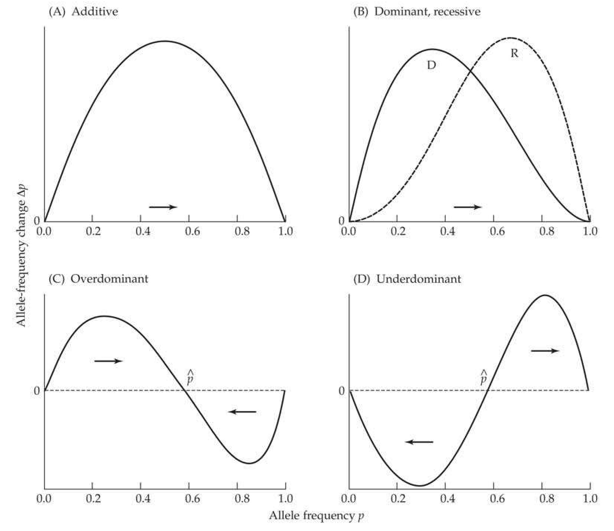
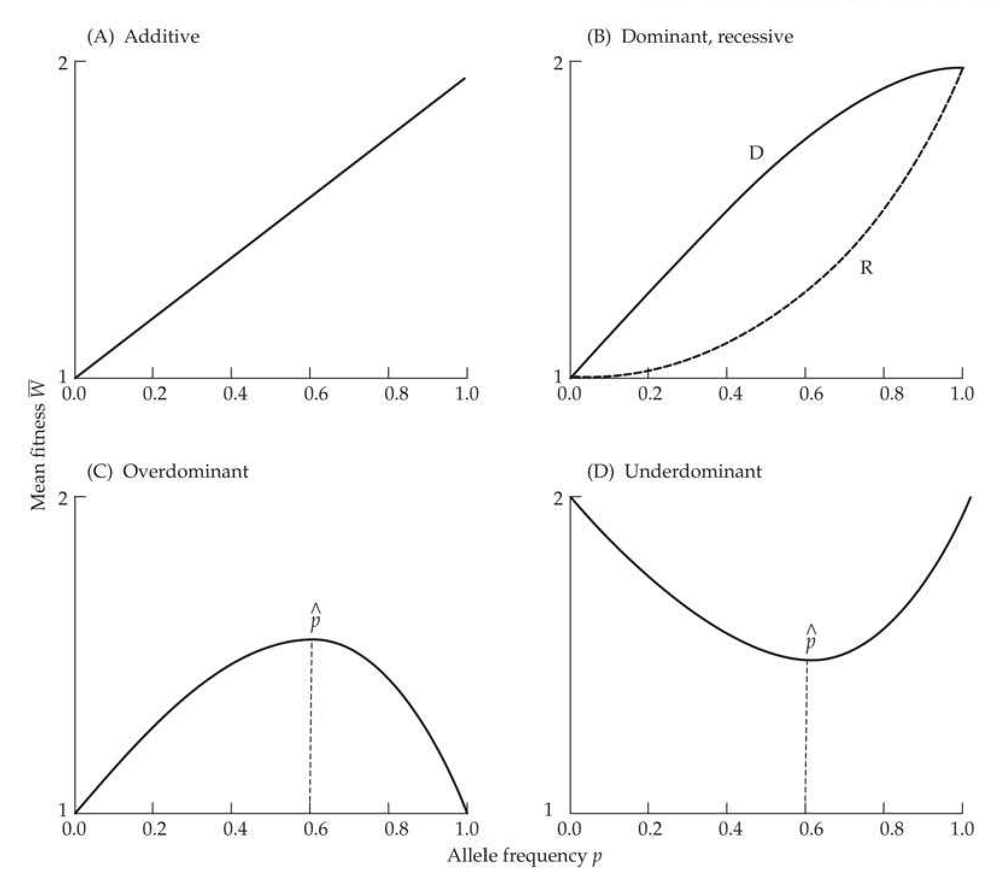
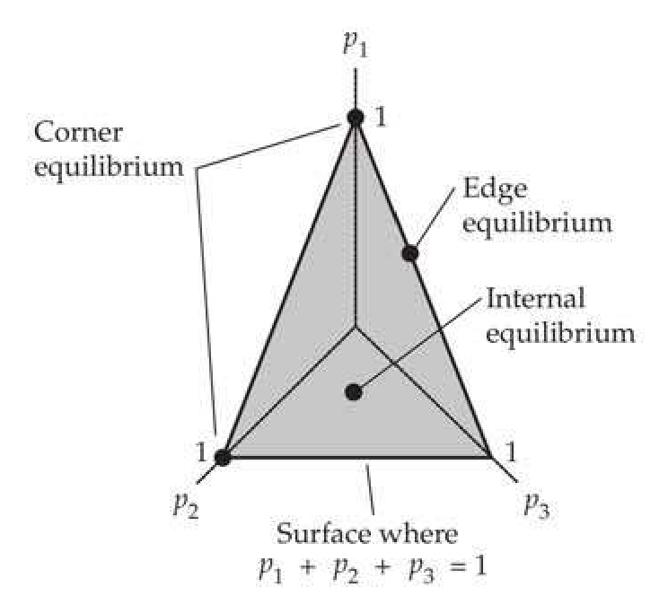
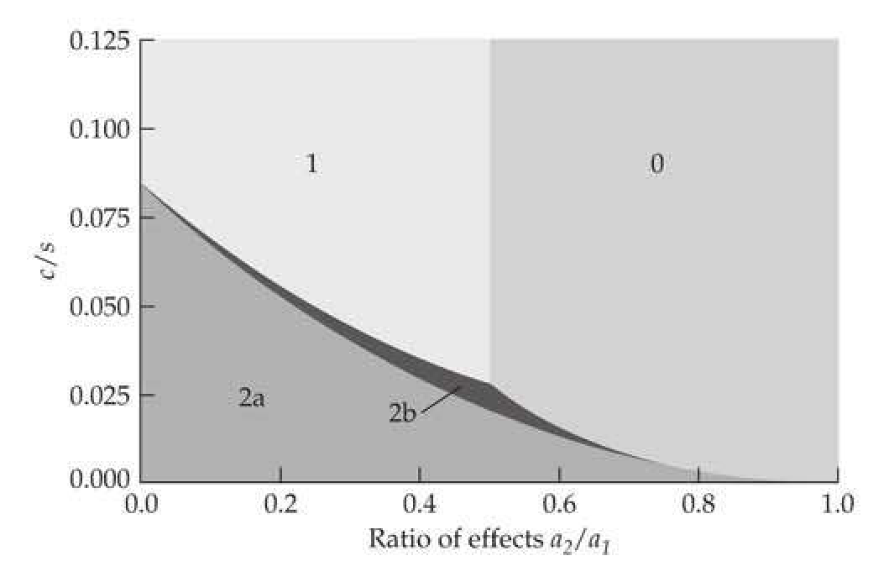
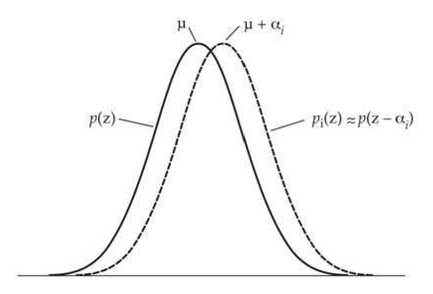

# Chapter 5 · The Population Genetics of Selection

## chapter5_001 · The Population Genetics of Selection: Introduction

Theoretical population genetics is surely a most unusual subject. At times it appears to have little connection with the parent subject on which it must depend, namely observation and experimental genetics, living an almost inbred life of its own. Warren Ewens (1994, p. 186)

**[命题 Proposition]**

Selection is the focus of much of this book, and here we lay the foundations for the response to selection on quantitative traits by first considering scenarios involving one or two loci. There are two fundamental reasons for starting here. First, in some settings, the trait of interest is indeed largely controlled by a single major gene, in which case the models introduced here are directly applicable. Second, these relatively simple population-genetic models form the foundation for models of the selection response when trait variation is controlled by multiple loci. Short-term prediction of the response of a quantitative trait to selection is done under the assumption of either constant genetic variances (Chapter 13) or predictable changes in the genetic variance from linkage disequilibrium (Chapter 16). Over longer time scales, allele-frequency change alters the genetic variances, and one- and low-locus population-genetic models are central to evaluating how these changes are influenced by the underlying genetic architecture of a trait (Chapters 24–28).

**[命题 Proposition]**

One key assumption of this chapter is that population size is effectively infinite, meaning that there is no effect of drift. A second assumption is that precise fitness values can be assigned to individual genotypes—one knows $ W_g $, the average fitnesses for all genotypes g at the locus (or loci) of interest. Conversely, in the typical quantitative-genetic setting, fitness is defined for phenotypes, not genotypes, with $ W(z) $ denoting the average fitness of individuals with phenotypic value z, with little regard for their underlying genotypes. We connect these different views of fitness at the end of the chapter, showing how selection on phenotypes maps into selection on an underlying locus, and forging a fundamental connection between the population-genetic and quantitative-genetic views of selection.

We start with a review of single-locus selection theory, highlighting how the dynamical equations for allele-frequency change can also be expressed in terms of quantitative-genetic parameters (average excesses) for fitness. While single-locus theory is essentially complete, when two or more loci are involved, gametic-phase disequilibrium is usually generated. If this occurs, single-locus equations for allele-frequency change no longer hold and no completely general statement can be made about the behavior of a system under selection.

This lack of a general theory can be addressed in one of two ways. First, exact results are available for particular two-locus models, and we present these to offer some guidance for the behavior of models with more loci. Second, rather than following the underlying changes in gametic frequencies (as required for multilocus models), we instead can approximate their impact on the expected change of the mean of a trait. We touch upon this trait-based approach at the end of this chapter by showing how single-locus approximations lead to the classic breeder's equation. General approximations for the behavior of traits under selection are further developed in Chapter 6.

---

## chapter5_002 · The Population Genetics of Selection: Introduction / SINGLE-LOCUS SELECTION: TWO ALLELES

Consider the simplest selection model: one locus with two alleles $ (A, a) $ and constant genotypic fitnesses of $ W_{AA} $, $ W_{Aa} $, and $ W_{aa} $. The analysis of selection on such systems dates back to a series of papers by Haldane from 1924 to 1932 (summarized in Haldane 1932b; see Clark 1984 and Crow 1992 for overviews of Haldane's fascinating life and legacy). We

**[Table]**

> **Table 5.1** · `5.1` · page 2 · source: `chapter5_002`
> Table 5.1 Genotype frequencies after viability selection. Here, p is the frequency of allele A, genotypes are in Hardy-Weinberg frequencies before selection, and  $ \overline{W} $ is the mean population fitness (Equation 5.1a).
>
> Genotype | AA | Aa | aa
> --- | --- | --- | ---
> Frequency before selection | $ p^{2} $ | $ 2p(1-p) $ | $ (1-p)^{2} $
> Fitness | $ W_{AA} $ | $ W_{Aa} $ | $ W_{aa} $
> Frequency after selection | $ p^{2}\frac{W_{AA}}{\overline{W}} $ | $ 2p(1-p)\frac{W_{Aa}}{\overline{W}} $ | $ (1-p)^{2}\frac{W_{aa}}{\overline{W}} $

**[命题 Proposition]**

deal first with viability selection, in which case W is the probability of survival from birth to reproductive age. Under this model, once adults reach reproductive age, there is no difference in mating ability and/or fertility between genotypes. Differential survival changes p, the initial frequency of allele A, to a new frequency, $ p' $, in prereproductive (but post-election) adults. Under the assumption of an effectively infinite population size, random mating then ensures that the offsprings' genotypic frequencies are in Hardy-Weinberg proportions. However, as we will show below, if parental genotypes differ in fertility, offspring genotypes will generally not be in Hardy-Weinberg proportions.

---

## chapter5_003 · SINGLE-LOCUS SELECTION: TWO ALLELES / Viability Selection

**[推导 Derivation]**

Consider the change in the frequency $p$ of allele $A$ over one generation, $\Delta p = p' - p$. As shown in Table 5.1, the number of AA individuals following selection is proportional to $p^2 W_{AA}$, the frequency of AA genotypes before selection multiplied by their genotypic fitness. To ensure that post-selection frequencies sum to one, we divide this proportion by a normalization constant, the mean population fitness (the average fitness of a randomly chosen individual),

> **Formula (5.1a)** · `5.1a` · source: `chapter5_block_008` · Viability Selection
>
> $$ \overline{W}=p^{2}W_{A A}+2p\left(1-p\right)W_{A a}+\left(1-p\right)^{2}W_{a a} $$

**[推导 Derivation]**

Proceeding similarly for the other genotypes allows us to fill out the entries in Table 5.1. From these new genotypic frequencies, the frequency of A after selection is $$ p^{\prime}=freq(AA after selection)+\frac{1}{2}freq(Aa after selection) $$ and applying the results in Table 5.1 gives the expected change in the frequency of A as

> **Formula (5.1b)** · `5.1b` · source: `chapter5_block_009` · Viability Selection
>
> $$ \Delta p=p^{\prime}-p=p\left(p\frac{W_{A A}}{\overline{W}}+(1-p)\frac{W_{A a}}{\overline{W}}-1\right) $$

This equation can also be expressed using the relative fitnesses $ W_{ij}/\overline{W} $, abbreviated as $ w_{ij} $, with mean fitness then scaling to $ \overline{w} = 1 $. Throughout, we will adhere to a notation whereby upper-case $ W $ corresponds to some absolute measure of fitness, and lower-case $ w $ corresponds to relative fitness.

**[推导 Derivation]**

If we assign the genotypes $ aa:Aa:AA $ fitnesses of $ 1:1+s(1+h):1+2s $, Equation 5.1b becomes

> **Formula (5.1c)** · `5.1c` · source: `chapter5_block_011` · Viability Selection
>
> $$ \Delta p=\frac{sp(1-p)[1+h(1-2p)]}{\overline{W}} $$

As shown in Figure 5.1, a graph of $ \Delta p $ as a function of p provides a useful description of the allele-frequency dynamics under selection. In particular, allele frequencies that satisfy

**[Figure]**

> **Figure 5.1** · page 3 · source: `chapter5`
>
> 
>
> Figure 5.1 A plot of allele-frequency change  $ \Delta p $ as a function of  $ p $ is a useful device for examining how frequencies change under selection. If  $ \Delta p > 0 $, the frequency of  $ A $ increases (moves to the right), as indicated by the right-pointing arrow. If  $ \Delta p < 0 $, the frequency of  $ A $ decreases (left-pointing arrow). If  $ \Delta p = 0 $, the allele frequencies are at equilibrium. (A) Directional selection with additive fitnesses favoring allele  $ A $. For  $ p \neq 0 $,  $ 1; \Delta p > 0 $, and  $ p $ increases to one, with the rate of change becoming symmetric about  $ p = 1/2 $. (B) Directional selection with dominance and allele  $ A $ favored. Curve  $ D $ corresponds to allele  $ A $ dominant, and curve  $ R $ to  $ A $ recessive. Here the response is asymmetric about  $ p = 1/2 $. In both cases,  $ \Delta p > 0 $ (provided  $ p \neq 0, 1 $), and the frequency of  $ A $ increases to 1. (C) Overdominant selection, where the heterozygote is more fit than either homozygote (Example 5.4), has an internal equilibrium frequency of  $ \widehat{p} $. For frequencies above the equilibrium,  $ \Delta p < 0 $ and the frequency decreases to  $ \widehat{p} $; whereas if  $ p $ is less than  $ \widehat{p} $,  $ \Delta p > 0 $ and the allele frequency increases to  $ \widehat{p} $. Thus,  $ \widehat{p} $ is a stable equilibrium. (D) With underdominant selection, the heterozygote is less fit than either homozygote. Again, there is an internal equilibrium allele frequency, but in this case it is unstable. If  $ p < \widehat{p} $,  $ p $ decreases toward zero, while if  $ p > \widehat{p} $,  $ p $ increases toward one. The result is fixation of either  $ A $ or  $ a $, depending on the starting allele frequency.

$ \Delta p = 0 $ (i.e., no allele-frequency change after selection) are called equilibrium frequencies, which we denote by $ \hat{p} $. Regardless of the values of s or h, trivial boundary equilibria exist when only one allele is present ($ \hat{p} = 0 $ or 1). Equation 5.1c shows that an internal equilibrium, in which both alleles are segregating, requires $ 1 + h(1 - 2\hat{p}) = 0 $, which yields $ \hat{p} = (1 + h)/(2h) $. Thus either h > 1 (overdominance) or h < -1 (underdominance) is required to ensure $ 0 < \hat{p} < 1 $. However, the equilibrium behavior is very different in these two cases. The situation h > 1 represents a stable equilibrium, in which following a small perturbation from $ \hat{p} $, selection returns the allele frequency to $ \hat{p} $ (Figure 5.1). In contrast, with $h < -1$, there is an unstable equilibrium, selection sends the allele frequency away from $\hat{p}$ which following a small perturbation (Figure 5.1).

**[示例 Example]**

> **Example 5.1** · ref: `5.1` · source: `chapter5_003.json` · blocks 5–8
>
> Example 5.1. Letting $ p = \text{freq}(A) $, what is $ \Delta p $ when $ W_{AA} = 1 + 2s $, $ W_{Aa} = 1 + s $, and $ W_{aa} = 1 $? These are additive fitnesses, with each copy of allele A adding an amount $ s $ to the fitness. In this case, mean fitness simplifies to $ \overline{W} = 1 + 2sp $ (there is an average of $ 2p $ A alleles per individual, each of which increments fitness by $ s $), and applying Equation 5.1c (setting $ h = 0 $) yields $$ \Delta p=\frac{sp(1-p)}{1+2sp} $$ (5.2a) Noting that a first-order Taylor expansion (in s) yields $ 1/(1+2sp)=1-2sp+O(s^{2}) $, for $ |s| $ small, we have $$ \Delta p=sp(1-p)\left[1-2sp+O(s^{2})\right]=sp(1-p)+O(s^{2}) $$ (5.2b) The notation $ O(s^2) $ denotes terms of order $ s^2 $, which are negligible for $ |s| \ll 1 $. The only equilibrium allele frequencies under this model are $ \hat{p} = 0 $ and $ \hat{p} = 1 $. If $ A $ is favored by selection $ (s > 0) $, then $ \Delta p > 0 $ for $ 0 < p < 1 $ and the frequency of $ A $ increases to one, regardless of the starting point (Figure 5.1A). Here $ \hat{p} = 1 $ is a stable equilibrium point while $ \hat{p} = 0 $ is unstable, because if even a few copies of $ A $ are introduced, selection drives them to fixation. In contrast, if allele $ a $ is favored $ (s < 0) $, the frequency of allele $ A $ declines to zero regardless of the starting point and $ \hat{p} = 0 $ is stable, while $ \hat{p} = 1 $ is unstable.

---

## chapter5_004 · SINGLE-LOCUS SELECTION: TWO ALLELES / Expected Time for Allele-frequency Change

**[推导 Derivation]**

A key issue in selection theory is the expected time required for a given amount of allele-frequency change. Assuming that $s$ and $sh$ are small (i.e., there is weak selection, so that $\overline{W} \simeq 1$), we can ignore $\overline{W}$ in Equation 5.1.c as a first-order approximation (see Example 5.1). Equation 5.1c then shows that the change in allele frequency $p$ under weak selection is approximated by the differential equation

> **Formula (5.3a)** · `5.3a` · source: `chapter5_block_017` · Expected Time for Allele-frequency Change
>
> $$ \frac{dp}{dt}=sp(1-p)[1+h(1-2p)] $$

**[推导 Derivation]**

For additive selection $ (h = 0) $, this has a simple solution of

> **Formula (5.3b)** · `5.3b` · source: `chapter5_block_018` · Expected Time for Allele-frequency Change
>
> $$ p_{t}=\frac{p_{0}}{p_{0}+(1-p_{0})e^{-st}} $$

where $ p_t $ is the frequency of allele $ A $ at time $ t $. Often of greater interest is $ t_{p_t,p_0} $, the expected time required to move from initial frequency of $ p_0 $ to target value of $ p_t $. From Equation 5.3a, this is given by the integral

> **Formula (5.3c)** · `5.3c` · source: `chapter5_block_018` · Expected Time for Allele-frequency Change
>
> $$ t_{p_{t},p_{0}}=\frac{1}{s}\int_{p_{0}}^{p_{t}}\frac{dx}{x(1-x)[1+h(1-2x)]} $$

**[推导 Derivation]**

Crow and Kimura (1970) presented explicit results for several important cases. If fitnesses are additive $ (h = 0) $

> **Formula (5.3d)** · `5.3d` · source: `chapter5_block_019` · Expected Time for Allele-frequency Change
>
> $$ t_{p_{t},p_{0}}\simeq\frac{1}{s}\ln\left(\frac{p_{t}\left(1-p_{0}\right)}{p_{0}\left(1-p_{t}\right)}\right) $$

whereas if A is recessive $ (h = -1) $

> **Formula (5.3e)** · `5.3e` · source: `chapter5_block_019` · Expected Time for Allele-frequency Change
>
> $$ t_{p_{t},p_{0}}\simeq\frac{1}{2s}\left[\ln\left(\frac{p_{t}\left(1-p_{0}\right)}{p_{0}\left(1-p_{t}\right)}\right)-\frac{1}{p_{t}}+\frac{1}{p_{0}}\right] $$

and finally, if A is dominant $ (h = 1) $

> **Formula (5.3f)** · `5.3f` · source: `chapter5_block_019` · Expected Time for Allele-frequency Change
>
> $$ t_{p_{t},p_{0}}\simeq\frac{1}{2s}\left[\ln\left(\frac{p_{t}\left(1-p_{0}\right)}{p_{0}\left(1-p_{t}\right)}\right)+\frac{1}{1-p_{t}}-\frac{1}{1-p_{0}}\right] $$

**[示例 Example]**

> **Example 5.2** · ref: `5.2` · source: `chapter5_004.json` · blocks 3–4
>
> Example 5.2. Consider the time for a favored allele to move from a frequency of 0.1 to a frequency of 0.5. For an additive allele, Equation 5.3d yields $$ t\simeq s^{-1}\ln\left(\frac{0.5\left(1-0.1\right)}{0.1\left(1-0.5\right)}\right)=\frac{2.2}{s}\; generations $$ On the other hand, from Equations 5.3e and 5.3f, $ t \simeq 1.5/s $ generations when $ A $ is dominant, and $ t \simeq 5.1/s $ generations when $ A $ is recessive. The faster rate of response for a rare dominant allele occurs because $ A $ is fully exposed in heterozygotes ( $ W_{Aa} > W_{aa} $), while its fitness effects are completely hidden in heterozygotes when recessive ( $ W_{AA} > W_{Aa} = W_{aa} $). Conversely, this same feature slows down the rate of response of a dominant when $ A $ is common, as only rare aa homozygotes will be selected against.

---

## chapter5_005 · SINGLE-LOCUS SELECTION: TWO ALLELES / Differential Viability Selection on the Sexes

**[推导 Derivation]**

Up to now we have assumed there is equal selection operating on both sexes, but this need not be the case. To accommodate this complication, again assume there is random mating, an autosomal locus, and viability selection, but let x be the current frequency of allele A in males and y be the current value in females. The genotype frequencies following random mating and their fitnesses can be represented as $$ \begin{array}{cccc}Genotype&AA&Aa&aa\quad Mean\\ Frequency&yx&x(1-y)+y(1-x)&(1-x)(1-y)\\ Male fitness&W_{AA}&W_{Aa}&W_{aa}\quad\overline{W}\\ Female fitness&V_{AA}&V_{Aa}&V_{aa}\quad\overline{V}\end{array} $$ As in Table 5.1, the frequencies of surviving genotypes in males and females are equal to the product of their starting values and relative fitnesses. For example, $ yx\, W_{AA}/\overline{W}=yx\, w_{AA} $ and $ yx\, V_{AA}/\overline{V}=yx\, v_{AA} $ are the frequencies of AA among surviving males and females, respectively. The frequency of A in males after selection is the sum of the postselection frequency of AA plus half that of Aa, giving the recursion equation for the allele frequency in males as

> **Formula (5.4a)** · `5.4a` · source: `chapter5_block_022` · Differential Viability Selection on the Sexes
>
> $$ x^{\prime}=\frac{x y W_{A A}+(1/2)[x(1-y)+y(1-x)]W_{A a}}{\overline{W}} $$

> **Formula (5.4b)** · `5.4b` · source: `chapter5_block_022` · Differential Viability Selection on the Sexes
>
> $$ =x y w_{A A}+(1/2)[x(1-y)+y(1-x)]\; w_{A a} $$

where

> **Formula (5.4c)** · `5.4c` · source: `chapter5_block_022` · Differential Viability Selection on the Sexes
>
> $$ \overline{W}=x y W_{A A}+\left[x(1-y)+y(1-x)\right]W_{A a}+(1-x)(1-y)W_{a a} $$

with an analogous expression for $ y' $ in females obtained by replacing W by V. These new values $ (x', y') $ are then used for the next iteration. Kidwell et al. (1977) explored the conditions under which differential selection in the sexes can maintain variation (i.e., support a stable polymorphism). For additive selection, they found that antagonistic selection (meaning that the sign of the selection coefficients differs between sexes, with A favored in one sex and a in the other), can stably maintain variation only if the absolute values of selective differences are fairly close to each other. Strong disproportional selection in one sex will remove variation. See Kidwell et al. (1977) for an analysis of more complex cases.

---

## chapter5_006 · SINGLE-LOCUS SELECTION: TWO ALLELES / Frequency-dependent Selection

Although we have been assuming that the genotypic fitnesses $ W_{ij} $ are constants, this need not be the case. The fitness of a genotype may be a function of the other genotypes in the population, giving rise to frequency-dependent selection. For example, when a rare genotype has a selective advantage due to avoidance of a search image by a predator, its fitness declines as its frequency increases. Alleles at self-incompatibility loci in plants also have a fitness advantage when rare because successful gametes must fuse with those carrying different alleles.

If genotype fitness varies with allele frequencies, Equation 5.1 still holds, provided we replace the constant values of $ W_{ij} $ by the functions $ W_{ij}(p) $. One interesting feature of frequency-dependent selection is that mean population fitness need not increase over time. Indeed, Wright (1948a) provided a simple two-allele example where mean fitness strictly decreases over time.

Frequency-dependent selection can maintain a polymorphism when rare alleles have the highest fitness. Such a situation is often called balancing selection, but some caution is in order when using this term as it is also used for constant-fitness overdominance. Wright and Dobzhansky (1946) noted just how subtle this distinction can be, showing that both fitness models (frequency-dependence and overdominance) can generate identical allele-frequency dynamics. Thus, the two models cannot be distinguished from allele-frequency data alone. Indeed, Denniston and Crow (1990) and Lachmann-Tarkhanov and Sarkar (1994) showed that for any set of constant fitnesses, there is always an alternative frequency-dependent fitness set that generates the same exact allele-frequency dynamics.

Making a case for balancing selection via rare-genotype advantage requires making direct estimates of genotype fitnesses at different allele frequencies. Genotype fitnesses are expected to be constant under overdominance, but they change under frequency-dependence. An example of this approach was provided by Fitzpatrick et al. (2007), who examined the foraging gene of Drosophila melanogaster and found that the alternative sitter and rover alleles have their highest fitnesses when rare.

Finally, a (somewhat) related topic is the fate of alleles whose selection coefficients randomly fluctuate over generations. The important feature in this case is that the allele with the highest (arithmetic) mean absolute fitness, $ \mu_s = E[s] $, is not necessarily the winner. Rather, the allele with the highest geometric mean fitness wins (Dempster 1955a; Haldane and Jayakar 1963; Gillespie 1973, 1977; Orr 2007). The geometric mean can be approximated as $ \mu_s - \sigma_s^2 / [2\mu_s] $, so that the variance matters as well. Hence an allele that is less fit on average (i.e., has a smaller $ \mu_s $), can still win if it has a lower variance.

---

## chapter5_007 · SINGLE-LOCUS SELECTION: TWO ALLELES / Fertility/Fecundity Selection

We have also been assuming no differential fertility/fecundity (we treat these two terms as synonymous), meaning that all combinations of genotypic pairs produce, on average, the same number of offspring. Obviously, this is often not true. To treat this problem formally, the average number of offspring produced by the (ordered) cross of an $ A_i A_j $ male with an $ A_k A_l $ female is denoted by the fertility fitness, $ f_{ijkl} $. In this fully general case, it is no longer sufficient to simply follow allele frequencies. Rather, we must follow genotypic frequencies, and the resulting dynamics can quickly become very complex. For example, mean viability can easily decrease if the genotypes with low viability have sufficiently high fertility.

Bodmer (1965) and Kempthorne and Pollak (1970) further explored some of the consequences of fertility selection. A key result was that if the fertility fitnesses are multiplicative, $$ f_{i j k l}=f_{i j}\cdot f_{k l} $$ meaning that the average fertility of the cross is simply the product the fertility fitness for each genotype (as opposed to a specific value for each cross), then if $ w_{ij} $ is the viability fitness, the evolutionary dynamics proceed as with viability selection with fitness $ w_{ij}f_{ij} $.

---

## chapter5_008 · SINGLE-LOCUS SELECTION: TWO ALLELES / Sexual Selection

A final complication is sexual selection, non-random mating based on traits involved in mate choice (Chapter 29). In many species, mate choice is at least partly based on trait values, either through male-male competition for access to females or through female choice of specific males. Sexual selection for particular traits can result in very interesting evolutionary dynamics, especially when sexually preferred trait values conflict with natural selection (viability and/or fertility selection).

**[示例 Example]**

> **Example 5.3** · ref: `5.3` · source: `chapter5_008.json` · blocks 1–1
>
> Example 5.3. An interesting example of the consequences of sexual selection was presented by Muir and Howard (1999). As exotic genes are introduced into domesticated species to create transgenic organisms, there is a biosafety concern in the potential genetic risk of the introduced transgene. If the gene "escapes" into a wild population, will it increase in frequency, be neutral, or quickly be lost by negative selection? Muir and Howard (1999, 2001) and Howard et al. (2004) developed population-genetic models to assess such risk and used them to understand the fate of a transgenic strain of the Japanese medaka fish (Oryzias latipes). After insertion of a human growth-hormone gene under a fish-specific promoter, the resulting transgenic fish grows faster and to a much larger size than a normal medaka. While such a genetic transformation may be a boon for aquaculture, what would happen if the growth-hormone gene found its way into natural medaka populations? Muir and Howard found that transgenic fish have only 70% of the survival rate of normal fish. Based on this strong viability selection, one might think that any transgenes that escape would quickly be lost. However, Muir and Howard found that larger fish have a roughly four-fold mating advantage relative to smaller fish. Based on these parameter values, any escaped transgene will spread, as the mating advantage more than offsets the survival disadvantage. However, simulation studies find a potentially more ominous fate under these parameter values. The transgene not only spreads, but it eventually may drive the population to extinction as a consequence of the reduction in viability. Muir and Howard coined the term Trojan gene for such settings. Such genes may also arise naturally. A potential example was given by Dawson (1969), who found that a newly arisen eye color mutation in Tribolium castaneum rapidly increased in frequency in tandem with the rate at which the line went extinct in a competition experiment.

---

## chapter5_009 · The Population Genetics of Selection: Introduction / WRIGHT'S FORMULA

**[推导 Derivation]**

A more compact and insightful way to express allele-frequency change was presented by Sewall Wright, one of the founding fathers (with Fisher and Haldane) of modern selection theory. Because

> **Formula (5.5a)** · `5.5a` · source: `chapter5_block_032` · WRIGHT'S FORMULA
>
> $$ \begin{aligned}\frac{d\overline{W}}{dp}&=\frac{d\left(p^{2}W_{AA}+2p(1-p)W_{Aa}+(1-p)^{2}W_{aa}\right)}{dp}\\&=2pW_{AA}+2(1-2p)W_{Aa}-2(1-p)W_{aa}\end{aligned} $$

a little algebra shows that Equation 5.1b can be written as

> **Formula (5.5b)** · `5.5b` · source: `chapter5_block_032` · WRIGHT'S FORMULA
>
> $$ \Delta p=\frac{p(1-p)}{2\overline{W}}\frac{d\overline{W}}{dp}=\frac{p(1-p)}{2}\frac{d\ln\overline{W}}{dp} $$

The last step follows from the chain rule for differentiation. $$ \frac{d\ln f(x)}{dx}=\frac{1}{f(x)}\frac{df(x)}{dx} $$

Equation 5.5b is Wright's formula (1937), which holds provided the genotypic fitnesses are constant and frequency independent (not themselves functions of allele frequencies, which can be formally stated as $ \partial W_{ij}/\partial p_k = 0 $ for all $ i, j $, and $ k $. Normal derivatives are used in Equation 5.5b as there is just a single variable, the allele frequency $ p $.

**[示例 Example]**

> **Example 5.4** · ref: `5.4` · source: `chapter5_009.json` · blocks 3–7
>
> Example 5.4. Consider a locus with two alleles and genotypic fitnesses $$ W_{A A}=1-t,\quad W_{A a}=1,\quad\mathrm{a n d}\quad W_{a a}=1-s $$
> 
> Letting $ p = \text{freq}(A) $, Wright's formula can be used to find $ \Delta p $ and the equilibrium allele frequencies. Here mean fitness is given by $$ \begin{aligned}\overline{W}&=p^{2}(1-t)+2p(1-p)(1)+(1-p)^{2}(1-s)\\&=1-tp^{2}-s(1-p)^{2}\end{aligned} $$
> 
> Taking derivatives with respect to p results in $$ \frac{d\overline{W}}{dp}=2[s-p(s+t)] $$ which, upon substituting into Wright's formula, results in $$ \Delta p=\frac{p(1-p)[s-p(s+t)]}{1-tp^{2}-s(1-p)^{2}} $$
> 
> Alternatively, substituting these fitnesses into Equation 5.1b recovers the same result.
> 
> Setting $ \Delta p = 0 $ yields three equilibrium solutions: $ \widehat{p} = 0, \widehat{p} = 1 $, and, most interestingly, $$ \widehat{p}=s/(s+t) $$ which corresponds to $ dW/dp = 0 $, a necessary condition for a local extremum (maximum or minimum) in $ \overline{W} $. Recall from calculus that this extremum is a maximum when $ d^2\overline{W}/dp^2 = -2(s + t) < 0 $, and a local minimum when this second derivative is positive. With selective overdominance ($ s, t > 0 $), the heterozygote has the highest fitness, implying $ \Delta p > 0 $ when $ p < \widehat{p} $, and $ \Delta p < 0 $ when $ p > \widehat{p} $ (Figure 5.1C). Thus, selection retains both alleles in the population, as first shown by Fisher (1922). With overdominance, $ \widehat{p} $ is also the allele frequency that maximizes $ \overline{W} $. With selective underdominance (s, t < 0), the heterozygote has lower fitness than either homozygote. Although there is still an equilibrium, $ \widehat{p} = s/(s + t) $ corresponds to a local minimum of $ \overline{W} $ (as $ d^2 \overline{W}/dp^2 > 0 $) and is therefore unstable—if p is the slightest bit below $ \widehat{p} $, it decreases to zero, while if p is the slightest bit above $ \widehat{p} $, it increases to one (Figure 5.1D). In contrast to selective overdominance, selective underdominance removes, rather than maintains, genetic variation, with the initial starting frequencies determining which allele is fixed.

**[示例 Example]**

> **Example 5.5** · ref: `5.5` · source: `chapter5_009.json` · blocks 8–9
>
> Example 5.5. A classic example of selective overdominance is sickle-cell anemia, a disease due to a recessive allele at the beta hemoglobin locus. SS homozygotes suffer periodic life-threatening health crises due to their red blood cells being sickle-shaped. SS individuals often have near-zero fitness (due to their low survival to reproductive age), and ordinarily this would be expected to result in a very low frequency of the S allele. However, in malaria-infested regions, SN heterozygotes (N denoting the “normal” allele) have increased resistance to malaria relative to NN homozygotes. A sample of 12,387 West Africans yielded 9365 NN, 2993 NS, and 29 SS individuals (Nussbaum et al. 2004), giving a frequency of S as $$ \frac{(1/2)\cdot2993+29}{12,387}=0.123 $$ Assuming the frequency of S is at its selective equilibrium, what is the strength of selection against NN individuals due to malaria? Writing the fitnesses of the SS, SN, and NN genotypes as 1 - t, 1, and 1 - s respectively, the result from Example 5.4 is an equilibrium frequency of $ s/(s + t) $ for allele S. Setting this equal to 0.123 implies that $$ t=\frac{(1-0.123)}{0.123}s=7.120s\quad or\quad s=0.140t $$ If SS individuals are either lethal (t = 1) or have only 10% fitness (t = 0.9), then s = 0.140 and 0.126, respectively. In other words, relative to NN individuals, heterozygotes have a 13% to 14% fitness advantage due to increased malaria resistance.

---

## chapter5_010 · The Population Genetics of Selection: Introduction / WRIGHT'S FORMULA

Assuming the frequency of S is at its selective equilibrium, what is the strength of selection against NN individuals due to malaria? Writing the fitnesses of the SS, SN, and NN genotypes as 1 - t, 1, and 1 - s respectively, the result from Example 5.4 is an equilibrium frequency of $ s/(s + t) $ for allele S. Setting this equal to 0.123 implies that $$ t=\frac{(1-0.123)}{0.123}s=7.120s\quad or\quad s=0.140t $$

If SS individuals are either lethal (t = 1) or have only 10% fitness (t = 0.9), then s = 0.140 and 0.126, respectively. In other words, relative to NN individuals, heterozygotes have a 13% to 14% fitness advantage due to increased malaria resistance.

**[示例 Example]**

> **Example 5.6** · ref: `5.6` · source: `chapter5_010.json` · blocks 2–8
>
> Example 5.6. A common model in evolutionary genetics considers a trait (determined by a number of loci) that is experiencing stabilizing selection, with some intermediate phenotypic value $ \theta $ favored (Chapters 28–30). Given that intermediate phenotypes are favored, naively one might think that heterozygotes (whose phenotypes are between those of the two homozygotes) are favored, resulting in selective overdominance. However, the application of Wright's formula to the allelic dynamics at one of the underlying loci shows that this is not the case. To demonstrate this, we need to express the mean fitness W in terms of the allele frequency $ p_{i} $ at some focal locus. To do so, we start with a standard model for stabilizing selection, a Gaussian fitness function, with the expected fitness of an individual with trait value z given by $$ W(z)=e^{-(z-\theta)^{2}/\omega^{2}},\quad\mathrm{w i t h}\quad\omega^{2}>0 $$ Akin to the variance in a Gaussian (i.e., normal) distribution, $ \omega^2 $ measures the strength of selection against the trait, with larger values indicating weaker selection (fitness declining more slowly as we move away from $ \theta $). Letting $ s = 1/\omega^2 $, Barton (1986) showed that if phenotypes are normally distributed with a mean of $ \mu $ and a variance of $ \sigma^2 $, then (assuming weak selection, $ \sigma^2 \ll \omega^2 = 1/s $) the mean fitness is $$ \begin{array}{r l r l}{\overline{{W}}\simeq e^{-[\sigma^{2}+(\mu-\theta)^{2}]/(2\omega^{2})},}&{{}}&{\mathrm{i m p l y i n g}}&{{}}&{\ln\overline{{W}}\simeq-s[\sigma^{2}+(\mu-\theta)^{2}]/2}\end{array} $$ (5.6a) Because the mean and variance are functions of the allele frequencies over all loci, our concern is now the partial derivative with respect to the allele frequency $ p_{i} $ at our focal locus. Applying the chain rule, $$ \begin{aligned}\frac{\partial\ln\overline{W}}{\partial p_{i}}&=-(s/2)\frac{\partial[\sigma^{2}+(\mu-\theta)^{2}]}{\partial p_{i}}\\&=-(s/2)\left[\frac{\partial\sigma^{2}}{\partial p_{i}}+2(\mu-\theta)\frac{\partial\mu}{\partial p_{i}}\right]\end{aligned} $$ (5.6b) Now suppose that $n$ diallelic fully additive loci underlie this character (no dominance or epistasis), with the genotypes $b_i b_i$, $B_i b_i$, and $B_i B_i$ at each locus $i$ having effects $0$, $a_i$, and $2a_i$. Letting $p_i$ be the frequency of allele $B_i$, the trait mean is some baseline value $m$ plus the genetic contributions, while the trait variance is the additive-genetic plus environmental variances, $$ \mu=m+2\sum_{i=1}^{n}a_{i}p_{i}\qquad and\qquad\sigma^{2}=2\sum_{i=1}^{n}a_{i}^{2}p_{i}\left(1-p_{i}\right)+\sigma_{E}^{2} $$ (5.6c) where the additive-genetic variance expression (LW Equation 4.23b) assumes no linkage disequilibrium. From Equation 5.6c, $$ \frac{\partial\mu}{\partial p_{i}}=2a_{i}\qquad\mathrm{a n d}\qquad\frac{\partial\sigma^{2}}{\partial p_{i}}=2a_{i}^{2}\left(1-2p_{i}\right) $$ (5.6d) Wright’s formula (Equation 5.5b) returns the expected change in the frequency of allele $ B_{i} $ as $$ \Delta p_{i}=\frac{p_{i}(1-p_{i})}{2}\left(\frac{\partial\ln W}{\partial p_{i}}\right) $$ which, upon substituting Equation 5.6d into Equation 5.6b, yields $$ \Delta p_{i}=s a_{i}\left(\frac{p_{i}(1-p_{i})}{2}\right)\left[a_{i}\left(2p_{i}-1\right)+2(\theta-\mu)\right] $$ (5.6e) Thus, even if the population mean $ \mu $ coincides with the phenotypic optimum $ \theta $, there remains the potential for selection on the underlying loci, as in this special case Equation 5.6e reduces to $$ \Delta p_{i}=a_{i}^{2}s p_{i}(1-p_{i})(p_{i}-1/2) $$ (5.6f) This is a form of selective underdominance, with $ \widehat{p}_i = 1/2 $ being unstable, as $ \Delta p_i < 0 $ for $ p_i < 1/2 $, while $ \Delta p_i > 0 $ for $ p_i > 1/2 $. Hence, selection for an optimum phenotype tends to drive allele frequencies toward fixation, removing, rather than retaining, variation at underlying loci (Robertson 1956).

---

## chapter5_011 · WRIGHT'S FORMULA / Adaptive Topographies and Wright's Formula

The surface $ \overline{W}(p) $ of mean population fitness as a function of allele frequency forms an adaptive topography, showing which $ \overline{p} $ value or values maximize mean fitness. Examples are shown in Figure 5.2, which plots $ \overline{W}(p) $ for the same settings as in Figure 5.1. Note that stable equilibria correspond to local maxima (Figure 5.2) and unstable equilibria correspond to local minima in mean fitness (Figure 5.2). Because $ p(1 - p) \geq 0 $, Wright's formula implies that the sign of $ \Delta p $ is the same as the sign of $ d \ln \overline{W}/dp $, implying that allele frequencies change to locally maximize mean fitness. Wright's formula thus suggests a powerful geometric interpretation of the mean-fitness surface $ \overline{W}(p) $—the local curvature of the fitness surface largely describes the behavior of the allele frequencies. In a random-mating population with constant $ W_{ij} $, allele-frequency changes move the population toward the nearest local maximum on the fitness surface.

However, evolution toward maximum fitness is only guaranteed when the assumptions underlying Wright's formula hold (e.g., single-locus viability selection with constant genotypic fitnesses). Further, in a strict mathematical sense, mean fitness need not increase to a local maximum. If the initial allele frequencies are such that mean population fitness is exactly at a local minimum, allele frequencies do not change, as $ d \ln \bar{W}/dp = 0 $ (Example 5.4). However, this case is biologically trivial, as the resulting equilibrium is unstable—any amount of genetic drift moves allele frequencies away from this minimum, with mean fitness subsequently increasing to a local maximum.

---

## chapter5_012 · The Population Genetics of Selection: Introduction / SINGLE-LOCUS SELECTION: MULTIPLE ALLELES

Extending single-locus models from two to multiple alleles is a straightforward process and also reveals connections between quantitative-genetic concepts and the behavior of population-genetic models. In particular, multiple-allele models can be framed in terms of the average excess (LW Chapter 4) of each allele on fitness, which then leads into a discussion of how the additive genetic variance in fitness influences the selection response (allele-frequency change).

---

## chapter5_013 · SINGLE-LOCUS SELECTION: MULTIPLE ALLELES / Marginal Fitnesses and Average Excesses

For a locus with n alleles under viability selection and random mating, the frequencies of the $ A_i A_j $ heterozygotes and $ A_i A_i $ homozygotes after selection are $ 2 p_i p_j W_{ij} / \overline{W} $ and $ p_i^2 W_{ii} / \overline{W} $. As in Table 5.1, for a biallelic locus, this follows from weighting the (random-mating) frequency of a genotype before selection by its fitness, with $$ \begin{align*}\overline{W}=\sum\limits_{i=1}^n\sum\limits_{j=1}^n p_i p_j W_{ij}\end{align*} $$

**[Figure]**

> **Figure 5.2** · page 11 · source: `chapter5`
>
> 
>
> Figure 5.2 Plots of mean population fitness,  $ \overline{W}(p) $, as a function of allele frequency p (as in Figure 5.1). In all cases, the best genotype has a fitness of 2.0 and the worst has a fitness of 1.0. (A) Directional selection with additive fitness, with allele A favored. (B) Directional selection with dominance, with allele A favored. The upper curve (D) is for A dominant and the lower (R) is for A recessive. In both (A) and (B), mean fitness is maximized at the stable equilibrium point (p = 1). (C) With overdominant selection, fitness is maximized at the stable equilibrium point  $ \hat{p} $. (D) With underdominant selection, fitness is minimized at the unstable internal equilibrium point  $ \hat{p} $.

**[推导 Derivation]**

The frequency of allele $ A_i $ in survivors is the postselection frequency of the $ A_i A_i $ homozygote plus half the postselection frequencies of all $ A_i A_j $ heterozygotes, a sum that simplifies to

> **Formula (5.7a)** · `5.7a` · source: `chapter5_block_055` · Marginal Fitnesses and Average Excesses
>
> $$ \begin{align*}p^{\prime}_i=\frac{p_i}{\overline W}\sum_{j=1}^n p_j W_{ij}=p_i\frac{W_i}{\overline W}\end{align*} $$

> **Formula (5.7b)** · `5.7b` · source: `chapter5_block_055` · Marginal Fitnesses and Average Excesses
>
> $$ \begin{align*}W_i=\sum\limits_{j=1}^n p_j W_{ij}\end{align*} $$

where is the marginal fitness of allele $ A_{i} $, i.e., the expected fitness of an individual carrying one copy of $ A_{i} $ and a second randomly chosen allele. Further, $$ \overline{W}=\sum_{i=1}^{n}p_{i}W_{i} $$ so one can also express mean fitness as the average of the marginal fitnesses.

**[推导 Derivation]**

Note that, unlike genotypic fitness $ (W_{ij}) $, the marginal fitness $ W_i $ is a function of the allele frequencies and hence is expected to change over time. The concept of marginal fitness can be understood as follows: under random mating, if one allele is known to be $ A_i $, then with probability $ p_j $, the other will be $ A_j $ and the resulting fitness will be $ W_{ij} $. Summing over all possible alleles recovers Equation 5.7b. If $ W_i > \overline{W} $ (individuals carrying $ A_i $ have a higher fitness than a random individual), then $ A_i $ will increase in frequency. If $ W_i < \overline{W} $, $ A_i $ will decrease in frequency. Finally, if $ W_i = \overline{W} $, the frequency of $ A_i $ will be unchanged. From Equation 5.7a, the expected allele-frequency change is

> **Formula (5.7c)** · `5.7c` · source: `chapter5_block_056` · Marginal Fitnesses and Average Excesses
>
> $$ \Delta p_{i}=p_{i}^{\prime}-p_{i}=p_{i}\frac{W_{i}-\overline{W}}{\overline{W}} $$

which implies that at a polymorphic equilibrium (e.g., $ \hat{p}_i \neq 0, 1 $),

> **Formula (5.7d)** · `5.7d` · source: `chapter5_block_056` · Marginal Fitnesses and Average Excesses
>
> $$ W_{i}=\overline{W}for all i with0<\widehat{p}_{i}<1 $$

Thus, at an equilibrium, all segregating alleles have the same marginal fitness.

**[推导 Derivation]**

Marginal fitnesses provide a direct connection between single-locus and quantitative-genetic theory. Recalling that the average excess of allele $ A_i $ is the difference between the mean of individuals carrying a copy of $ A_i $ and the population mean (LW Equation 4.16), we immediately see that $ (W_i - \overline{W}) $ is the average excess in absolute fitness of allele $ A_i $, implying that

> **Formula (5.8a)** · `5.8a` · source: `chapter5_block_058` · Marginal Fitnesses and Average Excesses
>
> $$ s_{i}=\left(W_{i}-\overline{W}\right)/\overline{W}=w_{i}-1 $$

is the average excess in relative fitness. Like $ W_{i} $, $ s_{i} $ is a function of allele frequencies, and thus changes as these change. Equation 5.7c can therefore be expressed as

> **Formula (5.8b)** · `5.8b` · source: `chapter5_block_058` · Marginal Fitnesses and Average Excesses
>
> $$ \Delta p_{i}=p_{i}\, s_{i} $$

Thus, at equilibrium, the average excess in fitness of each allele equals zero. As there is then no variation in the average excesses, it immediately follows that the additive genetic variance in fitness is also zero at the equilibrium allele frequencies, as a nonzero additive genetic variance requires variation in the average excesses (see LW Equation 4.23a).

---

## chapter5_014 · SINGLE-LOCUS SELECTION: MULTIPLE ALLELES / Equilibrium Frequencies With Multiple Alleles

As with a single locus with two alleles, mean fitness never decreases with n alleles at a single locus (again assuming constant fitnesses, viability selection, and random mating). The classical short proof for this was given by Kingman (1961a). A more interesting question involves the number of polymorphic equilibria that exist with two (or more) segregating alleles. In particular, how many equilibria with all n alleles polymorphic are possible? Kingman (1961b) showed that such a system either has no such equilibria, exactly one, or an infinite number (a line or hyperplane of solutions). We can see this from Equation 5.7d, as the equilibrium marginal fitnesses for all segregating alleles are identical, e.g., $ \widehat{W_i} = \widehat{W}_1 = \overline{W} $ for $ i = 2, \cdots, n $. Because each marginal fitness is a linear function of the n equilibrium allele frequencies (Equation 5.7b), there are $ n - 1 $ linear equations in terms of the equilibrium frequencies for the n alleles (as the allele frequencies are constrained to sum to one), with $$ \widehat{W}_{i}=\sum_{j=1}^{n}W_{i j}\widehat{p}_{j}=\widehat{W}_{1}=\sum_{j=1}^{n}W_{1j}\widehat{p}_{j}for i=2,\cdots,n $$ With a linear system of $ n - 1 $ equations and $ n - 1 $ unknowns, there will be either zero, one, or infinitely many solutions. An example of the latter is that when all the $ W_{ij} = 1 $, any set of allele frequencies is stable, as this is just the neutral condition.

A more profound result obtained by Kingman is that the existence of a single internal (and stable) equilibrium for all $n$ alleles requires the fitness matrix $\mathbf{W}$ (whose $i$th element is $W_{ij}$) to have exactly one positive and at least one negative eigenvalue (Appendix 5). More generally, if $\mathbf{W}$ has $m$ positive eigenvalues, then, at most, $n - m + 1$ alleles can be jointly polymorphic.

---

## chapter5_015 · SINGLE-LOCUS SELECTION: MULTIPLE ALLELES / Internal, Corner, and Edge Equilibria and Basins of Attraction

**[Figure]**

> **Figure 5.3** · page 13 · source: `chapter5`
>
> 
>
> Figure 5.3 The simplex for three alleles, namely the space of all possible allele frequencies, subject to the constraint that they must sum to 1. Note that the plane of possible values intersects each allele-frequency axis at a value of 1 for that allele, and 0 for all others. Within the simplex, three types of equilibria are possible. Corner equilibria occur when one allele has frequency 1; these are monomorphic equilibria, with no genetic variation. Polymorphic equilibria can either be edge equilibria, when at least two (but not all) allele frequencies are nonzero (here alleles 1 and 3 are segregating while allele 2 is absent), or internal equilibria, wherein all alleles are segregating.

With more than two alleles, a number of different types of equilibria are possible, and some notation is helpful for characterizing these types. With $n$ possible alleles, the space of potential allele frequencies is given by the simplex defined by the constraint $\sum_i^n p_i = 1$. Figure 5.3 shows this for the three-allele case, which is a section of a two-dimensional plane. With $n$ alleles, the resulting simplex is a section of an $n-1$ dimensional hyperplane. We can distinguish between three types of equilibria based on their location on the simplex. Corner equilibria are those for which the frequency of one allele is 1, and hence all others are 0, corresponding to a corner of the simplex (Figure 5.3). With $n$ alleles, there are $n$ corner equilibria. With edge equilibria, the values of one (or more) of the allele frequencies are 0, while the rest are nonzero, i.e., two (or more) alleles are segregating in the population. Finally, we can have an internal equilibrium, in which all alleles are segregating (all $\widehat{p}_i > 0$). Thus, polymorphic equilibria correspond to either edge equilibria (not all alleles are segregating) or internal equilibria (all are segregating). Kingman's (constant-fitness) result states there is either no internal equilibrium, a single unique one, or a surface (such as a line or plane) embedded within the simplex.

Far more important than the existence of equilibria is their stability. As noted above, when allele frequencies at an unstable equilibrium are perturbed, they depart the neighborhood of this equilibrium value. Conversely, departures from the nearby vicinity of a stable equilibrium are followed by returns to the equilibrium. If we have a surface of equilibria (as might occur if two or more alleles have identical fitnesses), then we can also have a surface of neutrally stable equilibria. In such cases, provided we perturb the allele frequencies along the equilibrium surface, the subsequent allele frequencies do not change over time (the neutral Hardy-Weinberg condition is one such example).

When multiple stable equilibria exist, the initial conditions (history) of the process have a great influence on the final value reached. We saw this with underdominance (Example 5.4) where, if the population starts with frequency in the open interval $ (0,\widehat{p}), p \to 0 $, while if the population starts in the open interval $ (\widehat{p}, 1), p \to 1 $. Thus, with multiple stable equilibria, there is a $ \text{basin of attraction} $ for each equilibrium value. Akin to rainfall over a wide area ending up in different rivers depending on which watershed basin it originally fell into, the domain of attraction for a stable equilibrium value is that region in the simplex within which starting allele frequencies eventually converge to the stable equilibrium of interest. In very special situations, one can use mathematical tools to determine such basins (e.g., Hofbauer and Sigmund 1988). More typically, however, one must systematically sample starting values within the simplex (e.g., using a grid of points) and then numerically iterate the equations of response to determine where the frequencies eventually converge.

---

## chapter5_016 · SINGLE-LOCUS SELECTION: MULTIPLE ALLELES / Wright's Formula With Multiple Alleles

**[推导 Derivation]**

With only two alleles, Equation 5.5b (under the assumption of frequency-independent fitnesses) completely describes the evolutionary dynamics in terms of a single variable (the frequency of either allele). To express Equation 5.7c in a form analogous to Equation 5.5b, we again assume that $ \partial W_{ij}/\partial p_k = 0 $ for all $ i,j $, and $ k $ (i.e., frequency-independent fitnesses). Taking the partial derivative of mean fitness with respect to $ p_i $, the frequency of allele $ A_i $,

> **Formula (5.9a)** · `5.9a` · source: `chapter5_block_065` · Wright's Formula With Multiple Alleles
>
> $$ \frac{\partial\overline{W}}{\partial p_{i}}=\frac{\partial}{\partial p_{i}}\left(\sum_{j}^{n}\sum_{k}^{n}p_{j}p_{k}W_{jk}\right)=2\sum_{k}^{n}p_{k}W_{ki}=2W_{i} $$

**[推导 Derivation]**

Hence,

> **Formula (5.9b)** · `5.9b` · source: `chapter5_block_066` · Wright's Formula With Multiple Alleles
>
> $$ W_{i}=\frac{1}{2}\frac{\partial\overline{W}}{\partial p_{i}} $$

**[推导 Derivation]**

Further, note that

> **Formula (5.9c)** · `5.9c` · source: `chapter5_block_067` · Wright's Formula With Multiple Alleles
>
> $$ \overline{W}=\sum_{j=1}^{n}p_{j}W_{j}=\frac{1}{2}\sum_{j=1}^{n}p_{j}\frac{\partial\overline{W}}{\partial p_{j}} $$

**[推导 Derivation]**

Hence,

> **Formula (5.9d)** · `5.9d` · source: `chapter5_block_068` · Wright's Formula With Multiple Alleles
>
> $$ W_{i}-\overline{W}=\frac{1}{2}\left(\frac{\partial\overline{W}}{\partial p_{i}}-\sum_{j=1}^{n}p_{j}\frac{\partial\overline{W}}{\partial p_{j}}\right) $$

**[推导 Derivation]**

Substituting Equation 5.9d into Equation 5.7c gives the allele-frequency change as

> **Formula (5.10)** · `5.10` · source: `chapter5_block_069` · Wright's Formula With Multiple Alleles
>
> $$ \Delta p_{i}=\frac{p_{i}}{2\overline{W}}\left(\frac{\partial\overline{W}}{\partial p_{i}}-\sum_{j=1}^{n}p_{j}\frac{\partial\overline{W}}{\partial p_{j}}\right) $$

This is the multiple-allele version of Equation 5.5b.

It is important to stress that Wright (1937) himself presented a different (and incorrect) version of his formula for multiple alleles, namely $$ \Delta p_{i}=\frac{p_{i}(1-p_{i})}{2\overline{W}}\frac{\partial\overline{W}}{\partial p_{i}} $$ which appears widely in the literature. Comparing this with the two-allele version (Equation 5.5b), it is easy to see how Wright became seduced by this extension of his (correct) two-allele formula. In various subsequent descriptions of the multiple-allele version, Wright attempted to justify his 1937 expression by suggesting that it was not a normal partial derivative, but rather a measure of the gradient in mean fitness along a direction in which the relative proportions of the other alleles do not change (Wright 1942, 1955). However, Edwards (2000) showed that even this interpretation is not correct and presented the correct expression for Wright's (1942, 1955) later interpretation (Edwards' expression still differs from Equation 5.10 and lacks a transparent interpretation).

**[推导 Derivation]**

For a compact way to write Equation 5.10, recall that $(\partial \overline{W}/\partial p_i)(1/\overline{W})=\partial \ln(\overline{W})/\partial p_i$, which yields

> **Formula (5.11a)** · `5.11a` · source: `chapter5_block_072` · Wright's Formula With Multiple Alleles
>
> $$ \Delta p_{i}=\sum_{j=1}^{n}G_{ij}\cdot\frac{\partial\ln\overline{W}}{\partial p_{j}} $$

where

> **Formula (5.11b)** · `5.11b` · source: `chapter5_block_072` · Wright's Formula With Multiple Alleles
>
> $$ G_{ij}=\left\{\begin{aligned}p_{i}(1-p_{i})/2&\quad i=j\\ -p_{i}p_{j}/2&\quad i\neq j\end{aligned}\right. $$

**[推导 Derivation]**

Equation 5.11a can be written in matrix form as

> **Formula (5.12a)** · `5.12a` · source: `chapter5_block_073` · Wright's Formula With Multiple Alleles
>
> $$ \Delta\mathbf{p}=\frac{1}{\overline{W}}\mathbf{G}\nabla\overline{W}=\mathbf{G}\nabla\ln(\overline{W}) $$

where $ \Delta p $ is the vector of all allele-frequency changes,

> **Formula (5.12b)** · `5.12b` · source: `chapter5_block_073` · Wright's Formula With Multiple Alleles
>
> $$ \nabla\overline{W}=\begin{pmatrix}\partial\overline{W}/\partial p_{1}\\ \vdots\\ \partial\overline{W}/\partial p_{n}\end{pmatrix} $$

is the gradient vector of all first partial derivatives, and the elements of the $ n \times n $ genetic variance-covariance matrix G are given by Equation 5.11b.

Recall from vector calculus (Appendix 6) that the greatest local change in the value of $ f(\mathbf{x}) $ occurs by moving in the direction given by $ \nabla f $. Thus, $ \nabla \overline{W} $ (and hence $ \nabla \ln[W] $) is the direction of allele-frequency change that maximizes the local change in mean fitness. However, the actual vector of change in allele frequencies is rotated away from $ \nabla \ln(W) $ by the matrix G. The genetic matrix G thus constrains the rate of selection response, a prelude to the theme of genetic constraints that arises in multivariate trait selection (Chapter 13).

It can be shown that Equation 5.12a implies $ dW/dt \geq 0 $ (see Example A6.7), but unlike the diallelic case, the sign of $ \Delta p_i $ need not equal the sign of $ \partial \ln \overline{W}/\partial p_i $. Alleles with the largest values of $ p_i(1 - p_i) \mid \partial \ln \overline{W}/\partial p_i $ dominate the change in mean population fitness and hence dominate the allele-frequency dynamics. As these initially dominating alleles approach their equilibrium frequencies under selection (values where $ |\partial \ln \overline{W}/\partial p_i| \simeq 0 $), other alleles begin to dominate the dynamics of $ \overline{W} $, with their frequencies changing in a way that continues to increase mean population fitness.

---

## chapter5_017 · SINGLE-LOCUS SELECTION: MULTIPLE ALLELES / Changes in Genotypic Fitnesses, $ W_{ij} $, When Additional Loci are Under Selection

**[命题 Proposition]**

All of the preceding results for allele-frequency change at a locus under selection assume that the genotypic fitnesses $ W_{ij} $ remain constant over generations. Changes in the environment can obviously compromise this assumption, as can frequency-dependent effects (such as rare-genotype advantage). A more subtle issue arises when additional loci influence fitness. Because the fitness of $ A_i A_j $ is the average fitness over all multilocus genotypes containing these alleles, when linkage disequilibrium is present, correlations between alleles within gametes can create a dependency between the average fitness value of $ A_i A_j $ and the frequency of at least one allele at this locus (Example 5.7). In this case, the assumption that $ \partial W_{ij} / \partial p_k = 0 $ can fail and Wright's formula no longer holds. A complete description of the allele-frequency dynamics then requires following all loci under selection. As we will show, this is not trivial, as it requires modeling more than just the allele-frequency changes at each locus. Selection generates nonrandom associations (linkage, or gametic-phase, disequilibrium) among loci, requiring us to model the dynamics of multilocus gamete frequencies to account for both the frequencies of alleles over all loci and the disequilibria between them. If gamete-frequency changes due to recombination occur on a much shorter time scale than changes due to selection, linkage disequilibrium is expected to be negligible, and Wright's formula can be applied as a good approximation to certain quantitative-genetic problems (e.g., Barton 1986; Barton and Turelli 1987; Hastings and Hom 1989).

**[示例 Example]**

> **Example 5.7** · ref: `5.7` · source: `chapter5_017.json` · blocks 1–3
>
> Example 5.7. Consider two diallelic loci with alleles A, a and B, b, and let p = freq (A) and q = freq (B). The frequency of the gametes AB and Ab are $ pq + D $ and $ p(1 - q) - D $, respectively, where D is the linkage disequilibrium between these two loci (Equation 2.18). The marginal (or induced) fitness $ W_{AA} $ of AA individuals (the fitness of AA averaged over all genetic backgrounds) is $$ W_{A A}=W_{A A B B}\cdot\Pr(A A B B\mid A A)+W_{A A B b}\cdot\Pr(A A B b\mid A A)+W_{A A b b}\cdot\Pr(A A b b\mid A A) $$ These conditional weights, such as $ \text{Pr}(AABB|AA) $, are the conditional probabilities of the two-locus genotype (here $ AABB $) given a single-locus genotype (here AA), and are obtained from the standard formula for conditional probability, $ \text{Pr}(x|y) = \text{Pr}(x,y)/\text{Pr}(y) $, as follows. Under random mating $ \text{Pr}(AA) = p^2 $, while $ \text{Pr}(AABB) $ is the probability of getting AB gametes from both parents; or, from above, $ \text{Freq}(AB)^2 = (pq + D)^2 $, giving $ \text{Pr}(AABB|AA) = (pq + D)^2/p^2 $. Similar results for the remaining two B locus genotypes results in $$ W_{AABB}\frac{(pq+D)^{2}}{p^{2}}+W_{AABb}\frac{2(pq+D)\left[p\left(1-q\right)-D\right]}{p^{2}}+W_{AAbb}\frac{\left[p(1-q)-D\right]^{2}}{p^{2}} $$ In the absence of linkage disequilibrium $ (D = 0) $, the marginal fitness reduces to $$ W_{A A}=W_{A A B B}\cdot q^{2}+W_{A A B b}\cdot2q\left(1-q\right)+W_{A A b b}\cdot\left(1-q\right)^{2} $$ which is independent of $p$, the frequency of $A$. In this special case, even though the marginal fitness of $AA$ changes as the frequency $q$ of allele $B$ changes, Wright's formula (Equation 5.5b) for the change in the frequency $p$ of allele $A$ still holds, as the fitness of $AA$ does not depend on $p$. However, when $D \neq 0$, $W_{AA}$ is a complex function of $p$, $q$, and $D$, so that $\partial W_{AA}/\partial p \neq 0$ and Wright's formula does not hold. It is worth noting that even if $D = 0$ initially, disequilibrium is typically built up by selection (Chapters 16 and 24), although it may be sufficiently small for Wright's formula to serve as a good approximation.

---

## chapter5_018 · The Population Genetics of Selection: Introduction / SELECTION ON TWO LOCI

When fitness is influenced by n biallelic loci, we cannot generally predict how genotype frequencies will evolve by simply considering the n sets of single-locus allele-frequency change equations (Equation 5.7a). The major complication is gametic-phase disequilibrium, which (if present) thwarts the prediction of gamete frequencies from simple allele frequencies alone (Chapter 2; LW Chapter 5). In addition, the marginal fitnesses $ W_{ij} $ associated with any one of the loci can themselves be functions of the frequencies of alleles at other loci (see Example 5.7). These complications necessitate following gamete rather than allele frequencies, requiring many more equations. Further, when disequilibrium and/or epistasis in fitness occur, complicated multiple equilibria can result. Although most forms of selection generate some disequilibrium even between unlinked loci (Chapter 16), if selection is weak relative to recombination, disequilibrium is often very small. However, as we will see in Chapter 16, even small disequilibrium values can be cumulatively rather significant when summed over a large number of loci underlying quantitative-trait variation.

We focus here on the simplest case of two diallelic loci (alleles A, a and B, b) with random mating and frequency-independent viability selection. Even in this case, the general behavior with constant fitnesses has not been solved outside of a few special cases, and the development of theory beyond two loci is still in a rather embryonic stage (but see Kirkpatrick et al. 2002). Our purpose is simply to introduce some of the complications that arise due to gametic-phase disequilibrium, rather than to examine the theory in detail. For comprehensive reviews, see Karlin (1975), Nagylaki (1977a, 1992a), Hastings (1990b, 1990c), Bürger (2000), Christiansen (2000), and Ewens (2004).

---

## chapter5_019 · SELECTION ON TWO LOCI / Dynamics of Gamete-frequency Change

Denote the frequencies of the four different gametes by $ x_{i} $, where $$ \begin{aligned}&freq(g_{1})=freq(AB)=x_{1}\quad&freq(g_{2})=freq(Ab)=x_{2}\\&freq(g_{3})=freq(aB)=x_{3}\quad&freq(g_{4})=freq(ab)=x_{4}\end{aligned} $$

Under random mating (the random union of gametes), the frequency of the different (un-ordered) genotypes is given by $$ \mathrm{freq}(g_{i}g_{j})=\left\{\begin{aligned}&2x_{i}x_{j}&\text{for}i\neq j\\ &x_{i}^{2}&\text{for}i=j\end{aligned}\right. $$

**[推导 Derivation]**

Let the fitness of an individual formed from gametes $ g_i $ and $ g_j $ be $ W_{g_i,g_j} = W_{g_j,g_i} $ (we use the $ g_i,g_j $ subscript notation to stress that these fitnesses are for specific gametic, as opposed to allelic, combinations). $ W_{g_1,g_4} $ and $ W_{g_2,g_3} $ are of special note, being the fitness of cis (AB/ab) and trans (Ab/aB) double heterozygotes, respectively. One would normally expect these two genotypes to have equal fitness, but certain genetic interactions (such as position effects) can sometimes complicate matters. In addition, if the two loci being considered are themselves in gametic-phase disequilibrium with other loci affecting fitness, cis and trans fitnesses will appear to differ due to fitness associated with loci not considered (Turelli 1982). Denoting the gamete frequencies after selection by $ x'_i $, with constant viability selection ($ W_{g_i,g_j} $ constant), no cis-trans effect ($ W_{g_1,g_4} = W_{g_2,g_3} $), and discrete nonoverlapping generations, the gametic recursion equations become

> **Formula (5.13a)** · `5.13a` · source: `chapter5_block_084` · Dynamics of Gamete-frequency Change
>
> $$ x_{1}^{\prime}=\left[x_{1}W_{g_{1}}-c D W_{g_{1}g_{4}}\right]/\overline{W} $$

> **Formula (5.13b)** · `5.13b` · source: `chapter5_block_084` · Dynamics of Gamete-frequency Change
>
> $$ x_{2}^{\prime}=[x_{2}W_{g_{2}}+c D W_{g_{1}g_{4}}]/{\overline{{W}}} $$

> **Formula (5.13c)** · `5.13c` · source: `chapter5_block_084` · Dynamics of Gamete-frequency Change
>
> $$ x_{3}^{\prime}=[x_{3}W_{g_{3}}+c D W_{g_{1}g_{4}}]/{\overline{{W}}} $$

> **Formula (5.13d)** · `5.13d` · source: `chapter5_block_084` · Dynamics of Gamete-frequency Change
>
> $$ x_{4}^{\prime}=\left[x_{4}W_{g_{4}}-c D W_{g_{1}g_{4}}\right]/\overline{W} $$

where $c$ is the recombination fraction between loci, $D = x_{1}x_{4} - x_{2}x_{3}$ is a measure of gametic-phase disequilibrium, and $W_{g_i}$ is the average fitness of a $g_i$-bearing individual (the marginal fitness of gamete $g_i$), with

> **Formula (5.13e)** · `5.13e` · source: `chapter5_block_084` · Dynamics of Gamete-frequency Change
>
> $$ W_{g_{i}}=\sum_{j=1}^{4}x_{j}W_{g_{i}g_{j}}\quad and\quad\overline{W}=\sum_{i=1}^{4}x_{i}W_{g_{i}} $$

These equations are due to Kimura (1956) and Lewontin and Kojima (1960). Observe that selection can change gamete frequencies by changing allele frequencies and/or by changing the amount of gametic-phase disequilibrium. Because the four gamete frequencies sum to one, Equations 5.13a–5.13d can be expressed in terms of three equations. Alternatively, one can also parameterize this set of equations using another set of three variables, namely, the allele frequencies p and q for the two loci and their disequilibrium, D.

**[命题 Proposition]**

Equations 5.13a–5.13d are similar in form to the multiple-allele equation (and identical to Equation 5.7a when c or D equals zero). Unlike allele frequencies (which do not change in the absence of selection under our assumption of infinite population size), gamete frequencies can change from generation to generation due to changes in D from recombination, even in the absence of selection (Chapter 2; LW Chapter 5). If D is zero and remains zero after selection (as occurs when fitnesses are multiplicative across loci, so that $ W_{ijkl} = W_{ij} W_{kl} $), then the new gamete frequency is simply given by the product of the new allele frequencies, e.g., $ x_1' = p_A' p_B' $, and the dynamics can be followed by considering each locus separately (i.e., following $ \Delta p_A $ and $ \Delta p_B $). However, except in this and a few other special cases, these two-locus equations turn out to be extremely complex. Indeed, as we detail below, there is no general analytic solution for even the simple model of constant fitnesses and viability selection, except when certain symmetry patterns (such as additivity) hold among the fitnesses (Table 5.2).

**[示例 Example]**

> **Example 5.8** · ref: `5.8` · source: `chapter5_019.json` · blocks 5–7
>
> Example 5.8. If loci have effects on both fitness and on a character not under selection, an incorrect picture as to which characters are under selection can result. The following example, modified from Robertson (1967), illustrates some of the problems that can arise. Let loci A and B affect fitness (perhaps through some unmeasured character) in addition to influencing character z, which is not itself under selection, with the following fitnesses and character values:
> 
> > **Inline Table 1** · `inline_1` · page 18 · source: `chapter5_019`
> > Inline Table 1
> >
> > <table><tr><td></td><td colspan="4">Fitness</td><td colspan="3">Character z</td></tr><tr><td></td><td>AA</td><td>Aa</td><td>aa</td><td></td><td>AA</td><td>Aa</td><td>aa</td></tr><tr><td>BB</td><td>1.0</td><td>1.1</td><td>1.0</td><td>BB</td><td>2</td><td>2</td><td>1</td></tr><tr><td>Bb</td><td>1.1</td><td>1.2</td><td>1.1</td><td>Bb</td><td>2</td><td>2</td><td>1</td></tr><tr><td>bb</td><td>1.0</td><td>1.1</td><td>1.0</td><td>bb</td><td>1</td><td>1</td><td>0</td></tr></table>
> 
> 
> Alleles A and B are dominant for the character z, while fitness increases with the number of loci that are heterozygous. Assume that there is gametic-phase equilibrium and that the frequencies of alleles A and B are both 2/3, in which case $ \overline{W} = 1.089 $, $ \mu_z = 1.78 $, and the expected fitnesses for each phenotype become $$ \begin{array}{cccc}{{{z}}}&{{{0}}}&{{{1}}}&{{{2}}} \\{{{W(z)}}}&{{{1.00}}}&{{{1.05}}}&{{{1.10}}} \\\end{array} $$ For example, AAbb, Aabb, aaBb, and aaBB all have a trait value of one, and (under linkage equilibrium), each of these genotypes has frequency of 4/81, for a total frequency of 16/81. The expected fitness for z = 1 is therefore $$ \frac{4/81\left(W_{A A b b}+W_{A a b b}+W_{a a B b}+W_{a a B B}\right)}{16/81}=\frac{1.0+1.1+1.1+1.0}{4}=1.05 $$ If we measured the value of $z$ and fitness in a random sample of individuals from this population, we would conclude that $z$ is under directional selection and expect the trait mean $\mu_z$ to increase over time. However, applying two-locus theory (numerical iteration of Equations 5.13a–5.13d) shows that at equilibrium, $p_A = p_B = 1/2$, $\bar{W} = 1.1$, and $\mu_z = 1.50$. Hence, despite the initial positive correlation between $z$ and $W$, selection causes $\mu_z$ to decline from its initial starting value of 1.78.

**[示例 Example]**

> **Example 5.9** · ref: `5.9` · source: `chapter5_019.json` · blocks 6–6
>
> Example 5.9. A simple example shows that mean fitness in a two-locus model can continuously decline toward an equilibrium value, as opposed to the continual increase to an equilibrium seen with one locus. Suppose the fitness of AaBb is 1 + s (where s > 0), while all other genotypes have a fitness of 1. If we form a population by crossing AABB and aabb parents, then all $ F_1 $ individuals will be AaBb and the mean population fitness is 1 + s. In each subsequent generation, mean population fitness decreases as the frequency of AaBb double heterozygotes will be reduced by recombination until equilibrium is reached (which takes several generations even if c = 1/2). For example, if s = 0.1, $ \overline{W} = 1.1 $ for the $ F_1 $, while iteration of Equations 5.13a–5.13d shows $ \overline{W} = 1.025 $ at equilibrium (under loose linkage).

---

## chapter5_020 · SELECTION ON TWO LOCI / Gametic Equilibrium Frequencies, Linkage Disequilibrium, and Mean Fitness

Now let us consider the equilibrium behavior of two-locus systems. The equilibrium value $ \widehat{D} $ represents the balance between recombination driving disequilibrium to zero and selection generating new disequilibrium. Bounds on $ \widehat{D} $ for general two-locus systems were given by Hastings (1981b, 1986). A nonzero value of $ \widehat{D} $ requires epistasis in fitness (nonadditive fitnesses across loci), and such a nonzero value has implications for the behavior of mean population fitness. To see this, first note that at equilibrium, the gamete frequencies remain unchanged ($ \widehat{x}_i' = \widehat{x}_i $), and Equation 5.13a becomes $$ \widehat{x}_{i}=[\widehat{x}_{i}\widehat{W}_{g_{1}}-c\widehat{D}W_{g_{1}g_{4}}]/\overline{W},\quad or\quad\overline{W}=\widehat{W}_{g_{i}}-c W_{g_{1}g_{4}}\frac{\widehat{D}}{\widehat{x}_{i}} $$

**[推导 Derivation]**

Similarly, Equations 5.13b–5.13d yield

> **Formula (5.14)** · `5.14` · source: `chapter5_block_093` · Gametic Equilibrium Frequencies, Linkage Disequilibrium, and Mean Fitness
>
> $$ \overline{W}=\widehat{W}_{g_{i}}+\eta_{i}c W_{g_{1}g_{4}}\frac{\widehat{D}}{\widehat{x}_{i}},\quad\mathrm{w h e r e}\quad\eta_{i}=\left\{\begin{aligned}-1&\quad\mathrm{f o r}i=1,4\\ 1&\quad\mathrm{f o r}i=2,3\end{aligned}\right. $$

If linkage is complete $ (c = 0) $, then all marginal fitnesses are equal at equilibrium and equilibrium mean fitness is at a local maximum. This second result follows because complete linkage causes the system to behave like a single locus with four alleles, meaning that Kingman's (1961a) result that equilibrium mean fitness is at a local maximum applies. However, when $ c \neq 0 $, then because in general $ \widehat{D} \neq 0 $ (there is gametic-phase disequilibrium at the equilibrium gamete frequencies), the equilibrium gametic fitnesses are a function of the recombination frequency c. What is most interesting is that when $ \widehat{D} \neq 0 $, the marginal gametic fitnesses $ W_{g_i} $ are not equal, and equilibrium mean fitness is not at a local maximum. Indeed, it can be shown that mean fitness often decreases as the equilibrium values are approached. Typically, this decrease is quite small, but it no longer holds that mean fitness always increases under constant-fitness viability selection (Kojima and Kelleher 1961).

---

## chapter5_021 · SELECTION ON TWO LOCI / Results for Particular Fitness Models

**[命题 Proposition]**

There are a number of ways to parameterize the general two-biallelic-locus fitness model (Table 5.2). Under the assumption of no cis/trans effects, there are eight free parameters (one of the nine fitnesses can always be normalized to one). When fitnesses are additive across loci (i.e., no epistasis but the possibility of dominance at each locus), two-locus systems (or multi-locus systems for that matter) will be well behaved in that there is at most one polymorphic equilibrium for any given set of segregating alleles, at which $ \overline{W} $ is at a local maximum (Karlin and Liberman 1979). While D is zero at equilibrium in such cases, selection generates non-zero D during the sojourn to the equilibrium value for the gamete frequencies.

In contrast to this fairly simple equilibrium behavior under additive fitnesses, when epistasis in fitness exists, the behavior of gamete frequencies can be extremely complicated. For example, with sufficiently tight linkage and certain fitness values, there can be as many as nine polymorphic equilibria (many of which may be stable) for the symmetric viability model given in Table 5.2 (Hastings 1985). Hence, even with constant fitnesses, the final equilibrium state is potentially highly sensitive to initial conditions. Further, stable limit cycles can also exist, where equilibria are no longer point values (Akin 1979, 1982; Hastings

**[Table]**

> **Table 5.2** · `5.2` · page 20 · source: `chapter5_021`
> Table 5.2 Alternative parameterizations and specific models for viability selection on two loci.
>
> <table><tr><td></td><td colspan="3">General Fitness</td></tr><tr><td></td><td>BB</td><td>Bb</td><td>bb</td></tr><tr><td>AA</td><td>$ W_{AABB} $</td><td>$ W_{AABb} $</td><td>$ W_{AAbb} $</td></tr><tr><td>Aa</td><td>$ W_{AaBB} $</td><td>$ W_{Aabb} $</td><td>$ W_{Aabb} $</td></tr><tr><td>aa</td><td>$ W_{aaBB} $</td><td>$ W_{aabb} $</td><td>$ W_{aabb} $</td></tr><tr><td></td><td colspan="3">Fitness Additive Between Loci</td></tr><tr><td></td><td>BB</td><td>Bb</td><td>bb</td></tr><tr><td>AA</td><td>1 - a - b</td><td>1 - a</td><td>1 - a - c</td></tr><tr><td>Aa</td><td>1 - b</td><td>1</td><td>1 - c</td></tr><tr><td>aa</td><td>1 - d - b</td><td>1 - d</td><td>1 - d - c</td></tr><tr><td></td><td colspan="3">Symmetric Viability</td></tr><tr><td></td><td>BB</td><td>Bb</td><td>bb</td></tr><tr><td>AA</td><td>1 - a</td><td>1 - b</td><td>1 - d</td></tr><tr><td>Aa</td><td>1 - e</td><td>1</td><td>1 - e</td></tr><tr><td>aa</td><td>1 - d</td><td>1 - b</td><td>1 - a</td></tr></table>

1981a), although point equilibria always exist if epistasis and/or selection are sufficiently weak (Nagylaki et al. 1999).

**[示例 Example]**

> **Example 5.10** · ref: `5.10` · source: `chapter5_021.json` · blocks 4–6
>
> Example 5.10. The symmetric viability model (Table 5.2) arises in certain models of stabilizing selection on a character determined by additive loci. Suppose that two loci contribute in a completely additive fashion (e.g., no dominance or epistasis) to a character z under stabilizing selection, with $ W(z) = 1 - s(z - 2)^2 $, which implies an optimal phenotypic value of two. Fitness functions of this general form were first introduced by Wright (1935a, 1935b) with his quadratic optimum model. Assuming that each capital letter allele adds one to z (and that there is no environmental variance), the resulting phenotypic and fitness values are
> 
> > **Inline Table 2** · `inline_2` · page 20 · source: `chapter5_021`
> > Inline Table 2
> >
> > <table><tr><td></td><td colspan="3">Character value z</td><td colspan="3">Fitness</td></tr><tr><td></td><td>AA</td><td>Aa</td><td>aa</td><td>AA</td><td>Aa</td><td>aa</td></tr><tr><td>BB</td><td>4</td><td>3</td><td>2</td><td>1 - 4s</td><td>1 - s</td><td>1</td></tr><tr><td>Bb</td><td>3</td><td>2</td><td>1</td><td>1 - s</td><td>1</td><td>1 - s</td></tr><tr><td>bb</td><td>2</td><td>1</td><td>0</td><td>1</td><td>1 - s</td><td>1 - 4s</td></tr></table>
> 
> 
> Hence, while the trait has a completely additive genetic basis, the (nonlinear) mapping from phenotype to fitness introduces epistasis in fitness. This is an important point: simply showing that a trait under selection has an additive genetic basis is not sufficient to imply that fitnesses are also additive.

---

## chapter5_022 · SELECTION ON TWO LOCI / Phenotypic Stabilizing Selection and the Maintenance of Genetic Variation

We have seen that when the heterozygote is favored at a single locus, selection maintains both alleles (Example 5.4). However, Example 5.6 showed that when a number of loci underlie a trait with an additive genetic basis under stabilizing selection, underdominant selection occurs (encouraging the removal, rather than the maintenance, of genetic variation). All of this begs a simple question (with a very complex answer): under what conditions does stabilizing selection maintain genetic variation at a number of loci? This is of one of many questions that follow from one of the most perplexing observations in quantitative genetics—the maintenance of high levels of genetic variation for most traits under apparent stabilizing selection. We consider this in earnest in Chapter 28, confining our remarks here to the prospect that selection alone can maintain variation. As detailed below in Example 5.11, even Wright's simple quadratic optimum model with additive gene action exhibits considerable complexity. Further, in the virtually certain event that the double heterozygote does not exactly correspond to the optimal phenotypic value, the fitness matrix immediately becomes asymmetric, leaving the general (and hence unsolved) two-locus model, with all of its potentially complex behavior. This is also true with epistasis in the trait under selection. Where does all this modeling leave us? As we detail in Example 5.11, analysis of the highly symmetric Wright model (equal allelic effects, a quadratic fitness function, and a double heterozygote value equal to the optimal phenotypic value) shows that stabilizing selection on an additive trait cannot maintain variation. As we start to disrupt these symmetries (e.g., by allowing unequal allelic effects), we find conditions under which stabilizing selection can maintain variation at one or both loci. Indeed, superficially minor issues, such as subtle differences in fitness functions or noncorrespondence between the double heterozygote and optimal trait value, can result in qualitatively different behavior relative to the Wright model.

What happens when we move beyond two loci? Ironically, the situation may start to become simpler again. Bürger and Gimelfarb (1999) simulated stabilizing selection under the generalized Wright model and found, for randomly generated parameter sets (linkage, allelic effects, and strength of selection) that roughly 17% of two-locus systems maintained alleles at both loci at equilibrium. However, as they considered three-, four-, and five-locus systems, this probability (of two or more loci being polymorphic at equilibrium) fell dramatically, to < 0.5% in the five-locus models. As one adds more loci (while keeping the range of phenotypic values constant), the effects of selection on any individual locus will be reduced and the behavior of many models will become much simpler. For example, Hastings and Hom (1989, 1990) showed that, under weak selection, the number of polymorphic loci that can be maintained by stabilizing selection is bounded above by the number of independent traits under selection. Thus, with sufficiently weak selection, stabilizing selection on k independent traits can maintain variation at no more than k loci, implying that if only one trait is under stabilizing selection under these conditions, at most only one underlying locus will be polymorphic. As Example 5.6 showed, it can easily be the case that no loci remain polymorphic (in the absence of new mutation). We examine these issues in more detail in Chapter 28.

**[命题 Proposition]**

In summary, analyses of strong-selection two-locus models instill caution about general statements of selection in multilocus systems. These concerns are quite valid when a major gene (or genes) accounts for most of the variation in the trait of interest. However, if selection tends to be weak relative to recombination (as might be expected in systems with a large number of loci with equal effects), the response under such genetic architectures may have a simpler and more predictable behavior. As reviewed in the next chapter, the assumption of weak selection on individual loci is the basis of several general statements about the behavior of fitness and trait evolution under weak selection (on the individual underlying loci), such as the breeder's equation. While any such general statements are not true in all settings (as the strong-selection two-locus results bear out), they may be largely true in many biological settings.

**[示例 Example]**

> **Example 5.11** · ref: `5.11` · source: `chapter5_022.json` · blocks 3–12
>
> Example 5.11. We now consider the generalized two-locus version of Wright's quadratic optimum model, which provides significant insight into many of the issues concerning the maintenance of variation strictly by selection. This model has been examined by numerous authors (e.g., Wright 1935a, 1935b; Hastings 1987a; Gavrilets and Hastings 1993, 1994a; Bürger and Gimelfarb 1999), and we follow the excellent treatment of Bürger (2000, pp. 204–210). Willensdorfer and Bürger (2003) presented a similar analysis for Gaussian selection. The generalized model makes four key assumptions. First, fitness is a quadratic function of the phenotypic value z, $ W(z) = 1 - sz^2 $, with an implicit optimum at z = 0. Second, the genotypic value of the double heterozygote exactly corresponds with the phenotypic optimum. Third, there are no environmental effects. Fourth, the trait under stabilizing selection has a completely additive genetic basis (no dominance or epistasis). Thus $ -a_1 : 0 : a_1 $ are the genotypic values at the first locus (corresponding to $ aa : Aa : AA $), while the values for the second locus are $ -a_2 : 0 : a_2 $ (corresponding to $ bb : Bb : BB $). While Wright's original analysis (and that of several other authors) assumed that allelic effects are identical $ (a_1 = a_2) $, the generalized version allows for $ a_1 \geq a_2 $. The resulting trait values become $$ \begin{array}{cccc}a a&A a&A A\\ b b&-(a_{1}+a_{2})&-a_{2}&a_{1}-a_{2}\\ B b&-a_{1}&0&a_{1}\\ B B&a_{2}-a_{1}&a_{2}&a_{1}+a_{2}\\\end{array} $$ Substituting these trait values into the quadratic fitness function shows that this model corresponds to the symmetric viability model given in Table 5.2, with $$ a=s(a_{1}+a_{2})^{2},\quad b=sa_{2}^{2},\quad d=s(a_{1}-a_{2})^{2},\quad e=sa_{1}^{2} $$ Note that there is a relationship among these selection coefficients, $ a + d = 2(b + e) $, which follows from the quadratic fitness function used. Depending on parameter values, this model can have up to 11 equilibria, 7 of which are potentially stable (but not simultaneously so). There are always four trivial corner equilibria corresponding to each of the four gametes being fixed. The equilibria corresponding to either AB or ab being fixed are always unstable, but the other two corner equilibria, corresponding to Ab or aB being fixed, are potentially stable (as they yield more intermediate phenotypic values). There may also be two edge equilibria, corresponding to fixation at one locus and segregation at the other. For either of these edge equilibria to be admissible (the equilibrium $ x_i $ values lying on the simplex), $ a_1 $ must exceed $ 2a_2 $ (given our ordering of $ a_1 \geq a_2 $), and hence the designation of A as the major locus. By definition, disequilibrium is zero at both the corner and edge equilibria. Finally, there are three potential internal equilibria. The first is the so-called symmetric equilibrium, where both loci are segregating with all alleles at frequency 1/2, with gamete frequencies $$ \widehat{x}_{AB}=\widehat{x}_{ab}=\frac{1}{4}+\widehat{D}_{AB}\quad and\quad\widehat{x}_{Ab}=\widehat{x}_{aB}=\frac{1}{4}-\widehat{D}_{AB} $$ where $ D_{AB} < 0 $, i.e., the AB and ab gametes are underrepresented (see Bürger 2000 for the value of $ \widehat{D}_{AB} $). This implies hidden genetic variation, with the additive variance for this trait increasing in the event of cessation of selection and the subsequent restoration of linkage equilibrium by recombination. (Chapter 16). While there is additive variance in the trait under selection at the equilibrium mean, as we will see in the next chapter (Example 6.6), there is no additive variance in fitness at equilibrium. Although the symmetric internal equilibrium seems straightforward, there can also be two other stable interior equilibria, the so-called unsymmetric equilibria. The expressions for these are complex (see Bürger 2000, p. 205), and their existence requires that the recombination fraction lie in a narrow range (see Figure 5.4). For this model there are four mutually exclusive regions of the parameter space that correspond to different stable equilibria (Figure 5.4). In region 0, only the two corner equilibria (with either Ab or aB fixed) are stable. Note that if the two loci have equal effects $ (a_2/a_1 = 1 $, as Wright originally assumed), these are the only stable equilibria, and stabilizing selection leads to the removal of variation from both loci. In Region 1, the two edge equilibria (with the major locus being polymorphic and B fixed for either bb or BB), are the only stable equilibria. Note that this requires both rather uneven effects $ (a_1 \geq 2a_2) $ and recombination sufficiently large relative to selection. Finally, there are two regions where the internal equilibrium is stable. The very narrow Region 2b corresponds to the two stable unsymmetric internal equilibria, which requires a very specific relationship between selection and recombination. Region 2a corresponds to uneven allelic effects and recombination that is weak relative to selection, where a symmetric equilibrium exists. Thus, provided allelic effects are uneven and selection is strong relative to recombination, selection can maintain both alleles at both loci (Kearsey 1968; Kearsey and Gale 1968; Nagylaki 1989a; Gavrilets and Hastings 1993, 1994a, 1994b). Gavrilets and Hastings showed Figure 5.4 Different regions of equilibrium behavior under the generalized quadratic optimal model (Example 5.11). Here $s$ is the strength of phenotypic selection, $c$ is the recombination rate between loci, and $a_{1}$ and $a_{2}$ are the additive effects for alleles at the two loci (with $a_{1} \geq a_{2}$). Region 0 corresponds to corner equilibria (Figure 5.3), where the population is fixed for a single gamete. Region 1 corresponds to edge equilibria, where the major locus is segregating and the minor locus is fixed. Region 2 corresponds to conditions where selection maintains polymorphisms at both loci (an internal equilibria). In region 2b, this equilibrium is unsymmetric (allele frequencies are unequal), while it is symmetric (all alleles have frequency 1/2) in region 2a. Wright's classic (1935a, 1935b) analysis, which assumes $a_{2}/a_{1} = 1$, places the system in region 0, with the system fixed for a single gamete type (which varies depending on starting conditions). (After Bürger and Gimelfarb 1999.) that, with strong selection, the mean trait value at equilibrium does not necessarily coincide with the optimum fitness value, so in general $ \hat{\mu}_z \neq 0 $. Hence, at equilibrium, there can be the appearance of apparent directional selection. The final subtlety is that very different results can arise from a simple change in the fitness function, for example from a quadratic to a Gaussian (Gimelfarb 1996b). Under a quadratic fitness function, $ a + d = 2(b + e) $, which reduces what is normally a cubic equation for the equilibrium value of D to a quadratic equation (Gimelfarb 1996b). Under a Gaussian, this relationship no longer holds and the resulting equilibrium structure is potentially more complex. Indeed, Gimelfarb (1996b) showed that under sufficiently strong Gaussian selection, very unusual behavior can occur, such as the appearance of two internal symmetric equilibria with D values of opposite sign.

---

## chapter5_023 · The Population Genetics of Selection: Introduction / SELECTION ON A QUANTITATIVE TRAIT LOCUS

**[Figure]**

> **Figure 5.4** · page 23 · source: `chapter5`
>
> 
>
> Figure 5.4 Different regions of equilibrium behavior under the generalized quadratic optimal model (Example 5.11). Here $s$ is the strength of phenotypic selection, $c$ is the recombination rate between loci, and $a_{1}$ and $a_{2}$ are the additive effects for alleles at the two loci (with $a_{1} \geq a_{2}$). Region 0 corresponds to corner equilibria (Figure 5.3), where the population is fixed for a single gamete. Region 1 corresponds to edge equilibria, where the major locus is segregating and the minor locus is fixed. Region 2 corresponds to conditions where selection maintains polymorphisms at both loci (an internal equilibria). In region 2b, this equilibrium is unsymmetric (allele frequencies are unequal), while it is symmetric (all alleles have frequency 1/2) in region 2a. Wright's classic (1935a, 1935b) analysis, which assumes $a_{2}/a_{1} = 1$, places the system in region 0, with the system fixed for a single gamete type (which varies depending on starting conditions). (After Bürger and Gimelfarb 1999.)

While population genetics is concerned with how the frequencies of specific genotypes change under selection, quantitative genetics is concerned with the evolution of composite features of these underlying genetic changes, i.e., the change in the mean or additive genetic variance of a trait under selection. Population-genetic models assume that we know the genotype-specific fitnesses and use these to generate expressions for the change in allele (one locus) or gamete (multiple-locus) frequencies. In contrast, quantitative genetics assumes fitness to be a function, $ W(z) $, of the phenotypic value z of the focal trait. The connection between these two approaches starts by considering how selection on a particular trait maps into the average excess $ s_i $ in fitness for an allele at a locus underlying this trait.

---

## chapter5_024 · SELECTION ON A QUANTITATIVE TRAIT LOCUS / Monogenic Traits

**[推导 Derivation]**

The simplest situation arises when a single locus (with alleles $ A_1, \cdots, A_n $) entirely determines the genetic variation in the trait of interest, with $ p_{ij}(z) $ denoting the distribution of character values for an individual of genotype $ A_i A_j $. The genotypic fitness is the average of $ W(z) $ over the distribution of phenotypes for this genotype,

> **Formula (5.15a)** · `5.15a` · source: `chapter5_block_116` · Monogenic Traits
>
> $$ W_{ij}=\int W(z)p_{ij}(z)dz $$

In many situations, we expect environmental values to be (roughly) normally distributed about the mean genotypic value, so that $ p_{ij}(z) \sim \mathrm{N}(\mu_{ij}, \sigma_{ij}^{2}) $, where $ \mu_{ij} $ and $ \sigma_{ij}^{2} $ are the phenotypic mean and variance for genotype $ A_i A_j $. If the mean and variance are known for each genotype, and no other loci influence variation in $ z $, then the $ W_{ij} $ are constant from one generation to the next (assuming no frequency-dependent selection or changes in the environment), and the values from Equation 5.15a can be substituted into Equation 5.1b or Equation 5.7c to directly compute the change in allele frequencies.

**[推导 Derivation]**

Likewise, if $ p_{i}(z) $ denotes the phenotypic distribution for individuals carrying an $ A_{i} $ allele, the average fitness of individuals carrying an $ A_{i} $ allele is

> **Formula (5.15b)** · `5.15b` · source: `chapter5_block_118` · Monogenic Traits
>
> $$ W_{i}=\int W(z)p_{i}(z)d z $$

Again, this can be directly substituted into Equation 5.7c to compute $ \Delta p_i $. Note, however, that while $ p_{ij}(z) $ can be independent of allele frequency, this is not the case for $ p_i(z) $.

---

## chapter5_025 · SELECTION ON A QUANTITATIVE TRAIT LOCUS / Many Loci of Small Effect Underlying the Character

When two or more loci underlie the character of interest, Equations 5.15a and 5.15b become problematic because the conditional densities $ p_{i,j}(z) $ and $ p_{i}(z) $ are likely to change in each generation as selection changes the genotype frequencies at other loci. Ideally, we would like to have an approximation that uses only the unconditional phenotypic distribution $ p(z) $ and some simple property of the locus being considered. Fortunately, in many situations, the average excess $ \alpha_{i} $ of the trait (LW Chapter 4) provides such a connection for loci of small effect. It will prove slightly easier to work with relative fitnesses, so we will use $ w(z) = W(z)/\bar{W} $, the expected relative fitness of an individual with phenotypic value z, throughout.

**[推导 Derivation]**

Following Bulmer (1971a) and Kimura and Crow (1978), assume that the average excess is small relative to the variance of z, as would occur if many loci of roughly equal effect underlie the character or if there are large environmental effects. Because having a copy of $ A_i $ increments the phenotype on average by $ \alpha_i $, as is shown in Figure 5.5, the conditional phenotypic distribution is, to a good approximation, the unconditional phenotypic distribution shifted by $ \alpha_i $, which can be written as

> **Formula (5.16a)** · `5.16a` · source: `chapter5_block_121` · Many Loci of Small Effect Underlying the Character
>
> $$ p_{i}(z)\simeq p(z-\alpha_{i}) $$

**[推导 Derivation]**

Nagylaki (1984) showed that this approximation is correct only to linear order, e.g., to terms of order $ \alpha_{i} $ (a point that we return to below). Alternatively, we could also consider the distribution given the genotype at this locus (rather than a specific allele), in which case

> **Formula (5.16b)** · `5.16b` · source: `chapter5_block_122` · Many Loci of Small Effect Underlying the Character
>
> $$ p_{ij}(z)\simeq p(z-a_{ij}) $$

applies, where $ a_{ij} $ is the average deviation from the overall trait mean for an individual of genotype $ A_i A_j $ (again, this is correct only to linear order).

**[推导 Derivation]**

The approximation given by Equation 5.16a motivates two alternative expressions for the relative fitness, $ w_{i} $. First, we have, directly that

> **Formula (5.17a)** · `5.17a` · source: `chapter5_block_123` · Many Loci of Small Effect Underlying the Character
>
> $$ w_{i}=\int w(z)p_{i}(z)d z\simeq\int w(z)p(z-\alpha_{i})d z $$

**[Figure]**

> **Figure 5.5** · page 25 · source: `chapter5`
>
> 
>
> Figure 5.5 The unconditional phenotypic distribution  $ p(z) $ has a mean of  $ \mu $, while the conditional phenotypic distribution  $ p_i(z) $ for an individual carrying a copy of allele  $ A_i $ has a mean of  $ \mu + \alpha_i $, the mean plus the average excess for allele  $ A_i $. If  $ \alpha_i $ is small, then (to order  $ \alpha_i $) we can approximate  $ p_i(z) $ by  $ p(z - \alpha_i) $, which shifts the phenotypic distribution to the right (for  $ \alpha_i > 0 $) by  $ \alpha_i $. This is only approximate, as knowing which allele is present at one locus decreases the genetic variance and results in the conditional phenotypic distribution having a (slightly) smaller variance.

**[推导 Derivation]**

(Bulmer 1971a; Kimura and Crow 1978). Alternatively, following Kimura and Crow (1978), a change of variables results in

> **Formula (5.17b)** · `5.17b` · source: `chapter5_block_124` · Many Loci of Small Effect Underlying the Character
>
> $$ \begin{align*}w_i\simeq\int w(z+\alpha_i)p(z) dz\end{align*} $$

**[推导 Derivation]**

For certain phenotypic distributions and fitness functions, these integrals can be evaluated exactly (Latter 1965a; Lynch 1984). However, even in these cases, the resulting $ w_i $ values are still only approximations because Equation 5.16a itself is only approximate. When the integral cannot be evaluated, a Taylor series expansion provides a useful approximation, often without having to completely specify the phenotypic distribution and/or fitness function. If the average excess $ \alpha_i $ for the trait value is small,

> **Formula (5.18a)** · `5.18a` · source: `chapter5_block_125` · Many Loci of Small Effect Underlying the Character
>
> $$ \begin{align*}p(z-\alpha_i)\simeq p(z)-\alpha_i {d p(z)\over dz}\end{align*} $$

> **Formula (5.18b)** · `5.18b` · source: `chapter5_block_125` · Many Loci of Small Effect Underlying the Character
>
> $$ \begin{align*}w(z+\alpha_i)\simeq w(z)+\alpha_i{d w(z)\over dz}\end{align*} $$

Substituting into Equations 5.17a and 5.17b and recalling that $ \int w(z)p(z)\, dz = 1 $ yields the average excess in relative fitness (Equation 5.8b) as

> **Formula (5.19a)** · `5.19a` · source: `chapter5_block_125` · Many Loci of Small Effect Underlying the Character
>
> $$ \begin{align*}s_i=w_i-1\simeq-\alpha_i\int w(z)\frac{dp(z)}{dz}\, dz\end{align*} $$

and

> **Formula (5.19b)** · `5.19b` · source: `chapter5_block_125` · Many Loci of Small Effect Underlying the Character
>
> $$ \begin{align*}s_i=w_i-1\simeq\alpha_i\int p(z)\frac{d\ w(z)}{dz}\; dz\end{align*} $$

Equation 5.19a is applicable if the phenotypes are distributed continuously. For meristic (i.e., discrete) traits, Equation 5.19b applies provided $ w(z) $ is differentiable (the integral is replaced by a weighted sum over the discrete trait values). Note that Equations 5.19a and 5.19b connect population genetics (the average excess $ s_i $ in fitness) with quantitative genetics ($ w(z) $ and the average excess $ \alpha_i $ in the trait value).

**[推导 Derivation]**

The integrals in Equations 5.19a and 5.19b represent the change in fitness associated with linear deviations of a character value from its mean (i.e., directional selection). To see this, consider the case in which phenotypic values are normally distributed, with a mean of $ \mu $ and a variance of $ \sigma_{z}^{2} $ at the population level,

> **Formula (5.20a)** · `5.20a` · source: `chapter5_block_127` · Many Loci of Small Effect Underlying the Character
>
> $$ p(z)=\left(2\pi\sigma^{2}\right)^{-1/2}\exp\left(\frac{-(z-\mu)^{2}}{2\sigma^{2}}\right) $$

which upon differentiation results in

> **Formula (5.20b)** · `5.20b` · source: `chapter5_block_127` · Many Loci of Small Effect Underlying the Character
>
> $$ \frac{dp(z)}{dz}=-\left(\frac{z-\mu}{\sigma_{z}^{2}}\right)p(z) $$

**[推导 Derivation]**

Substituting into Equation 5.19a yields

> **Formula (5.20c)** · `5.20c` · source: `chapter5_block_128` · Many Loci of Small Effect Underlying the Character
>
> $$ \begin{align*}s_{i}&\simeq\frac{\alpha_{i}}{\sigma_{z}^{2}}\int w(z)\cdot(z-\mu)p(z)dz\\&=\frac{\alpha_{i}}{\sigma_{z}^{2}}\left(\int z w(z)p(z)dz-\mu\int w(z)p(z)dz\right)=\frac{\alpha_{i}}{\sigma_{z}^{2}}\left(\mu^{*}-\mu\right)\end{align*} $$

**[推导 Derivation]**

The first integral is the mean $ \mu^* $ after selection because $ w(z)p(z) $ is the density of z following selection, while the second integral is one because $ \overline{w} = 1 $. Noting that the directional selection differential (the within-generation change in the mean from selection; Chapter 13) is $ S = \mu^* - \mu $, we have

> **Formula (5.21)** · `5.21` · source: `chapter5_block_129` · Many Loci of Small Effect Underlying the Character
>
> $$ s_{i}\simeq\alpha_{i}\left(\frac{S}{\sigma_{z}^{2}}\right)=\overline{\imath}\left(\frac{\alpha_{i}}{\sigma_{z}}\right) $$

where $ \bar{\imath} = S/\sigma_z $ is the standardized selection differential (or selection intensity; Chapter 13). Hence, to first order, the selection on an individual allele of small effect is approximately equal to its standardized average excess in the trait value $ (\alpha_i/\sigma_z) $ multiplied by the selection intensity on the trait. As noted by Kimura and Crow (1978) and Milkman (1978), this approximation (Equation 5.21) is a well-known result for certain fitness functions, e.g., truncation selection (Haldane 1930; Griffing 1960a), and is a good approximation for arbitrary fitness functions when z is normally distributed.

One consequence of the first-order expression in $ s_i $ corresponding to the effects of directional selection is that for strictly stabilizing selection (i.e., no directional selection component), the first-order terms are zero, and we must consider second-order terms in order to have a proper approximation for $ s_i $ (to account for the fact that conditioning on the allelic state slightly reduces the variance). We will return to this point shortly.

---

## chapter5_026 · SELECTION ON A QUANTITATIVE TRAIT LOCUS / A Population-genetic Derivation of the Breeder's Equation

**[推导 Derivation]**

The classic expression for the expected response $ R $ (the change in mean) of a single trait to selection is the breeder's equation, $ R = h^2 S $ (Chapter 13). This expression is typically derived by assuming a linear midparent-offspring regression with slope $ h^2 $, although a few additional, and subtle, assumptions are required (Chapter 6). Here we show how the breeder's equation is obtained as an approximation of a population-genetic model of the response. As developed in Example 5.12 (below), the expected response, $ R_k $, from a single locus $ k $ can be expressed in terms of the average effects, $ \alpha_{k,i} $, on the trait and the average excesses on relative fitness, $ s_{k,i} $, for all alleles at locus $ k $, and the dominance deviations $ \delta_{k,ij} $ for all pairs of alleles, with

> **Formula (5.22)** · `5.22` · source: `chapter5_block_131` · A Population-genetic Derivation of the Breeder's Equation
>
> $$ R_{k}=2\sum_{i}\alpha_{k,i}s_{k,i}p_{k,i}+\sum_{i,j}\delta_{k,ij}p_{k,i}s_{k,i}p_{k,j}s_{k,j} $$

where the sums are taken over all $ n_k $ alleles at the focal locus $ k $. Recalling Equation 5.19, we can write $ s_i \simeq \alpha_i I $, with $ I $ being the appropriate integral, which results in

> **Formula (5.23a)** · `5.23a` · source: `chapter5_block_131` · A Population-genetic Derivation of the Breeder's Equation
>
> $$ R_{k}=I\sum_{i}2\alpha_{k,i}^{2}p_{k,i}+I^{2}\sum_{i,j}\delta_{k,ij}\alpha_{k,i}\alpha_{k,j}p_{k,i}p_{k,j} $$

**[推导 Derivation]**

Assuming no epistasis, the total response, R, is simply the sum of all n single-locus responses,

> **Formula (5.23b)** · `5.23b` · source: `chapter5_block_132` · A Population-genetic Derivation of the Breeder's Equation
>
> $$ R=\sum_{k=1}^{n}R_{k}=I\sum_{k=1}^{n}\sum_{i}^{n_{k}}2\alpha_{k,i}^{2}p_{k,i}+I^{2}\sum_{k=1}^{n}\sum_{i,j}^{n_{k}}\delta_{k,ij}\alpha_{k,i}\alpha_{k,j}p_{k,i}p_{k,j} $$

**[推导 Derivation]**

This expression also holds when linkage disequilibrium is present, although the average excesses, average effects, and dominance deviations are expected to be different from their linkage-equilibrium values. For a random-mating population under linkage equilibrium, the first double sum is simply the additive genetic variance of this trait (LW Equation 4.23a). Assuming no epistasis and no linkage disequilibrium, summing over all loci yields a response of

> **Formula (5.23c)** · `5.23c` · source: `chapter5_block_133` · A Population-genetic Derivation of the Breeder's Equation
>
> $$ R\simeq I\sigma_{A}^{2}+I^{2}\sum_{k=1}^{n}\sum_{i,j}^{n_{k}}\delta_{k,i j}\alpha_{k,i}\alpha_{k,j}p_{k,i}p_{k,j} $$

As shown in Equation 5.21, if phenotypic values are normally distributed before selection, $ I = S/\sigma_{z}^{2} $, and the response becomes

> **Formula (5.23d)** · `5.23d` · source: `chapter5_block_133` · A Population-genetic Derivation of the Breeder's Equation
>
> $$ R=h^{2}S+\frac{S^{2}}{\sigma_{z}^{4}}\sum_{k=1}^{n}\sum_{i,j}^{n_{k}}\delta_{k,i j}\alpha_{k,i}\alpha_{k,j}p_{k,i}p_{k,j} $$

which recovers the breeder's equation, $ R = h^2 S $ (response equals heritability times selection differential), plus a correction term. Still assuming there is no epistasis, in the absence of dominance (all $ \delta_{k,ij} = 0 $), the second term is zero. Even with dominance, the second term is of lower order than the first, and it vanishes as the number of underlying loci becomes large (Example 5.12). One way to view the correction term is to recall that when dominance is present, the parent-offspring regression is slightly nonlinear (LW Chapter 17), while the breeder's equation assumes linearity (among other things; see Chapter 6).

**[命题 Proposition]**

While the preceding derivation assumed normally distributed phenotypes, exact normality requires that the genotypic values at each locus be normally distributed (Nagylaki 1984). Because there are only a finite number of alleles, and hence a discrete number of genotypic values, this never holds exactly (see Chapter 24), but if the number of loci is large, the central limit theorem implies that the genotypic distribution is approximately normal. This points out one of the central assumptions of many quantitative-genetic selection models: the number of loci is assumed to be sufficiently large that the amount of phenotypic variation attributable to any single locus is small, and hence the amount of selection on any locus is also small. At its limit, we have the infinitesimal model (Chapter 24): an effectively infinite number of loci, each contributing an infinitesimal amount to the total phenotype. As the number of loci approaches infinity, the second sum in Equation 5.23d becomes vanishingly small (Example 5.12), and we recover the breeder's equation even when dominance is present.

Another class of models (Kimura 1965a; Lande 1975) allows for $ n \geq 1 $ loci by assuming there is a normal distribution of allelic effects at each locus underlying the character (effectively assuming an infinite number of alleles per locus). These two models (infinite number of loci versus infinite number of alleles at $ n $ loci) represent extreme approximations to the view that a moderate number of loci, each with a moderate number of alleles, underlie many quantitative characters. Chapter 24 explores these and other models in greater detail.

**[示例 Example]**

> **Example 5.12** · ref: `5.12` · source: `chapter5_026.json` · blocks 5–9
>
> Example 5.12. Here we derive Equation 5.22, the expected response to selection associated with a single locus. Again, for ease of presentation, we suppress the subscripting indicating this locus. Assuming random mating, Equation 5.8b gives the single-generation allele-frequency dynamics as $ p_i' = p_i(1 + s_i) $, where $ s_i $ is the average excess in relative fitness for allele $ A_i $. To map these changes in allele frequencies into changes in mean genotypic values, we decompose the genotypic value of $ A_i A_j $ as $ G_{ij} = \alpha_i + \alpha_j + \delta_{ij} $, where $ \alpha_i $ is the average effect of $ A_i $ on the character value, $ \delta_{ij} $ is the dominance deviation (LW Chapter 4), and the trait is scaled to initially have a mean of zero, with $ E[G_{ij}] = E[\alpha_i] = E[\delta_{ij}] = 0 $.
> 
> The contribution of this locus to the change in mean phenotype after a generation of selection and random mating is
> 
> > **Formula (5.24a)** · `5.24a` · source: `chapter5_block_137` · A Population-genetic Derivation of the Breeder's Equation
> >
> > $$ \begin{align*}R_{k}&\simeq\sum_{i,j}G_{ij}p_{i}^{\prime}p_{j}^{\prime}-\sum_{i,j}G_{ij}p_{i}p_{j}=\sum_{i,j}G_{ij}p_{i}(1+s_{i})p_{j}(1+s_{j})-\sum_{i,j}G_{ij}p_{i}p_{j}\\&=\sum_{i,j}G_{ij}p_{i}p_{j}(1+s_{i}+s_{j}+s_{i}s_{j}-1)\\&=\sum_{i,j}\left(\alpha_{i}+\alpha_{j}+\delta_{ij}\right)p_{i}p_{j}\left(s_{i}+s_{j}\right)+\sum_{i,j}\left(\alpha_{i}+\alpha_{j}+\delta_{ij}\right)p_{i}p_{j}s_{i}s_{j}\qquad(5.2.\end{align*} $$
> 
> 
> The $ \sum G_{ij}p_i p_j $ term is the mean contribution before selection, which is zero, and hence vanishes. The careful reader will note that we made an approximation by using the decomposition of $ G_{ij} $ instead of decomposition of $ G'_{ij} $ in the very first sum, as we used the approximation $$ G_{i j}^{\prime}\simeq\alpha_{i}+\alpha_{j}+\delta_{i j} $$ for $$ G_{i j}^{\prime}=\alpha_{i}^{\prime}+\alpha_{j}^{\prime}+\delta_{i j}^{\prime} $$ Because $ \alpha_i $ and $ \delta_{ij} $ are functions of the allele frequencies, they change as $ p_i $ changes, but we have assumed that these deviations are much smaller than the change in $ p_i $ itself (so that $ \alpha_i' \simeq \alpha_i $ and $ \delta_{ij}' \simeq \delta_{ij} $). To simplify Equation 5.24a further, recall (LW Chapter 4) that the additive and dominance effects are defined such that
> 
> > **Formula (5.24b)** · `5.24b` · source: `chapter5_block_137` · A Population-genetic Derivation of the Breeder's Equation
> >
> > $$ \sum_{i}\alpha_{i}p_{i}=0\quad and\quad\sum_{i}\delta_{ij}p_{i}=0 $$
> 
> 
> Separating the first term of Equation 5.24a into two parts based on $ s_{i} $ and $ s_{j} $ and applying Equation 5.24b yields $$ \begin{aligned}&\sum_{i,j}\left(\alpha_{i}+\alpha_{j}+\delta_{ij}\right)p_{i}p_{j}s_{i}+\sum_{i,j}\left(\alpha_{i}+\alpha_{j}+\delta_{ij}\right)p_{i}p_{j}s_{j}\\&=2\sum_{j}s_{j}p_{j}\left(\alpha_{j}\sum_{i}p_{i}+\sum_{i}\left(\alpha_{i}+\delta_{ij}\right)p_{i}\right)\\&=2\sum_{j}s_{j}p_{j}\left(\alpha_{j}\cdot1+0+0\right)=2\sum_{j}\alpha_{j}s_{j}p_{j}\\ \end{aligned} $$
> 
> Likewise, a little more algebra (Nagylaki 1989b, 1991) simplifies the second sum in Equation 5.24a to yield a final expression for the expected contribution to response from locus k as
> 
> > **Formula (5.24c)** · `5.24c` · source: `chapter5_block_139` · A Population-genetic Derivation of the Breeder's Equation
> >
> > $$ R_{k}=2\sum_{j}\alpha_{j}s_{j}p_{j}+\sum_{i,j}\delta_{ij}p_{i}s_{i}p_{j}s_{j} $$
> 
> 
> recovering Equation 5.22.
> 
> Note, however, that while the first term of Equation 5.24c recovers the breeder’s equation, the second term $$ B_{k}=\sum_{i,j}\delta_{ij}p_{i}s_{i}p_{j}s_{j} $$ is a measure of departure from the breeder’s equation at the focal locus (k). Nagylaki (1991) showed that the total departure over all loci $ B = \sum_k B_k $ is bounded by $$ \left|B\right|\leq\left(\sum_{k=1}^{n}\sigma_{D(k)}(z)\right)\cdot\frac{\sigma_{A}^{2}(w)}{2} $$ where $ \sigma_{D(k)}(z) $ is the square root of the dominance genetic variance in the character contributed by locus k, and $ \sigma_{A}^{2}(w) $ is the additive variance in relative fitness. If all n loci underlying the character are identical (the exchangeable model), this bound reduces to $$ \left|B\right|\leq\frac{\sigma_{D}(z)\cdot\sigma_{A}^{2}(w)}{2\sqrt{n}} $$ where $ \sigma_{D}^{2}(z) = n\sigma_{D(k)}^{2}(z) $ is the total dominance genetic variance for the trait. Hence, assuming there is no epistatic genetic variance, even if dominance is present, as the number of loci increases, any departure from the breeder's equation will become increasingly small.

---

## chapter5_027 · SELECTION ON A QUANTITATIVE TRAIT LOCUS / Correct Quadratic Terms for $ s_{i} $

As mentioned earlier, the approximations given by Equations 5.16a and 5.16b are correct only to linear order, whereas quadratic (second-order) terms are required to properly account for selection acting directly on the trait variance. One source of error is that the conditional distribution of phenotypes for individuals carrying a particular allele has a lower variance than the unconditional phenotypic distribution. Partial knowledge of the genotype reduces the uncertainty in genotypic value, with the phenotypic variance of individuals with a fixed genotype at the kth locus being $ \sigma^2 - \sigma_k^2 $, where $ \sigma_k^2 $ is the contribution of the kth locus to the total phenotypic variance (Bulmer 1971a; Lynch 1984; Nagylaki 1984; Walsh 1990). In the absence of epistasis, gametic-phase disequilibrium, and genotype-environment interaction/correlation, $$ \sigma_{k}^{2}=\sum_{i,j}^{n_{k}}a_{ij}^{2}p_{i}p_{j} $$ where $ a_{ij} = G_{ij} - \mu_G $ is the deviation of the genotypic value from the genotypic mean and $ n_k $ is the number of alleles at locus $ k $ (Nagylaki 1984; Walsh 1990).

**[推导 Derivation]**

Using an expansion that accounts for this reduction in variance, Hastings (1990a) showed that $ s_{i} $ is approximated to quadratic order by

> **Formula (5.25a)** · `5.25a` · source: `chapter5_block_142` · Correct Quadratic Terms for $ s_{i} $
>
> $$ s_{i}\simeq-I_{1}\alpha_{i}+\frac{I_{2}}{2}\biggl[\sum_{j}a_{i j}^{2}p_{j}-\sigma_{k}^{2}\biggr] $$

> **Formula (5.25b)** · `5.25b` · source: `chapter5_block_142` · Correct Quadratic Terms for $ s_{i} $
>
> $$ I_{1}=\int w(z)\frac{d p(z)}{d z}d z\quad\mathrm{a n d}\quad I_{2}=\int w(z)\frac{d^{2}p(z)}{d z^{2}}d z $$

where

**[推导 Derivation]**

Note that $ I_{1} $ is simply the integral in Equation 5.19a and measures the effects of selection on the mean. For a normally distributed trait, substituting Equation 5.20b into the expression for $ I_{1} $ yields

> **Formula (5.25c)** · `5.25c` · source: `chapter5_block_143` · Correct Quadratic Terms for $ s_{i} $
>
> $$ I_{1}=\int w(z)\frac{d p(z)}{d z}d z=-\int w(z)\left(\frac{z-\mu}{\sigma_{z}^{2}}\right)p(z)d z=-\frac{\mu^{*}-\mu}{\sigma_{z}^{2}}=-S/\sigma_{z}^{2} $$

Hastings (1992) showed how this approach extends to a locus influencing n characters under selection.

**[推导 Derivation]**

The $ I_{2} $ term measures the effect of selection on the variance. To see this, again suppose that the phenotypes are normally distributed. Differentiating Equation 5.20b a second time yields

> **Formula (5.26a)** · `5.26a` · source: `chapter5_block_145` · Correct Quadratic Terms for $ s_{i} $
>
> $$ \begin{align*}{d^2p(z)\over dz^2}=-{p(z)\over\sigma_z^2}+{(z-\mu)^2\over\sigma_z^4}p(z)\end{align*} $$

and a bit of algebra (Example 5.13) yields

> **Formula (5.26b)** · `5.26b` · source: `chapter5_block_145` · Correct Quadratic Terms for $ s_{i} $
>
> $$ I_{2}=\frac{\delta(\sigma_{z}^{2})+S^{2}}{\sigma_{z}^{4}} $$

where $ \delta(\sigma_{z}^{2}) $ is the within-generation change in phenotypic variance due to selection (Chapters 16 and 24). While we use $ \delta $ for both dominance and within-generation change, the distinction between $ \delta_{ij} $ (the dominance associated with $ ij $), and $ \delta(\sigma_{z}^{2}) $, the within-generation change in $ \sigma_{z}^{2} $ should be obvious from context. The reason for using $ \delta(\sigma_{z}^{2}) $ is that it will be important in subsequent chapters to distinguish between a within-generation change $ \delta(\sigma_{z}^{2}) $ and a between-generation change $ \Delta(\sigma_{z}^{2}) $.

**[推导 Derivation]**

If phenotypes are normally distributed, $ -I_1 = S/\sigma_z^2 $ (Equation 5.25c), yielding

> **Formula (5.27a)** · `5.27a` · source: `chapter5_block_146` · Correct Quadratic Terms for $ s_{i} $
>
> $$ s_{i}\simeq\alpha_{i}\frac{S}{\sigma_{z}^{2}}+\frac{\delta(\sigma_{z}^{2})+S^{2}}{2\sigma_{z}^{4}}\biggl[\sum_{i}a_{i j}^{2}p_{j}-\sigma_{k}^{2}\biggr] $$

When alleles are completely additive, $ a_{ij} = \alpha_i + \alpha_j $ and the term in brackets reduces to $ \alpha_i^2 - \sum_j \alpha_j^2 p_j $. Substituting this improved value of $ s_i $ into Equation 5.22 and summing over all loci gives the response to selection (under a completely additive model) as

> **Formula (5.27b)** · `5.27b` · source: `chapter5_block_146` · Correct Quadratic Terms for $ s_{i} $
>
> $$ R=h^{2}S+\frac{\delta(\sigma_{z}^{2})+S^{2}}{2\sigma_{z}^{4}}\sum_{k=1}^{n}\sum_{i}^{n_{k}}(\alpha_{k,i})^{3}p_{k,i} $$

where the subscript k on the $ \alpha_{i} $ and $ p_{i} $ terms reminds the reader that these can vary over loci. As shown by Equation 29.16a, selection acting on the mean still results in a change in the variance, with $ \delta(\sigma_z^2) = -S^2 $. In this case, the second term of Equation 5.27b is zero and we recover the breeder's equation. More generally, however, if selection is also acting directly on the trait variance (such as, but not limited to, stabilizing or disruptive selection), $ \delta(\sigma_z^2) $ departs from $ -S^2 $ (Chapter 29). Because the double sum in Equation 5.27b is the skewness in the genotypic distribution, if skew is present, changes due to selection on the variance also change the mean (Figure 29.7). Equation 5.27b raises several issues that will be examined in detail in Chapter 24. In particular, even if the distribution of phenotypes is normal, the response still depends on rather fine details (such as the third moment of allelic effects at each locus) of the distribution of genotypic values.

**[示例 Example]**

> **Example 5.13** · ref: `5.13` · source: `chapter5_027.json` · blocks 6–8
>
> Example 5.13. To obtain Equation 5.26b, we first substitute Equation 5.26a into Equation 5.25b $$ I_{2}=\int w(z)\left(-\frac{p(z)}{\sigma_{z}^{2}}+\frac{(z-\mu)^{2}}{\sigma_{z}^{4}}p(z)\right)d z $$ (5.28a) Next, we use a standard trick by noting that $$ \begin{aligned}(z-\mu)^{2}&=[(z-\mu^{*})+(\mu^{*}-\mu)]^{2}\\&=(z-\mu^{*})^{2}+2(z-\mu^{*})(\mu^{*}-\mu)+(\mu^{*}-\mu)^{2}\end{aligned} $$ (5.28b) with Equation 5.28a becoming $$ \begin{align*}I_{2}&=\frac{1}{\sigma_{z}^{4}}\bigg(-\sigma_{z}^{2}\int w(z)p(z)dz+\int(z-\mu^{*})^{2}w(z)p(z)dz\\&\quad+2(\mu^{*}-\mu)\int(z-\mu^{*})w(z)p(z)dz+(\mu^{*}-\mu)^{2}\int w(z)p(z)dz\bigg)\end{align*} $$ (5.28c) Noting that $\int w(z)p(z) = \overline{w} = 1$ and that $\int f(z)w(z)p(z) = E_s[f(z)]$, namely, the expected value of $f(z)$ in the selected individuals (as $w(z)p(z)$ is the distribution of $z$ following selection), Equation 5.28c reduces to $$ \begin{aligned}I_{2}&=\frac{1}{\sigma_{z}^{4}}\Biggl(-\sigma_{z}^{2}+E_{s}[(z-\mu^{*})^{2}]+2(\mu^{*}-\mu)E_{s}(z-\mu^{*})+(\mu^{*}-\mu)^{2}\Biggr)\\&=\frac{1}{\sigma_{z}^{4}}\Biggl(-\sigma_{z}^{2}+\sigma_{z^{*}}^{2}+0+S^{2}\Biggr)\end{aligned} $$ Here $ \sigma_{z}^{*} $ denotes the variance after selection, so that $ -\sigma_{z}^{2} + \sigma_{z}^{2} = \delta(\sigma_{z}^{2}) $, and we recover Equation 5.26b.

---
