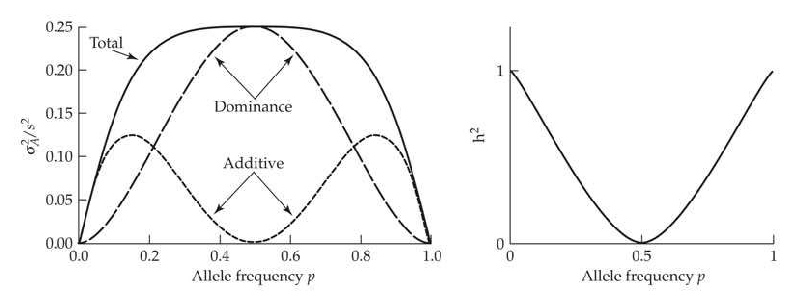
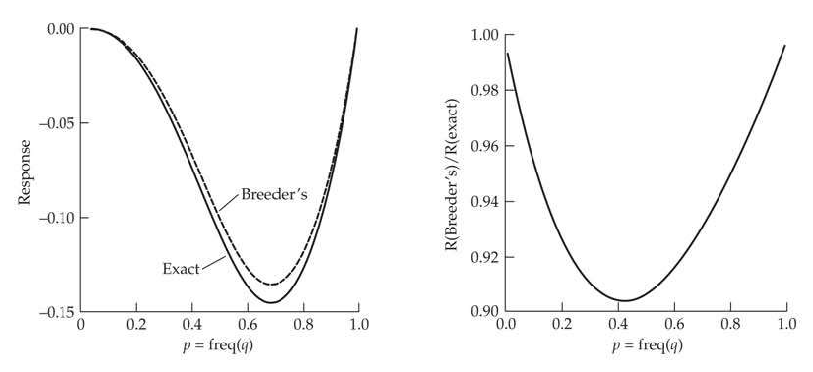
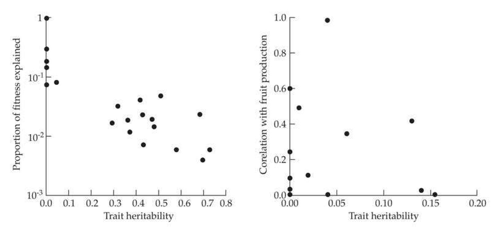
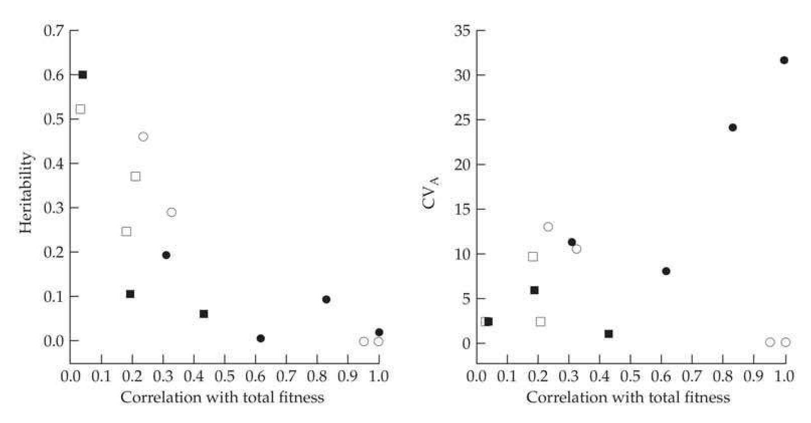
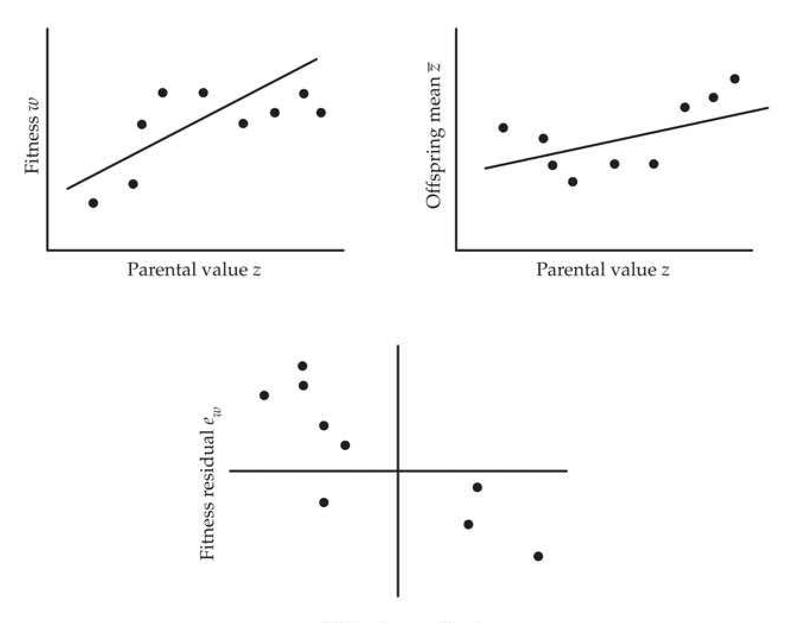

# Chapter 6 · Theorems of Natural Selection: Results of Price, Fisher, and Robertson

## chapter6_001 · Theorems of Natural Selection: Results of Price, Fisher, and Robertson: Introduction

Is there some reorientation for the expression of natural selection that may provide subtle perspective, from which we can understand our subject more deeply and analyze our problems with greater ease and greater insight? My answer is... that the Price equation provides that sort of reorientation. Frank (2012, p. 1003)

**[命题 Proposition]**

One of the messages from Chapter 5 is that selection, even on just one or two loci, can have very complex dynamics. Indeed, outside of the special case of frequency-independent viability selection at a single locus, selection is not even guaranteed to increase mean fitness. Nonetheless, the search for general theorems (exact mathematical expressions) of selection response has motivated population and quantitative geneticists for over 80 years. By shifting attention away from trying to model individual allele-frequency change over a large number of loci to considering the dynamics of some composite feature of these loci, such as the mean of a trait, the hope was that some general statements might hold. Here we focus on three classical “theorems”—Fisher’s fundamental theorem of natural selection, Robertson’s secondary theorem of natural selection, and Price’s theorem—as well as Lush’s breeder’s equation, summarized in Table 6.1. Ironically, these attempts to bring some order to population- and quantitative-genetic theory have instead resulted in a considerable amount of confusion and chaos in the literature. As detailed below, the classical interpretation of Fisher's theorem, along with Robertson's theorem and the breeder's equation, are all approximations (albeit often good ones), and not formal mathematical theorems. In contrast, Price's general expression for any type of selection response is a formal theorem, as is a special case of it, the Robertson-Price identity for the within-generation response in a trait due to selection. A source of confusion is that the classical view assumed by most of the literature was apparently different from Fisher's own interpretation, which is a formal (but not very useful) theorem. As our discussion of these various "theorems," exact and otherwise, will highlight, it is the transmission of trait values from parent to offspring that generally induces complications and makes the theoretician's job challenging. This can be seen in Table 6.1 by simply comparing the exact Robertson-Price result for within-generation change (S) with results for cross-generational change $ (S + E[w\delta_z]) $. The surprising result is not that these "theorems" are wrong, but rather that they often are reasonable-to-excellent approximations for much of the dynamics of a trait under short-term selection.

**[命题 Proposition]**

Our treatment of this rather convoluted area is structured as follows. We start with Price's theorem, which is a completely general description of any selection response under any model of transmission. It does not rely on any explicit genetic model and thus serves as an ideal platform from which to examine the other "theorems." We next turn to Fisher's fundamental theorem, which has a rich and somewhat checkered history, in part due to Fisher's failure to be fully explicit with his definitions. An important corollary of Fisher's theorem is that, in the absence of mutation, selection will drive the additive variance in fitness toward zero, and we next examine some of the biological implications and misunderstandings of this result. We then turn to Robertson's secondary theorem, which focuses on the selection response of any arbitrary trait, not just fitness. Finally, because the breeder's equation is the basic workhorse result for much of selection theory in quantitative genetics (Chapters 13–20), we conclude by examining its robustness in some detail.

**[Table]**

> **Table 6.1** · `6.1` · page 2 · source: `chapter6_001`
> Table 6.1 General expressions for the response of a trait to selection, with fitness as an important special case. Here $w$ denotes relative fitness (with mean value $E[w]=1$); $z$, the value of an arbitrary trait; $A_{z}$, the breeding value of trait $z$ (with $A_{w}$ as the breeding value for relative fitness); $R_{z}$, the total response to selection (change in the mean across generations) of trait $z$ (with $R_{w}$ for the special case where the trait is mean fitness); $\partial R_{w}$, the partial response in mean fitness due exclusively to allele-frequency change (see the text for details); $S_{z}$, the within-generation change in $z$ following selection but prior to gene transmission (the selection differential); and $\bar{\delta}_{z}$, the expected change between the mean value of a trait in selected parents and their progeny (also see text for details). Expressions denoted by $\dagger$ are true mathematical theorems, whereas the rest are approximations.
>
> <table><tr><td colspan="2">Fisher&#x27;s Fundamental Theorem</td><td>Fisher (1930)</td></tr><tr><td>Classical interpretation</td><td>$ R_{w}=\sigma^{2}(A_{w}) $</td><td></td></tr><tr><td>Exact version $ ^{\dagger} $</td><td>$ \partial R_{w}=\sigma^{2}(A_{w}) $</td><td>Price (1972b), Ewens (1989)</td></tr><tr><td>Breeder&#x27;s Equation</td><td>$ R_{z}=h_{z}^{2}S_{z} $</td><td>Lush (1937)</td></tr><tr><td>Robertson-Price Identity $ ^{\dagger} $</td><td>$ S_{z}=\sigma(w,z) $</td><td>Robertson (1966a), Price (1970)</td></tr><tr><td colspan="3">Robertson&#x27;s Secondary Theorem</td></tr><tr><td>1966 version</td><td>$ R_{z}=\sigma(w,A_{z}) $</td><td>Robertson (1966a)</td></tr><tr><td>1968 version</td><td>$ R_{z}=\sigma(A_{w},A_{z}) $</td><td>Robertson (1968)</td></tr><tr><td rowspan="3">Price&#x27;s Theorem $ ^{\dagger} $</td><td>$ \sigma_{A}(w,z) $</td><td></td></tr><tr><td>$ R_{z}=\sigma(w,z)+E(w\overline{\delta}_{z}) $</td><td>Price (1970)</td></tr><tr><td>$ S+E(w\overline{\delta}_{z}) $</td><td></td></tr></table>

---

## chapter6_002 · Theorems of Natural Selection: Results of Price, Fisher, and Robertson: Introduction / PRICE'S GENERAL THEOREM OF SELECTION

**[命题 Proposition]**

The thoughtful reader might ask if there is a general, assumption-free statement about selection response under any situation. There is: namely, Price's theorem (Price 1970, 1972a), also referred to as the Price equation. Price's theorem provides a notationally elegant way to describe any evolutionary response. It makes no assumptions about the mechanism of transmission of a trait from some ancestral category (such as an individual or group) to its descendants. As such, it works for traits transmitted by standard genetics, epigenetics, and culture, and as such has been applied to everything from the evolution of languages to community structure in ecology. Recent reviews include Frank (1995, 1997, 1998, 2012), Rice (2004a), Boyd and Richerson (2005), Okasha (2006), Gardner (2008), Helanterä and Uller (2010), and Luque (2017), while van Veelen (2005; van Veelen et al. 2012) championed a more cautious use of Price's theorem.

---

## chapter6_003 · PRICE'S GENERAL THEOREM OF SELECTION / The Life and Times of George Price

**[命题 Proposition]**

George Price was one of the most enigmatic figures in modern evolutionary biology (Frank 1995, Schwartz 2000, and Harman 2011 all reviewed Price's life and contributions). After obtaining a Ph.D. in chemistry from the University of Chicago, he worked on the Manhattan Project before joining IBM as an engineer. At age 44, Price quit his job and started working under Cedric Smith at University College London (from 1968 to 1974). In this brief tenure, he only published four solo papers and was the coauthor on two others, but in his roughly 25 total pages of publications, he made three fundamental contributions to modern evolutionary theory. In addition to Price's theorem, he introduced the power of game theory to evolutionary biology (Maynard Smith and Price 1973), and he was the first to fully grasp what Fisher had really meant by his enigmatic fundamental theorem (Price 1972b). Price left academia in 1974, working as a night janitor before giving away all his worldly possessions to homeless alcoholics and dying by his own hand in 1975 while a squatter in one of the poorest areas of London.

**[命题 Proposition]**

Price's Theorem, $

**[示例 Example]**

> **Example 6.1** · ref: `6.1` · source: `chapter6_003.json` · blocks 0–0
>
> Example 6.1. Let the ancestor (i) be the midparent (the average value of the two parents) with a phenotypic value of $ z_i $ and the descendants be the offspring in the next generation. If the average value of offspring, $ \overline{z}_i $, is exactly the same as the value, $ z_i $, of their ancestral midparent, then $ \delta_i = 0 $ for all $ i $ and, from Equation 6.6, the response is simply $ R = \sigma(w_i, z_i) $. From the Robertson-Price identity (Table 6.1, Equation 6.10), $ \sigma(w_i, z_i) = S $, the selection differential, so that $ R = S $ in this case of perfect transmission. However, the mean value of offspring generally differs from the average value of their parents, in which case the second term in Equation 6.6 is nonzero. The simplest transmission model is a linear midparent-offspring regression, $ z_{ij} = \mu + b(z_i - \mu) + e_{ij} $. Here $ z_{ij} $ is the trait value for the $ j $th offspring from midparent $ i $, giving the mean value of offspring from $ i $ as $ \overline{z}_i = \mu + b(z_i - \mu) + e_i $. The expected deviation then becomes $$ \overline{\delta}_{i}=\overline{z}_{i}-z_{i}=\mu+b(z_{i}-\mu)+e_{i}-z_{i}=(b-1)(z_{i}-\mu)+e_{i} $$ (6.9a) Hence, $$ \begin{aligned}E(w_{i}\overline{\delta}_{i})&=E\{w_{i}\left[(b-1)(z_{i}-\mu)+e_{i}\right]\}\\&=(b-1)[E(w_{i}z_{i})-\mu E(w_{i})]+E(w_{i}e_{i})\end{aligned} $$ Recalling that $ E(w_i) = 1 $ gives $$ E(w_{i}\overline{\delta}_{i})=(b-1)\left[E(w_{i}z_{i})-\mu\right]+E(w_{i}e_{i}) $$ From the definition of a covariance $$ E(w_{i}z_{i})=\sigma(w_{i},z_{i})+E(w_{i})E(z_{i})=S+1\cdot\mu $$ $$ E(w_{i}e_{i})=\sigma(w_{i},e_{i})+E(w_{i})E(e_{i})=\sigma(w_{i},e_{i})+1\cdot0 $$ Putting these results together into Equation 6.6 yields $$ R_{z}=S+E(w_{i}\overline{\delta}_{i})=S+(b-1)(S+\mu-\mu)+\sigma(w_{i},e_{i})=bS+\sigma(w_{i},e_{i}) $$ (6.9b) Provided that the residual, $ e_i $, of the midparent-offspring regression and the fitness, $ w_i $, of the midparent are uncorrelated, $ R = bS $. When these are uncorrelated and the midparent-offspring slope equals the heritability, $ b = h^2 $, we recover the breeder's equation. While at first blush Equation 6.9b appears to be a rather general statement about the accuracy of the breeder's equation, we made a few subtle assumptions (besides the obvious one of linearity) about the parent-offspring relationship, although we will defer discussion of these until later sections of this chapter.

**[命题 Proposition]**

Price’s theorem expresses the expected selection response in a trait in general terms of covariances, rather than relying on any explicit model of transmission, and as such is a completely general description of any evolutionary response. As succinctly stated by Rice (2004a, p. 170), “it is an exact characterization of a relationship that must hold between phenotype, fitness, selection, and evolution.” The key to Price’s equation is to first consider the effect of selection on specific categories (measured by how many descendants each leaves) and then consider how trait values may differ between an ancestral category and its descendants. This is an extremely subtle shift in focus, one that is easy to miss and misinterpret. However, this perspective nicely decomposes the evolutionary change $ (R_{z}) $ into a selection term and a remainder term due to all other forces, such as (but not limited to) imperfect transmission.

**[推导 Derivation]**

Consider selection first. Suppose there are $N$ categories in the population, where $q_i$ and $z_i$, respectively, denote the frequency of category $i$ and the mean value for the trait of interest over all members of this category. Note that $z$ can be any trait measure. For example, if $x$ denotes the value of a trait, taking $z = (x - \mu_x)^2$ or $z = (x - \mu_x)^4$ gives the response in the variance and the fourth moment, respectively. Averaging over all categories, the mean trait value is

> **Formula (6.1)** · `6.1` · source: `chapter6_block_009` · The Life and Times of George Price
>
> $$ \overline{z}=\sum_{i=1}^{N}q_{i}z_{i} $$

**[推导 Derivation]**

Suppose that the members of category i leave a total of $ n_{i} $ descendants (the absolute fitness, $ W_{i} $, for that category). The average number of descendants over categories (the mean fitness) is

> **Formula (6.2a)** · `6.2a` · source: `chapter6_block_010` · The Life and Times of George Price
>
> $$ \overline{W}=\sum_{i=1}^{N}q_{i}W_{i} $$

The relative fitness of category i is $ w_{i} = W_{i}/\overline{W} $.

**[推导 Derivation]**

Price’s key idea was to define $ q_{i}^{\prime} $ as the frequency of all descendants that have category i as their ancestor

> **Formula (6.2b)** · `6.2b` · source: `chapter6_block_012` · The Life and Times of George Price
>
> $$ q_{i}^{\prime}=w_{i}q_{i} $$

Note, in particular, that $ q_{i}^{\prime} $ is not the frequency of descendants in category i, but rather the fraction of all descendants that are from ancestors in category i. The focus is entirely on the categories of ancestors, not on which categories the descendants are in. As an example of this shift in focus, suppose our three categories of interest are the genotypes AA, Aa, and aa at a diallelic locus. In a traditional population-genetics analysis (Chapter 5), we would write equations to describe how the frequency of each category changes. Price used a different focus, considering instead the frequency of the descendants that come from each category. Suppose category i = 2 corresponds to Aa and imagine an extreme case where only Aa individuals survive. Here $ q_{2}^{\prime} = 1 $, as all offspring have Aa parents. However, in the next generation (before selection), segregation results in the genotypes AA, Aa, and aa at the frequencies 0.25, 0.5, and 0.25, i.e., all three categories are present in the offspring, but all have only Aa parents.

**[推导 Derivation]**

Now consider the transmission phase (which more generally includes everything other than selection). Let $ \overline{z}_{i} $ denote the mean value of the descendants from category i, which we can decompose as

> **Formula (6.3a)** · `6.3a` · source: `chapter6_block_014` · The Life and Times of George Price
>
> $$ \overline{z}_{i}=z_{i}+\overline{\delta}_{i} $$

namely, the mean value, $ z_{i} $, of their ancestors plus a deviation, $ \overline{\delta}_{i} $, due to imperfect transmission. Taking the average over all ancestral categories, the average trait value over all the descendants becomes

> **Formula (6.3b)** · `6.3b` · source: `chapter6_block_014` · The Life and Times of George Price
>
> $$ \overline{z}^{\prime}=\sum_{i}q_{i}^{\prime}\overline{z}_{i} $$

**[推导 Derivation]**

Recalling Equations 6.1, 6.2b, and 6.3b, the response in trait value, $ R_z = \overline{z}' - \overline{z} $, becomes

> **Formula (6.4)** · `6.4` · source: `chapter6_block_015` · The Life and Times of George Price
>
> $$ \begin{aligned}R_{z}&=\sum_{i}q_{i}^{\prime}\overline{z}_{i}-\sum_{i}q_{i}z_{i}\\&=\left(\sum_{i}q_{i}^{\prime}z_{i}-\sum_{i}q_{i}z_{i}\right)+\left(\sum_{i}q_{i}^{\prime}\overline{z}_{i}-\sum_{i}q_{i}^{\prime}z_{i}\right)\\&=\sum_{i}\left(q_{i}^{\prime}-q_{i}\right)z_{i}+\sum_{i}q_{i}^{\prime}\left(\overline{z}_{i}-z_{i}\right)\\&=\sum_{i}\Delta q_{i}z_{i}+\sum_{i}q_{i}^{\prime}\overline{\delta}_{i}\\ \end{aligned} $$

---

## chapter6_004 · Theorems of Natural Selection: Results of Price, Fisher, and Robertson: Introduction / The Life and Times of George Price

The second line follows by adding and subtracting $ \sum q_i' z_i $, and the third by suitably gathering terms. This version of the Price equation is based on Frank (1997, 2012). The first term (containing $ \Delta q_i z_i $) represents the change due to selection based entirely on ancestral values, or the partial evolutionary change caused by natural selection (Price 1972b; Ewens 1989; Frank 2012). The second term (containing $ q_i' \bar{\delta}_i $) is the part of total change caused by imperfect transmission of ancestral values to their descendants. Equation 6.4 is conceptually very powerful, as it decomposes the response into two separate components, one strictly based on the nature of selection ($ \Delta q_i $) and the other on transmission ($ \bar{\delta}_i $).

**[推导 Derivation]**

Both these terms can be expressed in a more transparent form. For the first term,

> **Formula (6.5a)** · `6.5a` · source: `chapter6_block_017` · The Life and Times of George Price
>
> $$ \begin{align*}\sum_{i}\Delta q_{i}z_{i}&=\sum_{i}\left(w_{i}q_{i}-q_{i}\right)z_{i}=\sum_{i}w_{i}z_{i}q_{i}-\sum z_{i}q_{i}=E(w_{i}z_{i})-E(z)\cdot1\\&=E(w_{i}z_{i})-E(z)\cdot E(w)\\&=\sigma(w_{i},z_{i})\end{align*} $$

**[推导 Derivation]**

Note that to obtain this result, we use the identity $ E(w) = 1 $. For the second term,

> **Formula (6.5b)** · `6.5b` · source: `chapter6_block_018` · The Life and Times of George Price
>
> $$ \sum_{i}q_{i}^{\prime}\overline{\delta}_{i}=\sum_{i}q_{i}w_{i}\overline{\delta}_{i}=E(w_{i}\overline{\delta}_{i}) $$

**[推导 Derivation]**

Substituting Equations 6.5a and 6.5b into Equation 6.4 yields the more traditional form of the Price equation,

> **Formula (6.6)** · `6.6` · source: `chapter6_block_019` · The Life and Times of George Price
>
> $$ R_{z}=\overline{z}^{\prime}-\overline{z}=\sigma(w_{i},z_{i})+E(w_{i}\overline{\delta}_{i}) $$

(Price 1970, 1972a). Note that all expectations are computed with respect to the pre-selection frequencies of the ancestral categories $ (q_{i}) $. The first term is the covariance between phenotype and fitness (the within-generation change, S, in the mean of ancestral values), while the second is the fitness-weighted transmission of any changes between the value of an ancestor and the mean of its descendants.

**[推导 Derivation]**

Several equivalent expressions for the Price equation are useful in that they emphasize different features. For example, using the definition of a covariance

> **Formula (6.7a)** · `6.7a` · source: `chapter6_block_021` · The Life and Times of George Price
>
> $$ E(w_{i}\overline{\delta}_{i})=\sigma(w_{i},\overline{\delta}_{i})+E(w_{i})\cdot E(\overline{\delta}_{i})=\sigma(w_{i},\overline{\delta}_{i})+E(\overline{\delta}_{i}) $$

and substituting this result into Equation 6.6 yields

> **Formula (6.7b)** · `6.7b` · source: `chapter6_block_021` · The Life and Times of George Price
>
> $$ R_{z}=\sigma(w_{i},z_{i})+\sigma(w_{i},\overline{\delta}_{i})+E(\overline{\delta}_{i}) $$

**[推导 Derivation]**

Using Equation 6.3a to combine the first two covariances in Equation 6.7b gives

> **Formula (6.7c)** · `6.7c` · source: `chapter6_block_022` · The Life and Times of George Price
>
> $$ R_{z}=\sigma(w_{i},\overline{z}_{i})+E(\overline{\delta}_{i}) $$

Equation 6.7c relates the selection response to the covariance between the fitness, $ w_i $, of an ancestor and the mean value, $ \overline{z}_i $, of its descendants. The second term, $ E(\overline{\delta}_i) $, is often thought of as the expected change in mean value from ancestor to descendant in the absence of selection. As we will see at the end of the chapter, this interpretation is not quite correct, as this last term does contain a contribution from selection (Equation 6.38).

**[推导 Derivation]**

To summarize, if $ z_i $ denotes the average value in category $ i $, which has a frequency of $ q_i $ before selection and a frequency of $ q'_i $ after selection, and whose offspring have average value $ \overline{z}_i = z_i + \overline{\delta}_i $, then equivalent forms of Price's theorem are

> **Formula (6.8)** · `6.8` · source: `chapter6_block_024` · The Life and Times of George Price
>
> $$ R_{z}=\left\{\begin{array}{l}\sum_{i}\Delta q_{i}z_{i}+\sum_{i}q_{i}^{\prime}\overline{\delta}_{i}\\\sigma(w_{i},z_{i})+E(w_{i}\overline{\delta}_{i})\\\sigma(w_{i},z_{i})+\sigma(w_{i},\overline{\delta}_{i})+E(\overline{\delta}_{i})\\\sigma(w_{i},\overline{z}_{i})+E(\overline{\delta}_{i})\end{array}\right. $$

As noted in Table 6.1, and as will be shown shortly (Equation 6.10), the selection differential, S, can be substituted for $ \sigma(w_i, z_i) $ in the middle two expressions of Equation 6.8. As is further shown below, many of the standard approximations for evolutionary response (e.g., the breeder's equation, Fisher's fundamental theorem, Robertson's secondary theorem) follow directly from the $ \sigma(w_i, z_i) $ selection term under the assumption that the residual term $ E(w_i \bar{\delta}_i) $ is zero. Hence, these approximations fail when this term is significant.

**[命题 Proposition]**

While a discussion of Price’s theorem often assumes the ancestor to be a parent or midparent and the descendants to be their offspring in the next generation, the theorem holds for any time interval and for any set of ancestors (such as a group of individuals; Chapter 22) that one wishes to consider. In this sense, Price’s theorem is completely general and makes absolutely no assumptions about the mechanism of transmission of trait values from ancestors to their descendants, although it does make the assumption that all descendants have ancestors. This may seem trivial, but it is violated by migration, wherein an individual appears in the next generation from ancestors not considered. Kerr and Godfrey-Smith (2008) generalized the Price equation to accommodate missing ancestors and more general causal connections between ancestors and descendants.

**[示例 Example]**

> **Example 6.2** · ref: `6.2` · source: `chapter6_003.json` · blocks 1–10
>
> Example 6.2. Consider the change in allele frequency when a single diallelic locus (alleles A and a) determines fitness. Assume random mating among the survivors, with $ p = \text{freq}(A) $, and
> 
> > **Inline Table 1** · `inline_1` · page 6 · source: `chapter6_003`
> > Inline Table 1
> >
> > Genotype | Frequency (before selection) | Fitness
> > --- | --- | ---
> > AA | $ p^{2} $ | $ W_{AA} $
> > Aa | $ 2p(1-p) $ | $ W_{Aa} $
> > aa | $ (1-p)^{2} $ | $ W_{aa} $
> 
> 
> To apply Price’s theorem, we need to specify the categories to be followed, which we take as the alleles A and a. We index these by $i = 1$ and $i = 2$, respectively, and code their associated values as $z_1 = 1$ and $z_2 = 0$, which implies a mean value of $\bar{z} = (1 \cdot p) + (0 \cdot [1 - p]) = p$, so $R_z$ represents the change in $p$. In the absence of mutation, transmission is perfect, as the descendant allele from an A allele is always A, resulting in $\bar{\delta}_i = 0$. Putting these together, Equation 6.6 becomes $$ \Delta p=R_{z}=\sigma(w_{i},z_{i})+E(w_{i}\cdot0)=\sigma(w_{i},z_{i}) $$ Under random mating, the fitness $ W_1 $ of an $ A $ allele is simply its marginal fitness (Equation 5.7b), $ W_1 = pW_{AA} + (1 - p)W_{Aa} $. Similarly, $ W_2 = pW_{Aa} + (1 - p)W_{aa} $ and $ E(W_i) = \overline{W} = pW_1 + (1 - p)W_2 $. Recalling that $ w_i = W_i/\overline{W} $ and the definition of a covariance, we have $$ \Delta p=\sigma(w_{i},z_{i})=\frac{\sigma(W_{i},z_{i})}{\overline{W}}=\frac{1}{\overline{W}}\Biggl(E(W_{i}z_{i})-E(W_{i})E(z_{i})\Biggr) $$ To show that this recovers the standard population-genetic equation for allele-frequency change, note that $$ E(W_{i}z_{i})=\sum_{i=1}^{2}W_{i}z_{i}freq(category i)=\left[W_{1}\cdot1\cdot p\right]+\left[W_{2}\cdot0\cdot(1-p)\right]=p\cdot W_{1} $$ Using this result along with $ E(W_i) = \overline{W} $ and $ E(z_i) = p $ $$ \Delta p=\frac{1}{\overline{W}}\left(p W_{1}-\overline{W}p\right)=p\frac{\left(W_{1}-\overline{W}\right)}{\overline{W}} $$ which recovers Equation 5.7c.

---

## chapter6_005 · Theorems of Natural Selection: Results of Price, Fisher, and Robertson: Introduction / The Life and Times of George Price

---

## chapter6_006 · Theorems of Natural Selection: Results of Price, Fisher, and Robertson: Introduction / The Robertson-Price Identity, $ S = \sigma(w, z) $

**[推导 Derivation]**

When our concern is strictly on the within-generation change in trait value, then $ \Delta\overline{z} = \mu_{z}^{*} - \mu_{z} $, the difference between the fitness-weighted mean after selection (but before reproduction), $ \mu_{z}^{*} $, and the overall mean before selection, $ \mu_{z} $, which is the selection differential S (Chapter 13). Because the within-generation change is not influenced by cross-generation transmission, any terms involving $ \bar{\delta} $ in Equation 6.6 are zero, and we recover the Robertson-Price identity

> **Formula (6.10)** · `6.10` · source: `chapter6_block_036` · The Robertson-Price Identity, $ S = \sigma(w, z) $
>
> $$ S=\sigma(w,z) $$

as first obtained by Robertson (1966a) and Price (1970). We derive this result by another route in Chapter 13, where we use this identity extensively in selection-response theory. The critical insight from Equation 6.10 is that no matter how complex the relationship between phenotype z and fitness w, the within-generation change in the mean only depends on the covariance between these measures.

---

## chapter6_007 · PRICE'S GENERAL THEOREM OF SELECTION / The Breeder's Equation, $ R = h^{2} S $

**[命题 Proposition]**

Our derivation of the breeder’s equation via Price’s theorem (Example 6.1) made three assumptions dealing with the midparent-offspring regression that need to be highlighted. The most obvious assumption was that the parent-offspring regression is linear. Two more subtle assumptions are that the parent and offspring means are unchanged in the absence of selection, and that the regression slope b is the same for selected and unselected parents. We address these assumptions separately, by considering the impact of changing means first, then nonlinearity, and finally changes in the regression slope. While each assumption is considered in isolation, one or more may occur simultaneously.

**[推导 Derivation]**

Example 6.1 used the linear regression $ z_{ij} = \mu + b(z_i - \mu) + e_{ij} $ for the jth offspring from midparent combination i (Example 6.1), which assumes that the trait mean is the same in the offspring (o) and parental populations (p) in the absence of selection ($ \mu_o = \mu_p = \mu $). More generally, the parent and offspring means can differ, making the regression $ z_{ij} = \mu_o + b(z_i - \mu_p) + e_{ij} $, in which case

> **Formula (6.11)** · `6.11` · source: `chapter6_block_038` · The Breeder's Equation, $ R = h^{2} S $
>
> $$ \begin{aligned}\delta_{i}=\overline{z}_{i}-z_{i}&=\mu_{o}+b(z_{i}-\mu_{p})+e_{i}-z_{i}\\&=(b-1)z_{i}-b\mu_{p}+\mu_{o}+e_{i}\\&=(b-1)(z_{i}-\mu_{p})+(\mu_{o}-\mu_{p})+e_{i}\end{aligned} $$

**[推导 Derivation]**

Following the same logic leading to Equation 6.9b yields the response to selection

> **Formula (6.12)** · `6.12` · source: `chapter6_block_039` · The Breeder's Equation, $ R = h^{2} S $
>
> $$ R=bS+\sigma(w_{i},e_{i})+(\mu_{o}-\mu_{p}) $$

where the last term $ (\mu_{o}-\mu_{p}) $ accounts for changes in mean phenotype from parent to offspring (in the absence of selection), due, for example, to the decay of linkage disequilibrium (Chapter 15), nonrandom associations of environmental values (Chapter 15), or inbreeding (Chapter 23; LW Chapter 10).

**[推导 Derivation]**

Now suppose the parent-offspring regression is nonlinear. Assuming the simplest such departure, a quadratic, makes the key point. The mean value $ \overline{z}_{i} $ of offspring from a midparent with phenotypic value $ z_{i} $ is given by

> **Formula (6.13a)** · `6.13a` · source: `chapter6_block_040` · The Breeder's Equation, $ R = h^{2} S $
>
> $$ \overline{z}_{i}=a+b z_{i}+c z_{i}^{2}+e_{i} $$

**[Figure]**

> **Figure 6.2** · page 15 · source: `chapter6`
>
> 
>
> Figure 6.2 The behavior of genetic variance components and the heritability for fitness as a function of allele frequency p under the parameters given in Example 6.5. (Left) Note that total genetic variance is maximized at the value  $ (p = 1/2) $, where the additive variance is zero. (Right) Assuming that there is no environmental variance, the heritability is simply the ratio of additive to total genetic variance, which is also zero when total variance is maximized.

**[推导 Derivation]**

Hence,

> **Formula (6.13b)** · `6.13b` · source: `chapter6_block_041` · The Breeder's Equation, $ R = h^{2} S $
>
> $$ \sigma(w_{i},\overline{z}_{i})=b\sigma\left(w_{i},z_{i}\right)+c\sigma\left(w_{i},z_{i}^{2}\right)+\sigma\left(w_{i},e_{i}\right) $$

**[推导 Derivation]**

Assuming the residuals from the midparent-offspring regression are uncorrelated with the fitness of the midparent $ \sigma(w_i, e_i) = 0 $, Equation 6.13b becomes

> **Formula (6.13c)** · `6.13c` · source: `chapter6_block_042` · The Breeder's Equation, $ R = h^{2} S $
>
> $$ \sigma(w_{i},\overline{z}_{i})=b S+c\sigma\left(w_{i},z_{i}^{2}\right) $$

From Equation 6.7c, the selection response is given by this expression plus $ E(\bar{\delta}_i) $. Thus, with a nonlinear parent-offspring regression, selection on the variance $ z_i^2 $ (i.e., $ \sigma(w_i, z_i^2) \neq 0 $; see

Chapters 29 and 30) can enter into the response in the mean, in which case the strict linear version of the breeder’s equation no longer holds.

**[推导 Derivation]**

A final source of error when using the breeder’s equation is that the regression coefficient may differ between selected and unselected parents. To explicate this point, we follow Frank (1997) and consider any generalized linear predictor of some value $ z_i $ for individual i from k underlying predictor variables $ x_{i1}, \cdots, x_{ik} $,

> **Formula (6.14)** · `6.14` · source: `chapter6_block_044` · The Breeder's Equation, $ R = h^{2} S $
>
> $$ z_{i}=\sum_{j=1}^{k}b_{j}x_{ij}+e_{i} $$

**[推导 Derivation]**

For example, an individual’s phenotype can be written as the sum of average allelic effects over all $ k $ loci plus a residual error. With a single diallelic locus, $ z_i = b_1 x_{i1} + b_2 x_{i2} + e_i $, where $ b_j $ is the average effect of allele $ j $ and $ x_{ij} $ is the number of copies of allele $ j $ in individual $ i $ (values of 0, 1, or 2), so that (for a diploid) $ \overline{x}_j / 2 = p_j $, the frequency of allele $ j $. The average of Equation 6.14 becomes

> **Formula (6.15a)** · `6.15a` · source: `chapter6_block_045` · The Breeder's Equation, $ R = h^{2} S $
>
> $$ \overline{z}=\sum_{j}b_{j}\overline{x}_{.j}=\sum_{j}2b_{j}p_{j} $$

**[推导 Derivation]**

At some time in the future, the values of both $ p_{j} $ (the allele frequency) and $ b_{j} $ (its average effect) may change to new values

> **Formula (6.15b)** · `6.15b` · source: `chapter6_block_046` · The Breeder's Equation, $ R = h^{2} S $
>
> $$ p_{j}^{\prime}=p_{j}+\Delta p_{j}\quad and\quad b_{j}^{\prime}=b_{j}+\Delta b_{j} $$

---

## chapter6_008 · Theorems of Natural Selection: Results of Price, Fisher, and Robertson: Introduction / The Breeder's Equation, $ R = h^{2} S $

**[推导 Derivation]**

We write the new mean as

> **Formula (6.15c)** · `6.15c` · source: `chapter6_block_047` · The Breeder's Equation, $ R = h^{2} S $
>
> $$ \overline{z}^{\prime}=\sum_{j}2b_{j}^{\prime}p_{j}^{\prime} $$

and the same logic leading to Equation 6.4 allows us to decompose the total change as

> **Formula (6.15d)** · `6.15d` · source: `chapter6_block_047` · The Breeder's Equation, $ R = h^{2} S $
>
> $$ \overline{z}^{\prime}-\overline{z}=\sum_{j}2b_{j}\Delta p_{j}+\sum_{j}2p_{j}^{\prime}\Delta b_{j} $$

There are two sources for response: a change, $ b_j \Delta p_j $, from the change in allele frequencies weighted by their original average effects, and a change, $ p_j' \Delta b_j $, in the average effects weighted by the new allele frequencies. These two terms exactly correspond to the selection and transmission terms in Price's equation (compare this with Equation 6.4). The $ b_j \Delta p_j $ terms correspond to partial evolutionary change caused by natural selection, while the transmission term represents the response due to changes, $ \Delta b_j $, in the average effects themselves. These changes in turn influence the parent-offspring regression slope.

**[示例 Example]**

> **Example 6.3** · ref: `6.3` · source: `chapter6_008.json` · blocks 2–7
>
> Example 6.3. The setting in which the breeder’s equation is expected to be least accurate involves a trait entirely determined by a single dominant locus. This results in both a nonlinear parent-offspring regression and the potential for significant allele-frequency change following even a single generation of selection. Suppose that, at such a locus, genotypes QQ and Qq have a phenotypic value of 1, while qq has a value of 0 (there is no environmental variance), and that qq individuals have a survival rate twice as high as the survival rate of QQ and Qq individuals. We now contrast the exact response from single-locus models (Chapter 5) with that predicted by the breeder’s equation. Starting with the exact population-genetic model, and letting p be the frequency of allele q
> 
> > **Inline Table 2** · `inline_2` · page 8 · source: `chapter6_008`
> > Inline Table 2
> >
> > Genotype | QQ | Qq | qq
> > --- | --- | --- | ---
> > Trait value $ z $ | 1 | 1 | 0
> > Frequency (before selection) | $ (1-p)^{2} $ | $ 2p(1-p) $ | $ p^{2} $
> > Fitness | 1 | 1 | 2
> > Frequency (after selection) | $ (1-p)^{2}/\overline{W} $ | $ 2p(1-p)/\overline{W} $ | $ p^{2}(2/\overline{W}) $
> 
> 
> The trait mean before selection is $ \mu(p) = 1 - p^2 $, with a mean fitness of $ \overline{W}(p) = 1 + p^2 $. The new frequency, $ p' $, of allele $ q $ after selection is half the frequency of $ Qq $ plus the frequency of $ qq $ (both after selection) $$ p^{\prime}=\frac{(1/2)2p(1-p)+2p^{2}}{1+p^{2}}=\frac{p(1+p)}{1+p^{2}} $$ (6.16a) yielding an allele-frequency change of $$ \Delta p=p^{\prime}-p=\frac{p(1+p)}{1+p^{2}}-p\frac{1+p^{2}}{1+p^{2}}=\frac{p^{2}(1-p)}{1+p^{2}} $$ which translates into a change in mean phenotype of $$ R_{z}=\mu(p^{\prime})-\mu(p)=p^{2}-(p^{\prime})^{2}=-2p^{3}\left(\frac{1-p(1+p^{2})/2}{(1+p^{2})^{2}}\right) $$ (6.16b) This exact single-generation response in the trait mean is plotted in Figure 6.4. Now consider the response predicted from the breeder’s equation. Applying the standard trait-value parameterization of $ 2a : a(1 + k) : 0 $ to the preceding trait values, we have $ a = 1/2 $ and $ k = 1 $, yielding (LW Chapter 4) the additive and dominance variances of the trait $$ \sigma_{A}^{2}=2p(1-p)a^{2}[1+k(2p-1)]^{2}=2p(1-p)(1/4)(2p)^{2}=2p^{3}(1-p) $$ $$ \sigma_{D}^{2}=[2p(1-p)a k]^{2}=p^{2}(1-p)^{2} $$ Because $ \sigma_{E}^{2} $ is assumed to be zero, the heritability becomes $$ h^{2}=\frac{\sigma_{A}^{2}}{\sigma_{A}^{2}+\sigma_{D}^{2}}=\frac{2p^{3}(1-p)}{2p^{3}(1-p)+p^{2}(1-p)^{2}}=\frac{2p}{1+p} $$ (6.16c) Following selection (but before reproduction), only QQ and Qq survive, each with a trait value of one, yielding the fitness-weighted mean $$ \mu^{*}=1\cdot\frac{1}{\overline{W}}\left(1-p^{2}\right)+0\cdot\frac{2}{\overline{W}}p^{2}=\frac{1-p^{2}}{\overline{W}}=\frac{1-p^{2}}{1+p^{2}} $$ (6.16d) yielding the selectional differential $$ S=\mu^{*}-\mu=\frac{1-p^{2}}{1+p^{2}}-\left(1-p^{2}\right)=-p^{2}\frac{1-p^{2}}{1+p^{2}} $$ (6.16e) Equations 6.16c and 6.16e give the predicted response from the breeder’s equation as $$ R_{z}=h^{2}S=\left(\frac{2p}{1+p}\right)\left(-p^{2}\frac{1-p^{2}}{1+p^{2}}\right)=-\frac{2p^{3}(1-p)}{1+p^{2}} $$ (6.16f) As shown in Figure 6.1, we see that the approximation given by the breeder's equation (Equation 6.16f) generally does well but slightly underestimates the exact response (Equation 6.16b), predicting (in the worst case) only about 90% of the actual response when $ p \simeq 0.4 $. For this simple one-locus model, two factors account for this discrepancy. First, owing to dominance, the parent-offspring regression is not linear. Second, the change in allele frequency in the selected parents results in changes in the parent-offspring covariance, and hence the parent-offspring regression slope. Figure 6.1 Analysis of the model from Example 6.3. (Left) Graph of the exact (using one-locus theory; Equation 6.16b) and predicted (via the breeder's equation; Equation 6.16f) response as a function of allele-frequency p, for a trait under selection determined by a single dominant locus. (Right) The relative accuracies of the breeder's equation as a function of p.

---

## chapter6_009 · Theorems of Natural Selection: Results of Price, Fisher, and Robertson: Introduction / FISHER'S FUNDAMENTAL THEOREM OF NATURAL SELECTION

**[Figure]**

> **Figure 6.1** · page 10 · source: `chapter6`
>
> 
>
> Figure 6.1 Analysis of the model from Example 6.3. (Left) Graph of the exact (using one-locus theory; Equation 6.16b) and predicted (via the breeder's equation; Equation 6.16f) response as a function of allele-frequency p, for a trait under selection determined by a single dominant locus. (Right) The relative accuracies of the breeder's equation as a function of p.

The rate of increase in fitness of any organism at any time is equal to its genetic variance in fitness at that time. Fisher (1930, p. 35)

**[命题 Proposition]**

This simple statement from Fisher’s (1930) book (which was dictated to his wife as he paced about their living room) has generated a tremendous amount of work, discussion, and sometimes heated arguments. Fisher claimed his result was exact, a true theorem. Historically, the classical (and seemingly obvious) interpretation of this quote is that the rate of increase in mean fitness equals the additive variance in fitness, $ R_w = \sigma^2(A_w) $. Because variances are nonnegative, this interpretation implies that mean population fitness never decreases in a constant environment. However, we already know from Chapter 5 that this statement is incorrect, as mean fitness can decline even under simple models of selection. As a result, the mathematician Sam Karlin referred to this interpretation as “neither fundamental nor a theorem” as it requires rather special conditions to hold, especially when multiple loci influence fitness. As is discussed below, the classical interpretation of Fisher’s theorem only holds exactly under restricted conditions, but is often a good approximate descriptor. We first review the classical interpretation, and then discuss what it appears that Fisher actually meant.

---

## chapter6_010 · FISHER'S FUNDAMENTAL THEOREM OF NATURAL SELECTION / The Classical Interpretation of Fisher's Fundamental Theorem, $ R_w = \sigma_A^2(w) $

**[推导 Derivation]**

One way to demystify the classical version of Fisher's theorem is to suppose that fitness is just a trait, and use the breeder's equation, $ R = h^2 S $, to predict the response to selection on that trait. Letting $ z = W $, and recalling that $ w = W/\overline{W} $, the Robertson-Price identity (Equation 6.10) yields the selection differential

> **Formula (6.17a)** · `6.17a` · source: `chapter6_block_057` · The Classical Interpretation of Fisher's Fundamental Theorem, $ R_w = \sigma_A^2(w) $
>
> $$ \begin{align*}S_W=\sigma(z,w)=\sigma(W,w)=\frac{\sigma(W,W)}{\overline{W}}=\frac{\sigma^2(W)}{\overline{W}}\end{align*} $$

**[推导 Derivation]**

Substituting into the breeder's equation shows

> **Formula (6.17b)** · `6.17b` · source: `chapter6_block_058` · The Classical Interpretation of Fisher's Fundamental Theorem, $ R_w = \sigma_A^2(w) $
>
> $$ \begin{align*}R_W=h_W^2S_W={\sigma_A^2(W)\over\sigma^2(W)} {\sigma^2(W)\over\overline{W}}={\sigma_A^2(W)\over\overline{W}}\end{align*} $$

**[推导 Derivation]**

Expressed in terms of relative fitnesses,

> **Formula (6.17c)** · `6.17c` · source: `chapter6_block_059` · The Classical Interpretation of Fisher's Fundamental Theorem, $ R_w = \sigma_A^2(w) $
>
> $$ R_{w}=\Delta\overline{w}=\frac{R_{W}}{\overline{W}}=\frac{\sigma_{A}^{2}(W)}{\overline{W}^{2}}=\sigma_{A}^{2}(w) $$

recovering the classical view of Fisher’s theorem.

**[推导 Derivation]**

One can also use a population-genetics framework to motivate Fisher’s theorem in terms of allele-frequency change. Consider a diallelic locus with constant fitnesses under random mating, and define $ \overline{W}(p) $ to be the mean population fitness at allele frequency $ p $ (Equation 5.1a). The change in mean fitness is a function of the allele-frequency change, $ \Delta p $,

> **Formula (6.18a)** · `6.18a` · source: `chapter6_block_060` · The Classical Interpretation of Fisher's Fundamental Theorem, $ R_w = \sigma_A^2(w) $
>
> $$ R_{W}=\overline{W}(p+\Delta p)-\overline{W}(p) $$

**[推导 Derivation]**

If the allele-frequency change is small, a first-order Taylor-series approximation yields

> **Formula (6.18b)** · `6.18b` · source: `chapter6_block_061` · The Classical Interpretation of Fisher's Fundamental Theorem, $ R_w = \sigma_A^2(w) $
>
> $$ \overline{W}(p+\Delta p)\simeq\overline{W}(p)+\frac{d\overline{W}}{d p}\Delta p $$

so

> **Formula (6.18c)** · `6.18c` · source: `chapter6_block_061` · The Classical Interpretation of Fisher's Fundamental Theorem, $ R_w = \sigma_A^2(w) $
>
> $$ R_{W}=\overline{W}(p+\Delta p)-\overline{W}(p)\simeq\frac{d\overline{W}}{d p}\Delta p $$

From Equation 5.5a

> **Formula (6.18d)** · `6.18d` · source: `chapter6_block_061` · The Classical Interpretation of Fisher's Fundamental Theorem, $ R_w = \sigma_A^2(w) $
>
> $$ \begin{aligned}\frac{dW}{dp}&=2pW_{AA}+2(1-2p)W_{Aa}+2(p-1)W_{aa}\\&=2\left[p(W_{AA}-W_{Aa})+(1-p)(W_{Aa}-W_{aa})\right]=2(\alpha_{A}-\alpha_{a})\end{aligned} $$

where the last equality follows from the definition of the average effects (under random mating; see LW Chapter 4) of alleles A and a on fitness, namely,

> **Formula (6.18e)** · `6.18e` · source: `chapter6_block_061` · The Classical Interpretation of Fisher's Fundamental Theorem, $ R_w = \sigma_A^2(w) $
>
> $$ \alpha_{A}=p W_{A A}+\left(1-p\right)W_{A a}-\overline{W}\quad\mathrm{a n d}\quad\alpha_{a}=p W_{A a}+\left(1-p\right)W_{a a}-\overline{W} $$

Recall that the quantity $ \alpha = \alpha_A - \alpha_a $ is the average effect of an allelic substitution (LW Equation 4.6), as the difference in the average effects of these two alleles yields the mean effect on fitness from replacing a randomly chosen $ a $ allele with an $ A $ allele.

**[推导 Derivation]**

Applying Wright’s formula (Equation 5.5b) together with Equation 6.18d returns

> **Formula (6.18f)** · `6.18f` · source: `chapter6_block_063` · The Classical Interpretation of Fisher's Fundamental Theorem, $ R_w = \sigma_A^2(w) $
>
> $$ \Delta p=\frac{p(1-p)}{2\overline{W}}\frac{d\overline{W}}{dp}=\frac{p(1-p)}{2\overline{W}}(2\alpha) $$

and substitution into Equation 6.18c then yields

> **Formula (6.18g)** · `6.18g` · source: `chapter6_block_063` · The Classical Interpretation of Fisher's Fundamental Theorem, $ R_w = \sigma_A^2(w) $
>
> $$ R_{W}\simeq\frac{p(1-p)(2\alpha)^{2}}{2\overline{W}}=\frac{\sigma_{A}^{2}(W)}{\overline{W}} $$

**[推导 Derivation]**

The last step follows from the fact that the additive genetic variance is related to $ \alpha $ by $ \sigma_A^2 = 2p(1 - p)\alpha^2 $ (LW Equation 4.12a). Thus, under this approximation of small allele-frequency change (in which terms of order $ (\Delta p)^2 $ can be ignored), the change in mean fitness is indeed proportional to the additive genetic variance in fitness. As Example 6.4 (below) highlights, Equation 6.18g, and thus the classical view of Fisher's theorem, is only approximate. Under what conditions does this expression actually hold? While Equation 6.18g is correct for multiple additive loci (i.e., no dominance or epistasis) under both random and nonrandom mating (Kempthorne 1957; Ewens 1969), it is generally compromised by departures from additivity. Even when the theorem does not hold exactly, does it still remain a good approximation? Nagylaki (1976a, 1977a, 1977b, 1991, 1992b, 1993) examined ever more general models of fitness under the assumption of weak selection (i.e., the fitness of genotypes being approximately $ 1 + bs $ with $ s $ small and $ |b| \ll 1 $) and random mating. Selection is further assumed to be much weaker than the recombination frequency $ c_{min} $ for the closest pair of loci under selection ($ s \ll c_{min} $). Under these conditions, the evolution of mean fitness falls into three distinct stages. During the first phase (roughly $ t < 2 \ln s / \ln [1 - c_{min}] $ generations), any initial disequilibrium has a transient impact on the dynamics until the point where disequilibrium reaches a steady-state value. At this point, we enter the central phase, with the change in mean fitness becoming

> **Formula (6.19)** · `6.19` · source: `chapter6_block_064` · The Classical Interpretation of Fisher's Fundamental Theorem, $ R_w = \sigma_A^2(w) $
>
> $$ R_{W}=\frac{\sigma_{A}^{2}(W)}{\overline{W}}+O(s^{3}) $$

where $ O(s^{3}) $ means that terms on the order of $ s^{3} $ have been ignored. Because additive genetic variance is expected to be of order $ s^{2} $, Fisher's theorem is expected to hold to a good approximation during this period. The central phase of evolution lasts roughly 1/s generations. However, as gametic frequencies approach their equilibrium values, we reach the third phase, where the additive variance in fitness can be much smaller than order $ s^{2} $, in which case terms of order $ s^{3} $ can be important. During the first and third phases, mean fitness can decrease, but the fundamental theorem holds during the central phase of evolution. Because we expect the bulk of evolution (the majority of change in $ \overline{W} $) to occur during this middle phase, Fisher's theorem approximately holds over the major part of evolutionary change. While Nagylaki's results are weak-selection approximations, we often expect weak selection to be the norm for quantitative traits, as even strong selection on a trait translates into weak selection on the underlying loci if each of these has a small effect (Equation 5.21).

**[推导 Derivation]**

Unlike Fisher’s theorem, because Price’s theorem is exact, we can go further and apply Price’s results to make an exact statement about the evolution of mean fitness. Letting $ z_{i} = A_{i} $ denote the breeding value for the fitness of the ith midparent, the mean breeding value in their offspring becomes

> **Formula (6.20a)** · `6.20a` · source: `chapter6_block_065` · The Classical Interpretation of Fisher's Fundamental Theorem, $ R_w = \sigma_A^2(w) $
>
> $$ \overline{z}_{i}=A_{i}+\overline{\delta}_{i} $$

where (as above) $ \overline{\delta}_i $ is the difference between the trait value in the ancestor (the breeding value of the midparent) and the mean value in its offspring. The phenotypic value of fitness for this midparent (the average of the two parental fitnesses) can be written as $ W_i = A_i + \epsilon_i $. Substituting these results into Equation 6.7c gives the between-generation change in the mean breeding value ($ \Delta \overline{A}_W $) for fitness as

> **Formula (6.20b)** · `6.20b` · source: `chapter6_block_065` · The Classical Interpretation of Fisher's Fundamental Theorem, $ R_w = \sigma_A^2(w) $
>
> $$ \begin{aligned}R_{A_{W}}&=\sigma(w_{i},A_{i}+\bar{\delta}_{i})+E(\bar{\delta}_{i})\\&=\sigma(w_{i},A_{i})+\sigma(w_{i},\bar{\delta}_{i})+E(\bar{\delta}_{i})\\&=\frac{1}{\overline{W}}\sigma(A_{i}+\epsilon_{i},A_{i})+\sigma(w_{i},\bar{\delta}_{i})+E(\bar{\delta}_{i})\\&=\frac{\sigma_{A}^{2}(W)}{\overline{W}}+\sigma(w_{i},\bar{\delta}_{i})+E(\bar{\delta}_{i})\\ \end{aligned} $$

where the last expression follows because $ \sigma(A_i, \epsilon_i) = 0 $ by construction. When $ E(\bar{\delta}_i) = \sigma(w_i, \bar{\delta}_i) = 0 $, we recover the classic version of Fisher's fundamental theorem. If the mean breeding value for offspring is the average of their parent's breeding values, then $ \bar{\delta}_i = 0 $ and these conditions hold. Even if not exactly true, often $ \bar{\delta}_i $ is very close to zero and the leading term (and hence Fisher's theorem) dominates.

**[示例 Example]**

> **Example 6.4** · ref: `6.4` · source: `chapter6_010.json` · blocks 9–11
>
> Example 6.4. The accuracy of the first-order Taylor-series approximation used in Equation 6.18b was examined by Li (1967). Because $ \overline{W} $ is a quadratic polynomial of p, the second-order Taylor series is exact, $$ \Delta\overline{W}=\frac{d\overline{W}}{d p}\Delta p+\frac{1}{2}\frac{d^{2}\overline{W}}{d p^{2}}\left(\Delta p\right)^{2} $$ As shown by Equations 6.18c and 6.18f, the first term recovers Fisher's theorem, while the second term is the error resulting from this approximation.
> 
> Taking the derivative of Equation 6.18d yields $$ \frac{d^{2}\overline{W}}{d p^{2}}=2\left(W_{A A}-2W_{A a}+W_{a a}\right) $$ and recalling Equation 6.18f, the residual term becomes $$ \frac{1}{2}\frac{d^{2}\overline{W}}{d p^{2}}\Delta p^{2}=\left(W_{A A}-2W_{A a}+W_{a a}\right)\left(\frac{p(1-p)}{\overline{W}}\alpha\right)^{2} $$
> 
> Thus, if fitnesses are additive, meaning that $ [W_{AA} + W_{aa}]/2 = W_{Aa} $, the residual term is zero, and Fisher's theorem holds. However, when dominance in fitness is present, Fisher's theorem fails even for a single locus under random mating.

---

## chapter6_011 · FISHER'S FUNDAMENTAL THEOREM OF NATURAL SELECTION / What Did Fisher Really Mean?

**[命题 Proposition]**

Fisher (1930, p. 35) warned that his theorem “requires that the terms employed should be used strictly as defined,” and much of the confusion being referred to is concerned with what Fisher meant by “fitness.” Crow (2002) noted that in stating his theorem, “Fisher was indulging in his usual elegant obscurity.” Price (1972b) and Ewens (1989, 1992) argued that Fisher’s theorem is always true because he had a very narrow interpretation of the change in mean fitness (also see Edwards 1990, 1994; Frank 1995; Lessard and Castilloux 1995; Lessard 1997; Plutynski 2006). They argued that rather than considering the total rate of change in fitness, Fisher was instead concerned only with the partial rate of change, that due only to changes in allele frequency, without considering any corresponding changes in the average excesses or effects of these alleles.

**[推导 Derivation]**

Placed in the framework of Price’s theorem, this “partial increase” interpretation becomes clear. From Equation 6.15d (setting $ b_j = \alpha_j $), the total response in fitness can be decomposed into two components

> **Formula (6.21a)** · `6.21a` · source: `chapter6_block_070` · What Did Fisher Really Mean?
>
> $$ R_{w}=\sum_{j}2\alpha_{j}\Delta p_{j}+\sum_{j}2p_{j}^{\prime}\Delta\alpha_{j} $$

where $ \alpha_j $ is the average effect of an allele on fitness. Recalling Equation 6.5a, the first sum is simply $ \sigma(w_i, A_i) = \sigma(A_i + \epsilon_i, A_i) = \sigma_A^2(w) $, yielding

> **Formula (6.21b)** · `6.21b` · source: `chapter6_block_070` · What Did Fisher Really Mean?
>
> $$ R_{w}=\sigma_{A}^{2}(w)+\sum_{j}2p_{j}^{\prime}\Delta\alpha_{j} $$

**[推导 Derivation]**

Note that the first term in Equation 6.21a is the partial change due solely to changes in allele frequencies $$ \sum_{j}2\alpha_{j}\Delta p_{j} $$ which we denote by $ \partial R_{w} $ to emphasize that only a specific part of the total change is being considered. Price argued that Fisher's interpretation of his theorem was that

> **Formula (6.21c)** · `6.21c` · source: `chapter6_block_071` · What Did Fisher Really Mean?
>
> $$ \partial R_{w}=\sigma^{2}(A_{w}) $$

**[命题 Proposition]**

Thus, the exact version of Fisher’s theorem (Equation 6.21c) simply concerns the partial evolutionary response caused by natural selection, as Price argued that Fisher essentially regarded the second term as a change in the “environment” within which alleles find themselves after selection, with Fisher having a very broad interpretation of

“environment,” referring to both physical and genetic backgrounds. In the words of Price (1972b, p. 130), Fisher regarded the natural selection effect on fitness as being limited to the additive or linear effects of changes in gene (allele) frequencies, while everything else—dominance, epistasis, population pressure, climate, and interactions with other species—he regarded as a matter of the environment.

**[推导 Derivation]**

A nice discussion of this point was offered by Frank and Slatkin (1992), who pointed out that the change in mean fitness over a generation is also influenced by the change in “environment,” E. Specifically,

> **Formula (6.22a)** · `6.22a` · source: `chapter6_block_074` · What Did Fisher Really Mean?
>
> $$ R_{W}=\left(\overline{W}^{\prime}\mid E^{\prime}\right)-\left(\overline{W}\mid E\right) $$

where the prime denotes the fitness or environment in the next generation. Expanding the preceding expression, we can partition the contributions from the change in fitness and the change in the environment by writing

> **Formula (6.22b)** · `6.22b` · source: `chapter6_block_074` · What Did Fisher Really Mean?
>
> $$ R_{W}=\left[\left(\overline{W}^{\prime}\mid E\right)-\left(\overline{W}\mid E\right)\right]+\left[\left(\overline{W}^{\prime}\mid E^{\prime}\right)-\left(\overline{W}^{\prime}\mid E\right)\right] $$

where the first term in brackets represents the change in mean fitness under the initial “environment,” while the second represents the change in mean fitness due to changes in the environmental conditions. This decomposition is simply another way of stating Equation 6.21a. The exact version of Fisher’s theorem relates solely to changes in the first component, $ (\overline{W}'|E)-(\overline{W}|E) $, which he called the change in fitness due to natural selection. In considering this exact version of Fisher’s theorem, Ewens (1994, p. 187) stated

**[命题 Proposition]**

I believe that the often-made statement that the theorem concerns changes in mean fitness, assumes random-mating populations, is an approximation, and is not correct in the multi-locus setting, embodies four errors. The theorem relates the so-called partial increase in mean fitness, makes no assumption about random mating, is an exact statement containing no approximation, and finally is correct (as a theorem) no matter how many loci are involved.

**[命题 Proposition]**

Nagylaki (1993) suggested that the statement $ R_W = \sigma_A^2(W)/W $ be referred to as the asymptotic fundamental theorem of natural selection, while Fisher's more narrow (and correct) interpretation based on partial change should be referred to as the Fisher-Price-Ewens theorem of natural selection. A clear distinction between these two very different interpretations seems quite reasonable given their considerable past history of confusion. Warren Ewens (personal communication, 2005) said it best by noting that one should think of two totally different results, holding under totally different sets of circumstances, not intersecting with each other much, and which should not be put under the same umbrella.

Thus, the bold, sweeping classical interpretation of Fisher’s statement is replaced in the exact version by an unfortunately all-too common outcome of mathematics—a result that is absolutely correct, but not really useful. While the nature of the partial response is certainly elegant, our interest is in the total response.

---

## chapter6_012 · Theorems of Natural Selection: Results of Price, Fisher, and Robertson: Introduction / IMPLICATIONS OF FISHER'S THEOREM FOR TRAIT VARIATION

**[命题 Proposition]**

While the classical view of Fisher's theorem does not generally hold and the exact version has rather limited utility, Fisher's theorem has still had an enormous impact on how quantitative geneticists view trait variation. This is because an important corollary holds under very general conditions in a constant environment (Kimura 1965b; Ewens 1976; Nagylaki 1976a, 1977b; Ewens and Thomson 1977; Charlesworth 1987): in the absence of new variation from mutation or other sources such as migration, selection is expected to eventually remove all additive genetic variation in fitness. This can be seen immediately for a single locus by considering Equation 5.8b—if the population is at equilibrium, all average excesses are zero, as all segregating alleles have the same marginal fitness and hence no additive variation in fitness is present (Fisher 1941).

**[命题 Proposition]**

This corollary makes the general prediction that characters that are strongly genetically correlated with fitness should show reduced additive variance relative to characters that are less well correlated with fitness (Robertson 1955b), reflecting the removal of additive variance by selection (which is partly countered by new mutational input). As we now will review, there is indeed a loose trend for traits that are correlated with fitness to show reduced heritability, which is often interpreted as being due to a reduction in $ \sigma_A^2 $ for fitness-related traits. However, note that we can express heritability as $ h^2 = \sigma_A^2 / (\sigma_A^2 + \sigma_e^2) $, where $ \sigma_e^2 = \sigma_A^2 - \sigma_A^2 $ is the residual variance (the non-additive genetic and environmental variances). While a reduction in $ \sigma_A^2 $ with $ \sigma_e^2 $ held constant results in a smaller $ h^2 $, by sufficiently increasing $ \sigma_e^2 $, one can still have a reduced $ h^2 $, even when $ \sigma_A^2 $ has also increased. Indeed, as we will show, a closer look at the data shows that the additive variance is often greater for traits that are correlated with fitness, but that this increase is overwhelmed by an increased residual variance, resulting in a lower heritability.

**[示例 Example]**

> **Example 6.5** · ref: `6.5` · source: `chapter6_012.json` · blocks 2–4
>
> Example 6.5. Consider a locus with two alleles $ (A_{1} $ and $ A_{2}) $ and overdominance in fitness, $$ W_{11}=1-s\quad W_{12}=1\quad W_{22}=1-s $$
> 
> Letting $ p = \text{freq}(A_1) $, from Equation 6.18e and the definition of the average effect of a substitution under random mating, we have $$ \alpha=\alpha_{A}-\alpha_{a}=p\big[\big(1-s\big)-1\big]+\big(1-p\big)\big[1-\big(1-s\big)\big]=s(1-2p) $$ giving the additive genetic variance in fitness as $$ \sigma_{A}^{2}(W)=2p(1-p)\alpha^{2}=2p(1-p)s^{2}(1-2p)^{2} $$
> 
> The dominance variance is computed from LW Equation 4.12b to be $ \sigma_D^2(W) = [2p(1-p)s]^2 $. For simplicity, the plot of $ h^2 $ for fitness (Figure 6.2) assumes no environmental effects, so $ h^2 = \sigma_A^2/\sigma_G^2 = \sigma_A^2/(\sigma_A^2 + \sigma_D^2) $. As illustrated in Figure 6.2, these variance components change dramatically with p. The maximum total genetic variance in fitness occurs at $ p = 1/2 $, but in this particular example none of this variance is additive, so the heritability in fitness is zero, as the corollary of Fisher's theorem predicts. Even though total genetic variation in fitness is maximized at $ p = 1/2 $, no change in $ \overline{W} $ occurs at this frequency, as none of the variance is additive.

---

## chapter6_013 · IMPLICATIONS OF FISHER'S THEOREM FOR TRAIT VARIATION / Traits Correlated With Fitness Have Lower Heritabilities

**[命题 Proposition]**

The corollary to Fisher's theorem, that additive genetic variance in fitness is driven toward zero by selection in a constant environment, suggests that traits that are correlated with fitness will have reduced levels of additive variance relative to characters under less direct selection. How well does this prediction hold up? Many authors have noticed that characters that are expected to be under selection (e.g., life-history traits, such as clutch size) tend, on average, to have lower heritabilities than morphological characters measured in the same population or species (reviewed by Robertson 1955b; Charlesworth 1987; Mousseau and Roff 1987; Roff and Mousseau 1987; also see LW Figure 7.10). However, some notable exceptions are also apparent (see Charlesworth 1987).

The difficulty with these general surveys is knowing whether a character is highly genetically correlated with lifetime fitness. Clutch size, for example, would seem to be highly correlated with total fitness, but if birds with large clutch sizes have poorer survivorship, the correlation with lifetime fitness may be weak. Negative genetic correlations between components of fitness allow for significant additive variance in each component at equilibrium, even when additive variance in total fitness is zero (Robertson 1955b; Rose 1982).

**[命题 Proposition]**

Unfortunately, estimates of lifetime fitness in natural populations and their correlation with components of fitness (such as clutch size) are rare. One example was given by Gustafsson (1986; see also Merilä and Sheldon 2000), who measured lifetime reproductive success as well as the heritabilities of fitness and other characters in a closed natural population of collared flycatcher birds (Ficedula albicollis) in the Baltic Sea. Lifetime reproductive success had an estimated heritability that was not significantly different from zero, as expected from the corollary to Fisher's theorem. Clutch size had a rather high heritability, $ 0.32 \pm 0.15 $, but the estimated phenotypic correlation between clutch size and total fitness was very low, $ r^2 = 0.03 $. In general, as the phenotypic correlation between a trait and total fitness decreased, its heritability increased (Figure 6.3).

McCleery et al. (2004) also found a negative relationship between trait heritability and trait-fitness phenotypic correlation in an English population of great tits (Parus major) that was followed for almost 40 years. Similar findings were seen by Teplitsky et al. (2009) in red-billed gulls (Larus novaehollandiae). Conversely, Schwaegerle and Levin (1991) found no significant association between the heritability of a character and its phenotypic correlation to fruit production (chosen as one measure of total fitness) in a wild population of the plant Phlox dummondii (Figure 6.3). While the evidence is mixed, these studies suggest a mild trend for characters that are phenotypically correlated with fitness to have reduced heritabilities relative to other characters. One important caveat is that this association is based on phenotypic, rather than genetic, correlations with fitness.

Under the classical view, if a trait is known to be under selection, one might be tempted to assume it is still far from its genotypic equilibrium value if it shows a modest to large heritability. This is false. As Example 6.6 highlights, a trait that is under selection can still have a high trait additive variance even when the additive genetic variance in fitness is near zero. This can happen if there is a nonlinear transformation of the trait value into fitness, such as occurs with stabilizing selection.

**[Figure]**

> **Figure 6.3** · page 17 · source: `chapter6`
>
> 
>
> Figure 6.3 Two studies examining the association between a character's heritability and its total fitness, measured by  $ r^{2} $, the squared phenotypic correlation between the character and lifetime fitness. (Left) Gustafsson's (1986) work on the collared flycatcher Ficedula albicollis on the island of Gotland in the Baltic Sea. (Right) Schwaegerle and Levin's (1991) study of Phlox drummondii, with fruit production used as a measure of total fitness.

**[推导 Derivation]**

More generally, Price and Schluter (1991) noted that even with a simple linear relationship between a trait and fitness, it is quite likely that there may be a modest heritability for the trait but a very low heritability for fitness. The following simple model makes most of their main points. Assume fitness is entirely determined by a metric character, with fitness being a linear function of the phenotypic value z plus a residual deviation e, $ W(z) = a + \beta z + e $, making the total variance in fitness $ \sigma^2[W(z)] = \beta^2 \sigma_z^2 + \sigma_e^2 $. Writing $ z = A + E $, the additive genetic value A plus all other sources of variance (environmental and genetic), makes the additive variance in fitness $ \beta^{2}\sigma_{A}^{2} $. The heritability of fitness can be expressed in terms of the variance components for z as follows:

> **Formula (6.23)** · `6.23` · source: `chapter6_block_088` · Traits Correlated With Fitness Have Lower Heritabilities
>
> $$ \begin{align*}h_W^2=\frac{\beta^2\sigma_A^2}{\beta^2\left(\sigma_A^2+\sigma_E^2\right)+\sigma_e^2}=\frac{\sigma_A^2}{\sigma_A^2+\sigma_E^2+\sigma_e^2/\beta^2}<h_z^2=\frac{\sigma_A^2}{\sigma_A^2+\sigma_E^2}\end{align*} $$

Thus, even when fitness is entirely determined by a single trait, the heritability of fitness is less than the heritability of the character under selection, due to the variation, $ \sigma_{e}^{2} $, in fitness about its expected value for a given trait value (which is expected to be considerable; see Chapter 29). If the heritability of fitness is found to be close to zero in this case, there still could be a significant heritability in the actual character under selection, implying that the trait mean can continue to change over time, albeit slowly.

**[示例 Example]**

> **Example 6.6** · ref: `6.6` · source: `chapter6_013.json` · blocks 7–7
>
> Example 6.6. Even if Fisher's theorem holds exactly, its implication for character evolution can often be misinterpreted. Suppose that locus A in Example 6.5 completely determines a character under stabilizing selection. Let the genotypes AA, Aa, and aa have discrete phenotypic values of z = -1, 0, and 1, respectively (so that this locus is strictly additive with respect to the trait), and let the fitness function be $ W(z) = 1 - sz^2 $. If we assume no environmental variance, this generates the fitnesses for each genotype assumed in Example 6.5. The additive genetic variance for the trait z is $ 2(1)^2 p(1 - p) $, which is maximized at p = 1/2, precisely the allele frequency at which the additive genetic variance in fitness, $ \sigma_A^2(W) $, equals zero. This difference emphasizes that Fisher's theorem concerns additive genetic variance in fitness, not in the character. In this example, the nonlinear mapping of the phenotypic character value, z, into the trait fitness, W, results in a situation where a character that is correlated with fitness retains additive variance in the trait but not in fitness at its equilibrium value.

**[示例 Example]**

> **Example 6.7** · ref: `6.7` · source: `chapter6_013.json` · blocks 8–8
>
> Example 6.7. Mackay (1985b) examined total fitness (measured by competition against a marked balancer stock) of 41 third chromosomes extracted from a natural population of Drosophila melanogaster. Using these chromosomes, lines with an otherwise common background could be made homozygous for a particular extracted third chromosome, and likewise the performance of that chromosome as a heterozygote could also be assayed. If there is significant additive genetic variance in fitness, a correlation between homozygote and heterozygote fitness is expected. Such a correlation was found for viability, suggesting some additive genetic variance in this character. However, when total fitness was examined, no correlation was found, suggesting no significant additive variation in total fitness. Mackay observed strong inbreeding depression, consistent with the total genetic variation in fitness being caused by segregation of rare deleterious recessive alleles (LW Chapter 10). A very similar experiment using segregating third chromosomes within a Drosophila population selected for domestication, Fowler et al. (1997) and Gardner et al. (2005) found high homozygote-heterozygote correlations for total fitness, and thus significant additive variance in fitness.

**[Table]**

> **Table 6.2** · `6.2` · page 18 · source: `chapter6_013`
> Table 6.2 Heritabilities and coefficients of additive genetic $ (CV_{A}) $ and residual $ (CV_{R}) $ variation for representative traits in Drosophila melanogaster. Both $ CV_{A} $ and $ CV_{R} $ values are multiplied by 100. Here n is the number of studies, and the median estimates are reported. (After Houle 1992.)
>
> Trait | n | $ h^{2} $ | $ CV_{A} $ | $ CV_{R} $
> --- | --- | --- | --- | ---
> Sternopleural bristles | 21 | 0.44 | 8.39 | 7.97
> Wing length | 31 | 0.36 | 1.56 | 2.09
> Fecundity | 12 | 0.06 | 11.90 | 39.02
> Longevity | 7 | 0.11 | 9.89 | 27.73

---

## chapter6_014 · IMPLICATIONS OF FISHER'S THEOREM FOR TRAIT VARIATION / Traits Correlated With Fitness Have Higher Levels of Both Additive and Residual Variance

While a reduced $ h^{2} $ value is often interpreted as resulting from a decrease in the additive variance, it can also result from an increase in the residual variance, and the argument made by Price and Schluter raises the question of whether traits that are more closely associated with fitness have increased residual variances. If this is the case, a simple comparison of heritabilities can be misleading (Houle 1992).

When comparing additive variances across traits, a standardized measure is required, and a common approach is to compare coefficients of variation, the ratio of the standard deviation to the mean. This led Houle (1992; see also Charlesworth 1984a) to suggest that the coefficient of additive genetic variance, $ CV_A = \sigma_A / \mu $ (where $ \mu $ is the trait mean) is the appropriate scale-free measure for comparing the amount of additive genetic variation across traits. To distinguish this measure from the heritability, Houle coined the term evolvability for $ CV_A $ (a term that has unfortunately since been co-opted in a number of ill-defined ways by developmental biologists). As a representative sample of Drosophila traits illustrates (Table 6.2), traits with low $ h^2 $ values can have very high $ CV_A $ values. Indeed, in a recent meta-analysis, Hansen et al. (2011) found essentially no correlation between heritability and evolvability.

However, in a survey of over 800 estimates for $ CV_A $ from a variety of traits, Houle (1992) found that characters assumed to be closely related to fitness (such as life-history traits) have higher evolvabilities (larger $ CV_A $ values) than do traits that are more loosely associated with fitness. Thus, the pattern of trait heritabilities decreasing with their correlation with fitness is not due to smaller additive variances, but instead is caused by larger residual (nonadditive plus environmental) variances, as quantified by the coefficient of residual variation ($ CV_R $).

A study by Kruuk et al. (2000) on Scottish red deer (Cervus elaphus) offers some additional insight. The authors estimated components of additive genetic, maternal, and residual variances from pedigree data for this wild population (on the Isle of Rum in Scotland) for five life-history and three morphological traits in addition to lifetime fitness. As shown in Figure 6.4, they also found heritabilities to be negatively correlated with fitness, whereas the coefficient of additive genetic variance $ CV_{A} $, was positively correlated with fitness in males (but negatively correlated in females). Moreover, $ CV_{A} $ values were higher for life-history traits than for morphological traits, and the coefficient of residual variation $ CV_{R} $ was also positively correlated with fitness. Similar patterns of both $ CV_{A} $ and $ CV_{R} $ being positively correlated with fitness have been seen in the seed beetle Callosobruchus maculatus (Messina 1993), in an Alberta population of bighorn sheep (Coltman et al. 2006), in the perennial herb Ipomopsis aggregata (Campbell 1997), and in natural bird populations (collared flycatchers by Merilä and Sheldon 2000; great tits by McCleery et al. 2004). For these studies, high residual variance, not low $ \sigma_{A}^{2} $, accounts for the observed lower $ h^{2} $ values for traits related to fitness. Conversely, while Teplitsky et al. (2009) also observed lower heritabilities for fitness-related traits in red-billed gulls, both higher residual variance and lower additive variance accounted for their trend.

**[Figure]**

> **Figure 6.4** · page 19 · source: `chapter6`
>
> 
>
> Figure 6.4 Kruuk et al.'s (2000) study of life-history and morphological traits in the Scottish red deer (Cervus elaphus). Circles denote life-history traits, squares morphological traits. Filled symbols are for males, open for females. (Left) The heritability of a trait is negatively associated with the correlation of that trait with fitness. (Right) The coefficient of additive genetic variation  $ CV_{A} $ (the square root of the additive genetic variance of a trait divided by the trait mean, here multiplied by 100) is positively associated with fitness in males, and negatively associated with fitness in females.

What accounts for the higher coefficients of additive variance in traits associated with fitness? The prediction of lower additive variance in fitness-related traits is based on the notion that $ \sigma_{A}^{2} $ is removed by selection. However, the loss of variation is partly countered by new mutational input, leaving some nonzero amount even in the face of strong selection (Chapter 28). If all traits have similar mutational variances, a faster removal of $ \sigma_{A}^{2} $ by selection for the traits that are more closely related to fitness would indeed lead to lower equilibrium levels of additive genetic variance. However, it appears that traits that are more closely associated with fitness actually have higher mutational variances (Houle et al. 1996), most likely due to a larger number of loci influencing fitness (Houle 1992; Houle et al. 1996; Merilä and Sheldon 1999). As with any summary metric, $ CV_A $ should be used with a little caution. Garcia-Gonzalez et al. (2012) found that roughly 45% of the studies they examined used incorrect methods in calculating $ CV_A $ (the most common being use of the sire variance $ \sigma_A^2 / 4 $ in place of $ \sigma_A^2 $, which results in a two-fold lower estimate). A second issue is that coefficients of variation should only be compared among items with the same dimensions (Lande 1977c). CVs for linear measures tend to be less than those for volumetric measures. Hence, something like body mass might intrinsically have a higher $ CV_A $ than some linear morphological trait. These and other issues are discussed by Garcia-Gonzalez et al. (2012), who provide a delta-method approximation (LW Appendix 1) for the standard error of a CV estimate.

A final caveat with these studies is that they examined the correlation between fitness (either total fitness or one of its components) and additive variance of a trait, while Fisher was concerned with the additive genetic variance of fitness itself. Estimates of the additive variance in total fitness in natural populations are very rare, as these require estimates of lifetime fitness (not a trivial task; see Chapter 29), further compounded by the difficulty of having to obtain such estimates over a set of relatives. To date, estimates of the additive variation associated with lifetime reproductive success in natural populations are from vertebrates with extensive known pedigrees. Kruuk et al. (2000) found no evidence for a significant heritability of this trait in red deer. McCleery et al. (2004) found positive, but not significant, estimates in great tits. Merilä and Sheldon (2000) found a significant additive variance for females and a positive (but not significant) variance for males in collared flycatchers. Teplitsky et al. (2009) found positive (but not significant) variance in females and no variance in males for red-billed gulls (Larus novaehollandiae). Blomquist (2010) obtained rather high ($ \sim $0.4) estimates of heritability for lifetime reproductive success in a free-ranging population of rhesus macaques (Macaca mulatta) introduced in 1938 (from India) to a small island in Puerto Rico. Finally, Papaix et al. (2010) obtained a very low estimate (a posterior mean of 0.02) for heritability of adult survival in the wild for a population of blue tits (Cyanistes caeruleus). One issue with all of these studies is the expected low power to detect small amounts of variances, so negative results should be viewed cautiously.

---

## chapter6_015 · IMPLICATIONS OF FISHER'S THEOREM FOR TRAIT VARIATION / Nonadditive Genetic Variance for Traits Under Selection

As selection drives the additive variance in fitness toward zero, any remaining genetic variance is expected to be increasingly composed of nonadditive terms. As Example 6.5 highlights, this nonadditive genetic variance can be considerable. Thus, characters that are more closely associated with fitness are expected to have a higher fraction of nonadditive variance and hence a higher residual variance. This trend can be seen in results from chromosome substitution analysis (Example 6.7), which tend to show epistatic interactions for life-history characters but not for morphological characters (also see LW Table 5.1).

Crnokrak and Roff (1995) examined roughly 340 estimates of dominance variance in both life-history and morphological traits from 17 wild and 21 domestic species. In the wild species, traits assumed more closely connected with fitness (life-history traits) showed significantly higher dominance genetic variation (measured relative to total variance) than did morphological traits. In domesticated species, however, there were no significant differences in dominance genetic variance between life-history and morphological traits. The presumption is that many of the morphological traits examined in the domesticated species were themselves the result of strong recent selection during domestication (and thus, both groups of traits may have been under similar selection). This is supported by the observation that morphological traits in domesticated species showed significantly higher dominance variance than morphological traits in wild species. While certainly not conclusive, these results are consistent with the prediction of higher dominance genetic variance in traits more closely associated with fitness. Ideally, as above, the comparison of the amount of dominance variance should also be examined in terms of the coefficients of variation, as opposed to just the fraction of total variance.

Roff and Emerson (2006) presented a somewhat complementary analysis, using 90 estimates for life-history traits and over 140 estimates for morphological traits from line-cross data. Line-cross analysis examines the components (additive, dominance, etc.) contributing to the between-line divergence, rather than the variance segregating in any particular population (LW Chapter 9), and it is by no means clear if additive variance being driven to zero by selection within populations translates into significant nonadditive contributions to differences between line means. This important caveat aside, Roff and Emerson found that the magnitude of dominance effects (relative to additive effects) in line differences was much greater for life-history traits. Further, epistatic effects were more often detected for life-history traits, and the ratio of total nonadditive effects (dominance plus epistasis) relative to additive effects for life-history traits was roughly double that for morphological traits. Finally, DeRose and Roff (1999) showed that (in animals) inbreeding depression is greater for life-history than morphological traits, indicating higher amounts of directional dominance among segregating alleles for life-history traits (see also LW Chapter 10).

What accounts for the increase in residual variation for traits associated with fitness? One source, as suggested by Price and Schluter (1991), is higher environmental variance associated with fitness. As we have just seen, a second source is an increase in nonadditive variance. While both factors likely play a role, their relative importance is unknown (Merilä and Sheldon 1999). Due to the difficulty of estimating nonadditive genetic variance components without special mating designs (LW Chapter 20), resolving this question for natural populations is likely to prove quite difficult.

**[命题 Proposition]**

In two separate papers, Robertson (1966a, 1968) suggested that the expected response to selection of any trait is a function of the covariance between the breeding value for that trait and relative fitness. Robertson (1968) called this relationship the secondary theorem of natural selection. While these two papers are usually jointly cited as the source for this theorem, a more careful reading shows that Robertson proposed two different formulae, based on whether the covariance with trait breeding value $ A_{z} $ involves the phenotype (w) or the breeding value $ (A_{w}) $ of relative fitness. As a result, there is confusion in the literature as to the exact form of Robertson's secondary theorem.

---

## chapter6_016 · ROBERTSON'S SECONDARY THEOREM OF NATURAL SELECTION / 1968 Version: $ R_{z} = \sigma_{A}(w, z) $

**[推导 Derivation]**

We first consider Robertson’s (1968) version, as it is widely used in the population-genetics literature (e.g., Crow and Nagylaki 1976; Nagylaki 1992b). Robertson’s (1968, p. 13) paper does not contain either a proof or a formal expression, just the clear statement that “The secondary theorem of natural selection states that the change in any character produced by a selection process is equal to the additive covariance between fitness and the character itself.” In equation form,

> **Formula (6.24a)** · `6.24a` · source: `chapter6_block_103` · 1968 Version: $ R_{z} = \sigma_{A}(w, z) $
>
> $$ R_{z}=\sigma_{A}(w,z)=\sigma(A_{w},A_{z}) $$

**[推导 Derivation]**

The expression $ \sigma_A(w, z) $, which is shorthand for the covariance between the breeding values for the trait and relative fitness $ \sigma(A_w, A_z) $, is often called the Robertson covariance. The term secondary theorem is reasonable for this version, as it directly follows from Fisher's fundamental theorem, using a simple regression argument (Falconer 1985). The expected change in a trait is given by its change in mean breeding value, $ \Delta A_z $, which in turn is the change in the breeding value of relative fitness, $ R_w = \Delta A_w $ times the regression of the trait breeding value $ A_z $ given $ A_w $, or

> **Formula (6.24b)** · `6.24b` · source: `chapter6_block_104` · 1968 Version: $ R_{z} = \sigma_{A}(w, z) $
>
> $$ R_{z}=\Delta A_{z}=\beta_{A_{z}|A_{w}}\Delta A_{w} $$

From standard regression theory (LW Chapter 3), the slope of the regression of $ A_{z} $ on $ A_{w} $ is simply

> **Formula (6.24c)** · `6.24c` · source: `chapter6_block_104` · 1968 Version: $ R_{z} = \sigma_{A}(w, z) $
>
> $$ \beta_{A_{z}|A_{w}}=\frac{\sigma(A_{w},A_{z})}{\sigma^{2}(A_{w})} $$

**[命题 Proposition]**

Likewise, under the fundamental theorem (Equation 6.17c), $ \Delta A_w = \sigma^2(A_w) $. Substituting these two results into Equation 6.24b recovers Robertson’s 1968 version of his theorem, $$ R_{z}=\left(\frac{\sigma(A_{w},A_{z})}{\sigma^{2}(A_{w})}\right)\sigma^{2}(A_{w})=\sigma(A_{w},A_{z}) $$

---

## chapter6_017 · Theorems of Natural Selection: Results of Price, Fisher, and Robertson: Introduction / 1966 Version: $ R_{z} = \sigma(w, A_{z}) $

**[推导 Derivation]**

Although Robertson coined the term “secondary theorem” in his 1968 paper, a careful reading of Robertson’s rather opaque 1966 paper suggests that his original result arose as a natural extension of the Robertson-Price identity, with

> **Formula (6.25a)** · `6.25a` · source: `chapter6_block_106` · 1966 Version: $ R_{z} = \sigma(w, A_{z}) $
>
> $$ R_{z}=\sigma(w,A_{z}) $$

Equation 6.10 shows that the within-generation change in the mean of a trait z is simply $ \sigma(w, z) = S $. If one takes z as the breeding value of the trait, the Robertson-Price identity yields Equation 6.25a as the within-generation change in the breeding value of the trait caused by selection, and hence the expected response in the next generation when the average parental breeding value predicts the mean of their offspring. Equation 6.25a is widely used in evolutionary quantitative genetics (e.g., Lande 1976; Frank 1997), and is closely connected with the breeder's equation.

**[推导 Derivation]**

To see this connection, taking the regression of breeding value on phenotype as $ A_z = h^2(z - \mu) + e_A $ and substituting into Equation 6.25a yields

> **Formula (6.25b)** · `6.25b` · source: `chapter6_block_108` · 1966 Version: $ R_{z} = \sigma(w, A_{z}) $
>
> $$ R_{z}=\sigma\left[w,h^{2}(z-\mu)+e_{A}\right]=h^{2}\sigma(w,z)+\sigma(w,e_{A})=h^{2}S+\sigma(w,e_{A}) $$

and we recover the breeder’s equation when $ \sigma(w, e_A) = 0 $. Biologically, this last assumption implies that the relative fitness of an individual is uncorrelated with the residual error, $ e_A $, when using their phenotype to predict their breeding value. The covariance, $ \sigma(w, e_A) $, can be nonzero if an environmental factor influences both fitness and trait value, in which case the breeder’s equation can fail, while Robertson’s theorem (Equation 6.25a) may still hold. Indeed, as is detailed in Chapter 20, increased attention is being paid to Robertson’s theorem in ecological genetics, as a discrepancy between the predicted response using the breeder’s equation versus that using Robertson’s theorem suggests that the focal trait is not the only target of selection.

**[推导 Derivation]**

Finally, we can connect the two versions of Robertson's theory by writing the phenotype, w, of relative fitness in terms of its breeding value, $ A_w $, plus a residual, $ e_w $ (note that this is different from the residual $ e_A $ from Equation 6.25b, which is the error in predicting trait breeding value given trait phenotypic value). Substituting this expression for w in Equation 6.25a yields

> **Formula (6.25c)** · `6.25c` · source: `chapter6_block_109` · 1966 Version: $ R_{z} = \sigma(w, A_{z}) $
>
> $$ R_{z}=\sigma(w,A_{z})=\sigma(A_{w}+e_{w},A_{z})=\sigma(A_{w},A_{z})+\sigma(e_{w},A_{z}) $$

showing that while the 1966 version is more general, the two versions (Equations 6.24a and 6.25a) are equal when $ \sigma(e_w, A_z) = 0 $.

---

## chapter6_018 · ROBERTSON'S SECONDARY THEOREM OF NATURAL SELECTION / Accuracy of the Secondary Theorem

**[推导 Derivation]**

Formal population-genetic analysis of the secondary theorem is based on the 1968 version, and is very closely related to work on the accuracy of the classical interpretation of Fisher's theorem. Recall Equation 5.22, which showed the contribution to the selection response in trait z from the kth locus (in the absence of epistasis) as $$ R_{z,k}=2\sum_{j}\alpha_{j}s_{j}p_{j}+\sum_{i,j}\delta_{ij}p_{i}s_{i}p_{j}s_{j} $$ where $ \alpha_{j} $ is the average effect of allele i, $ \delta_{ij} $ the dominance deviation associated with alleles i and j, and all terms relate to the values for locus k. The first sum is the expected product of the average effect, $ \alpha_{j} $, of an allele on character value and the average excess, $ s_{i} $, of that allele on relative fitness. Recall that the definition of a covariance is $ \sigma(x,y) = E(x\, y) - E(x)\, E(y) $, and note that the first term above is simply $ 2E(\alpha_{j}s_{j}) $. Because (by definition), $ E(\alpha_{j}) = 0 $, the first sum is thus the covariance between $ \alpha_{j} $ and $ s_{j} $, in other words, the additive genetic covariance between relative fitness and the focal trait. Summing over all loci, we can express Equation 5.22 as

> **Formula (6.26)** · `6.26` · source: `chapter6_block_110` · Accuracy of the Secondary Theorem
>
> $$ R_{z}=\sigma_{A}(z,w)+B $$

**[命题 Proposition]**

If the character has no dominance (all $ \delta_{ij}=0 $), the correction term, B, vanishes, recovering Robertson's original suggestion. Even if dominance is present, in the absence of epistatic variance, the error in the secondary theorem becomes increasingly small as the number of loci increases (Example 5.12).

**[推导 Derivation]**

The most general statement on the validity of Robertson’s 1968 version, which is from Nagylaki (1992b, 1993), assumes weak selection on the underlying loci and random mating but allows for arbitrary epistasis and linkage disequilibrium. Similar to his weak selection analysis of Fisher’s theorem discussed above, Nagylaki showed that after a sufficient time, the change in mean trait value is given by

> **Formula (6.27)** · `6.27` · source: `chapter6_block_112` · Accuracy of the Secondary Theorem
>
> $$ R_{z}=\sigma_{A}(z,w)+O(s^{2}) $$

As with the fundamental theorem, when gametic frequencies approach their equilibrium values, terms of order $ s^{2} $ may become significant and the mean response may differ significantly from Robertson's prediction, but again, the bulk of evolutionary change likely occurs before the equilibrium value is approached too closely. Consequently, the amount of change during the final approach to the equilibrium is generally expected to be quite small, so (as with the fundamental theorem), Robertson's theorem holds for the bulk of evolutionary change under weak selection on the underlying loci.

---

## chapter6_019 · ROBERTSON'S SECONDARY THEOREM OF NATURAL SELECTION / Connecting Robertson’s Results With Those of Price, Fisher, and Lush

**[命题 Proposition]**

As we have shown, Robertson’s 1968 version directly follows from the classical version of Fisher’s theorem, while his 1966 version easily recovers the breeder’s equation. Recall that we also showed that the breeder’s equation (introduced by Lush 1937) recovers the classical version of Fisher’s theorem (Equation 6.17b). All that remains is to consider how Robertson’s results fit with Price’s theorem.

**[推导 Derivation]**

If we let z in Equation 6.7b denote the breeding value of the trait of interest, the between-generation change in the mean breeding value for our focal trait is

> **Formula (6.28)** · `6.28` · source: `chapter6_block_114` · Connecting Robertson’s Results With Those of Price, Fisher, and Lush
>
> $$ \begin{aligned}\Delta\overline{A}_{z}&=\sigma(w,A_{z}+\overline{\delta})+E(\overline{\delta})\\&=\sigma(w,A_{z})+\sigma(w,\overline{\delta})+E(\overline{\delta})\end{aligned} $$

**[推导 Derivation]**

Since we are following breeding values, $ \bar{\delta} $ represents the difference between parent and offspring breeding values. As with our analysis of Fisher's theorem within the Price equation framework, if parental breeding values exactly predict mean offspring breeding values ($ \bar{\delta} = 0 $), Equation 6.28 reduces to $ R_z = \sigma(w, A_z) $. In this setting, Robertson's (1966a) version (Equation 6.25a) naturally follows from Price's theorem, and holds exactly. When parental breeding values are good predictors of mean offspring breeding value, meaning that $ \bar{\delta} $ is not zero but is still small, then Robertson's (1966a) theorem is a good approximation for the response to selection. If we write $ w = A_w + e_w $, Equation 6.28 becomes

> **Formula (6.29)** · `6.29` · source: `chapter6_block_115` · Connecting Robertson’s Results With Those of Price, Fisher, and Lush
>
> $$ \begin{aligned}\Delta\overline{A}_{z}&=\sigma(A_{w}+e_{w},A_{z})+\sigma(w,\overline{\delta})+E(\overline{\delta})\\&=\sigma(A_{w},A_{z})+\sigma(e_{w},A_{z})+\sigma(w,\overline{\delta})+E(\overline{\delta})\end{aligned} $$

which recovers Robertson’s 1968 version (Equation 6.25a), provided that the last three terms are zero (or else are very small relative to the first term).

---

## chapter6_020 · Theorems of Natural Selection: Results of Price, Fisher, and Robertson: Introduction / THE BREEDER'S EQUATION FRAMED WITHIN THE PRICE EQUATION

**[命题 Proposition]**

The breeder’s equation forms the backbone for much of the theory of selection response in quantitative genetics (Chapters 13–20). Almost all of the theory of breeding is framed around it, as is much of evolutionary quantitative genetics, although Robertson’s secondary theorem has been gaining some recent traction in studies in natural populations (reviewed in Chapter 20). As these results show, the breeder’s equation is an approximation, with a linear parent-offspring regression as a necessary, but not sufficient, condition (Example 6.1). When viewed in a population-genetic framework, Example 5.12 showed that the breeder’s equation is generally a fairly good approximation under weak selection on each of the loci underlying a trait. Conversely, as highlighted in Example 6.3, the performance of the breeder’s equation can be compromised if there are major genes, especially if they display dominance. Here we conclude our discussion on theorems of selection by expanding upon our earlier discussion (Equations 6.12 and 6.13) to fully place the breeder’s equation into the exact Price equation framework.

Equation 6.12 shows that when the parent-offspring regression is linear, the expression for selection response reduces to the breeder's equation plus two correction terms. What can be said if we make no assumptions about the functional form of this regression? The most general solution is Heywood's decomposition (2005), which we build up to after introducing the partial covariance and the effect of the reference population on the parent-offspring regression. Based on the Price equation, Heywood's decomposition yields components with biologically meaningful interpretations that go beyond simply being mathematically convenient correction terms. A key point from this decomposition was foreshadowed in Example 6.3—it is the parent-offspring regression after, as opposed to before, selection that is more appropriate for predicting the response to selection.

---

## chapter6_021 · THE BREEDER'S EQUATION FRAMED WITHIN THE PRICE EQUATION / Partial Covariance and the Spurious Response to Selection

**[推导 Derivation]**

To express the selection response in terms of the Price equation, as done above, let $ z_i $ denote the phenotypic value of the $ i $th parent whose relative fitness is $ w_i $ and whose offspring have mean value $ \overline{z}_i $ and, hence, a parent-offspring deviation $ \bar{\delta}_i = \overline{z}_i - z_i $. Equation 6.7c shows the general expression for response as

> **Formula (6.30a)** · `6.30a` · source: `chapter6_block_118` · Partial Covariance and the Spurious Response to Selection
>
> $$ R_{z}=\sigma(w_{i},\overline{z}_{i})+E(\overline{\delta}_{i}) $$

**[推导 Derivation]**

Heywood’s key insight is that Equation 6.30a can be decomposed into contributions from two biologically interpretable linear regressions and their corresponding residuals. The first regression involves offspring $ (z_i) $ and parental $ (z_i) $ values

> **Formula (6.30b)** · `6.30b` · source: `chapter6_block_119` · Partial Covariance and the Spurious Response to Selection
>
> $$ \begin{array}{r l}{\overline{{z}}_{i}=\mu+\beta_{\overline{{z}}|z}z_{i}+e_{\overline{{z}},i},\quad\mathrm{w h e r e}\quad\beta_{\overline{{z}}|z}=\frac{\sigma(\overline{{z}}_{i},z_{i})}{\sigma_{z}^{2}}}\end{array} $$

**[推导 Derivation]**

The second is the regression of relative fitness $ w_{i} $ of a parent i on its phenotypic value $ z_{i} $

> **Formula (6.30c)** · `6.30c` · source: `chapter6_block_120` · Partial Covariance and the Spurious Response to Selection
>
> $$ w_{i}=1+\beta_{w|z}z_{i}+e_{w,i},\quad\mathrm{w h e r e}\quad\beta_{w|z}=\frac{\sigma(w_{i},z_{i})}{\sigma_{z}^{2}}=\frac{S}{\sigma_{z}^{2}} $$

It is important to stress that we are not assuming that the true relationship between either the mean offspring value $ \overline{z}_{i} $ or paternal fitness $ w_{i} $ and paternal phenotype value $ z_{i} $ is linear, but rather simply considering the best linear regression for these relationships and the resulting residuals.

**[推导 Derivation]**

A key feature of Heywood’s decomposition concerns the covariance $ \sigma(e_w, e_{\overline{z}}) $ between the residuals of these two regressions. As developed in Example 6.8, the covariance among the residuals for two variables regressed on a third is as known as the partial covariance between two variables (here $ w_i $ and $ \overline{z}_i $) given a third (here $ z_i $), which is denoted as

> **Formula (6.31a)** · `6.31a` · source: `chapter6_block_122` · Partial Covariance and the Spurious Response to Selection
>
> $$ \sigma(e_{w},e_{\overline{{z}}})=\sigma(w,\overline{{z}}||z) $$

As shown in Example 6.8 (Equation 6.33f), we can write

> **Formula (6.31b)** · `6.31b` · source: `chapter6_block_122` · Partial Covariance and the Spurious Response to Selection
>
> $$ \begin{align*}\begin{aligned}\sigma(w,\overline{z})&=\sigma(w,\overline{z}||z)+\beta_{\overline{z}|z}\;\sigma(w,z)\\&=\sigma(w,\overline{z}||z)+\beta_{\overline{z}|z}S\end{aligned}\end{align*} $$

**[推导 Derivation]**

Substitution of this expression into Equation 6.30a yields

> **Formula (6.32)** · `6.32` · source: `chapter6_block_123` · Partial Covariance and the Spurious Response to Selection
>
> $$ \begin{align*}R_z=\beta_{\overline{z}|z}S+\sigma(w,\overline{z}||z)+E(\overline{\delta})\end{align*} $$

Thus, even when the parent-offspring regression is nonlinear, we can express the selection response in trait z as a linear response (breeder's equation) term $ \beta_{\overline{z}|z}S $ plus a correction $ \sigma(w,\overline{z}||z)=\sigma(e_w,e_{\overline{z}}) $ accounting for (among other things) nonlinearity and an additional correction $ E(\overline{\delta}) $ for transmission. Because $ \sigma(w,\overline{z}||z) $ removes the (linear) effect of parental value $ z_i $, on both its offspring mean $ \overline{z}_i $ and its own relative fitness, $ w_i $, any residual association between $ w_i $ and $ \overline{z}_i $ is uncorrelated with $ z_i $ and hence uncorrelated with selection on the parent. Thus, the response from this component need not be adaptive, leading Heywood to denote $ \sigma(w,\overline{z}||z) $ as the spurious response to selection.

**[Figure]**

> **Figure 6.5** · page 25 · source: `chapter6`
>
> 
>
> Figure 6.5 The partial covariance,  $ \sigma(w, \overline{z} \parallel z) $, is the covariance  $ \sigma(e_w, e_{\overline{z}}) $ between the residuals  $ (e_{\overline{z}}) $ of the linear regression of  $ \overline{z}_i $ on  $ z_i $ (the parent-offspring regression; Equation 6.30b) and the residuals  $ (e_w) $ of the linear regression of  $ w_i $ on  $ z_i $ (fitness-phenotype regression; Equation 6.20c). In this example, both of these relationships are nonlinear, resulting in the distribution of residuals for the best fitting linear regression being nonrandomly distributed. A plot of these residuals against each other shows a strong negative covariance, so while  $ \sigma(w, z) $,  $ \sigma(\overline{z}, z) $, and  $ \sigma(w, \overline{z}) $, are all positive,  $ \sigma(w, \overline{z} \parallel z) $ is negative.

There are two ways to generate a nonzero $ \sigma(w, \overline{z} \parallel z) $. First, both regressions $ (w_i \text{ on } z_i \text{ and } \overline{z}_i \text{ on } z_i) $ may be nonlinear, and, as a result, their residuals may be correlated, generating a spurious response (e.g., Figure 6.5). Second, even if one (or both) of these regressions is linear, if both $ w_i $ and $ \overline{z}_i $ are correlated through an unmeasured variable (such as an environmental effect), their residuals, after being regressed on $ z_{i} $, can still be correlated, again generating a potentially spurious response (Chapter 20 examines this process in more detail).

**[示例 Example]**

> **Example 6.8** · ref: `6.8` · source: `chapter6_021.json` · blocks 8–11
>
> Example 6.8. One can imagine several measures of the residual dependency between two variables (say x and y) once the effects of a third (z) is removed. One is conditional covariance, $ \sigma(x, y \mid z) $, defined as the covariance conditioned on the value of z: $$ \sigma(x,y\mid z)=E\Biggl[\biggl(x-E(x\mid z)\biggr)\biggl(y-E(y\mid z)\biggr)\mid z\Biggr] $$ (6.33a) Heywood’s decomposition uses an alternative measure of dependency, the partial covariance $$ \sigma(x,y||z)=\sigma(e_{x},e_{y}) $$ (6.33b) where $ e_x $ and $ e_y $ are the residuals for the linear regression of $ x $ on $ z $ and of $ y $ on $ z $. We use the notation $ \|z $ in place of $ |z $ to distinguish between partial and conditional covariances. If the three variables are multivariate normal, the conditional and partial covariances are equal, but generally they differ (Lawrance 1976; Baba et al. 2006). The partial covariance can be expressed in terms of the various pairwise covariances between the three variables, as follows. The linear regression of x on z can be written as $$ x=\mu_{x}+\beta_{x|z}z+e_{x}=\mu_{x}+\left(\frac{\sigma(x,z)}{\sigma_{z}^{2}}\right)z+e_{x} $$ implying that $$ e_{x}=x-\left(\mu_{x}+\beta_{x|z}z\right)=x-\mu_{x}-\left(\frac{\sigma(x,z)}{\sigma_{z}^{2}}\right)z $$ (6.33c) with a similar expression for $ e_{y} $. Substituting these into Equation 6.33b and ignoring the mean terms (which, as constants, do not factor in the covariance) yields $$ \sigma(x,y||z)=\sigma(e_{x},e_{y})=\sigma\left[x-\left(\frac{\sigma(x,z)}{\sigma_{z}^{2}}\right)z,y-\left(\frac{\sigma(y,z)}{\sigma_{z}^{2}}\right)z\right] $$ which, by expansion, leads to $$ \begin{aligned}\sigma(x,y||z)&=\sigma(x,y)-\left(\frac{\sigma(x,z)}{\sigma_{z}^{2}}\right)\sigma(y,z)-\left(\frac{\sigma(y,z)}{\sigma_{z}^{2}}\right)\sigma(x,z)+\left(\frac{\sigma(y,z)}{\sigma_{z}^{2}}\right)\left(\frac{\sigma(x,z)}{\sigma_{z}^{2}}\right)\sigma_{z}^{2}\\&=\sigma(x,y)-\frac{\sigma(x,z)\sigma(y,z)}{\sigma_{z}^{2}}\quad(6.33\mathrm{d})\end{aligned} $$ The last term can be expressed as either $ \beta_{x|z}\sigma(y,z) $ or $ \beta_{y|z}\sigma(x,z) $. Applying Equation 6.33d by taking $ x = w $ and $ y = \overline{z} $ yields $$ \begin{align*}\sigma(w,\overline{z}||z)=\sigma(w,\overline{z})-\frac{\sigma(\overline{z},z)}{\sigma_{\overline{z}}^2}\sigma(w,z)=\sigma(w,\overline{z})-\beta_{\overline{z}|z}\sigma(w,z)\end{align*} $$ (6.33e) Rearranging this last expression yields $$ \begin{aligned}\sigma(w,\overline{z})&=\sigma(w,\overline{z}||z)+\beta_{\overline{z}|z}\sigma(w,z)\\&=\sigma(w,\overline{z}||z)+\beta_{\overline{z}|z}S\end{aligned} $$ (6.33f) which is used to obtain Equation 6.32.

---

## chapter6_022 · THE BREEDER'S EQUATION FRAMED WITHIN THE PRICE EQUATION / Parent-Offspring Regressions Before and After Selection

The second feature leading to Heywood’s decomposition concerns the reference population for the parent-offspring regression. A subtle but important point to stress about Equation 6.32 is that $ \beta_{\Xi|z} $ is the slope of the regression of offspring mean on parental phenotypes following selection. This slope may be different from the regression based upon unselected parents. In particular, when considering a single parent-offspring (as opposed to a midparent-offspring) regression, selection can change the mean of the offspring by changing the distribution of genotypes for the other parent with which the parent mates.

To see this point, suppose a single locus determines the trait of interest, and the selected parent chosen has genotype Aa. If the frequency of A before selection was 1/4, then the expected offspring frequencies when this parent is randomly mated to an unselected random parent (and hence a 1/4 chance of an A and a 3/4 chance of an a) are (1/8) AA, (1/2) Aa, and (3/8) aa, and these frequencies determine the trait value in the offspring from this parent. Now suppose that selection changes the frequency of A to 0.35. The resulting offspring frequencies when our Aa parent is now crossed to a random parent from the selected population become 0.175 AA, 0.5 Aa, and 0.325 AA, resulting in a different mean offspring value for this parent versus that when crossed to an unselected parent. When the allele-frequency change is very small (as would occur with weak selection on each underlying locus), these two regressions are very similar. However, when a gene of large effect is under selection, the regression using selected versus unselected parents can be different (Example 6.3).

Thus, the single-parent–offspring regression can change between selected and unselected populations, as the mate is not specified. This is not the case when we take the unit to be the midparent, because, given the genotypes of both parents, their distribution of offspring is fully determined, independent of the frequency of other genotypes in the population. The same is true for parents that asexually reproduce or that self.

**[推导 Derivation]**

Thus, when considering single parents, Equation 6.32 needs to be modified to account for the possibility that the mean offspring from this parent is influenced by the distribution of other parents after selection. To do so, let $ \overline{z}_i $ and $ \overline{z}_i^\circ $ denote the offspring mean from parent $ i $ when mated to parents from selected and unselected populations, respectively. Given that Equation 6.32 is expressed in terms of $ \overline{z}_i $, following Heywood, we wish to translate this equation into an expression involving $ \overline{z}_i^\circ $ (the offspring means of the parents in the absence of selection). To do so, we define $ \delta_i^\circ = \overline{z}_i - \overline{z}_i^\circ $ as the difference in the offspring means for parent $ i $ when crossed to selected versus unselected parents. Because $ \overline{z}_i = \overline{z}_i^\circ + \delta_i^\circ $

> **Formula (6.34)** · `6.34` · source: `chapter6_block_134` · Parent-Offspring Regressions Before and After Selection
>
> $$ \sigma(\overline{z}_{i},z_{i})=\sigma(\overline{z}_{i}^{\circ}+\delta_{i}^{\circ},z_{i})=\sigma(\overline{z}_{i}^{\circ},z_{i})+\sigma(\delta_{i}^{\circ},z_{i}) $$

**[推导 Derivation]**

Thus

> **Formula (6.35)** · `6.35` · source: `chapter6_block_135` · Parent-Offspring Regressions Before and After Selection
>
> $$ \beta_{\overline{z}|z}=\frac{\sigma(\overline{z},z)}{\sigma_{z}^{2}}=\frac{\sigma(\overline{z}^{\circ},z)+\sigma(\delta^{\circ},z)}{\sigma_{z}^{2}}=\beta_{\overline{z}^{\circ}|z}+\frac{\sigma(\delta^{\circ},z)}{\sigma_{z}^{2}} $$

Equation 6.35 relates the parent-offspring regressions using unselected $ (\beta_{\overline{z}^{\circ}|z}) $ versus selected $ (\beta_{\overline{z}|z}) $ parents.

**[推导 Derivation]**

The same logic leading to Equation 6.33f (Example 6.8) can be used to obtain two useful identities:

> **Formula (6.36a)** · `6.36a` · source: `chapter6_block_137` · Parent-Offspring Regressions Before and After Selection
>
> $$ \sigma(w,\overline{{z}}^{\circ})=\sigma(w,\overline{{z}}^{\circ}||z)+\beta_{\overline{{z}}^{\circ}|z}\sigma(w,z) $$

and

> **Formula (6.36b)** · `6.36b` · source: `chapter6_block_137` · Parent-Offspring Regressions Before and After Selection
>
> $$ \sigma(w,\overline{z}||z)=\sigma(w,\overline{z}^{\circ}||z)+\sigma(w,\delta^{\circ})-\frac{\sigma(\delta^{\circ},z)\sigma(w,z)}{\sigma_{z}^{2}} $$

**[推导 Derivation]**

Finally, while $ \bar{\delta}_{i} $ is often considered to be the change from parent to offspring in the absence of selection, this is not strictly correct. Formally, it has two components,

> **Formula (6.37)** · `6.37` · source: `chapter6_block_138` · Parent-Offspring Regressions Before and After Selection
>
> $$ \overline{\delta}_{i}=\overline{z}_{i}-z_{i}=(\overline{z}_{i}^{\circ}+\delta_{i}^{\circ})-z_{i}=\delta_{i}^{\circ}+(\overline{z}_{i}^{\circ}-z_{i}) $$

**[Table]**

> **Table 6.3** · `6.3` · page 28 · source: `chapter6_022`
> Table 6.3 Terms in Heywood’s (2005) decomposition of response and their biological interpretations. See the text for further details.
>
> Term | Heywood's Interpretation
> --- | ---
> $ \beta S $ | Linear response to selection. Breeder's equation analog.
> $ \sigma(w,\overline{z}^{\circ}\|\|z) $ | Spurious response to selection. Nonadaptive response to selection (i. e., uncorrelated with selection on the parent).
> $ E(\delta^{\circ}) $ | General induced transmission bias. Difference between offspring mean when the selected parent is crossed to a selected vs. unselected individual.
> $ \sigma(w,\delta^{\circ}),\sigma(w,\delta^{\circ}\|\|z) $ | Special induced transmission bias. Covariance between parental fitness and difference in offspring mean when a parent is crossed to a selected vs. unselected individual. Which version is used depends on whether regression is based on selected (Equation 6.40) or unselected (Equation 6.39) parents.
> $ E(\overline{z}^{\circ}-z) $ | Constitutive transmission bias. Change in offspring mean in unselected individuals.

---

## chapter6_023 · THE BREEDER'S EQUATION FRAMED WITHIN THE PRICE EQUATION / Hence

**[推导 Derivation]**

> **Formula (6.38)** · `6.38` · source: `chapter6_block_140` · Hence
>
> $$ E(\overline{{\delta}}_{i})=E(\delta_{i}^{\circ})+E(\overline{{z}}_{i}^{\circ}-z_{i}) $$

where $ E(\tilde{z}_i^0 - z_i) $, which Heywood calls the constitutive transmission bias, is the change from parent to offspring using unselected parents. Inbreeding, the decay of linkage disequilibrium, and randomization of correlated environmental effects are all examples of situations with the potential for a nonzero constitutive transmission bias (Chapters 15 and 23). The first component, $ E(\delta_i^0) $, Heywood's general induced transmission bias, is the difference between the offspring mean when the parent is crossed to the selected population and the offspring mean when crossed to the unselected population. If the change in genotypic frequencies in the selected population is small relative to the unselected population, then the general induced transmission bias will be low. This is expected to be the case when the trait is determined by loosely linked loci, each with a small (to very small) effect.

---

## chapter6_024 · THE BREEDER'S EQUATION FRAMED WITHIN THE PRICE EQUATION / Heywood's Decomposition of Response

**[推导 Derivation]**

We now have all of the components in place for Heywood's decomposition of the selection response. Expressed in terms of a regression using parents before selection ($ \beta_{\overline{z}^{o},z} $), substituting Equations 6.35–6.38 into Equation 6.32 yields

> **Formula (6.39)** · `6.39` · source: `chapter6_block_141` · Heywood's Decomposition of Response
>
> $$ R=\beta_{\overline{{z}}^{\circ}|z}S+\sigma(w,\overline{{z}}^{\circ}||z)+\sigma(w,\delta^{\circ})+E(\delta^{\circ})+E(\overline{{z}}^{\circ}-z) $$

**[推导 Derivation]**

Conversely, when expressed in terms of the regression after selection $ (\beta_{\overline{z}|z}) $, the response is

> **Formula (6.40)** · `6.40` · source: `chapter6_block_142` · Heywood's Decomposition of Response
>
> $$ R=\beta_{\overline{{z}},z}S+\sigma(w,\overline{{z}}^{\circ}||z)+\sigma(w,\delta^{\circ}||z)+E(\delta^{\circ})+E(\overline{{z}}^{\circ}-z). $$

**[推导 Derivation]**

This is obtained from Equation 6.39, using Equation 6.35 and the identity

> **Formula (6.41)** · `6.41` · source: `chapter6_block_143` · Heywood's Decomposition of Response
>
> $$ \sigma(w,\delta^{\circ})-\frac{\sigma(\delta^{\circ},z)\sigma(w,z)}{\sigma_{z}^{2}}=\sigma(w,\delta^{\circ}||z) $$

Equation 6.41 follows, using the same logic leading to Equation 6.31f. Beside the different regression coefficients ($ \beta_{\overline{z}^{\circ}|z} $ vs. $ \beta_{\overline{z}|z} $), Equations 6.39 and 6.40 differ in that $ \sigma(w,\delta^{\circ}) $ in Equation 6.39 is replaced by $ \sigma(w,\delta^{\circ}||z) $ when we use the regression on selected parents.

Heywood noted that the last four terms in Equations 6.39 and 6.40 arise because of imperfect transmission of parental to offspring phenotype. If transmission is perfect, then $ z_i = \overline{z}_i^\circ = \overline{z}_i $ and $ \delta_i^\circ = 0 $, and these last four terms are all zero. Heywood pointed out that although all four terms are due to imperfect transmission, they have different causes and can be thought of as logically distinct processes, as is summarized in Table 6.3. In the decomposition given by Equation 6.39, the linear response to selection ($ \beta S $) is exactly the breeder's equation (assuming that $ \beta_{\overline{z}^\circ | z} = h^2 $), as the regression coefficient is based on unselected parents. In the version given by Equation 6.32, $ \beta $ is the parent-offspring regression following selection. This regression may change as the fitness scheme changes, while the before-selection regression remains unchanged under any fitness scheme (assuming an unselected base population). Once selection has occurred, the genotypic frequencies in the offspring from selected parents will depart from those in the unselected base population. Hence, the regression based on unselected individuals starting from this new population will likely be different (although perhaps only trivially so) from that in the founding, unselected base population. These issues are examined in Chapters 15, 16, and especially 24–26. See Heywood (2005) for several worked examples using this decomposition.

---
