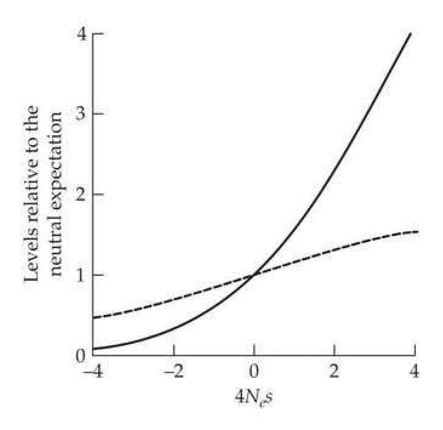
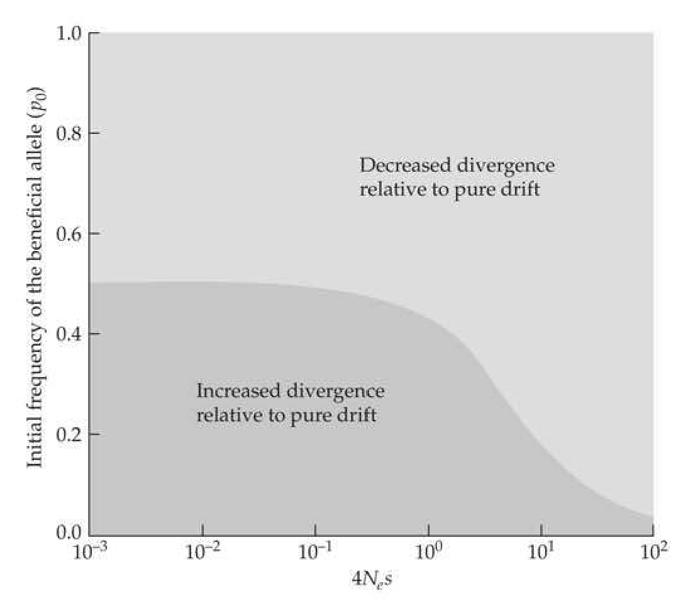
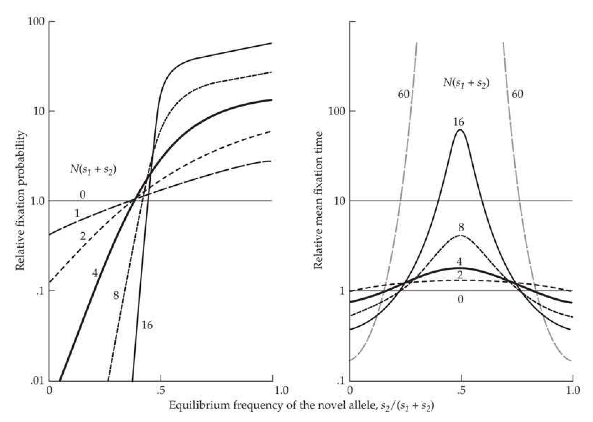
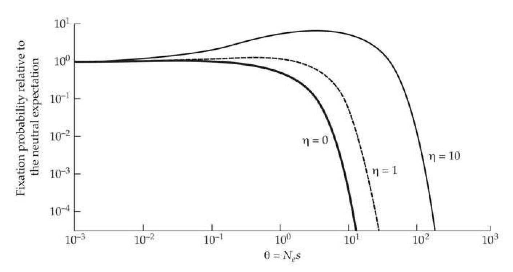
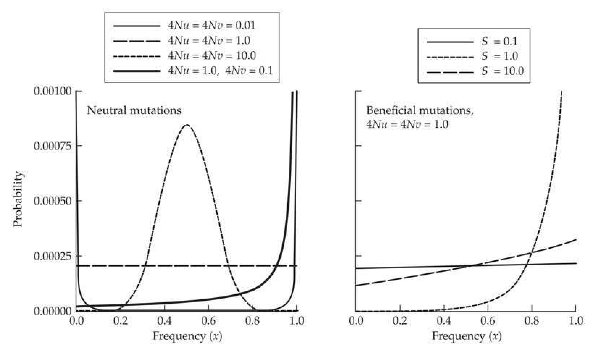

# Chapter 7 · Interaction of Selection, Mutation, and Drift

## chapter7_001 · Interaction of Selection, Mutation, and Drift: Introduction

In recent years, there has been some tendency to revert to more or less mystical conceptions revolving about such phrases as “emergent evolution” and “creative evolution.” The writer must confess to a certain sympathy with such viewpoints philosophically but feels that they can have no place in an attempt at scientific analysis of the problem. Wright (1931)

**[命题 Proposition]**

In the previous chapters, we treated the response to selection as an effectively deterministic process, making the assumption that the stochastic force of random genetic drift is negligible relative to the power of selection, and also ignoring the origin of new variation by mutation. Such an approach often works well when the focus is on short-term evolutionary issues. However, on longer time scales, interactions between selection, mutation, and drift can influence patterns of variation within and among populations in significant and sometimes counterintuitive ways. As all populations are finite in size and all genomes are subject to mutation, such factors must be incorporated into any general theory of evolution. Although the material in this chapter is confined to one- and two-locus systems, the resultant principles provide the basic building blocks for more complex models for the evolution of quantitative traits, which are presented in subsequent chapters.

**[命题 Proposition]**

Generally, mutation and drift, respectively, introduce and remove variation from populations, but selection can have either effect, depending on whether it is directional, stabilizing, or purifying in nature. Of special interest is the degree to which all three forces interact to define the distribution of allele frequencies in an equilibrium population (or more precisely, in a quasi-equilibrium population, as with drift there is always some stochastic wandering of allele frequencies around a long-term expectation). One of the key issues considered in the following pages concerns the amount of variation maintained in the face of opposing pressures. We initially address this matter by retaining the assumption of an effectively infinite population size, considering the issue of selection-mutation balance and the fitness load that recurrent mutation always imposes upon a population. We then evaluate the situation in which drift is sufficiently strong to compete with, or even overpower, the effects of selection. The latter issue is of special interest when we consider selection on a quantitative trait, as strong selection at the phenotypic level does not necessarily translate into strong selection on any particular underlying locus (Equation 5.21). We also show that even when they are completely penetrant, only a small fraction of advantageous mutations will be successfully fixed in a population owing to the overwhelming influence of stochastic forces when alleles are rare. Because the ways in which genes evolve often depend on the background context, we also use this chapter to introduce some key issues regarding the evolution of multilocus systems. First, drawing on results outlined in Chapter 3 for the effects of linkage on the effective population size for a chromosomal region, we explore how this translates into a reduction in the efficiency of selection for advantageous alleles. Second, using compensatory mutations as an entrée into the matter of epistasis, we evaluate the extent to which such pairwise changes are promoted in small vs. large populations. Third, we evaluate the situation in which two or more key mutations are required for a new adaptation, showing that some relatively simple scalings apply to the time to establishment with respect to population sizes and mutation rates.

---

## chapter7_002 · Interaction of Selection, Mutation, and Drift: Introduction / SELECTION AND MUTATION AT SINGLE LOCI

As discussed in Chapter 5, many of the central questions in population and quantitative genetics concern the mechanisms responsible for the maintenance of genetic variation in natural populations. Here, we introduce a few classical models for the balance between the opposing forces of mutation and directional selection. Our preliminary focus will be on the simple case of two alleles, as this serves as the foundation for more complex models for the maintenance of quantitative variation, which are covered in Chapter 28.

**[推导 Derivation]**

Consider a locus with an advantageous allele A and a deleterious allele a, which have respective frequencies of 1 - p and p. Let $ \mu $ be the mutation rate from A to a, let v be the rate of back mutation to A, and assume there is selection preceding mutation in each generation, followed by random mating in a population that is effectively infinite in size. From Chapter 5, the new frequency of a after a generation of viability selection is

> **Formula (7.1)** · `7.1` · source: `chapter7_block_005` · SELECTION AND MUTATION AT SINGLE LOCI
>
> $$ p^{\prime}=p\frac{W_{\mathrm{a}}}{\overline{W}} $$

where $ W_a $ is the marginal fitness of $ a $ (Equation 5.7b), and $ \overline{W} $ is the mean fitness. Letting $ p' $ be the allele frequency following mutation, we then have

> **Formula (7.2)** · `7.2` · source: `chapter7_block_005` · SELECTION AND MUTATION AT SINGLE LOCI
>
> $$ p^{\prime \prime}=(1-v)p^{\prime}+u(1-p^{\prime})=(1-\mu-v)p^{\prime}+\mu $$

**[推导 Derivation]**

This follows because 1 - v is the fraction of a that remains unchanged following mutation, while a fraction $ \mu $ of all A alleles (with frequency 1 - $ p' $) mutate to a. Thus, one generation of the joint action of selection and mutation leads to the new frequency of a

> **Formula (7.3)** · `7.3` · source: `chapter7_block_006` · SELECTION AND MUTATION AT SINGLE LOCI
>
> $$ p^{\prime\prime}=(1-\mu-v)p\frac{W_{\mathrm{a}}}{\overline{W}}+\mu $$

**[推导 Derivation]**

Haldane (1927) was the first to consider the equilibrium allele frequencies that are eventually reached under this model of opposing mutation and selection pressures. If we let the fitnesses of genotypes AA, Aa, and aa be 1, 1 - hs, and 1 - s, respectively, the equilibrium frequencies, $ \widetilde{p} $, satisfying $ \Delta p = p'' - p = 0 $ are given by the solutions of the rather complicated cubic equation

> **Formula (7.4)** · `7.4` · source: `chapter7_block_007` · SELECTION AND MUTATION AT SINGLE LOCI
>
> $$ \begin{align*}(1-\widetilde{p})^{3}s(2h-1)&+(1-\widetilde{p})^{2}[2-3h+\mu h+v(1-h)]\\&+(1-\widetilde{p})[-s(1-h)+\mu(1-hs)+v(1-2s+hs)]-v(1-s)=0\end{align*} $$

**[推导 Derivation]**

(Bürger 2000). Provided 0 < s < 1 and $ h \leq 0.5 $, this expression has a single stable equilibrium and considerable simplification is possible in a number of biologically realistic cases. For example, for the case of neutrality (s = 0), the equilibrium is simply defined by the opposing forces of mutation

> **Formula (7.5)** · `7.5` · source: `chapter7_block_008` · SELECTION AND MUTATION AT SINGLE LOCI
>
> $$ \widetilde{p}=\frac{\mu}{\mu+v} $$

**[推导 Derivation]**

A situation of special interest concerns the polymorphism maintained by a balance between selection and mutation when allele a is at a selective disadvantage. To simplify the solution, it is generally assumed that back mutation to the advantageous allele is a negligible force. There are several mathematical justifications and one biological justification for such an assumption. First, unless the selection coefficient is small relative to the mutation rate, the frequency of the mutant allele will generally be low enough that back mutation will be a second-order effect. Second, although functional genes may mutate to deleterious alleles through numerous mechanisms, precise back mutations to normal alleles will necessarily be much rarer events, i.e., we expect that $ v \ll \mu $. Letting $ v = 0 $, Equation 7.4 can be reduced to a more manageable quadratic equation, with a solution of

> **Formula (7.6a)** · `7.6a` · source: `chapter7_block_009` · SELECTION AND MUTATION AT SINGLE LOCI
>
> $$ \widetilde{p}=\frac{(1+\mu)h s-\sqrt{[h s(1+\mu)]^{2}-4(1-2h)\mu s}}{2(2h-1)s} $$

assuming $ s > \mu $. For the general case of intermediate dominance ($ 0 < h \leq 1 $)

> **Formula (7.6b)** · `7.6b` · source: `chapter7_block_009` · SELECTION AND MUTATION AT SINGLE LOCI
>
> $$ \tilde{p}\simeq\frac{\mu}{h s},\quad\mathrm{p r o v i d e d}\quad h\gg\sqrt{\mu/s} $$

**[推导 Derivation]**

For the extreme situation in which a is a completely dominant deleterious mutation (h = 1)

> **Formula (7.6c)** · `7.6c` · source: `chapter7_block_010` · SELECTION AND MUTATION AT SINGLE LOCI
>
> $$ \widetilde{p}=\frac{\mu}{s} $$

whereas if A is recessive $ (h = 0) $

> **Formula (7.6d)** · `7.6d` · source: `chapter7_block_010` · SELECTION AND MUTATION AT SINGLE LOCI
>
> $$ \widetilde{p}=\sqrt{\frac{\mu}{s}} $$

A number of other special cases were presented in Nagylaki (1992a) and Bürger (2000); for example, $ \widetilde{p} \simeq 3\mu/s $ for sex-linked recessives.

**[推导 Derivation]**

The multiple-allele version of this model can be obtained in a straightforward manner. Suppose there are $ k $ alleles $ (A_1, \cdots, A_k) $ and let $ \mu_{ij} $ be the probability that allele $ A_i $ mutates to allele $ A_j $. If we let $ \mu_i = \sum_{j \neq i} \mu_{ij} $ be the total mutation rate from allele $ A_i $ to any other allele, and assuming constant viability selection followed by mutation and then random mating, the allele-frequency change equations become

> **Formula (7.7)** · `7.7` · source: `chapter7_block_012` · SELECTION AND MUTATION AT SINGLE LOCI
>
> $$ p_{i}^{\prime\prime}=\frac{1}{\overline{W}}\left(\left(1-\mu_{i}\right)W_{i}p_{i}+\sum_{j\neq i}\mu_{j i}W_{j}p_{j}\right) $$

where $ W_{i} $ is the marginal fitness of allele $ A_{i} $ (Equation 5.7b). The equilibrium behavior of this system can be quite complex, and with sufficiently strong mutation there will be the possibility that stable cycles exists (Bürger 2000).

Clark (1998) examined a special case of the multiple-allele model in which there is one optimal allele, and all heterozygotes for single mutations have a fitness of 1 - hs, while heterozygotes for two different mutant alleles have a fitness of 1 - ks, where k is a measure of complementation between two deleterious alleles (with k = 0 implying that each allele compensates for the other allele's deficiencies). Under this model, multiple deleterious alleles are maintained by mutation pressure, and provided k < 1, the sum of their frequencies was higher than expected under the two-allele model. The latter result arises as interallelic complementation reduces the magnitude of selection operating on mutant alleles when they are jointly present in the same genotype.

---

## chapter7_003 · Interaction of Selection, Mutation, and Drift: Introduction / SELECTION AND MUTATION AT SINGLE LOCI

**[示例 Example]**

> **Example 7.1** · ref: `7.1` · source: `chapter7_003.json` · blocks 0–5
>
> Example 7.1. How much variation can mutation maintain when a mutant allele is lethal (s = 1)? The equilibrium frequency of a dominant lethal allele is $$ \widetilde{p}=\mu $$
> 
> (Equation 7.6b), whereas for a recessive lethal $$ \tilde{p}=\sqrt{\mu} $$
> 
> (Equation 7.6c). Thus, because $ \mu \ll 1 $ (Chapter 3), recessive lethals are expected to be much more common than dominant lethals, a pattern that is seen for numerous human genetic disorders (Cavalli-Sforza and Bodmer 1971). Drawing from a tradition starting with Haldane (reviewed in Nachman 2004), these expressions are often used to estimate the lethal mutation rate for monogenic human diseases under the assumption that the observed allele frequencies are at mutation-selection equilibrium (e.g., Kondrashov 2003).
> 
> For a dominant lethal, the frequency of selected individuals in the equilibrium population is $$ \mathrm{f r e q}(a a)+\mathrm{f r e q}(A a)=\mu^{2}+2\mu(1-\mu)\simeq2\mu $$ whereas for a recessive, the frequency of selected individuals is $$ \mathrm{f r e q}(a a)=(\sqrt{\mu})^{2}=\mu $$
> 
> Thus, despite the great disparity in allele frequencies for dominant and recessive lethals, when there are low mutation rates, there will only be a two-fold difference in the expected frequencies of affected individuals.
> 
> What about the equilibrium mean fitness of the population? With a dominant lethal $$ \overline{W}=freq(AA)=(1-\mu)^{2}\simeq1-2\mu $$ while for a recessive lethal $$ \overline{W}=1-\operatorname{f r e q}(a a)=1-\mu $$ owing to the two-fold lower incidence of affected individuals.

**[示例 Example]**

> **Example 7.2** · ref: `7.2` · source: `chapter7_003.json` · blocks 6–6
>
> Example 7.2. Albinism in humans is caused by a recessive allele, with an estimated frequency of albinos of around 1/20,000 (Cavalli-Sforza and Bodmer 1971). If we assume that albinos are at a moderate selective disadvantage (s = 0.1) and at mutation-selection equilibrium, what is the estimated mutation rate to albino alleles? Assuming genotype frequencies in Hardy-Weinberg equilibrium, so that $ \tilde{p}^2 = 1/20,000 $, from Equation 7.6c, $$ \widetilde{p}^{2}=\frac{1}{20,000}=\left(\sqrt{\frac{\mu}{0.1}}\right)^{2} $$ which implies that $ \mu = 5 \times 10^{-6} $. Conversely, if we were to assume a mutation rate of $ \mu = 10^{-5} $, the strength of selection against albinism would be inferred from $$ \widetilde{p}^{2}=\frac{1}{20,000}=\left(\sqrt{\frac{10^{-5}}{s}}\right)^{2} $$ implying s = 0.2, i.e., a 20% reduction of fitness in albinos.

**[示例 Example]**

> **Example 7.3** · ref: `7.3` · source: `chapter7_003.json` · blocks 7–11
>
> Example 7.3. Our treatment of mutation-selection balance has assumed that there is a single reoccurring allele. For many human diseases, however, a large number of different mutational events can have the same fitness effect, e.g., numerous kinds of mutations can inactivate a gene. In such cases, $ \tilde{p} $ is the equilibrium frequency of the entire set of such deleterious alleles. An important question in human genetics is the diversity (or spectrum) of alleles within this set—is the disease largely dominated by a single allele or is it a diverse collection of rare alleles?

---

## chapter7_004 · Interaction of Selection, Mutation, and Drift: Introduction / SELECTION AND DRIFT AT SINGLE LOCI

In the preceding section, we assumed that we were examining a situation in which the forces of selection and mutation are powerful enough to ignore the stochastic consequences of random genetic drift, at least in the short term. This deterministic approach to population genetics yields explicit equilibrium solutions for allele frequencies, usually with no oscillatory behavior. In reality, however, drift plays a significant role in all long-term population-genetic contexts. For example, even when selection against deleterious mutations is strong, the defective alleles segregating in a population today will generally be descendants of entirely different mutations than those that segregated many millennia in the past.

All mutations eventually experience one of two alternative fates, complete loss or fixation, and our focus now becomes the latter, specifically the probability that by the spread of its descendants, an allele expands to a total frequency of 1.0. In general, drift reduces the efficiency of selection because the sampling of gametes to form each consecutive generation results in random deviations of allele frequencies from their deterministic expectations based on selection alone. If drift is strong relative to selection, a favored allele may stochastically decrease in frequency, and sometimes, eventually become lost. Throughout the following subsections, we ignore the effects of recurrent mutation, focusing instead on a single specific event—the fate of a preexisting allele or newly arisen mutation.

**[推导 Derivation]**

Most of the theory of the interaction between selection and drift was developed for a single diallelic locus under viability selection, which allows the change in allele frequency per generation to be treated as the sum of changes resulting from selection and drift, $$ \Delta p=\Delta p_{s}+\Delta p_{d} $$ where $ \Delta p_s $ is given by Equation 5.1b and 5.1c, and $ \Delta p_d $ (the per-generation change due to drift) is a random variable. Drift causes no directional tendency in the change in allele frequency, and hence $ E(\Delta p_d) = 0 $. Thus, the simplest measure of the strength of drift is the expected variance in allele-frequency change due to gamete sampling, which, under the standard Wright-Fisher model (Chapter 2), is defined by the binomial distribution

> **Formula (7.8)** · `7.8` · source: `chapter7_block_028` · SELECTION AND DRIFT AT SINGLE LOCI
>
> $$ \sigma^{2}(\Delta p_{d})=\frac{p(1-p)}{2N_{e}} $$

where $p$ is the allele frequency prior to sampling, $N_e$ is the variance effective population size, and the 2 accounts for diploidy (and is replaced by a 1 for a haploid population; Chapter 3). If $\sigma^2(\Delta p_d)$ is small relative to $\Delta p_s$, allele-frequency changes will not be dramatically different from their expectations under selection in an infinite population, but if $\sigma^2(\Delta p_d) > \Delta p_s$, drift can substantially obscure the deterministic force of selection.

Consider the situation in which alleles have additive fitness effects, with the genotypes AA, Aa, and aa having respective fitnesses of 1, 1+s, and 1+2s. Letting p be the frequency of allele a, then, from Equation 5.2, $ \Delta p_s \simeq sp(1-p) $, assuming weak selection ($ |s| \ll 1 $). If we compare this result with Equation 7.8, it becomes clear that directional selection dominates drift when $ 2N_e|s| \gg 1 $, whereas drift dominates directional selection when $ 2N_e|s| \ll 1 $. Because the intensity of drift scales with $ 1/(2N_e) $, a useful heuristic is that $ 2N_e s $ approximates the ratio of the power of selection to drift. This argument is not quite precise because the variance of allele-frequency change is only a rough indicator of the sampling properties of the allele-frequency distribution. However, diffusion theory, which gives an essentially complete description of the dynamics of a diallelic locus under drift and selection, upholds this general conclusion (Appendix 1). We will frequently encounter the composite parameter, $ 2N_e s $, in the following paragraphs.

---

## chapter7_005 · SELECTION AND DRIFT AT SINGLE LOCI / Probability of Fixation Under Additive Selection

There is no possibility of having a perfectly stable polymorphism when drift and selection interact. Indeed, even in the case of overdominant selection (where there is a stable equilibrium in an infinite population; Chapter 5), one allele will eventually drift to fixation unless both homozygotes are lethal. Under this scenario, all new mutations ultimately become either lost or fixed at the population level, and those that become fixed will themselves be subject to replacement by subsequently arising mutations. Thus, when finite populations are considered, we need to think in terms of fixation probabilities and sojourn times of mutations. Even highly favorable alleles have fixation probabilities of less than 1.0 to a degree that depends on the initial frequency $ p_0 $, the strength of selection, and the effective population size $ N_e $.

**[推导 Derivation]**

Suppose we denote by $ u_f(p_0) $ the probability that an allele starting at initial frequency $ p_0 $ will become fixed. As noted in Chapter 2, under neutrality, the probability of fixation depends only on an allele's initial frequency regardless of population size, so that

> **Formula (7.9)** · `7.9` · source: `chapter7_block_031` · Probability of Fixation Under Additive Selection
>
> $$ u_{f}(p_{0})=p_{0} $$

**[推导 Derivation]**

Depending on the magnitude and direction of selection, this probability will either increase or decrease. When allelic effects on fitness behave additively, such that each copy of allele a changes fitness by s (giving fitnesses of 1, 1 + s, and 1 + 2s)

> **Formula (7.10a)** · `7.10a` · source: `chapter7_block_032` · Probability of Fixation Under Additive Selection
>
> $$ u_{f}(p_{0})\simeq\frac{1-e^{-4N_{e}sp_{0}}}{1-e^{-4N_{e}s}} $$

> **Formula (7.10b)** · `7.10b` · source: `chapter7_block_032` · Probability of Fixation Under Additive Selection
>
> $$ \simeq p_{0}+2N_{e}sp_{0}(1-p_{0})\quad when2N_{e}|s|\leq1 $$

Equation 7.10a, due to Kimura (1957) with a slightly improved version given by Cash (1977), was derived using diffusion theory in Appendix 1. The simplified version, Equation 7.10b, was developed by Robertson (1960a) using the Taylor series approximation $ e^{-x} \simeq 1 - x + x^2 / 2 $ for $ |x| \ll 1 $, and an alternative derivation is given below. Although these approximations apply to both beneficial $ (s > 0) $ and deleterious $ (s < 0) $ alleles, and work especially well with favorable alleles (Carr and Nassar 1970), they can significantly overestimate the fixation probabilities of highly deleterious alleles ($ N_e \leq -1 $), an issue examined in detail by Bürger and Ewens (1995).

It is critical to note that even when an allele is under strong selection, drift still plays a powerful role when allele frequencies are near zero. Starting with a single copy of an advantageous allele (with frequency $ p_0 = 1/(2N) $, where $ N $ is the number of reproductive adults in the population), Equation 7.10a implies that the probability of fixation of a new mutation is approximately $ 2s(N_e/N) $ when $ 4N_e s \gg 1 $. As we expect $ N_e $ to generally be $ \ll N $ (Chapter 3) and $ s $ is typically $ \ll 1 $, this implies that a newly arisen favorable mutation will usually be lost by drift, no matter how beneficial. However, once the frequency of a strongly beneficial allele becomes sufficiently high, fixation is almost certain. For example, if $ N_{e}sp_0 > 0.5 $, the probability of fixation exceeds 0.70, while if $ N_{e}sp_0 > 1 $, the probability of fixation exceeds 0.93.

**[推导 Derivation]**

For mutations with a weak effect, it is informative to consider the probability of fixation of a newly arisen mutation relative to the neutral expectation of $ 1/(2N) $. Returning to Equation 7.10a, and approximating the numerator as $ 4N_{e}sp_{0} $, with $ p_{0}=1/(2N) $, the scaled probability of fixation

> **Formula (7.11)** · `7.11` · source: `chapter7_block_035` · Probability of Fixation Under Additive Selection
>
> $$ u_{f}^{\prime}(p_{0})=\frac{u_{f}(p_{0})}{1/(2N)}\simeq\frac{4N_{e}s}{1-e^{-4N_{e}s}}=\frac{S}{1-e^{-S}} $$

is found to be entirely a function of the composite parameter $ S = 4N_e s $, which, as noted above, is a measure of the strength of selection (2s in favor of homozygotes) relative to that of drift, $ 1/(2N_e) $ (Figure 7.1). For positive selection with $ S = 0.01 $, 0.1, and 1.0, respectively, $ u_f'(p_0) \simeq 1.005 $, 1.05, and 1.58, respectively, whereas with negative selection with the same absolute values, $ u_f'(p_0) \simeq 0.995 $, 0.95, and 0.58, respectively. This shows that the fixation probability of a mutant allele will be very close to the neutral expectation of $ 1/(2N) $ provided $ |S| \ll 1 $. This domain of effectively neutrality is potentially significant in a number of different contexts. For example, populations of sufficiently small size are unable to purge deleterious mutations or promote beneficial mutations with $ |s| < 1/(4N_e) $.

**[推导 Derivation]**

A number of other useful approximations for alleles with additive effects on fitness have been derived from diffusion theory. For example, Kimura (1969) found that the average cumulative contribution of a new mutation to the population-level heterozygosity (summed over all generations until it is lost or fixed) is equal to

> **Formula (7.12)** · `7.12` · source: `chapter7_block_036` · Probability of Fixation Under Additive Selection
>
> $$ H_{T}=\left(\frac{4N_{e}}{N}\right)\left(\frac{S-1+e^{-S}}{S[1-e^{-S}]}\right) $$

**[Figure]**

> **Figure 7.1** · page 8 · source: `chapter7`
>
> 
>
> Figure 7.1 Probability of fixation (solid line) and lifetime contribution to heterozygosity (dashed line) of a new mutant allele with additive effects on fitness as a function of  $ 4N_{e}s $ (using Equations 7.11 and 7.12), both relative to the neutral expectation.

Although this measure may seem somewhat abstract, the product of $ H_T $ times the number of new mutations arising in the population per generation, $ 2N_\mu $, is equal to the expected heterozygosity under selection-mutation-drift equilibrium. For neutral mutations ($ S \to 0 $), $ H_T \to 2N_e/N $, implying an expected heterozygosity of $ 4N_e\mu $ (which, assuming $ 4N_e\mu \ll 1 $, is consistent with results in Chapter 2 that were obtained by a different method). For large positive values of $ S $ (strongly beneficial mutations), $ H_T $ approaches a limiting value of $ 4N_e/N $, implying that on a per-mutation basis, such mutations make twice the contribution to the heterozygosity as neutral mutations. Finally, for deleterious mutations with sufficiently strong effects to be eliminated by selection, $ H_T \simeq 2/(N|s|) $. As in the case of the fixation probability, the expected heterozygosity at a locus scaled to the neutral expectation (dividing $ 2N\mu H_T $ by $ 4N_e\mu $) is a simple function of $ S $ (Figure 7.1). Viewed in this way, it can be seen that although both the relative fixation rate and the contribution to heterozygosity increase with S, the former responds much more rapidly. This is because deleterious mutations that essentially never fix in a population nevertheless make transient contributions to the heterozygosity prior to their elimination by selection, whereas positively selected mutations that are driven through the population relatively rapidly contribute to heterozygosity for only a relatively short period of time.

**[推导 Derivation]**

A useful approximation for newly arisen mutations with additive effects is that, conditional upon fixation, the expected number of generations spent at frequency x will be

> **Formula (7.13a)** · `7.13a` · source: `chapter7_block_038` · Probability of Fixation Under Additive Selection
>
> $$ \Phi_{f}(x)=\frac{2N_{e}(1-e^{-Sx})(1-e^{-S(1-x)})}{SNx(1-x)(1-e^{-S})} $$

where $ x = 1/(2N), \cdots, (2N - 1)/(2N) $ (from Equation 8.66 in Kimura 1983). There are two notable points with respect to this residence-time relationship (Figure 7.2). First, provided $ |S| < 1.0 $, conditional upon fixation, a new mutant allele will spend approximately $ 2N_e/N $ generations in each frequency class. Second, the residence-time features of a deleterious mutation en route to fixation are exactly the same as those for a beneficial mutation with the same absolute fitness effects, implying that both have the same mean time to fixation, even though the probability of fixation is lower in the former case. First pointed out by Maruyama and Kimura (1974), this counterintuitive behavior results from the fact that if a deleterious allele is to become fixed, it must do so as a consequence of some fortuitously rapid and extreme sampling errors.

**[推导 Derivation]**

It is also sometimes useful to know the expected residence times of mutations that eventually become lost, $ \Phi_{l}(x) $. From Equation 8.70 in Kimura (1983), the unconditional mean residence time for mutations (regardless of being fixed or lost) is

> **Formula (7.13b)** · `7.13b` · source: `chapter7_block_039` · Probability of Fixation Under Additive Selection
>
> $$ \begin{align*}\Phi(x)={{2N_e(1-e^{-S(1-x)})\over Nx(1-x)(1-e^{-S})}}\end{align*} $$

and using the fact that

> **Formula (7.13c)** · `7.13c` · source: `chapter7_block_039` · Probability of Fixation Under Additive Selection
>
> $$ \begin{align*}\Phi(x)=u_f(1/2N)\cdot\Phi_f(x)+[1-u_f(1/2N)]\cdot\Phi_l(x)\end{align*} $$

yields the residual times conditional upon eventual loss

> **Formula (7.13d)** · `7.13d` · source: `chapter7_block_039` · Probability of Fixation Under Additive Selection
>
> $$ \Phi_{l}(x)=\frac{N_{e}e^{Sx}(e^{S(1-x)}-1)^{2}}{N^{2}x(1-x)(e^{S}-1)(e^{S[1-(1/2N)]}-1)} $$

---

## chapter7_006 · Interaction of Selection, Mutation, and Drift: Introduction / Probability of Fixation Under Additive Selection

**[Figure]**

> **Figure 7.2** · page 9 · source: `chapter7`
>
> 
>
> Figure 7.2 Average number of generations that a new mutation spends within different frequency classes,  $ x = 1/(2N), \cdots, (2N - 1)/(2N) $, conditional on going to fixation (Left) or conditional on being lost (Right), given as a function of the scaled selection parameter  $ S = 4N_e s $ (inset values), obtained using Equations 7.13a and 7.13d, with  $ N = N_e = 1000 $. Note that in each case, the results are identical for beneficial and deleterious mutations with the same absolute values of  $ s $. With  $ N_e \neq N $, the results must be multiplied by  $ N_e/N $.

Again, we see that the residence times conditional upon loss are essentially the same for positive and negative selection coefficients of the same absolute magnitude (Figure 7.2). This is not true for the unconditional residence times, $ \Phi(x) $, which are functions of $ \Phi_f(x) $ and $ \Phi_l(x) $ weighted by the probabilities of fixation and loss (Equation 7.13c).

**[推导 Derivation]**

For effectively neutral mutations destined to loss, $ |S| < 1.0 $,

> **Formula (7.14a)** · `7.14a` · source: `chapter7_block_041` · Probability of Fixation Under Additive Selection
>
> $$ \Phi_{l}(x)\simeq\frac{N_{e}(1-x)}{N\lambda x} $$

where $ \lambda = 1 - [1/(2N)] $, whereas the unconditional residence time is

> **Formula (7.14b)** · `7.14b` · source: `chapter7_block_041` · Probability of Fixation Under Additive Selection
>
> $$ \Phi(x)\simeq\frac{N_{e}}{Nx} $$

i.e., the average time spent in frequency class x is inversely proportional to x.

**[推导 Derivation]**

The preceding expressions are useful in a number of applications. For example, the mean numbers of generations to fixation, loss, or either (removal of either allele) can be obtained, respectively, by summing Equations 7.13a, 7.13d, and 7.13c over all frequency classes in the interval $ [(1/(2N), 1 - 1/(2N))] $. Simplifications can be made possible in some cases. For example, as noted above, a neutral mutation that is destined for fixation spends an average of $ 2N_e/N $ generations in each frequency class, and because there are $ 2N - 1 $ classes, the time to fixation of effectively neutral alleles is essentially $ 4N_e $ generations, an outcome obtained in Chapter 2 by different means. The conditional time to loss of a neutral mutation is

> **Formula (7.15)** · `7.15` · source: `chapter7_block_042` · Probability of Fixation Under Additive Selection
>
> $$ t_{l}=\frac{2N_{e}\ln(2N)}{N\lambda} $$

**[推导 Derivation]**

(derived in Example A1.8). The mean number of generations until the complete loss of a new mutation with a deleterious heterozygous effect of s < 0 is

> **Formula (7.16)** · `7.16` · source: `chapter7_block_043` · Probability of Fixation Under Additive Selection
>
> $$ t_{l}\simeq2(N_{e}/N)[\ln(2N/|S|)+0.423] $$

provided $ |S| \gg 1 $ (Kimura and Ohta 1969b; Nei 1971). More general expressions, which require some numerical integration, can be found in Kimura and Ohta (1969a).

**[推导 Derivation]**

Knowing the mean total number of copies descendent from a mutation prior to its loss or fixation is useful in a number of contexts, e.g., determining the total number of individuals affected by a deleterious mutation. This is defined as

> **Formula (7.17a)** · `7.17a` · source: `chapter7_block_044` · Probability of Fixation Under Additive Selection
>
> $$ \overline{n}=\sum_{y=1}^{2N-1}\Phi(y/2N)\cdot y $$

with a shift of the function $ \Phi $ to $ \Phi_{l} $ or $ \Phi_{f} $, leading to the expected numbers conditional on loss or fixation, respectively. For the case of neutral mutations

> **Formula (7.17b)** · `7.17b` · source: `chapter7_block_044` · Probability of Fixation Under Additive Selection
>
> $$ \overline{n}=4N_{e}\lambda $$

> **Formula (7.17c)** · `7.17c` · source: `chapter7_block_044` · Probability of Fixation Under Additive Selection
>
> $$ \overline{n}_{f}=4N_{e}N\lambda $$

> **Formula (7.17d)** · `7.17d` · source: `chapter7_block_044` · Probability of Fixation Under Additive Selection
>
> $$ \overline{n}_{l}=2N_{e}\lambda $$

The mean frequency prior to absorption is simply $ \overline{n}/(2N) $ divided by the average absorption time.

**[示例 Example]**

> **Example 7.4** · ref: `7.4` · source: `chapter7_006.json` · blocks 6–8
>
> Example 7.4. Although it is generally thought that selection will increase the determinism of a system, this is not necessarily the case. Cohan (1984b) showed that, starting with identical allele frequencies, the probability of divergence between replicate populations can increase relative to the situation under pure drift if the initial frequency of the advantageous allele is sufficiently small. We refer to this phenomenon as the Cohan effect. This point can easily be seen as follows. Supposing two replicate populations are segregating alleles A and a at a locus, with the frequency of A being p = 0.25, then under pure drift, the probability that one replicate will become fixed for A and the other for a is 2 - 0.25 - (1 - 0.25) = 0.375. Now suppose that A is favored by selection, with $ N_{\ell,s} = 0.5 $. Again assuming $ p_0 = 0.25 $, Equation 7.10a gives the fixation probability of A as 0.46, implying that the probability of fixing alternative alleles is 2 - 0.46 - 0.54 = 0.496. Thus, in this case, divergence is substantially increased by the interaction between selection and drift.
> 
> In general, the probability of fixing alternative alleles in two replicates is $ 2u_f(p) $ $ [1 - u_f(p)] $, which is maximized when $ u_f(p) = 1/2 $. Thus, the probability of divergence is increased by selection if $ u_f(p) $ under selection is closer to 1/2 than $ u_f(p) = p $ under drift; and because $ u_f(p) > p $ for a selectively favored allele, a minimum requirement for increased divergence under pan-selection is that the starting frequency of the advantageous allele be < 1/2. Figure 7.3 shows that under additive selection, the conditions for the probability of divergence under drift plus selection to exceed that under drift alone are not very restrictive.
> 
> The Cohan effect has a number of practical implications. For example, an elevated level of population subdivision for a quantitative trait relative to the neutral expectation is often taken to imply that there are divergent selective regimes across subpopulations (Chapter 12). However, here we see that under identical directional selection pressures, populations that initiate with low-frequency, advantageous alleles can exhibit levels of divergence that are conventionally interpreted as being associated with diversifying selection. Whether allele frequencies, selection coefficients, and drift intensities commonly have the right mixes for uniform selection to enhance the magnitude of phenotypic divergence remains to be seen, but a wide range of conditions appears to yield divergence levels that would be difficult to discriminate from the neutral expectation (Lynch 1986).

---

## chapter7_007 · SELECTION AND DRIFT AT SINGLE LOCI / Probability of Fixation Under Arbitrary Selection

**[Figure]**

> **Figure 7.3** · page 11 · source: `chapter7`
>
> 
>
> Figure 7.3 The influence of drift on the probability of fixation of alternative alleles in a pair of populations starting from an identical state. A diallelic locus under additive selection with fitnesses 1, 1 + s, and 1 + 2s is considered. The slightly darker shaded area on the lower left is the region of  $ p_0 $ (the initial frequency of A) and  $ 4N_e $s space where the probability that isolated populations are eventually fixed for alternative alleles under selection and drift is higher than under drift alone. In this region, parallel selection increases the amount of evolutionary indeterminism relative to drift alone.

**[推导 Derivation]**

We now consider the more general model, allowing for dominance, with the genotypes aa, Aa, and AA having fitnesses of 1, 1 + sh, and 1 + 2s, respectively. Diffusion theory (as developed in Appendix 1) then shows the fixation probability of allele A as

> **Formula (7.18a)** · `7.18a` · source: `chapter7_block_049` · Probability of Fixation Under Arbitrary Selection
>
> $$ u_{f}(p_{0}\mid s,h)\simeq\frac{\displaystyle\int_{0}^{p_{0}}e^{G(x)}\; dx}{\displaystyle\int_{0}^{1}e^{G(x)}\; dx} $$

where

> **Formula (7.18b)** · `7.18b` · source: `chapter7_block_049` · Probability of Fixation Under Arbitrary Selection
>
> $$ G(x)=-4N_{e}s x(h-x) $$

**[推导 Derivation]**

For a new mutant introduced as a single copy, $ p_0 = 1/(2N) $, under random mating and at least partial dominance,

> **Formula (7.19a)** · `7.19a` · source: `chapter7_block_050` · Probability of Fixation Under Arbitrary Selection
>
> $$ \begin{align*}u_f\left({1\over2N}\right)\simeq{2N_e sh\over N[1-e^{-4N_e sh}]}\end{align*} $$

**[推导 Derivation]**

This shows that the probability of fixation of a new mutation is largely determined by the heterozygous effect, as almost all copies of a mutation remain in this state until the allele frequency has achieved a moderately high level. For a complete recessive $ (h = 0) $, the approximation leading to Equation 7.19a breaks down, and higher-order terms in the approximation of Equation 7.18a are required. However, for strong positive selection on homozygotes of a completely recessive allele $ (4N_e s \gg 1) $, a close approximation is given by

> **Formula (7.19b)** · `7.19b` · source: `chapter7_block_051` · Probability of Fixation Under Arbitrary Selection
>
> $$ u_{f}\left(\frac{1}{2N}\right)\simeq\frac{\sqrt{4N_{e}s/\pi}}{N} $$

(see Example A1.7 for details).

**[推导 Derivation]**

If there is direct inbreeding due to the mating of close relatives (beyond the amount of long-term inbreeding that is naturally generated by drift), Equation 7.18a will still hold, but now with

> **Formula (7.20a)** · `7.20a` · source: `chapter7_block_053` · Probability of Fixation Under Arbitrary Selection
>
> $$ G(x)=-4N_{e}s x[2f+(1-f)(h-x)] $$

where f is a measure of the departure of genotypes from Hardy-Weinberg expectations, defined (in Chapter 2) by the frequency of heterozygotes, $ 2p(1-p)(1-f) $ (Caballero and Hill 1992b). Using Equation 7.18a, the fixation probability now becomes

> **Formula (7.20b)** · `7.20b` · source: `chapter7_block_053` · Probability of Fixation Under Arbitrary Selection
>
> $$ u_{f}\left(\frac{1}{2N}\right)\simeq\frac{2N_{e}s[2f+(1-f)h]}{N} $$

**[推导 Derivation]**

(Caballero and Hill 1992b; Caballero 1996), which, for a complete recessive $ (h = 0) $, reduces to

> **Formula (7.20c)** · `7.20c` · source: `chapter7_block_054` · Probability of Fixation Under Arbitrary Selection
>
> $$ u_{f}\left(\frac{1}{2N}\right)\simeq\frac{4N_{e}f s}{N} $$

Thus, with even a small amount of inbreeding, the probability of fixation of a beneficial recessive allele is considerably higher than under random mating (Equation 7.19b) due to the elevated exposure in homozygotes (Caballero et al. 1991). In contrast, inbreeding has much more moderate effects on the fixation probabilities of alleles with additive $ (h=1) $ or dominant $ (h=2) $ fitness effects. Glémin (2012) showed that inbreeding also speeds up the loss and fixation times of a new allele relative to panmixia.

**[推导 Derivation]**

By indirectly causing localized inbreeding, population subdivision can also influence the probability of fixation. Whitlock (2003) found that, for a wide variety of population structures, the global probability of fixation of a new beneficial mutation is well approximated by

> **Formula (7.21)** · `7.21` · source: `chapter7_block_056` · Probability of Fixation Under Arbitrary Selection
>
> $$ u_{f}\left(\frac{1}{2N}\right)=\frac{2N_{e}s h(1-F_{S T})}{N} $$

where the effective and total population sizes $ (N_e $ and $ N) $ are defined at the metapopulation level and $ F_{ST} $ is an index of population subdivision (defined as the fraction of metapopulation variation for neutral alleles that is distributed among populations; see Chapter 2). Note that with complete population subdivision $ (F_{ST} = 1) $, fixation is impossible at the metapopulation level as mutations will be permanently confined to the demes in which they arise.

**[命题 Proposition]**

One cannot immediately infer from Equation 7.21 whether population subdivision will enhance or reduce the probability of fixation because subdivision influences both $ F_{ST} $ and $ N_{e} $. Expressions for effective population sizes under a number of metapopulation structures were presented in Chapter 3, and parallel expressions for $ F_{ST} $ can be found in most of the literature cited there. In the case of the ideal island model with symmetric migration between demes and equal contributions of all demes to the entire metapopulation (Chapter 3), $ N_{e} = N/(1 - F_{ST}) $, and Equation 7.21 reduces to 2hs, showing that in this particular case the probability of fixation is independent of the magnitude of population subdivision and simply equal to twice the selective advantage in heterozygotes (Maruyama 1970). Analyses of more complex population structures (Slatkin 1981b; Barton 1993) are all special cases of Whitlock's (2003) expression provided the assumption of equal deme productivity is met; and the modifications that are necessary when this condition are violated were developed by Whitlock (2003) as well. The more complex situation in which the strength of selection varies among demes was taken up by Whitlock and Gomulkiewicz (2005).

**[定义 Definition]**

Otto and Whitlock (1997) provided results for fixation probabilities in populations of changing size, and showed that selection is more effective in growing populations (increasing the probabilities that favorable alleles will be fixed and that deleterious alleles will be lost) than in declining populations. This result has obvious implications for managed populations. Fortuitously, the limiting expression for the fixation probability of alleles with additive effects (given above as $ 2sN_e/N $) applies to populations that are changing in size, provided appropriate modifications are made in the definition of $ N_e $ (Otto and Whitlock 1997). The much more complex issue of jointly varying population sizes and selection coefficients was taken up by Uecker and Hermisson (2011). Finally, a number of additional diffusion results are given for a diallelic locus in Appendix 1, but simple expressions are generally unavailable for multiple alleles.

---

## chapter7_008 · SELECTION AND DRIFT AT SINGLE LOCI / Fixation of Overdominant and Underdominant Alleles

A case of special interest is the effect of drift on a locus experiencing selective overdominance, where the heterozygote has higher fitness than either homozygote. Whereas such balancing selection permanently maintains both alleles in an infinite population (Example 5.4), drift will ultimately fix one allele in a finite population provided that the homozygote has a nonzero fitness. Although it might seem that balancing selection will always magnify the longevity of a polymorphism, contrary to intuitive expectations, selection sometimes increases the rate of fixation at an overdominant locus in a finite population (Robertson 1962; Ewens and Thomson 1970; Chen et al. 2008).

If the equilibrium frequency expected in an infinite population is extreme (roughly $ \widetilde{p} < 0.2 $ or $ \widetilde{p} > 0.8 $), a polymorphism starting at $ \widetilde{p} $ in a finite population will usually be lost more rapidly under balancing selection than under drift alone, thereby accelerating the removal of heterozygosity. Such behavior arises because selection keeps allele frequencies fairly close to their equilibrium values. If such values are near 0.0 or 1.0, the minor allele will be impeded from drifting to more protective states of moderate frequencies, thereby increasing the likelihood of loss by drift.

Nei and Roychoudhury (1973) evaluated this issue further with newly arisen overdominant alleles with an initial frequency of $ 1/(2N) $. In this case, the mutant allele is initially confined to the heterozygous state, so its early fate is largely independent of its own homozygous effect, but highly dependent on the magnitude of its heterozygous advantage over the ancestral homozygote. Fixation probabilities can only be obtained by numerical analysis in this case, but the results depend only on two parameters, $ N_e(s_1 + s_2) $ and the infinite-population equilibrium frequency, $ \tilde{p} = s_2/(s_1 + s_2) $, where $ s_1 $ and $ s_2 $ are, respectively, the selection coefficients against the homozygotes associated with the mutant and resident alleles. If $ \tilde{p} $ for the derived allele under consideration is much less than 0.5, the fixation probability is less than the neutral expectation, for the reasons already noted. However, if $ \tilde{p} > 0.5 $ (meaning that the fitness of the ancestral homozygote is lower than that of the mutant homozygote), the fixation probability will always be greater than the neutral expectation, even though fixation results in the loss of the optimal (heterozygous) genotype. Moreover, in this case, the fixation probability of the mutant allele is only slightly smaller than that predicted by Equation 7.10a when $ s_2 $ is used as a selection coefficient (Nei and Roychoudhury 1973). If $ 2N_e(s_1 + s_2) \ll 1 $, selection will be uniformly overpowered by drift, and the system will behave in an effectively neutral fashion.

**[Figure]**

> **Figure 7.4** · page 14 · source: `chapter7`
>
> 
>
> Figure 7.4 Ratios for the fixation probabilities and expected times to fixation for a newly arisen overdominant mutation relative to the expectation for a neutral mutation. These are given as a function of the equilibrium frequency expected in a population of infinite size,  $ \tilde{P} = s_{2}/(s_{1} + s_{2}) $, where the fitnesses are  $ 1 - s_{1} $, 1, and  $ 1 - s_{2} $ (with the first value being the fitness for the mutant homozygote). Each curve gives results for a different value of  $ N_{e}(s_{1} + s_{2}) $, a measure of the ratio of the overall power of selection to drift, where  $ N_{e} $ is the effective population size. For any value of  $ N_{e}(s_{1} + s_{2}) $, the probability of fixation increases with the magnitude of selection against the alternative homozygote, as this defines the selective advantage of the novel allele in the heterozygous state. (From Nei and Roychoudhury 1973.)

The fixation times for newly arisen overdominant mutations parallel the patterns of loss of variation that Robertson (1962) first noted (Nei and Roychoudhury 1973). When the equilibrium frequency is outside of the range of (0.2, 0.8), the mean fixation time will be lower than the neutral expectation of $ 4N_e $ generations, whereas for $ 0.2 < \tilde{p} < 0.8 $, the time is elevated, with more extreme behaviors seen at high values of $ N_e(s_1 + s_2) $ (Figure 7.4). Particularly intriguing is the fact that the fixation time of an overdominant mutation will be symmetrical around $ \tilde{p} = 0.5 $, i.e., for a given strength of selection $ N_e(s_1 + s_2) $, the time to fixation is the same at equilibrium frequencies $ \tilde{p} $ and $ 1 - \tilde{p} $. This is consistent with the situation for mutants with additive effects that was already noted, and indicates that when an overdominant mutant allele is associated with the least fit homozygous type, for the rare occasions in which fixation occurs, it does so just as rapidly, on average, as when it is associated with the most fit homozygote (in which case it also fixes more frequently). Further considerations for the situation in which populations are subdivided were given in Nishino and Tajima (2004).

Important situations also exist in which a new mutation will be underdominant with respect to the ancestral allele, i.e., will have reduced fitness when in the heterozygous state, but equal or higher fitness as a homozygote. In an infinite population, such an allele will always be driven from the population if its marginal fitness at low frequency is less than that of the ancestral allele (Chapter 5). In a finite population, however, there is some chance that the mutant allele might drift to a high frequency, transiently taking the population through a reduction in mean fitness (during the period in which heterozygotes are common), but possibly eventually becoming fixed.

Such a scenario has generated considerable interest in the area of speciation biology, as the fixation of an underdominant mutation in a subpopulation will lead to a situation in which hybrids between subpopulations have reduced fitness. In principle, such a condition can constitute the first stage in the development of reproductive isolation.

**[推导 Derivation]**

For the situation in which the two homozygotes have equal fitness and heterozygotes experience a reduction in fitness of s, Lande (1979b) found that if $ sN_e/N \ll 1 $ (a condition likely to be met based on empirical information on $ N_{e}/N $; Chapters 3 and 4), then

> **Formula (7.22)** · `7.22` · source: `chapter7_block_065` · Fixation of Overdominant and Underdominant Alleles
>
> $$ u_{f}(1/2N)\simeq\frac{\sqrt{N_{e}s/\pi}}{N\cdot e^{N_{e}s}\cdot\mathbf{erf}(\sqrt{N_{e}s})} $$

where the error function

> **Formula (7.23)** · `7.23` · source: `chapter7_block_065` · Fixation of Overdominant and Underdominant Alleles
>
> $$ \mathrm{erf}(x)=(2/\sqrt{\pi})\int_{0}^{x}e^{-y^{2}}dy $$

is the cumulative frequency of a unit normal (Abramowitz and Stegun 1972). If the efficiency of selection is sufficiently low ($ N_e s \ll 2 $), then $ u_f(1/2N) \simeq 1/(2N) $, as expected for an effectively neutral allele. However, if the efficiency of selection is high ($ N_e s > 2 $), so that $ \text{erf}(\sqrt{N_e s}) \simeq 1 $, then

> **Formula (7.24)** · `7.24` · source: `chapter7_block_065` · Fixation of Overdominant and Underdominant Alleles
>
> $$ u_{f}(1/2N)\simeq\frac{\sqrt{N_{e}s/\pi}}{N e^{N_{e}s}} $$

Of special interest in the study of speciation are chromosomal rearrangements that cause problems during meiosis in chromosomal heterozygotes, with values of $s$ as large as 0.5 being quite plausible (Lande 1979b, 1984b). With $N_{e}s = 2$, 5, and 10, Equation 7.24 predicts fixation rates that are, respectively, 0.22, 0.017, and 0.00016 times the neutral expectation. Such results imply that if heterozygote fitness is greatly reduced, transitions to alternative allelic states (with equivalent homozygous fitness) will only be possible if $N_{e}$ is extremely small. However, when such fixations do occur, they proceed much more rapidly than the neutral expectation of $4N_{e}$ generations (Lande 1979b).

**[推导 Derivation]**

Walsh (1982) generalized these results to the situation in which the fitness in the novel homozygote is elevated to $ 1+t $, such that after passage through a fitness bottleneck, fixation of the underdominant allele leads to an increase in mean population fitness. Letting $ \theta = N_e s $, and $ \omega = 1 + (t/2s) $

> **Formula (7.25)** · `7.25` · source: `chapter7_block_067` · Fixation of Overdominant and Underdominant Alleles
>
> $$ u_{f}(1/2N)=\frac{\mathrm{erf}\{[1/2N)-(0.5/\omega)]\sqrt{4\theta\omega}\}+\mathrm{erf}\{\sqrt{\theta/\omega}\}}{\mathrm{erf}\{[1-(0.5/\omega)]\sqrt{4\theta\omega}\}+\mathrm{erf}\{\sqrt{\theta/\omega}\}} $$

For $ t < 2s $, the fixation probability is close to that predicted by Equation 7.22, whereas for very large values of $ t $, $ u_f(1/2N) $ can moderately exceed the neutral fixation probability provided $ N_e $s is not so strong that the allele is incapable of drifting to a high enough frequency to be favored by selection (Figure 7.5).

**[推导 Derivation]**

The latter case is of special interest, as one can identify a critical effective population size $ (N_e^*) $ above which the efficiency of selection is so strong that there is essentially no possibility of the population passing through the fitness bottleneck imposed by heterozygotes. With heterozygotes having a fitness reduction of s, derived homozygotes having an advantage of t, and p being the frequency of the mutant allele, the mean population fitness is $ \overline{W} = 1 - 2p(1 - p)s + p^2t $, which reaches a minimum at $ \widehat{p} = s/(t + 2s) = 0.5\omega $, so that $ p < \widehat{p} $ implies net selection against, and $ p > \widehat{p} $ net selection in favor of, the mutant allele. Thus, the key issue is whether the mutant allele can drift from an initial frequency of $ 1/(2N) $ to $ \widehat{p} $, at which point selection can pull it to fixation. When p is small, the frequency of mutant homozygotes is negligible, and the new allele effectively behaves like a deleterious mutation being removed from the population at rate s, and it can be shown that there is essentially no chance of the allele drifting to $ \widehat{p} $ if

> **Formula (7.26)** · `7.26` · source: `chapter7_block_069` · Fixation of Overdominant and Underdominant Alleles
>
> $$ N_{e}^{*}>\frac{t+2s}{s^{2}} $$

**[Figure]**

> **Figure 7.5** · page 16 · source: `chapter7`
>
> 
>
> Figure 7.5 The probability of fixation of a newly arisen underdominant mutation, relative to the neutral expectation of  $ 1/(2N) $, with a selective disadvantage of s in the heterozygous state and an advantage of t in the derived homozygous state, and  $ \eta = t/(2s) $. (After Walsh 1982.)

(Lynch 2012a). For example, with a mutant allele with a disadvantage of s = 0.01 in the heterozygous state but an advantage of t = 0.01 in the homozygous state, an effective population size above 300 imposes a very strong barrier to its establishment. Lande (1979b, 1985) showed that such selective valleys are much more likely to be vaulted in subdivided populations, where local extinction and recolonization permit individual demes to make transitions to an alternative genotypic state and then export such a fixed change to a newly opened habitat.

---

## chapter7_009 · SELECTION AND DRIFT AT SINGLE LOCI / Expected Allele Frequency in a Particular Generation

A number of applications, including attempts to predict the response to selection, arise for which it is useful to know the expected allele frequency at time $ t $, $ E(\rho_t) $. While exact results can be obtained from probability transition matrices (Hill 1969a; Carr and Nassar 1970) and good approximations can be derived from diffusion theory (Appendix 1; Maruyama 1977; Ewens 2004) and other approaches (Curnow and Baker 1968, 1969; Pike 1969), these methods tend to be numerically intensive. Fortunately, simple approximations have been developed for dealing with weak selection.

**[推导 Derivation]**

In a finite population, drift can reduce the selection response by progressively diminishing the expected heterozygosity in each succeeding generation. Consider a locus with additive selection, with the genotypes aa, Aa, and AA having fitnesses of 1, 1 + s, and 1 + 2s, respectively. If there is weak selection, such that changes in allele frequencies associated with selection are relatively minor compared to those induced by drift, we can use Equation 5.1b to show that the expected per-generation frequency change for an allele in the jth generation of additive selection can be described as

> **Formula (7.27)** · `7.27` · source: `chapter7_block_072` · Expected Allele Frequency in a Particular Generation
>
> $$ \begin{align*}E(\Delta p_j)\simeq sE[p_j(1-p_j)]\simeq sp_0(1-p_0)\left(1-{1\over2N_e}\right)^j\end{align*} $$

where $ p_{0} $ is the initial allele frequency. The last approximation follows directly from the expression for the expected heterozygosity for a neutral locus in a finite population after j generations with a starting allele frequency of $ p_{0} $ (Equation 2.5). Summing over generations reveals that the expected frequency after t generations of selection and drift is

> **Formula (7.28a)** · `7.28a` · source: `chapter7_block_072` · Expected Allele Frequency in a Particular Generation
>
> $$ \begin{align*}E(p_t)&=p_0+\sum_{j=0}^TE(\Delta p_j)\simeq p_0+sp_0(1-p_0)\sum_{j=0}^t\left(1-\frac{1}{2N_e}\right)^j\\&\simeq p_0+2N_e s p_0(1-p_0)\left(1-e^{-t/2N_e}\right)\end{align*} $$

where the last step follows from the useful approximation for large values of $ N_{e} $

> **Formula (7.28b)** · `7.28b` · source: `chapter7_block_072` · Expected Allele Frequency in a Particular Generation
>
> $$ \sum_{j=0}^{t}\left(1-\frac{1}{2N_{e}}\right)^{j}\simeq2N_{e}\left(1-e^{-t/2N_{e}}\right) $$

**[推导 Derivation]**

More generally, if the genotypes aa, Aa, and AA have fitnesses of 1, 1 + hs, and 1 + 2s, respectively, then for small values of $ N_e|s| $ and $ N_e|sh| $, the expected frequency of A is

> **Formula (7.29)** · `7.29` · source: `chapter7_block_073` · Expected Allele Frequency in a Particular Generation
>
> $$ E(p_{t})\simeq p_{0}+2N_{e}sp_{0}(1-p_{0})\bigg[\left(1-e^{-t/2N_{e}}\right)+\frac{(h-1)(1-2p_{0})}{3}\left(1-e^{-3t/2N_{e}}\right)\bigg] $$

These approximations provide a remarkably simple route to obtaining fixation probabilities under weak selection ($ N_e s \ll 1 $). Because an allele will ultimately be either fixed ($ p_\infty = 1 $) or lost ($ p_\infty = 0 $), the asymptotic mean frequency as $ t \to \infty $ is equal to the fixation probability $$ E(p_{\infty})=\{1\cdot u_{f}(p_{0})\}+\{0\cdot[1-u_{f}(p_{0})]\}=u_{f}(p_{0}) $$

**[推导 Derivation]**

Thus, taking the limit of Equation 7.29 as $ t \to \infty $ yields a useful expression for the probability of fixation under weak selection and arbitrary dominance

> **Formula (7.30)** · `7.30` · source: `chapter7_block_075` · Expected Allele Frequency in a Particular Generation
>
> $$ u_{f}(p_{0})\simeq p_{0}+2N_{e}sp_{0}(1-p_{0})\left(1+\frac{(h-1)(1-2p_{0})}{3}\right) $$

For additive fitness effects $ (h = 1) $, this expression is identical to Equation 7.10b. Hill (1969a, 1969b) found this approximation to be reasonable provided $ N_e | s| < 1 $. The more general versions (Equations 7.29 and 7.30) were produced by Silvela (1980).

---

## chapter7_010 · Interaction of Selection, Mutation, and Drift: Introduction / JOINT INTERACTION OF SELECTION, DRIFT, AND MUTATION

We now turn to the situation in which selection, drift, and mutation operate simultaneously. Under these conditions, alleles are not simply permanently lost or fixed. Rather, the allele frequencies in a population of constant size eventually reach a stochastic equilibrium (or stationary distribution), $ \phi(x) $, where x denotes the allele frequency. Recall from Chapter 2 that we can interpret such an equilibrium in two different ways. First, given a conceptually large number of replicate populations, $ \phi(x) $ closely approximates the frequency histogram of the numbers of populations with specific allele frequencies at the locus. Conversely, if we were to follow a single population temporally and construct a histogram of the historical record of allele frequencies at the locus over a very large number of widely separated time points, under constant population conditions, we would again recover $ \phi(x) $.

**[推导 Derivation]**

Diffusion theory provides a general solution to this problem (Appendix 1). For the simple biallelic case in which mutations from allele A to a occur at a rate of $ \mu $, and v is the reciprocal rate, Wright (1949) found that the equilibrium distribution for the advantageous A allele is given by

> **Formula (7.31a)** · `7.31a` · source: `chapter7_block_078` · JOINT INTERACTION OF SELECTION, DRIFT, AND MUTATION
>
> $$ \phi(x)=C\overline{W}^{2N_{e}}x^{4N_{e}v-1}\left(1-x\right)^{4N_{e}\mu-1}\quad for0<x<1 $$

where $C$ is a normalization constant such that Equation 7.31a integrates to one, and hence is a proper probability density (Example A1.4 provides a derivation of this expression). Here, $\overline{W}$ is the mean population fitness, which is itself a function of $x$ and the selection coefficients associated with different gametic states. Note that when both mutation rates are substantially $<1/(4N_e)$, conditions that may frequently be met for single nucleotide sites (Chapter 4), this simplifies to

> **Formula (7.31b)** · `7.31b` · source: `chapter7_block_078` · JOINT INTERACTION OF SELECTION, DRIFT, AND MUTATION
>
> $$ \phi(x)\simeq\frac{C\overline{W}^{2N_{e}}}{x(1-x)} $$

showing that with weak mutation pressure, the expected allele frequencies that are conditioned on the population being polymorphic are independent of both the mutation rate and the mutation bias.

**[推导 Derivation]**

This result, which represents yet another counterintuitive consequence of the influence of drift on gene frequencies, can be understood as follows. Suppose that allele A has a selective advantage s over allele a, and again let the rates of mutation from A to a and vice versa be $ \mu $ and v, respectively. At a stationary state, the ratio of times that a population is completely fixed for optimal versus suboptimal alleles is

> **Formula (7.32)** · `7.32` · source: `chapter7_block_079` · JOINT INTERACTION OF SELECTION, DRIFT, AND MUTATION
>
> $$ \frac{\widetilde{P}_{A}}{\widetilde{P}_{a}}=\left(\frac{v}{\mu}\right)e^{S} $$

where $ S = 4N_e s $ (Wright 1931; Li 1987; Bulmer 1991; McVean and Charlesworth 1999). Note that $ (v/\mu) $ and $ e^S $ are, respectively, the mutation and selection biases in favor of allele A, with the latter being equivalent to the ratio of fixation probabilities of newly arising beneficial and detrimental alleles with the same absolute $ s $ (obtainable from Equation 7.10a). Equation 7.32 demonstrates that although the distribution of allele frequencies that is conditional on polymorphism can be independent of mutational properties, the frequency of alternative fixed classes is not. In addition, it is apparent that the ratio at which the two monomorphic classes produce polymorphisms $ (u/v) $ is perfectly compensated by the differential densities of the two classes, and provided the population is sufficiently small that each new mutation is either lost or fixed before another one is produced at the locus, this effect will not be influenced by secondary mutations. Equation 7.31b breaks down, however, when population sizes are large enough that the waiting times for new mutations are smaller than the sojourn times of mutant alleles. Because Equation 7.31a treats allele frequencies as continuously distributed variables, they may behave aberrantly at the absorbing boundaries of the frequencies x = 0 and 1. However, an approximation for the absolute frequencies of the fixed classes can be obtained by noting that the equation

> **Formula (7.33)** · `7.33` · source: `chapter7_block_079` · JOINT INTERACTION OF SELECTION, DRIFT, AND MUTATION
>
> $$ \widetilde{P}_{p}\simeq2N(\widetilde{P}_{A}\mu\bar{t}_{a}+\widetilde{P}_{a}v\bar{t}_{A}) $$

is the equilibrium proportion of time for which the sites are polymorphic, with $ \bar{t}_a $ and $ \bar{t}_A $ being, respectively, the mean sojourn times of mutations to alleles $ a $ and $ A $. Using Equation 7.32 and the fact that $ \widetilde{P}_a + \widetilde{P}_A + \widetilde{P}_p = 1 $, the solution can be obtained for all three components of this equation. By multiplying the values of Equation 7.31a by $ \widetilde{P}_p $ over the range of $ x = 1/(2N) $ to $ 1 - [1/(2N)] $, we then obtain the spectrum of alternative population states of polymorphism.

Figure 7.6 provides some examples of the form of the stationary distribution for biallelic loci experiencing bidirectional mutation. For neutral mutations, the distribution is highly U- or J-shaped (depending on the magnitude of mutation bias) at low population mutation rates ($ 4N\mu $ and $ 4Nv \ll 1 $), as the population is almost always in a nearly fixed state, with the probability of the alternative fixed states being given by Equation 7.5. The distribution becomes flat with values of $ 4N\mu $ and $ 4Nv $ near 1.0, and then becomes more peaked as $ 4N\mu $ and $ 4Nv $ become progressively larger (with the mean centered on the infinite-population expectation given by Equation 7.5). Selection skews the distribution toward the more favorable allele, but even with an S as large as 10, a moderate frequency of the deleterious allele can be expected (even though fixation of the latter would essentially never occur).

**[推导 Derivation]**

Equation 7.31a is useful in a number of applications. Consider, for example, the case of a deleterious recessive allele maintained by mutation (with $ \mu $ being the mutation rate to deleterious alleles, and $ s $ being the selective disadvantage of mutant homozygotes). If we let $ x $ be the frequency of the deleterious allele, the mean population fitness is $ \overline{W} = 1 - s x^2 $. Using the approximation $ (1 - y)^{2N_e} \simeq e^{-2N_e y} $ for small values of $ y $, so that $ \overline{W}^{2N_e} \simeq e^{-2N_e s x^2} $, and ignoring back mutation to the advantageous allele, yields the equilibrium distribution

> **Formula (7.34)** · `7.34` · source: `chapter7_block_081` · JOINT INTERACTION OF SELECTION, DRIFT, AND MUTATION
>
> $$ \phi(x)=C e^{-2N_{e}s x^{2}}x^{4N_{e}\mu-1}\left(1-x\right)^{-1}\quad for0<x<1 $$

a result originally due to Wright (1938b).

**[Figure]**

> **Figure 7.6** · page 19 · source: `chapter7`
>
> 
>
> Figure 7.6 Stationary distributions of allele frequencies under the joint forces of mutation, selection, and random genetic drift (Equation 7.31a). An absolute population size of N = 2000 is assumed with  $ N_{e} = N $.

**[推导 Derivation]**

Nei (1969) provided a broad overview of the allele-frequency spectrum for lethal mutations, including those that are entirely recessive or overdominant. As neither of these conditions are commonly observed (LW Chapter 10), we note only some of the results for partially recessive lethals. In this case, the average expected frequency at selection-mutation balance is given by Equation 7.6d, essentially independent of population size, and provided that $ 2N_{e}hs \gg 1 $ (i.e., the power of selection against heterozygotes exceeds the power of drift), the variance in allele-frequency will be approximately

> **Formula (7.35)** · `7.35` · source: `chapter7_block_082` · JOINT INTERACTION OF SELECTION, DRIFT, AND MUTATION
>
> $$ \sigma^{2}(p)=\widetilde{p}/(4N_{e}h s) $$

Nei (1971) and Li and Nei (1972) gave expressions for the expected total number of individuals affected by a newly arisen deleterious mutation prior to its elimination by selection.

**[推导 Derivation]**

An area of special interest is the behavior of the four possible nucleotides at a particular site. If we denote the four frequencies as $ x_i $ (where $ i = 1, \cdots, 4 $) and their selection coefficients as $ s_i $ (here assumed to be weak and additive), under the assumption that all nucleotides mutate to each other type at the same rate, $ \mu $, Equation 7.31a reduces to

> **Formula (7.36)** · `7.36` · source: `chapter7_block_084` · JOINT INTERACTION OF SELECTION, DRIFT, AND MUTATION
>
> $$ \phi(x_{1},x_{2},x_{3},x_{4})=C\overline{W}^{2N_{e}}(x_{1}x_{2}x_{3}x_{4})^{4N_{e}\mu-1} $$

where $ \overline{W} = 1 + 2 \sum_{i=1}^{4} x_i s_i $ is the mean population fitness. It is not surprising that the solution to this trivariate expression $ (x_4 $ being defined as $ 1 - x_1 - x_2 - x_3 $) is quite cumbersome (Li 1987; Zeng et al. 1989; Bulmer 1991; McVean and Charlesworth 1999).

**[推导 Derivation]**

Consider, however, the situation in which there is one optimal nucleotide, the frequency of which is denoted by x, with the three others having an equal selective disadvantage, s, in the heterozygous state. If we scale the less-fit alleles to have a fitness of 1, the mean population fitness will then be $ \overline{W} = 1 + 2xs $, which is closely approximated by $ e^{2xs} $ under the assumption of a small s. If we let the mutation rate of all nucleotides to the optimal state be v and the total mutation rate of the optimal nucleotide to the other states be $ \mu $, it follows from Equation 7.32 that the expected frequency of the optimal nucleotide is

> **Formula (7.37)** · `7.37` · source: `chapter7_block_085` · JOINT INTERACTION OF SELECTION, DRIFT, AND MUTATION
>
> $$ \begin{align*}\widetilde{P}_{\rm opt}\simeq{(v/\mu)e^S\over1+(v/\mu)e^S}\end{align*} $$

(Li 1987; Bulmer 1991; McVean and Charlesworth 1999). Strictly speaking, this expression applies to the weak-mutation limit (where $ N(\mu + v) \ll 1 $ ensures that polymorphisms are rare), so that $ \widetilde{P}_{\mathrm{opt}} $ denotes the fraction of time for which the site is fixed for the optimal nucleotide.

---

## chapter7_011 · Interaction of Selection, Mutation, and Drift: Introduction / JOINT INTERACTION OF SELECTION, DRIFT, AND MUTATION

**[定义 Definition]**

Equation 7.37 makes a simple, intuitive statement—the frequency of the optimal nucleotide at a site is a function of a single composite quantity, $ (v/\mu)e^{S} $, which, as noted above, denotes the net pressure toward the optimal state. As $ N_{e}s \rightarrow 0 $, the expected frequency of the optimal allele approaches the expectation under pure mutation pressure, $ v/(\mu + v) $. For populations that are sufficiently large to maintain substantial heterozygosity, Equation 7.37 will no longer serve as a strict definition of the probability of sampling an optimal allele, as prior to fixation the descendants of a new mutation will themselves have time to acquire secondary mutations. In this case, $ P_{opt} $ is more appropriately viewed as the probability that the most recent common ancestor of the alleles that are currently segregating in a population is an allele of the optimal type.

**[推导 Derivation]**

Sella and Hirsh (2005) and Lynch (2012b) expanded the model leading to Equation 7.37 to allow for multiple alleles with different fitness states. Both models assumed a stepwise-mutation model, with allele i mutating to i - 1 with a rate of $ \mu $ and to $ i + 1 $ with a rate of v, and, again, are strictly valid as indicators of average allele frequency only in the weak-mutation limit, where the population is typically expected to be nearly monomorphic. Sella and Hirsh (2005) assigned a fitness of $ W_i = 1 + s_i $ to allele i, and also assumed that there was symmetric mutation ($ \mu = v $). If we let $ S_i = 4N_e s_i $ (assuming diploidy), the equilibrium probability that i is the fixed (or nearly so) allele is completely independent of the mutation rate,

> **Formula (7.38)** · `7.38` · source: `chapter7_block_088` · JOINT INTERACTION OF SELECTION, DRIFT, AND MUTATION
>
> $$ \widetilde{p}_{i}=\frac{e^{S_{i}}}{T},\quad\mathrm{w h e r e}\quad T=\sum_{i=1}^{n}e^{S_{i}} $$

and $n$ is the number of alleles. Whereas the Sella-Hirsh model makes no assumptions about fitness ordering between alleles, Lynch's (2012b) model assumes there will be an ordered fitness increase in a series of alleles, such that $W_i = 1 - e^{-ki}$, with the constant $k$ setting the granularity of fitness change between adjacent alleles, and a fitness of 1.0 being approached asymptotically as $i \to \infty$. In this case, the stationary distribution is

> **Formula (7.39)** · `7.39` · source: `chapter7_block_088` · JOINT INTERACTION OF SELECTION, DRIFT, AND MUTATION
>
> $$ \widetilde{p}_{i}=\frac{(v/\mu)^{i}e^{-S_{i}}}{T},\quad\mathrm{w h e r e}\quad T=\sum_{i=1}^{\infty}(v/\mu)^{i}e^{-S_{i}} $$

and $ S_i = 4N_e e^{-ki} $.

Formulae such as these can be readily modified into alternative fitness schemes. Among other things, they are useful for determining the extent to which drift limits the level of adaptation attainable by a population. For example, if we assume that there are higher mutation rates to unfavorable states ($ \mu > v $), the advancement toward ever-higher (and fitter) allelic states will stall around a critical value in the allelic series, above which $ s_i \simeq e^{-ki} $ is sufficiently small that drift (combined with mutation pressure) will overwhelm selection, thereby preventing any further adaptive progress (Lynch 2012b). Although alleles that are in a fitness state above this critical point can still arise by mutation, they will be unable to avoid being lowered by drift back down to the critical value. On the other hand, alleles with sufficiently large disadvantages will be incapable of proceeding to fixation and therefore will be purged by selection. Thus, as will be further discussed in the following section, under virtually all models of adaptation, a drift barrier will ultimately prevent a population from achieving a perfect state of adaptation, even in a constant environment.

---

## chapter7_012 · Interaction of Selection, Mutation, and Drift: Introduction / HALDANE'S PRINCIPLE AND THE MUTATION LOAD

Having established the expected allele frequencies at a locus that is jointly influenced by mutation, selection, and drift, we will now consider in more detail the price that all organisms pay for the privilege of evolving. Because most mutations are deleterious, and many are unconditionally so, for every beneficial allele created by mutation, many more detrimental mutations will be introduced to a population. In populations of sufficiently large size, the majority of such mutations will be kept at a low frequency and eventually purged, but the relentless flux of new mutations will nevertheless result in an equilibrium load on the mean fitness in the population (Muller 1950; Crow 1993). What is remarkable is that, under reasonably general conditions, this load is often essentially independent of the effects of individual mutations.

**[推导 Derivation]**

In an elegant display of population-genetic reasoning, Haldane (1937b) proposed that the reduction in fitness resulting from recurrent deleterious mutations is a function of the deleterious mutation rate alone, an observation that has come to be known as Haldane's principle. To illustrate, consider a deleterious recessive allele a, with a selective disadvantage, s, in homozygotes. Recalling Equation 7.6d reveals that the mean population fitness when this locus is in selection-mutation balance is

> **Formula (7.40a)** · `7.40a` · source: `chapter7_block_091` · HALDANE'S PRINCIPLE AND THE MUTATION LOAD
>
> $$ \overline{W}=1-s\cdot\mathrm{f r e q}(a a)=1-s\left(\sqrt{\frac{\mu}{s}}\right)^{2}=1-\mu $$

Because the expected frequency of recessive homozygotes is inversely proportional to the selective disadvantage, the reduction in mean fitness (the $ \text{mutation load} $) is independent of the strength of selection and simply equal to the deleterious mutation rate per allele.

**[推导 Derivation]**

Now consider an allele with partial to complete dominance and with heterozygote a fitness of 1 - hs. If we recall from Equation 7.6d that the equilibrium allele frequency is $ \widetilde{p} = \mu / (hs) $, the mean population fitness is

> **Formula (7.40b)** · `7.40b` · source: `chapter7_block_092` · HALDANE'S PRINCIPLE AND THE MUTATION LOAD
>
> $$ \begin{align*}\overline{W}&=1-2hs\widetilde{p}(1-\widetilde{p})-s\widetilde{p}^2\\&\simeq1-2hs\widetilde{p}=1-2hs\left(\frac{\mu}{hs}\right)=1-2\mu\end{align*} $$

The approximation, which assumes weak mutation, meaning that that $ \tilde{p}^2 \ll 1 $, shows that the expected mean fitness is independent of both $ h $ and $ s $. Bürger (2000) explored these expressions in considerable detail and showed that the error in ignoring secondary terms in the preceding expressions is on the order of $ \mu^2/s $ or smaller. With multiple deleterious alleles per locus, these same expressions apply if $ \mu $ is interpreted as the total mutation rate of the most beneficial allele to all classes of deficient alleles at a locus (Crow and Kimura 1964; Clark 1998).

**[命题 Proposition]**

One potential caveat about these results is that the derivation assumes a situation in which there are negligible epistatic effects on fitness. To examine the robustness of this assumption, Kimura and Maruyama (1966) considered a quadratic fitness function of the form $ w_i = 1 - h_1 i - h_2 i^2 $, where $ i $ is the number of mutations carried by the individual. With $ h_2 = 0 $, the model of additive effects assumed above is closely approximated, and Haldane's principle continues to hold, with a mean fitness approximately equal to $ e^{-U} $, where $ U $ is the deleterious mutation rate per diploid genome. However, at the opposite extreme, with $ h_1 = 0 $, fitness declines with the square of the number of mutations, and mean fitness is elevated to $ \sim e^{-U/2} $ regardless of the magnitude of $ h_2 $. A more general analysis, which allows for nonzero values of both $ h_1 $ and $ h_2 $, was provided by Kimura and Maruyama (1966) and demonstrated that this type of synergistic epistasis always reduces the mutational load on a sexual population. In contrast, when there is diminishing-returns epistasis, where the decline in fitness with increasing numbers of deleterious mutations becomes progressively shallower, the mutation load will be elevated above the Haldane expectation.

**[推导 Derivation]**

Fitness functions involving epistasis have played a significant role in our attempt to understand the evolution of sexual reproduction, primarily because the behavior just noted does not extend to asexual genomes, as first shown by Kimura and Maruyama (1966) in a remarkably simple way. Consider an asexual population of mixed clones, with $ p_0 $ being the frequency of the clone with the minimum number of mutations in one generation and $ p'_0 $ being its frequency in the next generation. Then, accounting for selection and mutation,

> **Formula (7.41)** · `7.41` · source: `chapter7_block_095` · HALDANE'S PRINCIPLE AND THE MUTATION LOAD
>
> $$ p_{0}^{\prime}=\frac{p_{0}W_{0}e^{-U}}{\overline{W}} $$

where $ \overline{W} $ is the mean population fitness, $ W_0 = 1 $ is the fitness of the optimal genotype, and $ e^{-U} $ is the fraction of the members of this class that do not acquire mutations. Note that no assumptions have been made here with respect to the mode of gene action or on the form of the fitness distribution, and yet at equilibrium ($ p_0 = p_0 $) we obtain the very general result that mean fitness, $ \overline{W} $, equals $ e^{-U} $. Thus, if synergistic epistasis among deleterious mutations is important, a matter on which there is little empirical consensus (Rice 2002b; Barton and Otto 2005; Kouyos et al. 2007; Keightley and Halligan 2009), a sexual population will have a long-term advantage in terms of mean fitness. Substantial additional work has been done on this subject (e.g., Kondrashov 1984, 1988; Charlesworth 1990; Agrawal and Chasnov 2001; Otto 2003; Haag and Roze 2007).

An additional issue with respect to Haldane's principle is that $ N_{e} $ must be several-fold greater than $ 1/(h_{s}) $ for Haldane's principle to be closely approximated. If this is not the case, deleterious alleles will be capable of drifting to frequencies higher than what would be expected under selection-mutation balance alone. Although this observation led Kimura et al. (1963) to conclude that the mutational load due to segregating mutations will increase monotonically with decreasing $ N_{e} $, their study invoked a relatively high level of back mutation in order to maintain a quasi-equilibrium allele frequency.

If, instead, one treats back mutation as a negligible force (for reasons stated above), it can be shown that the load associated with segregating mutations is nonmonotonic with respect to $ N_e $. The segregational load actually reaches a maximum (in excess of the Haldane expectation) at the point where $ 1/(2N_e) \simeq h_s $, as it is at this point that mutations have a maximum deleterious effect that is still consistent with being highly vulnerable to random genetic drift (Lynch et al. 1995a, 1995b). As $ N_e $ declines below this point, the segregational load approaches zero simply because drift becomes so strong that few segregating polymorphisms of any kind are maintained, and at this point permanent damage accrues via the fixation of deleterious alleles, i.e., there is a fixation load in addition to any segregational load. Indeed, once a population enters this small-population-size domain, the mutation load may no longer even be maintained at a quasi-equilibrium state as a continual flux of new rounds of weakly deleterious mutations will lead to further fixations. If unopposed for a sufficiently long time, such a condition can eventually reduce mean population fitness to the point at which the average individual will be incapable of replacing itself, leading to population extinction via a mutational meltdown (Lynch et al. 1995a, 1995b).

Even populations large enough to avoid extinction by a mutational meltdown must experience some fixation load, as they will often include mutationally derived alleles with small enough deleterious effects to be immune to selection (i.e., $ |s| < 4N_e $). The issue has been explored with a variety of models for mutational passage between allelic classes (Hartl and Taubes 1998; Poon and Otto 2000; Sella and Hirsh 2005; Lynch 2012b). Although the exact results vary somewhat among studies, in every case the load resulting from the fixation of suboptimal alleles is inversely proportional to the effective population size, often with an upper bound on the order of $ 1/(4N_e) $.

**[推导 Derivation]**

One way to arrive at this result is to recall the additive two-allele model given above as Equation 7.37. Noting that the load associated with a fixed deleterious mutation is the homozygous effect, 2s, multiplied by the expected fraction of time for which the deleterious allele is fixed, we then have

> **Formula (7.42a)** · `7.42a` · source: `chapter7_block_099` · HALDANE'S PRINCIPLE AND THE MUTATION LOAD
>
> $$ \begin{aligned}L&=2s(1-\widetilde{P}_{opt})=\frac{2s\mu/v}{e^{S}+(\mu/v)}\\&\simeq\frac{2s\mu/v}{1+4N_{e}s+(\mu/v)}\end{aligned} $$

**[推导 Derivation]**

The approximation applies when $ S = 4N_e s < 1 $, which must be the case for there to be a significant chance of fixation of a deleterious allele. Under the latter conditions, with symmetrical mutation rates $ (\mu = v) $,

> **Formula (7.42b)** · `7.42b` · source: `chapter7_block_100` · HALDANE'S PRINCIPLE AND THE MUTATION LOAD
>
> $$ L=\frac{1}{2N_{e}+\left(1/s\right)}<\frac{1}{4N_{e}} $$

Mutational bias in the direction of deleterious alleles ($ \mu/v > 1 $) will elevate this load, but the point remains the same. Finite population size imposes an ultimate barrier to adaptive refinements that can be maintained in a population. Although this load may appear to be small, as noted in Chapter 4, in all known cases, $ \mu < 1/(2N_e) $, suggesting that the drift load per locus is likely to be typically greater than Haldane's segregational load. In addition, the previous derivations apply to single loci, whereas the cumulative load over all $ n $ loci contributing to a trait will be roughly $ n $ times the single-locus load, assuming weak multiplicative fitness effects. Thus, drift appears to generally impose a nontrivial barrier to adaptive perfection.

There has been considerable debate about the meaning and consequences of the genetic load (Wallace 1991; Crow 1993; Kondrashov and Crow 1993; Reed and Aquadro 2006). As deleterious mutations impose differences in survival and/or reproduction, they must have some demographic consequences. Taken literally, if the deleterious mutation-free genotype is viewed as the standard $ (W_0 = 1) $, an equilibrium load, $ L $, would imply approximately $ e^{-L} $ viability (not including mortality unassociated with genetic variation) provided its entire influence is on survivorship. This would then require an inflation of family sizes by a factor of $ e^L $ relative to the minimum value of two that is necessary to maintain population-size stability. Under this view, the load concept is paradoxical in that a low-fecundity organism such as a vertebrate would never be able to bear the demographic costs should the genome-wide deleterious mutation rate exceed $ \sim1.0 $, which is likely the case in vertebrates (Chapter 4). Lesecque et al. (2012) showed, however, that the magnitude of selective death is greatly diminished if the fitness of individuals is scaled relative to the actual mean fitness in the population rather than to the idealized $ W_0 = 1 $. Such a situation would be expected if selection operates mainly through competition of the actual members of the population, rather than by comparison to a nonexistent (idealized) genotype.

---

## chapter7_013 · Interaction of Selection, Mutation, and Drift: Introduction / FIXATION ISSUES INVOLVING TWO LOCI

Populations and species diverge from each other through successive fixations of new mutations, which can be effectively neutral, advantageous, or even slightly deleterious. The relative contributions from these classes, especially the fraction of advantageous and hence adaptive substitutions, is of considerable interest (Kimura 1983; Gillespie 1994). Our goal here is to broaden the preceding outline of fixation theory by considering the influence of the genetic background on expected substitution rates.

There are a number of situations in which fixation probabilities of alleles are influenced by factors operating at other loci. For example, as discussed in Chapter 3, selection operating on any locus, either positive or negative, results in a reduction in the effective population size in the local chromosomal region, thereby reducing the efficiency of selection operating on all loci linked to the target of selection. Such effects will reduce the fixation probabilities for beneficial alleles, while enhancing the likelihood of fixation of deleterious alleles. In addition, for mutations with contextual (epistatic) effects, fixation probabilities depend critically on the genetic background, and hence on the frequencies of alternative alleles at interacting loci.

---

## chapter7_014 · FIXATION ISSUES INVOLVING TWO LOCI / The Hill-Robertson Effect

We first consider the matter of selective interference associated with linked variation involving beneficial alleles. Suppose that the gamete with the highest fitness, AB, is initially absent and can only be generated by recombination in Ab/aB double heterozygotes. If we let $ x_2 $ and $ x_3 $ denote the frequencies of the Ab and aB gametes, and c be the recombination frequency between the two loci, then the probability of AB being generated in the population is related to the product of the expected frequency of Ab/aB heterozygotes and the probability that a random gamete from such individuals is AB, $ (2x_2x_3)(c/2) $. Because $ x_2x_3 \leq 1/4 $ and a population with a stable size must produce 2N successful gametes, the upper bound to the expected number of AB gametes generated in any generation is $ (2N)(c/4) $. Thus, if $ Nc < 2 $, fewer than one AB gametes will be produced in each generation by recombination, so unless there is a strong advantage to AB, one of the intermediate gamete types will most likely become fixed before AB can reach a sufficiently high enough frequency to be deterministically promoted by selection. Such fixation of one of the intermediate types will then leave new mutation as the only mechanism for the generation of AB. For this special case, where the optimal gamete is initially absent, Latter (1966b) developed approximate expressions for the mean time to the first appearance of the AB gamete by recombination and for its subsequent fixation probability.

**[推导 Derivation]**

Although there is no general expression for the probability of fixation when alleles at two or more loci are competing for fixation, a number of important results were developed by Hill and Robertson (1966). Most notably, they obtained a weak-selection approximation for the probability of fixation for the following case. Let two diallelic loci (with designated alleles of A/a and B/b) have a recombination frequency of $ c $, $ p_0 $ be the initial frequency of A, and $ D_0 $ be the initial gametic-phase disequilibrium (as defined in Chapter 2). Assuming completely additive selection (no dominance or epistasis), with each copy of A adding $ s_1 $ and each copy of B adding $ s_2 $ to total fitness, the probability that A becomes fixed is

> **Formula (7.43)** · `7.43` · source: `chapter7_block_106` · The Hill-Robertson Effect
>
> $$ u_{f}(p_{0})\simeq p_{0}+2N_{e}s_{1}p_{0}(1-p_{0})+\frac{2N_{e}s_{2}}{2N_{e}c+1}D_{0} $$

provided that $ 2N_e|s_1| $ and $ 2N_e|s_2| < 1 $. A comparison of this two-locus approximation to the single-locus result (Equation 7.10b) shows that the probability of fixation can be increased or decreased depending on the sign of the initial gametic-phase disequilibrium, $ D_0 $.

Computer simulations show that when selection is strong ($ N_e|s_1| $ and/or $ N_e|s_2|\gg1 $), linkage (i.e., c<0.5) generally decreases the probability of fixation of an advantageous allele relative to the single-locus result (Hill and Robertson 1966). If A and B are favored alleles, linkage will have little effect on the probability of fixation of the ab gamete, but the probabilities of fixation of the Ab and aB gametes increase at the expense of the optimal AB gamete (Latter 1965b; Hill and Robertson 1966). This decrease is maximized when $ N_e $ is small and both loci have the same effect (e.g., $ s_1 = s_2 $), as then there is no selective distinction between the two intermediate gametes, rendering them neutral with respect to each other. This is a significant point, as most theoretical investigations on the effects of linkage on the selection response have assumed loci with equal effects (e.g., Fraser 1957; Latter 1965b, 1966a, 1966b; Gill 1965a, 1965b, 1965c; Qureshi 1968; Qureshi and Kempthorne 1968; Qureshi et al. 1968), thereby inflating the perceived importance of linkage.

The general phenomenon of selective interference between linked loci was subsequently nicknamed the Hill-Robertson effect by Felsenstein (1974). As discussed in Chapter 3, the primary implication of the Hill-Robertson effect is that selection renders the behavior of linked loci closer to that expected under neutrality by reducing the effective population size for the chromosomal region (Birky and Walsh 1988; Charlesworth 1994b; Peck 1994). This effect applies to the efficiency of selection on all nonneutral alleles, both advantageous and deleterious. For example, sometimes a moderately beneficial mutation will arise in tight linkage to a highly detrimental allele at another locus, which will result in the former's rapid elimination from the population if the net fitness of the chromosomal region remains lower than that of the population mean. In addition, the average substitution rate at a locus generating deleterious alleles will be increased if that locus is linked to another locus generating either deleterious or beneficial alleles (Birky and Walsh 1988). In other words, the net effect of linkage is to reduce the overall efficiency of selection for fitness-enhancing mutations, magnifying the accumulation of mildly deleterious mutations at the expense of fixing more advantageous alleles.

**[定义 Definition]**

This realization, that the majority of Hill-Robertson effects have the functional consequence of reducing $ N_{e} $, greatly facilitates the estimation of fixation probabilities of new mutations subject to background selection. Indeed, in most contexts that have been examined thus far, the standard fixation expressions given above still apply provided the appropriate modifications are made to the definition of $ N_{e} $ (Stephan et al. 1999), as was also found for subdivided and growing or declining populations. These redefinitions, which were already outlined at the end of Chapter 3, again point to the great technical utility of the concept of effective population size. Nonetheless, as detailed in the next chapter, interference among tightly linked loci can influence the dynamics of beyond the expectation with a simple reduction in $ N_{e} $.

---

## chapter7_015 · FIXATION ISSUES INVOLVING TWO LOCI / Mutations with Contextual Effects

To this point, we have generally been assuming that the magnitude of selection operating directly on an allele is independent of the genetic background (other than effects associated with linkage disequilibrium) on which it resides. However, there are numerous situations in which this will not be the case. Most notable is the broad category of compensatory mutations, wherein specific single mutations at either of two loci cause a reduction in fitness, while their joint appearance restores fitness or even elevates it beyond the ancestral state. Such epistatic interactions play a prominent role in Wright's (1931, 1932) shifting balance theory for adaptive evolution, under which an adaptive valley between two fitness peaks is traversed in a local subpopulation, with the locally fixed advantageous genotype then being exported to surrounding demes by migration. Compensatory mutations appear to play a number of important roles in protein-sequence evolution and in the composition of nucleotides in the stems of RNA molecules (Stephan and Kirby 1993; Kondrashov et al. 2002; Kulathinal et al. 2004; Azevedo et al. 2006; Breen et al. 2012).

**[推导 Derivation]**

Ascertaining the conditions under which evolution by compensatory mutation is most likely to occur is challenging because unlike the situation in which a single mutation fixes at a rate depending only on its own initial frequency, the success of a mutation involved in an interlocus interaction depends on the frequency of alleles at the interacting locus, on the fitnesses associated with the nine possible two-locus genotypes, and on the recombination rate between the two loci. Consequently, no general theory for the long-term evolution of interacting loci has yet been developed, although considerable progress has been made in a number of special cases. Because the matter of fixation probability becomes less clear in the case of adaptations involving more than one mutation, in this final section, we will shift our focus slightly to the rate and mean time to establishment of an adaptation. The latter is defined to be the expected arrival time of the final multisite adaptation destined to be fixed in the population, starting from a state in which all participating mutations are absent. This excludes the additional time required for fixation, which can generally be obtained from the expressions given above, and will often be considerably smaller than the first-arrival time. When considering the response to a long-term regular regime of selection, the steady-state rate of evolution is expected to be close to the rate of establishment, as the extra time to fixation simply elongates each individual event, leaving the intervals between events the same. Assuming a constant influx of adaptive mutations, the steady-state rate of adaptation is then simply the inverse of the time to establishment. As a benchmark for the following theoretical results, we start with the rate of establishment of a single-site adaptation, with mutations having additive fitness effects. Given a per-site mutation rate of $ \mu $, $ 2N\mu $ new mutations are expected to arise in each generation, each at frequency $ 1/(2N) $. As noted above, if the population size is sufficiently large that $ 4N_{e}s \gg 1 $, the fixation probability $ u_{f}(1/2N) \simeq 2sN_{e}/N $, and the rate of establishment becomes

> **Formula (7.44)** · `7.44` · source: `chapter7_block_111` · Mutations with Contextual Effects
>
> $$ r_{e}=(2N\mu)(2s N_{e}/N)=4N_{e}\mu s $$

which is directly proportional to the effective population size, the mutation rate to adaptive changes, and the selective advantage. This approach, of course, assumes that the response to selection is limited by the appearance of new adaptive alleles, and in subsequent chapters we will consider in detail the situation in which part or all of the selection response is a consequence of preexisting variation. It also ignores the point made in the previous section, that if $ 2N_{\mu} > 1 $ (more than one favorable mutation arises per generation), the simultaneous presence of multiple segregating mutations will reduce the effectiveness of selection, lowering the expected substitution rate (Chapters 8 and 10). The waiting time for establishment follows a geometric distribution with success parameter $ r_e $, and hence the expected waiting time is $ \bar{t}_e = 1/r_e $ generations, with a variance of $ \sigma^2(t_e) = (1 - r_e)/r_e^2 \simeq 1/r_e^2 $. As the simplest possible model for the rate of adaptation by new mutations, Equation 7.44 relies on the assumption that fixations have no bearing on subsequent events. However, this assumption can be violated for at least two reasons. First, the fixation of a mutation can alter the selection coefficients of future mutations by, for example, moving the mean phenotype closer to the optimal state, and consequently reducing the magnitude of selection for further change. This point is implicit in the drift barrier to adaptation noted above, and it relates to the idea of Hartl et al. (1995) that the ultimate consequence of the relentless improvement of traits by natural selection is the evolution of effective neutrality among the remaining pool of segregating alleles. Second, when mutations have epistatic effects on fitness, i.e., when they depend on the genetic background, the possibility exists that neutral or even deleterious mutations may become beneficial in certain genetic contexts. We refer to multisite traits exhibiting the latter types of genetic behavior as complex adaptations because the paths for their evolution are much less obvious than under conditions of additive fitness effects.

---

## chapter7_016 · FIXATION ISSUES INVOLVING TWO LOCI / Stochastic Tunneling

How do adaptations depending on the joint presence of more than one mutation become established? One possibility is simply that double mutations, while extremely rare, will still arise, with one eventually being carried to fixation by selection. If, however, the mutation rate at a nucleotide site is $ 10^{-9} $ (Chapter 4), a population size in excess of $ 10^{18} $ is required to routinely see such double mutations, making this route unlikely for all but enormous populations. On the other hand, in very small populations, the path toward adaptation must involve successive fixations via drift, which is also likely to be a very long process. In contrast, moderately large populations offer a dual problem in that the fixation of key intermediate mutations can be problematic if they are neutral (owing to the very long time to drift to fixation) and highly unlikely if they are deleterious.

Starting with Gillespie (1984b), it became clear that another pathway, often referred to as stochastic tunneling (Komarova et al. 2003; Iwasa et al. 2004), offers a route for the establishment of complex adaptations in large populations even when the intermediate states are deleterious. Under this scenario, secondary mutations arise within the small pool of segregating deleterious first-step mutations, resulting in fixation of the double mutant without either single mutation becoming common, and hence without a bottleneck in mean population fitness.

The power of stochastic tunneling is that it allows selection to explore (and exploit) the fitness surface more broadly than is possible by single-step mutations, and there is a growing, technical body of work on the subject (Carter and Wagner 2002; Komarova et al. 2003; Iwasa et al. 2004; Weinreich and Chao 2005; Gokhale et al. 2009; Weissman et al. 2009, 2010; Lynch 2010; Lynch and Abegg 2010). Drawing from this literature, our goal is to provide approximate answers to three basic questions regarding complex adaptations. First, what is the critical population size below which sequential fixation dominates tunneling as a mechanism for adaptation? Second, what is the expected rate of establishment of pairs of mutations? Third, how does recombination influence these processes?

To put the first question in context, we note that there must be a critical population size, $ N^{*} $, below which adaptations are essentially only acquired via sequential fixations, owing to the extreme rarity of occasions in which multiple mutations simultaneously segregate at key sites. Below this threshold value, selection is restricted to exploring the fitness landscape by single mutational steps from the currently fixed genotype. While a single chance fixation can place a population one step closer to a distant adaptive peak, it can also move it even further away. Conversely, for population sizes exceeding $ N^{*} $, stochastic tunneling allows selection to explore the consequences of genotypes that are two (and in that are large populations, even more) mutational steps away from the currently most common state. This argument suggests that adaptation in small populations will typically occur by simple, single-step hill climbing, occasionally supplemented by fortuitous drift across a sufficiently shallow adaptive valley (with a reduction in fitness incurred during such a phase). In contrast, large populations should experience episodes in which adaptive events involve the simultaneous fixation of two (or more) mutations, without any intervening period of fitness loss at the population level.

**[推导 Derivation]**

A simple statement on the critical population size, $N^{*}$, can be made for the situation in which first-step mutations are neutral (Walsh 1995; Lynch and Abegg 2010). Consider a complex adaptation requiring two mutations, with the two sites completely linked, and suppose that an $A$ mutation that is destined to fix has arisen. How likely is it that a $B$ mutation will arise within a member of this lineage on its way to fixation? Because the first-step mutation is neutral, on average, the second mutation will have a window of $4N_e$ generations (the mean fixation time for a neutral mutation) within which it can arise on an $A$ background. During this period, the average frequency of $A$ will be 0.5, so the expected number of $A$-bearing alleles acquiring the second-site mutation will be $4N_e \cdot (2N\mu) \cdot (1/2) = 4N_eN\mu$, where $\mu$ is the site-specific mutation rate. Hence, when $N_e \simeq N$, there is essentially no chance of a two-mutation haplotype even arising during the fixation of a one-step mutation if the population size is much smaller than $1/(2\sqrt{\mu})$. Obviously, if the first-step lineage is destined to become lost, even fewer copies of the double mutation will be produced. Now suppose that the double mutation has a selective advantage, $s$, so that the fixation probability of the $AB$ haplotype is $\simeq 2s$. Again assuming $N_e \simeq N$, the adaptation will almost certainly arise by stochastic tunneling rather than by sequential fixation if the population size exceeds

> **Formula (7.45)** · `7.45` · source: `chapter7_block_116` · Stochastic Tunneling
>
> $$ N^{*}\simeq\frac{1}{2\sqrt{2\mu s}} $$

Note that this is not a terribly stringent condition, as with $ \mu = 10^{-9} $ and $ s = 0.01 $, $ N^* \simeq 112,000 $. The critical population size will be larger by a factor of $ 1/\sqrt{x} $ if $ N_e = xN $ (recall from Chapter 3 that $ x $ is usually $ \ll 1 $). When the intermediate step is strongly deleterious (with an effect of $ s_d $), then provided $ 4N_e s_d \gg 1 $, first-step mutations will almost be never fixed, with tunneling dominating over sequential fixation.

**[推导 Derivation]**

We now turn to the matter of rates of establishment, focusing again on the situation in which two loci are fixed for alleles A and B, respectively, and inquiring as to the time to reach an alternative state of fixation at both loci, with respective alleles a and b. We will assume equivalent mutation rates of $ \mu $ from A to a and B to b. The simplest selection scenario in this case, which was first explored by Kimura (1985), assumes that the gametes Ab and aB have equivalent fitnesses of 1 - s and the gametes AB and ab have equivalent fitnesses of 1.0. In this case, although transitions between pure population states of AB and ab may occur, nothing is gained in terms of fitness. Within the sequential fixation domain, the degree of linkage can be ignored (as only one locus is polymorphic at a time), and the mean time to establish the novel ab type from AB (or vice versa) is the sum of the waiting times for the two mutational steps,

> **Formula (7.46)** · `7.46` · source: `chapter7_block_118` · Stochastic Tunneling
>
> $$ \bar{t}_{e}=\frac{1}{2N\mu}\left(\frac{1}{2u_{fd}}+\frac{1}{u_{fb}}\right) $$

where $ u_{fd} $ and $ u_{fb} $ are, respectively, the probabilities of fixation of deleterious (first-step) and beneficial (second-step) alleles (obtained by applying the selection coefficients -s and s to Equation 7.10a). Transitions to states Ab or aB (from the higher-fitness states ab or AB) occur at a rate of $ (4N\mu)(u_{fd}) $, which is the product of the population mutation rate and twice the rate of first-step fixation (because there are two ways to produce first-step mutations); and then, conditional on the first change, the second change occurs at a rate of $ 2N\mu u_{fb} $. Because the probability of fixation of a deleterious allele is $ e^{-4N_{e}s} $ that of a beneficial allele (above), the establishment time in this case is expected to be primarily determined by the time required for the fixation of first-step alleles, so that the rate of establishment (the reciprocal of the time to establishment)

> **Formula (7.47)** · `7.47` · source: `chapter7_block_118` · Stochastic Tunneling
>
> $$ r_{e}\simeq4N\mu u_{f d} $$

**[推导 Derivation]**

If, on the other hand, selection against the intermediate haplotypes is much stronger than drift so that fixation of the intermediate state is unlikely (the stochastic-tunneling domain), the most likely scenario for a transition from the AB type to ab type is a population that is initially residing in a state of selection-mutation balance at both loci. If we assume complete linkage, and a selection coefficient of -s associated with the a and b alleles when not appearing alone, the Ab and aB gametes, each with initial frequency $ \tilde{p} = \mu/s \ll 1 $ (from Equation 7.6d), would then serve as staging grounds for mutations to the ab type. Mutant ab gametes arise at a rate of $ \mu $ from each of the $ 4N\mu/s $ intermediate types (2N times the frequency of each heterozygote, $ \simeq 2\tilde{p} $), and fix in an essentially neutral fashion with a probability of $ 1/(2N) $ (as most resident gametes are of the type AB, with equivalent fitness to ab as noted above). Thus, the rate of establishment of the ab type by stochastic tunneling to an equivalent fitness state is

> **Formula (7.48)** · `7.48` · source: `chapter7_block_119` · Stochastic Tunneling
>
> $$ r_{e}\simeq(2\mu/s)(\mu)=\frac{2\mu^{2}}{s} $$

---

## chapter7_017 · Interaction of Selection, Mutation, and Drift: Introduction / Stochastic Tunneling

(Gillespie 1984b; Stephan 1996), which is essentially independent of population size.

**[推导 Derivation]**

When mutations are reversible, the question also arises as to the long-term stationary distribution of alternative states. Adhering to the reasoning that Ab and aB gametes will generally be maintained at low levels by selection-mutation balance, and assuming equal back and forward mutation rates, Higgs (1998) elegantly showed that the stationary distribution for the frequency $ (x_{0}) $ of the AB gamete is

> **Formula (7.49)** · `7.49` · source: `chapter7_block_121` · Stochastic Tunneling
>
> $$ \phi(x_{0})=\frac{1}{(1-z)^{2\alpha-1}}\frac{\Gamma(2\alpha)}{\Gamma(\alpha)^{2}}\left[x_{0}(1-z-x_{0})\right]^{\alpha-1} $$

where $ \alpha = 8N\mu^2/s $ is the population rate of mutational production of ab gametes, $ z = 2\mu/s $ is the summed frequency of the Ab and aB gametes, and $ \Gamma $ denotes the gamma function (Equation 2.25b). The frequency of the ab gamete is simply $ 1 - x_0 - z $. With $ \alpha < 1 $, the distribution of $ x_0 $ is highly U-shaped, with the probabilities of the population being fixed for alternative AB and ab states being nearly equal. A more general analysis, which allows for weaker efficiency of selection ($ 4N_e s < 1 $) and for differential selection and mutation operating on the intermediate states was presented by Innan and Stephan (2001).

**[推导 Derivation]**

Now suppose that the secondary mutation has an advantage of $ s_b $, and we denote the disadvantage of first-step mutations as $ s_d $. The general Equation 7.46 still applies in the sequential-fixation domain, and we again expect the rate of establishment to be approximated closely by Equation 7.47 owing to the long waiting time for the fixation of a first-step mutation. For the stochastic-tunneling domain, however, Equation 7.48 must be modified to account for the fact that the fixation probability of the double mutant is $ \sim 2s_b(N_e/N) $.

> **Formula (7.50)** · `7.50` · source: `chapter7_block_122` · Stochastic Tunneling
>
> $$ r_{e}\simeq(2\mu/s_{d})(2N\mu)[2s_{b}(N_{e}/N)]=\frac{8N_{e}\mu^{2}s_{b}}{s_{d}} $$

The key observations here are that the rate of establishment now depends on the effective population size, while also scaling linearly with the square of the mutation rate and the ratio of selection coefficients associated with first- and second-step mutations.

**[推导 Derivation]**

Finally, we consider the special situation in which first-step mutations are effectively neutral. Again, Equation 7.46 provides an accurate description for the sequential-fixation domain, and with substitution of the appropriate fixation probabilities, it reduces to

> **Formula (7.51)** · `7.51` · source: `chapter7_block_124` · Stochastic Tunneling
>
> $$ \bar{t}_{e}=\frac{1}{2N\mu}\left(\frac{1}{2[1/2N]}+\frac{1}{u_{fb}}\right)\simeq\frac{1}{2\mu}\left(1+\frac{1}{2N_{e}s}\right) $$

with the last approximation obtained by using $ u_{fb} \simeq 2sN_e/N $. Thus, provided $ 2N_e s \gg 1 $, when the intermediate mutation is effectively neutral, the expected rate of establishment will be $ \simeq 2\mu $ and will only be weakly dependent on the size of the population in the sequential-fixation domain.

**[推导 Derivation]**

To obtain the expected rate of tunneling for the case of neutral intermediates, we require the probability that tunneling occur within a descendant lineage of a first-step mutation before it becomes lost from the population. By various methods, and again assuming complete linkage, this probability has been found to be approximately $ \sqrt{2\mu S_{e}/N} $ in large populations (Komarova et al. 2003; Iwasa et al. 2004; Weissman et al. 2009, 2010; Lynch and Abegg 2010). With $ 4N\mu $ first-step mutations arising per generation, the rate of establishment via tunneling is then

> **Formula (7.52)** · `7.52` · source: `chapter7_block_125` · Stochastic Tunneling
>
> $$ r_{e}\simeq4N\mu\sqrt{2\mu s N_{e}/N}=4\mu\sqrt{2\mu s N_{e}N} $$

If the mutation rates at the two steps are different, $ \mu $ inside and outside of the square-root expression should designate mutation rates at the first and second steps, respectively. The key observation here is that when the intermediate stages are neutral, tunneling occurs at a higher rate in larger populations, contrary to the situation with deleterious intermediates. Moreover, although two mutations are required for the final adaptation, the rate of establishment depends on the 3/2 power of the mutation rate, unlike the square scaling with deleterious intermediates.

While these analyses assume an evolutionary path to a final adaptation through just a single intermediate step, actual fitness surfaces are likely to be more complex, with a variety of potential pathways through any number of mutations. The rates of establishment of complex adaptations under these alternative scenarios have been examined by Gokhale et al. (2009), Weissman et al. (2009), and Lynch and Abegg (2010). Simple analytical expressions were found in only a few cases, two of which we now summarize. As complex adaptations involving more than two mutations are unlikely to evolve by sequential fixation, owing to the long time necessary for cumulative fixations, we restrict our attention to the stochastic-tunneling domain, focusing on how the establishment rate $ r_{e} $ scales with the underlying features of population size, mutation rate, and selection intensity.

**[推导 Derivation]**

For the case of neutral intermediates with increasing numbers (d) of mutations required for the final adaptation (and the order of events assumed to be irrelevant), the rate of establishment can be viewed as a series of nested tunneling events. For example, for the case of $ d = 3 $ (two neutral mutations required before the final adaptation is assembled with a third mutation), Equation 7.52 expands to

> **Formula (7.53a)** · `7.53a` · source: `chapter7_block_128` · Stochastic Tunneling
>
> $$ r_{e}=6N\mu\sqrt{2\mu\sqrt{2\mu sN_{e}/N}} $$

**[推导 Derivation]**

Note that the first term is now $ 6N\mu $ because first-step mutations can arise at three sites. The next step then starts at either of the two remaining sites, with the final stage being initiated at the one remaining site and involving tunneling within the sublineage containing the first two mutations. For an arbitrary $ d $, this expression generalizes to

> **Formula (7.53b)** · `7.53b` · source: `chapter7_block_129` · Stochastic Tunneling
>
> $$ r_{e}=d\lambda\mu(2N\mu)^{1-0.5^{d-1}}S^{0.5^{d-1}} $$

where $ S = 4N_{e}s $, and

> **Formula (7.53c)** · `7.53c` · source: `chapter7_block_129` · Stochastic Tunneling
>
> $$ \lambda=\prod_{i=1}^{d-1}(d-i)^{0.5^{i}} $$

---

## chapter7_018 · Interaction of Selection, Mutation, and Drift: Introduction / Stochastic Tunneling

**[命题 Proposition]**

This result shows that, with neutral intermediates, the rate of establishment by tunneling scales with no more than the square of the mutation rate and with no less than linearly with the absolute population size, these extremes being approached at high d. Thus, the rate of establishment of complex adaptations can be much more rapid than expected under the naive assumption that independently arising mutations would lead to a scaling with the dth power of the mutation rate.

**[推导 Derivation]**

For the case of deleterious intermediates, suppose that all haplotypes involving one to d - 1 mutations are equally deleterious (with a fitness of 1 - $ s_d $), with the final mutation conferring an advantage, $ s_b $. First-step mutations then arise at rate $ 2N d_\mu $, but owing to selection, they have an expected survivorship time of $ 1/s_d $ generations, during which period d - 2 additional intermediate-step mutations must be acquired, followed by the appearance of a final-step mutation destined to fixation. This leads to a rate of establishment via tunneling of

> **Formula (7.54)** · `7.54` · source: `chapter7_block_131` · Stochastic Tunneling
>
> $$ r_{e}\simeq4N_{e}d!(\mu/s_{d})^{d}s_{d}s_{b} $$

which reduces to Equation 7.50 when $d = 2$. Here we see that $r_{e}$ scales with the $d$th power of the mutation rate owing to the limited opportunities for mutation during the short sojourn times of deleterious mutations, whereas there is a linear scaling with the effective population size. One cautionary note with respect to all of these scaling features is that mutation rates appear to generally evolve to be inversely related to the effective size of a population, which will tend to reduce the dependence of rates of establishment on $\mu$ and measures of population size, as these two factors often enter as products of each other (Lynch 2010b).

Finally, we note that all of these analyses assume an absence of recombination. This is a matter of significance, as it is often surmised that recombination facilitates the evolution of complex adaptations. In the sequential-fixation regime, recombination can be ignored simply because multiple polymorphic sites are never present simultaneously. However, in the stochastic-tunneling domain, opportunities will exist for both the creation and breakdown of optimal haplotypes. For the case of deleterious intermediates but selectively equivalent end states (above), Higgs (1998) provided general expressions, allowing for arbitrary levels of recombination. Strong linkage substantially accelerates the rate of peak shifts with this fitness landscape because the frequencies of the low-fitness intermediates remain nearly unchanged during transitions to alternative high-fitness states, ensuring that the population does not pass through a phase of reduced mean fitness (Kimura 1985; Michalakis and Slatkin 1996; Stephan 1996; Innan and Stephan 2001). In contrast, recombination between the high-fitness AB and ab gametes during a peak shift produces low-fitness intermediates, imposing a bottleneck on mean population fitness, and thereby inhibiting the movement from one state to the other.

Lynch (2010b) and Weissman et al. (2010) examined this problem with a broad class of models, and reached the conclusion that recombination is most likely to have either a minor or an inhibitory effect on the establishment of a complex adaptation. Consider, for example, the case of a two-site adaptation, starting with a population fixed for the suboptimal ab haplotype. The overall influence of recombination on the rate of establishment of the AB haplotype is a function of two opposing effects—the rate of origin of AB gametes by recombination within doubly heterozygous (aB/Ab) parents is proportional to the rate of recombination between the sites (c), whereas the net selective advantage of the resultant AB haplotypes is discounted from s to s - c by subsequent recombination breakdown (as in the early stages, ab haplotypes still predominate and are the primary partners in recombination events with AB). Thus, because the product c(s - c) is maximized at c = s/2, two-site adaptations are expected to emerge most rapidly in chromosomal settings where the recombination rate is half the selective advantage of the final adaptation.

For the case of neutral intermediates, details in Lynch (2010b) suggest that even at the optimal recombination rate, the rate of establishment is generally enhanced by much less than an order of magnitude relative to the situation with complete linkage, whereas $ c > (s/2) $ is not greatly inhibitory. In contrast, when first-step mutations are deleterious, if the rate of recombination exceeds the selective advantage of the AB haplotype, recombination will present an extremely strong barrier to establishment of the AB haplotype (Lynch 2010b). The latter result arises because almost all recombination events involving a newly arisen AB haplotype will involve an ab participant, thus generating the maladaptive Ab and aB products.

Taken together, these results suggest that only a narrow range of recombination rates (in the neighborhood of s/2) can enhance the rate of establishment of a complex adaptation from de novo mutations. Moreover, because the role that recombination plays in the origin of specific adaptations depends on both the selective advantage of the final product and the physical distance between the genomic sites of the underlying sites, the issue cannot be reduced to a simple generalization. With a highly context-dependent optimal recombination rate (per nucleotide site), it becomes unclear whether selection is likely to have any general influence on the promotion of recombination-rate modifiers (Chapter 4).

These kinds of observations, in which a two-locus system stochastically shifts from one semistable state to another through evolutionary time, appear to be closely related (albeit not transparently) to the features of a number of models of quantitative traits. For example, diallelic models of quantitative traits under stabilizing selection often exhibit multiple equilibria for allele frequencies (including alternative monomorphic and polymorphic states), depending on the effects of alleles and the ways of assembling a multilocus phenotype that is closest to the optimum (Bulmer 1972; Barton 1986, 1989; Bürger 1989; Gavrilets and Hastings 1994a). One can easily imagine that finite populations would wander from one local equilibrium to another through time, depending on the history of mutation and drift, although no formal theory on the rate of such internal shifts has been worked out.

---
