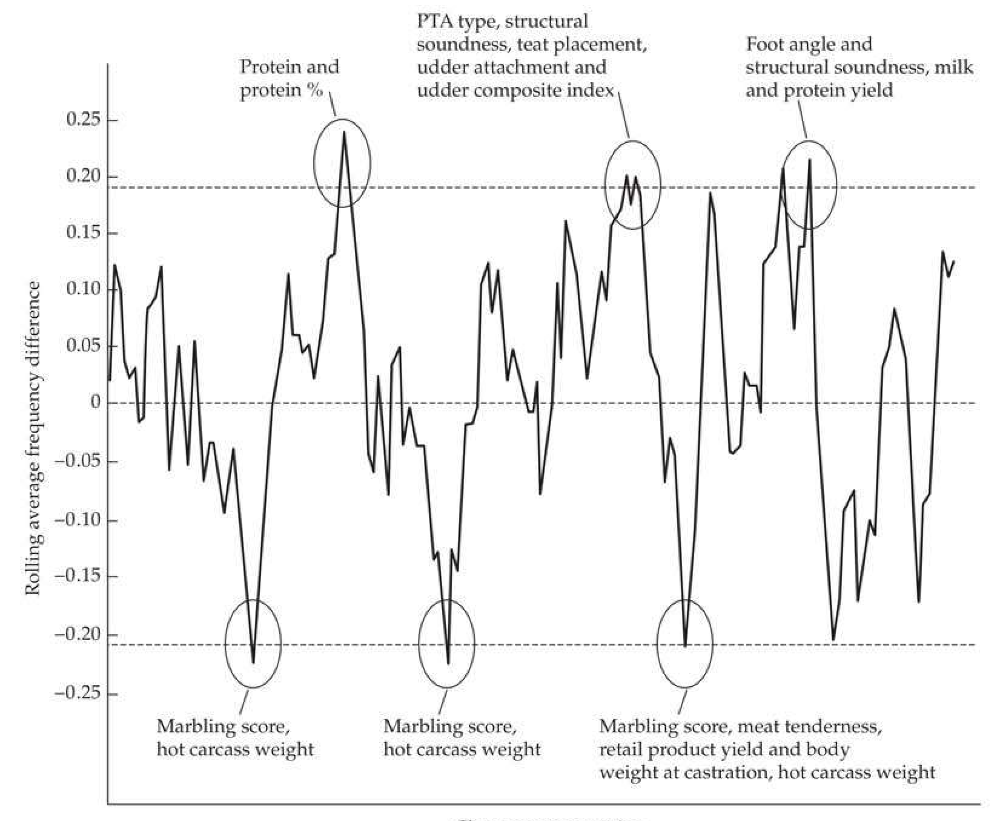
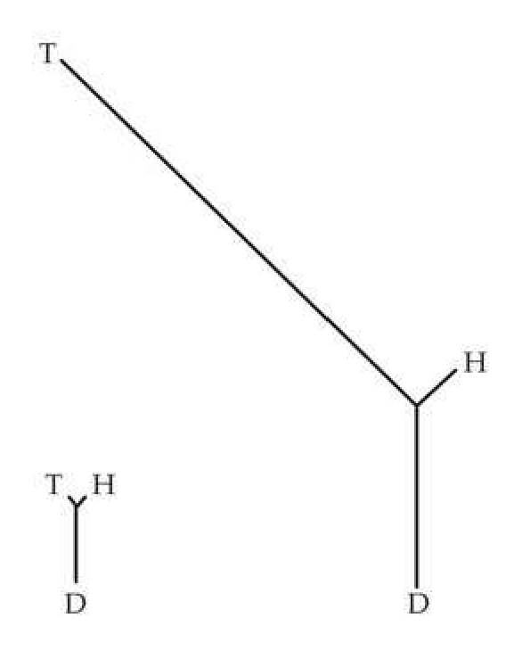
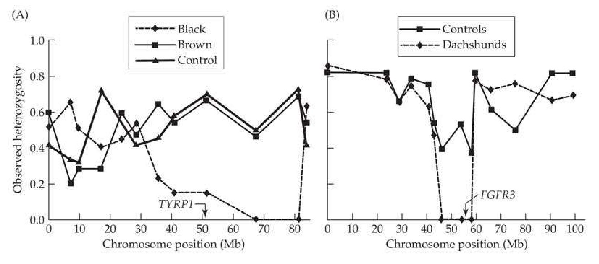
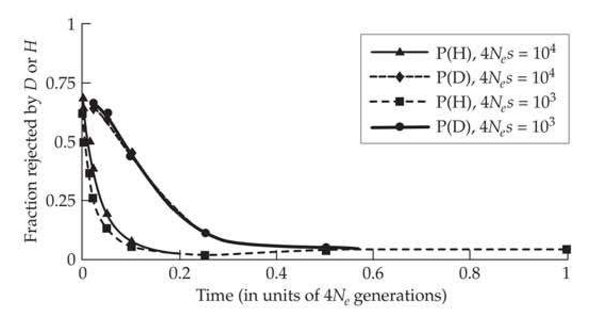
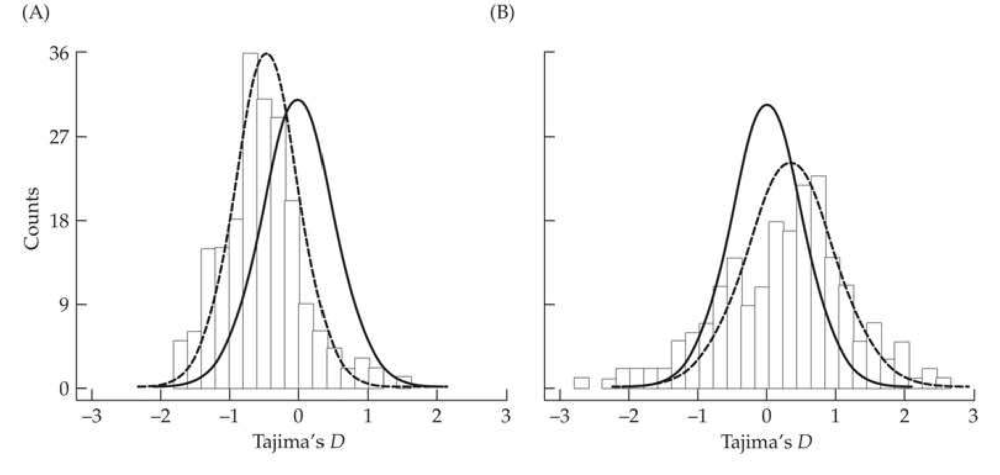
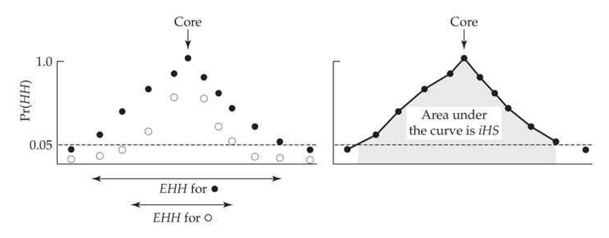
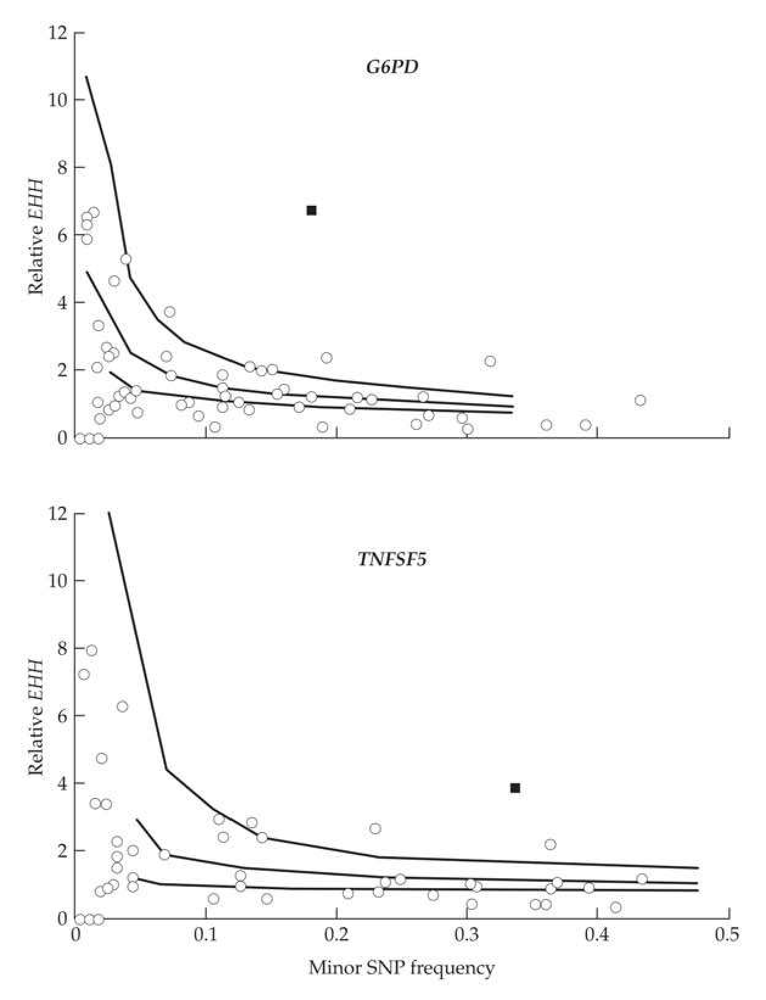
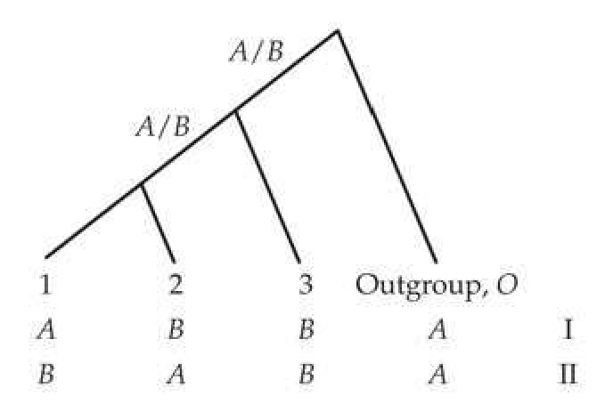

# Chapter 9 · Using Molecular Data to Detect Selection: Signatures from Recent Single Events

## chapter9_001 · Using Molecular Data to Detect Selection: Signatures from Recent Single Events: Introduction

For the past 20 years, there has been a tendency on the part of journal editors and reviewers to assume that every case of alleged statistical evidence for positive selection is worthy of publication, even in the absence of a plausible biological mechanism underlying the alleged selection. Hughes (2007)

While the ubiquity of purifying (or negative) selection (the removal of deleterious alleles, i.e., background selection) at the molecular level is well established, the frequency of positive (or adaptive or Darwinian) selection remains unclear. Because of this, the development of methods to detect the latter is a major growth industry in evolutionary genetics. There is a massive population-genetics literature on this subject, and a partial (but not exhaustive) list of reviews includes Kreitman (2000), Nielsen (2001), Ford (2002), Bamshad and Wooding (2003), Schlötterer (2003), Guinand et al. (2004), Nielsen (2005), Storz (2005), Wright and Gaut (2005), Biswas and Akey (2006), Sabeti et al. (2006), Thornton et al. (2007), Holderegger et al. (2008), Pavlidis et al. (2008), Stinchcombe and Hoekstra (2008), Akey (2009), Nei et al. (2010), Oleksyk et al. (2010), Siol et al. (2010), Stephan (2010a), Crisci et al. (2012), Fu and Akey (2013), Vitti et al. (2013), Bank et al. (2014), Forester et al. (2016), Malaspinas (2016), Stephan (2016), Vatsiou et al. (2016), and Xiang-Yu et al. (2016). As detailed in Chapter 8, a single recent event of positive selection can leave a transient signal in the pattern of linked neutral variation. The detection of such events is the subject of this chapter. Most approaches for detecting recent or ongoing selection use the segregating variation in a sample from a contemporaneous population, and we loosely refer to these as polymorphism-based tests. Because such signals are transient, these methods work only over ecological time scales, detecting events that are either ongoing or that concluded less than $ \sim N_{e} $ generations ago. In contrast, a history of positive selection on a gene over evolutionary time can leave a cumulative signal in the pattern of substitutions. Divergence-based tests to detect these patterns, which require data on substitutions between species (or very distantly related populations), are developed in Chapter 10 (which also covers tests that jointly use polymorphism and divergence data). These different approaches are complementary, as an adaptive substitution could leave a strong (but fleeting) signature over an ecological time scale but essentially no signal in that gene over an evolutionary time scale (adding just one more substitution in a potential background of numerous neutral fixations). Likewise, the vast majority of adaptive events that have shaped a gene likely occurred in its distant past, leaving no currently detectable polymorphism pattern and only potential signals in divergence data (Chapter 10). Because the search for sites under selection can be seductive, it is important to stress that the methods developed in this chapter have limitations. They potentially can be useful in detecting some events involving a single selective event at a single site, allowing for the prospect of studying individual (as opposed to cumulative) selective events. As discussed in Chapter 8, one source of these limitations is the nature of the signal left by the sweep itself. First, it is very fleeting, typically persisting for only $ 0.1N_{e} $ to $ N_{e} $ generations, depending on the feature being examined (Table 8.2). Second, only a fraction of such events, even if ongoing or very recent, can be detected. A weak, but nontrivial, selection event may be too small to leave a meaningful signal against a noisy molecular background. Finally, even very strongly selected sites may not be detectable, especially if they involve soft or polygenic sweeps (Chapter 8). Even with all these concerns, the most critical problem with polymorphism based tests is the confounding effect from demography and population structure. For example, rapid expansion following a population bottleneck leaves a sweep-like signal over the entire genome, while the presence of population subdivision can mimic balancing selection. One reason for the vast number of tests discussed below is that no single one is best in all settings, and the search to find strong signals unique to positive selection has, for the most part, been unsuccessful.

Besides being fundamentally important to our understanding of evolution, tests of selection can also be helpful to a breeder. Scans for ongoing and recently selected sites can provide a useful complement to QTL- and association-mapping studies. In these latter approaches, one specifies the traits of interest and then searches for marker-trait associations (LW Chapters 13 through 16). While this is a powerful approach, it is limited by having to specify the traits of interest. In a population undergoing selection for (say) water stress, one might miss pathways for adaptation that are not obvious and hence do not involve the traits chosen to be mapped. Conversely, one could perform a genomic scan on a population under relatively recent water stress to look for sites showing signatures of ongoing or recent selection. These, in turn, could suggest genome regions harboring genes for traits or pathways under selection, without having to specify particular traits. This approach has been termed natural selection mapping (Kohn et al. 2000), hitchhiking mapping (Schlötterer 2003), and reverse ecology (Li et al. 2008), and is widely used in the search for domestication genes responsible for the transition from wild relatives into domesticated lines. We review the results of several such scans at the conclusion of the chapter.

Finally, it is important to stress that our focus over these next two chapters is on using marker information independent of any specific traits. As mentioned in Chapter 8, polygenic response is likely to leave little, if any, detectable signal at single sites. However, a composite signal may be generated over a collection of such sites (i.e., a collection of unlinked, or loosely-linked, loci underlying the trait). Such trait-augmented marker approaches—wherein a set of markers is chosen because they impact a specific trait, with tests based on summary statistics over this ensemble of markers—are covered in Chapter 12.

---

## chapter9_002 · Using Molecular Data to Detect Selection: Signatures from Recent Single Events: Introduction / AN OVERVIEW OF STRATEGIES BASED ON SEGREGATING VARIATION

For a multitude of reasons, there is no single omnibus test for selection. First, different scenarios (e.g., hard sweeps, soft sweeps, partial sweeps, balancing selection) leave different, and often conflicting, signatures (Chapter 8), so that tests for one type (e.g., hard sweeps) may easily miss signatures from another (e.g., soft sweeps). Second, different tests are designed to detect signals from different time periods during (and following) a sweep. Third, different sampling schemes are possible. Many tests assume there is only a single sample from a current population, but one might instead have contemporaneous samples from several related populations or a temporal series of samples from a single population.

Advances in genomics have enormously expanded our ability to score molecular variation, and this is reflected in the historical development of tests. The first test followed changes in a single allele at one locus through time (Examples 9.1 and 9.2), while later tests evolved to use data from genomic scans, where a very large number of sites are scored, and potentially phased (generating haplotype, as opposed to sequence, data). Haasl and Payseur (2016) suggested the terms GWSS (genomewide scans for natural selection) when a whole genome is scanned, and ESS (exomic scans for natural selection) when only coding or transcriptome sequences are used. Approaches to detect recent selection can be classified into five categories, which loosely follow the historical development of the field: 1) Excessive allele-frequency change. The first formal test of selection was proposed by Fisher and Ford (1947), who used the machinery developed in Chapter 2 for the divergence under drift to test for excessive change in a time-series of allele frequencies from a single population. While perhaps the most unambiguous signature of selection, this approach requires long-term monitoring of a population and having some rea sonably independent estimate of $ N_{e} $. The ever-increasing availability of ancient DNA (aDNA) samples opens up exciting new data sets for this type of analysis (Mathieson et al. 2015, Malaspinas 2016; Schraiber et al. 2016).

2) Excessive allele-frequency divergence. Lewontin and Krakauer (1973) proposed using the divergence between a series of contemporaneously sampled populations (presumably from a common ancestor) to test for selection. The machinery from Chapter 2 predicts the expected divergence under drift, as measured by Wright's $ F_{ST} $ statistic for population structure. Loci displaying excessive $ F_{ST} $ values relative to drift are selection candidates. Using an incorrect model of population structure can seriously compromise these tests.

The above two categories require samples from multiple populations (either temporally or spatially), which limits their widespread use. A less demanding design is a single population sample, as employed by the three remaining categories.

**[命题 Proposition]**

3) Chromosomal spatial patterns of variation. As detailed in Chapter 8, a sweep leaves a characteristic decrease in polymorphism around a selected site, and a number of formal likelihood tests are based on the expected pattern of the nucleotide diversity, $ \pi $, as a function of the recombination distance, c, from the sweep (Equation 8.8a). Early versions of these tests assumed that the population was in mutation-drift equilibrium at the start of the sweep, while more recent versions have relaxed this strong assumption.

The final two categories divide tests by whether they assume an infinite-sites, or an infinite-alleles, framework, using the neutral equilibrium results for these models developed in Chapter 2. Recall that the infinite-sites framework considers a sequence as a series of separate sites (e.g., SNPs), while the infinite-alleles framework treats each different DNA sequence (haplotype) as a different allele (Figure 2.9). Both models assume that the region being considered is small enough that recombination within the sample can be ignored. Given the large (and diverse) number of tests in both of these categories, each section reviewing these different approaches concludes with a summary table of proposed tests (Table 9.1 for infinite-sites and Table 9.3 for haplotypes).

4) Changes in the site-frequency spectrum. Under the infinite-sites model, the frequency spectrum of neutral sites at mutation-drift equilibrium is given by the Watterson distribution (Equation 2.34). Starting with Tajima (1989), a number of tests have been proposed that search for shifts in this spectrum following a sweep, such as an excessive number of sites with rare alleles or with high-frequency derived alleles. The major complication with this class of tests is that changes in population demography (such as a recent expansion or contraction) or the presence of population structure (migration between partly isolated populations) can mimic signatures of selection.

5) Tests based on haplotype information. Under the infinite-alleles model, the number of alleles (haplotypes) in a sample at mutation-drift equilibrium is given by the Ewens sampling formula (Equation 2.30a) and their allele-frequency spectrum by Equation 2.33b. Starting with Ewens (1972) and Watterson (1977, 1978), a number of tests have used these expressions to detect departures from the neutral equilibrium model. As with tests based on the site-frequency spectrum, significant departures can occur for neutral alleles if the population is not in equilibrium or if population structure is present.

Two other strategies use haplotype information. The first searches for the distinct signatures in the pattern of pairwise linkage disequilibrium (LD) predicted around a hard or a soft sweep (Table 8.2). The second considers the frequency of a neutral allele as a function of its age (Equation 2.12). Under neutrality, a common allele is an old allele, with shorter blocks of LD, reflecting a longer history of recombination. The presence of high-frequency alleles with long haplotypes (large blocks of LD) offers a signature of selection (these are often called LRH, for long-range haplotype, tests). A key point is that haplotype structure provides signals that can be missed by site-frequency and hard-sweep tests, and thus offers more power in some settings.

---

## chapter9_003 · AN OVERVIEW OF STRATEGIES BASED ON SEGREGATING VARIATION / Attempts to Account for Departures From the Equilibrium Model

Most tests for selection are based on the null hypothesis of the neutral equilibrium (or standard neutral) model (Chapter 2). While rejection of this null can indeed imply a signature of selection, rejection can also occur if a neutral population is not in mutation-drift equilibrium. Cavalli-Sforza (1966) noted that demography and population structure should leave a common signal over all genes within a genome, and this observation has been used in attempts to correct for any genome-wide nonequilibrium features in the data. The simplest approach is the outlier method, whereby values of the test statistic are computed for a large number of genes, with outliers suggesting potential targets of selection. This is an enrichment method, not a formal test. The second approach is to use data from presumably neutral markers unlinked to a region of interest to infer the population history (e.g., bottlenecks, expansions, population structure). These histories can then be used to simulate the coalescent structure (Chapter 2) for neutral alleles under this nonequilibrium model, which in turn can be used to generate the distribution of the test statistic under this more appropriate null. A final approach is to use presumably neutral sites to generate an empirical site-frequency spectrum to use in place of the equilibrium Watterson distribution.

**[命题 Proposition]**

These approaches are based on information from a large number of loci obtained in a genomic scan, with the assumption that most sites are not under positive selection and hence provide information to better shape the null hypothesis. This critically relies on the validity of Cavalli-Sforza's assumption of a common demographic or population structure signal over all loci, upon which any additional signal from selection is placed. Unfortunately, this need not be the case, especially in a population that is expanding over space. Allelic surfing can occur, wherein random alleles (and new mutations) on the leading edge of a wave of population expansion can "surf" (this wave) rather quickly to high frequencies in newly founded parts of the population (Edmonds et al. 2004; Klopfstein et al. 2006; Hallatschek et al. 2007; Travis et al. 2007; Excoffier and Ray 2008; Hallatschek and Nelson 2008, 2009; Excoffier et al. 2009a; Hallatschek 2011). Because neutral alleles on the leading wave of expansion are largely random, surfing does not affect all genomic locations equally, and as a result can mimic signatures of selection even after correcting for demography or structure based on others markers within the sample. This is especially troublesome as the model species most surveyed for recent selection—humans, cosmopolitan human commensal Drosophila (melanogaster and simulans), and Arabidopsis—all have undergone massive range expansions. Hofer et al. (2009) found that while a large fraction of the human single-nucleotide polymorphisms (SNPs), short tandem repeats (STRs), and indels show large (greater than 0.3) differences in frequency across world populations, this pattern is easily accounted by allelic surfing, suggesting that this phenomenon can be a considerable problem in the search for sites under recent selection in humans.

---

## chapter9_004 · AN OVERVIEW OF STRATEGIES BASED ON SEGREGATING VARIATION / SNP Ascertainment Bias

Another (increasingly historical) concern is SNP ascertainment bias, which arises when molecular variation is scored using prechosen SNPs. In a typical SNP discovery setting, one sequences a relative small pool of individuals (the SNP discovery panel) to "discover" SNPs —polymorphic nucleotides whose minor allele is above some critical frequency in the panel. These are then used to score a much larger sample of individuals, thus creating a severe bias in favor of SNPs at intermediate frequencies and against rare SNPs. Likewise, if the SNP discovery panel is from a different population than the screened sample, this also creates bias in that important SNPs in the population of interest can be missed (e.g., Ptak and Przeworski 2002). When the frequencies of SNP minor alleles in the discovery panel are known, corrections for ascertainment can be straightforward (Nielsen et al. 2004). However, SNP discovery is often a more complex process, creating biases that simple methods can reduce, but not remove (Clark et al. 2005). With the ever-increasing availability of whole-genome sequencing, this is rapidly becoming an issue of diminishing concern.

---

## chapter9_005 · AN OVERVIEW OF STRATEGIES BASED ON SEGREGATING VARIATION / SNP Polarity Assignment Errors

**[命题 Proposition]**

A final source of bias can appear in tests requiring the polarity status (i.e., ancestral or derived) of a SNP allele. Recall from Chapter 2 the distinction between unfolded and folded frequency spectra. The former is based on the frequency of derived alleles (i.e., the Watterson distribution), whereas the latter is based on the frequency of the minor allele and thus is immune to polarity assignment errors. Typically, polarity is accessed using an outgroup, with the outgroup allele assumed to be the ancestral stage. This is a parsimony assumption, which requires that no back or parallel mutations occur, and that the site is monomorphic in the outgroup. Incorrect polarity assignments can result in mislabeling a low-frequency derived allele as a high-frequency ancestral one, and even a few such errors can significantly impact certain tests (Baudry and Depaulis 2003; Hernandez et al. 2007).

---

## chapter9_006 · AN OVERVIEW OF STRATEGIES BASED ON SEGREGATING VARIATION / Background Selection as the More Appropriate Null?

Recently, it has suggested that strict neutrality may not be the correct null hypothesis. Cutter and Payseur (2013) and Corbett-Detig et al. (2015) have both stressed that background selection (BGS) is a more appropriate null, given how widespread BGS appears to be (Chapter 8). If BGS is taken as the null, them test comparisons must accommodate differences in gene density per recombination unit, as the impact for BGS is expected to scale with this ratio (Chapter 8). If one is attempting to correct for nonequilibrium features by using a set of putatively neutral markers in a comparison with a possible region under selection, care must be taken to ensure that these markers are from regions with a similar gene-density to recombination value as the region of interest.

---

## chapter9_007 · AN OVERVIEW OF STRATEGIES BASED ON SEGREGATING VARIATION / Structure of the Remainder of This Chapter

The rest of the chapter is structured into treatments based on our five categories of tests. These categories were largely constructed for convenience of presentation, and some tests draw upon ideas from several different approaches. Given the amount of information in this chapter, we have tried to make the discussion of each category largely autonomous of the others, thus allowing readers to skip directly to the section most appropriate for their needs. We conclude with a brief review of scans for recent positive selection in humans and domesticated organisms.

---

## chapter9_008 · Using Molecular Data to Detect Selection: Signatures from Recent Single Events: Introduction / ALLELE-FREQUENCY CHANGE IN A SINGLE POPULATION

There are several settings where tests based on allele-frequency change may be appropriate. One is a population monitored over some reasonable period of time, which was the basis for the first formal test by Fisher and Ford (1947), of whether a specific gene is under selection (Examples 9.1 and 9.2). The second is a population under artificial selection, which has also been proposed as an approach for QTL mapping for a trait of interest (Nuzhdin and Pasyukova 1991; Keightley and Bulfield 1993; Nuzhdin et al. 1993; Ollivier et al. 1997). Most recent are studies where candidate allele frequencies are estimated from a small sample of ancient DNA and then compared with their frequencies in a more contemporary sample (e.g., Schraiber et al. 2016).

While excessive allele-frequency change is perhaps the most unambiguous signal of selection, there are power issues when the number of generations separating the first and last samples is modest (De Kovel 2006). Given that the time scale for significant allele-frequency change under selection is $ \sim1/s $ (Equation 5.3c), sampling based on a modest number of generations requires strong selection for a signal. In particular, to detect a significant change even in the absence of drift requires that the sample size, n, and number of generations, t, satisfy $ tn \gg 1/s $.

---

## chapter9_009 · ALLELE-FREQUENCY CHANGE IN A SINGLE POPULATION / Allele-frequency Change Over Two Sample Points: The Waples Adjusted Test

Chapter 4 considered the estimation of $ N_{e} $ from allele-frequency change, a setting where one typically averages over a number of loci to reduce the evolutionary sampling variance. Here our task is the complementary problem. Given some estimate of $ N_{e} $, is the observed change in allele frequency at a candidate locus excessive? If so, this presumably reflects directional selection acting at, or close to, this region. In theory, one could also test for too little divergence (reflecting balancing selection), although this is rarely done, given the high sampling variance (and hence low power), unless sample sizes are extremely large.

**[示例 Example]**

> **Example 9.1** · ref: `9.1` · source: `chapter9_009.json` · blocks 1–6
>
> Example 9.1. One of the classic papers in evolutionary biology is Fisher and Ford's (1947) study of the medionigra gene in the scarlet tiger moth Panaxia dominula, a colorful day-flying species with one generation per year. A single diallelic locus has a major effect on the forewing pattern. Individuals that are homozygous for the dominula allele have multiple forewing spots, while individuals that are homozygous for the medionigra allele have a darkly suffused forewing with, typically, two small spots (the bimacula phenotype). Heterozygotes show an intermediate pattern, which is called the medionigra phenotype. In 1938, Ford began studying a small colony of this species in Cothill Fen, just southwest of Oxford, England. Starting in 1941, capture-recapture data were used to estimate the census population size, with the smallest estimated size between 1941 and 1947 being 1000. In 1939 (t = 0) the frequency of the medionigra allele was estimated (from a sample size of $ n_0 = 223 $ as $ \widehat{p}_0 = 0.092 $, while by 1947 (t = 8), its sample frequency had decreased to $ \widehat{p}_8 = 0.037 $ ( $ n_8 = 1341 $). Taking $ N_e = 1000 $ (this being the smallest estimated census value over any of the generations, and hence most favorable to supporting drift), do these data show evidence of a departure from drift? For simplicity, assume sampling without replacement, so that $ \sigma\left(\widehat{p}_{0},\widehat{p}_{t}\right)=0 $, with the variances are given by Equations 9.2a and 9.2b. The resulting covariance matrix, V, becomes $$ \frac{\mathbf{V}}{p_{0}(1-p_{0})}=\begin{pmatrix}{{{\frac{1}{2\cdot223}}}}&{{{0}}} \\{{{0}}}&{{{\frac{1}{2\cdot1341}+\frac{8}{2000}\left[1-\frac{1}{2\cdot1341}\right]}}}\end{pmatrix}=\begin{pmatrix}{{{0.0022}}}&{{{0}}} \\{{{0}}}&{{{0.0044}}}\end{pmatrix} $$ Because $ V^{-1} $ appears in both the numerator and the denominator of Equation 9.4, the unknown constant, $ p_{0}(1 - p_{0}) $, cancels out, allowing us to simply use the above right-hand matrix for $ V $, yielding $$ GLS\left(p_{0}\right)=\frac{\mathbf{1}^{T}\mathbf{V}^{-1}\mathbf{p}}{\mathbf{1}^{T}\mathbf{V}^{-1}\mathbf{1}}=\frac{49.496}{674.762}=0.0734 $$ Equation 9.2c yields the sampling variance for the difference in allele frequencies as $$ \begin{aligned}\sigma^{2}\left(\widehat{\delta}_{t}\right)&\simeq p_{0}(1-p_{0})\left[\frac{1}{2n_{0}}+\frac{1}{2n_{t}}+\frac{t}{2N_{e}}\left(1-\frac{1}{2n_{t}}\right)\right]\\ &=0.0734\cdot0.9266\left[\frac{1}{446}+\frac{1}{2682}+\frac{8}{2000}\left(1-\frac{1}{2682}\right)\right]=0.0004495\end{aligned} $$ The resulting Waples test statistic for fit to pure drift becomes $$ \frac{(0.037-0.092)^{2}}{0.0004495}=6.729 $$ The probability that a $\chi_{1}^{2}$ random variable is this big or larger is 0.0095, implying strong rejection of neutrality. By using different values of $N_{e}$ in the above calculation, we can find the largest effective population size that would still allow drift to account for these data. For $N_{e}=500$, the test statistic becomes 4.19 (a $p$ value of 0.040), while for $N_{e}=250$, the statistic is 2.39 (a $p$ value of 0.12). Hence, any effective population size slightly smaller than 500 would be compatible with a hypothesis of the observed allele-frequency change being driven by drift. Except for a gap between 1979 and 1987, the Cothill Fen population has been surveyed yearly since 1939; see Jones (1989) and Cook and Jones (1996) for reviews (Jones provides a handy table of all data through 1988). O'Hara (2005) used a hierarchical Bayesian analysis to examine a 60-year time series of these data. He assigned genotypes fitness drawn from a lognormal prior, allowing them to vary yearly. While selection was found to significantly contribute to the change in allele frequency, most of the variance was attributable to drift. Cook and Jones (1996) and Mathieson and McVean (2013) estimated a selection coefficient against the medionigra allele of around 10% (assuming additivity in fitness), while Mathieson and McVean noted that a recessive model of selection provided a better fit, but required much stronger selection (essentially a lethal). A more recent analysis by Foll et al. (2015) found that both the weakly selected codominant and strongly selective recessive models are supported when $ N_{e} $ is fixed at 500. However, when $ N_{e} $ is jointly estimated from the data, there is stronger support for the lethal recessive model. While this is one of the best temporal data sets available, and selection appears to be strongly acting on a single gene, all of this uncertainty highlights the difficulty of dealing with natural populations.

While one might think that tests based solely on allele-frequency change are among the most convincing, this is not the case. As Example 9.1 shows, rejection of the neutral model can easily result from an overestimation of the true effective population size. Fisher and Ford took their results as evidence against Sewall Wright's notion of the importance of genetic drift. In his reply, Wright (1948a) noted that values of $ N_e $ simply based on census numbers can easily be contested by the widespread observation that the effective population size is generally (and often dramatically) lower than the observed number of individuals in the population (Chapter 3). In addition, tests of allele-frequency change suffer from low power. If selection is modest relative to $ 1/N_e $ or 1/n (with n being the sample size), the sample variance can obscure any selection signal. Waples (1989b) examined some of these design issues.

Although we have presented this test for a single locus with just two alleles, its extension to multiple alleles is straightforward (e.g., Waples 1989b; Goldringer and Bataillon 2004). A more subtle issue is the fit of a $ \chi^{2} $ distribution to the test statistic given by Equation 9.2d, which can be poor when alleles are rare, the number of alleles is large, or the number of generations is large (Goldringer and Bataillon 2004). While more sophisticated modifications (e.g., Sandoval-Castellanos 2010) can avoid some of these issues, the use of simulations that incorporate as much of the specific biology of the species as is known (e.g., Mueller et al. 1985) to model the change in the neutral alleles under drift is strongly preferred over parametric tests.

---

## chapter9_010 · ALLELE-FREQUENCY CHANGE IN A SINGLE POPULATION / Allele-frequency Change Over a Times Series: The Fisher-Ford Test

The test given by Equation 9.2d assumes we have data from just two time points, but often one has time-series data for a number of generations. In such cases, the strong temptation to simply test the two most extreme values should be avoided, as such nonrandom sampling gives a highly biased result. Rather, specific tests have been developed that jointly consider all of the data. Indeed, the original test of Fisher and Ford involved such a temporal sequence of data. While one can use frequencies directly, Fisher and Ford used the arcsin-square-root transform to both stabilize the variance (making it independent of the initial frequencies) and improve the fit to normality, especially at extreme frequencies (note that the arcsin is measured in radians, rather than degrees). Such variance-stabilizing transformations were discussed in LW Chapter 11.

**[推导 Derivation]**

Let $ y_t $ denote the transformed frequency of the allele in generation $ t $. For a $ t $ that is small relative to $ N_e $, we find (approximately) that

> **Formula (9.5a)** · `9.5a` · source: `chapter9_block_037` · Allele-frequency Change Over a Times Series: The Fisher-Ford Test
>
> $$ y_{t}=2\sin^{-1}\left(\sqrt{p_{t}}\right)\sim N\left(y_{0},t/[2N_{e}]\right) $$

where $ y_0 = 2\sin^{-1}\left(\sqrt{p_0}\right) $ is the transformed value of the initial frequency. Estimates of allele frequencies are made at $ k $ time points, with no requirements about the temporal spacing between samples. Let $ y $ denote the vector of the transformed estimates of the $ k $ sampled allele-frequencies, and let $ 1 $ denote a vector of ones of the same length

> **Formula (9.5b)** · `9.5b` · source: `chapter9_block_037` · Allele-frequency Change Over a Times Series: The Fisher-Ford Test
>
> $$ \mathbf{y}=2\begin{pmatrix}\sin^{-1}\left[\sqrt{p_{1}}\right]\\ \vdots\\ \sin^{-1}\left[\sqrt{p_{k}}\right]\end{pmatrix},\qquad\mathbf{1}=\begin{pmatrix}1\\ \vdots\\ 1\end{pmatrix} $$

**[推导 Derivation]**

Finally, we need the covariance matrix, V, whose elements are independent of the allele frequency (because of the variance-stabilizing transformation; Equation 9.5a). The sample indices denote the sequence of samples, not the actual sampled generation itself (see Example 9.2), with $ t_i $ the generation number associated with the $ i $th sample. The diagonal terms of V are given from Equation 9.2c

> **Formula (9.5c)** · `9.5c` · source: `chapter9_block_038` · Allele-frequency Change Over a Times Series: The Fisher-Ford Test
>
> $$ V_{ii}=\frac{1}{2n_{t_{i}}}+\frac{t_{i}}{2N_{e}}\left(1-\frac{1}{2n_{t_{i}}}\right)\simeq\frac{1}{2n_{t_{i}}}+\frac{t_{i}}{2N_{e}} $$

**[推导 Derivation]**

Now consider the covariance between samples i and j, which correspond to generations $ t_i $ and $ t_j $, respectively (where $ i > j $ and $ t_i > t_j $). The estimates for these two sample points have a shared history (from the base value, $ p_0 $) of drift up through generation $ t_j $, yielding

> **Formula (9.5d)** · `9.5d` · source: `chapter9_block_039` · Allele-frequency Change Over a Times Series: The Fisher-Ford Test
>
> $$ V_{i,j}=V_{j,i}=\frac{t_{j}}{2N_{e}}\quad\mathrm{w h e r e}\quad t_{j}<t_{i} $$

Note that the covariance with the base generation $ (t = 0) $ is always zero (which is why the off-diagonal covariances for V in Example 9.1 were set to zero). The $ k \times k $ matrix, V, contains only those rows and columns corresponding to the k specific generations sampled.

**[推导 Derivation]**

This is now a goodness-of-fit problem for a linear model. Using Equation 9.4, we obtain a generalized least-squares (GLS) estimate of the (transformed) initial frequency

> **Formula (9.6a)** · `9.6a` · source: `chapter9_block_041` · Allele-frequency Change Over a Times Series: The Fisher-Ford Test
>
> $$ \hat{y}_{0}=\frac{\mathbf{1}^{T}\mathbf{V}^{-1}\mathbf{y}}{\mathbf{1}^{T}\mathbf{V}^{-1}\mathbf{1}} $$

**[推导 Derivation]**

Using this value, the vector of deviations is

> **Formula (9.6b)** · `9.6b` · source: `chapter9_block_042` · Allele-frequency Change Over a Times Series: The Fisher-Ford Test
>
> $$ \delta_{\mathbf{y}}=\mathbf{y}-\widehat{y}_{0}\cdot\mathbf{1} $$

and the test statistic, the weighted sum of the squared (transformed) allele-frequency differences,

> **Formula (9.6c)** · `9.6c` · source: `chapter9_block_042` · Allele-frequency Change Over a Times Series: The Fisher-Ford Test
>
> $$ \delta_{\mathbf{y}}^{T}\mathbf{V}^{-1}\delta_{\mathbf{y}} $$

is expected to be approximately $ \chi_{k-1}^{2} $ distributed due to the normality assumption on $ y_{i} $.

**[示例 Example]**

> **Example 9.2** · ref: `9.2` · source: `chapter9_010.json` · blocks 7–12
>
> Example 9.2. We now revisit Fisher and Ford (Example 9.1), and consider a test based on the data from 1939, 1943, and 1947, where
> 
> > **Inline Table 1** · `inline_1` · page 10 · source: `chapter9_010`
> > Inline Table 1
> >
> > Year | t | $ \widehat{p} $ | $ y = 2 \sin^{-1} (\sqrt{p}) $ | n
> > --- | --- | --- | --- | ---
> > 1939 | 0 | 0.092 | 0.616 | 223
> > 1943 | 4 | 0.056 | 0.478 | 269
> > 1947 | 8 | 0.037 | 0.387 | 1341
> 
> 
> Assuming $ N_{e} = 1000 $, the resulting covariance matrix, $ \mathbf{V} $ (on the transformed scale), becomes $$ \begin{aligned}\mathbf{V}&=\begin{pmatrix}{{{V_{0,0}}}}&{{{V_{0,4}}}}&{{{V_{0,8}}}} \\{{{V_{4,0}}}}&{{{V_{4,4}}}}&{{{V_{4,8}}}} \\{{{V_{8,0}}}}&{{{V_{8,4}}}}&{{{V_{8,8}}}}\end{pmatrix}=\frac{1}{2000}\begin{pmatrix}{{{\frac{2000}{2\cdot223}+0}}}&{{{0}}}&{{{0}}} \\{{{0}}}&{{{\frac{2000}{2\cdot269}+4}}}&{{{4}}} \\{{{0}}}&{{{4}}}&{{{\frac{2000}{2\cdot1341}+8}}}\end{pmatrix}\\ &=\frac{1}{2000}\begin{pmatrix}{{{4.484}}}&{{{0}}}&{{{0}}} \\{{{0}}}&{{{7.717}}}&{{{4}}} \\{{{0}}}&{{{4}}}&{{{8.745}}}\end{pmatrix}\end{aligned} $$ In addition, $$ \mathbf{y}=\begin{pmatrix}0.616\\ 0.478\\ 0.387\end{pmatrix},\quad\mathbf{1}=\begin{pmatrix}1\\ 1\\ 1\end{pmatrix},\quad\mathbf{y}\text{ielding}\quad\widehat{y}_{0}=\frac{\mathbf{1}^{T}\mathbf{V}^{-1}\mathbf{y}}{\mathbf{1}^{T}\mathbf{V}^{-1}\mathbf{1}}=\frac{418.851}{774.701}=0.541 $$ Using this estimate for $ y_0 $, the vector of deviations from the initial value becomes $ \delta_y = y - 0.541 \cdot 1 $, returning a test statistic value of $ \delta_y^T \mathbf{V}^{-1} \delta_y = 7.964 $, which when compared to a $ \chi_2^2 $ distribution, returns a significance level of 0.0186. For $ N_e = 500 $, Equation 9.6c returns a value of 5.398, for a significance of 0.067, so the hypothesis that drift alone accounts for the observed pattern of change cannot be rejected under this smaller value of $ N_e $.

A number of generalizations, as well as increasingly sophisticated tests building on the basic elements of the Fisher-Ford framework, have been proposed, including extending this methodology to handle data from high-throughput sequencing. A partial list includes Templeton (1974), Schaffer et al. (1977), Gibson et al. (1979), Wilson (1980), Watterson (1982), Waples (1989b), De Koeyer et al. (2001), Goldringer and Bataillon (2004), Bollback et al. (2008), Wisser et al. (2008), Sandoval-Castellanos (2010), Malaspinas et al. (2012), da Fonseca et al. (2013), Mathieson and McVean (2013), Feder et al. (2014), Lacerda and Seoighe (2014), Steinrücken et al. (2014), Foll et al. (2015), Terhorst et al. (2015), Topa et al. (2015), Gompert (2016), and Schraiber et al. (2016).

In addition to its use in studying natural populations, this machinery can be applied to artificial selection experiments to detect regions of interest. In the pre-genomics era, this approach was pioneered by Stuber and Moll (1972) and Stuber et al. (1980), who looked for shifts in the frequencies of isozyme markers in lines of maize selected for yield. Other examples for maize include Labate et al. (1999) and Coque and Gallais (2006) for yield selection, and Wisser et al. (2008) for disease resistance, while De Koeyer et al. (2001) examined yield in oats. In the genomics era, extensions of this machinery have been used in microorganisms, such as the analysis by Foll et al. (2014) on the target (or targets) of selection for influenza A virus exposed to the drug oseltamivir, as well as with data from evolve and resequence experiments (E&R), such as those on Drosophila (Terhorst et al. 2015; Topa et al. 2015).

---

## chapter9_011 · ALLELE-FREQUENCY CHANGE IN A SINGLE POPULATION / Schaffer's Linear Trend Test

**[推导 Derivation]**

A variation of the Fisher-Ford test was suggested by Schaffer et al. (1977), who noted that power might be improved by going beyond a simple lack of fit test against the model $ y_{t} = \mu + e $ (where $ \mu $ is the transformed initial allele frequency), by asking if a significant linear trend is present. The model now becomes

> **Formula (9.7a)** · `9.7a` · source: `chapter9_block_048` · Schaffer's Linear Trend Test
>
> $$ y_{t}=\mu+\beta t+e $$

where a trend is indicated if $ \beta $ is significantly different from zero (the Fisher-Ford test assumes $ \beta = 0 $). Such a linear trend is not expected under drift but would be expected under directional selection, assuming that the direction of selection is not changing (migration from a population with a different allele frequency could also generate a linear trend). In general-linear-model form (LW Chapter 8), Equation 9.7a becomes $ y = X\beta + e $, where

> **Formula (9.7b)** · `9.7b` · source: `chapter9_block_048` · Schaffer's Linear Trend Test
>
> $$ \mathbf{X}=\begin{pmatrix}1&t_{1}\\\vdots&\vdots\\1&t_{k}\end{pmatrix},\quad\boldsymbol{\beta}=\begin{pmatrix}\mu\\\boldsymbol{\beta}\end{pmatrix},\qquad\widehat{\boldsymbol{\beta}}=(\mathbf{X}^{T}\mathbf{V}^{-1}\mathbf{X})^{-1}\mathbf{X}^{T}\mathbf{V}^{-1}\mathbf{y} $$

where the elements of V are given by Equations 9.5c and 9.5d. For the data in Example 9.2, the resulting X matrix and the GLS estimate, $ \widehat{\beta} $, of the vector of parameters becomes $$ \mathbf{X}=\begin{pmatrix}{{{1}}}&{{{0}}} \\{{{1}}}&{{{4}}} \\{{{1}}}&{{{8}}}\end{pmatrix},\qquad\widehat{\boldsymbol{\beta}}=\begin{pmatrix}{{{0.609}}} \\{{{-0.028}}}\end{pmatrix} $$

Applying LW Equation 8.35, the standard error on the slope is found to be 0.0086, showing that it is highly significant. Stuber et al. (1980) used this approach to infer selection at sites linked to several allozyme markers in a series of selected maize lines. One advantage of the linear-trend test is that it does not require highly accurate estimates of $ N_{e} $.

---

## chapter9_012 · ALLELE-FREQUENCY CHANGE IN A SINGLE POPULATION / Scans and Simulation-based Approaches

As presented, these tests for shifts in allele frequencies are performed one marker at a time, as they herald from the days of testing just one or a few unlinked candidate genes. With a few unlinked markers, Bonferroni corrections (or the slightly more powerful sequential methods; Appendix 4) can be applied to assign overall significance levels. Likewise, FDR approaches can use used to assign false-discovery rates among the set of markers declared to be significant (the fraction of tests declared to be significant that are actually from the null; Appendix 4). However, in the genomic-scan era, with the potential for thousands of linked markers on each chromosome, tests are no longer independent, thus compromising FDR approaches (Chen and Storey 2006). Even if tests are largely independent, their vast number makes Bonferroni-type corrections untenable for a test to have any power (Appendix 4). How then can these tests be extended to the dense marker maps used in genomic scans?

For starters, analyzing markers one at a time is rather inefficient, in that one potentially loses shared information from linked markers. A better approach is to compute the average allele-frequency change within a small sliding window. Starting with the initial allele frequencies within a given window and either their known or assumed recombination rates, simulations under pure drift (and recombination) can generate a null distribution of average change as a comparison point for the actual observed divergence (e.g., Example 9.3; Johansson et al. 2010). Other, less formal approaches can also be used to simply indicate regions of interest (as opposed to regions that are formally statistically supported); see Figure 9.1.

---

## chapter9_013 · ALLELE-FREQUENCY CHANGE IN A SINGLE POPULATION / Birthdate Selection Mapping (BDSM)

**[Figure]**

> **Figure 9.1** · page 12 · source: `chapter9`
>
> 
>
> Figure 9.1 A scan of Bos taurus chromosome 19, contrasting differences in SNP allele frequencies between specialized dairy (Holstein) and meat (Angus) breeds. Positive values indicate alleles at higher frequencies in Holstein cattle (dairy-specific), and negative values indicate alleles that are more common in Angus cattle (meat-specific). Differences were based on a sliding window of five adjacent markers, using a set of 175 SNPs. The horizontal axis represents chromosomal position, and the vertical axis is the average between-breed difference in SNP allele frequencies over the five-SNP window. The upper and lower dashed lines indicate the 5% threshold levels as assessed via a permutation test (see the text for details). As annotated in the figure, the authors were able to associate these exceptional peaks and valleys with known QTLs for dairy and beef traits. Because QTL intervals tend to be rather vague (averaging around 20 megabases, or roughly 20 cM, for these traits), the significance of these associations with known QTLs, while suggestive, is unclear. (After Prasad et al. 2008.)

A very interesting genomic-scanning approach for sites under selection becomes possible when one has extensive pedigree data, such as for cattle (Decker et al. 2012). With extensive pedigrees, one has information on the date of birth (DOB) of most individuals, whose value can be expressed as years since the start of the pedigree. Individuals with a later date of birth (i.e., more recent in the pedigree) have likely experienced more selection than earlier-born individuals (those deeper down in the pedigree). As such, one expects to find a positive relationship between a marker linked to a selected site and DOB. For example, if allele A was initially rare but favored, AA individuals are expected to be more common in animals with higher (i.e., more recent) DOB values. Decker et al. turned this relationship around, realizing that by treating DOB values as a quantitative trait, one could use association mapping (LW Chapter 16), with sites showing an association with DOB (i.e., those that are under- or over-represented later in the pedigree) being candidates for selection. This approach is called birthdate selection mapping (or BDSM), and because association mapping is done in a mixed-model framework (Chapter 19), it accounts for biases introduced by family structure. The authors applied this approach to U. S. Angus cattle born over a 50-year period (roughly 10 generations). A standard random-effects mixed model of association mapping detected 11 loci significantly associated with DOB, while a Bayesian model found that $ \sim $2% of the SNPs were strongly associated with DOB. The former model assumes an infinitesimal structure, while the latter allows for genes of larger effect that are embedded in a sea of smaller-effect genes. While BDSM requires large, deep pedigrees, it is an intriguing and potentially powerful approach.

---

## chapter9_014 · Using Molecular Data to Detect Selection: Signatures from Recent Single Events: Introduction / DIVERGENCE BETWEEN POPULATIONS: TWO-POPULATION COMPARISONS

**[推导 Derivation]**

While most of the analysis of divergence data in structured populations is based on $ F_{ST} $ statistics (Chapter 2), we start with a few comments on the simple situation in which one is comparing a biallelic locus between two populations. As in the case of the divergence of a single population measured at starting and ending time points, divergence can be measured as the squared allele-frequency difference,

> **Formula (9.8)** · `9.8` · source: `chapter9_block_053` · DIVERGENCE BETWEEN POPULATIONS: TWO-POPULATION COMPARISONS
>
> $$ \widehat{\delta}_{t}=(\widehat{p}_{t,1}-\widehat{p}_{t,2})^{2} $$

namely, the squared difference between the frequency in the two populations at some sample time, $t$, following their isolation from a common ancestor in generation 0. Whether $\widehat{\delta}_{t}$ is too large, or too small, relative to drift can be evaluated using a simple modification of the Waples test, wherein the denominator in Equation 9.2d is replaced by $\sigma^{2}(\widehat{p}_{t,1}) + \sigma^{2}(\widehat{p}_{t,2})$, the sum of the allele-frequency sampling variances for each population (defined as in Equation 9.2b). This expression requires estimates of the divergence time, $t$, as well as the average effective sizes for both populations. More generally, because $E\left[\widehat{p}_{t,i}\right] = p_{0}$, in theory one could sample the two populations at different time points $(t_{1}$ and $t_{2})$, but now using $\sigma^{2}\left(\widehat{p}_{t_{1},1}\right) + \sigma^{2}\left(\widehat{p}_{t_{2},2}\right)$ in the denominator of the test statistic.

A common scenario involves the comparison of two subpopulations, descendent from a shared ancestor, that presumably have experienced different selection pressures. The typical setting is either selection in one population (e.g., adaptation to elevation assessed by comparing a derived highland population to a lowland control) or lines selected in divergent directions (e.g., meat versus dairy cattle). If one has a fairly dense marker map, adjacent markers should be in LD and the joint use of multiple markers can enhance the signal of selection. A standard approach is a genomic scan using a sliding window of markers, contrasting the average frequency differences between populations for the alleles within windows (Figure 9.1). While the window size is arbitrary, it should be no smaller than the average size of an LD block for the populations being compared. As with temporal data, the significance of divergence data can be assessed using simulations (Example 9.3), although other, less formal approaches are often used to highlight regions of interest. One example of the latter is the work of Prasad et al. (2008), presented in Figure 9.1, which depicts a scan for excess SNP-frequency differences in a sliding window analysis over Bos taurus (cattle) chromosome 19. Regions of interest were identified by a permutation test in which breed labels were randomized over SNPs to generate the null. Threshold values indicate the 95% limit for the range of maximal within-window differences in frequencies between the two populations in the randomized data sets. This permutation approach is only approximate, as it ignores LD among linked neutral markers within breeds (a more careful analysis, based on simulations, is detailed in Example 9.3). However, it still serves to indicate sites likely enriched for differentially selected genes.

Finally, a very simple statistic that often appears in comparisons of selected versus control populations is Grossman et al.'s (2010) $ \Delta DAF $ statistic. This metric is a natural out-growth of the type of comparisons shown in Figure 9.1, which focuses on the difference in the derived allele frequency (DAF) between a control and a selected population. For a candidate SNP, let $ \overline{D}_{NS} $ denote the frequency of the derived allele in a nonselected control population (or its average frequency if multiple control populations are used) and its frequency, $ D_{S} $, in the putatively selected population, with $ \Delta DAF = D_{S} - \overline{D}_{NS} $. This statistic ranges between plus one and minus one, and standard outlier approaches are used to highlight SNPs with excessive values.

**[示例 Example]**

> **Example 9.3** · ref: `9.3` · source: `chapter9_014.json` · blocks 2–5
>
> Example 9.3. Hayes et al. (2008) contrasted SNP frequencies between Australian populations of Holstein (dairy) and Angus (beef) cattle, specialized breeds developed by selection from a common ancestral stock. Whole-genome scans of both populations were performed using 7032 sliding windows of ten adjacent SNPs to measure average allele-frequency change between the corresponding windows for both populations (the difference at each SNP, averaged over all ten sites). Simulations were used to assess significance (extreme departures in average allele-frequency in homologous windows between the two populations) relative to the values expected under drift alone. The authors had to model two issues: linkage and breed formation (time in some initial early domesticated population, and then subsequent time in separate bottlenecks representing the formation of the two specialized breeds). The authors simulated roughly 300 SNPs per chromosome (to account for LD in addition to allele-frequency change), while the population structure during breed formation was modeled as follows. The authors simulated 900 generations of drift and mutation in a base population of $ N_e = 1000 $ to generate a common domesticated stock population. Specialized breed formation from this common stock was then simulated by sampling from this stock population to form two subpopulations of size $ N_e = 125 $, each of which was simulated for an additional 100 generations (these values represented the best assumption regarding these parameters during domestication and breed formation). The observed genome-wide $ F_{ST} $ between the Holstein and Angus populations was 0.08, and only simulations whose genome-wide $ F_{ST} $ values matched this value were kept as the null. Taking those windows in the data set that were in the upper 0.1% of excessive divergence (positive or negative) relative to the simulated data resulted in 15 significant regions (windows). Focusing on windows with the uppermost 0.5% of divergence (relative to simulations) yielded 84 candidate regions. To assess what fraction of these extreme windows might be false positives, the authors computed the false-discovery rate (FDR), the fraction of those tests declared to be significant that are likely to be false positives (Appendix 4). FDR provides a measure of how enriched a set of results declared to be significant is for true positives. At a 0.1% level of significance, one expects 7032 · 0.001 = 7.03 tests to be significant by chance alone, while for 0.5%, this increases to 35 false positives among the 7032 tests for each window. The FDRs are 7/15 = 47% for tests of 0.1%, and 35/84 = 42% for tests at the 0.05% significance level. Hence, the expectation is that slightly over half (53% and 58%, respectively) of the windows initially flagged as significant are true positives.

**[示例 Example]**

> **Example 9.4** · ref: `9.4` · source: `chapter9_014.json` · blocks 4–4
>
> Example 9.4. The effectiveness of $ F_{ST} $ to detect selection was examined by Taylor et al. (1995), using a putative target of selection in the tobacco budworm (Heliothis virescens), a noctuid moth and a major cotton pest in the United States. Pyrethroid insecticides have been used in control efforts, and these act on voltage-gated sodium channels in the nervous system. The historical usage patterns of these insecticides, and hence the putative selection pressures on sodium channel genes, differed over the sampled populations examined by the authors. As a result, they predicted that $ F_{ST} $ values at the sodium channel $ H_{py} $ gene should be significantly higher than for background loci, reflecting this differential selection over the sampled subpopulations. Samples of adults from widely spaced locations in the United States revealed an $ F_{ST} $ value of $ 0.041 \pm 0.005 $ at the $ H_{py} $ marker, in contrast to values of $ 0.002 \pm 0.001 $ at 14 other loci, with the latter result indicating fairly weak population structure in this species.

---

## chapter9_015 · DIVERGENCE BETWEEN POPULATIONS: TWO-POPULATION COMPARISONS / DIVERGENCE BETWEEN POPULATIONS: $ F_{ST} $-BASED TESTS

When comparisons involve more than two populations or markers with more than two alleles, a more natural measure of divergence is Wright's $ F_{ST} $ statistic of population structure (Wright 1951). Recall from Chapter 2 that this statistic measures the fraction of total variation over a set of populations that is due to among-population differences in allele frequencies, and is easily extended to multiple alleles and multiple populations. For a biallelic locus, $ F_{ST} = \sigma_B^2(p)/[\overline{p}(1-\overline{p})] $, where $ \sigma_B^2(p) $ is the variance in allele frequency, p, over the populations around its average value, $ \overline{p} $.

There are important caveats when using $ F_{ST} $. First, the analysis of $ F_{ST} $ statistics assumes that back mutations are sufficiently rare to be safely ignored. This is not the case for microsatellite (STR/SSR) markers, which have both high mutation rates and a high chance of convergent mutation (alleles of different origins having the same repeat copy number), and their use requires specific divergence metrics, such as $ R_{ST} $ (Slatkin 1995a; Goodman 1997). Excoffier et al. (2009b) showed that using $ F_{ST} $ in place of $ R_{ST} $ for the analysis of STR data can significantly inflate the false-positive rate. Second, the upper limit of $ F_{ST} $ is set by the expected heterozygosity, meaning that a highly variable locus has a maximal $ F_{ST} $ value smaller than a less variable one (Charlesworth 1998; Hedrick 1999). Jakobsson et al. (2013) and Edge and Rosenberg (2014) provided upper bounds on $ F_{ST} $ given the frequency of the most common allele (averaged over all populations), and found that when this is either small (i.e., very many alleles) or large (close to population-wide fixation), $ F_{ST} $ is restricted to values far below 1.0. Hence, the levels of diversity within a region constrain the possible $ F_{ST} $ values. Various standardization measures of $ F_{ST} $ (and related statistics) have been proposed, and their strengths and weaknesses were reviewed by Meirmans and Hedrick (2011).

Even using these standardizations, $ F_{ST} $-based tests perform poorly when the expected genome-wide divergence due to drift is sufficiently large that many neutral loci are expected to have alternative alleles near fixation between populations. Against such a background, the effect of selection at a candidate region is hard to detect. This situation emphasizes that the tests considered in this chapter apply over ecological time scales, as they assume (for the null) that most neutral markers are segregating in most subpopulations, which puts the time scale for their use at no more than $ \sim N_{e} $ generations.

Ecological geneticists have coined the term landscape genetics for the study of the distribution of genetic variation over spatial structures (Manel et al. 2003; Manel et al. 2010; Manel and Holderegger 2013), and $ F_{ST} $ and allele-environmental correlations (discussed in the next section) are central to this emerging field. As a result, the literature on these classes of tests is rapidly expanding.

---

## chapter9_016 · DIVERGENCE BETWEEN POPULATIONS: TWO-POPULATION COMPARISONS / Outlier Approaches

The underlying premise for most $ F_{ST} $-based tests of selection was the suggestion by Cavalli-Sforza (1966) that all neutral loci should have the same expected value of $ F_{ST} $, reflecting the genome-wide impact of common demographic and population-structure forces. Thus, one can (in theory) use a large number of marker loci to estimate the baseline $ F_{ST} $ value for the set of populations being compared, and then search for outlier loci. This approach is easily modified to look for specific loci being outliers in specific populations (e.g., Akey et al. 2002; Kayser et al. 2003; Akey et al. 2010). Loci with excessively high values indicate more divergence than expected under drift, and the possibility that the marker is linked to a site that is under differential selection over the demes. Likewise, excessively low values indicate less divergence than expected under drift, and hence the potential for a site that is under balancing selection near the marker. While the historical interpretation of $ F_{ST} $ data follows from these last two statements, results from Chapter 8 on sweeps under uniform selection in structured populations suggest that a more nuanced view is needed. Recall from Figure 8.8 that uniform selection over the entire metapopulation can generate excessive divergence (Figure 8.8A) during a hard sweep of a single allele when it is still restricted to a subset of the demes. Similarly, a soft sweep under uniform selection can also generate excessive divergence. Conversely, a completed hard sweep through the sampled demes generates a reduction in divergence relative to background levels of $ F_{ST} $ (Figure 8.8B).

The outlier strategy makes two assumptions: the vast majority of scored loci are neutral, and all neutral sites reflect the same underlying population demography. As discussed in the introduction to this chapter, new alleles arising on the leading wave of a population expansion can “surf” to high frequencies, generating excessive values over the expected background. Likewise, differences in the ratio of gene density to recombination rate in different species are also significant. ferent parts of the genome change the expected pattern of background selection, potentially creating outliers even among neutral markers.

A final complication is that when the population structure departs from the island model (equal divergence is expected between all demes; Chapter 2), the variance in $ F_{ST} $ is inflated, generating an excess of outliers. An interesting example of this phenomenon appears in the work of Fourcade et al. (2013), who found that river fishes showed an unusually high number of outlier loci. While such an observation might be taken as evidence that river species have higher rates of local adaptation, simulations by these authors showed that species with a fractal (highly branching) population structure have a greatly inflated variance in $ F_{ST} $ relative to the island model. This arises because migration on fractal structures (such as rivers or valleys) generates a complex pattern of correlated allele frequencies. Other types of population structures, such as hierarchical island models (Figure 2.11), population expansions from refugia, and allelic surfing, can all inflate the number of outliers (Excoffier et al. 2009a; Bierne et al. 2013).

---

## chapter9_017 · DIVERGENCE BETWEEN POPULATIONS: TWO-POPULATION COMPARISONS / Tests Based on $ F_{ST} $-generated Branch-lengths

**[推导 Derivation]**

When migration and new mutation can be ignored, $ F_{ST} $ provides an estimate of the divergence time, $ T $ (scaled in $ 2N_e $ generations), between two populations. Rearranging Equation 2.43, taking the log of both sides, and recalling that $ \ln(1 - x) \simeq -x $ (for $ |x| \ll 1 $) yields

> **Formula (9.9)** · `9.9` · source: `chapter9_block_065` · Tests Based on $ F_{ST} $-generated Branch-lengths
>
> $$ \ln\left(1-F_{ST}\right)=t\ln\left(1-\frac{1}{2N_{e}}\right)\simeq-t/2N_{e} $$

Hence $ T = -\ln(1 - F_{ST}) \simeq t/2N_e $, and one can recast an excessive $ F_{ST} $ value as an excessive separation time required for drift to account for the observed divergence. These estimated times are called branch lengths and (following the Cavalli-Sforza premise) should have the same expected value over all neutral genes. An excessive branch length for a candidate gene relative to some reference set of genes suggests excessive change relative to drift (Vitalis et al. 2001; Rockman et al. 2003), and is the basis of the population branch statistics (PBS) of Yi et al. (2010); see Figure 9.2.

---

## chapter9_018 · DIVERGENCE BETWEEN POPULATIONS: TWO-POPULATION COMPARISONS / The Lewontin-Krakauer Test: Basics

**[推导 Derivation]**

The above outlier methods (for either $ F_{ST} $ or branch lengths) are rather ad hoc, and best viewed as enrichment methods, distilling down a reduced set of markers that is likely enriched for selected sites. The critical missing element in these methods is the expected distribution of $ F_{ST} $ values for a random marker, allowing p values to be placed on outliers. Formal distribution-based tests were introduced by Lewontin and Krakauer (1973), who considered the distribution of $ F_{ST} $ values for a random biallelic locus sampled over n populations under an island model (Figure 2.11). If we assume that the distribution (over populations) of the frequency of an allele is roughly normal, the expected large-sample distribution of $ F_{ST} $ values approximately follows a $ \lambda\chi_{n-1}^{2} $ distribution, with a scaling factor of $ \lambda = E(F_{ST})/(n-1) $. Given Cavalli-Sforza's assumption that, on average, population structure influences all neutral loci equally, Lewontin and Krakauer estimated $ E(F_{ST}) $ from the average $ \overline{F}_{ST} $ over all scored loci, giving the distribution for a random realization $ F_{ST} $ as

> **Formula (9.10a)** · `9.10a` · source: `chapter9_block_066` · The Lewontin-Krakauer Test: Basics
>
> $$ \frac{1}{\lambda}F_{ST}=\frac{(n-1)F_{ST}}{\overline{F}_{ST}}\sim\chi^{2}_{n-1} $$

**[推导 Derivation]**

In other words, scaled individual $ F_{ST} $ values follow a chi-square distribution with n - 1 degrees of freedom. This is a large-sample approximation, as the sampling error in estimating the true realization of the $ F_{ST} $ value for a given marker is ignored. Because the variance of a $ \chi_{n}^{2} $ random variable is 2n (LW Equation A5.15b), the variance among realizations of $ F_{ST} $ values is approximately

> **Formula (9.10b)** · `9.10b` · source: `chapter9_block_067` · The Lewontin-Krakauer Test: Basics
>
> $$ \sigma^{2}\left(F_{ST}\right)\simeq\sigma^{2}\left(\lambda\chi_{n-1}^{2}\right)=2(n-1)\lambda^{2}=2(n-1)\left(\frac{E[F_{ST}]}{n-1}\right)^{2}\simeq2\frac{\overline{F}_{ST}^{2}}{n-1} $$

**[Figure]**

> **Figure 9.2** · page 17 · source: `chapter9`
>
> 
>
> Figure 9.2  $ F_{ST} $-based branch lengths for Tibetan (T), Han (H), and Danish (D) populations. (Left) Lengths based on the average  $ F_{ST} $ values for all sampled markers. (Right) The tree for the EPAS1 gene. While the D and H branches show increased divergence relative to the average  $ F_{ST} $, the divergence along the T lineage is far more dramatic. This is consistent with excessive allelic divergence due to selection for living at high altitude (or perhaps other features, such as allelic surfing). (After Yi et al. 2010.)

Baer (1999) empirically showed that the variance of a wide range of fish $ F_{ST} $ values is more accurately given by replacing the 2 in Equation 9.10b by a value between 5 and 7. As mentioned in the previous section, the fractal structure of many fish populations (Fourcade et al. 2013), and hence a significant departure from the assumed island-model underlying Equation 8.10b, likely account for at least part of this inflated variance.

**[推导 Derivation]**

There are a number of additional potential problems with this approach of using $ \overline{F}_{ST} $ to provide an estimator of $ \lambda $. First, this estimate can be biased by skew resulting from a few excessive $ F_{ST} $ values. Specifically, if $ F \sim \lambda \chi_{n-1}^2 $, estimating $ \lambda $ by comparing means yields the method-of-moments estimator, $ \widehat{\lambda} = \overline{F} / (n - 1) $, as $ E[\chi_n^2] = n $. However, even just a few loci that are under selection—and hence with extreme large values of $ F_{ST} $—inflate $ \overline{F} $ and bias the estimate of $ \lambda $ under the null. A more robust approach is to replace the usage of the means with medians, the 50% values of the two distributions (Devlin and Roeder 1999). Specifically, $ \text{med}(F) = \text{med}(\lambda \chi_{n-1}^2) $, or

> **Formula (9.10c)** · `9.10c` · source: `chapter9_block_069` · The Lewontin-Krakauer Test: Basics
>
> $$ \widehat{\lambda}=\frac{\operatorname{med}(F)}{\operatorname{med}(\chi_{n-1}^{2})} $$

For example, suppose the median for single-locus $ F_{ST} $ values among a collection of loci sampled over five populations is 0.127. Because $ \Pr(\chi_4^2 \leq 3.357) = 0.5 $, the median value of a $ \chi_4^2 $ is 3.357, yielding $$ \widehat{\lambda}=\frac{\operatorname{med}(F)}{\operatorname{med}(\chi_{n-1}^{2})}=\frac{0.127}{3.357}=0.038 $$ as a more robust estimate of $ \lambda $ under the null (drift) relative to that based on the mean, $ \overline{F}_{ST} $, because the median-based estimate is not biased by the presence of a modest number of loci under selection.

Second, Equation 9.10a depends on the validity of the $ \chi^{2} $ approximation for the distribution of $ F_{ST} $ values. This approximation fails when too many alleles (more than five) are present at a locus, the minor-allele frequency is small (< 0.1), or the divergence time is too large (Goldringer and Bataillon 2004). Indeed, Whitlock and Lotterhos (2015) recommended that loci with low heterozygosities be excluded in estimates of $ \overline{F}_{ST} $.

**[命题 Proposition]**

A third, and deeper, problem is the implicit assumption of Lewontin and Krakauer that neutral allele frequencies are independent among demes. This is correct under the standard island model (Figure 2.11), which yields equal expected divergence among any pair of demes, and the same amount of variation within any deme (assuming no among-deme differences in $ N_e $). However, this assumption fails under more complex population structures, such as unequal migration between demes (e.g., the isolation by distance model, wherein closer demes exchange migrants at higher rates) or hierarchical structure among demes generated by their founding. These population-structure issues create correlations among allele frequencies from different demes, inflating the variance of $ F_{ST} $ relative to the expectations under the island model, which impacts the $ \chi^2 $ assumption (Nei and Maruyama 1975; Robertson 1975a, 1975b; Tsakas and Krimbas 1976). As a result of these concerns (and others; see Nicholas and Robertson 1976), the original version of the Lewontin-Krakauer test quickly languished. However, its basic simplicity, coupled with its requirement of only the type of data routinely gathered by ecological geneticists (estimates of locus-specific $ F_{ST} $ values), fueled the search for ways to correct these initial flaws.

Whitlock and Lotterhos (2015) recently suggested a potentially simple work-around for many of these issues, going by the name of OutFLANK. They noted through extensive simulations of very different population structures that the distribution for $ F_{ST} $ values (provided heterozygosity levels were not too small) was very close to $ \chi^{2} $, but with different degrees of freedom from the Lewontin-Krakauer value of $ (n-1) $. This difference in the degrees of freedom makes sense, given a lack of independence among demes, and they recommended a two-step approach for obtaining approximate p values. First, the upper and lower 5% of the empirical $ F_{ST} $ values are trimmed. The logic being that loci under uniform selection (generating excessive low values) and under divergent selection (generating expressive high values) are expected to be only a tiny fraction of all tested sites. The remaining trimmed distribution, representing the core 90% of the values, is then used in a ML setting to estimate the appropriate degrees of freedom for such a doubly truncated $ \chi^{2} $. (More generally, Table A2.1 shows that the $ \chi^{2} $ distribution is a special case of the gamma distribution, and fitting the latter allows for what amounts to fractional degrees of freedom, which might further improve the fit.) With the corresponding null density now estimated, appropriate p values for outliers can be obtained. Their simulations showed that this approach worked well for excessively high values (i.e., the right-hand tail of the distribution), but very poorly for the left-hand tail (those loci showing small $ F_{ST} $ values than expected).

---

## chapter9_019 · DIVERGENCE BETWEEN POPULATIONS: TWO-POPULATION COMPARISONS / Second-generation Lewontin-Krakauer Tests: Model-based Adjustments

One proposed strategy to resuscitate the Lewontin-Krakauer test was to use knowledge of the population structure as the basis for simulations of the distribution of $ F_{ST} $ under the null hypothesis of no selection. Such an analysis was first performed by Bowock et al. (1991), who had a rough idea of this structure for the five human populations they surveyed. Vigouroux et al. (2002) used coalescent simulations incorporating a founding bottleneck in a screen of 501 maize genes to find those with excessive $ F_{ST} $ values. Similarly, Ross-Ibarra et al. (2008) estimated the parameters of a complex model of the population structure of Arabidopsis lyrata, and then used simulations based on their estimated demography to detect outliers. The concern with any null distribution generated by simulations is robustness to assumptions about the population structure, as even the most careful simulations can be misleading (e.g., Carret et al. 2006; Excoffier et al. 2009a, 2009b). For example, most analyses of robustness to different demographic models fail to consider the effects of spatial expansion, and hence ignore concerns raised by allelic surfing.

An alternative strategy involves a more careful examination of outliers detected from simulation results. Beaumont and Nichols (1996) suggested that outliers on a two- dimensional plot of a gene's $ F_{ST} $ value versus its (population-wide) heterozygosity value (H) offered a more robust signal of selection. Their logic was that the sampling variance in $ F_{ST} $ becomes more sensitive when allele frequencies are skewed over populations, implying that sites with low-frequency alleles can generate an excess of extreme values simply by chance. Further, H constrains the possible range of $ F_{ST} $. Given an estimate of the average neutral $ F_{ST} $, coalescent simulations are performed to generate a joint distribution of $ F_{ST} $ versus H values under an island model (the Beaumont-Nichols FDIST and FDIST2 tests). Excoffier et al. (2009b) used a similar approach but with simulations assuming a hierarchical island model (Figure 2.11).

**[推导 Derivation]**

A more robust approach is to move away from the island model as the basis for tests (Meirmans 2012). Because the potential underlying population structure is arbitrary and unknown, successively more complex models have been proposed in the attempt to capture at least some of the true covariance structure among demes. The most common model, from Beaumont and Balding (2004), is to assume that demes are formed as independent draws from the same common ancestral base population (potentially with different $ N_{e} $ values in each of the resulting demes). Once formed, no subsequent migration occurs among demes, resulting in a star phylogeny (all branches radiate from a single ancestral population). Under this model, the vector, p, of the deme-specific allelic frequencies (under the null) is assumed to have been drawn from a Dirichlet distribution (Equation A2.37) with an ancestral allele frequency of $ p_{0} $. Beaumont and Balding modeled the divergence associated with locus i in population j as

> **Formula (9.11)** · `9.11` · source: `chapter9_block_076` · Second-generation Lewontin-Krakauer Tests: Model-based Adjustments
>
> $$ \ln\left(\frac{F_{ST,ij}}{1-F_{ST,ij}}\right)=1+\beta_{j}+\alpha_{i}+\epsilon $$

where the locus-specific $(\alpha_i)$ and population-specific $(\beta_j)$ values are estimated using a Bayesian hierarchical model (Appendix 3). Here, all loci in population $j$ contribute to the estimation of $\beta_j$, while the values for locus $i$ over all populations contribute to the estimation of its specific effect, $\alpha_i$. Beaumont and Balding's BayesFST approach flags loci of interest when their $\alpha_i$ values fall significantly below zero (with $F_{ST}$ below the population expectation, suggesting balancing selection) or significantly above zero (with $F_{ST}$ above the population expectation, suggesting divergence selection). A number of investigators have refined this approach (Foll and Gaggiotti 2008; Riebler et al. 2008; Bazin et al. 2010; Gautier et al. 2010; Vitalis et al. 2014; de Villemereuil and Gaggiotti 2015).

The power of these model-based approaches has been examined by a number of authors (Pérez-Figueroa et al. 2010; Narum and Hess 2011; Vilas et al. 2012; de Mita et al. 2013; Lotterhos and Whitlock 2014, 2015; de Villemereuil et al. 2014), albeit usually under a modest range of simulated population structures. The conclusion is that these methods, and in particular Foll and Gaggiotti's (2008) Bayesian method, can perform well when the populations are either independent draws from a common ancestral population or are well described by an island model. In other settings, such as a spatial migration structure (e.g., alleles from closer demes are more correlated than those from more distant demes) or nonequilibrium conditions (e.g., expansion out of a refugium, and hence the potential for allelic surfing), these approaches have a high false-positive rate. This is true for both apparent signatures of divergent selection (with excessively high $ F_{ST} $ values) and balancing selection (with excessively low $ F_{ST} $ values). The presence of selfing within demes further exacerbates these issues (de Mita et al. 2013).

---

## chapter9_020 · DIVERGENCE BETWEEN POPULATIONS: TWO-POPULATION COMPARISONS / Third-generation Lewontin-Krakauer Tests: Correcting for Population Structure

If we refer to the above model-based approaches as second-generation Lewontin-Krakauer (LK) tests, third-generation LK tests attempt to estimate the covariance structure among the neutral alleles without using a formal model, and then use this to detect outliers. Their motivation traces back to Felsenstein's (2002) extension of his method for independent contrasts among taxa in a phylogeny (Felsenstein 1985) to within-population comparisons, and to the mixed-model approach of Yu et al. (2006) to correct for population structure under association mapping. These third-generation approaches were first used in methods

(discussed below) that were intended to detect correlations between allele frequencies and environmental factors (Hancock et al. 2008; Coop et al. 2010; Eckert et al. 2010; Günther and Coop 2013), and then subsequently applied to Lewontin-Krakauer tests (i.e., $ F_{ST} $ data) by Bonhomme et al. (2010), Fariello et al. (2013), Günther and Coop (2013), Duforet-Frebourg et al. (2014), and Gautier (2015). Their basic structure (outlined in Example 9.5) is to first use all (or a part) of the data to estimate either a kinship or covariance matrix of correlations among neutral allele frequencies between demes, and then use this correlation structure to provide adjusted $ F_{ST} $ values.

The FLK test (for F-matrix LK test; see Example 9.5) of Bonhomme et al. (2010) starts with a set of assumed neutral alleles, together with an outgroup (to root the estimated phylogenetic tree of relatedness between demes). Genetic distances are computed for all pairwise combinations of the sampled populations, and a standard neighbor-joining tree is constructed, whose pattern and branch lengths determine the between-deme correlations. This approach is a significant extension from either the star phylogeny (independent draws from an ancestral population) or equal branch length (island model) assumptions of second-generation approaches, allowing for arbitrary historical relationships among the demes (but no migration between them). The hapFLK test (Fariello et al. 2013) extends the Bonhomme approach to haplotypes. Fariello et al. (2014) applied both the FLK and hapFLK tests in a genome scan of worldwide sheep populations. The Bayenv/Bayenv2 method of Coop et al. (2010) and Günther and Coop (2013) does not build the correlation matrix from a phylogeny (and hence does not require an outgroup), but rather constructs a covariance matrix for allelic correlations (within and between demes) directly from a set of assumed neutral alleles. As detailed in Example 9.5, it handles migration and also accommodates at least some local inbreeding, making it a slightly more robust approach. The PCAdapt approach of Duforet-Frebourg et al. (2014) accounts for population structure through the use of latent factors (Example 9.5). While the Bayenv approach is population-based (using average allele frequencies within a deme), PCAdapt is individual-based, using data from individuals, and hence does not require first structuring sampled individuals into groups.

Simulation studies find that these third-generation approaches perform significantly better than their second-generation counterparts in terms of controlling false positives and are much more robust to different population structures (Bonhomme et al. 2010; Günther and Coop 2013: de Mita et al. 2013; Lotterhos and Whitlock 2014, 2015; de Villemereuil et al. 2014). As succinctly noted by Lotterhos and Whitlock (2014), third-generation approaches "show great promise for accurately identifying loci under spatially divergent selection." However, they can still generate false positives when allelic surfing occurs, or when there is substantial genomic variance in the impact of background selection, as all of these methods assume all neutral markers in a genome experience a common population-structure effect. They are also biased when selectively influenced loci are included in the markers that are used to estimate the correlation structure.

Despite these numerous issues, $ F_{ST} $-based methods remain popular and have strong supporters (e.g., Beaumont 2005; Novembre and Di Rienzo 2009) as well as detractors (Hermisson 2009). There is no question that they can provide a very useful tool for finding potential regions of interest, but great care should be exercised in making anything other than cautious statements about the statistical significance of such regions. Whenever possible, third-generation methods should be used.

---

## chapter9_021 · Using Molecular Data to Detect Selection: Signatures from Recent Single Events: Introduction / ALLELE-FREQUENCY CORRELATIONS WITH ENVIRONMENTAL VARIABLES

A final approach for comparing allele frequencies over a set of populations was introduced in Chapter 8, namely to search for correlations between allele frequencies and environmental factors. This approach is often referred to as environmental association analysis (EAA) or genetic-environmental analysis (GEA), although our preference is for the former to avoid confusion of the latter with the analysis of genotype × environment interactions. In such studies, typically, a large number of potential factors are initially considered, and then the method of principal components (Appendix 5) is used to extract a smaller set of environmental features. If polygenic adaptation is the norm, classic hard-sweep (Table 8.2) or even soft-sweep signals will be unlikely, as the response is driven by modest allele-frequency changes over a number of small-effect loci. Hancock et al. (2010a, 2010b) suggested that such polygenic sweeps might be detected through subtle allele-frequency shifts that are concordant in populations experiencing similar environments but in different geographic regions.

Searching for correlations between environmental factors (such as locations along some environmental gradient) and the frequency of alleles is a time-honored tradition in population genetics, tracing back to Dobzhansky's work on clines in Drosophila chromosome inversions (Lewontin et al. 1981). Historically, these approaches have assumed the presence of a candidate gene and some specific environmental factor or surrogate (such as latitude or altitude). A number of complications arise when moving from testing the association of a single gene with a single environmental variable to scanning a large number of genes and a set of environmental factors. First, all frequency-environmental correlation tests must deal with lack of power (the limiting feature is the number of sampled locations). This limited power is exacerbated by multiple comparisons (Appendix 4), as with $ n_{g} $ biallelic loci and $ n_{e} $ environmental factors, there are $ n_{g}n_{e} $ comparisons. To accommodate this concern, results are often reported using Storey's q values (Equation A4.24), a measure of the false-discovery rate given the significance of a test. Appendix 4 details how a list of p values for a collection of tests is translated into a list of associated q values, whose interpretation is as follows. Suppose $ q \leq 0.025 $ for a specific comparison in a collection of tests. This implies that the false-discovery rate for that association is no greater than 2.5%. It further implies that the false-discovery rate for any other test in this collection with the same, or a smaller, p value (as our focal test) also has a false-discovery rate of no greater than 2.5%.

**[命题 Proposition]**

Many factors conspire to reduce the power of such association approaches by decreasing the correlation between present environmental values and current allele frequencies. Even when allele-frequency change has been shaped by the environment, the currently measured environment may be rather different from the historical values that generated the present frequency of an allele. There is also an assumption that the same allele is acted on by selection, and with the same LD pattern at nearby markers, over a majority of the demes where the selection pressure is present. If different alleles (perhaps at different loci) accomplish the same adaptation to an environmental feature or if the LD structure between markers and selected alleles varies over demes, this will further erode any signal. Finally, false-positives can be introduced when gene-flow correlates with environmental features. Consider a population expanding from a southerly glacial refugium. As individuals migrate out, the result is a north-south cline in neutral allele frequencies. Such a north-south gradient can also occur in environmental variables (e.g., temperature or hours of sunlight), creating a correlation between such features and allele frequencies. Despite these concerns, EAA approaches have the potential to detect effects that would be missed by standard $ F_{ST} $ outlier approaches that are “blind” with respect to any environmental information.

---

## chapter9_022 · ALLELE-FREQUENCY CORRELATIONS WITH ENVIRONMENTAL VARIABLES / Joost's Spatial Analysis Method (SAM)

The extension of testing for an association between a specified candidate gene and a single environmental factor to a more general genome scan over a set of environmental features starts with Joost et al. (2007). Their spatial analysis method (SAM) computes separate logistic regressions for each allele-environment combination. As discussed in Chapter 14, logistic regressions are commonly used to model how the probability of an event varies with some other variable, in this case predicting allele frequency as function of the environmental value. As with second-generation LK tests, SAM has a critical limitation in assuming that neutral alleles from different populations are uncorrelated. Failing to account for the natural correlation in neutral allele frequencies shaped by shared migrations and/or history will yield incorrect sampling errors. Further, populations in geographic proximity are expected to have both correlated allele frequencies (due to migration) and correlated environmental values, generating many false positives. While Poncet et al. (2010) extended SAM by allowing for small-scale correlations in allele frequencies within spatially proximate demes, their approach does not adjust for larger-scale correlations.

---

## chapter9_023 · ALLELE-FREQUENCY CORRELATIONS WITH ENVIRONMENTAL VARIABLES / Accounting for Population Structure: Coop's Bayenv and Frichot's LFMM

Coop et al. (2010; Eckert et al. 2010; Günther and Coop 2013; also see Gautier 2015) attacked the problem of adjusting for unknown population structure by using marker data to estimate the expected correlation pattern among neutral alleles for the sampled populations. This is akin to the kinship matrix approach used by Bonhomme et al. (2010) to adjust for correlations among allele-frequency values from different demes. Example 9.5 sketches the basic structure of their $ Bayenv $ approach, which uses Bayes factors (Appendix 2) to gauge the support for an allele-environmental correlation after the effects of population structure have been removed. Formally, however, this is still an outlier method, as it generates an empirical distribution of Bayes factors for each SNP and uses this to assess the strength of association for a given locus. An alternative implementation to adjust for population structure, which is very closely related to Coop's method (as well as to Duforet-Frebourg et al.'s previously mentioned PCAdapt approach), is the latent factor mixed model (LFMM) approach of Frichot et al. (2013), which is also outlined in Example 9.5.

Simulations by Frichot et al. (2013) and de Villemereuil et al. (2014) found that the LFMM approach, along with Bayenv, is more powerful and less prone to false positives than methods that do not account for allelic correlations. These authors further found that LFMM tends to be slightly less biased than Bayenv, perhaps because, under this approach, both the locus-specific environmental effects and the latent population structure are estimated simultaneously, while in Bayenv the latter is estimated first and then used to estimate environmental effects. One further advantage of LFMM is that the lower-dimensional representation of the covariance structure can result in less bias than using the full structure, whose minor components are generally estimated with error (we return to this issue in Volume 3 when examining the structure of the genetic variance-covariance matrix, G, associated with multivariate selection; Equation 13.23b).

De Mita et al. (2013), de Villemereuil et al. (2013), and Lotterhos and Whitlock (2015) compared the power of divergence-based $ (F_{ST}) $ and correlation-based (EAA) approaches for detecting selection under a number of population structures and assumed selection strengths. The results were somewhat mixed. For example, EAA can outperform divergence-based approaches under an island model, but tended to do poorly under an isolation-by-distance structure. Lotterhos and Whitlock (2015) made the critical point that the sampling design has a major impact. They contrasted three different designs: random sampling over a metapopulation, paired-sampling, and transect-sampling. Under paired sampling, one specifically chooses pairs of populations that are proximally close but that differ substantially in the target environmental variables, and Lotterhos and Whitlock found that this tended to be the most powerful design.

We close this section to noting that EAA is an extremely active research area, with new methods appearing frequently. Recent reviews of some of the evolving issues are given by Rellstab et al. (2015), François et al. (2016), and Hoban et al. (2016).

**[示例 Example]**

> **Example 9.5** · ref: `9.5` · source: `chapter9_023.json` · blocks 4–8
>
> Example 9.5. Here we sketch out the basic structure of four extensions (FLK, Bayenv, LFMM, and PCAdapt) of LK and allele-environment correlation tests that attempt to account for among-deme correlations in allele frequencies. The details are fairly technical, but the basic idea is very similar to that for the Fisher-Ford test (Example 9.2). There, under the assumption of drift, a vector, y, of allele-frequency changes is turned into a test statistic that is in the form of a quadratic product (Equation 9.6c), $ \mathbf{y}^{T}\mathbf{V}^{-1}\mathbf{y} $, where V is the covariance for these expected changes under drift alone. This is simply the generalization of a test based on the squared difference between two allele frequencies to a vector of allele frequencies. If y is multivariate normal, this test statistic follows a $ \chi^{2} $ distribution and excessive values indicate a departure from the pure-drift model. This basic idea, and structure, also follows here. The extensions follow from an adjustment of the vector of changes to account for environmental influences on allele frequencies and more generalized covariance matrices, given the population structure. The $ \tilde{F}_{ST} $ extension (FLK) of Bonhomme et al. (2010) uses a set of neutral loci together with an outgroup to construct a kinship matrix, $ \mathcal{F} $, of populations, based on branch lengths of the estimated phylogenetic tree among the sampled populations. The assumption is that some pattern of evolution (described by $ \mathcal{F} $) unfolds from an ancestral population with an allele frequency of $ p_0 $, but with no further migration between subpopulations. For $ n $ populations, the FLK test statistic is given by $$ T_{F L K}=\frac{(\mathbf{p}-\widehat{p}_{0}\mathbf{1})^{T}\mathcal{F}^{-1}(\mathbf{p}-\widehat{p}_{0}\mathbf{1})}{\widehat{p}_{0}(1-\widehat{p}_{0})},\quad\mathrm{w i t h}\quad\widehat{p}_{0}=\frac{\mathbf{1}^{T}\mathcal{F}^{-1}\mathbf{p}}{\mathbf{1}^{T}\mathcal{F}^{-1}\mathbf{1}} $$ (9.12) where p is a vector of the allele frequencies for one particular locus over the n sampled demes and 1 is a column vector of n ones. Bonhomme et al. showed that $ T_{FLK} $ follows a $ \chi^2 $ distribution under the null model of no selection, provided allele frequencies are not too extreme, with outliers deemed to be candidates for loci under selection. Note that $ \widehat{p}_0 $ is of the same form as the GLS estimators for the initial frequency (Equations 9.4 and 9.6a), and that $ T_{FLK} $ has the same general form as the test statistic for the Fisher-Ford test for excessive allele-frequency change (Equation 9.6c). The Bayenv test for allele-frequency and environmental correlation (Coop et al. 2010; Eckert et al. 2010; Günther and Coop 2013) starts with a clever latent-variable approach (from Nicholson et al. 2002) to model the allele frequencies, which allows us to work with an (approximately) multivariate-normal vector. The motivation for this approach is the constraint that allele frequencies be confined to the interval $ [0,1] $, while the multivariate normal can generate values outside this region. To avoid this issue, assume there is some underlying latent (unseen) variable, $ \theta $, that is normally distributed and maps into the deme allele frequency p as follows $$ p=\left\{\begin{aligned}0&\quad if\theta\leq0\\ \theta&\quad for0<\theta<1\\ 1&\quad if\theta\geq1\end{aligned}\right. $$ (9.13a) This truncated normal transformation allows for nonzero probabilities that $p$ is at zero or one, corresponding to loss or fixation of the allele, respectively. This transformation allows us to work with a normally distributed random variable, $\theta$, which is mapped into allelic loss ($\theta < 0$) or fixation ($\theta > 1$) if it is too extreme, and otherwise maps into the frequency of a segregating allele. As with most $F_{ST}$-based methods, the assumption here is that there is very little probability mass at zero or one (i.e., there is modest divergence at most loci), so $p$ is essentially $\theta$. Following Nicholson et al. (2002), Coop et al. (2010) assumed that the vector, $ \Theta $, of $ \theta $ values for the $ n $ sampled populations is multivariate normal (approximating drift by Brownian motion; Appendix 1), with some ancestral frequency ( $ p_0 $) and correlation structure given by $ \Omega $, so that $$ \Theta\sim\mathrm{M V N}_{n}\left[p_{0}\mathbf{1},p_{0}(1-p_{0})\boldsymbol{\Omega}\right] $$ (9.13b) where $\Omega$ is the empirical estimate of the covariance matrix of the underlying $\theta$ (and hence of the allele frequencies), based on a set of presumed neutral markers (for details see Coop et al. 2010 and Gautier 2015). This is their base model. Note that standardizing the observed vector of frequencies, $\mathbf{p}$, by centering it around the mean and adjusting for the covariance structure yields a $\chi_{n-1}^{2}$ random variable (as the quadratic product is the sum of squared unit normals). This recovers the $T_{FLK}$ test statistic, but with $\Omega$ and $\Theta$ in place of $\mathcal{F}$ and $\mathbf{p}$. Operationally, if all elements of $\mathbf{p}$ fall within the range $(0, 1)$, then $\mathbf{p}$ replaces $\Theta$, yielding the test statistic as $$ \frac{(\mathbf{p}-\widehat{p}_{0}\mathbf{1})^{T}\boldsymbol{\Omega}^{-1}(\mathbf{p}-\widehat{p}_{0}\mathbf{1})}{\widehat{p}_{0}(1-\widehat{p}_{0})}\quad where\quad\widehat{p}_{0}=\frac{\mathbf{1}^{T}\boldsymbol{\Omega}^{-1}\mathbf{p}}{\mathbf{1}^{T}\boldsymbol{\Omega}^{-1}\mathbf{1}} $$ (9.13c) which is identical in form to Equation 9.12, except that the covariance matrix $ \Omega $ replaces $ \mathcal{F} $. Günther and Coop (2013) denoted this test statistic for extreme divergence at a specific locus by $ \mathbf{X}^{\mathrm{T}}\mathbf{X} $, which some authors refer to as the XtX statistic. Some comment on Ω versus ℓ is in order. Ω is the empirical estimate of the allelic-covariance matrix, while ℓ is based on the estimated branching pattern of deme formation (assuming there is no between-deme migration). Hence, Ω is expected to perform better in situations where the correlations induced by population structure are poorly approximated by a phylogenetic tree, as can be the case with migration between demes (Günther and Coop 2013). Further, because Ω also contains the within-deme variance, it should be slightly more robust to within-deme inbreeding relative to ℓ, which only considers the covariances between demes. Finally, it should be stressed that the χ² distribution only formally arises when Ω is known without error. When Ω is replaced by some estimate, ℓ, of its true value, this distribution no longer holds. Coop's base model (Equation 9.13c) is extended to account for environmental factors that influence the allele frequencies as follows. Consider a vector, $ \beta $, of potential regression coefficients for the impact of environmental factors on allele frequencies, and a matrix, X, whose values in row i correspond to the environmental parameters measured for the ith population (this is simply a GLS linear model; see LW Chapter 8). The null mean $ p_0 $ for an allele (Equation 9.13c) is augmented by the environmental effect to give $$ \Theta\sim\mathrm{MVN}_{n}\left[p_{0}\mathbf{1}_{n}+\mathbf{X}\boldsymbol{\beta},p_{0}(1-p_{0})\boldsymbol{\Omega}\right] $$ (9.13d) where $ 1_n $ is an $ n $-dimensional vectors of ones. This model assumes that any relationships between allele frequencies and the environmental variables have some linear component. The addition of the vector $ X\beta $ to account for environmental effects is an example of a factorial regression (e.g., Baril et al. 1992), which is discussed at length in Volume 3 in the context of analyzing genotype-by-environment interactions. Coop et al. (2010) couched their model in a Bayesian framework, which involves a different logic for hypothesis testing than the standard likelihood-ratio approach. As reviewed in Appendix 2, hypothesis testing in a Bayesian framework uses Bayes factors, which account for how much the data shift any prior belief in favor of a hypothesis (Equations A2.10a and A2.10b; Example A2.3). Coop et al. cautioned that hypothesis testing with their model (Equation 9.13d) is not as straightforward as simply asking whether the inclusion of a nonzero $ \beta $ (meaning that environmental factors influence at least some allele frequencies) significantly improves the fit (a large Bayes factor in favor of $ \beta \neq 0 $ over the null $ \beta = 0 $), as their model is only an approximation of the population structure. They noticed that the inclusion of environmental variables strongly influenced the distribution of Bayes factors among their set of control (and presumably neutral) loci used to estimate $ \Omega $. As a result, they recommend an outlier approach, in which the Bayes factor for a given locus is compared with the empirical distribution of Bayes factors for control loci that include that environmental variable. This is easiest to handle by using principal components to transform the environment variables to a new and independent set (e.g., Equation A5.15a), and then testing these one at a time. Test-statistic values are computed by adjusting the base-model quadratic product (Equation 9.13c) to account for environmental variables, which shifts the vector of means from $ p_01 $ to $ p_01 + \mathbf{X}\beta $ (Equation 9.13d), yielding $$ \frac{(\mathbf{p}-\widehat{p}_{0}\mathbf{1}-\mathbf{X}\widehat{\beta})^{T}\boldsymbol{\Omega}^{-1}(\mathbf{p}-\widehat{p}_{0}\mathbf{1}-\mathbf{X}\widehat{\beta})}{\widehat{p}_{0}(1-\widehat{p}_{0})} $$ (9.13e) The Bayenv method of Coop et al. is a two-step approach: (i) $ \Omega $ is estimated from a presumed set of neutral markers, and (ii) the model is run with this matrix (or in a Bayesian framework, with draws of this matrix to generate a posterior accounting for the uncertainty in its estimation; Appendix 2). Finally, the LFMM approach of Frichot et al. (2013) is a one-step model, which jointly fits $ \beta $ along with a series of random vectors (latent factors) to account for the population structure. In essence, this model approximates the allelic covariance structure by a matrix of lower rank (the rank given by the number of latent factors included in the model), by using what in essence are the first k principal components of $ \Omega $. These lower-rank approximations are discussed extensively in Volume 3, both in terms of estimating the rank of a multivariate selection covariance matrix, G, and in computing additive main effects and multiplicative interaction (AMMI) models for genotype-by-environment interactions. Frichot et al. claimed slightly better results are obtained with LFMM than with Bayenv as a result of using a one-step approach. As mentioned, however, this could simply be due to a less-than-full rank estimate of the covariance matrix being better behaved, as the imprecise estimation of eigenvectors associated with minor eigenvalues may slightly bias the results. The PCAdapt approach of Duforet-Frebourg et al. (2014) is essentially the same as LFMM, except with $ \beta = 0 $ (i.e., environmental associations are not considered).

---

## chapter9_024 · Using Molecular Data to Detect Selection: Signatures from Recent Single Events: Introduction / Accounting for Population Structure: Coop's Bayenv and Frichot's LFMM

**[推导 Derivation]**

Coop's base model (Equation 9.13c) is extended to account for environmental factors that influence the allele frequencies as follows. Consider a vector, $ \beta $, of potential regression coefficients for the impact of environmental factors on allele frequencies, and a matrix, X, whose values in row i correspond to the environmental parameters measured for the ith population (this is simply a GLS linear model; see LW Chapter 8). The null mean $ p_0 $ for an allele (Equation 9.13c) is augmented by the environmental effect to give

> **Formula (9.13d)** · `9.13d` · source: `chapter9_block_097` · Accounting for Population Structure: Coop's Bayenv and Frichot's LFMM
>
> $$ \Theta\sim\mathrm{MVN}_{n}\left[p_{0}\mathbf{1}_{n}+\mathbf{X}\boldsymbol{\beta},p_{0}(1-p_{0})\boldsymbol{\Omega}\right] $$

where $ 1_n $ is an $ n $-dimensional vectors of ones. This model assumes that any relationships between allele frequencies and the environmental variables have some linear component. The addition of the vector $ X\beta $ to account for environmental effects is an example of a factorial regression (e.g., Baril et al. 1992), which is discussed at length in Volume 3 in the context of analyzing genotype-by-environment interactions.

**[推导 Derivation]**

Coop et al. (2010) couched their model in a Bayesian framework, which involves a different logic for hypothesis testing than the standard likelihood-ratio approach. As reviewed in Appendix 2, hypothesis testing in a Bayesian framework uses Bayes factors, which account for how much the data shift any prior belief in favor of a hypothesis (Equations A2.10a and A2.10b; Example A2.3). Coop et al. cautioned that hypothesis testing with their model (Equation 9.13d) is not as straightforward as simply asking whether the inclusion of a nonzero $ \beta $ (meaning that environmental factors influence at least some allele frequencies) significantly improves the fit (a large Bayes factor in favor of $ \beta \neq 0 $ over the null $ \beta = 0 $), as their model is only an approximation of the population structure. They noticed that the inclusion of environmental variables strongly influenced the distribution of Bayes factors among their set of control (and presumably neutral) loci used to estimate $ \Omega $. As a result, they recommend an outlier approach, in which the Bayes factor for a given locus is compared with the empirical distribution of Bayes factors for control loci that include that environmental variable. This is easiest to handle by using principal components to transform the environment variables to a new and independent set (e.g., Equation A5.15a), and then testing these one at a time. Test-statistic values are computed by adjusting the base-model quadratic product (Equation 9.13c) to account for environmental variables, which shifts the vector of means from $ p_01 $ to $ p_01 + \mathbf{X}\beta $ (Equation 9.13d), yielding

> **Formula (9.13e)** · `9.13e` · source: `chapter9_block_098` · Accounting for Population Structure: Coop's Bayenv and Frichot's LFMM
>
> $$ \frac{(\mathbf{p}-\widehat{p}_{0}\mathbf{1}-\mathbf{X}\widehat{\beta})^{T}\boldsymbol{\Omega}^{-1}(\mathbf{p}-\widehat{p}_{0}\mathbf{1}-\mathbf{X}\widehat{\beta})}{\widehat{p}_{0}(1-\widehat{p}_{0})} $$

The Bayenv method of Coop et al. is a two-step approach: (i) $ \Omega $ is estimated from a presumed set of neutral markers, and (ii) the model is run with this matrix (or in a Bayesian framework, with draws of this matrix to generate a posterior accounting for the uncertainty in its estimation; Appendix 2).

Finally, the LFMM approach of Frichot et al. (2013) is a one-step model, which jointly fits $ \beta $ along with a series of random vectors (latent factors) to account for the population structure. In essence, this model approximates the allelic covariance structure by a matrix of lower rank (the rank given by the number of latent factors included in the model), by using what in essence are the first k principal components of $ \Omega $. These lower-rank approximations are discussed extensively in Volume 3, both in terms of estimating the rank of a multivariate selection covariance matrix, G, and in computing additive main effects and multiplicative interaction (AMMI) models for genotype-by-environment interactions. Frichot et al. claimed slightly better results are obtained with LFMM than with Bayenv as a result of using a one-step approach. As mentioned, however, this could simply be due to a less-than-full rank estimate of the covariance matrix being better behaved, as the imprecise estimation of eigenvectors associated with minor eigenvalues may slightly bias the results. The PCAdapt approach of Duforet-Frebourg et al. (2014) is essentially the same as LFMM, except with $ \beta = 0 $ (i.e., environmental associations are not considered).

---

## chapter9_025 · Using Molecular Data to Detect Selection: Signatures from Recent Single Events: Introduction / CHANGES IN THE CHROMOSOMAL PATTERN OF NEUTRAL VARIATION

The classic signature of a recent hard sweep is a chromosomal region of depressed variation, while a site under long-term balancing selection displays enhanced variation, albeit over an ever-shrinking region (Chapter 8). This section develops methods based on the expected spatial pattern of variation on a chromosome around a selected site following a hard sweep. We start with simple graphical methods for suggesting interesting regions before considering a number of approaches based on maximum likelihood (ML) (LW Appendix 4). The details of some ML-based positional models can be challenging, but there is little question that using genomic positional information can significantly improve our ability to detect a recent hard sweep and provide estimates of its strength of selection. We present much of the technical detail to the examples, which the casual reader may prefer to skip.

---

## chapter9_026 · CHANGES IN THE CHROMOSOMAL PATTERN OF NEUTRAL VARIATION / Simple Visual Scans for Changes in Nucleotide and STR Diversity

The most basic approach is a simple plot of variation as a function of genomic location, looking for either peaks (long-term balancing selection) or valleys (a recent sweep); see, for example, Figures 8.1 and 8.2. With SNP data, variation is typically scored as average nucleotide diversity, $ \pi $ (Chapter 4), within a sliding window to smooth out the inherent noisiness from individual sites. With simple sequence repeats or microsatellite markers (also known as simple tandem repeats, or STRs, and simple sequence repeats, or SSRs), several different metrics of variation are available, such as copy-number variance, number of alleles, and probability of heterozygosity. With their large number of alleles per marker and high mutation rates, STRs provide a more consistent signal and are usually plotted on a per-marker basis (as opposed to a sliding-window analysis); see Figure 9.3 and Example 9.6. A point of caution is that mutation rates at STRs can be length dependent, with smaller arrays often expected to show less variation.

**[示例 Example]**

> **Example 9.6** · ref: `9.6` · source: `chapter9_026.json` · blocks 1–7
>
> Example 9.6. Domesticated breeds of dogs are ideal candidates for the detection of regions influenced by selective sweeps (Schlamp et al. 2016). Most breeds are rather recent (~200 generations or less) and often exhibit large phenotypic effects (and hence harbor the potential of strong selection on just a few genes). Simulation studies by Pollinger et al. (2005) found that a few moderately linked, highly polymorphic loci can give a strong sweep signal under realistic conditions for the formation of dog breeds. They tested their idea using a scan of microsatellites around candidate genes in two different breeds. The Large Munsterlander is a recent breed (originating around 1910) and categorized by a black coat color, with the pigment gene TYRP1 being suggested as a candidate for this trait. As Figure 9.3A shows, there is a roughly 50 Mb region of depressed microsatellite variation around TYRP1 relative to the control (neither black or brown) and brown-coated populations. Note that the region under the sweep is rather large, and if indeed TYRP1 was the actual target, this region is asymmetric, showing more reduced variation to the right of TYRP1 than at the locus itself. (Recall from Chapter 8 that such asymmetries around a selected site are not uncommon.) A more striking example is offered by dachshunds (Figure 9.3B), which showed no variation at three microsatellites surrounding the FGFR3 candidate gene that is involved in achondroplasia (limb-shortening).
> 
> Both Munsterlanders and dachshunds went through strong bottlenecks during their formation, so sampling noise that was overlaid on the general reduction in variation from the bottleneck may have generated these depressions. To test for this, Pollinger et al. simulated the founding process (akin to what was done in Example 9.3). Assuming the loci are highly polymorphic (STR heterozygosity in excess of 30% prior to the bottleneck), simulations showed a less than 5% chance of finding three adjacent STR loci with no variation under a simple model of a genome-wide population bottleneck during founding (conditioned on the average levels of heterozygosity seen throughout the genome).
> 
> These examples in dogs show the power (strong signal with only modestly dense markers) but also the pitfalls (poor localization) when a strong sweep occurs. Because a sweep depresses variation throughout a region, additional sweep-based fine-mapping within this region would be futile. Ironically, localization is easier under a weak sweep than a strong one, as the region of depressed variation is smaller. Because the same traits often appear in independent dog breeds, one potential solution is that if the same gene (or genes) were the targets of selection in each breed there is the potential for improved resolution by searching for overlapping intervals in the detected sweep regions. Chan et al. (2012) used a variant of this approach by comparing the results of seven independent mouse lines selected for increased weight, finding $ \sim $70 parallel selected regions (PSRs), where most of the high-weight selected lines shared alleles rarely found in the controls.

**[Figure]**

> **Figure 9.3** · page 26 · source: `chapter9`
>
> 
>
> Figure 9.3 Using microsatellites in the search for dog domestication genes. (A) Large Munsterlanders have a black coat, suggesting the pigment gene TYRP1 on chromosome 11 may be a possible domestication gene. A plot of variation for this breed (black) relative to both control (neither black or brown) and brown individuals shows depressed variation spanning this gene. (B) Dachshunds are characterized by shortened limbs, suggesting the FGFR3 gene on chromosome 3 as a candidate. Dachshunds have an absence of variation at three microsatellites spanning this gene, while variation is present in controls (normal-limbed breeds). (After Pollinger et al. 2005.)

While such plots of the spatial structure of genome variation are visually appealing, they are not formal tests of selection and can indeed be rather misleading. A change in the background level of variation can arise for several reasons besides selection, such as variation in the local mutation rate. This is especially true for STR markers, whose mutation rates are expected to vary considerably, reflecting differences in the composition (size and sequence) of their repeat units. Second, the inherent stochasticity of recombination and drift can generate considerable variation in the coalescent process across a genome, so that even with a sliding window analysis for a set of markers with the same mutation rate, strong peaks and valleys are routinely found in neutral simulations (Kim and Stephan 2002; Jensen at al. 2005).

Two different strategies can address these complications. The first is to use information from the same (and other) regions in several populations. If a region has a low (or high) mutation rate relative to the rest of the genome, presumably this will also be true in other populations or closely related species. For example, a large reduction in STR variation was seen around the pfcrt gene, which has been implicated in chloroquine resistance in the malaria parasite Plasmodium falciparum (Wootton et al. 2002). This reduction was seen in resistant lines from both South America and Asia and Africa, but was absent in sensitive lines from Asia and Africa, strongly suggesting that the reduction is not due to genomic differences in mutation rates.

However, if one compares just a narrow region of interest between two populations, one might (incorrectly) infer a sweep-like signal if one of the populations has experienced a bottleneck (as might occur in the domestication process). Ideally, one would compare k different regions in $ n \geq 2 $ populations. As detailed below, this can be done with a simple ANOVA approach or through more formal ML-based bottleneck models. These approaches examine if some loci appear to have experienced a more severe bottleneck than others in the same genome, which would be consistent with hard sweeps in those regions.

Second, in the absence of information from other populations, explicit chromosomal spatial-structure models can be applied. These use ML to compare the genomic positional pattern of variation as a function of recombination fraction over a region of interest, testing whether the fit is consistent with the pattern expected from a sweep (e.g., Equation 8.8a). This approach is both the most powerful (when modeling assumptions hold), and potentially the most fragile (when they do not), and we will address some of these concerns and their potential corrections.

---

## chapter9_027 · CHANGES IN THE CHROMOSOMAL PATTERN OF NEUTRAL VARIATION / Tests Based on STR Variation Across Populations

Schlötterer and colleagues (Schlötterer et al. 1997; Harr et al. 2002; Schlötterer et al. 2002; Kauer et al. 2003; Schöfl and Schlötterer 2004) proposed several straightforward tests using k unlinked markers sampled from n populations. While their tests used STR/SSR data, this same approach can be applied to SNP data in nonoverlapping windows. ANOVA is used to obtain site- and population-specific values to correct (respectively) for variation in mutation rates over loci and variation in $ N_{e} $ over populations, and then test if a specific locus-population combination is unusual.

**[推导 Derivation]**

Consider a set of STRs, and let $ V_{ij} $ denote the variance in repeat copy number at locus i in population j. Because variances typically have a skewed distribution, we work instead with $ v_{ij} = \ln(V_{ij}) $, as a log transform reduces the effects of skew. The effects of locus-specific mutation rates are accounted for by averaging locus i over all populations ($ v_i $), while population-specific effects are accommodated by using the average ($ v_j $) of population j over all loci. Under the assumption of no locus $ \times $ population effects and no LD between scored markers, the expected log-variance can be written as a simple ANOVA model.

> **Formula (9.14)** · `9.14` · source: `chapter9_block_111` · Tests Based on STR Variation Across Populations
>
> $$ v_{ij}=v_{i\cdot}+v_{\cdot j}-v_{\cdot\cdot}+e_{ij}\quad for\quad1\leq i\leq k,\quad1\leq j\leq n $$

A sweep in population $j$ near the $i$th STR is indicated by a significant deficiency relative to the predicted value, $\widehat{v}_{ij} = v_{i}. + v_{j} - v..$, which can be tested using a $t$-like statistic (Schlötterer et al. 1997).

A related approach is the Log RV statistic of Schlötterer (2002). For a single-step mutation model (meaning that STR repeat length is equally likely to change by plus or minus one following a mutation), the expected variance is $ \sim 4N_{e}\mu $ where $ \mu $ is the locus-specific mutation rate (Slaktin 1995b). Thus, the locus-specific mutation rate cancels out in the ratio $ RV = V_{ij}/V_{i\ell} = 4N_{j,e}\mu/4N_{e,e}\mu_i = N_{j,e}/N_{e,e} $ for the same locus (i) in two different populations (j and $ \ell $), leaving only the ratio of effective population sizes. (The related Log RH statistic of Kauer et al. 2003 uses the ratio of heterozygosities, as opposed to copy-number variance.) Simulation studies showed that the distribution for the logs of these two ratios is approximately a normal under many demographic scenarios, with the exception of extreme bottlenecks. While similar in spirit to Equation 9.14, the Log RV and Log RH statistics are outlier approaches, computing all pairwise values and using outliers as potential sites of selection. Modifications have been proposed for two linked STRs (Harr et al. 2002), while Wiehe et al. (2007) proposed a follow-up statistic as an additional test for an STR showing signs of selection.

---

## chapter9_028 · CHANGES IN THE CHROMOSOMAL PATTERN OF NEUTRAL VARIATION / Tests of Sweeps Using Bottleneck Models

In domesticated species, one can imagine a founding bottleneck that reduced variation across all loci relative to the ancestral source population. However, in addition to this common bottleneck, a further reduction will likely be associated with genes selected during domestication (assuming these generate hard sweeps), which can be thought of as an additional bottleneck beyond the genome-wide founding bottleneck. This idea leads to a more formal ML-based test. Data for multiple loci from two (or more) populations are first used to estimate a common bottleneck value for loci in one population (relative to another). One then tests whether the model fit is improved by allowing a subset of these loci to experience an additional bottleneck (as would happen with a sweep following the initial domestication bottleneck). One potential weakness of this approach is background selection (BGS). If there is significant variance over the genome in the ratio of gene density to recombination rate, a model assuming an additional bottleneck may provide an improved fit (even in the absence of sweeps), simply by capturing some of the genomic heterogeneity in loss of variation from BGS.

The bottleneck approach was first considered by Galtier et al. (2000). They assumed the existence of a population in mutation-drift equilibrium at some ancestral time, where $ \theta_i = 4N_e\mu_i $ measures variation at the ith locus (Chapter 2). At some time, $ T $, in the past (scaled in terms of $ 2N_e $ generations), a bottleneck occurred, and after some passage of time in the bottleneck, the population quickly expanded back to its previous size. The authors made the clever observation that while a bottleneck is a reduction in population size, the net result is that the number of distinct lineages going into a bottleneck is far greater than the number that escape it. Motivated by this observation, they introduced a measure of bottleneck strength, $ B $, which is the expected amount of time required to lose the same number of lineages as in a model of constant population size. They then assumed for some time, 0, until $ T $, a standard neutral coalescent process is occurring, with mutations and coalescent events (Chapter 2). From time $ T < t < T + B $, only coalescences are allowed (mutation is effectively turned off), reducing the number of surviving lineages. Finally, from time $ t > T + B $, mutation is turned back on again. Given a population sample of segregating sites over $ k $ loci, the method of Griffiths and Tavare (1994a, 1994b) can be used to obtain maximum likelihood estimates of $ T $, $ B $, and $ \theta_i $ for $ 1 \leq i \leq k $. Galtier et al. then constructed a model where the bottleneck is potentially different for each locus, in which case $ T $ and $ B $ are now locus specific, and one estimates $ T_i $, $ B_i $, and $ \theta_i $ for $ 1 \leq i \leq k $. A standard likelihood ratio test (LW Appendix 4) determines if the second model provides a better fit.

**[示例 Example]**

> **Example 9.7** · ref: `9.7` · source: `chapter9_028.json` · blocks 2–3
>
> Example 9.7. Wright et al. (2005) used a multiple bottleneck model in their search for genes under selection in maize. The authors used SNP data on 774 genes from 14 maize and 16 teosinte inbred lines. Collectively, the sampled maize lines had roughly 60% of the heterozygosity found in teosinte lines, showing a strong bottleneck signal across the entire maize genome (as expected from the initial domestication process). The authors quantified the strength of this bottleneck using the parameter $ b = N_b/d $, the size of the population in the bottleneck divided by its duration. Smaller values of b imply stronger bottlenecks. Using simulations with different values of b, the maximum likelihood given the numbers of segregating sites at a given locus in maize and teosinte occurred at a value of $ \widehat{b} = 2.45 $. The authors then fit a second model that assumed two classes of loci: a fraction, $ (1 - q) $, experiencing a bottleneck of strength $ b_{1} $ and a fraction, q, experiencing a much stronger bottleneck of strength, $ b_{2} < b_{1} $, giving the resulting likelihood for locus i as $$ L(q,b_{1},b_{2}|S_{i})=(1-q)L(b_{1}|S_{i})+q L(b_{2}|S_{i}) $$ (9.15a) where $ L(b_j | S_i) $ is the likelihood function for $ b_j $ ( $ j = 1, 2 $), given the number, $ S_i $, of segregating sites in maize at locus i. Assuming loci are independent, the full likelihood is the product over all loci. This is a mixture model (LW Chapter 13), with parameters of $ q, b_1 $, and $ b_2 $, and again, the model can be searched by simulation to locate the ML estimates (MLEs). The resulting MLEs using all 774 genes were $ \widehat{b}_1 = 2.45 $, $ \widehat{b}_2 = 0.15 $, and $ \widehat{q} = 0.02 $. However, many of the loci had low variation even in teosinte and offered little information on $ b $. Using a set of 275 genes with high variation (10 or more segregating sites in teosinte) returned MLEs of $ \widehat{b}_1 = 2.45 $, $ \widehat{b}_2 = 0.01 $, and $ \widehat{q} = 0.036 $. This sample of $ \sim4\% $ of maize genes potentially experienced a much greater bottleneck (smaller $ b $) than the rest of the genome, and hence this set contains strong candidates for sites influenced by a sweep. With these estimates in hand, one can use Bayes' theorem (Equation A2.2) to obtain the posterior probability of a locus being in this selected (stronger bottleneck) class, and hence localize genes that potentially were under past selection. Recall that Bayes' theorem allows one to "flip" the conditional, as we can easily compute $ \Pr(S_i \mid b_j) $—indeed, this is just the likelihood, $ L(b_j \mid S_i) $—but we are much more interested in $ \Pr(b_j \mid S_i) $. Bayes' theorem connects these as $$ \Pr(b_{2}\mid S_{i})=\frac{q\; L(b_{2}\mid S_{i})}{(1-q)\; L(b_{1}\mid S_{i})+q\; L(b_{2}\mid S_{i})} $$ (9.15b) This gives a posterior probability for a particular locus (i) being in the strong bottleneck class $ (b_{2}) $, given that it has $ S_{i} $ segregating sites in maize. This same approach for posterior prediction reappears in Example 10.15 in the context of predicting which sites in a protein have been under positive selection.

---

## chapter9_029 · CHANGES IN THE CHROMOSOMAL PATTERN OF NEUTRAL VARIATION / Tests of Sweeps Using Genomic Positional Information: CLRT-GOF

While bottleneck approaches are elegant, they ignore any information from the expected spatial pattern of variation across a chromosomal region, for example, the functional form of the expected decrease in variation as one moves closer to the site of selection. Further, they require samples from two (or more) populations, which may be impractical. Kim and Stephan (2002) proposed a likelihood-based test using the positional pattern of variation from a single population, which not only detects a sweep, but to also localizes its position and estimates its strength of selection. A similar regression-based approach was suggested by Wiener and Pong-Wong (2011).

**[推导 Derivation]**

The basic structure of their test (and several extensions) is as follows. Suppose $m$ linked segregating sites from a local chromosomal region of interest are scored in a sample of $n$ chromosomes. Using an outgroup, we can polarize any segregating alleles, determining which are derived. The resulting data are the number, $k_i$, of copies of the derived alleles at a segregating site, $i$, where $1 \leq k_i \leq n - 1$. Building on Equation 2.36c, the probability of observing $k_i$ given the sample size $n$ and the vector $\Theta$ of model parameters is simply

> **Formula (9.16a)** · `9.16a` · source: `chapter9_block_119` · Tests of Sweeps Using Genomic Positional Information: CLRT-GOF
>
> $$ \Pr(k_{i}\mid n,\boldsymbol{\Theta})=\binom{n}{k_{i}}\int_{1/(2N)}^{1-1/(2N)}x^{k_{i}}(1-x)^{n-k_{i}}\phi_{i}(x\mid\boldsymbol{\Theta})dx $$

where $ \phi_i(x | \boldsymbol{\Theta}) $ is the frequency spectrum for site $ i $ under the model (specified by the distribution parameter vector, $ \boldsymbol{\Theta} $) of interest. Equation 9.16a is also the likelihood for $ \boldsymbol{\Theta} $ given the data, $ L(\boldsymbol{\Theta} | k_i, n) $. Under the equilibrium neutral model, the Watterson distribution (Equation 2.34a) is used for $ \phi_i $, where the vector of distribution parameters, $ \boldsymbol{\Theta} $, is just a scalar, as $ \boldsymbol{\Theta} = (\theta_i) = (4N_e \mu_i) $, the scaled mutation rate for site $ i $. If one starts with a Watterson distribution and then has a sweep at a linked site, $ \phi_i $ is now given by Equation 8.13, with parameters $ \boldsymbol{\Theta} = (\theta_i, f_{s,i}) $, where $ f_{s,i} $ measures the strength of the sweep at site $ i $. From Table 8.1

> **Formula (9.16b)** · `9.16b` · source: `chapter9_block_119` · Tests of Sweeps Using Genomic Positional Information: CLRT-GOF
>
> $$ f_{s,i}=(4N_{e}s)^{-c_{i}/(2h s)}=e^{-c_{i}\lambda} $$

with $ \lambda = (1/2hs) \ln(4N_e s) $, and $ c_i $ representing the recombination fraction between site $ i $ and the site of the sweep. Usually one assumes that $ \theta_i = \theta $ is the same for all sites, in which case, under the null model, all sites follow the same Watterson distribution (with no expected position-specific genomic pattern). Because Equation 9.16a gives a proper likelihood for each site, one might imagine that the total likelihood $ L(\boldsymbol{\Theta} \mid \mathbf{k}, n) $, given the vector $ \mathbf{k} $ of the $ k_i $ values for each site, is simply the product of the site-specific likelihoods over all $ m $ sites

> **Formula (9.16c)** · `9.16c` · source: `chapter9_block_119` · Tests of Sweeps Using Genomic Positional Information: CLRT-GOF
>
> $$ L(\boldsymbol{\Theta}\mid\mathbf{k},n)=\prod_{i=1}^{m}L(\boldsymbol{\Theta}\mid k_{i},n) $$

with the MLE for $\Theta$ being the value that maximizes $L(\Theta|\mathbf{k},n)$. However, this product is not a proper likelihood, as adjacent sites are correlated (due to shared history). The product of the site likelihoods (Equation 9.16c) is thus a composite likelihood (also called a quasi-maximum likelihood or pseudo-likelihood), which is an approximation of the total likelihood. Wiuf (2006) showed that the composite and true likelihoods are usually consistent for many population-genetic problems. Kim and Stephan (2002) contrasted the maximum value of this composite likelihood under the Watterson distribution (using Equation 2.34a for $\phi$) with the maximum obtained under a sweep model (using Equation 8.13 for $\phi$). Because $f_s$ changes with distance $c_i$ from any particular site (Equation 9.16b), the location giving the maximum value of $f_s$ corresponds with the estimated position of the selected site. Kim and Stephan compared the ratio of the two composite likelihoods, $L_{sweep}/L_{neutral}$, corresponding to

> **Formula (9.16d)** · `9.16d` · source: `chapter9_block_119` · Tests of Sweeps Using Genomic Positional Information: CLRT-GOF
>
> $$ \Lambda_{CLR}=\frac{\max L(\theta,f_{s}(\lambda,c_{i})\mid\mathbf{k})}{\max L(\theta,f_{s}=0\mid\mathbf{k})} $$

and called this approach the CLR test (or CLRT), for composite-likelihood ratio test. Because this is not a strict likelihood ratio, large-sample approximations (LW Appendix 4) for its distribution are not valid, and the critical values must be obtained by simulation. Boitard et al. (2009; also see Kern and Haussler 2010) proposed the use of hidden Markov models to account for the correlations among markers that are ignored under a composite-likelihood framework. Li and Stephan (2005, 2006) developed a true maximum-likelihood method that uses only a subset of the frequency spectrum (the compact frequency spectrum, recording the number of singletons, doubletons, and sites greater than two) to estimate the position of the sweep.

**[示例 Example]**

> **Example 9.8** · ref: `9.8` · source: `chapter9_029.json` · blocks 2–3
>
> Example 9.8. The GOF test of Jensen et al. (2005) starts by comparing the maximum of the composite-likelihood function under the sweep model (as the null) against the maximum of the likelihood under a more general model, $ L_A $, where the population frequency of the derived allele is unique for each site, but uncorrelated between sites. This latter assumption is the key, as a sweep is expected to generate a specific correlated pattern of variation (runs of extreme frequencies) near the selected site. The likelihood function for site i under the $ L_A $ model—namely, an unknown, but arbitrary, frequency $ p_i $ at site i—follows from the binomial distribution. Given the observation of $ k_i $ copies of the derived allele (out of n sampled) $$ L_{A}(p_{i}\mid k_{i})=\binom{n}{k_{i}}p_{i}^{k_{i}}(1-p_{i})^{n-k_{i}} $$ (9.17a) The resulting maximum-likelihood estimate (MLE) for $ p_i $ is simply $ \widehat{p}_i = k_i / n $ (LW Appendix 4), giving the value of the likelihood function evaluated at the MLE as $$ L_{A}(\widehat{p}_{i}\mid k_{i})=\binom{n}{k_{i}}(\widehat{p}_{i})^{k_{i}}(1-\widehat{p}_{i})^{n-k_{i}}=\binom{n}{k_{i}}\left(\frac{k_{i}}{n}\right)^{k_{i}}\left(1-\frac{k_{i}}{n}\right)^{n-k_{i}} $$ (9.17b) Assuming that the site-specific p values are uncorrelated, the total composite likelihood is the product of Equation 9.17a over all sites. If there are $ n_i $ sites, each with i copies of the derived allele, their contribution to the total likelihood is the $ n_i $th power of Equation 9.17b, with the maximum of the composite likelihood being the product of the individual maximum likelihoods (Equation 9.17b) across all levels of polymorphisms. $$ \max\left(CL_{A}\right)=\prod_{i=1}^{n-1}\left[\binom{n}{i}\left(\frac{i}{n}\right)^{i}\left(1-\frac{i}{n}\right)^{n-i}\right]^{n_{i}} $$ (9.17c) The GOF test is the log of the ratio of the maxima of the two different likelihoods $$ \Lambda_{GOF}=\ln\left(\frac{\max\left(CL_{A}\right)}{\max\left(CL_{0}\right)}\right) $$ (9.17d) where $ \max(CL_0) $ is the value of the sweep composite-likelihood function evaluated at the MLEs for the sweep parameters. Again, because these are not true likelihoods, large-sample distribution theory cannot be used to assess their significance. Instead, Jensen et al. used the MLEs for the sweep parameters to generate a large number of data sets under the null (which is the sweep model under the GOF test), using these to compute $ \max(CL_A) $, and hence a distribution of $ \Lambda_{GOF} $ under the null. Support for a sweep is indicated when: (i) the CLR test gives a significant result, and (ii) the GOF test is not significant. If both the CLR and GOF tests are significant, support for a sweep is questionable, as demographic features are likely the cause of departures from the neutral equilibrium model. Jensen et al. found that this two-step approach was much more robust to population structure and demography issues than the CLR test alone, giving false positives only when very severe bottlenecks occurred. However, the improved control over the false-positive rate comes at the cost of decreased power (Jensen et al. 2006; Boitard et al. 2009).

---

## chapter9_030 · CHANGES IN THE CHROMOSOMAL PATTERN OF NEUTRAL VARIATION / Tests of Sweeps Using Genomic Positional Information: “SweepFinder”

Nielsen et al. (2005b) proposed a modification of the CLRT approach, replacing the Watterson distribution by an empirical site-frequency spectrum, $ \mathbf{p} = (\widehat{p}_1, \cdots, \widehat{p}_{n-1}) $, where $ \mathbf{p} $ is estimated by using a reference sample of $ m $ segregating, and presumed neutral, sites. Here $ \widehat{p}_k = n_k / m $ is the fraction of these $ m $ sites that contain exactly $ k $ copies of the derived allele, where $ n_k $ is the number of such sites in the sample. Their idea is that the Watterson distribution assumes an equilibrium neutral population, while using the actual distribution observed in the population of interest (at presumed neutral sites) to a large extent can accommodate any demographically induced departures. The use of an empirical site-frequency spectrum should also at least partly correct for any SNP ascertainment bias. While an elegant approach, the delicate issue is being able to find an appropriate (and large) set of presumed neutral sites. This approach goes by the name SweepFinder, and the resulting likelihood function is derived in Example 9.9. Simulations by Nielsen et al. (2005b) showed that while this approach is more robust than the CLR test, demography can still influence the test statistic. In particular, intermediate bottlenecks (of a size reduced to 5% to 10% of the original $ N_{e} $) seem to be the most problematic in terms of false positives (Williamson et al. 2007; Stephan 2010a), while the test has little power under strong bottlenecks (Poh et al. 2014). Hence, significance values should be obtained by simulating this procedure under a set of assumed demographic models.

A cautionary tale on the importance of accounting for demography was given by Long et al (2013) and Huber et al. (2014). Long et al. sequenced 180 lines of Arabidopsis thaliana from Sweden, with 130 from southern Sweden (a population generally regarded as being continuous with the main European population) and 50 lines from an isolated population in northern Sweden. Sweepfinder was run separately on both populations, yielding 22 strong signals from the northern population and only one from the southern population. This disparity was surprising, especially given the much larger sample size for the southern population. Huber et al. reanalyzed these data by first constructing a demographic model for these populations from the sequence data. They found that the resulting CLR distribution under the null was left-shifted by demography, making the cutoffs used by Long et al. too conservative, while it was right-shifted for the northern population, making the cutoffs too liberal. Using these demographic-corrected cutoffs, Huber et al. found that only three of the original 22 northern signals were significant, while they found significant signatures for nine sweeps in the southern population.

**[推导 Derivation]**

While SweepFinder uses only sites that show variation within the sample, Huber et al. (2016) expanded the original concept by including sites that show fixed differences with an outgroup. This partly accounts for the variation in mutation rates, and their simulations showed that this improves both power and precision. Finally, if one assumes that background selection is a more appropriate null (as suggested in the introduction to this chapter), the presumed neutral sites must be chosen from genomic regions whose ratio of gene density to recombination rate is similar to that of the target region. Huber et al. (2016) discussed how to replace the empirical p (the observed site-frequency for reference, and presumably neutral, loci) with estimates corrected for background selection.

**[示例 Example]**

> **Example 9.9** · ref: `9.9` · source: `chapter9_030.json` · blocks 2–4
>
> Example 9.9. While using the same basic logic as the CLRT, namely, constructing a likelihood model where the frequency spectrum is a function of distance from the site, there is a bit more bookkeeping required to obtain the likelihood function for SweepFinder. The task is to translate an empirical site-frequency spectrum, p (at a set of presumably neutral loci), before a sweep into a pattern, $ p_s $, after the sweep. Nielsen et al. (2005b) approached this problem by focusing on a site at distance (recombination frequency) c from the target of selection (with c being estimated by the model), and conditioning on the number of lineages (from the preselection population) that are now present in a sample of size n. Suppose $ \ell $ of these represent lineages that have escaped the sweep (and hence will be reflective of the normal background distribution, p), in which case the remainder, $ n - \ell $, will be lineages that did not escape, and hence will either all contain the derived allele (if it was associated with the initial favorable mutation), or all lack it. From Chapter 8, the probability that any sample sequence escaped a sweep is $ 1 - f_s $, where $ f_s $ is a function of the distance, c, from the selected site (Equation 9.16b). The probability that $ \ell $ out of n sample sequences are lineages that escaped the sweep is binomial, with a success probability of $ 1 - f_{s} $, yielding $$ P_{e}(\ell)=\binom{n}{\ell}(1-f_{s})^{\ell}f_{s}^{n-\ell}=\binom{n}{\ell}\left(1-e^{-c\lambda}\right)^{\ell}\left(e^{-c\lambda}\right)^{n-\ell} $$ (9.18a) where $ \lambda = (1/2hs) \ln(4N_e s) $ measures the strength of selection (Equation 9.16b) and is constant over all linked sites, while $ c $ varies with the distance of our focal marker from the target of selection. There are $ M = \min(\ell + 1, n) $ lineages (the $ \ell $ distinct lineages and the single lineage associated with the sweep). Conditioned on $ \ell $, we need to compute $ p_{s,i} $, the probability of seeing $ i/n $ derived alleles in our sample. We then average this over $ P_e(\ell) $ to obtain the likelihood for a site. The probability of finding $ i $ derived alleles in a sample of the $ M $ lineages following the sweep is $$ \Pr(i\mid M)=\sum_{j=i}^{n-1}p_{j}\frac{\binom{j}{i}\binom{n-j}{M-i}}{\binom{n}{M}},\quad for\quad0\leq i\leq M $$ (9.18b) where the combinatorial term in the sum is from the hypergeometric distribution. Assuming there are $j$ copies of the derived allele in a sample of $n$ initial lineages before the sweep, this term gives the probability that $M$ draws (without replacement) will yield $i$ copies in our sample. Averaging over the probability, $p_{j}$, that $j$ copies of the derived allele (the $j$th element in $\mathbf{p}$) were in this ancestral sample yields $\operatorname{Pr}(i|M)$. Given that there are $i$ lineages of the $M$ carrying the derived allele, the probability that the derived allele is in the lineage that did not escape is simply $i/M$. For a derived allele to have $i$ copies at a site following the sweep means that it either was linked to the favorable allele, and hence was present in $(i+\ell+1-n)$ of the $\ell+1$ lineages at the start of the sweep, leading to $i$ copies in the sample, or it was not associated with the favorable mutation, so that $i$ copies in the initial $\ell+1$ lineages results in $i$ copies in the sample. Putting these together gives the likelihood as $$ \begin{aligned}p_{S,i}=P_{e}(n)p_{i}+\sum_{\ell=0}^{n-1}P_{e}(\ell)\left[\Pr\left(i+1+\ell-n\mid\ell+1\right)\frac{i+1+\ell-n}{\ell+1}\right.\\ \left.+\Pr\left(i\mid\ell+1\right)\frac{\ell+1-i}{\ell+1}\right]\end{aligned} $$ (9.18c) The first term is the probability that all of the sampled lineages escaped the sweep, simply recovering the background spectrum $ (p_i) $. The values given by Equation 9.18c replace those given by Equation 9.16a to construct the likelihood under a sweep. It is useful to note where parameters appear. The sweep strength $ (\lambda) $ and location $ (c) $ appear through $ f_s $ in the $ P_e(\ell) $ term (Equation 9.18a), the number of lineages that escaped the sweep. The empirical background spectrum, $ \mathbf{p} $, appears in the $ \mathrm{Pr}(i \mid M) $ terms (Equation 9.18b) that populate the original sample of lineages at the start of the sweep. Improvements to the original SweepFinder have been suggested, such as the computationally more efficient version SweeD (Pavlidis et al. 2013).

---

## chapter9_031 · Using Molecular Data to Detect Selection: Signatures from Recent Single Events: Introduction / Tests of Sweeps Using Genomic Positional Information: CLRT-GOF

**[推导 Derivation]**

Chen et al. (2010) introduced a test that is similar in spirit to the CLRT but uses the genomic positional pattern of allele-frequency differences between two populations (a reference and a candidate), as opposed to heterozygosity data from a single population. Their cross-population composite-likelihood ratio test, or XP-CLR, is constructed as follows. They assumed a biallelic marker, such as a SNP, and scored the frequency of an allele in the reference and candidate populations, with selection assumed to have occurred in the latter (but not the former). First, they modeled the neutral divergence in allele frequency between two isolated populations that originally shared a common ancestor. To simplify matters, they used a Brownian motion (or Wiener process) approximation for drift (Appendix 1), using a normal for the expected distribution of allele frequencies. This approximation assumes that alleles are segregating and hence frequencies are in the $ (0, 1) $ range. For pure drift, the expected change, $ m(x) $, in an allele at frequency x is zero, while the expected variance of the change is $ v(x) = x(1 - x)/(2N_e) $. If we build the Wiener process by using Equation A1.31a, the expected frequency, x, of an allele at generation t, given that it started at a frequency of $ p_0 $, is approximately normally distributed, with

> **Formula (9.19a)** · `9.19a` · source: `chapter9_block_131` · Tests of Sweeps Using Genomic Positional Information: XP-CLR
>
> $$ x(t)\sim\mathrm{N}\left(p_{0},t\frac{p_{0}(1-p_{0})}{2N_{e}}\right) $$

**[推导 Derivation]**

More generally, we can write the variance as $ \beta p_0(1 - p_0) $, where the $ \beta $ term accounts for the population history (allowing for variation in population size, etc.), so that if $ p_r $ is the allele frequency in some reference population, then under a pure drift model, the distribution of frequencies in the candidate population should follow

> **Formula (9.19b)** · `9.19b` · source: `chapter9_block_132` · Tests of Sweeps Using Genomic Positional Information: XP-CLR
>
> $$ x\sim\mathrm{N}\left(p_{r},\sigma^{2}\right)\quad where\quad\sigma^{2}=\beta p_{r}(1-p_{r})\ll1 $$

The last condition follows because this approximation only works well for $ \sigma^2 $ small. Due to the shared population history, all neutral genes should have (roughly) the same $ \beta $ value, which one can estimate directly from the data. If $ k $ out of $ n $ sampled chromosomes in the control population contain the allele, the likelihood (for $ \beta $) for this site is given by using Equation 9.16a, but with $ \phi(x) $ now replaced by the normal density function, with parameters given by Equation 9.19b. Chen et al. (2010) introduced an additional refinement. Instead of simply multiplying all individual likelihoods together, they formed their composite likelihood by multiplying the weighted product of the likelihoods, downweighting SNPs that are in LD in the reference population.

**[推导 Derivation]**

Now consider the effect of a sweep in the candidate population. Chen et al.'s argument follows the same logic leading to the shift in the frequency spectrum under a sweep (Equation 8.13), but now the focus is the shift in the distribution of the allele frequency in the candidate population. Suppose a single mutation immediately under selection arises that is linked to the SNP being followed. If the SNP allele frequency is $x$, then with a probability of $x$, the new favorable allele occurs on this background, and the resulting sweep changes the SNP allele frequency to $f_{s} + x [1 - f_{s}]$ (Equation 8.1e). Conversely, with a probability of $1 - x$, its frequency decreases to $x (1 - f_{s})$, where $f_{s}$ is again given by Equation 9.16b. Using the same logic and changes-of-variables employed in Example 8.4, Chen et al. showed that the distribution of $x$ in the candidate population shifts to a mixture of two normals, the first representing SNP alleles not initially associated with the new favorable mutation, and hence driven toward a frequency of 0, and the second, where they were associated with the mutation and driven toward a frequency of 1, yielding

> **Formula (9.20)** · `9.20` · source: `chapter9_block_134` · Tests of Sweeps Using Genomic Positional Information: XP-CLR
>
> $$ x\sim\left(\frac{f_{s}-x}{f_{s}^{2}}\right)I_{\left[0,f_{s}\right]}\mathrm{N}\left(f_{s}p_{r},f_{s}^{2}\sigma^{2}\right)+\left(\frac{x+f_{s}-1}{f_{s}^{2}}\right)I_{\left[1-f_{s},1\right]}\mathrm{N}\left(f_{s}p_{r}+1-f_{s},f_{s}^{2}\sigma^{2}\right) $$

where $ I_{[a,b]} $ denotes an indicator function that is 1 when x is in the interval $ (a,b) $ and zero otherwise. This distribution now replaces $ \phi(x) $ in Equation 9.16a to give the likelihood under selection for this site. The formal test consists of the ratio of the maximum of the composite likelihood under the sweep model (Equation 9.20) to the maximum of the composite likelihood under the neutral model (Equation 9.19b).

What makes Chen et al.'s method compelling is that the empirical null distributions of their test statistic over a wide range of demographic models were essentially identical. Further, their approach had greater power than the CLRT in their simulation studies and showed robustness to variation in recombination rates. Peng et al. (2011) presented an interesting application of this model, locating candidate genes for the adaptation of humans to high altitudes by contrasting a Himalayan Tibetan population (as the candidate) with Han

Chinese from Beijing (as the reference). Finally, an alternative (nonparametric) test using between-population divergence and chromosomal positional information was suggested by Oleksyk et al. (2008).

---

## chapter9_032 · CHANGES IN THE CHROMOSOMAL PATTERN OF NEUTRAL VARIATION / Ascertainment Issues

Because many of these likelihood models exploiting genomic positional information are computationally demanding, they are typically employed following a general scan of a genome for some signature of selection, such as regions of depressed variation, or showing unusual site-frequency spectra (such as those with a negative Tajima's D or positive Fay and Wu's H values, which are discussed in the next section). Choosing the region or regions in which to perform the likelihood tests based on the appearance of these special features creates a strong ascertainment bias that dramatically shifts the null distribution. (Note that this is different from SNP ascertainment bias arising from the nonrandom choice of SNPs at the start of the analysis.) The coalescent process can be noisy, and regions with unusual underlying genealogies (such as strong compression of the nodes) can occur by chance even under the equilibrium neutral model. This is especially true when a large number of sites are sampled, presenting more draws from the same underlying process, some of which will be realizations that are extreme values.

Thornton and Jensen (2007) outlined an approach to adjust for both ascertainment and nonequilibrium population structure when simulating the neutral null distribution. First, genome-scan data are used to estimate the parameters for an appropriate demographic model (such as the time and duration of a bottleneck). Next, these are used in neutral coalescent simulations. Normally, this would be the null distribution, but we need to also model the ascertainment process itself as well. For example, suppose the lowermost 2% of regions of reduced variation are chosen for follow-up CLR tests. The appropriate null would be constructed by also sampling such low-variation regions from the unconditional null, and then using these as the appropriately ascertained null distribution. Thornton and Jensen noted that increasing the length of the region of analysis is a good general strategy for increasing power. Likewise, they and Teshima et al. (2006) both noted that measures of either diversity (such as reduced heterozygosity) or population differentiation (such as $ F_{ST} $ values) seem more reliable for identifying outliers than do frequency-spectrum based approaches.

---

## chapter9_033 · CHANGES IN THE CHROMOSOMAL PATTERN OF NEUTRAL VARIATION / Model Fragility: Demography, Mutation, Recombination, and Gene Conversion

A concern to always keep in mind when using a sophisticated model is its robustness to errors in the underlying assumptions. Simple approaches often have modest power but considerable robustness, while highly specialized models can be quite powerful when the data fit the assumptions but may be quite fragile when they do not. Given the constant concern about nonequilibrium and structured populations, and hence generation of the appropriate null model, the robustness to demography is critical (Akey et al. 2004).

While sensitivity to demographic assumptions is generally well appreciated, less appreciated are the effects of genomic assumptions, such as constant mutation and recombination rates across the region. We have already stressed that variation in mutation rates can generate peaks and valleys in the background patterns of neutral variation. These patterns can easily be declared as signals of selection by most of the previously mentioned likelihood tests. The exception is XP-CLR, which is based on between-population differences, and thus controls for this problem to some extent. Likewise, although the recombination rate, c, between a neutral site and the selected target appears in most of the likelihood models, operationally one assumes a constant rate, $ c_{0} $, per nucleotide, with $ c = c_{0}L $, where L is the distance in nucleotides. However (as discussed in Chapter 4), recombination rates can vary dramatically over very fine scales (Coop and Przeworski 2007), and gene conversion also needs to be considered (Andolfatto and Nordborg 1998). As mentioned in Chapter 8, conversion events can disrupt the signal expected from a sweep (Jones and Wakeley 2008). For example, Glinka et al. (2006) observed a sharp peak of variation in the middle of a valley of depressed variation around the unc-119 gene in a European population of Drosophila. They reasoned that a sweep plus two conversion events generated this unusual pattern.

Finally, background selection, which is expected to be a function of the ratio of gene density to recombination rate, also creates outliers if there is significant genomic variation in this ratio. To some extent, this can be controlled by examining whether significant tests disproportionately fall into such regions.

---

## chapter9_034 · Using Molecular Data to Detect Selection: Signatures from Recent Single Events: Introduction / TESTS BASED ON SITE-FREQUENCY SPECTRUM STATISTICS

Under the infinite-sites model, a sequence is treated as a series of $L$ sites, with each new mutation assumed to occur at a new site (Chapter 4). At mutation-drift equilibrium, most features of this model, including the site-frequency spectrum (SFS), are fully specified by the population-size-scaled mutation rate, $\theta = 4N_e\mu$. Depending on the nature of the data, an observed frequency spectrum is viewed as either folded or unfolded (Chapter 2). An unfolded spectrum considers the frequency of the derived allele (Equation 2.35a), and such data are said to be polarized (typically using an outgroup to distinguish between ancestral and derived, or mutant, alleles). The folded spectrum (Equation 2.35b) uses the minor-allele frequency, ignoring whether the rarer allele is ancestral or derived. To distinguish between these different spectra, we use the notation that $\zeta_i$ denotes the number of sites that contain exactly $i$ derived alleles ($1 \leq i \leq n-1$), yielding the observed unfolded SFS as the vector $(\zeta_1, \cdots, \zeta_{n-1})$. Similarly, $\eta_i$ denotes the number of sites with exactly $i$ copies of the minor allele ($1 \leq i \leq [n/2]$), with $(\eta_1, \cdots, \eta_{[n/2]})$ being the observed folded SFS, where $$ [n/2]=\left\{\begin{array}{l}n/2for n even\ $ n-1)/2for n odd\end{array}\right. $$

The $ \eta_{i} $ and $ \zeta_{i} $ are simply related by $$ \eta_{i}=\zeta_{i}+\zeta_{n-i}\quad for\quad1\leq i\leq[n/2] $$

For example, both $ \zeta_1 $ and $ \eta_1 $ denote the number of sites that are singletons, with $ \zeta_1 $ being the number of sites with a single copy of the derived allele and $ \eta_1 $ being the number of sites with a single copy of the minor allele. The latter could be due to either a single copy of the derived allele or a single copy of the ancestral allele, with $ \eta_1 = \zeta_1 + \zeta_{n-1} $. As detailed in Chapter 8, both a hard sweep and long-term balancing selection are expected to perturb a starting site-frequency spectrum into some new distribution. A hard sweep increases the frequency of sites with rare derived alleles and also sites with high-frequency derived alleles (Figure 8.5). In a folded frequency spectrum, these jointly appear as an increase in the frequency of sites with rare alleles. Conversely, long-term balancing selection is expected to increase the number of sites with intermediate-frequency alleles, albeit over a region that becomes ever-narrower over time (Chapter 8). While they are widely used, a problem with all site-frequency spectrum tests is that nonequilibrium conditions (e.g., during recovery following a bottleneck) or spatial population structure cause the frequency spectrum of neutral alleles to depart from the benchmark Watterson distribution. Thus, a significant amount of the following discussion deals with these concerns.

---

## chapter9_035 · TESTS BASED ON SITE-FREQUENCY SPECTRUM STATISTICS / Summary Statistics Based on Infinite-sites Models

As introduced in Chapter 4, a variety of summary statistics can be used to estimate $ \theta = 4N\epsilon\mu $ under the infinite-sites model. For a sample of $ L $ sites (generally nucleotides), suppose that there are $ S $ segregating sites, with $ \eta_1 $ and $ \zeta_1 $ sites harboring (folded and unfolded, respectively) singletons, and $ \Pi $ denoting the average number of pairwise differences between two random sequences. If our goal is to estimate $ \theta $ on a per-nucleotide basis, so that $ \mu $ is the per-nucleotide mutation rate, then (as in Chapter 4), we would

**[Table]**

> **Table 9.1** · `9.1` · page 37 · source: `chapter9_035`
> Table 9.1 Summary of the site-frequency tests presented in this chapter, which contrast estimates of  $ \theta $ based on different regions of the site-frequency spectrum. The estimators  $ \widehat{\theta}_S $,  $ \widehat{\theta}_{\mathrm{II}} $,  $ \widehat{\theta}_1 $, and  $ \widehat{\theta}_1^* $ are given by Equation 9.21a;  $ \widehat{\theta}_{S-\eta_1} $ and  $ \widehat{\theta}_{S-\zeta_1} $ are Achaz's (2008) estimators using  $ S $ but removing unfolded and folded singletons;  $ \widehat{\theta}_{\mathrm{II}-\eta_1} $ and  $ \widehat{\theta}_{\mathrm{II}-\zeta_1} $ are Achaz's analogous estimators using  $ \Pi $; and  $ \widehat{\theta}_H $ (Equation 9.27a) and  $ \widehat{\theta}_L $ (Equation 9.28a) are developed below. The column labeled “Spectrum” indicates whether the test requires unfolded data, with alleles designated as ancestral or derived. Further details are given in the text.
>
> Test | Contrast | Spectrum | Signal
> --- | --- | --- | ---
> Tajima's $ D $ | $ \widehat{\theta}_{S} $ vs. $ \widehat{\theta}_{\Pi} $ | Folded | 0: Excess of intermediate-frequency allelesBalancing selection or population structure
> Achaz's $ Y^{*} $ | $ \widehat{\theta}_{S-\eta_{1}} $ vs. $ \widehat{\theta}_{\Pi-\eta_{1}} $ | Folded | Same as for Tajima's $ D $
> Achaz's $ Y $ | $ \widehat{\theta}_{S-\zeta_{1}} $ vs. $ \widehat{\theta}_{\Pi-\zeta_{1}} $ | Unfolded | Same as for Tajima's $ D $
> Fu and Li's $ D $ | $ \widehat{\theta}_{S} $ vs. $ \widehat{\theta}_{1} $ | Unfolded | Same as for Tajima's $ D $
> Fu and Li's $ D^{*} $ | $ \widehat{\theta}_{S} $ vs. $ \widehat{\theta}_{1}^{*} $ | Folded | Same as for Tajima's $ D $
> Fu and Li's $ F $ | $ \widehat{\theta}_{\Pi} $ vs. $ \widehat{\theta}_{1} $ | Unfolded | Same as for Tajima's $ D $
> Fu and Li's $ F^{*} $ | $ \widehat{\theta}_{\Pi} $ vs. $ \widehat{\theta}_{1}^{*} $ | Folded | Same as for Tajima's $ D $
> Fay and Wu's $ H $ | $ \widehat{\theta}_{\Pi} $ vs. $ \widehat{\theta}_{H} $ | Unfolded | < 0: Excess of high-frequency derived alleles.Sweep or allelic surfing
> Zeng et al.'s $ E $ | $ \widehat{\theta}_{\Pi} $ vs. $ \widehat{\theta}_{L} $ | Unfolded | < 0: Excess of low- vs. high-frequency derived alleles. Signal of a recent past sweep

consider the fraction of segregating sites as S/L; the nucleotide diversity as $ \pi = \Pi/L $; and the fraction of sites that are singletons as $ S_1/L $. When searching for genomic regions under selection, our goal shifts to $ \theta_L = 4N_e\mu_L $, the corresponding value for the region, where $ \mu_L = L\mu $ is the total mutation rate over the L sites. Because the focus in this section is on specific regions, in an effort to keep the notation simple, we suppress the subscript and use $ \theta $ and $ \mu $ to denote the region-side values ($ \theta_L $, $ \mu_L $).

**[推导 Derivation]**

While S and II have the same values for polarized and unpolarized data, the number of singletons can be slightly different. All of these summary statistics yield estimates of $ \theta $ for a region of interest, with

> **Formula (9.21a)** · `9.21a` · source: `chapter9_block_147` · Summary Statistics Based on Infinite-sites Models
>
> $$ \widehat{\theta}_{S}=\frac{S}{a_{n}}\qquad\widehat{\theta}_{\Pi}=\Pi\qquad\widehat{\theta}_{1}=\zeta_{1},\qquad\widehat{\theta}_{1^{*}}=\frac{n}{n-1}\eta_{1} $$

where $ a_n = \sum_{j=1}^{n-1} 1/j $ (Equation 4.3b). These four expressions correspond (respectively) to: the Watterson estimator (Equation 4.3a, which is also commonly denoted by $ \theta_W $); Tajima's estimator (Equation 4.1); our previous singleton estimator, $ \widehat{\theta}_1 $, using unfolded data (Equation 4.6a); and the corresponding singleton estimator, $ \widehat{\theta}_1^* $, using folded data. The sampling variances for these estimates are given by Equations 4.4a ($ \hat{\theta}_S $), 4.2 ($ \hat{\theta}_{II} $), and 4.6b ($ \hat{\theta}_1 $). These expressions for the variance are functions of both $ \theta $ and $ \theta^2 $, and are typically (e.g., Tajima 1989) computed by replacing

> **Formula (9.21b)** · `9.21b` · source: `chapter9_block_147` · Summary Statistics Based on Infinite-sites Models
>
> $$ \theta\ by\ S/a_{n}\quad and\quad\theta^{2}\ by\ \frac{S(S-1)}{a_{n}^{2}+b_{n}} $$

where $ b_n = \sum_{j=1}^{n-1} 1/j^2 $ (Equation 4.4b).

**[推导 Derivation]**

The idea behind site-frequency tests of neutrality is to compare two different estimates of $ \theta $ based on information from different regions of the site-frequency spectrum. When the infinite-sites model holds and the population is at mutation-drift equilibrium, these estimates should be within the sampling error of each other, while they can be significantly different when the neutral equilibrium model does not hold. Table 9.1 summarizes the various site-frequency test statistics discussed here, all of which have the form

> **Formula (9.21c)** · `9.21c` · source: `chapter9_block_148` · Summary Statistics Based on Infinite-sites Models
>
> $$ t=\frac{\widehat{\theta}_{i}-\widehat{\theta}_{j}}{\sigma(\widehat{\theta}_{i}-\widehat{\theta}_{j})} $$

When applying any of these tests, care must be taken to avoid SNP ascertainment bias. If the process by which SNPs are chosen is biased by their frequency (SNP discovery panels are generally biased in favor of intermediate-frequency sites), this results in a biased estimate of the frequency spectrum, potentially compromising the tests. Likewise, when tests are based on the unfolded SFS, errors introduced by incorrect polarity assignment (incorrectly assigning a derived allele ancestral status, and vice versa) can be very serious (Baudry and Depaulis 2003; Hernandez et al. 2007). Finally, sequencing errors result in an increase in singletons, which can bias tests away from neutrality (Achaz 2008; Johnson and Slatkin 2008), although maximum-likelihood approaches exist that deal with sequencing errors when estimating SNP frequencies (Lynch 2009a; Maruki and Lynch 2013).

**[示例 Example]**

> **Example 9.10** · ref: `9.10` · source: `chapter9_035.json` · blocks 6–6
>
> Example 9.10. Suppose we sample ten alleles from a population and observe a total of 12 segregating sites (S = 12), an average of four differences between alleles (II = 4), and three segregating sites that have only a single copy of the minor allele ( $ \eta_1 = 3 $). What are the estimates of $ \theta $ based on these three summary statistics? Using Equations 9.21a yields $$ \widehat{\theta}_{S}=\frac{S}{a_{10}},\mathrm{w i t h}a_{10}=\sum_{i=1}^{9}\frac{1}{i}=2.83\mathrm{y i e l d i n g}\widehat{\theta}_{S}=\frac{12}{2.83}=4.24 $$ $$ \widehat{\theta}_{\Pi}=\Pi=4\qquad\widehat{\theta}_{1^{*}}=\frac{n}{n-1}\eta_{1}=\frac{10}{9}\cdot3=3.33 $$

**[示例 Example]**

> **Example 9.11** · ref: `9.11` · source: `chapter9_035.json` · blocks 7–14
>
> Example 9.11. As we now illustrate, all of the tests summarized in Table 9.1 follow from a general family of estimators of $ \theta $ based on the discrete Watterson distribution (Equation 2.35). For a sample of n sequences with L sites, the expected number of segregating sites with i copies of the derived (unfolded, $ \zeta_i $) or of the minor (folded, $ \eta_i $) allele are
> 
> > **Formula (9.22a)** · `9.22a` · source: `chapter9_block_151` · Summary Statistics Based on Infinite-sites Models
> >
> > $$ \begin{aligned}&E(\zeta_{i})=\frac{\theta}{i}\qquad for\qquad1\leq i\leq n-1\\ &\\ &E(\eta_{i})=E(\zeta_{i})+E(\zeta_{n-i})=\frac{\theta}{i}+\frac{\theta}{n-i}=\frac{\theta}{i}\frac{n}{n-i}\quad for\quad1\leq i\leq[n/2]\\ \end{aligned} $$
> 
> 
> where $ \theta = 4N_{e}\mu $ is the scaled mutation rate for the entire region.
> 
> Hence, a method-of-moments estimator for $ \theta $ using only the number in the $ i $th class from either SFS is simply
> 
> > **Formula (9.22b)** · `9.22b` · source: `chapter9_block_152` · Summary Statistics Based on Infinite-sites Models
> >
> > $$ \widehat{\theta}_{i}=\left\{\begin{array}{ll}i\cdot\zeta_{i}&i copies of the derived allele\quad1\leq i\leq n-1\\ &\\ \frac{i\cdot(n-i)}{n}\eta_{i}&i copies of the minor allele\quad1\leq i\leq[n/2]\end{array}\right. $$
> 
> 
> Nawa and Tajima (2008) suggested that a plot of $ \theta_i $ versus $ i $ can be helpful for visualizing departures from the neutral SFS, although values for large $ i $ may be more problematic as the variance of $ \widehat{\theta}_i $ dramatically increases with $ i $.
> 
> Following Zeng et al. (2006), consider any summary statistic, g, of the unfolded site-frequency spectrum of the form
> 
> > **Formula (9.23a)** · `9.23a` · source: `chapter9_block_154` · Summary Statistics Based on Infinite-sites Models
> >
> > $$ g=\sum_{i=1}^{n-1}c_{i}\zeta_{i} $$
> 
> 
> From Equation 9.22a
> 
> > **Formula (9.23b)** · `9.23b` · source: `chapter9_block_154` · Summary Statistics Based on Infinite-sites Models
> >
> > $$ E(g)=\sum_{i=1}^{n-1}c_{i}\frac{\theta}{i}=\theta h(n)\quad\mathrm{w h e r e}\quad h(n)=\sum_{i=1}^{n-1}\frac{c_{i}}{i} $$
> 
> 
> Thus, a family of estimators for $\theta$ based on an arbitrary vector $(c_{1},\cdots,c_{n-1})$ of weights is given by
> 
> > **Formula (9.23c)** · `9.23c` · source: `chapter9_block_155` · Summary Statistics Based on Infinite-sites Models
> >
> > $$ \widehat{\theta}_{g}=\frac{g}{h(n)} $$
> 
> 
> where $ h(n) $ is a function of the sample size n and the chosen weights $ c_{i} $, and g is the observed value of the statistic.
> 
> The choice of weights allows one to tailor statistics to use different parts of the frequency spectrum when estimating $ \theta $. Taking $ c_i = 1 $ yields $ g = S $ and $ h(n) = a_n $, recovering the Watterson estimator, $ \widehat{\theta}_S = S/a_n $. Taking $ c_i = i(n - i) $ $$ h(n)=\sum_{i=1}^{n-1}i(n-i)/i=n(n-1)/2 $$ yielding $$ \widehat{\theta}=\sum_{i=1}^{n-1}\frac{2i(n-i)}{n(n-1)} $$ which is simply the average pairwise difference, II. As with S, II is symmetric with respect to i and n - i, so that both folded and unfolded data return the same estimate. Taking $ c_1 = 1 $, $ c_i > 1 = 0 $ yields $ g = \zeta_1 $ (the number of derived singletons) and $ h(n) = 1 $, recovering the $ \widehat{\theta}_1 $ estimator.
> 
> Similarly, for a folded frequency spectrum,
> 
> > **Formula (9.23d)** · `9.23d` · source: `chapter9_block_157` · Summary Statistics Based on Infinite-sites Models
> >
> > $$ g=\sum_{i=1}^{[n/2]}c_{i}\eta_{i},\qquad\widehat{\theta}_{g}=\frac{g}{f(n)},\qquad f(n)=\sum_{i=1}^{[n/2]}c_{i}\frac{n}{i(n-i)} $$
> 
> 
> Consider the estimator using only folded singletons, $ \eta_1 $. Here, $ c_1 = 1 $, $ c_i = 0 $ for $ i > 1 $, and hence $ f(n) = n/(n-1) $, giving $ \eta_1(n-1)/n $ as an estimator of $ \theta $, which recovers $ \widehat{\theta}_{1^*} $. Achaz (2009) provided general expressions for the variance of any estimator of the form given by Equations 9.23c or 9.23d, providing all of the machinery to develop general tests in the form of Equation 9.21c using any feature of interest in the SFS.

---

## chapter9_036 · TESTS BASED ON SITE-FREQUENCY SPECTRUM STATISTICS / Tajima's D Test

**[推导 Derivation]**

The first proposed, and most widely used, site-frequency spectrum test is Tajima's D (1989), which contrasts $ \theta $ estimates based on the number of segregating sites (S) and average pairwise difference (II),

> **Formula (9.24a)** · `9.24a` · source: `chapter9_block_159` · Tajima's D Test
>
> $$ D=\frac{\widehat{\theta}_{\Pi}-\widehat{\theta}_{S}}{\sqrt{\alpha_{D}S+\beta_{D}S^{2}}} $$

where

> **Formula (9.24b)** · `9.24b` · source: `chapter9_block_159` · Tajima's D Test
>
> $$ \alpha_{D}=\frac{1}{a_{n}}\left(\frac{n+1}{3(n-1)}-\frac{1}{a_{n}}\right)-\beta_{D} $$

> **Formula (9.24c)** · `9.24c` · source: `chapter9_block_159` · Tajima's D Test
>
> $$ \beta_{D}=\frac{1}{a_{n}^{2}+b_{n}}\left(\frac{2(n^{2}+n+3)}{9n(n-1)}-\frac{n+2}{a_{n}n}+\frac{b_{n}}{a_{n}^{2}}\right) $$

with $ a_{n} $ and $ b_{n} $ as above (Equations 4.3b and 4.4b). Being based on S and $ \Pi $, this test does not require unfolded data. Tajima's motivation was that $ \theta_{S} $ and $ \theta_{\Pi} $ measure different features of the frequency spectrum. The number of segregating sites, S (and thus $ \theta_{S} $), counts polymorphic sites independent of their frequencies, making it more sensitive to changes in the frequencies of rare alleles (as small changes can cause sites segregating rare alleles to either enter or drop out of the sample). Conversely, the average pairwise difference, $ \Pi $ (and thus $ \theta_{\Pi} $), is a frequency-weighted measure and more sensitive to changes in intermediate-frequency alleles. A negative value of D indicates that there are too many low-frequency sites, while a positive value of D indicates that there are too many intermediate-frequency sites. Expressed another way, D is a test for whether the amount of heterozygosity per site is consistent with the number of polymorphic sites expected under the equilibrium neutral model. Under selective sweeps (and population expansion), heterozygosity should be significantly less than is predicted from the number of polymorphisms. As with all site-frequency spectrum tests, the distribution of D critically depends on adherence to the neutral equilibrium assumptions.

**[推导 Derivation]**

Tajima obtained upper $ (D_{max}) $ and lower $ (D_{min}) $ bounds on $ D $, so that $$ (D-D_{min})/(D_{max}-D_{min}) $$ lies in the range $ (0, 1) $. Under the equilibrium neutral assumption, Tajima showed that D is well approximated on this modified scale by a Beta distribution (Equation A2.38a), with distribution parameters

> **Formula (9.25a)** · `9.25a` · source: `chapter9_block_160` · Tajima's D Test
>
> $$ \alpha=-\frac{(1+D_{min}D_{max})D_{max}}{D_{max}-D_{min}}\quad and\quad\beta=\frac{(1+D_{min}D_{max})D_{min}}{D_{max}-D_{min}} $$

**[推导 Derivation]**

Innan and Stephan (2000) and Živković and Wiehe (2008) showed that the distribution of $D$ in a population of changing size is significantly different from this equilibrium neutral result. Because the minimal value of $D$ varies with the number of segregating sites, $S$, Schaeffer (2002) proposed a standardized $D' = D/D_{min}$ to adjust for this, allowing for more fair comparisons of $D$ across loci. The minimum value of $\Pi$ given $S$ was obtained by Tajima (1989) as

> **Formula (9.25b)** · `9.25b` · source: `chapter9_block_161` · Tajima's D Test
>
> $$ \Pi_{min}=S\frac{2(n-1)}{n^{2}} $$

$ D_{min} $ is computed from Equation 9.24a, with $ \Pi_{min} $ replacing $ \widehat{\theta}_{\Pi} $.

**[示例 Example]**

> **Example 9.12** · ref: `9.12` · source: `chapter9_036.json` · blocks 4–6
>
> Example 9.12. Two interesting applications of the D test were offered by Tajima (1989). First, he considered Aquadro and Greenberg's (1983) data for 900 base pairs in the mitochondrial DNA of seven humans. They observed 45 segregating sites and an average number of nucleotide differences between all pairs of 15.38. Hence, $$ a_{7}=\sum_{i=1}^{6}\frac{1}{i}=2.45,\qquad b_{7}=\sum_{i=1}^{6}\frac{1}{i^{2}}=1.49 $$ $$ \widehat{\theta}_{S}=\frac{S}{a_{n}}=\frac{45}{2.45}=18.38,\qquad\widehat{\theta}_{\Pi}=\Pi=15.38 $$ $$ \beta_{D}=\frac{1}{2.45^{2}+1.49}\left(\frac{2(7^{2}+7+3)}{9\cdot7(7-1)}-\frac{7+2}{7\cdot2.45}+\frac{1.49}{2.45^{2}}\right)=0.00475 $$ $$ \alpha_{D}=\frac{1}{2.45}\left(\frac{7+1}{3(7-1)}-\frac{1}{2.45}\right)-0.00475=0.01005 $$ $$ D=\frac{\widehat{\theta}_{\Pi}-\widehat{\theta}_{S}}{\sqrt{\alpha_{D}S+\beta_{D}S^{2}}}=\frac{15.38-18.38}{\sqrt{0.01005\cdot45+0.00475\cdot45^{2}}}=-0.945 $$
> 
> Table 2 of Tajima (1989) gives the 95% confidence interval for D under strict neutrality for n = 7 as -1.608 to 1.932, so that this value is not significantly different from its neutral expectations.
> 
> Tajima also applied his test to the data of Miyashita and Langley (1988), who examined 64 samples of a 45-kb region of the white locus in D. melanogaster. Taking large insertions and deletions as the polymorphic sites, they found S = 15 and $ \Pi = 0.94 $, which yields a value of D = -2.0709. Given that the 95% confidence interval under neutrality is -1.795 to 2.055, the site-frequency spectrum associated with this locus shows evidence (a significantly negative D value) of either directional selection or a population bottleneck.

---

## chapter9_037 · TESTS BASED ON SITE-FREQUENCY SPECTRUM STATISTICS / Achaz's Y and Y* Tests

Achaz (2008) noted that estimates of both $S$ and $\pi$ can be biased by sequencing errors, which introduce an excess of singletons, thus skewing $D$ toward more negative values. His $Y$ and $Y^{*}$ tests modify Tajima's $D$ by computing $\widehat{\theta}_{\Pi}$ and $\widehat{\theta}_{S}$ after removing singletons. With unfolded data, his $Y$ test replaces these estimates by $\widehat{\theta}_{\Pi_{-c_1}}$ and $\widehat{\theta}_{S_{-c_1}}$, while with folded data, his $Y^{*}$ test uses $\widehat{\theta}_{\Pi_{-c_1}}$ and $\widehat{\theta}_{S_{-c_1}}$. Expressions for these estimators and the sampling variances of the tests can be found in his paper. While initially proposed as a method to deal with potential sequencing errors (which can now be accounted for by using ML approaches), these tests are still a useful metric, as a comparison of $Y$ and $Y^{*}$ with $D$ providing information about the impact of singletons.

---

## chapter9_038 · TESTS BASED ON SITE-FREQUENCY SPECTRUM STATISTICS / Fu and Li's $ D^{*} $ and $ F^{*} $ Tests

Fu and Li (1993b) introduced tests based on other contrasts among the infinite-sites $\theta$ estimators given by Equation 9.21a. Both proposed tests use the number of singleton sites, with variants using either folded ($\eta_{1}$ sites with a single copy of the minor allele) or unfolded ($\zeta_{1}$ sites with a single copy of the derived allele) singletons. Using these statistics gives estimates of $\theta$ based on the rare-alleles region of the SFS, which are then contrasted with estimates based on either $S$ or II. Using folded data, this gives rise, respectively, to their $D^{*}$ and $F^{*}$ tests. Their exact counterparts for unfolded data (using $\zeta_{1}$ in place of $\eta_{1}$) are, respectively, their $D$ and $F$ tests, which are not discussed further. Given the widespread use of Tajima's $D$, when we simply reference a “$D$ test,” this always refers to Tajima’s test.

**[推导 Derivation]**

Fu and Li's $D^{*}$ test compares the segregating sites $(S)$ versus the folded-singleton $(\eta_{1})$ estimators of $\theta$

> **Formula (9.20a)** · `9.20a` · source: `chapter9_block_168` · Fu and Li's $ D^{*} $ and $ F^{*} $ Tests
>
> $$ D^{*}=\frac{\widehat{\theta}_{S}-\widehat{\theta}_{1^{*}}}{\sqrt{\alpha_{*}S+\beta_{*}S^{2}}} $$

> **Formula (9.26b)** · `9.26b` · source: `chapter9_block_168` · Fu and Li's $ D^{*} $ and $ F^{*} $ Tests
>
> $$ \alpha_{*}=\frac{1}{a_{n}}\left(\frac{n+1}{n}-\frac{1}{a_{n}}\right)-\beta_{*} $$

> **Formula (9.26c)** · `9.26c` · source: `chapter9_block_168` · Fu and Li's $ D^{*} $ and $ F^{*} $ Tests
>
> $$ \beta_{*}=\frac{1}{a_{n}^{2}+b_{n}}\left[\frac{b_{n}}{a_{n}^{2}}-\frac{2}{n}\left(1+\frac{1}{a_{n}}-a_{n}+\frac{a_{n}}{n}\right)-\frac{1}{n^{2}}\right] $$

**[推导 Derivation]**

Their $F^{*}$ test compares the average pairwise divergence (II) with the folded-singletons ($\eta_{1}$) estimators

> **Formula (9.26d)** · `9.26d` · source: `chapter9_block_169` · Fu and Li's $ D^{*} $ and $ F^{*} $ Tests
>
> $$ F^{*}=\frac{\widehat{\theta}_{\Pi}-\widehat{\theta}_{1^{*}}}{\sqrt{\alpha_{F}S+\beta_{F}S^{2}}} $$

> **Formula (9.26e)** · `9.26e` · source: `chapter9_block_169` · Fu and Li's $ D^{*} $ and $ F^{*} $ Tests
>
> $$ \begin{align*}\alpha_F={1\over a_n}\left({4n^2+19n+3-12(n+1)a_{n+1}\over3n(n-1)}\right)-\beta_F\end{align*} $$

> **Formula (9.26f)** · `9.26f` · source: `chapter9_block_169` · Fu and Li's $ D^{*} $ and $ F^{*} $ Tests
>
> $$ \beta_{F}=\frac{1}{a_{n}^{2}+b_{n}}\left(\frac{2n^{3}+110n^{2}-255n+153}{9n^{2}(n-1)}+\frac{2(n-1)a_{n}}{n^{2}}-\frac{8b_{n}}{n}\right) $$

These expressions are from Simonsen et al. (1995), with Equation 9.26e correcting the original Fu and Li paper. Critical values (assuming no recombination in the region) were tabulated by Fu and Li (1993b). While these tests are fairly widely used, Simonsen et al. (1995) found that they are not as powerful as Tajima's test for detecting a selective sweep or demographic features (bottlenecks or population subdivision).

---

## chapter9_039 · TESTS BASED ON SITE-FREQUENCY SPECTRUM STATISTICS / Fay and Wu's H Test

**[Figure]**

> **Figure 9.4** · page 42 · source: `chapter9`
>
> 
>
> Figure 9.4 The power (P) of the H and D tests to detect signatures of a recent sweep is very fleeting. The power of H (which is based on high-frequency derived alleles) falls off especially rapidly after a sweep (as high-frequency alleles are fixed), essentially having power only within  $ 0.2N_e $ generations following a sweep. D, which is based on an excess of rare alleles, can detect new mutations that enter following the sweep and has power over about  $ 0.5N_e $ generations following a sweep. A value of c/s = 0.01 was used and power (for a sample size of 50) was graphed for two different values of  $ 4N_e $s. For D (the upper two curves in the figure, which are essentially superimposed on each other), the power is essentially identical for these two values of  $ 4N_e $s, while for H (the lower two curves), there is a very slight power increase for  $ 4N_e $s =  $ 10^4 $ when  $ t < 0.1N_e $. (After Przeworski 2002.)

**[推导 Derivation]**

The first test to use the full power of the unfolded frequency spectrum was proposed by Fay and Wu (2000), who noted that a hard sweep results in an excess of sites with high-frequency derived alleles (Figure 8.5). Although the signature is rather fleeting (Figure 9.4), this excess forms the basis for their $ H $ test. Their idea is to disproportionately weight sites containing derived alleles at high frequencies, and they chose to do so using the weights $ c_i = i^2 $. From Equation 9.23b, these weights imply $ h(n) = n(n - 1)/2 $, and Equation 9.23c yields

> **Formula (9.27a)** · `9.27a` · source: `chapter9_block_171` · Fay and Wu's H Test
>
> $$ \begin{align*}\widehat{\theta}_H=\frac{2}{n(n-1)}\sum\limits_{i=1}^{n-1}i^2\zeta_i\end{align*} $$

**[推导 Derivation]**

The H test is the scaled difference between Fay and Wu's estimator for $ \theta $ and that based on average pairwise differences,

> **Formula (9.27b)** · `9.27b` · source: `chapter9_block_172` · Fay and Wu's H Test
>
> $$ H=\frac{\widehat{\theta}_{\Pi}-\widehat{\theta}_{H}}{\sigma(H)} $$

**[推导 Derivation]**

Zeng et al. (2006) obtain the sampling variance as

> **Formula (9.27c)** · `9.27c` · source: `chapter9_block_173` · Fay and Wu's H Test
>
> $$ \sigma^{2}(H)=\left[\frac{n-2}{6(n-1)}\right]\theta+\left[\frac{18n^{2}(3n+2)b_{n+1}-(88n^{3}+9n^{2}-13n+6)}{9n(n-1)^{2}}\right]\theta^{2} $$

As above, Equation 9.21b is used for $ \theta $ and $ \theta^{2} $ when computing Equation 9.27c. Because II is a measure of the intermediate-frequency sites, H is a contrast between high- and intermediate-frequency variation, with a negative H indicating an excess of sites with a high frequency of derived alleles. Jointly negative (and significant) values of D and H are consistent with a selective sweep, indicating both an excess of rare alleles and an excess of high-frequency derived alleles. One caution when applying the H test is its extreme sensitivity to polarity errors (Baudry and Depaulis 2003).

Przeworski (2002) showed that both the D and H tests have moderate power immediately after a sweep but the power of the H test rapidly dissipates (within $ \sim0.2N_e $ generations) as the high-frequency alleles become fixed (Figure 9.4). The D test retains power a bit longer ($ \sim0.5N_e $ generations), as it is sensitive to the generation of rare alleles by new mutations immediately after the sweep. As a result of using different signatures in the SFS, one can easily encounter situations where, following a sweep, one test is highly significant while the other is not. Even for a strong hard sweep, neither D nor H may be significantly negative, depending on the time since the sweep was completed (Figure 9.4).

---

## chapter9_040 · TESTS BASED ON SITE-FREQUENCY SPECTRUM STATISTICS / Zeng et al.'s E Test

**[推导 Derivation]**

A variant of the H test was proposed by Zeng et al. (2006), who noted that the most powerful contrasts between regions of the unfolded frequency spectrum following selection should involve high- versus low-frequency sites. However, most contrasts involve a comparison with $ \theta_{II} $, which is a measure of intermediate-frequency alleles. To rectify this, Zeng et al. introduced the estimator, $ \theta_L $, based on a weight, $ c_i = i $, that places more emphasis on high-frequency sites than $ \theta_S $ (but not as much as $ \theta_H $). For these weights, Equation 9.23b implies $ h(n) = n - 1 $, and hence Equation 9.23c yields

> **Formula (9.28a)** · `9.28a` · source: `chapter9_block_175` · Zeng et al.'s E Test
>
> $$ \widehat{\theta}_{L}=\frac{1}{n-1}\sum_{i=1}^{n-1}i\zeta_{i} $$

**[推导 Derivation]**

Zeng et al.'s E test contrasts the high- and low-frequency regions of the frequency spectrum,

> **Formula (9.28b)** · `9.28b` · source: `chapter9_block_176` · Zeng et al.'s E Test
>
> $$ E=\frac{\widehat{\theta}_{L}-\widehat{\theta}_{S}}{\sigma(E)} $$

where

> **Formula (9.28c)** · `9.28c` · source: `chapter9_block_176` · Zeng et al.'s E Test
>
> $$ \sigma^{2}(E)=\left[\frac{n}{2(n-1)}-\frac{1}{a_{n}}\right]\theta+\left[\frac{b_{n}}{a_{n}^{2}}+2\left(\frac{n}{n-1}\right)^{2}b_{n}-\frac{2(n b_{n}-n+1)}{(n-1)a_{n}}-\frac{3n+1}{n-1}\right]\theta^{2} $$

Again the variance is approximated by replacing $ \theta $ and $ \theta^2 $ with their estimates from Equation 9.21b. A negative $ E $ indicates an excess of low- versus high-frequency sites relative to expectations of the equilibrium neutral model. This occurs immediately after a sweep, as the excess of high-frequency alleles is quickly lost by drift (due to their fixation), while at the same time mutation is generating an excess of low-frequency sites, which have yet to drift up to their neutral equilibrium values. The unique feature of $ E $ is its ability to yield a signal after a sweep, which can persist up to $ 2N_e $ generations (and hence much longer than $ H $).

---

## chapter9_041 · TESTS BASED ON SITE-FREQUENCY SPECTRUM STATISTICS / Adjusting the Null to Account for Nonequilibrium Populations

The site-frequency tests summarized in Table 9.1 critically depend on the Watterson distribution as the null model, as do the entire family of $ \theta $ estimators given by Equation 9.23. As such, they are especially susceptible to false positives when samples come from a population not satisfying the underlying assumptions (a panmictic population in mutation-drift equilibrium). Four strategies have been proposed to address this concern. The first three are standard approaches to refine the null to better suit the sampled population: (i) using the empirical distribution of test statistics from a set of genes in the sample (the outlier approach), (ii) using coalescent simulations with marker-based estimates of demographic parameters, and (iii) using the empirical site-frequency spectrum at reference locations as the null. The final strategy, support via a preponderance of evidence, considers the joint signatures from a number of different tests and will be discussed separately. While approaches attempting to account for nonequilibrium populations offer improvements over tests based on the standard (i.e., equilibrium) neutral model, they still do not guarantee that significant signatures represent true regions influenced by positive selection. Because of this, the current operational use for many of these tests (such as Tajima's D) are as convenient summary statistics for features in a region of interest, such as whether there is an excess of rare alleles.

**[Figure]**

> **Figure 9.5** · page 44 · source: `chapter9`
>
> 
>
> Figure 9.5 Distribution of Tajima's D for 201 genes in African-American (A) and European-American (B) samples. The empirical distribution is represented by the histogram, the solid line represents the simulated values under the equilibrium neutral model, and the dashed line the simulated distribution under the best-fitting demographic model. For (A), this is exponential growth starting 50,000 years ago, while for (B), this is a bottleneck starting 40,000 years ago. (After Ronald and Akey 2005.)

The first approach assumes that the empirical distribution of a test statistic over a large number of genes sampled from the target population can provide useful information. Under the equilibrium neutral model, the test statistics reviewed in Table 9.1 should have a mean of zero, while the empirical distribution shows whether the tests trend away from this expectation in the target population. Figure 9.5 gives examples of the empirical distribution of D for 201 genes in two different human populations. For African-Americans, the mean D is negative, while it is positive for European-Americans. A gene whose negative D value is significant under the equilibrium neutral model is likely to be even more significant in this European-American population (given this population's trend toward a positive D), but is problematic in this sample of African-Americans (given that random tests in this group trend toward a negative D). While the mean of this distribution can be informative, one cannot simply use it to adjust test statistics for individual genes. This is because departures from the standard neutral model often inflate the variance of test statistics (Nielsen 2001). Thus, even when the mean of the empirical distribution is zero, the variance under the standard model may be too narrow, and hence significance can be overstated. Finally, the empirical distribution is largely shaped by common demographic features that influence all genes. Allelic surfing of neutral alleles does not leave a constant genome-wide signature, and sites experiencing surfing can easily create outliers, mimicking signatures of selection.

The second approach to account for a nonequilibrium population is to use genomic data to infer demographic parameters (such as the size and duration of any past bottleneck), which are then used as the basis for coalescent simulations (Chapter 2). This generates a more appropriate null distribution of the test statistic for the target population (e.g., Figure 9.5). An example of this approach was provided by Schaffner et al. (2005), who used human data to find the best-fitting model over a rather rich parameter space, including population structure, bottleneck times, and variation in recombination rates. Tenaillon et al. (2004) performed a similar analysis on the bottleneck during the formation of maize from teosinte. With estimated demographic parameters in hand, coalescent simulation programs such as MSMS (Ewing and Hermisson 2010), GENOME (Liang et al. 2007), cosi (Schaffner et al. 2005), or MS (Hudson 2002) can be used. Again, this approach only corrects for demographic features that leave a common signal over the entire genome, implying that sites experiencing allelic surfing can still generate false signals of selection even after this correction. As recently summarized by Li et al. (2012), the joint estimation of both demographic and selection parameters is still somewhat problematic.

The final approach is to use the empirical site-frequency spectrum vector, p, from a reference set—as opposed to the Watterson distribution—as the null (Nielsen et al. 2005b, 2009). Here $ p_i $ is the fraction of sites in the reference set with i copies of the allele (derived or minor, for the unfolded and folded spectra, respectively). A standard goodness-of-fit test (such as the G-test; LW Appendix 2) is then used to assess whether the spectrum $ n_1, \cdots, n_{n-1} $ in a candidate region is consistent with the multinomial probabilities given by p. One can also compare different parts of the spectrum, such as searching for an excess of low-frequency alleles, or high-frequency derived alleles, relative to this standard. Nielsen et al. (2009) used this approach for their MWU-low and MWU-high tests, respectively, where MWU stands for the Mann-Whitney U test (a common nonparametric test for comparing two groups, e.g., Conover 1999). One major reservation with these nonparametric approaches is the choice of the reference set of sites for the neutral background spectrum. Even if these site are neutral, local effects such as differences in the mutation rates (and hence in $ \theta $) and the background recombination rates that influence the levels of standing variation (Chapter 8) can result in the target sites (even if strictly neutral) differing from the distribution at reference sites. If one assumes background selection as the appropriate null, the sites used in constructing p should (at a minimum) come from genomic regions with very similar values of gene density to recombination rates as the tested region.

---

## chapter9_042 · TESTS BASED ON SITE-FREQUENCY SPECTRUM STATISTICS / Support via a Preponderance of Evidence

A common strategy in the literature to support a claim for selection is to show that a number of different tests are all highly significant. To this aim, a number of authors have proposed compound tests based on the joint distribution of two (or more) summary statistics of selection. Zeng et al (2006) proposed their DH test, which combines signals from Tajima's D and Fay and Wu's H tests. Zeng et al. (2007b) extended this approach with their HEW and DHEW tests, which combine either Fay and Wu's H statistic or Zeng et al.'s DH test (respectively) with the Ewens-Watterson test (introduced shortly as Equation 9.30b). Pavlidis et al. (2010) and Lin et al. (2011) also suggested approaches that combine multiple signals. This approach was taken to the extreme by Grossman et al. (2010, 2013), who combined test statistics based on both population differentiation and haplotype information to construct a likelihood based on the values of multiple test statistics (their composite of multiple signals, or CMS, approach). While composite tests likely do not return proper significance values (due to a lack of independence between tests), they can still have considerable utility. Grossman et al. noted that CMS often yields a substantially narrower region for a selected site, increasing resolution up to 100-fold. Further, given that different tests are optimal over different time scales during a sweep (Table 8.2), a composite test offers the possibility of having power over a larger time span.

Others have advocated meta-analysis approaches, combining the significance values over multiple tests (Appendix 4). This can be accomplished in several ways. Utsumomiya et al. (2013) proposed meta-SS, using Stouffer's Z score (Equation A4.2) to combine p values for different tests applied in a particular region to obtain a single overall p value for that region. Randhawa et al. (2014) used a slightly different approach, their composite selection signals or CSS. Here, for a given test, a standardized rank score, $ R_k/(n+1) $, is computed for each of the n SNPs ($ R_k $ is the rank, from lowest to highest, of the p value of the test). The resulting scores (for a given test) for each SNP range from $ 1/(n+1) $ to $ 1-1/(n+1) $, which are then probit-transformed (Equation 14.2) and averaged over all of the tests to obtain a Z score for each particular SNP. Again, such meta-analysis p values are only approximations, as they assume the p values for different tests are uncorrelated, which is usually not true. Their utility is largely as a convenient summary statistic for evidence of selection in a particular region, rather than as a definitive probability statement.

**[推导 Derivation]**

Ma et al. (2015) proposed a simple measure to deal with test correlations, their de-correlated composite of multiple signals, or DCMS statistic. Let $ p_{i,k} $ denote the p value for test k for site i, and let $ r_{kj} $ be the empirical correlation among the values of the test statistics for tests k and j over all of the scored sites, so that $ r_{kj} = 1 $ and $ r_{kj} = 0 $ when tests k and j are uncorrelated. Ma's DCMS statistic for site i is given by

> **Formula (9.29a)** · `9.29a` · source: `chapter9_block_184` · Support via a Preponderance of Evidence
>
> $$ DCMS_{i}=\left(\frac{1}{W}\right)\sum_{k=1}^{t}\ln\left(\frac{1-p_{i,k}}{p_{i,k}}\right),\quad\mathrm{w h e r e}\quad W=\sum_{k=1}^{t}\left|r_{k t}\right| $$

The terms in the sum are the odds ratio for each test (which Ma et al. used in place of Bayes factors with equal prior weight on the null and alternative; see Equation A2.10b). The weighting term (W) ranges from 1 (none of the tests are correlated, so that $ W = r_{tt} + 0 = 1 $), to the case were all of the tests are perfectly correlated, so that $ W = t $. In the former case, the composite measure is simply the sum of the odds ratios, while in the latter it is the average of the odds ratio. Ma et al. found in their simulations that DCMS had higher power than either meta-SS or CSS under most settings.

**[推导 Derivation]**

A final class of composite measures are multivariate outlier metrics. Just as the outlier approach is widely used to highlight sites that have exceptional values in a given single test statistics, one can also consider outliers from a collection of test statistics. Assuming all the tests have a mean of zero under the null, the total Euclidean distance of a vector of test statistics from the mean value under the null (0) would be one approach. However, different test statistics have different variances, and further they are correlated. One standard approach in such cases is to transform all of the tests statistics to have the same variance and to be uncorrelated, which leads to the Mahalanobis distance (Equation A5.19).

> **Formula (9.29b)** · `9.29b` · source: `chapter9_block_186` · Support via a Preponderance of Evidence
>
> $$ D_{i}^{2}=\mathbf{t}_{i}^{T}\mathbf{\Sigma _{t}^{-1}}\mathbf{t}_{i} $$

where t is the vector of test statistics for site i and $ \Sigma_t $ is the empirical variance-covariance matrix for the vector of test scores over all of the sites. Lotterhos et al. (2017) used this metric and a variant replacing the vector (t) of test statistics with a vector whose elements were based on the ranks of the p values for a given site (along the lines of Randhawa et al. 2014). They then took the negative log of these rank-based p values as the elements of t for the Mahalanobis distance. This approach goes by the compact name of Mahalanobis distance based on negative-log rank-based p-values, or Md-rank-P. They found that this approach worked the best of the composite measures they tested, followed by DCMS.

While seemingly logical, there are a number of subtle concerns with these composite approaches. First, although the tests reviewed in Table 9.1 highlight different features of the site-frequency spectrum, they are generally still correlated (Fu 1997; Achaz 2009). Hence, when choosing a region because of an abnormal D value, one might expect to find other abnormal site-frequency values as well, even if the region is neutral. This also holds for other types of tests, such as parametric sweep-based approaches (CLR, Sweepfinder) and haplotype-based tests (discussed below). When a region is ascertained by having an unusual test statistic value, this skews the distribution of other tests as well. For example, a region of low recombination can amplify random departures from the neutral equilibrium model. This point was stressed by O'Reilly et al. (2008), who noted that loci with significant selection tests scores in humans are disproportionately found in regions of low recombination. On the one hand, this makes sense, as regions with low c values are expected to have stronger signals from sweeps (Chapter 8). However, on the other hand, regions of low recombination create longer correlations among adjacent sites as well, so that an extreme discordance of a local coalescence from the neutral equilibrium model extends over a larger region. This is one reason to be very cautious of tests that look for localized runs of a particular statistic. For example, consider the continuous regions of Tajima's D reduction (or CRTR) test (Carlson et al. 2005). While a run of sites with negative D values is expected under a sweep, it is also expected around an unlikely—but not exceptional—neutral genealogy in a region of low recombination.

The strongest preponderance of evidentiary support comes from completely independent tests, such as site-frequency data from one population coupled with an abnormal $ F_{ST} $ value for that site between populations. Even in these cases, the skeptic can suggest that most of the signal is coming from an unusual event in a single population, but an event that could be an outlier from a neutral drift process. For example, if one catches a surfing allele in one population, it has the potential for generating a number of selection-like signals and will also give a large $ F_{ST} $ value relative to other populations where it has not surfed.

---

## chapter9_043 · TESTS BASED ON SITE-FREQUENCY SPECTRUM STATISTICS / Recombination Makes Site-frequency Tests Conservative

A final comment on frequency-spectrum tests is that, ignoring demographic concerns, they are likely conservative in many settings. In particular, Wall (1999) noted that site-frequency spectrum tests all assume that there is no recombination within the region of interest. While recombination does not bias the expected values for various statistics, it does reduce their variances (Rozas et al. 1999: Wall 1999), as the observed values represent the average across several genealogies (Depaulis et al. 2003). As a result, when recombination does occur within a region, tests are conservative, with the true p value being smaller than the zero-recombination values tabulated by the original authors of the various tests. As a result of this conservative nature of SFS tests under recombination, they are often significantly underpowered, using more stringent critical values than necessary. Wall found this effect to be significant when the rate of recombination is on the order of the total regional mutation rate, as is often the case (Table 4.1). Coalescent simulations allowing for recombination can significantly improve the power of tests by obtaining more accurate p values. As discussed in Chapter 4, the four-gamete test (Hudson and Kaplan 1985) can be used to detect recombination in the coalescence history of the sample, and the $ R_{M} $ statistic suggested by these authors estimates the minimal number of recombinants in the sample, which can then be incorporated into an appropriate coalescent simulation (e.g., Depaulis et al. 2005).

---

## chapter9_044 · Using Molecular Data to Detect Selection: Signatures from Recent Single Events: Introduction / HAPLOTYPE-BASED TESTS

While powerful in some settings, the site-frequency spectrum does not contain all the information in a sample of sequences, as it ignores their haplotype structure—the nature of the association (linkage disequilibrium, or LD), among segregating sites. Treating distinct haplotypes as distinct alleles moves us from an infinite-sites model of sequence analysis to an infinite-alleles framework (Chapter 2, especially Figure 2.9). It is important to note that tests based on haplotype information tend to be among the most powerful means of detecting an ongoing sweep. Before examining such tests, we first address the central question of just how one defines a haplotype.

---

## chapter9_045 · HAPLOTYPE-BASED TESTS / Defining and Inferring Haplotypes

If one considers a sufficiently long stretch of DNA, every sequence is a unique haplotype, so just how are haplotypes defined? The answer depends on both the test being used and the features of LD that are of interest. If we are interested in number and diversity of haplotypes in an infinite-alleles framework, the unit of analysis is a sufficiently small region, ideally with no recombination observed in the sample. The four-gamete test of Hudson and Kaplan (1985) can be used to detect recombination in the sample (Chapter 4), helping to define the size of a region (for example, by setting the size of a sliding window moving through a larger region). Practically, one may be constrained to find regions with sufficient haplotype diversity for analysis given either the marker density or background levels of variation, so that small amounts of recombination within the defined region may appear in the sample. For tests based on the average pairwise disequilibrium among all sites within a region, one actually wants some (but not too much) recombination. Finally, tests based on long haplotypes require a core haplotype (either a single SNP or a set of a few tightly linked SNPs) to define distinct allelic classes, with the disequilibrium patterns within each class (i.e., as one moves away from the core) forming the basis of tests. Again, recombination (outside of the core) is critical to these tests.

Determining haplotypes requires phased genotypes, which are not required for analysis under an infinite-sites model. For example, an AaBb individual is segregating at both sites in an infinite-sites analysis and no data on phase are needed. Conversely, for a haplotype (infinite-alleles) analysis, we need to determine if this individual is composed of either AB, ab or Ab, aB chromosomes. How, then, are haplotypes inferred? In the simplest case, one has haploid sequence data, which can include X chromosome data from males (and Z chromosome data from species with heterogametic females), or mitochondrial or chloroplast sequences. One can also have effectively haploid data, such as sequences from fully inbred lines (Example 9.13). Often, however, haplotypes have to be inferred from sequence data. The ideal setting for phasing genotypes is trio data—both parents and their offspring—but such data are not independent, giving an effective number of sequences in the analysis that is less than the actual number of sequences. More generally, haplotypes for unrelated individuals are inferred from unphased data by a variety of methods (reviewed in Stephens and Scheet 2005), the most popular being PHASE and its descendants (Stephens et al. 2001; Stephens and Scheet 2005). Surprisingly little discussion or analysis appears in the literature as to whether these reconstructions are biased by selection or other demographic departures. Given this concern, it is reasonable for one to feel a little uneasy when using inferred haplotypes in tests of selection.

---

## chapter9_046 · HAPLOTYPE-BASED TESTS / Overview of Haplotype-based Tests

As reviewed in Table 9.2, a number of haplotype features can be used as the basis for tests of ongoing selection. Strong haplotype structure occurs when there are fewer haplotypes than expected given the number, S, of segregating sites within a region. This underdispersion of haplotypes is a signature of excessive LD within a region. Strong haplotype structure also results in a deficiency in haplotype diversity, H (the probability that two random haplotypes from the sample are different, analogous to II under the infinite-sites model), and an excess of high-frequency haplotypes (roughly analogous to Fay and Wu's H test; Equation 9.27b). Such signatures are created by any process generating a coalescent with long internal branches (relative to the equilibrium neutral model; see Figure 8.3), such as a partial sweep (the favorable allele is not yet fixed), recovery from a moderate bottleneck, balancing selection, or population structure. Conversely, we can have the opposite pattern (overdispersion of haplotypes), with an excess of haplotypes, excess haplotype diversity, and an excess of rare-frequency haplotypes. Such signals are generated by a star-like coalescent genealogy, as would occur near the conclusion of a hard sweep, or the recovery from an extreme population bottleneck. However, in these overdispersed settings, LD summary statistics typically have low power, as S is small (most of the variation is removed), so that while haplotype overdispersion occurs, its signal is often weak.

**[Table]**

> **Table 9.2** · `9.2` · page 49 · source: `chapter9_046`
> Table 9.2 Haplotype-based signals of positive selection under different types of sweeps.
>
> Completed or Nearly Completed Hard Sweep Overdispersion of haplotype structure relative to $ S $ Excess number of haplotypes Excess haplotype diversity Excess of high-frequency haplotypes LD structure High LD on either side of selected site, little across site
> Partial Sweep or Recent Balancing Selection Strong haplotype structure Deficiency in number of haplotypes Deficiency in haplotype diversity Excess of low-frequency haplotypes LD structure Alleles with long haplotypes at excessive frequencies Allele age Alleles with long haplotypes at excessive frequencies
> Soft Sweep Moderate haplotype structure A few dominant haplotypes LD structure High pairwise LD across entire region

Another classic LD signature of ongoing selection involves long haplotypes, regions of LD far longer than expected given the observed frequency of an allele. High-frequency alleles are (on average) older alleles under neutrality (Figure 2.3), and hence have experienced more recombination, resulting in shorter haplotypes. Finally, as developed in Chapter 8, there is a characteristic LD structure around a selected site following a completed sweep. For a soft sweep, an excess of pairwise LD is expected throughout this region, even when the site-frequency spectrum shows little change (Pennings and Hermisson 2006b). For a hard sweep, a different pattern is seen with strong LD between sites on the same side of the sweep, but no LD across the site (Figure 8.6).

Based on these different possible signatures (summarized in Table 9.2), we place haplotype-based tests into three loose categories. The first are based on the infinite-alleles model, such as the number of unique haplotypes and their frequency distribution within a sample. These are the analogs of site-frequency tests but now under an infinite-alleles framework, focusing on haplotypes instead of sites. The second class of tests utilizes summary statistics of all pairwise linkage disequilibria over sites within a region. The final class essentially uses linkage information to determine the age of an allele, either by looking at sequence variation within a haplotype (such as variability at tightly linked STRs) or by the decay of LD as one moves away from a core sequence. Table 9.3 (at the end of this section) summarizes the rather large number of tests based on these different strategies.

It bears emphasizing that haplotype (and LD) structure can provide signals of selection that are missed by site-frequency and ML-based hard-sweep tests, and thus offer more power in some settings, especially for the detection of partial and soft sweeps (Zeng 2007a; Ferrer-Admetlla et al. 2014). Age-of-allele tests (particularly in the form of detecting long haplotypes) are perhaps the most powerful approach for detecting an ongoing sweep, but usually have little to no power once the sweep is close to completion. Conversely, tests based on pairwise LD summary statistics offer significant power (albeit over a very short time window) for the detection of just-completed sweeps.

**[示例 Example]**

> **Example 9.13** · ref: `9.13` · source: `chapter9_046.json` · blocks 5–6
>
> Example 9.13. Hudson et al. (1994) used a sample of 41 homozygous lines (making haplotypes easy to infer) of Drosophila melanogaster from California and Spain to survey variation at the superoxide dismutase (Sod) gene. For these data, neither Tajima's D or Fu and Li's D* (both defined in Table 9.1) were significant. However, the haplotype data told a very different story. The authors classified the 41 sampled chromosomes into two classes: 19 slow and 22 fast, as judged by a fast/slow polymorphism for isozyme mobility. They found that all 19 slow chromosomes were identical in sequence through a 1410-bp region surrounding the fast/slow site, while the 22 fast chromosomes consisted of 10 different haplotypes within this region. They used coalescence simulations (with no recombination), conditional on the observed number of segregating sites and the sample size, to show that this is a significant decrease in variation of slow haplotypes relative to their frequency. This suggested that the slow allele experienced a recent, and rapid, expansion, as might occur under positive selection.
> 
> Other Drosophila examples where haplotype-based tests gave a strong signal, but site-frequency tests were not significant, include the work of Kirby and Stephan (1995), who found very strong haplotype structure at the white locus, but nonsignificant D and D* tests. Andolfatto et al. (1999) examined a 1.4 kb region spanning the breakpoint of a naturally occurring chromosome inversion, also finding highly significant haplotype structure but a nonsignificant D value. Finally, Rozas et al. (2001) examined a 1.3 kb region around the ribosomal protein 49 (rp49) gene in D. simulans. Tajima's D, Fu and Li's D and F, and Fay and Wu's H (Table 9.1) were all nonsignificant, while a number of measures of haplotype structure (diversity, number of haplotypes, and the frequency of the most common haplotype) were all significantly different from neutral expectations in most populations.

---

## chapter9_047 · HAPLOTYPE-BASED TESTS / The Ewens-Watterson Test

The first formal tests of selection in the molecular era were based on haplotypes (i.e., number of alleles), and their development proceeds as follows. Assuming that the region of analysis is sufficiently small such that no recombinants are expected in the sample, the simplest approach is to treat each distinct haplotype as a distinct allele. Following the notation from Chapter 2, let k be the number of alleles (distinct halotypes) in a sample of size n sequences, and $ n_i $ be the number of alleles in the sample present in exactly i copies. For example, if one allele is present as five copies, three alleles are each present as two copies, and four alleles are present as singletons, then $ k = 8 $, and the allele-frequency spectrum becomes $ n_5 = 1, n_2 = 3, n_1 = 4 $ (with all other $ n_i = 0 $), and $ n = \sum i \cdot n_i = 15 $. Equation 2.33b gives $ \Pr(n_1, n_2, \cdots, n_k \mid n, k) $, namely, the expected frequency spectrum under neutrality given n and $ k $. Ewens (1972) and Watterson (1977, 1978) proposed comparing the fit of the observed allele-frequency spectrum to the conditional distribution given the observed number of alleles, $ k $.

**[推导 Derivation]**

Ewens suggested using the following summary statistic of the frequency spectrum,

> **Formula (9.30a)** · `9.30a` · source: `chapter9_block_201` · The Ewens-Watterson Test
>
> $$ I=-\sum_{i=1}^{n}n_{i}\left(\frac{i}{n}\right)\ln\left(\frac{i}{n}\right) $$

**[推导 Derivation]**

His motivation for this statistic was its use as a general measure of dispersion (information) in the data. Watterson (1977, 1978) showed that the sample homozygosity

> **Formula (9.30b)** · `9.30b` · source: `chapter9_block_202` · The Ewens-Watterson Test
>
> $$ h=\sum_{i=1}^{n}n_{i}\left(\frac{i}{n}\right)^{2} $$

was a better choice for improved power to detect departures under weak overdominance (the selection model du jour of the time). Comparing the statistic given by Equation 9.30b with its value under the equilibrium neutral model is known as the Ewens-Watterson test (also the Watterson test or homozygosity test). Watterson proposed to assess significance by taking a large number of draws from Equation 2.33b (using the observed number, k, of alleles in the sample) to generate a null distribution of h values to compare against its value in the original sample. The same approach can also be used for the Ewens statistic (Equation 9.30a).

**[推导 Derivation]**

Advances in computational speed led Slatkin (1994, 1996) to propose an exact Watterson test, wherein one computes all possible $h$ values over the set for a given value of $n$, as opposed to randomly sampling some number of draws from Equation 2.33b. This same approach is the basis for Fisher's exact test for contingency tables, and hence the name. The resulting value $P_{h}$ is computed as

> **Formula (9.31a)** · `9.31a` · source: `chapter9_block_203` · The Ewens-Watterson Test
>
> $$ P_{h}=\sum_{\substack{\boldsymbol{n}^{*}\text{such that}h(\eta^{*})\leq h}}\operatorname{Pr}(n_{1},n_{2},\cdots,n_{k}\mid n,k) $$

namely, the sum over all configurations $ n^* = (n_1, \cdots, n_k) $, constrained by $ \sum i n_i = n $ (Equation 2.32), that give a value of $ h $ (Equation 9.30a) that is the same, or smaller than, the observed sample value of $ h $.

**[推导 Derivation]**

Slatkin also suggested a second exact test, wherein one computes the probability over all possible configurations directly, as opposed to using the less informative summary statistic $ h $, with

> **Formula (9.31b)** · `9.31b` · source: `chapter9_block_204` · The Ewens-Watterson Test
>
> $$ P_{e}=\sum_{\substack{\mathbf{n}^{*}\text{such that}\\ \Pr(\mathbf{n}^{*}\mid n,k)\leq\Pr(\mathbf{n}\mid n,k)}}\Pr(n_{1},n_{2},\cdots,n_{k}\mid n,k) $$

where the vector, $n$, is the observed allele-frequency spectrum. The difference between $P_e$ and $P_h$ is that the sum is over a different set of $n^*$. In Equation 9.31a, the sum is over those $n^*$ that give smaller $h$ values than observed in the sample, while in Equation 9.31b the sum is over those $n^*$ values that give a smaller probability of a particular configuration than in the original sample. Slatkin found that the resulting $p$ values for both tests are very similar for small $n$, but can be rather different for large $n$.

Zeng et al. (2007a) found that the Ewens-Watterson (EW) test was among the most powerful for detecting selection during the sweep phase, but Zhai et al. (2009) found that its power quickly falls off near fixation. Because the classic infinite-alleles model assumes the sequence has no recombination (at least in the sample), a reasonable concern is how robust the EW test is to recombination. Zeng et al. found that it is remarkably so, in part because the number of distinct alleles, k, contains information on local recombination rates, so that conditioning on k partly accommodates the impact from recombination.

---

## chapter9_048 · HAPLOTYPE-BASED TESTS / Other Infinite-alleles Tests: Conditioning on $ \hat{\theta} $

**[推导 Derivation]**

Watterson-type tests use the conditional allele-frequency spectrum, where the observed number of alleles, k, is used in Equation 2.33b to generate the null distribution. What about tests based on k itself, such as whether there are too many, or too few, alleles based on some other diversity measure? Such tests use the sampling distributions given by either Equation 2.30a or Equation 2.33a, and require an estimate of $ \theta $. Fu (1996, 1997) used this approach to test whether a sample contains too many, or too few, alleles (haplotypes) relative to the neutral equilibrium model. His W test (1996) used the Ewens sampling formula (Equation 2.30a) with $ \theta $ replaced by the Watterson estimator, $ \widehat{\theta}_{S} $ (Equation 4.3a), and it returns the probability of seeing k (or fewer) alleles in the sample as

> **Formula (9.32)** · `9.32` · source: `chapter9_block_206` · Other Infinite-alleles Tests: Conditioning on $ \hat{\theta} $
>
> $$ W=\Pr(K\leq k)=\sum_{i=1}^{k}\Pr(K=i|\widehat{\theta}_{S},n)=\sum_{i=1}^{k}\frac{S_{n}^{i}\cdot[\widehat{\theta}_{S}]^{i}}{S_{n}(\widehat{\theta}_{S})} $$

where $ S_{n}^{i} $ is the coefficient on $ (\widehat{\theta}_{S})^{i} $ in the polynomial $$ S_{n}(\widehat{\theta}_{S})=\widehat{\theta}_{S}(\widehat{\theta}_{S}+1)(\widehat{\theta}_{S}+2)\cdots(\widehat{\theta}_{S}+n-1) $$

These coefficients are called Stirling numbers, hence the $ S_n^i $ notation. This is a test for a deficiency of rare alleles/haplotypes, and hence is one-sided. Fu showed that the W test is more powerful that Tajima’s $D$ or Fu and Li’s $D^{*}$ and $F^{*}$ tests (Table 9.1) for detecting signals of balancing selection or a structured population. Indeed, Strobeck (1987) proposed essentially the same test (using $\widehat{\theta}_{\Pi}$ in place of $\widehat{\theta}_{S}$) as a method for detecting population structure, rather than selection.

**[推导 Derivation]**

Fu's $ F_{S} $ test (1997) is the compliment of W, as it tests for an excess of rare alleles/haplotypes. It starts by computing the probability of seeing k or more alleles/haplotypes in a sample,

> **Formula (9.33a)** · `9.33a` · source: `chapter9_block_208` · Other Infinite-alleles Tests: Conditioning on $ \hat{\theta} $
>
> $$ S^{\prime}=\Pr(K\geq k)=\sum_{i=k}^{n}\frac{S_{n}^{i}\cdot[\widehat{\theta}_{\Pi}]^{i}}{S_{n}(\widehat{\theta}_{\Pi})} $$

but now using $ \hat{\theta}_{\Pi} $, the estimator of $ \theta $ based on average number of pairwise differences (which is more sensitive to sites with intermediate allele frequencies). Fu noted that $ S' $ is not an optimal test statistic because its critical values are often too close to zero. Because of this, the test uses the transformation

> **Formula (9.33b)** · `9.33b` · source: `chapter9_block_208` · Other Infinite-alleles Tests: Conditioning on $ \hat{\theta} $
>
> $$ F_{S}=\ln\left(\frac{S^{\prime}}{1-S^{\prime}}\right) $$

As with W, this is also a one-sided test. $ F_S $ is negative when there is an excess of rare alleles/haplotypes (as would occur with a selective sweep or population expansion), with a sufficiently large negative value serving as evidence for selection or population expansion. Fu (1997) showed that $ F_S $ is more powerful than Tajima's D and the Fu-Li $ D^* $ and $ F^* $ tests (Table 9.1) for detecting selective sweeps or population expansion following a bottleneck.

---

## chapter9_049 · HAPLOTYPE-BASED TESTS / Other Infinite-alleles Tests: Conditioning on S

While elegant in using exact results from the allele-frequency sampling distributions, these tests for excessive k values do not return exact p values, as using an estimate, $ \hat{\theta} $, in place of the true value, $ \theta $, makes both Equation 2.30a and Equation 2.33a only approximations. Hudson et al. (1994) and Depaulis and Veuille (1998) noted that while $ \theta $ is unknown, the number of segregating sites, S, is directly observed. Hence, one can generate coalescence genealogies (via simulation) and then randomly place the S segregating sites over them (at a rate proportional to the branch lengths within the coalescent), generating a distribution of haplotypes in the final sample. This procedure generates draws under the neutral equilibrium model conditioned on the observed number of segregating sites. In effect, these tests examine the sequence data from both the infinite-alleles and infinite-sites perspectives. While the number of alleles, k, is a sufficient statistic under the infinite-alleles model, S is not. Conditioning on S, the distribution still has a dependency on $ \theta $, although this is often weak (Griffiths 1982; Depaulis et al. 2001, 2005; Markovtsova et al. 2001; Wall and Hudson 2001; Innan et al. 2005).

A detailed analysis by Ramos-Onsins et al. (2007) examined the distributions associated with nine haplotype-based tests and compared those generated by conditioning on an observed S with those using a known value of $ \theta $. All distributions based on conditioning on S departed significantly from their corresponding distributions using a known $ \theta $. More critically, the departure was usually in the tails, where p values are obtained. As a result, Ramos-Onsins et al. recommended against using infinite-alleles methods that condition on S. Further, Zeng et al. (2007a) found that tests that are conditional on S suffer from low power (being overly conservative) in the presence of recombination and concluded that tests conditioning on the number of alleles, k, are more powerful than those conditioning on the number of segregating sites, S. Tests conditioned on k are more robust to recombination, because k includes some information on recombination (being a function of haplotypes), while S does not (being a function of individual sites). Despite these concerns, infinite-alleles tests based on conditioning on S appear widely in the literature.

Hudson et al. (1995) pioneered this approach of conditioning on S with their haplotype test, also referred to as the haplotype partition (HP) or Hudson's haplotype test (HHT). Its initial form (motivated by the observations discussed in Example 9.13) was a rather open-ended test: given a sample of $n$ sequences with $S$ segregating sites, what is the probability of observing $j$ sequences with $i$ or fewer alleles (for example, what is the chance of observing $j = 3$ alleles present as $i = 2$ copies or less, i.e., $n_{2} + n_{1} = 3$). This is akin to Slatkin's exact test (Equation 9.31b), concerning the likelihood of a given allele-frequency configuration. The difference is that Slatkin's test conditions on the observed number of alleles, $k$, while Hudson's test conditions on $S$. Hudson's test is typically implemented by asking if there is an excess of the most frequent haplotype (Depaulis et al. 2005; Innan et al. 2005). Suppose there are $n$ sequences and the highest-frequency haplotype occurs $j$ times. Hudson's test is $$ \Pr(n_{i}\geq1 for i\geq j\mid S) $$ where, as above, $ n_{i} $ is the number of alleles present as exactly i copies in the sample. Andolfatto et al. (1999) extended Hudson's test using a sliding window of variable size to scan the region of interest and developed a correction for multiple tests (the different windows). Again, hypothesis testing is done using the null generated from a coalescent with S segregating sites.

**[推导 Derivation]**

Depaulis and Veuille (1998) also used conditioning on S and developed two tests. Their haplotype number, or K, test is essentially Fu's W test (Equation 9.32), but using $ \widehat{\theta}_{S} $ (and hence conditioning on S) rather than $ \widehat{\theta}_{H} $. Their haplotype diversity, or H, test, uses the statistic

> **Formula (9.34a)** · `9.34a` · source: `chapter9_block_212` · Other Infinite-alleles Tests: Conditioning on S
>
> $$ H=1-\sum_{i=1}^{k}p_{i}^{2}\quad with\quad p_{i}=frequency of the ith haplotype $$

namely, the haplotype heterozygosity, which is compared to its expected neutral equilibrium value given S. A comparison with Equation 9.30b shows that the H test is essentially the Ewens-Watterson test, but with its significance assessed by conditioning on S rather than k. Note that the range on H is

> **Formula (9.34b)** · `9.34b` · source: `chapter9_block_212` · Other Infinite-alleles Tests: Conditioning on S
>
> $$ \frac{2(n-1)}{n^{2}}\leq H\leq1-\frac{1}{n} $$

with the lower bound set by the sample consisting of just two haplotypes, one with $n-1$ copies and the other a singleton ($n_{n-1}=1, n_{1}=1$), while the upper range is set by all of the haplotypes being present as singletons ($n_{1}=n$). Critical values for these statistics (conditioned on $n$ and $S$) generated from coalescent simulations were tabulated by Depaulis and Veuille (1998).

**[推导 Derivation]**

Finally, Innan et al. (2005) proposed a haplotype configuration test (HCT), based on the configuration of the haplotype (allele) frequency spectrum. Again, this is a version of Slatkin's exact test (Equation 9.31b), but now the conditioning is on S (as opposed to k),

> **Formula (9.34c)** · `9.34c` · source: `chapter9_block_213` · Other Infinite-alleles Tests: Conditioning on S
>
> $$ P_{E}=\sum_{\substack{\boldsymbol{n}^{*}\text{such that}\\ \Pr(\eta^{*}\mid n,k)\leq\Pr(\eta\mid n,S)}}\Pr(n_{1},n_{2},\cdots,n_{k}\mid S) $$

These probabilities can easily be generated using the constant-S coalescent simulation approach discussed above. Depaulis et al. (2005) and Innan et al. (2005) discussed haplotype-frequency spectrum approaches in greater detail, while power and bias issues were examined by Ramos-Onsins and Rozas (2002), Depaulis et al. (2003, 2005), and Ramos-Onsins et al. (2007).

Other approaches based on haplotype number have also been suggested, although more as heuristics and summary statistics than as formal tests. Przeworski (2002) suggested standardizing the number of haplotypes by the number of segregating sites, using $ k' = k/(S + 1) $. A smaller $ k' $ implies higher LD, as specific combinations of segregating sites are locked into a small number of haplotypes. Przeworski noted that while $ k' $ tends to decrease as one approaches a selected site during an ongoing hard sweep, $ k' $ can actually be greater. than its expectation under the equilibrium neutral model after a sweep is completed. This occurs because high-frequency variants are fixed and new mutations arise, most of which are singletons and hence form a large collection of unique haplotypes. She noted that excluding singletons when computing both k and S gives $ k' $ much more stability, with the adjusted $ k' $ sharply decreased at the completion of a hard sweep and then increasing back to its neutral expectation in $ \sim N_e $ generations after the sweep.

---

## chapter9_050 · HAPLOTYPE-BASED TESTS / Garud et al.'s $ H_{12} $ and $ H_{2} $ Tests

**[推导 Derivation]**

A number of tests are built around haplotype homozygosity (HH), the probability that two randomly chosen haplotypes are identical. This is given by the complement of the Depaulis-Veuille H (haplotype heterozygosity) statistic (Equation 9.34a),

> **Formula (9.35a)** · `9.35a` · source: `chapter9_block_216` · Garud et al.'s $ H_{12} $ and $ H_{2} $ Tests
>
> $$ H_{1}=1-H=\sum_{i=1}^{k}p_{i}^{2} $$

where $ p_i $ is the frequency of the $ i $th haplotype in the sample. To adjust for sampling, some variants of this statistic replace $ p_i^2 $ with $ [p_i + (1/k)]^2 $, where $ k $ is the number of haplotypes (e.g., Kemper et al. 2014). As mentioned in Chapter 8, Garud et al. (2015) showed that a simple modification of this statistic results in a test that can detect both hard and soft sweeps. Their $ H_{12} $ test statistic combines the two largest haplotype classes into a single one,

> **Formula (9.35b)** · `9.35b` · source: `chapter9_block_216` · Garud et al.'s $ H_{12} $ and $ H_{2} $ Tests
>
> $$ H_{12}=(p_{1}+p_{2})^{2}+\sum_{i>3}p_{i}^{2}=H_{1}+2p_{1}p_{2} $$

The logic is that a soft sweep results in not one, but several, dominant haplotypes. If the sweep is not too soft, then the first two haplotypes, both presumably harboring the favored allele, will together comprise most of the haplotype variation. In the case of a hard sweep, the second-most frequent haplotype will be sufficiently rare that $ H_{12} \simeq H_{1} $. The authors applied this approach to Drosophila, looking at windows with a fixed number of SNPs and adjusting for the local recombination rate and then used coalescent simulations to generate values under the null of neutrality.

**[推导 Derivation]**

Garud et al. considered a second modified HH statistic, namely, the homozygosity with the largest class removed

> **Formula (9.35c)** · `9.35c` · source: `chapter9_block_218` · Garud et al.'s $ H_{12} $ and $ H_{2} $ Tests
>
> $$ H_{2}=\sum_{i>1}p_{i}^{2} $$

Under a hard sweep with its single dominant haplotype, $ H_{2} $ should be considerably smaller than $ H_{1} $, while under a soft sweep the drop-off in value from $ H_{1} $ to $ H_{2} $ should be much less dramatic. Based on this observation, the ratio $ H_{2}/H_{1} $ forms the basis of a test as to whether a detected sweep is hard or soft, with moderate values suggesting soft sweeps and very small values suggesting hard sweeps (Garud et al. 2015; Garud and Rosenberg 2015).

---

## chapter9_051 · HAPLOTYPE-BASED TESTS / Recombination and Infinite-alleles-based Tests

What is the effect of recombination on these various infinite-alleles-based tests? Recall that recombination had a uniform effect on the interpretation of site-frequency spectrum tests, making all SFS tests conservative, and hence underpowered. This is not the case for haplotype-based tests. Recombination creates new alleles, which inflates the number of haplotypes, the diversity of haplotypes, and the number of rare haplotypes, while decreasing the frequencies of the most common haplotypes. Thus, depending on the test, recombination can either make a test conservative, with p values being too large, or anticonservative, with p values being too small (Depaulis et al. 2001; Rozas et al. 2001; Wall and Hudson 2001; Depaulis et al. 2005; Ramos-Onsins et al. 2007; Zeng et al. 2007a). Tests for a low number of haplotypes, low haplotype diversity, and excessive high frequency of the most common haplotype are all conservative under recombination. Tests for excess rare haplotypes, excess haplotype diversity, and excess haplotype number all have their p values reduced. by recombination (making these tests anticonservative). Finally (as mentioned above), the Ewens-Watterson test (Equation 9.30b) is relatively robust to recombination, as conditioning on the number of alleles, k, partly accounts for recombination.

Incorporating recombination into coalescent simulations significantly improves the power for conservative tests and creates more accurate $p$ values for anticonservative tests. However, using incorrect recombination values can significantly bias a test. Under the coalescent framework, recombination is measured by $4N_{e}c$, the population-scaled rate (Chapter 4), with $c$ as the recombination frequency for the size of haplotypes being considered. Depaulis et al. (2005) offered the following suggestion. First, estimate Hudson's minimal number of recombinants, $R_{M}$, in the sample from the four-gamete test (Chapter 4), and then choose $4N_{e}c$ in the coalescent simulations as the value that gives 5% (or less) of the samples showing $R_{M}$ or more recombinations.

---

## chapter9_052 · HAPLOTYPE-BASED TESTS / Pairwise Disequilibrium Tests: Kelly's $ Z_{nS} $ and Kim and Nielsen's $ \omega_{max} $

**[推导 Derivation]**

Positive selection can produce two very different patterns of disequilibrium around a site. For soft and partial sweeps, there is an excess of LD throughout a region, while for completed hard sweeps, LD is found on either side of the selected region, but not through it (Chapter 8). To test for these patterns, two different averages of pairwise disequilibrium within a region have been proposed. Both start with Hill and Robertson's (1968) scaled measure of the disequilibrium, which is expressed as a correlation coefficient

> **Formula (9.36a)** · `9.36a` · source: `chapter9_block_222` · Pairwise Disequilibrium Tests: Kelly's $ Z_{nS} $ and Kim and Nielsen's $ \omega_{max} $
>
> $$ r_{ij}^{2}=\frac{D_{ij}^{2}}{p_{i}(1-p_{i})q_{i}(1-q_{i})} $$

where $ D_{ij} $ is the disequilibrium between sites i and j, and $ p_i $ and $ q_i $ are the frequencies of leading alleles at the two sites. For a general measure of the average amount of LD throughout a region with S segregating sites, Kelly (1997) proposed using the average over all of the pairwise squared correlations

> **Formula (9.36b)** · `9.36b` · source: `chapter9_block_222` · Pairwise Disequilibrium Tests: Kelly's $ Z_{nS} $ and Kim and Nielsen's $ \omega_{max} $
>
> $$ Z_{nS}=\frac{2}{S(S-1)}\sum_{i=1}^{S-1}\sum_{j=i+1}^{S}r_{ij}^{2} $$

This is often computed over windows of various sizes, so that (for example) $ Z_{n5} $ and $ Z_{n8} $ denote values for windows with five and eight segregating sites, respectively. Kelly showed that values of $ Z_{nS} $ are largely determined by the final coalescent time in the sample (the time for the last two lineages to coalesce into the ancestral lineage for the entire sample). The longer this time, the larger the value of $ Z_{nS} $. This statistic is smallest under a star genealogy, as most of the coalescence events will have occurred at roughly the same time (i.e., the nodes of the genealogical tree are extremely compressed).

Thus, a small value of $ Z_{nS} $ is consistent with a hard sweep or an extreme bottleneck. In such cases, there is usually a reduced amount of site polymorphism, which in turn reduces the power of $ Z_{nS} $. Conversely, with a partial or soft sweep, $ Z_{nS} $ increases. Critical values of $ Z_{nS} $ are determined by coalescent simulations that are conditional on S (as discussed above). When recombination is ignored, the one-sided test of excessive $ Z_{nS} $ values is conservative (as recombination lowers $ Z_{nS} $), while the test of reduced $ Z_{nS} $ values is anticonservative. Pennings and Hermisson (2006b) suggested that LD-based tests, such as $ Z_{nS} $, may have the most power to detect a very recent soft sweep.

Kim and Nielsen (2004) proposed a different measure of pairwise disequilibrium designed for the expected pattern of LD following a hard sweep (Figure 8.6). Here, there is LD on either side, but not across the site (this LD signal dissipates rather quickly, roughly on the order $ \sim 0.1N_e $ generations immediately following a sweep; Przeworski 2002; Jensen et al. 2007). Based on this disjoint LD pattern, Kim and Nielsen proposed a test statistic, $ \omega $, comparing LD within, versus across, the left and right sides of a sliding window. Suppose there are $ \ell $ sites $ (1, \ldots, \ell) $ on the left $ (L) $ side of the putative selected region and $ S - \ell $ (sites

**[推导 Derivation]**

$ \ell + 1, \cdots, S $ on the right $ (R) $. Define

> **Formula (9.37)** · `9.37` · source: `chapter9_block_226` · Pairwise Disequilibrium Tests: Kelly's $ Z_{nS} $ and Kim and Nielsen's $ \omega_{max} $
>
> $$ \omega=C_{S,\ell}\frac{\sum_{i,j\in L}r_{i j}^{2}+\sum_{i,j\in R}r_{i j}^{2}}{\sum_{i\in L,j\in R}r_{i j}^{2}},\qquad C_{S,\ell}=\frac{\ell(S-\ell)}{\binom{\ell}{2}+\binom{S-\ell}{2}} $$

where the combinatorial term, $ C_{S,\ell} $, is a function of the number of sites contrasted over the three comparisons (within $ L $, within $ R $, and between $ L $ and $ R $). Under the distinct signal of LD from a completed hard sweep, one expects a large value for the numerator (strong LD within either side) and small denominator value (little LD across sides) around a sweep, giving a large value of $ \omega $. Because $ r^2 $ is sensitive to small allele frequencies, polymorphic sites showing singletons are best ignored when computing $ \omega $. Kim and Nielsen's test statistic $ \omega_{max} $ (which gives rise to the name of their test) is the maximum value of Equation 9.37, a function of both window size and window position, with critical values determined via a coalescent simulation. Pavlidis et al. (2010) offered improvements that allow this test to be scaled up to scan an entire genome efficiently, which are implemented in their OmegaPlus package (Alachiotis et al. 2012).

Jensen et al. (2007) found that this approach had promise for a very vexing situation: detecting sweeps that start in nonequilibrium populations (i.e., those having experienced a recent change in population size). Indeed, Crisci et al. (2013) found that OmegaPlus outperformed SFS-based (SweepFinder, SweepD) and long-haplotype (iHS; see below) tests under both equilibrium and nonequilibrium settings in detecting an ongoing sweep.

Jensen et al. found that population structure does not cause the distinctive hard-sweep LD pattern detected by $ \omega $, but that a very strong bottleneck (1% of the population surviving) can give modest $ \omega_{max} $ scores, and hence some chance of a false-sweep signal. The effects of recombination on this test (i.e., recombination within the test window) are a bit unclear. On the one hand, by reducing $ r_{ij}^2 $ values within each side, recombination should be conservative. Conversely, by also reducing $ r_{ij}^2 $ values between sides under the null, this can inflate $ p $ values, making the test anticonservative. Kim and Nielsen found that while assuming the incorrect value for the scaled recombination rate, $ 4N_c c $, in coalescent simulations for the null decreases power, $ \omega_{max} $ is more robust to incorrect $ 4N_c c $ values than $ Z_{nS} $.

To summarize these two LD-based test statistics, $ Z_{nS} $ has the power to detect partial sweeps and recently completed soft sweeps, but poor power to detect recently completed hard sweeps. Conversely, $ \omega_{max} $ has good power to detect a recently completed hard sweep and also has robustness against many demographic concerns, although a severe bottleneck can also generate modest genome-wide $ \omega_{max} $ scores. While most LD/haplotype tests have more power during a sweep, these two statistics have power only during a very short time window ($ \sim0.1N_{e} $ generations) immediately following a successful sweep. A final concern is that even rare amounts of gene conversion involving the selected site can significantly distort any disequilibrium-based signature (Andolfatto and Nordborg 1998; Jones and Wakeley 2008).

---

## chapter9_053 · HAPLOTYPE-BASED TESTS / Contrasting Allele-frequency vs. Intra-allelic Variation Estimates of Haplotype Age

As discussed above, we define an allele by either a single SNP or a set of SNPs sufficiently close together that no recombination has occurred between them in our sample. Moving outward from this core, we can examine the structure of haplotypes for a given allele in progressively longer regions, which we loosely refer to as the haplotypes for a given allele. The pattern of variation among the haplotypes associated with a single allele provides information on its age.

Assuming that an allele arose as a single mutation, it initially was on a single haplotype background in complete LD with tightly linked markers. As the allele ages, the fraction of copies associated with the original background decays through recombination. Likewise, new mutations at tightly linked sites arise, with the number of segregating SNPs (and copy-number variation at STRs) both increasing with age. Hence, the diversity of haplotypes associated with that allele provides information about its age (reviewed by Slatkin and Rannala 1997, 2000). A common approach (especially in human genetics) is to contrast one (or more) of these intra-allelic variation estimates of age with the estimate of age based on allele frequency (e.g., Example 2.3). Figure 2.3 shows that, under the equilibrium neutral model, a common allele is an old allele. As such, there is time for mutation and recombination to act, generating a more diverse collection of haplotypes associated with a particular SNP variant. While a few formal tests have been proposed to determine whether there is too little (directional selection) or too much (balancing selection) intra-allelic variation (Slatkin 2000, 2008; Slatkin and Bertorelle 2001), our goal here is to review the different age estimators, as discrepancies between them are often offered as evidence supporting selection. As with many tests, allelic surfing can result in neutral alleles of a young age that are common at the edges of an expanding population, generating false positives in allelic-age tests.

**[推导 Derivation]**

While Equation 2.12 gave a simple expression for the expected age of an allele as a function of its frequency, it is a bit misleading, due to its very large variance. A better estimator follows from Slatkin and Rannala (2000), based on their approximation for the probability distribution of age as a function of frequency under the equilibrium neutral model (also see Watterson 1976; Griffiths and Tavare 1998; Griffiths 2003). Letting T denote time scaled in $ 2N_e $ generations, then for an allele whose frequency is p in a sample of size n, the probability that the true age, T, is less than $ \tau $ (namely, no older than $ 2N_e\tau $ generations) is given by

> **Formula (9.38a)** · `9.38a` · source: `chapter9_block_232` · Contrasting Allele-frequency vs. Intra-allelic Variation Estimates of Haplotype Age
>
> $$ \Pr(T\leq\tau)\simeq(1-p)^{-1+n/(1+n\tau/2)} $$

**[推导 Derivation]**

This is simply Equation 2.13, now expressed in units of $ 2N_e $ generations, which is a more natural time scale for drift (being the expected coalescent time for two neutral alleles). Taking the derivative with respect to $ \tau $ recovers the probability density function, and hence the likelihood function (LW Appendix 4). The resulting distribution is very skewed, with a long heavy tail toward increased age. As a result, the mode of the distribution (the maximum likelihood estimator or MLE; LW Appendix 4) is less, and usually substantially so, than the mean. In particular, the MLE (in units of $ 2N_e $ generations) for $ T $ becomes

> **Formula (9.38b)** · `9.38b` · source: `chapter9_block_233` · Contrasting Allele-frequency vs. Intra-allelic Variation Estimates of Haplotype Age
>
> $$ \mathrm{MLE}(T)=-\ln(1-p)-\frac{2}{n} $$

**[推导 Derivation]**

Unlike Equation 2.12, the MLE accounts for the sample size, n, used to estimate p. A 100(1−α)% confidence interval for age is given by $ (\tau_{\alpha/2},\tau_{1-\alpha/2}) $, where $ \tau_{x} $ is the solution in Equation 9.38a of

> **Formula (9.38c)** · `9.38c` · source: `chapter9_block_234` · Contrasting Allele-frequency vs. Intra-allelic Variation Estimates of Haplotype Age
>
> $$ \Pr(T\leq\tau_{x})=x $$

**[推导 Derivation]**

For large $ n, n/(1 + n\tau_x/2) \simeq 2/\tau_x $, reducing Equation 9.38a to $$ x\simeq(1-p)^{-1+2/\tau_{x}} $$ which yields a solution to Equation 9.38c as

> **Formula (9.38d)** · `9.38d` · source: `chapter9_block_235` · Contrasting Allele-frequency vs. Intra-allelic Variation Estimates of Haplotype Age
>
> $$ \tau_{x}\simeq\frac{2}{1+\ln(x)/\ln(1-p)} $$

This equation can be used to approximate confidence intervals when n is large. When n or x are small, it serves as a starting value for numerically solving Equation 9.38c (for example, one can plot Equation 9.38a as a function of $ \tau $ around the value give by Equation 9.38d to visually search where it equals x). The weakness of this estimator is that it is extremely sensitive to demography (Slaktin 2000; Slaktin and Rannala 2000).

**[示例 Example]**

> **Example 9.14** · ref: `9.14` · source: `chapter9_053.json` · blocks 7–9
>
> Example 9.14. Recall Example 2.3, where we showed (following Stephens et al. 1998) that the estimated age of the HIV-resistant CCR5- $ \delta $32 mutation (roughly 5100 generations from Equation 2.12) was incompatible with an independent estimate of its age based on intra-allelic variation (roughly 28 generations). Is this conclusion changed if Equation 9.38b and 9.38d are used instead of Equation 2.12 to estimate age from frequency? In Example 2.3, we used $ p = 0.10 $ and $ N_e = 5000 $. Taking $ n = 4000 $ as the approximate sample size of Europeans used to estimate the allele frequency, Equation 9.38b gives the MLE as $$ \mathrm{MLE}(t)=-2N_{e}\left(\ln(1-p)+\frac{2}{n}\right)=-10,000\left(\ln(0.9)+\frac{2}{4000}\right)=1048\{\text{generations}\} $$ One reason for this discrepancy relative to the estimate of 5100 generations from Equation 2.12 is that the latter uses the mean, while Equation 9.38b uses the mode, of the allelic-age distribution. The long tail of the age distribution significantly skews the mean to much higher values, due to rare events associated with very large ages. While the MLE-based estimator is much smaller than that given by Equation 2.12, does its 95% confidence interval still exclude the variation-based estimate of ~30 generations? Values of $ \tau_{0.025} $ and $ \tau_{0.975} $ are obtained by solving Equation 9.38c. Using the approximation offered by Equation 9.38d yields starting values (in units of $ 2N_{e} $ generations) of 0.055 and 1.61. Plotting Equation 9.38c around these values gives the exact answers, $ \tau_{0.025} = 0.067 $ and $ \tau_{0.975} = 1.61 $, which translates into 670 to 16,100 generations ( $ 2N_{e}\tau_{0.025} $ and $ 2N_{e}\tau_{0.975} $, respectively). Despite this very wide range, the lower value still greatly exceeds 28 generations, meaning that the frequency of this allele is not consistent with an equilibrium neutral model.

---

## chapter9_054 · Using Molecular Data to Detect Selection: Signatures from Recent Single Events: Introduction / Contrasting Allele-frequency vs. Intra-allelic Variation Estimates of Haplotype Age

Novembre et al. (2005) examined spatial models of the spread of this allele in Europe, showing that both strong selection and long-distance dispersal are required to account for its current geographic distribution. The agent of selection is thought to be smallpox (reviewed by de Silva and Stumpf 2004; Stumpf and Wilkinson-Herbots 2004; Galvani and Novembre 2005). However, as is often the case with claims of selection, the evidence may not be as definitive as the previous analysis suggests. Sabeti et al. (2005), using refined recombination estimates, obtained an allelic-age estimate of around 280 generations with a 95% confidence interval of 116 to 630. This is consistent with the observation that this allele is found in 2900-year-old skeletal remains (roughly 120 generations ago) from different locations in southern Europe. The lower end of our previous confidence interval (670) comes fairly close to Sabeti et al.'s (2005) upper estimate of 630 generations. Hence, the CCR5-δ32 mutation may be significantly older than suggested from the Stephens et al. (1998) analysis. Further, Sabeti et al. found that this allele exhibited none of the classic long-haplotype, or other, features expected from a partial sweep (as would be generated by a selected allele increasing in frequency). As Example 9.14 shows, potential evidence for selection is offered when a frequency-based estimator of age (which assumes a pure-drift model) is too large relative to an estimate based on within-haplotype variation. Because these comparisons involve segregating alleles, they are designed to detect sweeps that are currently underway (ongoing selection) as well as recent partial sweeps (where selection in the past has swept an allele up to near its current frequency, but is either now much weaker or no longer occurring). Intra-allelic age estimators are also important in their own right, as the age of an allele currently under selection, or the time since a sweep has completed, is of interest. We briefly consider three haplotype-based estimators of allelic age here: (i) the persistence of disequilibrium with a marker at a known recombination fraction, c; (ii) the number of segregating sites within a very closely linked region; and (iii) the variance at STRs. The last two measures are assumed to be scored in a sufficiently close region around the allele that recombination can be ignored. The major caveat with any of these approaches is that intra-allelic age estimates generally tend to have a downward bias, making alleles appear too young (Slatkin and Rannala 2000). Given that most contrasts of frequency and intra-allelic variation invoke selection when the frequency estimate is much older than the variation-based estimator, caution is always in order when using this approach.

**[推导 Derivation]**

The technique of estimating age from the persistence of LD between an allele and a linked marker (Example 2.3) was first proposed by Serre et al. (1990). Again, we assume there is no selection. Let A denote a marker allele at a site closely linked to the target allele, B, that we are trying to age. The marker allele is typically chosen because the target allele is overrepresented on A-bearing haplotypes (relative to its population frequency), suggesting that the initial mutation arose on such a background (i.e., an AB haplotype). Let $ x(t) $ denote the current frequency of B-bearing haplotypes that also contain the marker allele A. If we assume there is a single-origin mutation that occurred on an A background, then $ x(0) = 1 $. If we let y be the frequency of haplotypes carrying A in the ancestral population, we further assume that this ancestral value is close to the present-day value (i.e., we assume that $ t \ll 1/[2N_e] $). The resulting decay in LD by recombination is

> **Formula (9.39a)** · `9.39a` · source: `chapter9_block_241` · Contrasting Allele-frequency vs. Intra-allelic Variation Estimates of Haplotype Age
>
> $$ x(t)-y=(1-c)^{t}[x(0)-y]=(1-c)^{t}(1-y) $$

**[推导 Derivation]**

This follows because $ x(0) - y $ is the initial disequilibrium, which decays at a rate of $ (1 - c) $ per generation (note that this is just a modification of Equation 8.2a). Solving for t yields

> **Formula (9.39b)** · `9.39b` · source: `chapter9_block_242` · Contrasting Allele-frequency vs. Intra-allelic Variation Estimates of Haplotype Age
>
> $$ t=\frac{1}{\ln(1-c)}\ln\left(\frac{x-y}{1-y}\right) $$

where x is the current frequency of AB haplotypes. This approach is very closely related to LD mapping (LW Chapter 14), where in the latter, one assumes that t is known and solves for c via Equation 9.39a. Equation 9.39b is a slightly more accurate approach for estimating age than was used in Example 2.3, as it accounts for the population-wide frequency, y, of the marker allele, A. Risch et al. (1995) and McPeek and Strahs (1999) discussed how information from multiple marker loci linked to the target site can be simultaneously used to estimate t. The delicate issue in applying Equation 9.39b is that it is sensitive to c. Using a value of c less than the true value overestimates the age, while the age will be underestimated if too large a c value is used.

**[命题 Proposition]**

A second approach to estimate the age of an allele using intra-allelic diversity is based on the number of segregating sites in a tightly linked region around the target allele (Example 8.5). This approach is typically used to estimate the age of a sweep (as opposed to, e.g., Equation 9.39b, which provides an age estimate for a contrast to a frequency-based age estimator). Under a hard selective sweep (and hence an approximate star genealogy for the sampled sequences), Equation 8.14 provides a rough estimate of age as $ t = S/\mu n $, where n is the sample size, S is the number of segregating sites, and $ \mu $ is the total mutation rate for the region being considered. Alternatively, one could use the fact that S follows a Poisson distribution to obtain both an ML estimator and confidence intervals (Example 9.15). Examples 8.5 and 9.15 both assume there is a very defined genealogy, which in reality is unknown, introducing considerable noise (and possible bias) into these estimators. In particular, the assumption of a star genealogy creates a process with too little variation, and hence confidence intervals that are too narrow. As emphasized by Slatkin and Rannala (2000), there is considerable variation in a particular genealogy even under an equilibrium neutral model.

**[示例 Example]**

> **Example 9.15** · ref: `9.15` · source: `chapter9_054.json` · blocks 4–8
>
> Example 9.15. Meiklejohn et al. (2004) observed three segregating sites ($S = 3$) in a population sample of $n = 26$ sequences from a region spanning the janB locus in Drosophila simulans. They assumed that the total mutation rate for this region was $\mu = 1.73 \times 10^{-5}$ per year. For a mutation arising $t$ years ago, the expected number of mutations on a single sampled allele is $\mu t$. Under the approximation that the coalescence has a star-shaped structure (very little shared coalescence time among sampled alleles, as would be expected in a sweep or partial sweep), each of the $n$ lineages in the sample is essentially independent of the others, giving the expected number of segregating sites in a sample of $n$ alleles as $\lambda = n\mu t$, with the distribution of observed $S$ values within the sample following a Poisson distribution with a parameter of $\lambda$. The resulting MLE for $t$ given these data is simply the value that maximizes the likelihood, given $S = 3$, $$ \Pr(S=3\mid t\mu)=\frac{\lambda^{3}}{3!}\exp(-\lambda)\quad where\quad\lambda=n\mu t=0.0004498t $$
> 
> Plotting this expression as a function of $t$ shows that the maximum of this expression (and hence the MLE) occurs at $t = 6667$ years (which is essentially identical to the simpler estimate given by Equation 8.14). The 95% confidence interval follows from the Poisson distribution, by finding those values of $t_{0.025}$ and $t_{0.975}$ such that $\Pr(S \leq 3 \mid t_{0.025} \mu) = 0.025$ and $\Pr(S \leq 3 \mid t_{0.975} \mu) = 0.975$, where (from the Poisson) $$ \Pr(S\leq3\mid\lambda)=\exp(-\lambda)\left(1+\lambda+\frac{\lambda^{2}}{2!}+\frac{\lambda^{3}}{3!}\right) $$
> 
> Numerically solving this equation yields $ \Pr(S \leq 3 \mid \lambda = 8.77) = 0.025 $ and $ \Pr(S \leq 3 \mid \lambda = 1.09) = 0.975 $. Because $ \lambda = 8.77 = 26 \cdot (1.73 \times 10^{-5}) \cdot t $, the upper limit of $ t $ becomes $ 8.77 / [26 \cdot (1.73 \times 10^{-5})] \sim 19,500 $ years. Similarly, the lower limit is $ \sim 1400 $ years.

The copy-number variance at an STR also provides an estimator of age. As above, a new mutation arises on a haplotype carrying a specific allele (whose state is defined by repeat copy length) at a linked STR. As that haplotype spreads and ages, variants arise at the STR, generating variance in copy number at the STR for the haplotype carrying the mutation. As noted previously, using copy-number variance to estimate the age is very model dependent, especially given the unknown structure of STR mutation. Assuming a simple stepwise mutation scheme with a mutation rate that is constant over array size, Thomas et al. (1998) noted that the average squared difference between copy number over all sampled haplotypes and the ancestral haplotype has an expectation of $ \mu t $, where $ \mu $ is the microsatellite mutation rate. Much more sophisticated analyses can also be used (e.g., Wilson et al. 2003). Given their high mutation rates, STR variation can allow for more precise estimation of younger alleles than approaches using segregating sites or recombination with very tightly linked sites. The major caveat is that using the wrong mutational model can yield biased estimates (as rates can change with copy number and single mutations may result in copy-number changes greater than one).

Finally, we have seen examples in Chapter 8 where the insertion of a mobile element generated an adaptive mutation (most likely due to regulatory changes). Mobile elements provide a unique age-based test for adaptation, as one can date the insertion (and hence the age of the new mutation it creates). A typical element is several kilobases long, and its age of insertion can be estimated by looking at two features. Some elements generate direct or inverted flanking repeats of known length. While typically just a few bases long, divergence between these short repeat segments can be used to date an insertion. Much more information is provided by the sequence divergence of the inserted element itself, which has a mutational target size of several kb. One approach is to compare the insertion against a consensus sequence for active elements. While not fool-proof (there can be existing divergence in active elements and the insertion event itself might be error-prone, such as in retrotransposons), this does provide an approach to age the insertion. See Blumenstiel et al. (2014) for details.

---

## chapter9_055 · HAPLOTYPE-BASED TESTS / Long-haplotype Tests Using Within-population Data: rEHH, LDD, iHS, $ nS_{L} $, SDS, and DIND

The currently most popular class of allele-age-based tests are those that search for alleles that are at moderate to high frequency and with long haplotypes. Under the neutral model, a common allele is an old allele and hence has experienced many generations of recombination. Long haplotypes for strictly neutral alleles are only expected when either the allele is very young or when the recombination rate is greatly suppressed.

**[Figure]**

> **Figure 9.6** · page 61 · source: `chapter9`
>
> 
>
> Figure 9.6 Haplotype homozygosity (HH) is defined as the probability that two randomly chosen chromosomes containing the same core SNP variant (used to define allelic classes) are identical (homozygous) at all markers within a defined window. In the figure, HH is computed at a series of SNP markers moving away from the core (allelic-defining) SNP. The open and filled circles correspond to the HH values at a given SNP in the two allelic classes, namely, the probability that random draws of chromosomes from the same allelic class are identical within the region between the core SNP and the marker SNP. The relationship between HH and distance from the core is usually summarized using one of two statistics. (Left) The extended haplotype homozygosity (EHH) for an allelic class is the length of the region around the core where the HH value is  $ \geq $ 5% (above the dashed line). The allele corresponding to the filled circles has a larger EHH value, and thus a longer haplotype. (Right) A potentially more informative measure is given by the integrated EHH score, iHS, the total area under the HH curve over the region spanned by the EHH for that allele. For ease of presentation, only the values corresponding to the allele with the larger EHH value (filled circles) are plotted.

**[定义 Definition]**

Recall our previous discussion on the definition of an allele, namely a core SNP or set of very tightly linked SNPs that define alternate classes. For alleles defined by a single biallelic SNP, this generates two classes (sequences carrying the alternative SNP alleles). The haplotype structure within each allelic class is examined by looking at shared variants. as one moves away from the core. The standard metric for the length of an allele is based on its haplotype homozygosity (HH), the probability that two randomly chosen chromosomes containing the same SNP variant (or core set of SNPs) are identical (homozygous) for all markers within a specified region. Sabeti et al. (2002) defined extended haplotype homozygosity (EHH) as the length of a region around the core allele (SNP) where HH has a value of 5% or greater, namely, the length around the core where there is a 5% or greater chance that any two random haplotypes of that allele are identical at all markers (Figure 9.6).

**[Figure]**

> **Figure 9.7** · page 62 · source: `chapter9`
>
> 
>
> Figure 9.7 As a proof-of-concept of the rEHH method, Sabeti et al. (2002) looked for signatures of selection at two loci, G6PD and the CD40 ligand gene (TNFSF5), that carry segregating alleles that are strongly suspected of increasing resistance to malaria. Standard site-frequency tests (Taijma's D, Fu and Li's D*, and Fay and Wu's H; see Table 9.1) were all nonsignificant. However, recall from Chapter 8 that site-frequency spectrum signals are weak when the favored allele is at a modest frequency. The figure displays rEHH versus allele frequency for the candidate alleles (solid squares) along with values for alleles at other randomly chosen autosomal loci (open circles). The curves (from top to bottom) correspond to the empirical 95th, 75th, and 50th percentiles, respectively, of the cumulative distribution. (After Sabeti et al. 2002.)

**[推导 Derivation]**

While alleles with excessive values of EHH are produced by partial sweeps, simply scanning for sites with large EHH values will not serve as a sufficient indicator of selection, as a localized decrease in the recombination rate inflates the EHH value. The formal use of EHH as a selection-detecting statistic thus requires an internal control. Sabeti et al. (2002) proposed considering the relative extended haplotype homozygosity (rEHH) of a particular allele (SNP variant), defined as the ratio of the EHH value for that allele divided by the average EHH value for all other core alleles at the focal locus. For allele i, this is given by

> **Formula (9.40)** · `9.40` · source: `chapter9_block_251` · Long-haplotype Tests Using Within-population Data: rEHH, LDD, iHS, $ nS_{L} $, SDS, and DIND
>
> $$ rEHH_{i}=\frac{EHH_{i}}{\mathrm{ave}(EHH_{j})for j\neq i} $$

where $ ave(EHH_j) $ denotes the average EHH values for all SNPs at the allelic-defining site. For the biallelic case (an allele defined by a single SNP, as opposed to a collection of tightly linked SNPs), $ rEHH $ is simply the ratio of the EHH values for the two alleles. By contrasting different alleles at the same site, most concerns about local variation in the recombination rates are ameliorated. However, if there are haplotype-specific recombination rates (e.g., the insertion of a mobile element reducing local recombination rates; Macpherson et al. 2008), then this test may be compromised. One consequence of comparing different alleles at a site is that as one allele approaches fixation, the power of the test disappears, as there are too few individuals in the comparison class to produce a meaningful statistic. As a result, the $ rEHH $ test has a rather narrow time window for the detection of a sweep: a rough rule is that the frequency of the favored allele must be 0.7 or less. Within such a time window, this test is among the most powerful for detecting selection. Nonetheless, a large rEHH value is not sufficient for suggesting selection, as some rare alleles (potentially being very young, and hence with reduced time for recombination) are expected to have large rEHH values. To detect selection, Sabeti et al. (2002) plotted the rEHH value versus frequency for each allele and looked for outliers (Figure 9.7). Coalescent simulations were then performed under different neutral models (with different demographic assumptions) to assess significance. Wang et al.'s (2006) linkage disequilibrium decay (LDD) test is a modification of EHH that does not require phasing.

**[推导 Derivation]**

Variant tests based on the length of shared haplotypes have been proposed by a number of researchers (e.g., Toomajian et al. 2003, 2006; Hanchard et al. 2006; Wang et al. 2006); see Table 9.3. Perhaps the most powerful modification is from Voight et al. (2006), who extracted more LD information than simply the size of the EHH and corrected for differences in the local recombination rate and the target-allele frequency. One potential advantage of this approach is that while the EHH test has high power when the correct SNP is chosen to define alleles for the haplotype-length comparisons, its power falls off dramatically if the choice is off by even one polymorphic site (Zeng et al. 2007a). Voight et al.'s more comprehensive statistic may avoid this problem. Their approach used polarized data, with p denoting the frequency of the derived (D) SNP and 1-p denoting the frequency of the ancestral (A) SNP. To extract more information, they computed an integrated EHH score (iHS), the area under the curve drawn by connecting the adjacent values for the SNPs within the EHH (Figure 9.6). They defined the (unstandardized) integrated EHH score (iHS $ _{us} $) as the log of the ratio of the iHS score for the ancestral allele to that for the derived allele.

> **Formula (9.41a)** · `9.41a` · source: `chapter9_block_252` · Long-haplotype Tests Using Within-population Data: rEHH, LDD, iHS, $ nS_{L} $, SDS, and DIND
>
> $$ iHS_{us}=\ln\left(\frac{iHS_{A}}{iHS_{D}}\right) $$

**[推导 Derivation]**

A negative score occurs when the $ iHS $ value for the derived allele exceeds that of the ancestral allele, whereas the converse occurs when the ancestral allele has the larger $ iHS $ score. One can either keep the sign or use the absolute $ iHS $ score, $ |iHS| $. Voight et al. standardized the (signed) $ iHS_{us} $ score by defining the statistic

> **Formula (9.41b)** · `9.41b` · source: `chapter9_block_253` · Long-haplotype Tests Using Within-population Data: rEHH, LDD, iHS, $ nS_{L} $, SDS, and DIND
>
> $$ iHS=\frac{\ln\left(\frac{iHS_{A}}{iHS_{D}}\right)-E_{p}\left[\ln\left(\frac{iHS_{A}}{iHS_{D}}\right)\right]}{\mathrm{SD}_{p}\left[\ln\left(\frac{iHS_{A}}{iHS_{D}}\right)\right]} $$

The expectation $ (E_p) $ and standard deviation $ (SD_p) $ are subscripted by $ p $ to highlight that these statistics are computed over all $ iHS_{us} $ values in the genome for SNPs whose derived allele frequency is $ p $. Standardizing the score with respect to $ p $ automatically incorporates any relationship between the $ iHS_{us} $ score and the allele frequency (and hence the age for a neutral allele). The authors noted that this approach seems fairly robust to demographic departures from the equilibrium neutral model, especially at extreme values of the standardized score. Despite this, Voight et al. correctly did not assign significance values to individual $ iHS $ values, but rather used large (absolute) scores as a screening method for potential sites under selection.

Ferrer-Admetlla et al. (2014) proposed a statistic that is very similar in form to $ iHS $ but counts length variation differently. Their number of segregating sites by length ($ n_{SL} $) statistic replaces the average area under the $ iHS $ curve by the average number of consecutive segregating sites shared by two randomly sampled chromosomes around a specific SNP variant. This average statistic for the ancestral and derived alleles replaces $ iHS_{A} $ and $ iHS_{D} $ (respectively) in Equation 9.41b. Ferrer-Admetlla et al. noted that this simple change in the metric results in a test that is significantly more robust to recombination and slightly more robust to nonequilibrium departures than the $ iHS $ statistic. When applied in a human genome scan, the method did not yield the large enrichment of significant scores in regions of low recombination typically seen when other (more recombination-sensitive) tests are used (e.g., O'Reilly et al. 2008). Further, their simulations found that $ n_{SL} $ has reasonable power to detect ongoing sweeps, even those from standing variation.

**[推导 Derivation]**

Another variant of this basic idea was recently suggested by Field et al (2016). Their singleton density score (SDS) measures the length of haplotypes by calculating the distance to the nearest singleton from a candidate site (looking on either sides). This distance can be turned into an estimate of the mean branch length in the coalescent tree for that allele, and the estimates for the ancestral and deviate allele at a target site are contrasted. Specially, the test statistic is

> **Formula (9.42)** · `9.42` · source: `chapter9_block_256` · Long-haplotype Tests Using Within-population Data: rEHH, LDD, iHS, $ nS_{L} $, SDS, and DIND
>
> $$ SDS=\ln\left(\frac{\widehat{t}_{A}}{\widehat{t}_{D}}\right) $$

where $ \hat{t} $ are the estimated coalescent times from the singleton distance. As with several of the above test, the contrast the two alleles at a site controls for local variation in recombination and mutation rates. Under recent selection, the average branch lengths for an allelic class should be much shorter, resulting in longer distances to singletons. As with other haplotype-based approaches, comparisons are made over classes with the same derived allele frequencies. Field et al found that their SDS test had power to detect very recent selective events (within the last $ \sim $100 generations), a time scale usually too short for other haplotype-based methods (e.g., iHS) to show a strong signal. Further, they showed that with a sample size of 3000 individuals (and a derived allele frequency of 0.7), that they could detect ongoing events with a 2% selective advantage.

Finally, Barreiro et al. (2009) proposed a hybrid between long-range haplotype tests and diversity tests. Their derived intra-allelic nucleotide diversity (DIND) test compares the nucleotide diversities associated with the ancestral $ (i\pi_A) $ and derived $ (i\pi_D) $ alleles $ (i\pi $ is used to denote that these are intra-allelic nucleotide diversities). A core SNP is used to define the two allelic classes, and the diversity, $ \pi $, within some specified length around each core variant is computed in the same fashion as an estimate of pairwise diversity from a sample (Equation 4.1)). The logic is that derived alleles, being more recent, should show little diversity relative to their ancestral (and thus older) counterparts. The DIND test uses an approach very similar to that of the $ rEHH $ test, plotting $ i\pi_D/i\pi_A $ versus the frequency of the derived allele and then looking for outliers. Both the SDS and DIND tests were designed to fully leverage extensive resequencing data. Fagny et al. (2014) found that both the DIND and $ iHS $ tests were powerful in detecting recent selection, and also robust over demography. However, the DIND was more powerful than the $ iHS $ when the resequencing data had either poor coverage or low-quality genotype calling.

---

## chapter9_056 · HAPLOTYPE-BASED TESTS / Long-haplotype Tests Using Between-population Data: XP-EHH, Rsb, rHH, rMHH, and $ \chi_{MD} $

Tests based on comparing the haplotype lengths of alternative alleles lose all power as a favorable allele approaches fixation. However, if the favored allele is only fixed in a single population, a between-population comparison of haplotype length still has power immediately following fixation. This approach was proposed by both Tang et al. (2007) and Sabeti et al. (2007), and it follows the same logic leading Equation 9.41a and 9.41b. However, instead of contrasting the EHH or iHS score for alternate alleles in the same population, they contrast values for the same allele in different populations. Sabeti et al. referred to this as the cross-population extended haplotype homozygosity (or XP-EHH) test. A similar test (with a few subtle differences) was proposed by Tang et al., who defined the analog of Equation 9.41b as their $ \ln(Rsb) $ statistic.

A second cross-population comparison test was suggested by Kimura et al. (2007), who considered two ratios of haplotype homozygosity in a control versus test population. The first, rHH, is the ratio of haplotype homozygosities in the two populations. The second, rMHH, is the ratio of haplotype homozygosities, but computed using just the most frequent haplotype in the control population (i.e., the probability that two random draws of sequences are both the most common haplotype). For a recently fixed allele, the expectation is a low rMHH value (a high population divergence), but a high rHH value (a population-specific decrease in haplotype diversity). Simulation studies with neutral models (under limited demographic conditions) suggested that the combination of low rMHH and high rHH values is rather unusual. Again, this is an outlier-based approach, with outliers on an rMHH-by-rHH plot of the genomic data suggesting potential targets of selection.

---

## chapter9_057 · HAPLOTYPE-BASED TESTS / Tests based on the allele-frequency spectrum AFS(k):

**[Table]**

> **Table 9.3** · `9.3` · page 65 · source: `chapter9_057`
> Table 9.3 Summary of tests reviewed in this chapter that use haplotype and LD information to indicate positive selection. AFS(k) denotes the equilibrium neutral distribution for the allele-frequency spectrum (the distribution of the number of haplotype classes within a sample), conditioned on the number of alleles/haplotypes, k (Equation 2.33b). S denotes the number of segregating sites, HH denotes the haplotype homozygosity (the probability that two randomly chosen sequences are identical over some defined region), and EHH is the extended haplotype homozygosity (the length of the region for a given allele over which HH > 0.05). See text for specific references.
>
> Ewens-Watterson Test: Observed allelic homozygosity vs. expected homozygosity under AFS(k) Slatkin's Exact Test: Observed AFS(k) vs. expected AFS(k) Innan et al.'s HCT: Observed AFS(k) vs. expected AFS(k) conditioned on observed S Hudson's HP Test: Frequency of most common haplotype given S Fu's W: Test for deficiency of rare haplotypes given S Fu's $ F_{s} $: Test for excess of rare haplotypes given $ \widehat{\theta}_{II} $ (average pairwise difference estimator) Depaulis & Veuille's K: Observed number of haplotypes given S Depaulis & Veuille's H: Observed haplotype diversity given S Garud et al.'s $ H_{12} $: Observed haplotype diversity combining the two most frequent classes Garud et al.'s $ H_{2} $: Observed haplotype diversity ignoring the most frequent class
> Tests based on averages of pairwise disequilibria: Kelly's $ Z_{n,S} $: Average of all pairwise disequilibria between all sites in a region Kim and Nielson's $ \omega_{max} $: Pairwise LD among sites within vs. between sides of a region
> Tests based on frequency estimates of age vs. allelic-diversity estimates of age: Age estimated by decay of LD between allele and a linked marker Age estimated by number of segregating sites S within an allelic haplotype class Age estimated by copy-number variance at tightly linked STRs in the allelic class Age of a mobile element insertion estimated by divergence from its consensus sequence
> Tests contrasting haplotype lengths of alternative alleles in the same population: Sabeti et al.'s $ r_{EHH} $: Ratio of the haplotype lengths ( $ EHH $) of two alternative alleles Wang et al.'s $ LDD $: Rate of linkage disequilibrium decay, modification of EHH Hanchard et al.'s $ n_{HS} $: Haplotype diversity of the derived allele relative to the ancestral allele Voight et al.'s $ i_{HS} $: Ratio of area under the EHH curve for ancestral vs. derived alleles Ferrer-Admetlla et al.'s $ n_{SL} $: Very similar to $ i_{HS} $, with the number of consecutive shared polymorphic sites replacing the area under the EHH curve Field et al.'s $ SDS $: Distance to nearest singleton, yielding an estimated mean allelic branch length Barreiro et al.'s $ DIND $: Ratio of nucleotide diversity in derived vs. ancestral allele
> Tests contrasting haplotype lengths of the same allele in two populations: Sabeti et al.'s $ XP-EHH $, Tang et al.'s $ ln(Rsb) $: Ratio of area under the EHH curve in different populations Kimura et al.'s $ r_{HH} $ vs. $ r_{MHH} $ plot: Ratios of overall HH to HH based on most frequency haplotype Lange and Poll's $ X_{MD} $ test: Contrast of pairwise haplotype sharing between populations

A final cross-population test was proposed by Lange and Pool (2006). Their comparative haplotype identity method ($ \chi_{MD} $) examines whether the average length of pairwise sharing of haplotypes is large in a target population relative to a control (as would be expected if the target was under selection). For a given window around a target site, they first set a threshold value, then in each population compute the total lengths of haplotypes for a given pairwise comparison (i.e., between two members from the same population). Their $ \chi $ statistic is this sum over all pairwise comparisons within a population, and then contrasts this value (for a given window) between the target and control populations. They found that this approach had good power and outperformed XP-EHH in many cases of either partial and/or soft sweeps.

---

## chapter9_058 · HAPLOTYPE-BASED TESTS / Summary: Tests Based on Haplotype/LD Information

As summarized in Table 9.2, different kinds of sweeps (hard, partial, and soft) leave different haplotype signals. Given the diversity of such signals, it is not surprising that there are a number of haplotype-based tests to detect these different features (Table 9.3). LD-based tests are generally regarded as the most powerful for sweeps that are currently underway. Site-frequency spectrum tests often perform poorly under a partial sweep, as the distortion in the frequency spectrum is often not sufficiently powerful. Signatures from both a recently completed partial sweep, and a currently ongoing hard sweep, include long haplotypes at excessive frequencies, alleles that are at too high a frequency given other estimates of their age, an excess of one or a few haplotypes, and a reduction in haplotype diversity.

In addition to their unique role in detecting partial sweeps, LD summary statistics can also offer significant power to detect just-completed sweeps. Under a hard sweep, the unusual pattern of high LD on either side of, but not across, a selected site can be detected using Kim and Nielson's $ \omega $ statistic (Equation 9.37). However, this statistic has no power to detect a soft sweep. Conversely, Kelly's $ Z_{ns} $ statistic (measuring average pairwise LD throughout a region; Equation 9.36b) can detect a recently completed soft sweep but has no power to detect a just-completed hard sweep. As with almost all the tests discussed in earlier sections, haplotype-based tests can also generate false positives for neutral alleles in nonequilibrium populations. The standard approach of using outlier analysis to suggest regions of interest and coalescent simulations (using marker-based demographic estimates) can also be used here, with the same caveats. As mentioned, both outlier analysis and coalescent simulations use corrections based on genome-wide patterns and thus do not adjust for allelic surfing. This is especially troublesome, for as outlined below, the species most surveyed for recent selection—humans, the cosmopolitan human commensal Drosophila (melanogaster and simulans), and Arabidopsis—are all known to have undergone massive spatial expansions over the last 100,000 years, making them prime candidates for surfing.

---

## chapter9_059 · Using Molecular Data to Detect Selection: Signatures from Recent Single Events: Introduction / SEARCHES FOR SELECTION: HUMANS

Given the huge array of tests introduced in this chapter, we end on a purely empirical note, examining what their applications to both natural and domesticated populations have told us about the nature of selection. Chapter 8 examined the theory and data for the impact of recurrent sweeps on a genome (a topic further examined in Chapter 10), while our focus here is on what is known about particular sweeps. The search for selection is motivated by both gene-specific and genome-wide questions. At the level of an individual gene, we would like to understand how an ecological challenge is met by a molecular solution: is it highly idiosyncratic or do some general patterns emerge? On a genomic scale, we are interested in general trends of adaptation. What is the relative importance of regulatory versus structural changes? Are genes of major effect more important than genes of minor effect? A growing consensus, at least in multicellular species, on the former question is that regulatory changes may be the predominant route for adaptation (e.g., Grossman et al. 2013), but whether their contribution is just roughly equal to, or significantly greater than, structural changes remains an open question. Our current understanding is certainly based on a nonrandom sample of loci, as methods for detecting sweeps are strongly biased toward genes of major effect that are under strong selection. We stress that our brief discussion is not meant to be comprehensive, as any review in this area will be out of date by the time it is published. Rather, we highlight a few case studies to illustrate the issues facing an investigator when trying to understand the results of a study for molecular signatures of selection.

**[Table]**

> **Table 9.4** · `9.4` · page 67 · source: `chapter9_059`
> Table 9.4 Overlap in sweep detection in three early scans (Carlson et al. 2005; Voight et al. 2006; Wang et al. 2006) that used different statistics to infer positive selection in humans. Diagonal elements represent the number of sites declared to be under positive selection in each given study, and off-diagonal elements represent the number shared between studies. See the text for further details. (After Biswas and Akey 2006.)
>
>  | Wang (LDD) | Voight (iHS) | Carlson (D)
> --- | --- | --- | ---
> Wang | 1799 | 125 | 47
> Voight |  | 455 | 11
> Carlson |  |  | 176

At present, genome-wide scans for genes under recent, or ongoing, selection have been performed on only a modest (but growing) number of species. For natural populations, the most extensive work has been done on humans, Drosophila, and Arabidopsis thaliana. Given that we know a great deal about the genetics, genomics, and molecular biology of these species, this choice is not surprising. All three groups have undergone major expansions into a wide range of new habitats over the last 100,000 years, and hence harbor the potential for a significant response to evolutionary challenges. For humans, the movement out of Africa into more temperate climates, coupled with the transition from hunting and gathering to agriculture and the resulting increase in population density, generated novel environmental pressures. The commensal D. melanogaster and D. simulans followed humans into these new environments, while in the northern hemisphere, Arabidopsis underwent significant range expansion following the end of the ice age. The environmental challenges faced by these species, as well as demographic changes (such as massive population expansions), leads us to expect a history of recent selection.

---

## chapter9_060 · SEARCHES FOR SELECTION: HUMANS / Recent and Current Selection in Humans

Early searches in humans looked for molecular signals at candidate genes either believed, or very strongly suspected, to be under selection in particular environments. Examples include disease-resistance genes such as Duffy (FY) and G6PD, dietary genes such as lactase (LCT), and climate-related genes such as MC1R (influencing skin color). Ronald and Akey (2005) and Harris and Meyer (2006) reviewed these and other candidate genes, and found strong signals (such as skewed site-frequency spectra, long haplotypes, and/or excessive $ F_{ST} $), adding support to the belief that they have experienced recent selection. Signals of recent hard sweeps should persist for no more than $ 2N_{e} $ generations (Table 8.1), or roughly covering no longer than the past 250,000 years (assuming 25 years per generation and $ N_{e} \sim 5,000 $).

Starting with the advent of dense-SNP maps and continuing as whole-genome sequencing became economically feasible, candidate-gene studies were replaced by genomic scans, searching the genome without any preconception of what sites might be under selection. Biswas and Akey (2006) reviewed six early scans that used different statistics to infer positive selection. In total, roughly 2300 genes were found with signals of selection in at least one of these studies, but the overlap between studies was quite small. For example, consider the overlap between the findings of Wang et al. (2006) and Voight et al. (2006), who used long-range haplotype tests (LDD and iHS, respectively; Table 9.3), and Carlson et al. (2005), who used outliers in Tajima's D (Table 9.1). As shown in Table 9.4, of the 455 sites detected by Voight, 125 (27%) were also seen by Wang. Conversely, of the 176 sites with outliers in D, only 6% (11) of these were also detected by Voight, while 27% (47) were detected by Wang.

More recent summaries (Akey et al 2009; Fu and Akey 2013) have echoed this general lack of cross-study replication. A number of factors can contribute to these discrepancies besides false positives. The first is clearly power. When power is low, many sites that are under positive selection are missed, and the overlap between studies is expected to be small. Second, as we have stressed throughout this chapter, different tests detect selection over different time scales. A partial sweep gives an LD signal but is not likely to give a site-frequency signal, while the converse is true for a recently completed sweep. Thus, LD-based tests (such as rEHH and iHS) are expected to detect different genes than site-frequency tests. Finally, selection can be spatially localized, being experienced in only a subset of populations. If a selected population is included in one study but not in another, the result is a lack of replication. With this last concern in mind, several scans have searched for geographically localized selection by contrasting $ F_{ST} $ values among samples of different populations (and hence allowing for population-specific selection). Barreiro et al. (2008) examined the $ F_{ST} $ values associated with roughly 3 million SNPs over four populations (Nigerians, Europeans, Chinese, and Japanese). They used a modification of the outlier approach, binning SNPs by functional categories (e.g., synonymous, nonsynonymous, 5' UTR, etc.). They observed an excess of higher $ F_{ST} $ values (relative to the genome-wide distribution) in both nonsynonymous and 5' UTR SNPs, suggesting that there were around 600 sites under local selection. Further, the excess nonsynonymous SNPs were enriched for long haplotypes, as might be expected under a partial sweep. Pickrell et al. (2009) also found evidence of significant local adaptation (population-specific changes) in a survey of 53 populations, although Hofer et al. (2009) noted that the striking differences in allele frequencies between human populations could have easily arisen as a consequence of population expansion (and the accompanying allelic surfing). One additional concern with these studies is that (as mentioned earlier) $ F_{ST} $ values are constrained by the level of heterozygosity (which is influenced by background selection), with SNPs with higher minor-allele frequencies having higher maximal $ F_{ST} $ values.

Tempering these results was the declaration by some researchers that classic hard sweeps appear to be rare in humans (Hernandez et al. 2011; Lohmueller et al. 2011; Alves et al. 2012), or “have played a moderate, albeit significant, role” (Fagny et al. 2014). However, as discussed in Chapter 8, Enard et al. (2014) noted that a failure to account for background selection (BGS) can result in a distorted view of the importance of sweeps. After adjusting for this effect, they detected widespread signals for positive selection in humans, which were more correlated with regulatory sequences than amino acid changes. Others have stressed the importance of polygenic sweeps (Hancock et al. 2010a, 2010b; Amato et al. 2011; Fumagalli et al. 2011; Turchin et al. 2012; Daub et al. 2013; Zhang et al. 2013; Berg and Coop 2014; Mathieson et al. 2015, Robinson et al. 2015; Field et al. 2016).

The take-home message is that genomic scans in humans reveal numerous potential sites under selection but that sites are usually not replicated across studies. This could simply be a consequence of low power, but as is the case for QTL and association-mapping studies, an initial exciting finding is only the start, and not the conclusion, in the search for genes that are under selection. Unlike association studies, where support is offered by independent replication, the concept of independent replication in the search for genes under selection is more problematic. Finding similar support in two independent samples drawn from the same population is comforting, but it is not a formal validation, as demographic features could have generated the signal, and no amount of resampling will remove its effect. Similarly, a lack of replication between two different populations can easily be explained by differential selection pressures. Support for positive selection would be offered if we observe differences in fitness among alternative alleles at candidate genes, but failure to do so is also not damning. Fitness differences between alleles far below the level of detection (typically at least 1% in most studies of natural populations) can still be critically important (Chapter 5). Likewise, the nature of selection changes with the environment, and a signal could be the result of a past environmental effect that is no longer important. Finally, as discussed in Chapter 8, the geographic structure of human populations not only leads to allelic surfing, but also increases the likelihood that there will be multiple independent adaptive mutations (spread out over the geographic range) that address the same environmental challenge. Human geneticists thus face the very real possibility that only a biased set of events are being detected (along with a potentially large number of false positives), giving a very distorted view of the genetics of human adaptation.

---

## chapter9_061 · SEARCHES FOR SELECTION: HUMANS / Balancing Selection in Humans

As discussed in Chapter 8, the expected signal from balancing selection significantly changes over time. Initially, as an allele is sweeping from some low frequency up toward its equilibrium value (under either selective overdominance or frequency-dependent selection), a partial sweep signal is expected (i.e., long haplotypes). After equilibrium is reached, the site-frequency spectrum is expected to show an excess of intermediate-frequency alleles. If the equilibrium persists beyond the neutral coalescent time, a region of increased diversity is expected around the site that is under balancing selection (Figures 8.1B and 8.2B). As more time passes, the size of the region showing excessive polymorphism and intermediate-frequency alleles will continue to be shrunk by recombination, leaving an increasingly smaller window as the age of the selective polymorphism increases. As a result, a single site under very long-term balancing selection is likely to leave very little signal (Wiuf et al. 2004; Charlesworth 2006a; Pavlidis et al. 2012). In contrast, a larger, and more persistent, window of excessive diversity occurs when multiple linked loci are under balancing selection, especially if there are epistatic fitness interactions between them, resulting in selection against recombinants (Kelly and Wade 2000; Barton and Navarro 2002).

Given this expected change in signal over time, searches for balancing selection in humans have used different statistics, depending on the time frame of interest (nicely reviewed in Fijarczyk and Babik 2015). Andrés et al. (2009) were concerned with relatively recent events. They used the intersection of two test statistics: one for excessive diversity (the HKA test from Chapter 10) and a nonparametric test for excessive intermediate-frequency alleles in the site-frequency spectrum (the MWU-high test of Nielsen et al. 2009). They scored roughly 13,000 genes in two populations (African- and European-Americans) and found 60 candidate sites that were significant for both tests. Most of these appeared to be under balancing selection in both populations, but a few were population specific. Because approximately 12 significant results were expected by chance, the false-discovery rate (Appendix 4) for these data is roughly 12/60 (20%), suggesting that roughly 50 are true positives, comprising around 0.4% of the genes surveyed. Hence, this study suggests that intermediate-term balancing selection is not common.

In searching for sites that have been under balancing selection for longer than the neutral coalescent time, Bubb et al. (2006) used a simple approach based on two results from coalescent theory. First, the expected coalescent time for two random neutral alleles is $ t_2 = 2N_e $ generations (Equation 2.38), while the expected coalescent time for all alleles is $ t_A \simeq 4N_e $ generations (Equation 2.41). Hence, while the average diversity between two random alleles is $ 2t_2\mu = 4N_e\mu = \theta $ (Chapter 2), the maximal expected diversity between the two most distinct alleles is twice this value, or $ 2t_A\mu = 8N_e\mu = 2\theta $. This result is only approximate, as it is based on expected values and ignores the rather large variances in these coalescent times (Chapter 2). Using these results, Bubb et al. searched the genome for regions where the diversity between the most extreme alleles greatly exceeded the value of $ 2\theta $ predicted from the neutral theory. Excluding MHC and AB0 (the former is known to be under balancing selection, and the latter is strongly suspected to be), the authors found 16 such regions, but they concluded from simulations that these outliers could easily have been generated by chance variation in the coalescent times under a strictly neutral process.

Searches for balancing selection over an even longer time scale involve the search for trans-species polymorphisms (Klein 1980)—polymorphic alleles shared by species whose divergence time significantly predates the expected coalescent time for either species. Classic examples are the vertebrate MHC (major histocompatibility complex) genes and self-incompatibility alleles of flowering plants (Klein et al. 1998; Richman 2000; Charlesworth 2006a). Asthana et al. (2005) compared roughly 8000 chimpanzee transcripts with their human counterparts and found evidence of eight potentially shared polymorphic sites, three of which were nonsynonymous. In contrast, 12 trans-species polymorphisms were detected at the MHC region, leading to the conclusion that ancient polymorphisms, and hence very long-term balancing selection, were very rare in humans outside of the MHC complex. A more recent study by Leffler et al. (2013) found 125 candidate regions (based on shared haplotypes) outside of MHC. Surprisingly, all but two of these involved non-coding regions, suggesting that if long-term balancing selection occurs in humans, it usually involves regulatory changes.

Another approach in the search for loci under ancient balancing selection are extensions of the composite likelihood ratio (CLR) test (developed earlier for hard sweeps) by DeGiorgio et al. (2014). Recall that under the structure of CLR, one computes a likelihood for each site as a function of the putative distance (c) from a site under selection, and then (as an approximation of the full likelihood) treats each site as being independent (Equations 9.16–9.18). These authors developed two tests, $ T_{1} $ based on divergence and polymorphism data, and $ T_{2} $ based on the site-frequency spectrum and divergence pattern. Given that they found the $ T_{2} $ test always performed at least at well as the $ T_{1} $ test, this should be used. Their tests picked up strong signals for numerous MHC loci, but (surprisingly) did not find a signal for the ABO locus, which is widely speculated to be under long-term balancing selection. Rather few new candidate loci were detected by this approach. Perhaps the most interesting was the FANK1 gene expressed during meiosis in males. They hypothesized (with some support) that any balancing selection on this locus operates by segregation distortion being balanced by negative selection, so a rather nontraditional setting for balancing selection. As mentioned, the caveat about these studies is that the size of the region showing signals from balancing selection that is still ongoing (e.g., an excess of intermediate-frequency alleles) is progressively shrunk by recombination. Hence, most ancient events that still under selection are likely to be missed, especially if they involve only a single locus. If the region that is under balancing selection is generated by linked, epistatic loci, this can result in selection against recombination within the region separating them, allowing the signal to persist longer. A caveat with trans-species polymorphisms is that they can be generated by rare introgression events, rather than balancing selection over evolutionary time scales (Fijarczyk and Babik 2015).

Although for power reasons alone, the detection of balancing selection will almost always be more problematic than the detection of positive directional selection, a more subtle issue is the fact that balancing selection initially generated by overdominance is likely to be evolutionarily unstable, even if the selection pressures remain unchanged (Spofford 1969; Asthana et al. 2005; Bubb et al. 2006). If heterozygote advantage is generated by one of the alleles being deleterious as a homozygote, more fit alleles can arise by mutation and become fixed. A potential example is the HbC (hemoglobin C) allele, which provides resistance to malaria without being as deleterious as the essentially lethal sickle-cell HbS allele. As a result, we might expect the C allele to replace the S allele over evolutionary time (Walters and Lehmann 1956; Modiano et al. 2001). Even if both homozygotes have the same fitness, an overdominant polymorphism is evolutionarily unstable when gene duplication occurs. A gamete in which the tandem-duplicated copies are alternative alleles has a fitness advantage and can subsequently become fixed (Spofford 1969).

---

## chapter9_062 · Using Molecular Data to Detect Selection: Signatures from Recent Single Events: Introduction / SEARCHES FOR SELECTION: DOMESTICATED ORGANISMS

Extensive searches of recent selection have been conducted in domesticated plants and animals. Domestication represents a major change in the environment, and hence the opportunity for significant selection to occur within a very recent time period (roughly within the past 10,000 years). Domestication thus offers model systems of adaptation (Darwin 1868; Ross-Ibarra et al. 2007), providing a “telescoped time frame in which both antecedent and descendant conditions remain extant and available for comparison” (Olsen and Wendel 2013).

The distinction between genes involved in the initial domestication events and those involved in the subsequent improvement of varieties can be rather subtle. Operationally, domestication genes are assumed to be present in all descendant varieties from the domestication gene. tication event, while improvement (or diversification) genes are viewed as being further selected in only a subset of varieties. The latter could be the result of deliberate selection, such as for sticky rice, or the result of local selection conditions that lead to the formation of landraces (locally adapted varieties). A knowledge of improvement genes can give the breeder insight into achieving specific objectives. For example, genes whose selection signatures are limited to varieties in high drought conditions can suggest important target genes for drought tolerance in current elite germplasms. An example of this was revealed by Kane and Rieseberg (2007), who used the log RH and log RV tests (Equation 9.14) to search for sunflower (Helianthus annuus) genes with signatures of selection restricted to populations in drought and/or high salt environments. A second example was provided by Vielle-Calzada et al. (2009), who detected potentially selected genes for metal tolerance in the Mexican highland popcorn landrace Palomero Toluqueño.

The genetics of domestication is a rapidly growing field, which we only touch on briefly here. Reviews and perspectives were offered by Diamond (2002), Doebley et al. (2006), Purugganan and Fuller (2009), Gross and Olsen (2010), Larson and Burger (2013), Meyer and Purugganan (2013), Olsen and Wendel (2013), Larson and Fuller (2014), Larson et al. (2014), and Gaut et al. (2015).

---

## chapter9_063 · SEARCHES FOR SELECTION: DOMESTICATED ORGANISMS / The Process of Domestication

While domestication is often perceived to be the result of weak, or even unintentional, selection over some period of time, these settings need not be the norm. Some events are very sharp and deliberate, such as the creation of novel populations by intentional species crosses. A classic example is the mule, the sterile offspring of a male donkey and a female horse. Likewise, a number of allopolyploid crops resulted from crosses between two (or more) progenitor species. At the other extreme is the genetic modification of an ancient progenitor into a modern variety, such as the dramatic changes in plant architectural from teosinte to modern maize (LW Figure 5.2). As first noted by Darwin (1868), selection for domestication traits can be due to conscious action (conscious selection, or methodical selection in Darwin's terms) or it can be entirely unconscious. The latter are an indirect consequence of human-induced changes in the environment, where selection can reward certain strategies or traits that favor the domestication of wild species. For example, wolves that were less timid around human refuse piles may have gathered more food, leading to higher fitness while moving them closer to domestication.

**[定义 Definition]**

The threshold beyond which a wild species is said to be domesticated can be challenging to assess. One operational definition is that domesticated varieties survive very poorly in a natural setting, due to the establishment of traits that increase fitness in the domesticated environment but decrease it in the wild. As best stated by Zeder et al. (2006), “domestication is a unique form of mutualism,” leaving both genetic and archaeological signals (see Zeder et al. for several interesting examples). It is also worth emphasizing that domestication is not a uniquely human enterprise. For example, several species of insects cultivate fungal species, and the search for domestication genes in such systems (in both the domesticating insect and their cultivated fungus) remains an intriguing possibility.

Some domesticated species appear to have a single origin. Such seems to be the case for maize (Matsuoka et al. 2002), emmer and einkom wheats (Triticum turgidum and T. monococcum; Zohary 1999), potatoes (Solanum tuberosum; Spooner et al. 2005), and peanuts (Arachis hypogaea; Kochert 1996). The inference of a single origin is often based on the observation of a monophyletic clade when using neutral markers. A caveat with this approach is that simulations by Allaby et al. (2008) showed that such clades can be produced in crops with multiple origins, provided there is a rather protracted period of domestication. Other crops, such as barley (Hordeum vulgare; Zohary 1999) and Phaseolus beans (Gepts et al. 1986), show clear evidence of multiple domestication events.

Gene flow between lineages of independent origin, and between domesticated lines and their wild ancestors, further complicates the interpretation of any origins story. One such example is Asian rice (Oryza sativa), whose indica and japonica varieties have been regarded as a single domestication event (Molina et al. 2011), as a pair of distinct domestication events (Londo et al. 2006; Sang and Ge 2007), and as three independent domestication events (with a separate origin for the variety aus; Civán et al. 2015). Huang et al. (2012) suggested an even more complicated story, with japonica first domesticated from its wild progenitor, O. rufipogon, in southern China and indica being subsequently developed by crossing japonica with rufipogon strains from South and Southeast Asia. Even with multiple origins, gene flow between indica and japonica was likely, however, as they share a number of key domestication alleles (such as sh4, which reduces grain shattering) that might otherwise suggest a single origin (Sang and Ge 2007; He et al. 2011). Introgression between nascent domesticated and wild populations also appears to have been widespread in animals (Larson and Burger 2013; Larson and Fuller 2014), obscuring both their center of origin and number of founding events.

**[示例 Example]**

> **Example 9.16** · ref: `9.16` · source: `chapter9_063.json` · blocks 4–6
>
> Example 9.16. A complicating factor in both resolving the origins of any particular domestication event and detecting unambiguous signatures of selection is the introgression of wild genes into domesticated lineages. Such gene flow can be substantial, especially in the early stages of domestication (Larsen et al. 2014). The ABBA-BABA test, which was first introduced to infer the flow of Neandertal genes into modern humans, provides one approach for detecting such introgression (Green et al. 2010; Durand et al. 2011). Unfortunately, this approach is also called the D test, creating potential confusion with Tajima's D (Equation 9.24a), especially when both appear together in the same paper (e.g., da Fonseca et al. 2015). Our strong recommendation is to always retain the label ABBA-BABA test to avoid any such confusion.

---

## chapter9_064 · SEARCHES FOR SELECTION: DOMESTICATED ORGANISMS / Finding Domestication and Improvement Genes in Crops

**[Figure]**

> **Figure 9.8** · page 73 · source: `chapter9`
>
> 
>
> Figure 9.8 The ABBA-BABA test for detecting the introgression or genes from taxon 3 into either taxon 1 or 2; see Example 9.16 for details. Here A and B denote the ancestral and derived alleles, with the ancestral allele present in the outgroup, O. The test compares the distribution of A and B in taxa 1 and 2, conditioned on taxon 3 containing the derived allele, B. If there is simply neutral lineage sorting between the outgroup and the three resulting taxa, then configurations I (ABBA) and II (BABA) should be equally frequent. However, if there has been symmetric introgression of alleles from taxon 3 into one of these populations (but not the other), this pattern will be skewed, with one configuration being in excess of 50%.

One standard approach for finding domestication and improvement genes is QTL mapping in a cross between the wild ancestor (provided it still exists) and the domesticated or improved variety. Such a strategy relies on knowing which traits are important. Classic examples of loci detected using this approach include teosinte branched 1 (tb1) and barren stalk 1 (ba1) for plant architecture in maize (Doebley et al. 1995; Gallavotti et al. 2004); teosinte glume architecture 1 (tga1) for naked grains in maize (Wang et al. 2005); fw2.2 for tomato fruit size (Frary et al. 2000); and sh4, qSH1, and OsLG1 for reduced seed shattering in rice (Konishi et al. 2006; Li et al. 2006; Ishii et al. 2013). Given the obvious success of the QTL mapping approach, what role do signatures of selection play in the search for domestication and improvement genes? First, showing that QTL-detected regions were under selection provides independent support for their role in domestication. Second, one can estimate the average strength of selection on a given domestication allele, and hence obtain some indication of the required time to either fix, or substantially increase, its frequency during domestication. Finally, scans for selection are trait-independent searches. While some morphological features may be rather obvious candidates for domestication or improvement traits (and hence characters for QTL or association mapping), more subtle physiological changes may be less obvious. Notably, Hufford et al. (2012) found that the majority of scan-detected regions of selection in maize showed stronger signals than those for QTL regions associated with major morphological differences related to domestication.

Domestication can offer important insight into the genetics of adaptation, including the relative importance of loss-of-function versus gain-of-function mutations. For example, the Q gene in bread wheat (Triticum aestivum) is a critical domestication gene, allowing modern (nonhulled) wheat to be easily threshed (separation of the seed from chaff). A phylogenetic analysis by Simons et al. (2006) indicated that the Q gene had a single origin, and appears to involve a gain-of-function, rather than a loss-of-function, mutation. Likewise, Doebley et al. (2006) and Gross and Olsen (2010) noted that loss-of-function mutations are rare among known domestication genes in crops but not uncommon among improvement genes. Surveys of chickens and pigs (Rubin et al. 2010, 2012) found very little evidence that loss-of-function mutations are common in animal domestication and improvement genes.

A second general question concerns the role of regulatory changes in adaptation (Zuckerkandl 1968; King and Wilson 1975; Carroll 2008). As summarized by Doebley et al. (2006), Meyer and Purugganan (2013), and Olsen and Wendel (2013), regulatory changes underlie many domestication and improvement genes. One interesting example is the regulatory BoCal gene and its role in different varieties of domesticated cabbage (Brassica oleracea). Closely related to wild and domesticated cabbage (B. oleracea oleracea) are kale (B. oleracea acephala), cauliflower (B. oleracea botrytis), and broccoli (B. oleracea italica). The last two show significant modification of their inflorescence structures, while kale and cabbage have nor mal floral structures. Purugganan et al. (2000) showed that a nonfunctional allele (due to a premature termination codon) of BoCal is fixed in both cauliflower and broccoli, but segregating in wild cabbage and kale. Strong haplotype structure was seen, with a reduction in nucleotide diversity around this gene relative to other sites. A sample of cauliflower and broccoli alleles showed significantly negative Tajima's D and Fu and Li's D* (Table 9.1), all consistent with recent positive selection. Neither D nor D* was significant in a sample of kale and wild-cabbage alleles. This loss-of-function allele appears to have a single origin and is a regulatory mutation. However, the presence of this allele (at lower frequencies) in normal flowering populations of wild cabbage and kale shows that it is not sufficient by itself for the inflorescence modification that arose during the domestication.

---

## chapter9_065 · SEARCHES FOR SELECTION: DOMESTICATED ORGANISMS / Domestication and Improvement Genes in Rice

**[推导 Derivation]**

As perhaps the most important single staple in the world, rice has been widely searched for domestication and improvement genes. A key change during the domestication of Asian rice involved moving from a reasonably outcrossed species to a highly selfing one. Selfing reduces the effective recombination rate, causing the effects of a sweep to extend over a larger region of the genome. In particular, if $ \eta $ is the rate of selfing, the effective recombination rate, $ c^{*} $, is well approximated by

> **Formula (9.44)** · `9.44` · source: `chapter9_block_291` · Domestication and Improvement Genes in Rice
>
> $$ c^{*}\simeq c\left(1-\frac{\eta}{2-\eta}\right)=c(1-\widetilde{F}) $$

where F is the equilibrium level of inbreeding under partial selection (Chapter 23; Nordborg 2000). This expression is reasonable given that $ (1 - F) $ is the reduction in the frequency of heterozygotes (and hence opportunities for recombination) under inbreeding. For modern Asian rice, $ \eta \simeq 0.99 $, giving a roughly 50-fold decrease in the effective recombination rate. This reduction, when combined with small genome size (less than 400 Mb), implies that a significant impact on most of the rice genome is expected if even a modest number of sweeps occurred during domestication (Example 8.16). Caicedo et al. (2007) noted that domesticated rice shows a genome-wide excess of high-frequency derived alleles, which is not consistent with a simple founding bottleneck but is consistent with sweeps impacting much of the genome. Both He et al. (2011) and Huang et al. (2012) detected numerous regions of reduced diversity over a panel of domesticated lines relative to wild O. rufipogon populations, many of which exceeded 200 kb.

An example of a long region of depressed variation is seen around the Waxy gene, where a splice mutant results in low amylose levels and producing “Sticky” (glutinous) rice (reviewed by Olsen et al. 2006). This is an improvement trait, which is largely restricted to temperate japonica varieties. There is a massive sweep signature around this gene, with a 97% reduction in nucleotide diversity ($ \pi = 0.0002 $ versus normal levels of $ \pi = 0.0064 $ in wild accessions). The sweep signature spans 250 kb, encompassing $ \sim $40 genes. Further, there is a strong EHH signal (Table 9.3) around Waxy, and alleles from temperate japonica lines show a highly negative Tajima’s $ D.\ Olson $ et al. assumed that $ c = 3.7 \times 10^{-7} $ per bp (Inukai et al. 2000) and used Equation 8.6b to estimate the strength of selection as $$ s\simeq\frac{3.7\times10^{-7}\cdot250,000}{0.02}=4.6 $$

This estimated value implies incredibly strong selection, with individuals carrying this allele leaving (on average) close to five times as many offspring as those without it. However, this estimate does not account for the reduction in recombination from selfing. Using the effective recombination rate (Equation 9.44) reduces the estimate to a more modest value of $ s \sim 0.1 $ (assuming a high selfing rate of $ \eta = 0.99 $).

---

## chapter9_066 · Using Molecular Data to Detect Selection: Signatures from Recent Single Events: Introduction / Domestication and Improvement Genes in Rice

Maize is the king of crops when it comes to both genomic scans and searches for selection at specified candidate loci, and excellent overviews are given by Doebley (2004) and Tian et al.

(2009). The first demonstration in any species of selection on a putative domestication gene was for teosinte branched 1, (tb1) in maize (Wang et al. 1999; Clark et al. 2004, 2006). Given its obvious role from QTL studies as a candidate domestication gene, Wang et al. compared the levels of nucleotide diversity around this locus in maize with the corresponding region in teosinte. As shown in Figure 8.2, maize was found to have reduced levels of polymorphism (about 75%) throughout this region relative to teosinte, although this is consistent with a bottleneck during domestication influencing all loci in modern maize. More importantly, Wang et al. observed a significant further decrease in the amount of variation in the 5' UTR region of maize (but not teosinte) $ tb1 $, suggesting that a selective sweep influenced this specific region (Figure 8.2). Surprisingly, the sweep did not influence the coding region, suggesting that the selected site was in the 5' regulatory region, and not a change in the amino acid sequence of $ tb1 $. Clark et al. (2004) examined the 5' region of $ tb1 $ in more detail and found evidence for a sweep influencing a region of 60–90 kb in the 5' UTR, with an average strength of selection of s $ \sim $0.05. This value implies an expected time to fixation of around 300 to 1000 years (using Equation 5.3b), indicating a fairly long period of domestication. Stuber et al. (2011) identified the likely selected site as an insertion of a Hopscotch retrotransposon roughly 64 kb upstream of $ tb1 $, which resulted in up-regulation in the amount of $ tb1 $ transcripts. It is of note that this insertion predated domestication by at least 10,000 years, showing that standing variation was exploited during this domestication event, and yet a strong hard-sweep signal is seen (the sweep likely being hardened by the founding population passing through a bottleneck).

Other examples of selection signals on putative domestication genes in maize include the c1 gene, which regulates anthocyanin production, and hence the transition from colorless to colored kernels in early maize (Hanson et al. 1996), genes in the starch pathway (Whitt et al. 2002), Y1 for yellow kernels (Palaisă et al. 2004), barren stalk 1 (Gallavotti et al. 2004), the tga1 gene for naked seeds (Wang et al. 2005), and MADS-box regulators of plant floral development (Zhao et al. 2010).

Moving beyond tests for specific candidate genes, modest-scale genomic scans have been performed in maize by Vigouroux et al. (2002), Yamasaki et al. (2005), Wright et al. (2005), and Hufford et al. (2007). Based on the finding that 2% to 4% of 774 sampled genes showed signatures of selection, Wright et al. (2005) suggested that over 1200 maize genes have likely been influenced by artificial selection during domestication and subsequent improvement. Based on an analysis of 30 of Wright et al.'s candidates, Hufford et al. inferred that ~40% of these are domestication genes and the remainder are improvement genes (domestication genes showing sweep signatures in all lines, but improvement genes in only a subset of lines). Regulatory genes (such as transcription factors) were not overrepresented among these candidates. However, a more recent study by Zhao et al. (2010) sequenced 32 MADS-box genes (transcription factors) and 32 randomly chosen loci and found that eight MADS-box genes were targets for domestication and an additional one was a target for improvement, while two of the random genes were domestication targets and an additional four were improvement targets. Hufford et al. (2007) also noticed that candidate genes detected from scans were significantly overrepresented in expression in ear tissue relative to vegetative tissues, again suggesting an important regulatory component to the adaptive response.

A more comprehensive scan by Hufford et al. (2012) examined 35 improved lines, 23 landraces, and 17 wild relative lines with the XP-CLR test (Equation 9.20). Recall that this likelihood-based test compares the genomic spatial $ F_{ST} $ pattern in a selected line relative to an unselected control and returns an estimate of the strength of selection during the sweep. Domestication genes were detected by contrasting landraces (selected lines) with wild relatives (control), while improvement genes were located by contrasting improved lines against landraces (as the controls). The regions with the highest 10% of test scores included 484 potential domestication genes and 695 improvement genes. The average selection coefficients for these groups were s = 0.015 for domestication and s = 0.003 for improvement. Relative to random genes, domestication candidates showed greater changes in gene expression. from their teosinte ancestor, tending to have higher levels of expression and more stability in expression over maize lines. Divergence in gene expression between teosinte and maize was further studied by Swanson-Wagner et al. (2012), who found that the regions detected by Hufford et al. were significantly enriched for both differences in expression, and altered coexpression profiles, relative to random genes from the maize genome.

An especially interesting study on maize domestication was performed by Jaenicke-Després et al. (2003), who used ancient maize ears as a “time machine” to look at the fixation of domestication alleles. Five maize cobs from the Ocampo Caves in Northeast Mexico were carbon dated, with two estimated at around 4300 years old, and the other three at between 2300 and 2800 years old. Six ancient cobs from Tularosa Cave in New Mexico were also examined, two of which dated to around 1900 years old, with the remaining four dating to around 650 to 900 years ago. DNA extracted from all cobs contained the modern maize allele at tb1. Examination of second domestication gene, pbf (which is involved in seed storage protein production), had the modern allele in all cobs as well. The final domestication gene examined was sugary 1 (su1), which is involved in starch expression in the kernels. Here the pattern was mixed. The alleles M1 and M2 at this locus are found in 30% and 62% (respectively) of modern maize lines, whereas both are around 7% in teosinte. All the cobs from Mexico were homozygous for M2, while the four younger cobs from New Mexico were homozygous for M1. However, the two older cobs from New Mexico were heterozygotes, M1/M2 and M1/T1, where the T1 allele is not seen in modern maize and found in only ~4% of current teosinte populations. Thus, it appears that while much of the initial domestication was completed by 4000 years ago, allelic selection (at least in the New Mexico populations) was still ongoing as of ~2000 years ago. See da Fonseca et al. (2015) for additional analysis of maize domestication using ancient DNA samples spanning ~6000 years.

Finally, a cautionary tale in the search for domestication genes is offered by observations on Shrunken2 (Sh2; Whitt et al. 2002; Manicacci et al. 2006). This gene is involved in endosperm starch biosynthesis, and it was suggested as a target domestication gene from QTL studies that showed a seed-weight QTL in a maize-teosinte cross in the Sh2 region. However, a more careful analysis by Whitt et al. and Manicacci et al. showed similar reduced levels of nucleotide diversity in both maize and teosinte at Sh2. A comparison with two sister species suggested that a sweep in the 3' region of Sh2 occurred in teosinte prior to domestication. Because the wild ancestors of our current crops were themselves subject to selection, caution is in order when declaring selection by contrasting diversity in a domesticated variety with that in a sister species of the progenitor, rather than the progenitor itself.

---

## chapter9_067 · SEARCHES FOR SELECTION: DOMESTICATED ORGANISMS / Relative Strengths of Selection on Domestication vs. Improvement Genes

An unresolved question concerns the relative strength of selection on domestication versus improvement genes, a contrast first discussed by Olsen et al. (2006). Based on local estimates of recombination rates and the length of depressed variation around the candidate genes, two domestication genes in maize had estimated selection coefficients of s between 0.02 (tga1; Wang et al. 2005) and 0.05 (tb1). However, the improvement gene Y1 has a 600 kb sweep, giving an estimated strength of selection of s = 1.2 (Palaisa et al. 2004), and (as previously discussed) the strength of selection on the rice improvement gene Waxy (correcting for the effective recombination rate) is s = 0.1. This small initial sample suggested that there was stronger selection on improvement genes. Conversely, in the Hufford et al. (2012) survey of the maize genome, regions involved in domestication had an average estimated value of s = 0.015, while regions associated with improvement had an average estimated s = 0.003. One potential reason for the significant decrease in s for improvement genes is that the authors lumped together both tropical and temperate landraces, which could reduce the average estimated strength of selection that would be seen if landraces were differentially selected.

If selection is too intense (especially when selfing can occur), considerable linkage drag can allow deleterious alleles to accumulate and potentially favorable alleles to become lost. Because wild species that are subjected to very strong selection may not retain sufficient variation for subsequent improvement, it would have benefited our first breeders if selection during domestication was relatively weak.

---

## chapter9_068 · SEARCHES FOR SELECTION: DOMESTICATED ORGANISMS / Silkmoths and Flies

When one envisions domesticated animals, pets or farm animals usually come to mind. However, insect populations have been domesticated as well, most notably honey bees and silkmoths. Xia et al. (2009) sequenced the genomes of 29 lines of domesticated silkmoths (Bombyx mori) and of 11 lines from the wild progenitor species (B. mandarina). Their analysis clearly showed that a single domestication event gave rise to B. mori, with only a mild bottleneck (90% of the ancestral diversity is maintained). Using a joint statistic based on reduction in diversity ($ \pi_{mori}/\pi_{mand} $) within a region, coupled with a low Tajima's D score, they identified slightly over 1000 regions of interest, spanning 3% of the genome. This suggested around 350 protein-coding regions as candidates for domestication genes (given the study's focus on structural, as opposed to regulatory, changes). Of these, 159 showed differential expression between mori and its wild relative, 90 of which are expressed in the silk gland, midgut, or testis. Two of the candidate genes in the silk gland were related to counterparts in Drosophila involved in transcriptional regulation of the glue genes (whose product is used to glue pupae to a substrate).

The selection pressures during Bombyx domestication were likely both deliberate (increased silk production) and unintentional (easier handling and better survival under cultivation). Such domestication selection pressures for growth and survival under laboratory conditions can potentially occur in any organism under long-term captivity, and Drosophila is no exception. Montgomery et al. (2010) examined the behavior of eight STRs over time in a series of replicate populations of different sizes with very tight control over the effective population sizes through complete knowledge of the population pedigree (meticulously accomplished by recording every set of parents in the population). The loss of heterozygosity at all STRs was about 12% faster than predicted from the pedigree-generated inbreeding coefficients, while the between-population divergence ($ F_{ST} $) and temporal within-population changes in allele frequencies were significantly greater (by 25% and 33%, respectively) than predicted under drift. The authors interpreted these results as support for multiple ongoing partial sweeps throughout the genome influencing the dynamics at linked STRs, suggesting that there was ongoing selection to adapt to the domestication conditions.

---

## chapter9_069 · SEARCHES FOR SELECTION: DOMESTICATED ORGANISMS / Constraints on Finding Domestication and Improvement Genes Through Selective Signals

While numerous putative domestication genes have been located in a variety of species, there are reasons to suspect that many more have been missed. Given that domestication represents a sudden change in the environment, at least a fraction of any initial response likely results from standing variation. Thus, many domestication genes likely experienced soft or polygenic sweeps, potentially giving a very reduced signal (Chapter 8). For example, comparisons of dairy versus beef cattle largely rely on differences in allele frequencies, with few fixed differences (Example 9.3; Figure 9.1). Indeed, one might imagine that there is a bias in the current set of domesticated species, in that ancient farmers used the species that they could most easily exploit. This likely favored species with at least some standing variation for traits of interest, with these surpassing competing species for which farmers had to wait for new mutations to show improvement.

Other genomic features can complicate the detection and localization of domestication genes. If the ancestral species had low levels of polymorphism at the start of selection (perhaps from passing through bottlenecks and/or being under selection themselves), the additional reduction in polymorphism around the selected site will leave a much weaker signal. Thus, for some species it may be very difficult to detect signatures of selection, even for sites under strong selection. For example, Hamblin et al. (2006) found that the genome- wide background variation in sorghum (Sorghum bicolor) was too low to reliably detect signatures of selection, given the markers and density they used. Wild accessions of sorghum had levels of nucleotide diversity of around $ \pi = 0.0027 $, far lower than teosinte, while domesticated varieties had even lower levels ($ \pi = 0.0008 $). The presence of low background levels of variation in the progenitor coupled with an obvious strong bottleneck during domestication makes detection of regions under selection challenging, but not impossible (Casa et al. 2006).

Finally, the average size of a domestication sweep has important evolutionary implications. Signals of a sweep arise because of a reduction in the effective population size around the selected site, resulting in decreased efficiency of selection at linked genes (Chapter 8). Within a sweep region, linked deleterious alleles are more likely, and linked favorable alleles are less likely, to become fixed, compared to sites outside of the sweep. In species with high effective recombination rates, only small genomic regions (and hence few nontarget genes) are influenced by sweeps. However, in a highly selfing species, sweeps can influence the behavior of numerous genes well beyond the target site (as we saw with the Waxy gene in rice). Thus, in a species where a high fraction of the genome has been influenced by domestication sweeps, numerous deleterious mutations may have become fixed as a consequence of domestication. There is at least some suggestive evidence of this occurring in rice (Example 8.16), and it is expected to be more of a concern in selfing species. This reduction in fitness caused by domestication has been called the cost of domestication or the domestication load (Gaut et al. 2015). With the advent of high-precision gene-editing methods, any potential domestication load now represents an opportunity. If deleterious alleles were indeed dragged along during domestication or improvement, in many cases they can be localized through whole-genome sequencing. For example, if elite lines contain nonsynonymous substitutions that are absent (or at very low frequency) in wild lines, some fraction of these may be deleterious. By using editing to revert them to their wild-type versions, the performance of an elite line may be improved, perhaps substantially so, especially if editing is done over a number of such sites.

---
