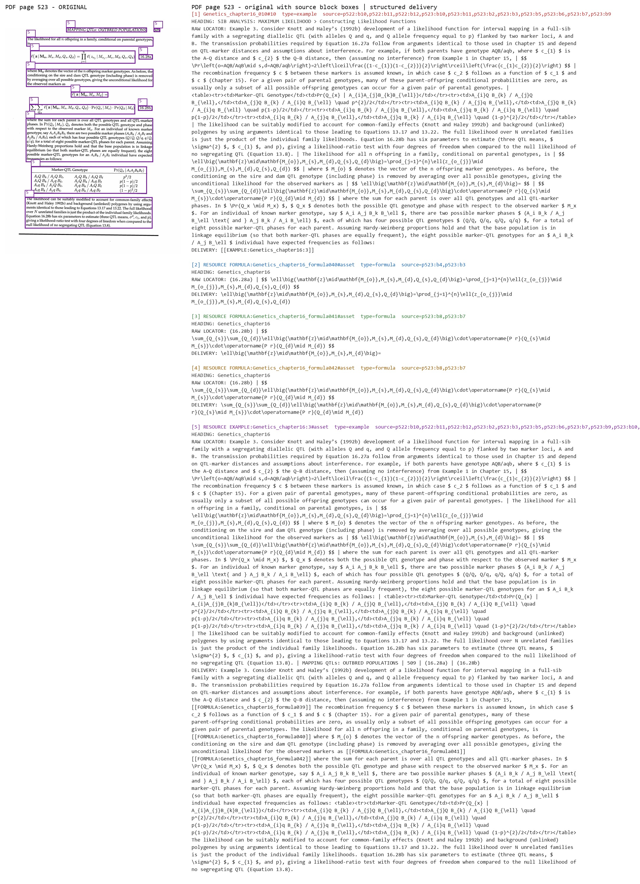
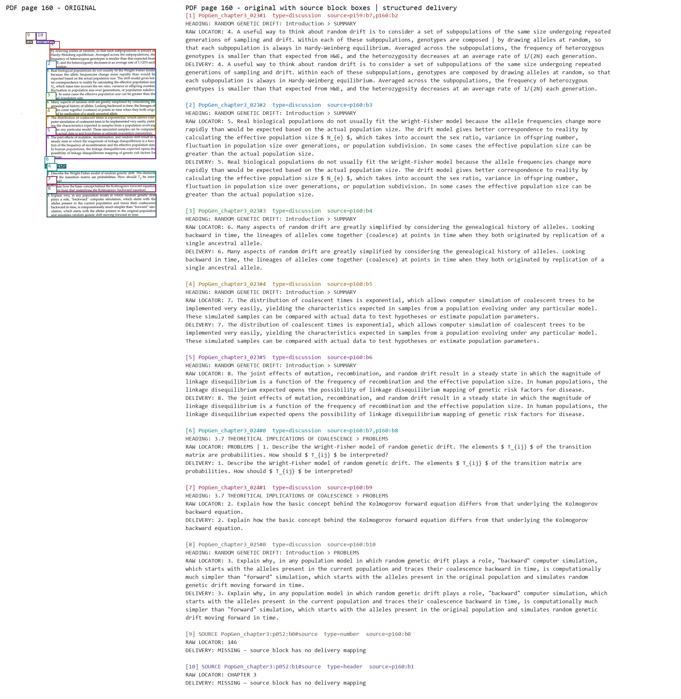

# 教材逐页准确性审计

本流程把可信 chapter PDF 与结构化交付放在同一张证据图中，使每个来源块都能追溯到实际交付内容。正式实现位于 `scripts/audit_book_accuracy.py`，三书配置和人工 correction 位于 `book_audits/`。

## 证据图如何阅读





- 左侧 `PDF page N - ORIGINAL` 是可信母版页的原始渲染。
- 彩色框来自 Paddle source block 的真实 bbox；框内数字是该页证据记录编号。
- 右侧使用相同编号和颜色列出 structured unit/block 或公式、表格、图片、Example 资源。
- `source=pN:bM` 是精确来源定位；跨页资源会列出全部 `source_pages`、`source_block_ids` 和 bbox。
- `RAW LOCATOR` 显示 OCR 来源内容，`DELIVERY` 显示正式结构化交付内容。相似度不能替代这组原文对照。
- `DELIVERY: EXCLUDED` 必须绑定 source ID、bbox 和明确理由。`DELIVERY: MISSING` 是诊断信息；页码、页眉等非实质版式块可能显示为未交付，但任何未覆盖的实质内容都会阻断自动验证。

## 本地输入

以下大文件保留在本地，不进入 Git：

```text
data/背景资料/       可信 chapter PDF
data/paddle_output/  Paddle OCR / LaTeX 及 source block bbox
```

profile 固定每个输入 PDF 的 SHA-256、页数、章节范围、显式排除范围和基准计数。Evolution 没有额外的完整母版要求：审计器按 profile 顺序拼接可信 chapter PDF，并同时校验分片及拼接结果哈希。

## 生成与验证

准备 Python 3.12 环境后，在仓库根目录执行：

```powershell
uv sync --frozen
python scripts/audit_book_accuracy.py build --book all --dpi 72
python scripts/audit_book_accuracy.py verify --book all
python scripts/audit_book_accuracy.py status --book all
```

逐页图片生成到：

```text
tmp/book_audits/Evolution/evidence/page_contacts/sheet_NNN.jpg
tmp/book_audits/Genetics/evidence/page_contacts/sheet_NNN.jpg
tmp/book_audits/PopGen/evidence/page_contacts/sheet_NNN.jpg
```

`build` 会持久化发现、页面证据、资源台账、staging 和 manifest；`verify` 会重新计算 profile、correction、PDF、OCR、页面证据、staging、工具版本和正式交付哈希。任一输入或证据漂移都会使验证失败。

单书确认通过后可执行：

```powershell
python scripts/audit_book_accuracy.py install --book Genetics
```

安装采用可回滚事务，只替换当前书前缀，并验证其他书、可信 PDF 和共享库非当前书条目的哈希不变。正式发布不接受 waiver。

## 复现本页示例

仓库中的两张图片是完整生成结果的固定副本：

| 示例 | 生成来源 |
| --- | --- |
| `genetics-formula-example.jpg` | `tmp/book_audits/Genetics/evidence/page_contacts/sheet_500.jpg`，母版 PDF page 523 |
| `popgen-text-trace.jpg` | `tmp/book_audits/PopGen/evidence/page_contacts/sheet_100.jpg`，母版 PDF page 160 |

删除 `tmp/` 后，重新运行三书 `build` 即可恢复这些路径；在 profile、correction、输入 PDF、Paddle 数据、工具版本和正式交付均未变化时，内容应保持一致。

## 发布与清理

完整发布验收：

```powershell
python scripts/verify_project.py release --build-packs
```

该命令验证 Python/Node、依赖安全、三书审计、全书数学、Reader 确定性、离线静态资源和三个本地 Pack。完整证据和 Pack 都是本地产物；两张示例图、审计代码、profiles/corrections、正式 `data/` 和 Reader 数据才进入 Git。

确认 release 通过并迁出示例后，可以清空 `tmp/`。清理不影响已安装交付，但再次执行三书 `verify` 前必须先重新 `build` 证据。
